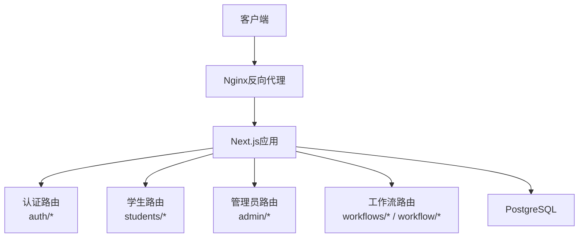
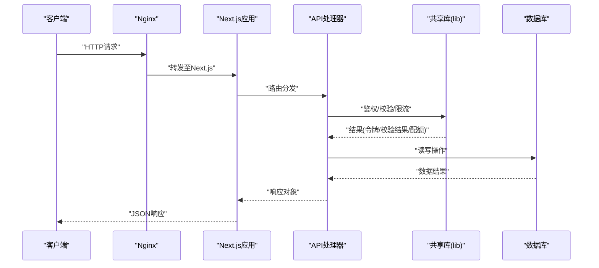
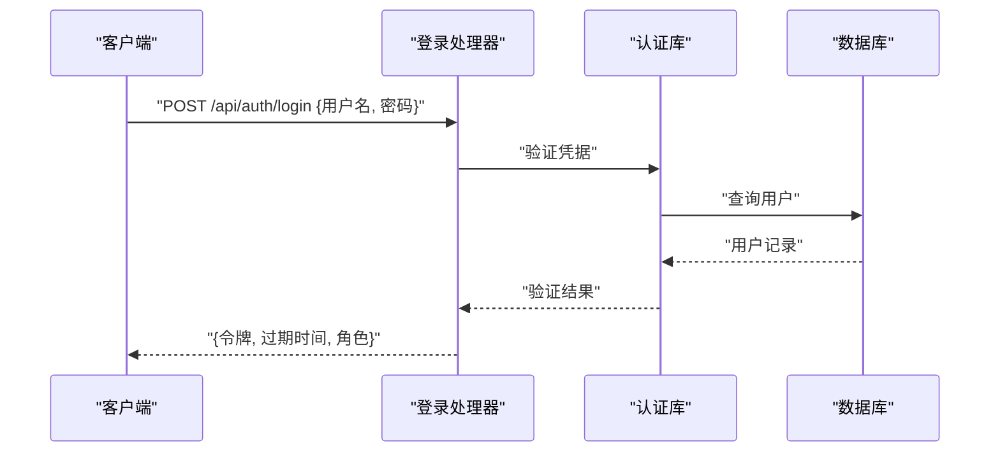
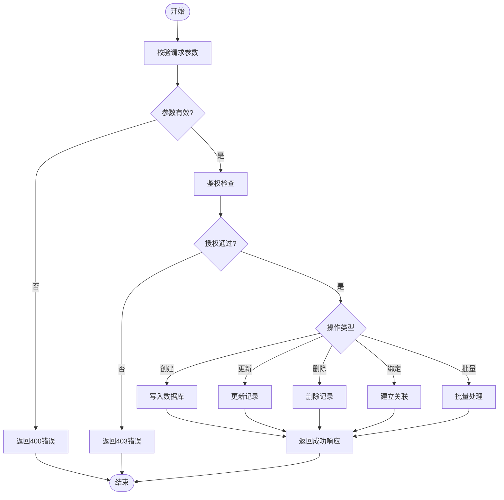
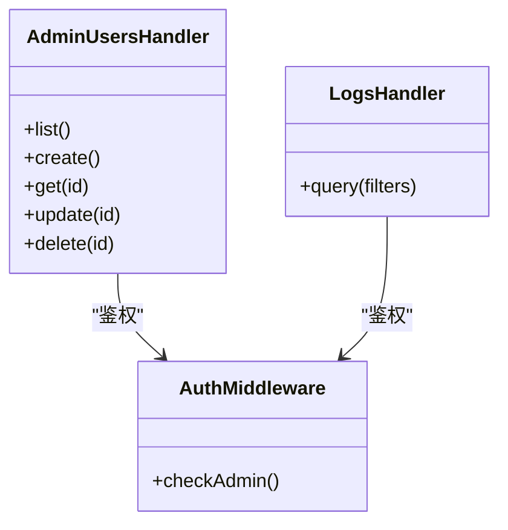
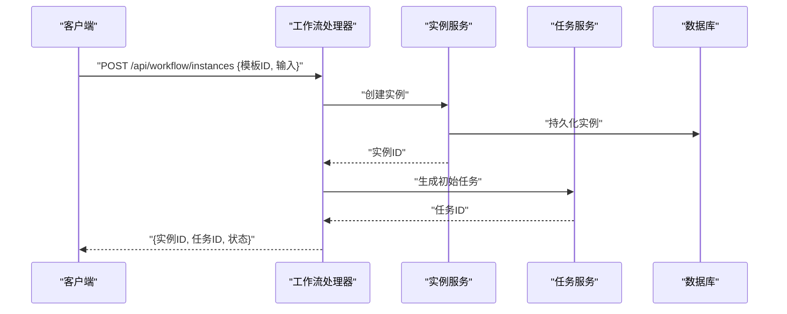
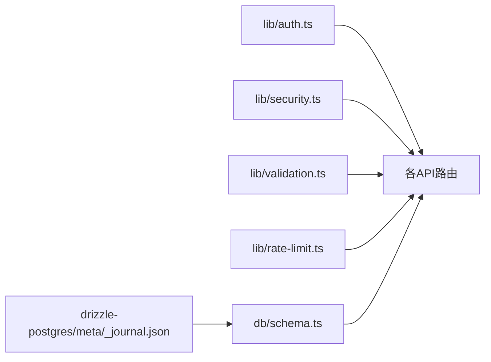

# API参考文档

<cite>
**本文档引用的文件**   
- [app/api/auth/login/route.ts](file://app/api/auth/login/route.ts)
- [app/api/auth/session/route.ts](file://app/api/auth/session/route.ts)
- [app/api/students/route.ts](file://app/api/students/route.ts)
- [app/api/students/[id]/route.ts](file://app/api/students/[id]/route.ts)
- [app/api/students/[id]/link-user/route.ts](file://app/api/students/[id]/link-user/route.ts)
- [app/api/students/batch/route.ts](file://app/api/students/batch/route.ts)
- [app/api/admin/users/route.ts](file://app/api/admin/users/route.ts)
- [app/api/admin/users/[id]/route.ts](file://app/api/admin/users/[id]/route.ts)
- [app/api/admin/logs/route.ts](file://app/api/admin/logs/route.ts)
- [app/api/workflows/route.ts](file://app/api/workflows/route.ts)
- [app/api/workflow/instances/route.ts](file://app/api/workflow/instances/route.ts)
- [app/api/workflow/instances/[id]/route.ts](file://app/api/workflow/instances/[id]/route.ts)
- [app/api/workflow/tasks/route.ts](file://app/api/workflow/tasks/route.ts)
- [lib/auth.ts](file://lib/auth.ts)
- [lib/security.ts](file://lib/security.ts)
- [lib/validation.ts](file://lib/validation.ts)
- [lib/rate-limit.ts](file://lib/rate-limit.ts)
- [db/schema.ts](file://db/schema.ts)
- [drizzle-postgres/meta/_journal.json](file://drizzle-postgres/meta/_journal.json)
- [deploy/nginx.conf](file://deploy/nginx.conf)
- [package.json](file://package.json)
</cite>

## 目录
1. [简介](#简介)
2. [项目结构](#项目结构)
3. [核心组件](#核心组件)
4. [架构总览](#架构总览)
5. [详细组件分析](#详细组件分析)
6. [依赖关系分析](#依赖关系分析)
7. [性能考虑](#性能考虑)
8. [故障排查指南](#故障排查指南)
9. [结论](#结论)
10. [附录](#附录)

## 简介
本文件为CS1学生事务管理系统的API参考文档，面向RESTful接口，覆盖认证、学生数据、管理员操作与工作流等模块。内容包含：
- HTTP方法与URL模式
- 请求与响应模式（字段说明、示例路径）
- 认证与安全策略
- 错误处理与状态码约定
- 速率限制与版本控制
- 常见用例与客户端实现指南
- 性能优化技巧
- 调试与监控建议
- 弃用功能迁移与向后兼容性说明

## 项目结构
系统采用Next.js App Router组织API路由，按功能域划分目录：
- app/api/auth：认证与会话
- app/api/students：学生数据CRUD与批量操作
- app/api/admin：管理员权限相关接口
- app/api/workflows/workflow：工作流定义与实例、任务
- lib：认证、安全、校验、限流等共享库
- db：数据库Schema与迁移元数据

**图表来源** 
- [deploy/nginx.conf](file://deploy/nginx.conf)
- [package.json](file://package.json)

**章节来源**
- [deploy/nginx.conf](file://deploy/nginx.conf)
- [package.json](file://package.json)

## 核心组件
- 认证与会话
  - 登录：POST /api/auth/login
  - 会话：GET /api/auth/session
- 学生数据
  - 列表/创建：GET/POST /api/students
  - 详情/更新/删除：GET/PUT/DELETE /api/students/:id
  - 绑定用户：POST /api/students/:id/link-user
  - 批量导入：POST /api/students/batch
- 管理员
  - 用户管理：GET/POST /api/admin/users；GET/PUT/DELETE /api/admin/users/:id
  - 日志查询：GET /api/admin/logs
- 工作流
  - 流程定义：GET/POST /api/workflows
  - 实例管理：GET/POST /api/workflow/instances；GET/PUT/DELETE /api/workflow/instances/:id
  - 任务管理：GET/POST /api/workflow/tasks

**章节来源**
- [app/api/auth/login/route.ts](file://app/api/auth/login/route.ts)
- [app/api/auth/session/route.ts](file://app/api/auth/session/route.ts)
- [app/api/students/route.ts](file://app/api/students/route.ts)
- [app/api/students/[id]/route.ts](file://app/api/students/[id]/route.ts)
- [app/api/students/[id]/link-user/route.ts](file://app/api/students/[id]/link-user/route.ts)
- [app/api/students/batch/route.ts](file://app/api/students/batch/route.ts)
- [app/api/admin/users/route.ts](file://app/api/admin/users/route.ts)
- [app/api/admin/users/[id]/route.ts](file://app/api/admin/users/[id]/route.ts)
- [app/api/admin/logs/route.ts](file://app/api/admin/logs/route.ts)
- [app/api/workflows/route.ts](file://app/api/workflows/route.ts)
- [app/api/workflow/instances/route.ts](file://app/api/workflow/instances/route.ts)
- [app/api/workflow/instances/[id]/route.ts](file://app/api/workflow/instances/[id]/route.ts)
- [app/api/workflow/tasks/route.ts](file://app/api/workflow/tasks/route.ts)

## 架构总览
整体调用链：客户端通过Nginx进入Next.js应用，路由到对应API handler，handler执行鉴权、参数校验、业务逻辑与数据库访问，返回结构化JSON响应。

**图表来源** 
- [deploy/nginx.conf](file://deploy/nginx.conf)
- [lib/auth.ts](file://lib/auth.ts)
- [lib/security.ts](file://lib/security.ts)
- [lib/validation.ts](file://lib/validation.ts)
- [lib/rate-limit.ts](file://lib/rate-limit.ts)

## 详细组件分析

### 认证与会话
- 登录 POST /api/auth/login
  - 用途：提交用户名与密码获取访问令牌或会话信息
  - 请求体：用户名、密码（具体字段以实际实现为准）
  - 响应：令牌或会话标识、过期时间、角色信息
  - 错误：无效凭据、账户锁定、系统异常
- 会话 GET /api/auth/session
  - 用途：校验当前会话有效性并返回用户上下文
  - 认证：需携带有效令牌或Cookie
  - 响应：用户基本信息、权限范围、会话剩余有效期

**图表来源** 
- [app/api/auth/login/route.ts](file://app/api/auth/login/route.ts)
- [lib/auth.ts](file://lib/auth.ts)
- [db/schema.ts](file://db/schema.ts)

**章节来源**
- [app/api/auth/login/route.ts](file://app/api/auth/login/route.ts)
- [app/api/auth/session/route.ts](file://app/api/auth/session/route.ts)
- [lib/auth.ts](file://lib/auth.ts)

### 学生数据
- 列表/创建 GET/POST /api/students
  - 列表：支持分页、筛选、排序
  - 创建：单条新增，需校验必填字段
- 详情/更新/删除 GET/PUT/DELETE /api/students/:id
  - 详情：返回学生完整信息
  - 更新：部分或全量更新，需权限校验
  - 删除：软删除或硬删除（依实现）
- 绑定用户 POST /api/students/:id/link-user
  - 用途：将学生账号与系统用户关联
  - 请求体：用户ID或邮箱等标识
- 批量导入 POST /api/students/batch
  - 用途：批量导入学生数据（CSV/JSON）
  - 请求体：文件流或数组对象
  - 响应：导入统计、失败明细

**图表来源** 
- [app/api/students/route.ts](file://app/api/students/route.ts)
- [app/api/students/[id]/route.ts](file://app/api/students/[id]/route.ts)
- [app/api/students/[id]/link-user/route.ts](file://app/api/students/[id]/link-user/route.ts)
- [app/api/students/batch/route.ts](file://app/api/students/batch/route.ts)
- [lib/validation.ts](file://lib/validation.ts)

**章节来源**
- [app/api/students/route.ts](file://app/api/students/route.ts)
- [app/api/students/[id]/route.ts](file://app/api/students/[id]/route.ts)
- [app/api/students/[id]/link-user/route.ts](file://app/api/students/[id]/link-user/route.ts)
- [app/api/students/batch/route.ts](file://app/api/students/batch/route.ts)
- [lib/validation.ts](file://lib/validation.ts)

### 管理员
- 用户管理 GET/POST /api/admin/users；GET/PUT/DELETE /api/admin/users/:id
  - 权限：仅管理员可访问
  - 能力：用户列表、创建、查看、更新、删除
- 日志查询 GET /api/admin/logs
  - 能力：按时间、级别、模块过滤日志

**图表来源** 
- [app/api/admin/users/route.ts](file://app/api/admin/users/route.ts)
- [app/api/admin/users/[id]/route.ts](file://app/api/admin/users/[id]/route.ts)
- [app/api/admin/logs/route.ts](file://app/api/admin/logs/route.ts)
- [lib/auth.ts](file://lib/auth.ts)

**章节来源**
- [app/api/admin/users/route.ts](file://app/api/admin/users/route.ts)
- [app/api/admin/users/[id]/route.ts](file://app/api/admin/users/[id]/route.ts)
- [app/api/admin/logs/route.ts](file://app/api/admin/logs/route.ts)
- [lib/auth.ts](file://lib/auth.ts)

### 工作流
- 流程定义 GET/POST /api/workflows
  - 能力：列出与创建工作流模板
- 实例管理 GET/POST /api/workflow/instances；GET/PUT/DELETE /api/workflow/instances/:id
  - 能力：创建实例、查询状态、更新节点、终止实例
- 任务管理 GET/POST /api/workflow/tasks
  - 能力：分配与完成任务、查询任务队列

**图表来源** 
- [app/api/workflows/route.ts](file://app/api/workflows/route.ts)
- [app/api/workflow/instances/route.ts](file://app/api/workflow/instances/route.ts)
- [app/api/workflow/instances/[id]/route.ts](file://app/api/workflow/instances/[id]/route.ts)
- [app/api/workflow/tasks/route.ts](file://app/api/workflow/tasks/route.ts)
- [db/schema.ts](file://db/schema.ts)

**章节来源**
- [app/api/workflows/route.ts](file://app/api/workflows/route.ts)
- [app/api/workflow/instances/route.ts](file://app/api/workflow/instances/route.ts)
- [app/api/workflow/instances/[id]/route.ts](file://app/api/workflow/instances/[id]/route.ts)
- [app/api/workflow/tasks/route.ts](file://app/api/workflow/tasks/route.ts)
- [db/schema.ts](file://db/schema.ts)

## 依赖关系分析
- 认证依赖：lib/auth.ts用于令牌签发与校验
- 安全依赖：lib/security.ts提供输入净化、防注入、跨域配置
- 校验依赖：lib/validation.ts对请求体进行结构化校验
- 限流依赖：lib/rate-limit.ts基于IP或用户维度限制请求频率
- 数据模型：db/schema.ts定义表结构与约束
- 迁移元数据：drizzle-postgres/meta/_journal.json记录迁移历史

**图表来源** 
- [lib/auth.ts](file://lib/auth.ts)
- [lib/security.ts](file://lib/security.ts)
- [lib/validation.ts](file://lib/validation.ts)
- [lib/rate-limit.ts](file://lib/rate-limit.ts)
- [db/schema.ts](file://db/schema.ts)
- [drizzle-postgres/meta/_journal.json](file://drizzle-postgres/meta/_journal.json)

**章节来源**
- [lib/auth.ts](file://lib/auth.ts)
- [lib/security.ts](file://lib/security.ts)
- [lib/validation.ts](file://lib/validation.ts)
- [lib/rate-limit.ts](file://lib/rate-limit.ts)
- [db/schema.ts](file://db/schema.ts)
- [drizzle-postgres/meta/_journal.json](file://drizzle-postgres/meta/_journal.json)

## 性能考虑
- 缓存策略
  - 对静态或低频变更数据启用服务端缓存与ETag
  - 使用浏览器缓存控制响应头
- 数据库优化
  - 合理索引查询字段（如学生ID、状态、时间戳）
  - 分页与投影减少数据传输
- 并发与限流
  - 使用lib/rate-limit.ts保护热点接口
  - 批量接口采用异步任务与队列处理
- 网络与代理
  - Nginx层开启gzip压缩与连接复用
  - 合理设置超时与重试策略

[本节为通用指导，不直接分析具体文件]

## 故障排查指南
- 常见问题定位
  - 认证失败：检查令牌格式、过期时间与权限范围
  - 参数校验错误：核对请求体字段与类型
  - 限流触发：观察响应头中的限流信息，调整客户端重试间隔
- 调试工具
  - 使用浏览器开发者工具或curl查看请求/响应头与状态码
  - 后端日志通过管理员日志接口或服务器日志收集
- 监控方法
  - 关键指标：QPS、延迟分布、错误率、数据库慢查询
  - 告警规则：阈值触发通知，快速定位瓶颈

**章节来源**
- [app/api/admin/logs/route.ts](file://app/api/admin/logs/route.ts)
- [lib/rate-limit.ts](file://lib/rate-limit.ts)
- [lib/validation.ts](file://lib/validation.ts)
- [lib/auth.ts](file://lib/auth.ts)

## 结论
本参考文档梳理了CS1学生事务管理系统的主要API及其交互方式，涵盖认证、学生数据、管理员与工作流模块。建议在客户端实现中遵循统一的错误处理与重试策略，结合限流与缓存提升稳定性与性能。生产环境应完善监控与日志采集，确保问题可追溯与快速恢复。

[本节为总结性内容，不直接分析具体文件]

## 附录

### 认证与安全
- 认证方法
  - 推荐Bearer Token或HttpOnly Cookie
  - 会话刷新机制与令牌轮换
- 安全考虑
  - 输入净化与SQL注入防护
  - CORS白名单与HTTPS强制
  - 敏感字段脱敏输出

**章节来源**
- [lib/auth.ts](file://lib/auth.ts)
- [lib/security.ts](file://lib/security.ts)

### 错误处理策略
- 统一状态码
  - 4xx客户端错误、5xx服务端错误
- 错误体结构
  - code、message、details、traceId
- 重试与降级
  - 幂等接口支持重试
  - 非关键路径降级策略

**章节来源**
- [lib/validation.ts](file://lib/validation.ts)
- [lib/security.ts](file://lib/security.ts)

### 速率限制与版本控制
- 速率限制
  - 基于IP或用户维度的窗口计数
  - 响应头包含剩余配额与重置时间
- 版本控制
  - URL前缀或Accept头部版本协商
  - 向后兼容策略与弃用公告

**章节来源**
- [lib/rate-limit.ts](file://lib/rate-limit.ts)

### 常见用例与客户端实现指南
- 登录与保存令牌
  - 登录后存储令牌并在后续请求头携带
- 分页与筛选
  - 使用page、pageSize、filter参数
- 批量导入
  - 分片上传与进度回调
  - 失败重试与差异对比

[本节为通用指导，不直接分析具体文件]

### 调试与监控
- 调试工具
  - curl、Postman、浏览器Network面板
- 监控指标
  - 接口成功率、P95/P99延迟、数据库连接池使用率
- 日志规范
  - 结构化日志、TraceID贯穿链路

[本节为通用指导，不直接分析具体文件]

### 弃用与迁移指南
- 弃用策略
  - 明确弃用时间表与替代接口
  - 响应头X-Deprecation提示
- 迁移步骤
  - 逐步切换至新版本接口
  - 灰度发布与回滚预案

[本节为通用指导，不直接分析具体文件]