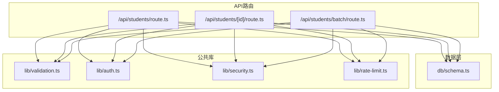
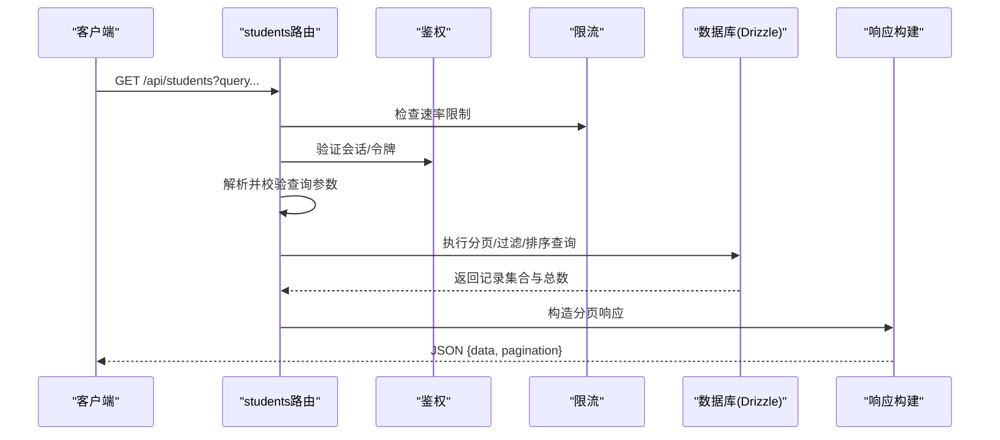
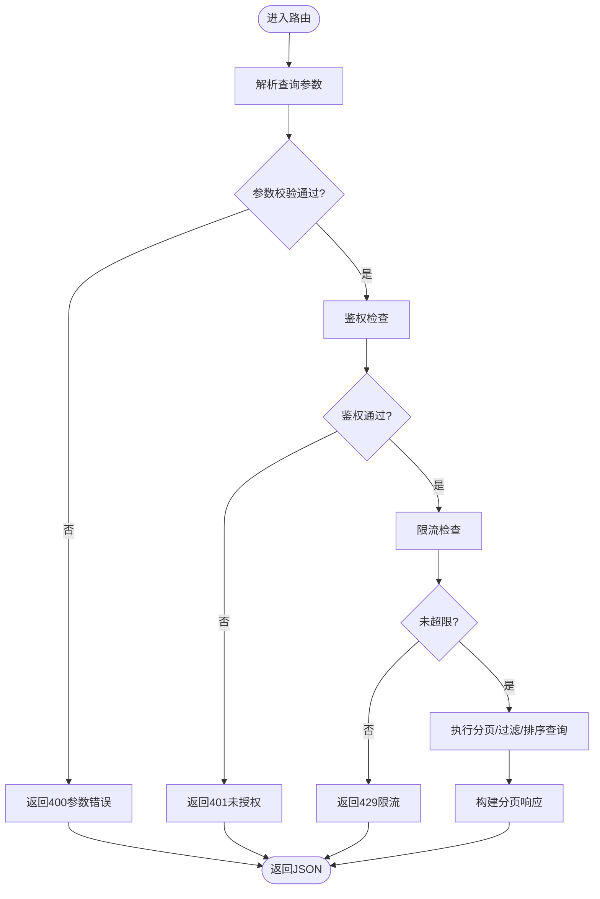
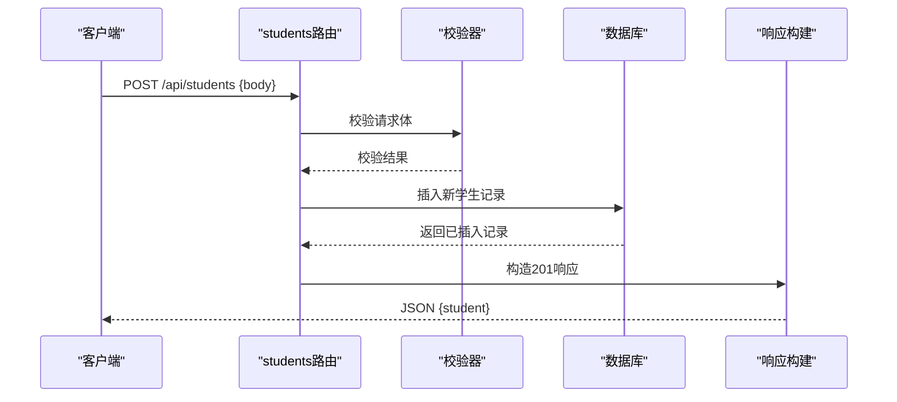
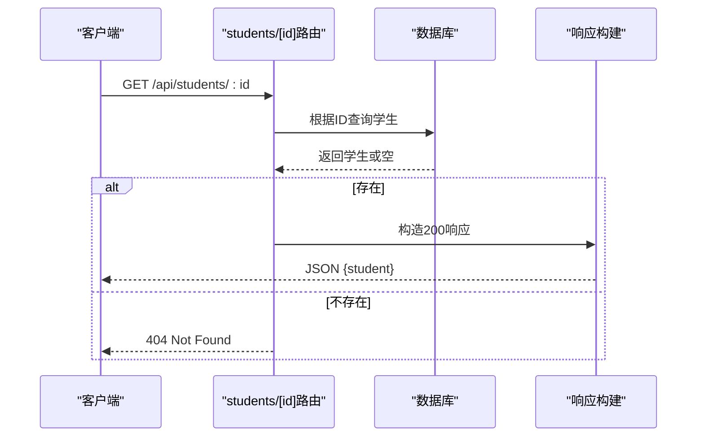
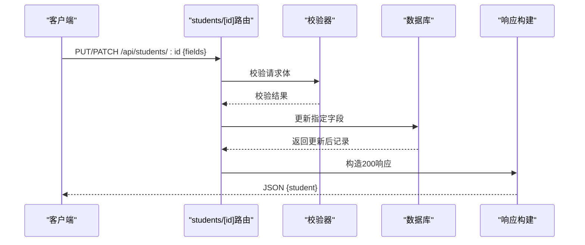
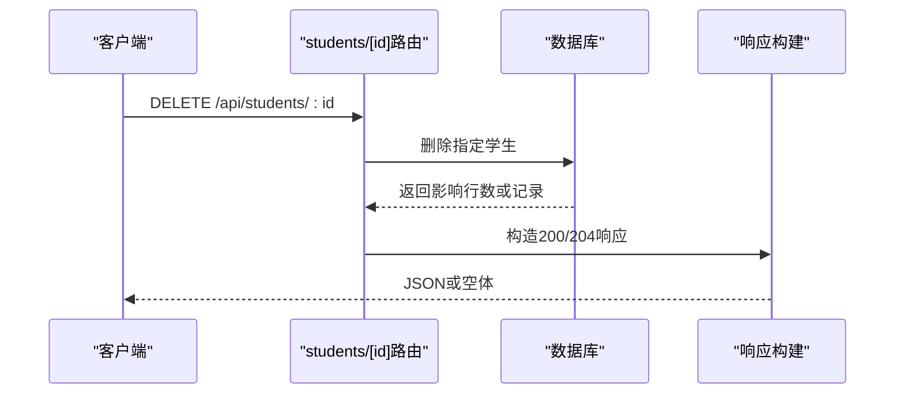
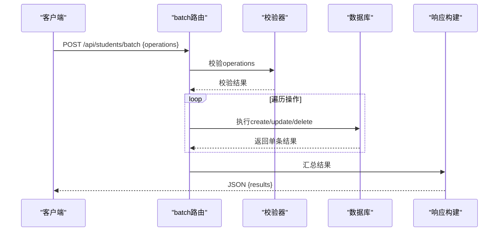
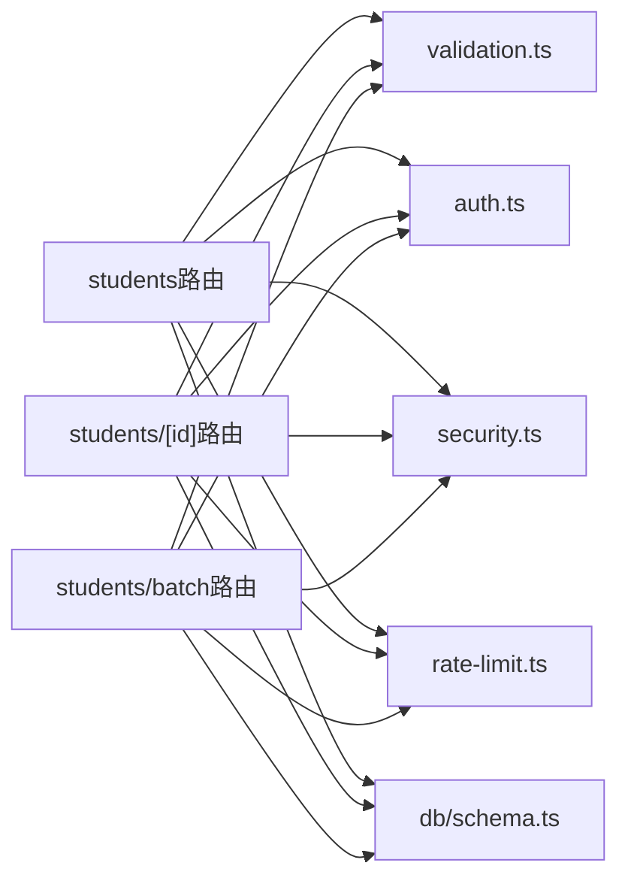

# 学生基础CRUD操作

<cite>
**本文档引用的文件**   
- [app/api/students/route.ts](file://app/api/students/route.ts)
- [app/api/students/[id]/route.ts](file://app/api/students/[id]/route.ts)
- [app/api/students/batch/route.ts](file://app/api/students/batch/route.ts)
- [db/schema.ts](file://db/schema.ts)
- [lib/validation.ts](file://lib/validation.ts)
- [lib/auth.ts](file://lib/auth.ts)
- [lib/security.ts](file://lib/security.ts)
- [lib/rate-limit.ts](file://lib/rate-limit.ts)
</cite>

## 目录
1. [简介](#简介)
2. [项目结构](#项目结构)
3. [核心组件](#核心组件)
4. [架构总览](#架构总览)
5. [详细接口分析](#详细接口分析)
6. [依赖关系分析](#依赖关系分析)
7. [性能考虑](#性能考虑)
8. [故障排查指南](#故障排查指南)
9. [结论](#结论)

## 简介
本文件面向学生管理模块的API，聚焦基础CRUD与高级查询能力。内容覆盖：
- 获取学生列表（GET /api/students）
- 创建学生（POST /api/students）
- 获取单个学生（GET /api/students/[id]）
- 更新学生信息（PUT/PATCH /api/students/[id]）
- 删除学生（DELETE /api/students/[id]）
- 批量操作（POST /api/students/batch）
- 分页、搜索过滤、排序等高级查询参数与行为说明

## 项目结构
学生相关API位于Next.js App Router的app/api目录下，采用按功能划分的路由组织方式。数据模型定义在db/schema.ts中，输入校验与通用逻辑集中在lib目录。

图表来源
- [app/api/students/route.ts](file://app/api/students/route.ts)
- [app/api/students/[id]/route.ts](file://app/api/students/[id]/route.ts)
- [app/api/students/batch/route.ts](file://app/api/students/batch/route.ts)
- [db/schema.ts](file://db/schema.ts)
- [lib/validation.ts](file://lib/validation.ts)
- [lib/auth.ts](file://lib/auth.ts)
- [lib/security.ts](file://lib/security.ts)
- [lib/rate-limit.ts](file://lib/rate-limit.ts)

章节来源
- [app/api/students/route.ts](file://app/api/students/route.ts)
- [app/api/students/[id]/route.ts](file://app/api/students/[id]/route.ts)
- [app/api/students/batch/route.ts](file://app/api/students/batch/route.ts)
- [db/schema.ts](file://db/schema.ts)
- [lib/validation.ts](file://lib/validation.ts)
- [lib/auth.ts](file://lib/auth.ts)
- [lib/security.ts](file://lib/security.ts)
- [lib/rate-limit.ts](file://lib/rate-limit.ts)

## 核心组件
- API路由层：处理HTTP请求、解析参数、鉴权、限流、调用服务与数据库、返回响应。
- 数据模型层：使用Drizzle ORM定义学生表结构与字段约束。
- 校验层：统一对请求体与查询参数进行类型与规则校验。
- 安全与鉴权：基于中间件或工具函数实现身份认证与权限控制。
- 限流：对高频接口进行速率限制保护。

章节来源
- [app/api/students/route.ts](file://app/api/students/route.ts)
- [app/api/students/[id]/route.ts](file://app/api/students/[id]/route.ts)
- [app/api/students/batch/route.ts](file://app/api/students/batch/route.ts)
- [db/schema.ts](file://db/schema.ts)
- [lib/validation.ts](file://lib/validation.ts)
- [lib/auth.ts](file://lib/auth.ts)
- [lib/security.ts](file://lib/security.ts)
- [lib/rate-limit.ts](file://lib/rate-limit.ts)

## 架构总览
下图展示一次“获取学生列表”的典型调用链：客户端发起请求，路由层完成鉴权与限流，解析并校验查询参数，执行数据库查询，最后返回JSON响应。

图表来源
- [app/api/students/route.ts](file://app/api/students/route.ts)
- [lib/auth.ts](file://lib/auth.ts)
- [lib/rate-limit.ts](file://lib/rate-limit.ts)
- [db/schema.ts](file://db/schema.ts)

## 详细接口分析

### 获取学生列表（GET /api/students）
- 方法：GET
- URL：/api/students
- 查询参数
  - 分页：page（默认1）、pageSize（默认20）
  - 排序：sortBy（如id/name等）、order（asc/desc）
  - 搜索过滤：q（模糊匹配姓名/学号等）、status（状态筛选）、classId（班级筛选）等
- 成功响应：JSON对象包含data数组与pagination元信息（total、page、pageSize、hasMore等）
- 错误响应：标准错误码与消息（如400参数错误、401未授权、429限流、500服务器错误）

图表来源
- [app/api/students/route.ts](file://app/api/students/route.ts)
- [lib/validation.ts](file://lib/validation.ts)
- [lib/auth.ts](file://lib/auth.ts)
- [lib/rate-limit.ts](file://lib/rate-limit.ts)

章节来源
- [app/api/students/route.ts](file://app/api/students/route.ts)
- [lib/validation.ts](file://lib/validation.ts)

### 创建学生（POST /api/students）
- 方法：POST
- URL：/api/students
- 请求体字段（示例）
  - name（必填，字符串）
  - studentNo（必填，唯一学号）
  - status（可选，枚举）
  - classId（可选，关联ID）
  - 其他扩展字段依schema而定
- 成功响应：返回新建学生对象的完整数据
- 错误响应：400（校验失败/重复键）、401（未授权）、429（限流）、500（服务器错误）

图表来源
- [app/api/students/route.ts](file://app/api/students/route.ts)
- [lib/validation.ts](file://lib/validation.ts)
- [db/schema.ts](file://db/schema.ts)

章节来源
- [app/api/students/route.ts](file://app/api/students/route.ts)
- [lib/validation.ts](file://lib/validation.ts)
- [db/schema.ts](file://db/schema.ts)

### 获取单个学生（GET /api/students/[id]）
- 方法：GET
- URL：/api/students/[id]
- 路径参数：id（学生ID，必填）
- 成功响应：返回单个学生对象
- 错误响应：400（无效ID）、401（未授权）、404（不存在）、500（服务器错误）

图表来源
- [app/api/students/[id]/route.ts](file://app/api/students/[id]/route.ts)
- [db/schema.ts](file://db/schema.ts)

章节来源
- [app/api/students/[id]/route.ts](file://app/api/students/[id]/route.ts)

### 更新学生信息（PUT/PATCH /api/students/[id]）
- 方法：PUT或PATCH
- URL：/api/students/[id]
- 路径参数：id（学生ID，必填）
- 请求体：可更新的字段集合（部分更新推荐PATCH）
- 成功响应：返回更新后的学生对象
- 错误响应：400（校验失败）、401（未授权）、404（不存在）、500（服务器错误）

图表来源
- [app/api/students/[id]/route.ts](file://app/api/students/[id]/route.ts)
- [lib/validation.ts](file://lib/validation.ts)
- [db/schema.ts](file://db/schema.ts)

章节来源
- [app/api/students/[id]/route.ts](file://app/api/students/[id]/route.ts)
- [lib/validation.ts](file://lib/validation.ts)

### 删除学生（DELETE /api/students/[id]）
- 方法：DELETE
- URL：/api/students/[id]
- 路径参数：id（学生ID，必填）
- 成功响应：返回删除确认或已删除对象
- 错误响应：401（未授权）、404（不存在）、500（服务器错误）

图表来源
- [app/api/students/[id]/route.ts](file://app/api/students/[id]/route.ts)
- [db/schema.ts](file://db/schema.ts)

章节来源
- [app/api/students/[id]/route.ts](file://app/api/students/[id]/route.ts)

### 批量操作（POST /api/students/batch）
- 方法：POST
- URL：/api/students/batch
- 请求体：operations数组，每项包含type（create/update/delete）与对应数据
- 成功响应：返回每条操作的执行结果（success/failure及原因）
- 错误响应：400（参数错误）、401（未授权）、429（限流）、500（服务器错误）

图表来源
- [app/api/students/batch/route.ts](file://app/api/students/batch/route.ts)
- [lib/validation.ts](file://lib/validation.ts)
- [db/schema.ts](file://db/schema.ts)

章节来源
- [app/api/students/batch/route.ts](file://app/api/students/batch/route.ts)
- [lib/validation.ts](file://lib/validation.ts)

## 依赖关系分析
- 路由层依赖：
  - 鉴权：lib/auth.ts
  - 限流：lib/rate-limit.ts
  - 校验：lib/validation.ts
  - 安全：lib/security.ts
  - 数据模型：db/schema.ts

图表来源
- [app/api/students/route.ts](file://app/api/students/route.ts)
- [app/api/students/[id]/route.ts](file://app/api/students/[id]/route.ts)
- [app/api/students/batch/route.ts](file://app/api/students/batch/route.ts)
- [lib/validation.ts](file://lib/validation.ts)
- [lib/auth.ts](file://lib/auth.ts)
- [lib/security.ts](file://lib/security.ts)
- [lib/rate-limit.ts](file://lib/rate-limit.ts)
- [db/schema.ts](file://db/schema.ts)

章节来源
- [app/api/students/route.ts](file://app/api/students/route.ts)
- [app/api/students/[id]/route.ts](file://app/api/students/[id]/route.ts)
- [app/api/students/batch/route.ts](file://app/api/students/batch/route.ts)
- [lib/validation.ts](file://lib/validation.ts)
- [lib/auth.ts](file://lib/auth.ts)
- [lib/security.ts](file://lib/security.ts)
- [lib/rate-limit.ts](file://lib/rate-limit.ts)
- [db/schema.ts](file://db/schema.ts)

## 性能考虑
- 分页查询：合理设置pageSize避免一次性加载过多数据；优先使用数据库侧分页。
- 索引优化：对常用过滤字段（如studentNo、status、classId）建立索引以提升查询性能。
- 缓存策略：对热点读接口（如列表页）引入缓存层（内存或Redis），降低数据库压力。
- 批量操作：尽量使用批量写入减少往返次数，注意事务一致性。
- 限流保护：对写接口与批量接口启用更严格的限流策略，防止滥用。

[本节为通用指导，不直接分析具体文件]

## 故障排查指南
- 常见错误码
  - 400：参数校验失败或重复键冲突
  - 401：未提供有效凭证或会话过期
  - 404：资源不存在
  - 429：触发限流
  - 500：服务器内部错误
- 排查步骤
  - 检查请求参数是否符合校验规则（字段类型、必填、长度、格式）
  - 确认鉴权头与会话是否有效
  - 查看数据库连接与事务日志
  - 检查限流配置与阈值
  - 定位异常堆栈与错误消息

章节来源
- [lib/validation.ts](file://lib/validation.ts)
- [lib/auth.ts](file://lib/auth.ts)
- [lib/security.ts](file://lib/security.ts)
- [lib/rate-limit.ts](file://lib/rate-limit.ts)

## 结论
学生管理API围绕RESTful设计原则，结合统一的鉴权、限流与校验机制，提供稳定可靠的CRUD与批量操作能力。通过合理的分页、过滤与排序参数，满足复杂查询场景。建议在生产环境完善索引与缓存策略，并对敏感接口加强安全与限流保护。

[本节为总结性内容，不直接分析具体文件]