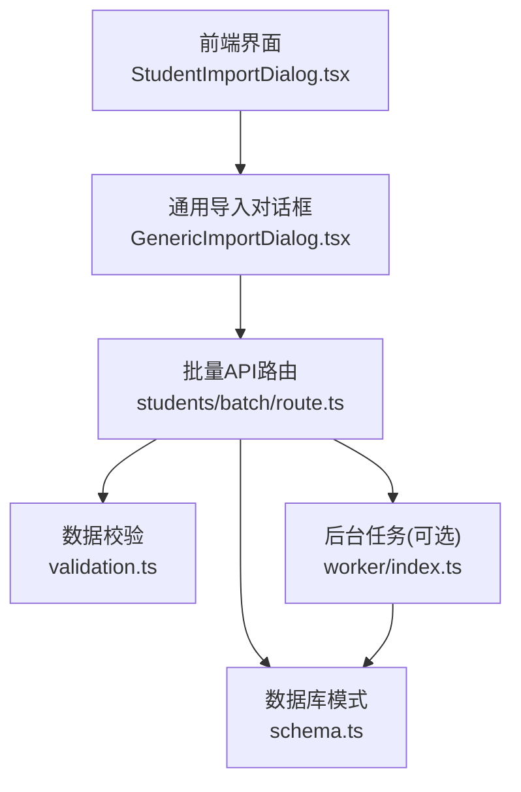
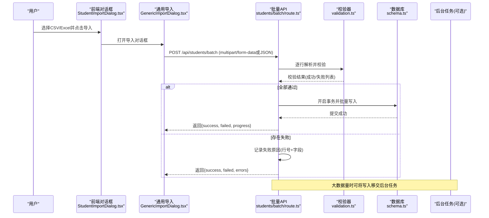
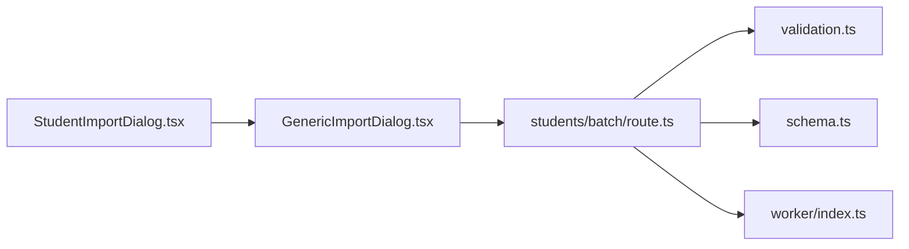

# 学生批量操作

<cite>
**本文引用的文件**   
- [app/api/students/batch/route.ts](file://app/api/students/batch/route.ts)
- [app/api/students/route.ts](file://app/api/students/route.ts)
- [app/components/student/StudentImportDialog.tsx](file://app/components/student/StudentImportDialog.tsx)
- [app/components/generic/GenericImportDialog.tsx](file://app/components/generic/GenericImportDialog.tsx)
- [lib/validation.ts](file://lib/validation.ts)
- [db/schema.ts](file://db/schema.ts)
- [tests/fixtures/students-valid.csv](file://tests/fixtures/students-valid.csv)
- [tests/app/student-import.test.ts](file://tests/app/student-import.test.ts)
</cite>

## 目录
1. [简介](#简介)
2. [项目结构](#项目结构)
3. [核心组件](#核心组件)
4. [架构总览](#架构总览)
5. [详细组件分析](#详细组件分析)
6. [依赖关系分析](#依赖关系分析)
7. [性能考虑](#性能考虑)
8. [故障排查指南](#故障排查指南)
9. [结论](#结论)
10. [附录](#附录)

## 简介
本文件面向“学生管理”模块的批量操作能力，覆盖以下目标：
- 接口规范：批量创建（POST /api/students/batch）、批量更新、批量删除。
- 数据格式：批量导入CSV与JSON的数据结构、字段校验规则、错误定位。
- 事务处理：保证批量操作的原子性与一致性。
- 性能优化：分页/分片写入、并发控制、索引建议。
- 进度反馈：长任务进度上报机制。
- 冲突解决：唯一键冲突策略与回滚/跳过策略。
- 使用示例：前端导入对话框与后端接口的交互流程。

## 项目结构
围绕学生批量操作的关键位置如下：
- API路由：app/api/students/batch/route.ts（批量入口）
- 单条学生API：app/api/students/route.ts（参考单条逻辑）
- 前端导入对话框：app/components/student/StudentImportDialog.tsx、app/components/generic/GenericImportDialog.tsx
- 数据校验：lib/validation.ts
- 数据库模式：db/schema.ts
- 测试与样例：tests/fixtures/students-valid.csv、tests/app/student-import.test.ts

图表来源
- [app/components/student/StudentImportDialog.tsx](file://app/components/student/StudentImportDialog.tsx)
- [app/components/generic/GenericImportDialog.tsx](file://app/components/generic/GenericImportDialog.tsx)
- [app/api/students/batch/route.ts](file://app/api/students/batch/route.ts)
- [lib/validation.ts](file://lib/validation.ts)
- [db/schema.ts](file://db/schema.ts)
- [worker/index.ts](file://worker/index.ts)

章节来源
- [app/api/students/batch/route.ts](file://app/api/students/batch/route.ts)
- [app/api/students/route.ts](file://app/api/students/route.ts)
- [app/components/student/StudentImportDialog.tsx](file://app/components/student/StudentImportDialog.tsx)
- [app/components/generic/GenericImportDialog.tsx](file://app/components/generic/GenericImportDialog.tsx)
- [lib/validation.ts](file://lib/validation.ts)
- [db/schema.ts](file://db/schema.ts)
- [tests/fixtures/students-valid.csv](file://tests/fixtures/students-valid.csv)
- [tests/app/student-import.test.ts](file://tests/app/student-import.test.ts)

## 核心组件
- 批量API路由（students/batch/route.ts）
  - 职责：接收批量请求（CSV/JSON），解析与校验，组织事务写入，返回结果与进度。
  - 关键点：流式读取、分批提交、错误聚合、幂等键支持。
- 数据校验（validation.ts）
  - 职责：定义字段类型、必填、长度、枚举、正则等校验；提供结构化错误信息。
- 数据库模式（schema.ts）
  - 职责：定义学生表结构与约束（如唯一键、非空、外键）。
- 前端导入对话框（StudentImportDialog.tsx、GenericImportDialog.tsx）
  - 职责：选择文件、预览、校验提示、发起批量导入、展示进度与结果。

章节来源
- [app/api/students/batch/route.ts](file://app/api/students/batch/route.ts)
- [lib/validation.ts](file://lib/validation.ts)
- [db/schema.ts](file://db/schema.ts)
- [app/components/student/StudentImportDialog.tsx](file://app/components/student/StudentImportDialog.tsx)
- [app/components/generic/GenericImportDialog.tsx](file://app/components/generic/GenericImportDialog.tsx)

## 架构总览
批量导入的整体调用链如下：

图表来源
- [app/components/student/StudentImportDialog.tsx](file://app/components/student/StudentImportDialog.tsx)
- [app/components/generic/GenericImportDialog.tsx](file://app/components/generic/GenericImportDialog.tsx)
- [app/api/students/batch/route.ts](file://app/api/students/batch/route.ts)
- [lib/validation.ts](file://lib/validation.ts)
- [db/schema.ts](file://db/schema.ts)
- [worker/index.ts](file://worker/index.ts)

## 详细组件分析

### 批量创建接口（POST /api/students/batch）
- 请求方式与内容类型
  - multipart/form-data：上传CSV/Excel文件，包含字段映射与选项。
  - application/json：直接提交JSON数组。
- 请求体字段（JSON示例字段名）
  - students: 对象数组，每个对象代表一条学生记录。
  - options: 配置项，如 conflictStrategy（ignore/skip/update/rollback）、batchSize、progressInterval。
- 响应体
  - success: 成功数量
  - failed: 失败数量
  - errors: 失败明细（行号、字段、错误消息）
  - taskId: 异步任务ID（当启用后台任务时）
  - progress: 进度对象（当前批次、已处理、总数、状态）
- 错误码
  - 400：请求体非法、字段校验失败
  - 409：唯一键冲突（根据conflictStrategy决定）
  - 500：服务器内部错误（数据库异常、IO异常）

章节来源
- [app/api/students/batch/route.ts](file://app/api/students/batch/route.ts)
- [lib/validation.ts](file://lib/validation.ts)
- [db/schema.ts](file://db/schema.ts)

### 批量更新接口（PUT/PATCH /api/students/batch）
- 请求体
  - students: 对象数组，至少包含主键与待更新字段。
  - options: 同批量创建，支持部分更新策略。
- 行为
  - 按主键匹配记录进行更新。
  - 未命中主键的记录计入失败明细。
  - 支持增量字段合并与只更新指定字段。

章节来源
- [app/api/students/batch/route.ts](file://app/api/students/batch/route.ts)
- [lib/validation.ts](file://lib/validation.ts)

### 批量删除接口（DELETE /api/students/batch）
- 请求体
  - ids: 主键数组
  - options: 软删除开关、级联策略
- 行为
  - 按主键批量删除或标记为已删除。
  - 不存在的主键计入失败明细。

章节来源
- [app/api/students/batch/route.ts](file://app/api/students/batch/route.ts)

### CSV导入与解析
- 文件格式
  - 首行为列头，对应字段映射（如学号、姓名、班级、邮箱等）。
  - 支持UTF-8编码，分隔符逗号或制表符。
- 字段映射
  - 允许自定义映射，将CSV列名映射到系统字段。
- 解析策略
  - 流式解析，避免一次性加载大文件。
  - 行级校验，收集失败行号与原因。

章节来源
- [app/components/student/StudentImportDialog.tsx](file://app/components/student/StudentImportDialog.tsx)
- [app/components/generic/GenericImportDialog.tsx](file://app/components/generic/GenericImportDialog.tsx)
- [tests/fixtures/students-valid.csv](file://tests/fixtures/students-valid.csv)

### 数据验证
- 校验维度
  - 必填、类型、长度、范围、枚举、正则表达式。
  - 业务规则（如邮箱唯一性、学号格式）。
- 错误输出
  - 结构化错误：行号、字段、错误类型、人类可读消息。
- 性能
  - 预编译校验规则，减少重复开销。

章节来源
- [lib/validation.ts](file://lib/validation.ts)

### 事务处理与一致性
- 事务边界
  - 以批次为单位开启事务，确保同一批次的原子性。
- 冲突处理
  - ignore：忽略冲突行，继续后续写入。
  - skip：跳过冲突行，记录失败。
  - update：冲突时执行更新。
  - rollback：遇到冲突立即回滚整批。
- 回滚策略
  - 数据库层回滚，保证无脏数据。

章节来源
- [app/api/students/batch/route.ts](file://app/api/students/batch/route.ts)
- [db/schema.ts](file://db/schema.ts)

### 进度反馈
- 同步进度
  - 每处理N行返回一次进度（progressInterval）。
- 异步进度
  - 返回taskId，前端轮询查询任务状态与进度。
- 进度字段
  - currentBatch、processed、total、status、errorsCount。

章节来源
- [app/api/students/batch/route.ts](file://app/api/students/batch/route.ts)
- [worker/index.ts](file://worker/index.ts)

### 前端导入对话框
- 功能点
  - 文件选择与预览、字段映射配置、导入选项设置。
  - 实时显示校验错误与导入进度。
  - 下载失败报告与成功统计。
- 交互流程
  - 选择文件 -> 解析预览 -> 确认导入 -> 展示进度 -> 汇总结果。

章节来源
- [app/components/student/StudentImportDialog.tsx](file://app/components/student/StudentImportDialog.tsx)
- [app/components/generic/GenericImportDialog.tsx](file://app/components/generic/GenericImportDialog.tsx)

## 依赖关系分析

图表来源
- [app/components/student/StudentImportDialog.tsx](file://app/components/student/StudentImportDialog.tsx)
- [app/components/generic/GenericImportDialog.tsx](file://app/components/generic/GenericImportDialog.tsx)
- [app/api/students/batch/route.ts](file://app/api/students/batch/route.ts)
- [lib/validation.ts](file://lib/validation.ts)
- [db/schema.ts](file://db/schema.ts)
- [worker/index.ts](file://worker/index.ts)

章节来源
- [app/api/students/batch/route.ts](file://app/api/students/batch/route.ts)
- [lib/validation.ts](file://lib/validation.ts)
- [db/schema.ts](file://db/schema.ts)
- [worker/index.ts](file://worker/index.ts)

## 性能考虑
- 分片写入
  - 将大批次拆分为小批次（如500-1000条/批），降低单次事务压力。
- 并发控制
  - 限制同时处理的批次数量，避免数据库连接池耗尽。
- 索引优化
  - 对常用查询字段（如学号、邮箱）建立唯一索引，提升冲突检测效率。
- 流式处理
  - 使用流式解析CSV，避免内存峰值过高。
- 缓存与去重
  - 在内存中维护已处理主键集合，快速判断重复。
- 异步化
  - 大数据量导入移交后台任务，释放请求线程。

[本节为通用指导，不直接分析具体文件]

## 故障排查指南
- 常见错误
  - 字段缺失或类型错误：检查CSV列头与映射配置。
  - 唯一键冲突：确认conflictStrategy与数据源是否重复。
  - 事务回滚：查看失败明细，定位首个导致回滚的行。
  - 进度停滞：检查后台任务队列与数据库连接数。
- 调试步骤
  - 启用更详细的日志（请求体摘要、校验错误、SQL语句）。
  - 缩小批次大小，逐步定位问题行。
  - 使用测试用例中的样例CSV进行回归验证。

章节来源
- [lib/validation.ts](file://lib/validation.ts)
- [tests/app/student-import.test.ts](file://tests/app/student-import.test.ts)
- [tests/fixtures/students-valid.csv](file://tests/fixtures/students-valid.csv)

## 结论
学生批量操作通过统一的API路由整合了CSV/JSON导入、严格校验、事务一致性与进度反馈，配合前端导入对话框形成端到端的完整体验。在生产环境中，建议结合后台任务与合理的批次大小、索引设计，以获得稳定且高效的批量处理能力。

[本节为总结性内容，不直接分析具体文件]

## 附录
- 接口清单
  - POST /api/students/batch：批量创建
  - PUT/PATCH /api/students/batch：批量更新
  - DELETE /api/students/batch：批量删除
- 数据模型要点
  - 学生表主键与唯一约束（如学号、邮箱）
  - 必填字段与数据类型
- 测试与样例
  - 使用tests/fixtures/students-valid.csv作为基准样例
  - 参考tests/app/student-import.test.ts了解预期行为

章节来源
- [app/api/students/batch/route.ts](file://app/api/students/batch/route.ts)
- [db/schema.ts](file://db/schema.ts)
- [tests/fixtures/students-valid.csv](file://tests/fixtures/students-valid.csv)
- [tests/app/student-import.test.ts](file://tests/app/student-import.test.ts)