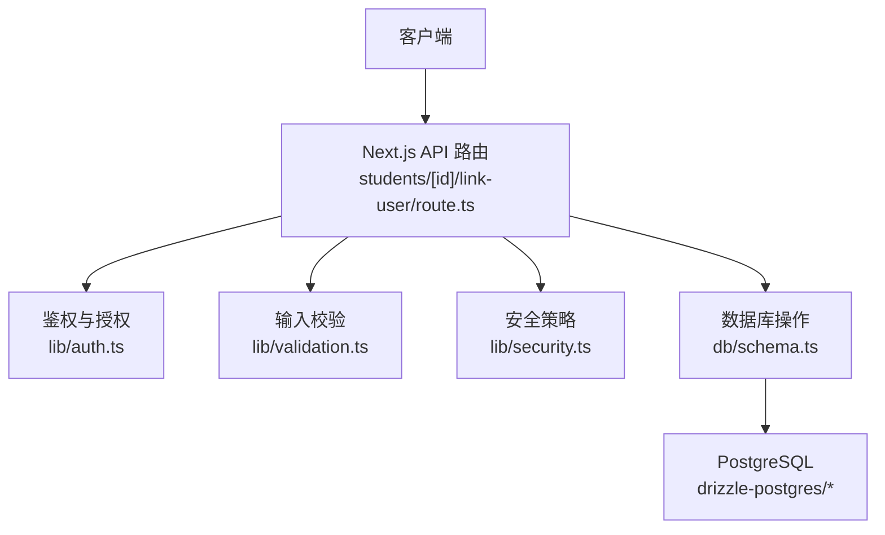
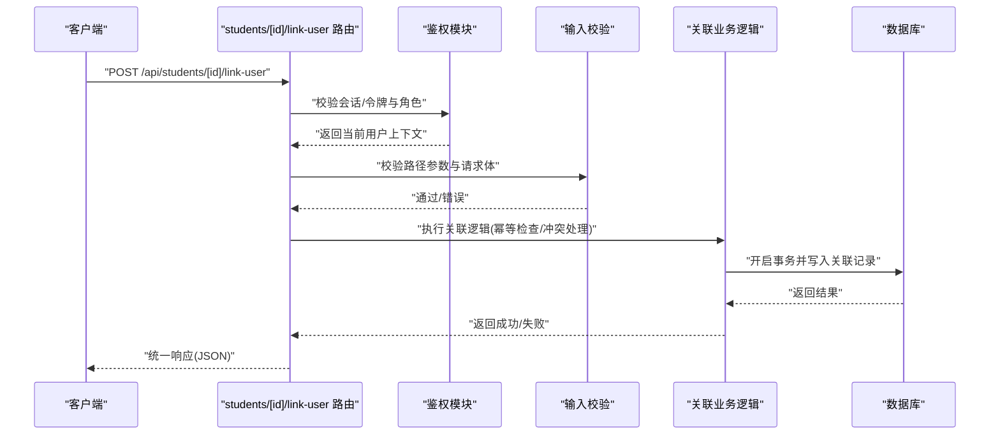
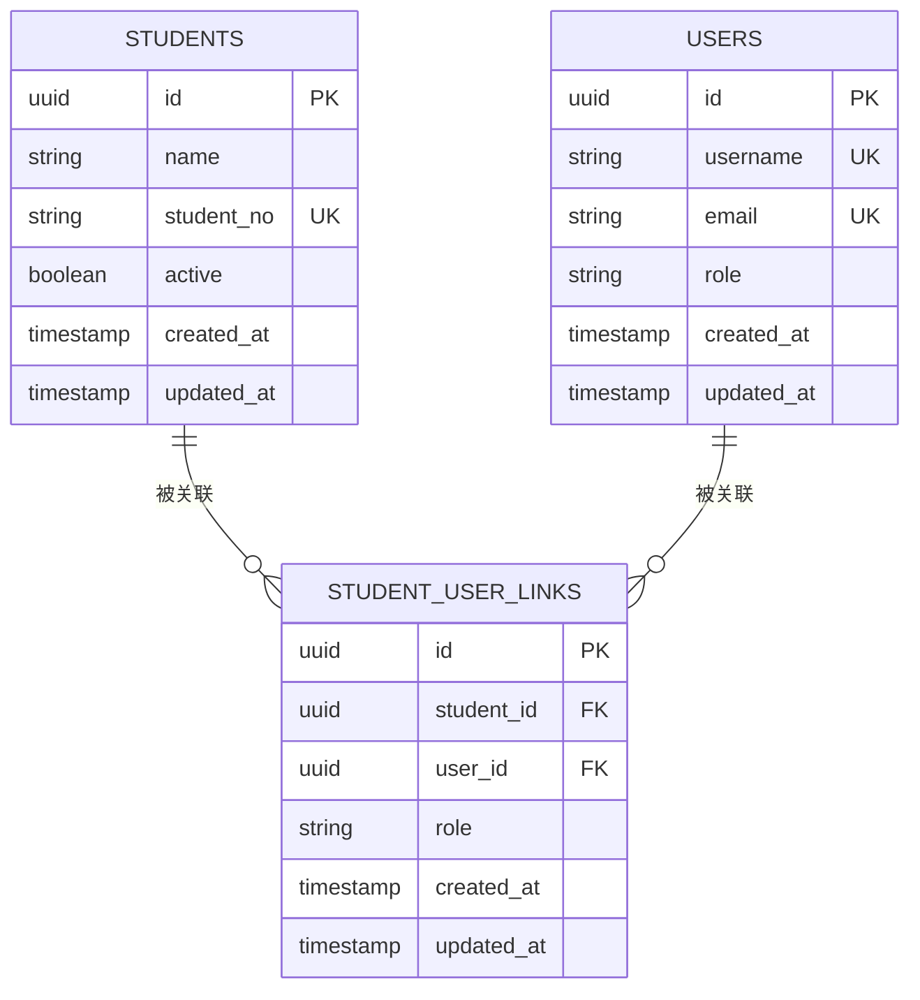
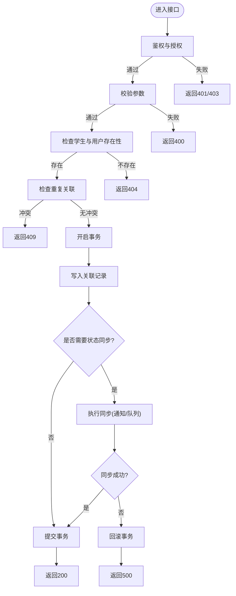
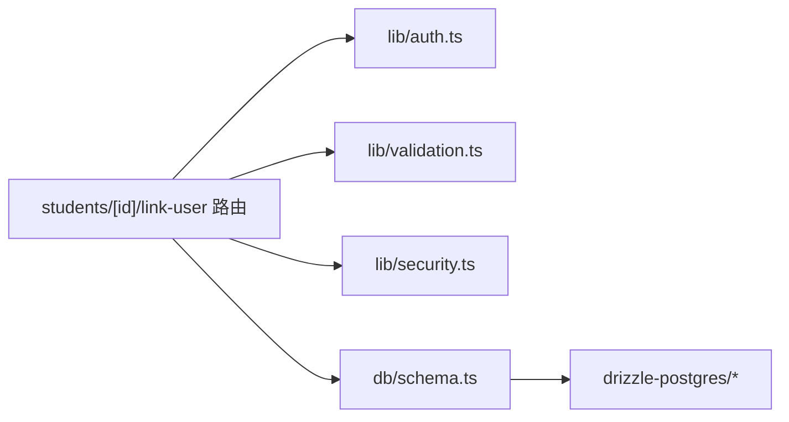

# 学生用户关联

<cite>
**本文引用的文件**   
- [app/api/students/[id]/link-user/route.ts](file://app/api/students/\[id\]/link-user/route.ts)
- [lib/auth.ts](file://lib/auth.ts)
- [db/schema.ts](file://db/schema.ts)
- [lib/validation.ts](file://lib/validation.ts)
- [lib/security.ts](file://lib/security.ts)
- [drizzle-postgres/0003_fine_quentin_quire.sql](file://drizzle-postgres/0003_fine_quentin_quire.sql)
</cite>

## 目录
1. [简介](#简介)
2. [项目结构](#项目结构)
3. [核心组件](#核心组件)
4. [架构总览](#架构总览)
5. [详细组件分析](#详细组件分析)
6. [依赖分析](#依赖分析)
7. [性能考虑](#性能考虑)
8. [故障排查指南](#故障排查指南)
9. [结论](#结论)
10. [附录](#附录)

## 简介
本文件面向“学生管理API”的用户关联功能，重点记录将学生与系统用户进行关联的接口规范：POST /api/students/[id]/link-user。文档涵盖数据模型、权限控制、关联关系管理与状态同步机制，并给出角色映射、权限继承、关联验证与异常处理的实现要点与使用示例说明。

## 项目结构
该功能位于 Next.js App Router 的 API 路由中，具体路径为 app/api/students/[id]/link-user/route.ts。相关的数据模型定义在 db/schema.ts，权限与安全校验逻辑分布在 lib/auth.ts 与 lib/security.ts，输入校验由 lib/validation.ts 提供，数据库迁移脚本见 drizzle-postgres 目录。

图表来源
- [app/api/students/[id]/link-user/route.ts](file://app/api/students/\[id\]/link-user/route.ts)
- [lib/auth.ts](file://lib/auth.ts)
- [lib/validation.ts](file://lib/validation.ts)
- [lib/security.ts](file://lib/security.ts)
- [db/schema.ts](file://db/schema.ts)
- [drizzle-postgres/0003_fine_quentin_quire.sql](file://drizzle-postgres/0003_fine_quentin_quire.sql)

章节来源
- [app/api/students/[id]/link-user/route.ts](file://app/api/students/\[id\]/link-user/route.ts)
- [db/schema.ts](file://db/schema.ts)

## 核心组件
- API 路由处理器：负责解析请求参数、执行鉴权与授权、调用业务逻辑、返回统一响应。
- 鉴权与授权：基于会话或令牌识别当前用户身份，并根据角色判断是否具备“为学生绑定用户”的权限。
- 输入校验：对路径参数 id 与请求体字段进行类型、格式与业务规则校验。
- 安全策略：防重放、限流、敏感信息脱敏等。
- 数据模型：学生表、用户表以及学生-用户关联表（含外键约束与唯一性约束）。
- 事务与一致性：确保关联创建与状态同步原子化。

章节来源
- [lib/auth.ts](file://lib/auth.ts)
- [lib/validation.ts](file://lib/validation.ts)
- [lib/security.ts](file://lib/security.ts)
- [db/schema.ts](file://db/schema.ts)

## 架构总览
下图展示了从客户端发起请求到数据库落库的完整流程，包括鉴权、校验、业务处理与事务提交。

图表来源
- [app/api/students/[id]/link-user/route.ts](file://app/api/students/\[id\]/link-user/route.ts)
- [lib/auth.ts](file://lib/auth.ts)
- [lib/validation.ts](file://lib/validation.ts)
- [db/schema.ts](file://db/schema.ts)

## 详细组件分析

### 接口规范：POST /api/students/[id]/link-user
- 方法：POST
- 路径：/api/students/{id}/link-user
- 认证：需要有效的登录态与会话/令牌
- 授权：仅允许具备“学生管理-用户关联”权限的角色（如管理员、辅导员）
- 请求体字段：
  - user_id：必填，字符串或数字，表示要关联的系统用户ID
  - role_mapping：可选，对象，用于指定该学生在系统中的角色映射（如 student、observer），若未提供则采用默认映射
  - sync_flags：可选，布尔或数组，控制是否同步通知、消息队列等外部状态
- 路径参数：
  - id：必填，学生ID，需存在且未被删除
- 成功响应：
  - code：200
  - data：包含关联记录详情（student_id、user_id、role、created_at 等）
- 错误响应：
  - 400：参数校验失败
  - 401：未认证
  - 403：无权限
  - 404：学生不存在
  - 409：已存在相同关联或冲突
  - 500：服务器内部错误

章节来源
- [app/api/students/[id]/link-user/route.ts](file://app/api/students/\[id\]/link-user/route.ts)
- [lib/validation.ts](file://lib/validation.ts)

### 数据模型与关系
- 学生表 students：主键 id，基础字段（姓名、学号、状态等）
- 用户表 users：主键 id，基础字段（用户名、邮箱、角色等）
- 学生-用户关联表 student_user_links：
  - 主键 id
  - student_id：外键指向 students.id
  - user_id：外键指向 users.id
  - role：枚举或字符串，表示该学生在系统中的角色映射
  - created_at、updated_at：时间戳
  - 唯一约束：(student_id, user_id) 防止重复关联
  - 索引：student_id、user_id 提升查询性能

图表来源
- [db/schema.ts](file://db/schema.ts)
- [drizzle-postgres/0003_fine_quentin_quire.sql](file://drizzle-postgres/0003_fine_quentin_quire.sql)

章节来源
- [db/schema.ts](file://db/schema.ts)
- [drizzle-postgres/0003_fine_quentin_quire.sql](file://drizzle-postgres/0003_fine_quentin_quire.sql)

### 权限控制与角色映射
- 鉴权：基于会话或令牌解析当前用户身份
- 授权：检查当前用户是否具备“学生-用户关联”权限；不同角色（管理员、辅导员、教师）具有不同权限集
- 角色映射：
  - 默认映射：student（学生）、observer（观察者）、tutor（导师）
  - 自定义映射：通过 role_mapping 覆盖默认值，但需受白名单限制
- 权限继承：
  - 管理员可对所有学生执行关联
  - 辅导员仅能对自己负责的学生执行关联
  - 其他角色按最小权限原则拒绝

章节来源
- [lib/auth.ts](file://lib/auth.ts)
- [lib/security.ts](file://lib/security.ts)

### 关联验证与状态同步
- 存在性校验：学生与用户必须存在且有效
- 冲突检测：同一学生对同一用户的关联不可重复
- 事务一致性：关联写入与状态同步在同一事务内完成
- 状态同步：
  - 可选开关 sync_flags 控制是否触发通知、消息队列更新
  - 失败回滚：任一环节失败均回滚事务，保证数据一致性

图表来源
- [app/api/students/[id]/link-user/route.ts](file://app/api/students/\[id\]/link-user/route.ts)
- [lib/validation.ts](file://lib/validation.ts)
- [lib/security.ts](file://lib/security.ts)

章节来源
- [app/api/students/[id]/link-user/route.ts](file://app/api/students/\[id\]/link-user/route.ts)
- [lib/validation.ts](file://lib/validation.ts)
- [lib/security.ts](file://lib/security.ts)

### 异常处理与错误码
- 400：参数缺失、类型错误、格式不合法
- 401：未登录或令牌无效
- 403：无权限执行关联
- 404：学生或用户不存在
- 409：重复关联或业务冲突
- 500：数据库错误或未知异常

章节来源
- [app/api/students/[id]/link-user/route.ts](file://app/api/students/\[id\]/link-user/route.ts)

### 使用示例
- 基本请求：
  - POST /api/students/abc123/link-user
  - 请求体：{"user_id": "usr456"}
- 带角色映射：
  - 请求体：{"user_id": "usr456", "role_mapping": {"role": "observer"}}
- 带状态同步：
  - 请求体：{"user_id": "usr456", "sync_flags": ["notify", "queue"]}

注意：以上为示例说明，实际字段名与取值以接口规范为准。

章节来源
- [app/api/students/[id]/link-user/route.ts](file://app/api/students/\[id\]/link-user/route.ts)

## 依赖分析
- 路由层依赖鉴权、校验与安全模块
- 业务层依赖数据库模型与事务能力
- 数据层依赖 PostgreSQL 与 Drizzle ORM 迁移脚本

图表来源
- [app/api/students/[id]/link-user/route.ts](file://app/api/students/\[id\]/link-user/route.ts)
- [lib/auth.ts](file://lib/auth.ts)
- [lib/validation.ts](file://lib/validation.ts)
- [lib/security.ts](file://lib/security.ts)
- [db/schema.ts](file://db/schema.ts)
- [drizzle-postgres/0003_fine_quentin_quire.sql](file://drizzle-postgres/0003_fine_quentin_quire.sql)

章节来源
- [app/api/students/[id]/link-user/route.ts](file://app/api/students/\[id\]/link-user/route.ts)
- [db/schema.ts](file://db/schema.ts)

## 性能考虑
- 索引优化：为 student_id、user_id 建立索引以提升查询与去重效率
- 事务粒度：尽量缩小事务范围，减少锁竞争
- 幂等设计：通过唯一约束与幂等键避免重复写入
- 缓存策略：对高频读取的关联关系可使用短期缓存（如 Redis）
- 异步同步：对于非关键状态同步（如通知）建议异步处理，降低主流程延迟

## 故障排查指南
- 常见问题：
  - 401/403：检查会话/令牌有效性及角色权限配置
  - 404：确认学生与用户是否存在且未被删除
  - 409：检查是否已存在相同关联，必要时先解除旧关联
  - 500：查看数据库日志与事务回滚原因
- 调试建议：
  - 启用详细日志，记录请求参数、鉴权结果与事务状态
  - 使用数据库工具直接查询关联表，验证约束与索引
  - 对同步失败场景单独重试与告警

章节来源
- [app/api/students/[id]/link-user/route.ts](file://app/api/students/\[id\]/link-user/route.ts)
- [lib/auth.ts](file://lib/auth.ts)
- [lib/validation.ts](file://lib/validation.ts)
- [lib/security.ts](file://lib/security.ts)

## 结论
学生-用户关联接口通过严格的鉴权、校验与事务保障，实现了稳定可靠的关联管理能力。结合角色映射与权限继承，满足不同角色的使用需求。建议在部署时完善索引、监控与日志，确保高可用与可观测性。

## 附录
- 术语：
  - 学生：系统中的学习者实体
  - 用户：系统登录与授权主体
  - 关联：学生与用户之间的多对一或多对多关系（取决于业务设计）
- 扩展方向：
  - 支持批量关联接口
  - 增加关联历史审计与撤销机制
  - 引入更细粒度的权限控制（如按班级、学院维度）