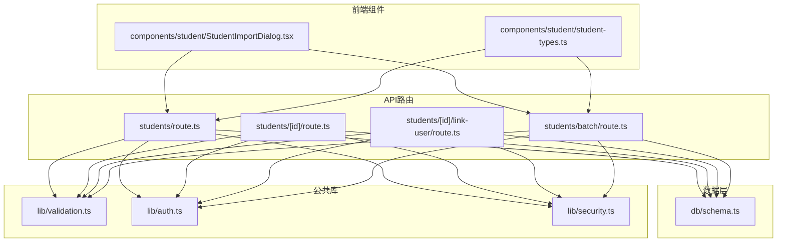
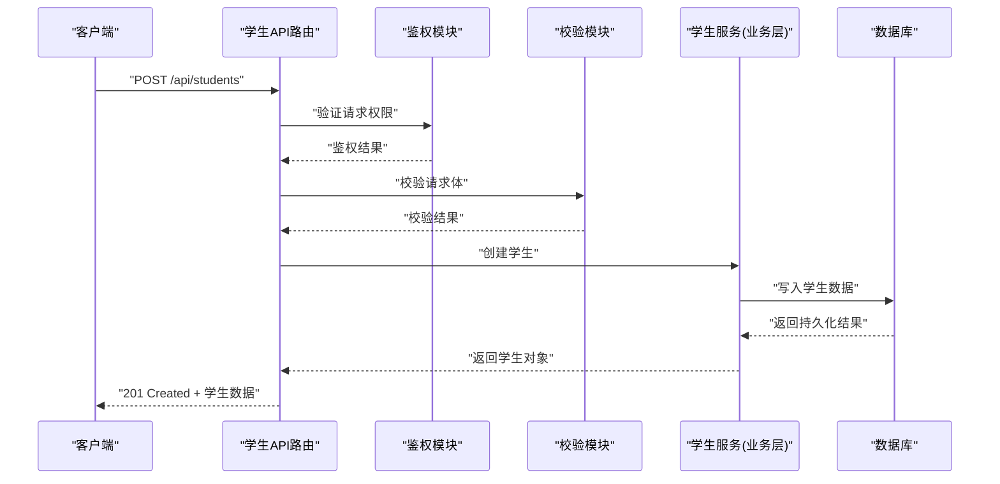
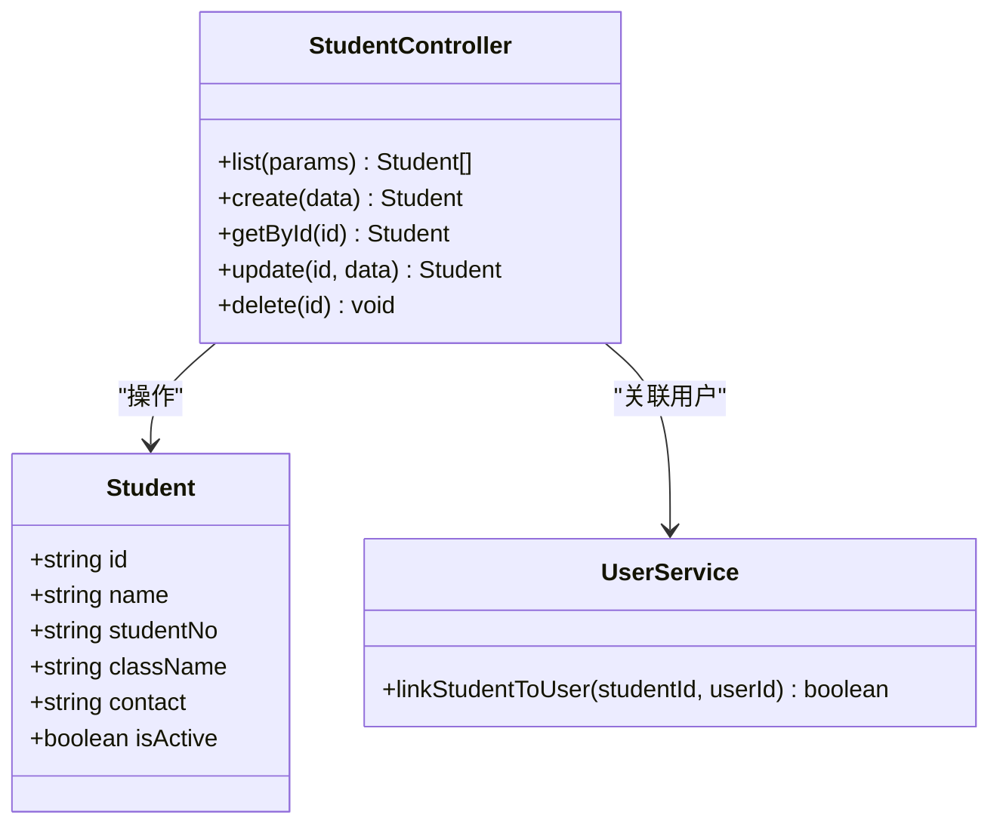
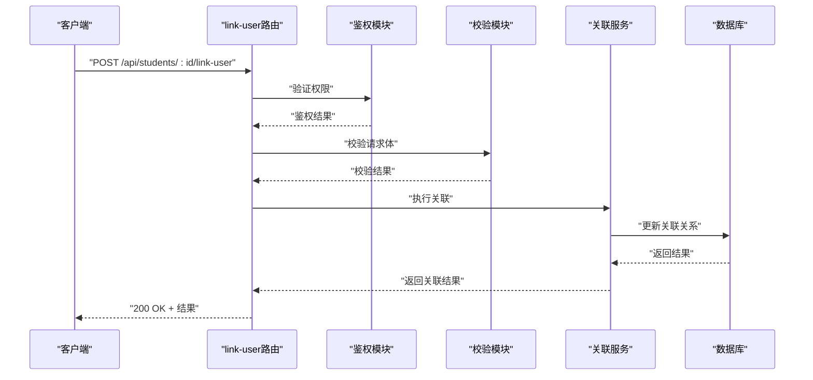
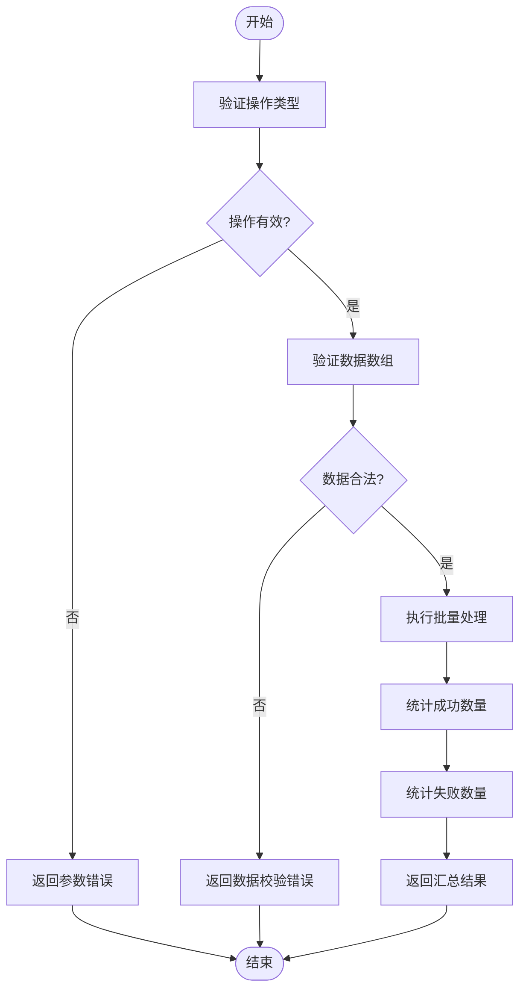
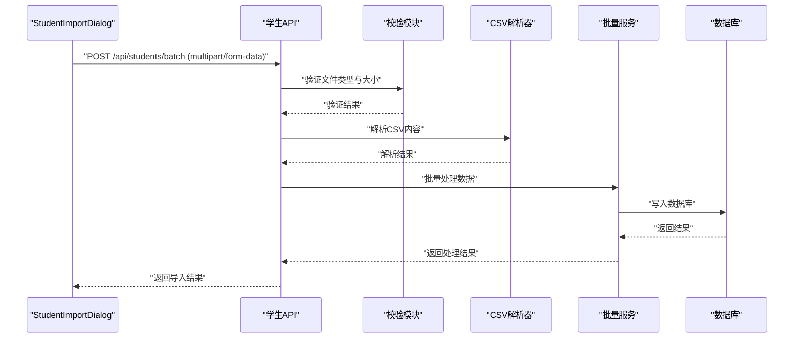
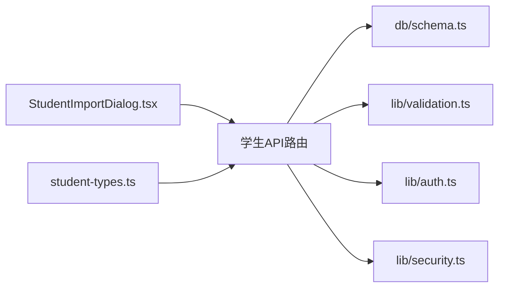

# 学生管理API

<cite>
**本文档引用的文件**
- [app/api/students/route.ts](file://app/api/students/route.ts)
- [app/api/students/[id]/route.ts](file://app/api/students/[id]/route.ts)
- [app/api/students/[id]/link-user/route.ts](file://app/api/students/[id]/link-user/route.ts)
- [app/api/students/batch/route.ts](file://app/api/students/batch/route.ts)
- [db/schema.ts](file://db/schema.ts)
- [lib/validation.ts](file://lib/validation.ts)
- [lib/auth.ts](file://lib/auth.ts)
- [lib/security.ts](file://lib/security.ts)
- [app/components/student/StudentImportDialog.tsx](file://app/components/student/StudentImportDialog.tsx)
- [app/components/student/student-types.ts](file://app/components/student/student-types.ts)
- [tests/fixtures/students-valid.csv](file://tests/fixtures/students-valid.csv)
</cite>

## 目录
1. [简介](#简介)
2. [项目结构](#项目结构)
3. [核心组件](#核心组件)
4. [架构总览](#架构总览)
5. [详细组件分析](#详细组件分析)
6. [依赖关系分析](#依赖关系分析)
7. [性能考虑](#性能考虑)
8. [故障排查指南](#故障排查指南)
9. [结论](#结论)
10. [附录](#附录)

## 简介
本文件面向CS1学生事务管理系统中的“学生管理”模块，聚焦于学生数据相关的REST API。内容涵盖：
- 学生的增删改查（CRUD）接口
- 批量操作接口
- 与学生用户关联的接口
- 学生数据导入导出与文件上传
- 请求/响应模式、参数校验规则与错误处理约定

文档同时提供架构图、序列图与流程图，帮助初学者快速理解系统设计与调用流程。

## 项目结构
学生管理相关API采用Next.js App Router风格的路由组织方式，位于 app/api/students 目录下，按资源与子资源划分路由文件；数据库模型定义在 db/schema.ts；通用校验逻辑集中在 lib/validation.ts；鉴权与安全策略在 lib/auth.ts 与 lib/security.ts；前端导入对话框与类型定义位于 app/components/student。

图表来源
- [app/api/students/route.ts](file://app/api/students/route.ts)
- [app/api/students/[id]/route.ts](file://app/api/students/[id]/route.ts)
- [app/api/students/[id]/link-user/route.ts](file://app/api/students/[id]/link-user/route.ts)
- [app/api/students/batch/route.ts](file://app/api/students/batch/route.ts)
- [db/schema.ts](file://db/schema.ts)
- [lib/validation.ts](file://lib/validation.ts)
- [lib/auth.ts](file://lib/auth.ts)
- [lib/security.ts](file://lib/security.ts)
- [app/components/student/StudentImportDialog.tsx](file://app/components/student/StudentImportDialog.tsx)
- [app/components/student/student-types.ts](file://app/components/student/student-types.ts)

章节来源
- [app/api/students/route.ts](file://app/api/students/route.ts)
- [app/api/students/[id]/route.ts](file://app/api/students/[id]/route.ts)
- [app/api/students/[id]/link-user/route.ts](file://app/api/students/[id]/link-user/route.ts)
- [app/api/students/batch/route.ts](file://app/api/students/batch/route.ts)
- [db/schema.ts](file://db/schema.ts)
- [lib/validation.ts](file://lib/validation.ts)
- [lib/auth.ts](file://lib/auth.ts)
- [lib/security.ts](file://lib/security.ts)
- [app/components/student/StudentImportDialog.tsx](file://app/components/student/StudentImportDialog.tsx)
- [app/components/student/student-types.ts](file://app/components/student/student-types.ts)

## 核心组件
- 学生列表与创建（POST /api/students）
  - 功能：分页查询学生列表、新增单个学生
  - 典型请求体字段：姓名、学号、班级、联系方式等（以实际schema为准）
  - 校验：必填字段、格式校验（如邮箱、手机号）、唯一性约束（如学号）
  - 返回：成功时返回学生对象或创建结果；失败时返回错误信息

- 学生详情与更新/删除（GET/PUT/DELETE /api/students/:id）
  - 功能：获取学生详情、更新学生信息、删除学生
  - 路径参数：id（学生ID）
  - 校验：id有效性、更新字段合法性
  - 返回：成功返回更新后的学生对象或删除确认；失败返回错误信息

- 学生与用户关联（POST /api/students/:id/link-user）
  - 功能：将学生记录与系统用户账户建立关联
  - 请求体：用户标识（如userId）
  - 校验：学生存在、用户存在、未重复关联
  - 返回：关联结果或错误信息

- 批量操作（POST /api/students/batch）
  - 功能：批量创建、更新、删除或状态变更
  - 请求体：操作类型与数据数组
  - 校验：批量大小限制、每条数据的合法性
  - 返回：汇总结果（成功数、失败数、错误明细）

章节来源
- [app/api/students/route.ts](file://app/api/students/route.ts)
- [app/api/students/[id]/route.ts](file://app/api/students/[id]/route.ts)
- [app/api/students/[id]/link-user/route.ts](file://app/api/students/[id]/link-user/route.ts)
- [app/api/students/batch/route.ts](file://app/api/students/batch/route.ts)

## 架构总览
学生管理API遵循分层设计：
- 路由层：接收HTTP请求，解析参数与请求体，进行鉴权与基础校验
- 业务层：执行具体业务逻辑（如创建、更新、关联、批量处理）
- 数据层：通过数据库ORM访问持久化存储
- 安全与校验：统一鉴权、输入校验、安全防护

图表来源
- [app/api/students/route.ts](file://app/api/students/route.ts)
- [lib/auth.ts](file://lib/auth.ts)
- [lib/validation.ts](file://lib/validation.ts)
- [db/schema.ts](file://db/schema.ts)

## 详细组件分析

### 学生CRUD接口
- GET /api/students
  - 作用：分页查询学生列表，支持过滤与排序
  - 查询参数：page、pageSize、keyword、classId等
  - 响应：包含数据列表与分页元信息

- POST /api/students
  - 作用：新增学生
  - 请求体：学生基本信息
  - 校验：必填项、格式、唯一性
  - 响应：创建成功的學生对象

- GET /api/students/:id
  - 作用：获取学生详情
  - 路径参数：id
  - 响应：学生详细信息

- PUT /api/students/:id
  - 作用：更新学生信息
  - 请求体：需要更新的字段
  - 响应：更新后的学生对象

- DELETE /api/students/:id
  - 作用：删除学生
  - 路径参数：id
  - 响应：删除确认或空响应

章节来源
- [app/api/students/route.ts](file://app/api/students/route.ts)
- [app/api/students/[id]/route.ts](file://app/api/students/[id]/route.ts)

#### 类图（概念映射）

图表来源
- [app/api/students/route.ts](file://app/api/students/route.ts)
- [app/api/students/[id]/route.ts](file://app/api/students/[id]/route.ts)
- [app/api/students/[id]/link-user/route.ts](file://app/api/students/[id]/link-user/route.ts)

### 学生与用户关联接口
- POST /api/students/:id/link-user
  - 作用：将指定学生与系统用户账户关联
  - 请求体：{ userId }
  - 校验：学生存在、用户存在、未重复关联
  - 响应：关联成功或错误信息

图表来源
- [app/api/students/[id]/link-user/route.ts](file://app/api/students/[id]/link-user/route.ts)
- [lib/auth.ts](file://lib/auth.ts)
- [lib/validation.ts](file://lib/validation.ts)
- [db/schema.ts](file://db/schema.ts)

章节来源
- [app/api/students/[id]/link-user/route.ts](file://app/api/students/[id]/link-user/route.ts)

### 批量操作接口
- POST /api/students/batch
  - 作用：批量创建、更新、删除或状态变更
  - 请求体：{ operation: "create"|"update"|"delete"|"status", data: [...] }
  - 校验：操作类型、数据数组长度、每条数据合法性
  - 响应：{ successCount, failureCount, errors: [...] }

图表来源
- [app/api/students/batch/route.ts](file://app/api/students/batch/route.ts)
- [lib/validation.ts](file://lib/validation.ts)

章节来源
- [app/api/students/batch/route.ts](file://app/api/students/batch/route.ts)

### 学生数据导入导出与文件上传
- 导入
  - 前端组件：StudentImportDialog.tsx 提供CSV文件选择与上传界面
  - 后端接口：通常复用批量创建接口或专用导入接口
  - 文件格式：CSV，列头需符合 schema 定义
  - 校验：文件类型、编码、列名、数据格式
  - 响应：导入结果（成功数、失败数、错误明细）

- 导出
  - 前端触发导出请求
  - 后端生成CSV文件流并返回下载链接或直接返回二进制流
  - 文件名：通常包含时间戳与“学生数据”字样

图表来源
- [app/components/student/StudentImportDialog.tsx](file://app/components/student/StudentImportDialog.tsx)
- [app/api/students/batch/route.ts](file://app/api/students/batch/route.ts)
- [lib/validation.ts](file://lib/validation.ts)

章节来源
- [app/components/student/StudentImportDialog.tsx](file://app/components/student/StudentImportDialog.tsx)
- [app/api/students/batch/route.ts](file://app/api/students/batch/route.ts)
- [tests/fixtures/students-valid.csv](file://tests/fixtures/students-valid.csv)

## 依赖关系分析
学生管理API依赖以下核心模块：
- 数据库模型：db/schema.ts 定义学生表结构与关系
- 校验模块：lib/validation.ts 提供统一的输入校验逻辑
- 鉴权模块：lib/auth.ts 负责身份认证与权限控制
- 安全模块：lib/security.ts 提供安全防护（如防注入、XSS等）
- 前端组件：StudentImportDialog.tsx 与 student-types.ts 提供导入界面与类型定义

图表来源
- [app/api/students/route.ts](file://app/api/students/route.ts)
- [app/api/students/[id]/route.ts](file://app/api/students/[id]/route.ts)
- [app/api/students/batch/route.ts](file://app/api/students/batch/route.ts)
- [db/schema.ts](file://db/schema.ts)
- [lib/validation.ts](file://lib/validation.ts)
- [lib/auth.ts](file://lib/auth.ts)
- [lib/security.ts](file://lib/security.ts)
- [app/components/student/StudentImportDialog.tsx](file://app/components/student/StudentImportDialog.tsx)
- [app/components/student/student-types.ts](file://app/components/student/student-types.ts)

章节来源
- [db/schema.ts](file://db/schema.ts)
- [lib/validation.ts](file://lib/validation.ts)
- [lib/auth.ts](file://lib/auth.ts)
- [lib/security.ts](file://lib/security.ts)
- [app/components/student/StudentImportDialog.tsx](file://app/components/student/StudentImportDialog.tsx)
- [app/components/student/student-types.ts](file://app/components/student/student-types.ts)

## 性能考虑
- 分页查询：使用合理的 pageSize 避免一次性加载过多数据
- 批量操作：限制单次批量大小，避免数据库压力过大
- 文件导入：大文件分块上传与异步处理，提升用户体验
- 索引优化：为常用查询字段（如学号、班级）添加数据库索引
- 缓存策略：对不频繁变动的数据使用缓存减少数据库压力

## 故障排查指南
- 常见错误码
  - 400：请求参数错误或校验失败
  - 401：未授权或令牌无效
  - 403：权限不足
  - 404：资源不存在
  - 409：冲突（如重复学号）
  - 500：服务器内部错误

- 调试建议
  - 检查请求头是否包含正确的鉴权令牌
  - 验证请求体字段是否符合schema定义
  - 查看数据库连接状态与慢查询日志
  - 使用浏览器开发者工具检查网络请求与响应

章节来源
- [lib/validation.ts](file://lib/validation.ts)
- [lib/auth.ts](file://lib/auth.ts)
- [lib/security.ts](file://lib/security.ts)

## 结论
学生管理API提供了完整的学生数据管理能力，包括CRUD、批量操作、用户关联以及导入导出等功能。通过清晰的架构设计与严格的校验机制，确保了系统的稳定性与安全性。建议在实际使用中遵循最佳实践，合理配置分页与批量大小，确保系统在高并发场景下的性能表现。

## 附录
- 示例请求与响应格式请参考各接口的具体实现
- CSV导入模板可参考 tests/fixtures/students-valid.csv
- 前端组件使用示例请参考 StudentImportDialog.tsx 的实现