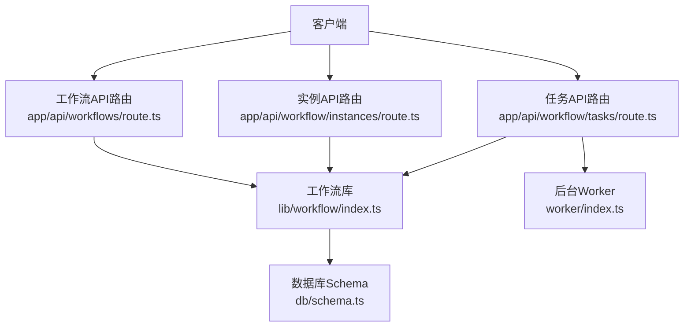
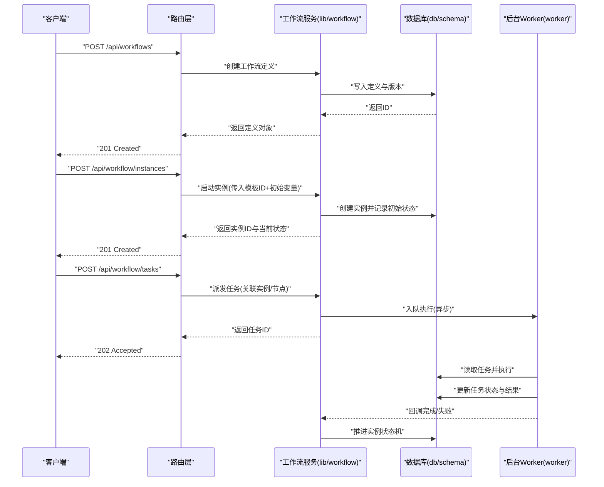
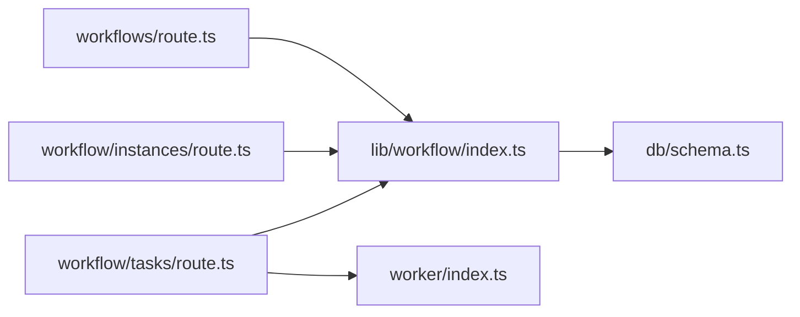

# 工作流API

<cite>
**本文档引用的文件**   
- [app/api/workflows/route.ts](file://app/api/workflows/route.ts)
- [app/api/workflow/instances/route.ts](file://app/api/workflow/instances/route.ts)
- [app/api/workflow/instances/[id]/route.ts](file://app/api/workflow/instances/[id]/route.ts)
- [app/api/workflow/tasks/route.ts](file://app/api/workflow/tasks/route.ts)
- [lib/workflow/index.ts](file://lib/workflow/index.ts)
- [db/schema.ts](file://db/schema.ts)
- [worker/index.ts](file://worker/index.ts)
</cite>

## 目录
1. [简介](#简介)
2. [项目结构](#项目结构)
3. [核心组件](#核心组件)
4. [架构总览](#架构总览)
5. [详细组件分析](#详细组件分析)
6. [依赖关系分析](#依赖关系分析)
7. [性能考虑](#性能考虑)
8. [故障排查指南](#故障排查指南)
9. [结论](#结论)
10. [附录](#附录)

## 简介
本文件为CS1学生事务管理系统的工作流API提供完整、可操作的技术文档。内容覆盖工作流定义、实例管理、任务处理等核心能力，包括HTTP方法、URL模式、请求与响应结构、状态机设计、执行监控与任务调度等高级特性。文档面向开发者与运维人员，既提供高层概览，也给出代码级映射与排障建议。

## 项目结构
工作流相关API采用Next.js App Router风格的路由组织：
- 工作流定义接口：app/api/workflows/route.ts
- 工作流实例接口：app/api/workflow/instances/route.ts 与 app/api/workflow/instances/[id]/route.ts
- 任务处理接口：app/api/workflow/tasks/route.ts
- 工作流库（业务逻辑）：lib/workflow/index.ts
- 数据模型与迁移：db/schema.ts
- 后台任务执行器：worker/index.ts

图表来源
- [app/api/workflows/route.ts](file://app/api/workflows/route.ts)
- [app/api/workflow/instances/route.ts](file://app/api/workflow/instances/route.ts)
- [app/api/workflow/tasks/route.ts](file://app/api/workflow/tasks/route.ts)
- [lib/workflow/index.ts](file://lib/workflow/index.ts)
- [db/schema.ts](file://db/schema.ts)
- [worker/index.ts](file://worker/index.ts)

章节来源
- [app/api/workflows/route.ts](file://app/api/workflows/route.ts)
- [app/api/workflow/instances/route.ts](file://app/api/workflow/instances/route.ts)
- [app/api/workflow/instances/[id]/route.ts](file://app/api/workflow/instances/[id]/route.ts)
- [app/api/workflow/tasks/route.ts](file://app/api/workflow/tasks/route.ts)
- [lib/workflow/index.ts](file://lib/workflow/index.ts)
- [db/schema.ts](file://db/schema.ts)
- [worker/index.ts](file://worker/index.ts)

## 核心组件
- 工作流定义API：负责工作流模板的创建、查询、更新、删除与版本管理。
- 工作流实例API：负责按模板启动实例、查询实例状态、暂停/恢复、终止与审计日志。
- 任务处理API：负责任务的派发、认领、完成、失败重试、超时处理与结果回写。
- 工作流库：封装工作流引擎的核心能力（解析定义、驱动状态机、编排节点、持久化）。
- 数据库Schema：定义工作流定义、实例、任务、审计日志等表结构与约束。
- Worker：异步执行耗时任务、重试策略、幂等控制与错误上报。

章节来源
- [lib/workflow/index.ts](file://lib/workflow/index.ts)
- [db/schema.ts](file://db/schema.ts)
- [worker/index.ts](file://worker/index.ts)

## 架构总览
工作流API遵循“路由层薄、业务层厚、持久化与异步解耦”的设计原则：
- 路由层仅做参数校验、鉴权与调用服务层。
- 服务层（lib/workflow）实现状态机、节点编排、事件总线与事务边界。
- 持久化通过统一Schema访问，确保一致性。
- 耗时任务通过Worker异步执行，避免阻塞请求链路。

图表来源
- [app/api/workflows/route.ts](file://app/api/workflows/route.ts)
- [app/api/workflow/instances/route.ts](file://app/api/workflow/instances/route.ts)
- [app/api/workflow/tasks/route.ts](file://app/api/workflow/tasks/route.ts)
- [lib/workflow/index.ts](file://lib/workflow/index.ts)
- [db/schema.ts](file://db/schema.ts)
- [worker/index.ts](file://worker/index.ts)

## 详细组件分析

### 工作流定义API
- URL模式与方法
  - POST /api/workflows：创建工作流定义
  - GET /api/workflows：查询定义列表（支持分页、过滤）
  - GET /api/workflows/:id：获取定义详情
  - PUT /api/workflows/:id：更新定义（新版本）
  - DELETE /api/workflows/:id：删除定义（软删或限制删除）
- 请求体字段（示例）
  - name, description, version, nodes[], edges[]
- 响应体字段（示例）
  - id, name, version, status, createdAt, updatedAt
- 行为要点
  - 版本隔离：每次更新生成新版本，历史版本不可变
  - 校验：节点类型、边连接合法性、必填字段检查
  - 权限：管理员或流程设计师角色可写

章节来源
- [app/api/workflows/route.ts](file://app/api/workflows/route.ts)
- [lib/workflow/index.ts](file://lib/workflow/index.ts)
- [db/schema.ts](file://db/schema.ts)

### 工作流实例API
- URL模式与方法
  - POST /api/workflow/instances：根据定义启动实例
  - GET /api/workflow/instances：查询实例列表（支持按定义、状态、时间范围过滤）
  - GET /api/workflow/instances/:id：查询实例详情
  - PATCH /api/workflow/instances/:id：暂停/恢复/终止
  - GET /api/workflow/instances/:id/logs：审计日志
- 请求体字段（示例）
  - workflowDefinitionId, variables, tenantId, priority
- 响应体字段（示例）
  - id, workflowDefinitionId, status, currentNode, variables, createdAt, updatedAt
- 状态机
  - 新建 -> 运行中 -> 已暂停/已取消/已完成/失败
  - 转换规则：暂停/恢复互斥；失败需人工介入或自动重试后进入终态
- 行为要点
  - 幂等：重复启动同一输入应返回相同实例ID或拒绝
  - 审计：所有状态变更记录审计日志

章节来源
- [app/api/workflow/instances/route.ts](file://app/api/workflow/instances/route.ts)
- [app/api/workflow/instances/[id]/route.ts](file://app/api/workflow/instances/[id]/route.ts)
- [lib/workflow/index.ts](file://lib/workflow/index.ts)
- [db/schema.ts](file://db/schema.ts)

### 任务处理API
- URL模式与方法
  - POST /api/workflow/tasks：派发任务（同步返回任务ID）
  - GET /api/workflow/tasks：查询任务列表（支持按实例、节点、状态过滤）
  - GET /api/workflow/tasks/:id：查询任务详情
  - PATCH /api/workflow/tasks/:id：认领/完成/失败/重试
- 请求体字段（示例）
  - instanceId, nodeId, payload, assignee, timeoutMs
- 响应体字段（示例）
  - id, instanceId, nodeId, status, result, retryCount, nextRetryAt
- 行为要点
  - 异步执行：派发后立即返回，实际执行在Worker中
  - 重试策略：指数退避、最大重试次数、死信队列
  - 超时处理：超过timeoutMs标记超时并可触发补偿动作

章节来源
- [app/api/workflow/tasks/route.ts](file://app/api/workflow/tasks/route.ts)
- [lib/workflow/index.ts](file://lib/workflow/index.ts)
- [worker/index.ts](file://worker/index.ts)
- [db/schema.ts](file://db/schema.ts)

### 工作流库（lib/workflow）
- 职责
  - 解析工作流定义，构建有向无环图
  - 驱动状态机推进实例状态
  - 编排节点执行顺序与分支条件
  - 事务边界与一致性保障
  - 事件发布与订阅（用于审计与监控）
- 关键抽象
  - 定义模型、实例模型、任务模型、审计日志模型
  - 节点处理器注册表（可扩展自定义节点）
  - 调度器（定时任务、延迟任务、重试）

章节来源
- [lib/workflow/index.ts](file://lib/workflow/index.ts)
- [db/schema.ts](file://db/schema.ts)

### 数据模型（db/schema）
- 主要实体
  - 工作流定义：id、名称、描述、版本、状态、创建/更新时间
  - 工作流实例：id、定义ID、状态、当前节点、变量快照、创建/更新时间
  - 任务：id、实例ID、节点ID、状态、负载、结果、重试计数、下次重试时间
  - 审计日志：id、实体类型、实体ID、动作、变更前后值、操作人、时间
- 约束与索引
  - 主键、唯一约束（如定义名+版本）、外键关联
  - 高频查询字段建立索引（实例状态、任务状态、时间戳）

章节来源
- [db/schema.ts](file://db/schema.ts)

### 后台Worker（worker）
- 职责
  - 消费任务队列，执行耗时逻辑
  - 重试与退避策略
  - 幂等执行与冲突检测
  - 错误上报与指标采集
- 关键机制
  - 拉取任务、加锁、执行、提交结果、异常捕获
  - 与实例状态机联动，推动流程前进

章节来源
- [worker/index.ts](file://worker/index.ts)
- [lib/workflow/index.ts](file://lib/workflow/index.ts)

## 依赖关系分析
- 路由层依赖工作流库进行业务编排
- 工作流库依赖数据库Schema进行持久化
- 任务API依赖Worker进行异步执行
- 审计与监控贯穿各层，便于问题定位

图表来源
- [app/api/workflows/route.ts](file://app/api/workflows/route.ts)
- [app/api/workflow/instances/route.ts](file://app/api/workflow/instances/route.ts)
- [app/api/workflow/tasks/route.ts](file://app/api/workflow/tasks/route.ts)
- [lib/workflow/index.ts](file://lib/workflow/index.ts)
- [db/schema.ts](file://db/schema.ts)
- [worker/index.ts](file://worker/index.ts)

## 性能考虑
- 读写分离与缓存：对只读查询（定义列表、实例列表）引入缓存层，降低DB压力
- 批量操作：实例与任务查询支持分页与批量过滤，避免大结果集
- 异步优先：耗时任务一律走Worker，避免阻塞HTTP请求
- 索引优化：针对高频过滤字段建立合适索引
- 幂等与去重：派发任务与启动实例具备幂等键，防止重复执行

## 故障排查指南
- 常见问题
  - 定义校验失败：检查节点类型、边连接与必填字段
  - 实例状态卡住：查看审计日志与任务状态，确认是否存在失败任务未重试
  - 任务超时：调整timeoutMs或优化任务执行逻辑
  - 并发冲突：检查幂等键与锁机制是否生效
- 诊断步骤
  - 通过实例日志定位最近一次状态变更
  - 通过任务列表筛选失败/超时任务，查看错误信息
  - 核对Worker运行状态与队列积压情况
  - 检查数据库连接与慢查询

## 结论
本工作流API以清晰的分层与明确的职责划分，提供了稳定、可扩展的流程管理能力。通过状态机驱动、异步任务与完善的审计日志，满足学生事务管理中复杂审批与协作场景的需求。建议在后续迭代中持续完善监控告警、可视化追踪与性能调优。

## 附录
- 术语
  - 工作流定义：流程模板，包含节点与流转规则
  - 工作流实例：基于定义的运行时实例，承载变量与状态
  - 任务：流程中的具体执行单元，通常对应一个节点
  - 审计日志：记录关键操作的不可变日志
- 最佳实践
  - 使用幂等键保证重复请求安全
  - 合理设置超时与重试上限
  - 对敏感操作开启审计与告警
  - 保持定义版本化与向后兼容