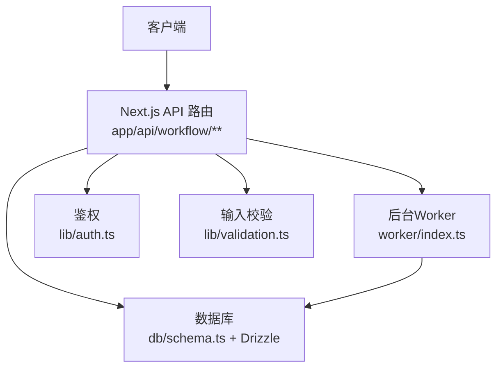
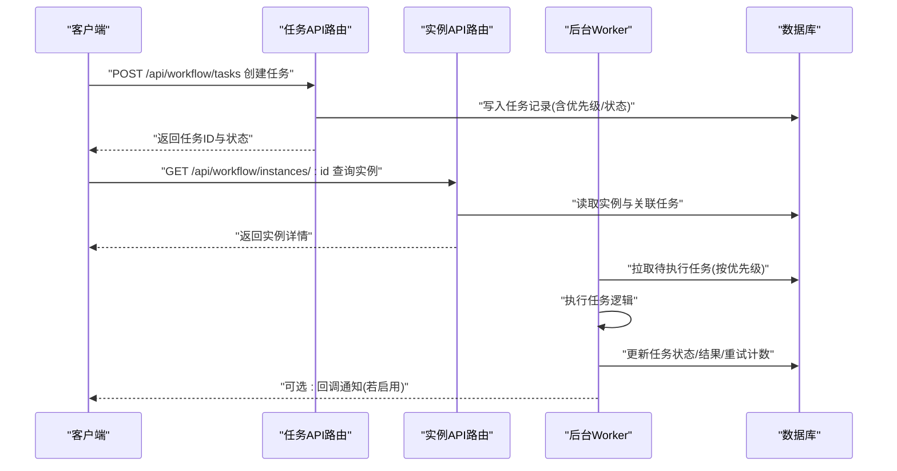
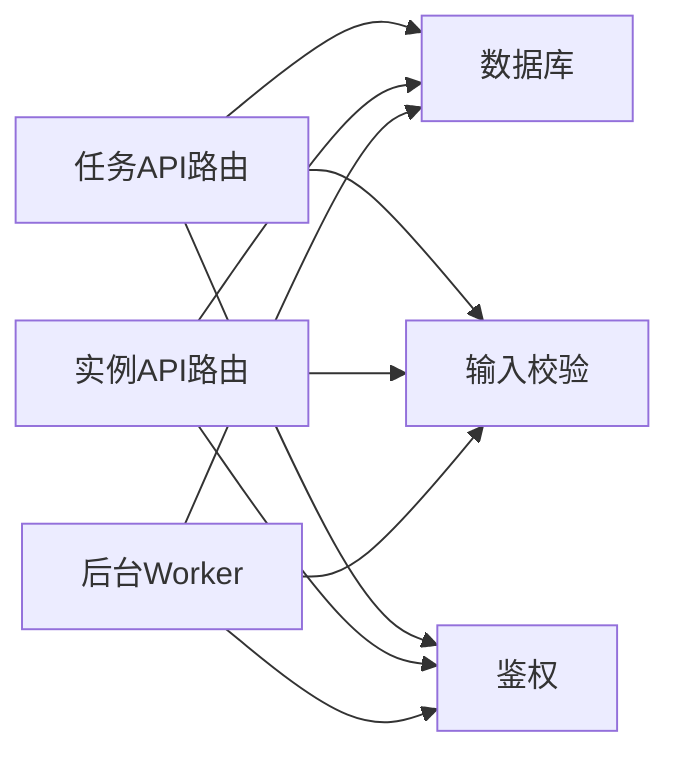
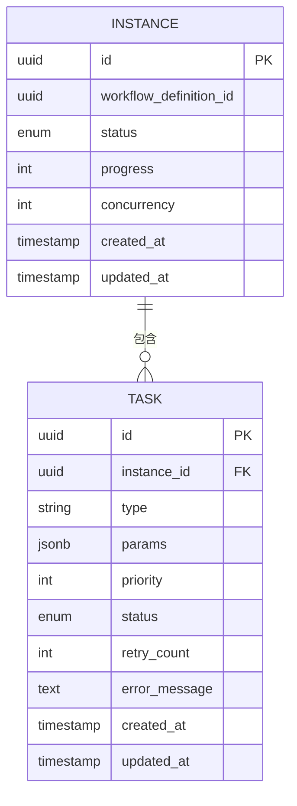
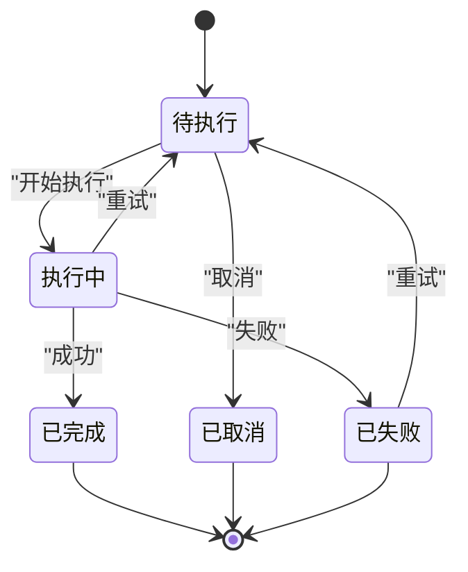

# 工作流任务API

<cite>
**本文引用的文件**   
- [app/api/workflow/tasks/route.ts](file://app/api/workflow/tasks/route.ts)
- [app/api/workflow/instances/route.ts](file://app/api/workflow/instances/route.ts)
- [app/api/workflow/instances/[id]/route.ts](file://app/api/workflow/instances/[id]/route.ts)
- [worker/index.ts](file://worker/index.ts)
- [lib/validation.ts](file://lib/validation.ts)
- [lib/auth.ts](file://lib/auth.ts)
- [db/schema.ts](file://db/schema.ts)
- [drizzle-postgres/meta/_journal.json](file://drizzle-postgres/meta/_journal.json)
</cite>

## 目录
1. [简介](#简介)
2. [项目结构](#项目结构)
3. [核心组件](#核心组件)
4. [架构总览](#架构总览)
5. [详细组件分析](#详细组件分析)
6. [依赖分析](#依赖分析)
7. [性能考虑](#性能考虑)
8. [故障排查指南](#故障排查指南)
9. [结论](#结论)
10. [附录](#附录)

## 简介
本文件为“工作流任务API”的权威技术文档，聚焦于任务的分配、执行、完成与失败处理。内容涵盖：
- HTTP方法、URL模式、请求/响应规范
- 任务队列管理、优先级调度、并发控制与负载均衡的实现要点
- 任务监控、日志记录与异常处理的接口说明

该API基于Next.js App Router的API路由实现，配合后台Worker进行异步任务处理，并通过数据库持久化实例与任务状态。

## 项目结构
与工作流任务API直接相关的代码主要分布在以下位置：
- API层：app/api/workflow/**（任务与实例路由）
- Worker层：worker/index.ts（后台任务执行器）
- 数据层：db/schema.ts（数据库模型定义）、drizzle-postgres/**（迁移元数据）
- 通用能力：lib/validation.ts（输入校验）、lib/auth.ts（鉴权）

图表来源
- [app/api/workflow/tasks/route.ts](file://app/api/workflow/tasks/route.ts)
- [app/api/workflow/instances/route.ts](file://app/api/workflow/instances/route.ts)
- [app/api/workflow/instances/[id]/route.ts](file://app/api/workflow/instances/[id]/route.ts)
- [worker/index.ts](file://worker/index.ts)
- [db/schema.ts](file://db/schema.ts)
- [lib/validation.ts](file://lib/validation.ts)
- [lib/auth.ts](file://lib/auth.ts)

章节来源
- [app/api/workflow/tasks/route.ts](file://app/api/workflow/tasks/route.ts)
- [app/api/workflow/instances/route.ts](file://app/api/workflow/instances/route.ts)
- [app/api/workflow/instances/[id]/route.ts](file://app/api/workflow/instances/[id]/route.ts)
- [worker/index.ts](file://worker/index.ts)
- [db/schema.ts](file://db/schema.ts)
- [lib/validation.ts](file://lib/validation.ts)
- [lib/auth.ts](file://lib/auth.ts)

## 核心组件
- 任务API路由：提供任务的创建、查询、更新与状态变更等HTTP端点
- 实例API路由：管理工作流实例的生命周期与状态跟踪
- Worker：从队列中拉取任务并执行，负责重试、超时与错误上报
- 数据模型：任务与实例的持久化结构及状态机字段
- 校验与鉴权：统一输入校验与访问控制

章节来源
- [app/api/workflow/tasks/route.ts](file://app/api/workflow/tasks/route.ts)
- [app/api/workflow/instances/route.ts](file://app/api/workflow/instances/route.ts)
- [app/api/workflow/instances/[id]/route.ts](file://app/api/workflow/instances/[id]/route.ts)
- [worker/index.ts](file://worker/index.ts)
- [db/schema.ts](file://db/schema.ts)

## 架构总览
整体采用“API路由 + 后台Worker”的异步解耦架构：
- 客户端通过REST API提交任务或查询状态
- API路由负责鉴权、校验、落库与入队
- Worker按优先级与并发策略消费队列，执行任务并回写结果
- 所有关键操作均记录日志，便于监控与排障

图表来源
- [app/api/workflow/tasks/route.ts](file://app/api/workflow/tasks/route.ts)
- [app/api/workflow/instances/route.ts](file://app/api/workflow/instances/route.ts)
- [app/api/workflow/instances/[id]/route.ts](file://app/api/workflow/instances/[id]/route.ts)
- [worker/index.ts](file://worker/index.ts)
- [db/schema.ts](file://db/schema.ts)

## 详细组件分析

### 任务API路由（/api/workflow/tasks）
职责
- 创建任务：接收任务定义、参数、优先级等信息，持久化并标记为待执行
- 查询任务：支持按实例、状态、优先级、时间范围等条件分页查询
- 更新任务：手动调整优先级、触发重试、取消任务
- 状态变更：由Worker调用以推进任务生命周期

典型HTTP端点
- POST /api/workflow/tasks：创建任务
- GET /api/workflow/tasks：列表查询（支持过滤与分页）
- PATCH /api/workflow/tasks/:id：更新任务（如优先级、备注、重试）
- DELETE /api/workflow/tasks/:id：取消任务（幂等）

请求/响应要点
- 请求体包含任务类型、参数、优先级、目标实例ID等
- 响应返回任务ID、当前状态、预计执行时间与错误信息（如有）
- 错误码遵循标准HTTP语义，业务错误在响应体中附带code/message

并发与限流
- 同一实例的任务可限制并发数，避免资源竞争
- 全局速率限制保护API不被滥用

章节来源
- [app/api/workflow/tasks/route.ts](file://app/api/workflow/tasks/route.ts)

### 实例API路由（/api/workflow/instances 与 /[id]）
职责
- 实例CRUD：创建工作流实例，查询实例概览与详情
- 任务编排：获取实例下的任务列表、状态汇总
- 生命周期：启动、暂停、恢复、终止实例

典型HTTP端点
- POST /api/workflow/instances：创建实例
- GET /api/workflow/instances：实例列表（分页、过滤）
- GET /api/workflow/instances/:id：实例详情（含任务统计）
- PATCH /api/workflow/instances/:id：更新实例状态（暂停/恢复/终止）

请求/响应要点
- 创建实例时需提供流程定义ID、初始参数、期望并发度
- 详情返回实例状态、进度、最近一次执行时间与错误摘要

章节来源
- [app/api/workflow/instances/route.ts](file://app/api/workflow/instances/route.ts)
- [app/api/workflow/instances/[id]/route.ts](file://app/api/workflow/instances/[id]/route.ts)

### 后台Worker（worker/index.ts）
职责
- 任务拉取：从队列中按优先级与等待时间选择下一个任务
- 任务执行：加载上下文、执行业务逻辑、处理超时与异常
- 结果回写：更新任务状态、输出结果、记录日志
- 重试策略：指数退避、最大重试次数、死信队列

调度与并发
- 优先级队列：高优先级优先，同优先级按FIFO
- 并发控制：每Worker进程固定并发度，多进程扩展吞吐
- 负载均衡：多Worker实例共享队列，自动分摊负载

错误处理
- 捕获异常并分类（网络、业务、系统），记录堆栈与上下文
- 根据错误类型决定重试或进入死信队列

章节来源
- [worker/index.ts](file://worker/index.ts)

### 数据模型与状态机（db/schema.ts）
任务与实例的核心字段
- 任务：id、类型、参数、优先级、状态、重试次数、错误信息、创建/更新时间
- 实例：id、流程定义ID、状态、进度、并发度、创建/更新时间

状态机流转
- 任务：待执行 -> 执行中 -> 已完成/已失败/已取消
- 实例：初始化 -> 运行中 -> 已完成/已失败/已暂停/已终止

章节来源
- [db/schema.ts](file://db/schema.ts)

### 输入校验与鉴权（lib/validation.ts, lib/auth.ts）
- 输入校验：对请求体字段进行类型、长度、格式校验，返回结构化错误
- 鉴权：验证用户身份与权限，确保仅授权角色可操作任务与实例

章节来源
- [lib/validation.ts](file://lib/validation.ts)
- [lib/auth.ts](file://lib/auth.ts)

## 依赖分析
- API路由依赖：
  - 数据库驱动与ORM（Drizzle）用于读写任务与实例
  - 校验模块保证请求合法性
  - 鉴权模块保障访问安全
- Worker依赖：
  - 队列消费者（DB表或消息队列）
  - 日志与监控SDK（可选）
  - 重试与超时控制库

图表来源
- [app/api/workflow/tasks/route.ts](file://app/api/workflow/tasks/route.ts)
- [app/api/workflow/instances/route.ts](file://app/api/workflow/instances/route.ts)
- [app/api/workflow/instances/[id]/route.ts](file://app/api/workflow/instances/[id]/route.ts)
- [worker/index.ts](file://worker/index.ts)
- [db/schema.ts](file://db/schema.ts)
- [lib/validation.ts](file://lib/validation.ts)
- [lib/auth.ts](file://lib/auth.ts)

章节来源
- [app/api/workflow/tasks/route.ts](file://app/api/workflow/tasks/route.ts)
- [app/api/workflow/instances/route.ts](file://app/api/workflow/instances/route.ts)
- [app/api/workflow/instances/[id]/route.ts](file://app/api/workflow/instances/[id]/route.ts)
- [worker/index.ts](file://worker/index.ts)
- [db/schema.ts](file://db/schema.ts)
- [lib/validation.ts](file://lib/validation.ts)
- [lib/auth.ts](file://lib/auth.ts)

## 性能考虑
- 队列设计
  - 使用优先级队列减少高优任务延迟
  - 批量拉取与批处理降低IO开销
- 并发控制
  - 单Worker内限制并发任务数，避免内存与CPU峰值
  - 多Worker水平扩展提升吞吐
- 数据库优化
  - 为常用查询字段建立索引（实例ID、状态、优先级、创建时间）
  - 读写分离与连接池配置
- 缓存与降级
  - 热点实例状态可短期缓存
  - 非关键路径失败不阻塞主流程

[本节为通用指导，无需特定文件引用]

## 故障排查指南
常见问题与定位步骤
- 任务未执行
  - 检查任务状态是否为“待执行”，优先级是否过低
  - 确认Worker是否在线且队列未被阻塞
  - 查看错误日志与重试计数
- 执行超时
  - 调整任务超时阈值与Worker并发度
  - 检查下游依赖服务可用性
- 重复执行
  - 确认幂等性设计与去重键
  - 核对重试策略与退避算法
- 权限错误
  - 校验鉴权令牌与角色权限
  - 检查API路由中的访问控制逻辑

监控与日志
- 关键指标：任务创建量、执行成功率、平均耗时、重试率、死信队列长度
- 日志级别：INFO记录正常流转，ERROR记录异常与堆栈
- 追踪ID：贯穿请求与Worker执行链路，便于串联日志

章节来源
- [worker/index.ts](file://worker/index.ts)
- [app/api/workflow/tasks/route.ts](file://app/api/workflow/tasks/route.ts)
- [app/api/workflow/instances/route.ts](file://app/api/workflow/instances/route.ts)
- [app/api/workflow/instances/[id]/route.ts](file://app/api/workflow/instances/[id]/route.ts)

## 结论
本工作流任务API通过清晰的REST接口与后台Worker协作，实现了可靠的任务分配、执行与状态管理。结合优先级调度、并发控制与完善的日志监控，能够满足复杂业务流程的稳定性与可扩展性需求。建议在生产环境完善指标采集、告警与容量规划，持续优化队列与数据库性能。

[本节为总结，无需特定文件引用]

## 附录

### HTTP端点速查
- 任务
  - POST /api/workflow/tasks：创建任务
  - GET /api/workflow/tasks：查询任务列表
  - PATCH /api/workflow/tasks/:id：更新任务
  - DELETE /api/workflow/tasks/:id：取消任务
- 实例
  - POST /api/workflow/instances：创建实例
  - GET /api/workflow/instances：实例列表
  - GET /api/workflow/instances/:id：实例详情
  - PATCH /api/workflow/instances/:id：更新实例状态

章节来源
- [app/api/workflow/tasks/route.ts](file://app/api/workflow/tasks/route.ts)
- [app/api/workflow/instances/route.ts](file://app/api/workflow/instances/route.ts)
- [app/api/workflow/instances/[id]/route.ts](file://app/api/workflow/instances/[id]/route.ts)

### 数据模型关系图

图表来源
- [db/schema.ts](file://db/schema.ts)

### 任务状态机

图表来源
- [db/schema.ts](file://db/schema.ts)

### 迁移与版本管理
- 使用Drizzle迁移管理数据库结构演进
- 迁移元数据位于drizzle-postgres/meta/_journal.json

章节来源
- [drizzle-postgres/meta/_journal.json](file://drizzle-postgres/meta/_journal.json)