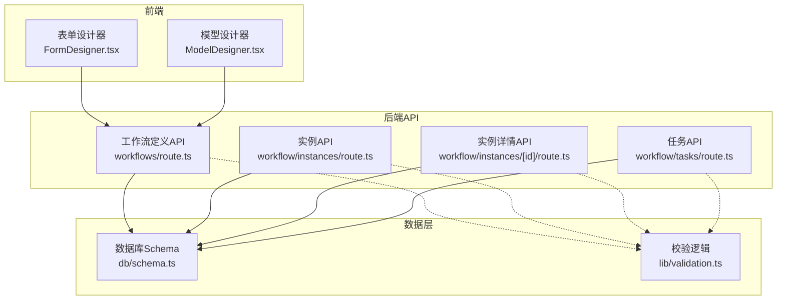
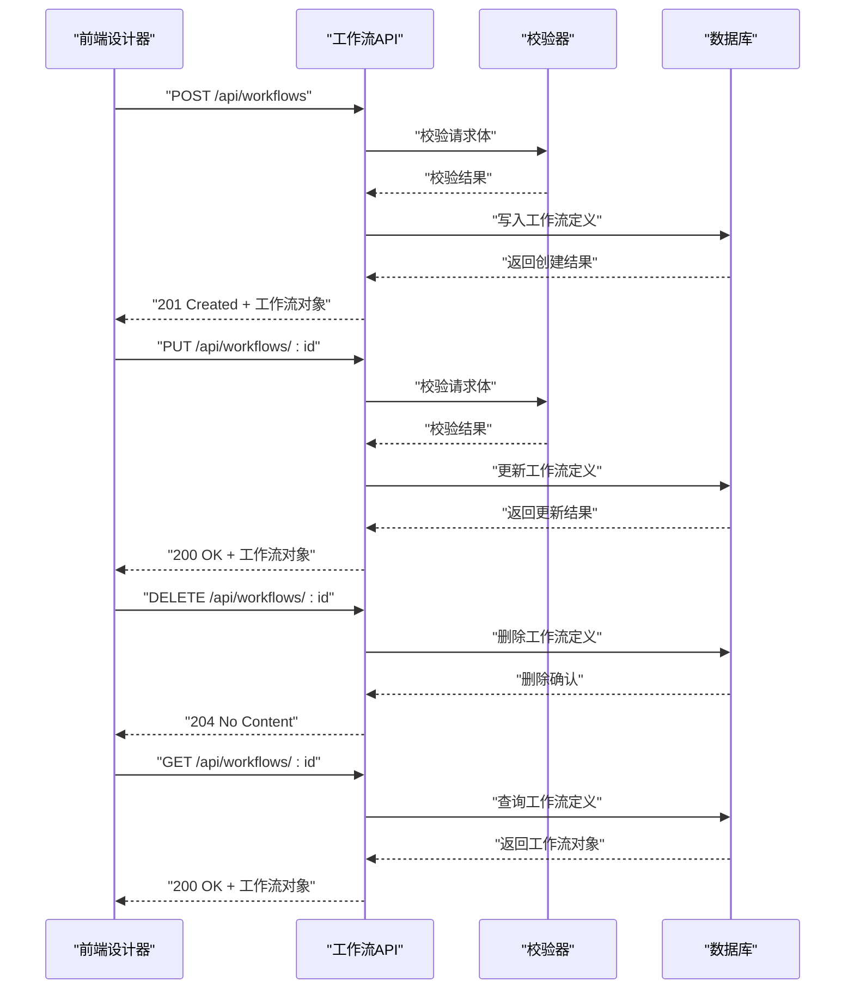
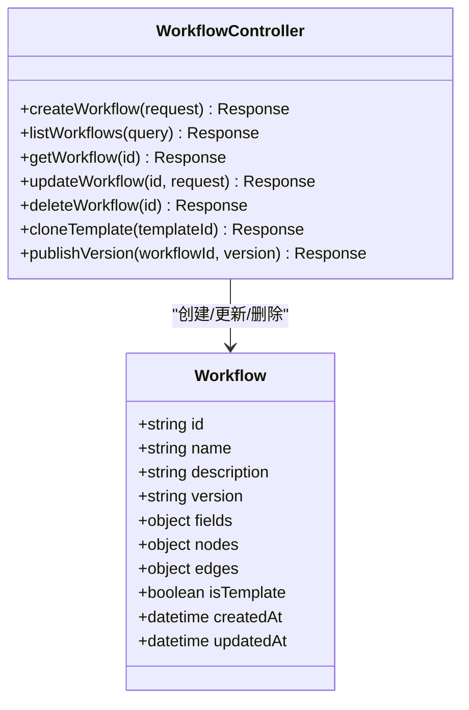
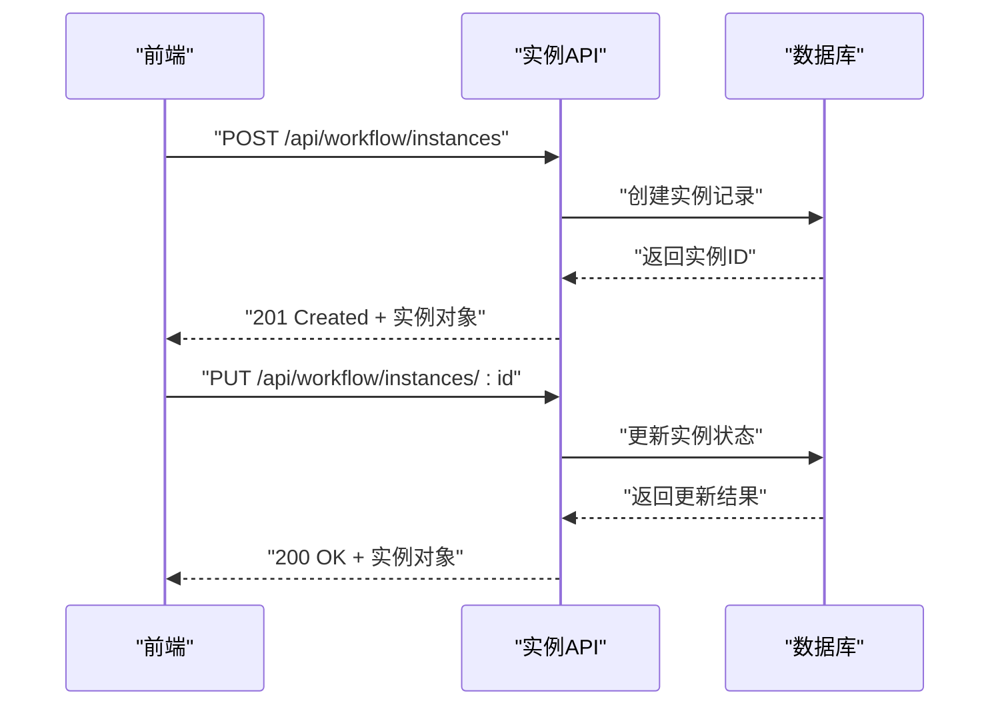
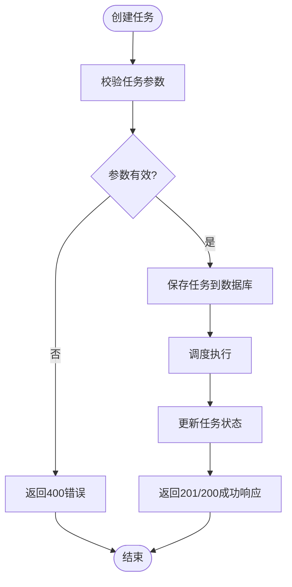
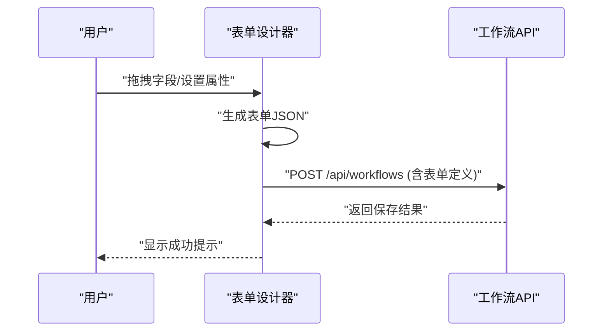
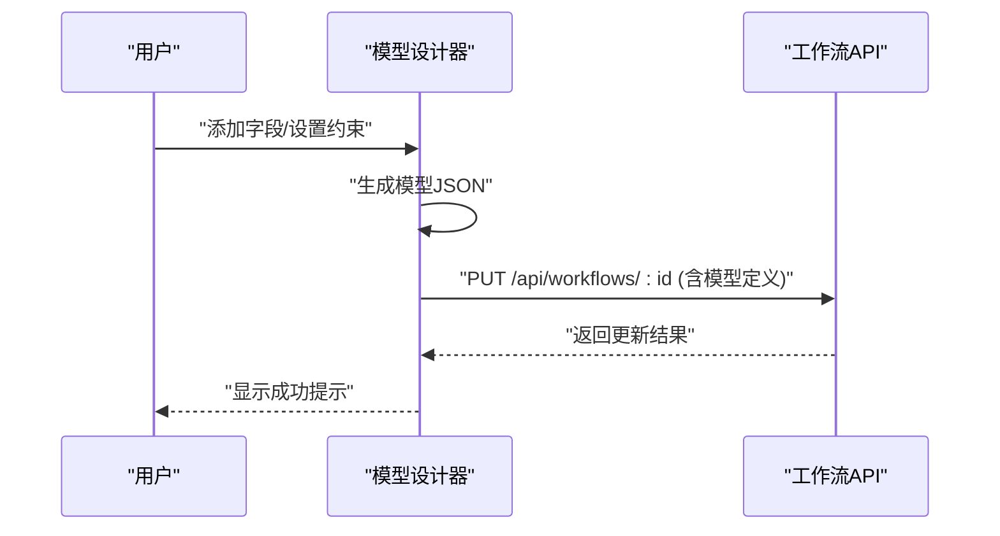
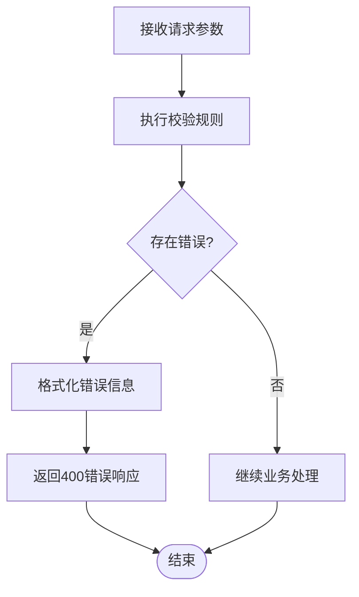
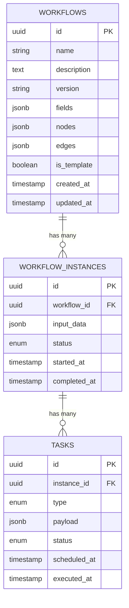
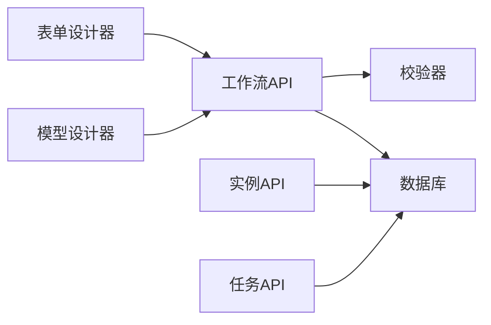

# 工作流定义API

<cite>
**本文档引用的文件**
- [app/api/workflows/route.ts](file://app/api/workflows/route.ts)
- [app/api/workflow/instances/route.ts](file://app/api/workflow/instances/route.ts)
- [app/api/workflow/instances/[id]/route.ts](file://app/api/workflow/instances/[id]/route.ts)
- [app/api/workflow/tasks/route.ts](file://app/api/workflow/tasks/route.ts)
- [app/components/workflow/FormDesigner.tsx](file://app/components/workflow/FormDesigner.tsx)
- [app/components/workflow/ModelDesigner.tsx](file://app/components/workflow/ModelDesigner.tsx)
- [lib/validation.ts](file://lib/validation.ts)
- [db/schema.ts](file://db/schema.ts)
</cite>

## 目录
1. [简介](#简介)
2. [项目结构](#项目结构)
3. [核心组件](#核心组件)
4. [架构总览](#架构总览)
5. [详细组件分析](#详细组件分析)
6. [依赖分析](#依赖分析)
7. [性能考虑](#性能考虑)
8. [故障排查指南](#故障排查指南)
9. [结论](#结论)
10. [附录](#附录)

## 简介
本文件面向“工作流定义API”的开发者与使用者，系统化梳理工作流模型CRUD、表单设计器接口、模型设计器接口的HTTP方法、URL模式、请求/响应模式，并补充工作流模板管理、版本控制、字段验证规则等实现细节与使用示例。文档同时给出工作流定义的JSON Schema规范与数据验证规则说明，帮助快速集成与排错。

## 项目结构
工作流相关能力由后端API路由与前端设计器组件共同构成：
- 后端API路由位于 app/api 下，按功能域划分模块（如 workflows、workflow/instances、workflow/tasks）。
- 前端设计器组件位于 app/components/workflow，提供可视化表单与模型设计能力。
- 数据校验逻辑集中在 lib/validation.ts。
- 数据库Schema定义在 db/schema.ts。

图表来源
- [app/api/workflows/route.ts](file://app/api/workflows/route.ts)
- [app/api/workflow/instances/route.ts](file://app/api/workflow/instances/route.ts)
- [app/api/workflow/instances/[id]/route.ts](file://app/api/workflow/instances/[id]/route.ts)
- [app/api/workflow/tasks/route.ts](file://app/api/workflow/tasks/route.ts)
- [app/components/workflow/FormDesigner.tsx](file://app/components/workflow/FormDesigner.tsx)
- [app/components/workflow/ModelDesigner.tsx](file://app/components/workflow/ModelDesigner.tsx)
- [db/schema.ts](file://db/schema.ts)
- [lib/validation.ts](file://lib/validation.ts)

章节来源
- [app/api/workflows/route.ts](file://app/api/workflows/route.ts)
- [app/api/workflow/instances/route.ts](file://app/api/workflow/instances/route.ts)
- [app/api/workflow/instances/[id]/route.ts](file://app/api/workflow/instances/[id]/route.ts)
- [app/api/workflow/tasks/route.ts](file://app/api/workflow/tasks/route.ts)
- [app/components/workflow/FormDesigner.tsx](file://app/components/workflow/FormDesigner.tsx)
- [app/components/workflow/ModelDesigner.tsx](file://app/components/workflow/ModelDesigner.tsx)
- [db/schema.ts](file://db/schema.ts)
- [lib/validation.ts](file://lib/validation.ts)

## 核心组件
- 工作流定义API（workflows）：提供工作流模型的增删改查、模板管理、版本控制等能力。
- 工作流实例API（workflow/instances）：管理工作流运行时的实例生命周期。
- 工作流任务API（workflow/tasks）：管理与执行相关的任务调度与状态更新。
- 表单设计器（FormDesigner）：生成/编辑表单定义，输出符合规范的JSON结构。
- 模型设计器（ModelDesigner）：生成/编辑数据模型定义，输出字段、类型、约束等元数据。
- 校验器（validation.ts）：统一的数据校验与错误信息聚合。
- 数据库Schema（schema.ts）：持久化结构与关系定义。

章节来源
- [app/api/workflows/route.ts](file://app/api/workflows/route.ts)
- [app/api/workflow/instances/route.ts](file://app/api/workflow/instances/route.ts)
- [app/api/workflow/instances/[id]/route.ts](file://app/api/workflow/instances/[id]/route.ts)
- [app/api/workflow/tasks/route.ts](file://app/api/workflow/tasks/route.ts)
- [app/components/workflow/FormDesigner.tsx](file://app/components/workflow/FormDesigner.tsx)
- [app/components/workflow/ModelDesigner.tsx](file://app/components/workflow/ModelDesigner.tsx)
- [lib/validation.ts](file://lib/validation.ts)
- [db/schema.ts](file://db/schema.ts)

## 架构总览
工作流定义API采用前后端分离架构：
- 前端通过RESTful API调用后端服务进行工作流定义与实例操作。
- 后端对请求进行鉴权、参数校验、业务处理与持久化。
- 数据库层提供稳定的数据模型与迁移支持。

图表来源
- [app/api/workflows/route.ts](file://app/api/workflows/route.ts)
- [lib/validation.ts](file://lib/validation.ts)
- [db/schema.ts](file://db/schema.ts)

## 详细组件分析

### 工作流定义API（workflows）
- URL模式
  - POST /api/workflows：创建工作流定义
  - GET /api/workflows：获取工作流列表
  - GET /api/workflows/:id：获取单个工作流定义
  - PUT /api/workflows/:id：更新工作流定义
  - DELETE /api/workflows/:id：删除工作流定义
- 请求/响应模式
  - 请求体包含工作流名称、描述、版本、字段定义、节点配置等。
  - 响应返回工作流对象及状态码（201/200/204/4xx/5xx）。
- 版本控制
  - 支持版本号递增与历史快照保存。
  - 提供版本切换与回滚接口（若存在）。
- 模板管理
  - 支持将工作流定义为模板，便于复用。
  - 模板可被克隆为新工作流定义。

图表来源
- [app/api/workflows/route.ts](file://app/api/workflows/route.ts)

章节来源
- [app/api/workflows/route.ts](file://app/api/workflows/route.ts)

### 工作流实例API（workflow/instances）
- URL模式
  - POST /api/workflow/instances：创建工作流实例
  - GET /api/workflow/instances：获取实例列表
  - GET /api/workflow/instances/:id：获取实例详情
  - PUT /api/workflow/instances/:id：更新实例状态
  - DELETE /api/workflow/instances/:id：删除实例
- 请求/响应模式
  - 请求体包含工作流ID、输入数据、上下文信息等。
  - 响应返回实例ID、状态、进度等。

图表来源
- [app/api/workflow/instances/route.ts](file://app/api/workflow/instances/route.ts)
- [app/api/workflow/instances/[id]/route.ts](file://app/api/workflow/instances/[id]/route.ts)

章节来源
- [app/api/workflow/instances/route.ts](file://app/api/workflow/instances/route.ts)
- [app/api/workflow/instances/[id]/route.ts](file://app/api/workflow/instances/[id]/route.ts)

### 工作流任务API（workflow/tasks）
- URL模式
  - POST /api/workflow/tasks：创建任务
  - GET /api/workflow/tasks：获取任务列表
  - GET /api/workflow/tasks/:id：获取任务详情
  - PUT /api/workflow/tasks/:id：更新任务状态
  - DELETE /api/workflow/tasks/:id：删除任务
- 请求/响应模式
  - 请求体包含任务类型、关联实例ID、优先级、执行参数等。
  - 响应返回任务ID、状态、执行结果等。

图表来源
- [app/api/workflow/tasks/route.ts](file://app/api/workflow/tasks/route.ts)

章节来源
- [app/api/workflow/tasks/route.ts](file://app/api/workflow/tasks/route.ts)

### 表单设计器（FormDesigner）
- 功能概述
  - 可视化拖拽表单字段，实时预览。
  - 导出表单定义JSON，供后端API使用。
- 数据结构
  - 字段类型：文本、数字、日期、选择、附件等。
  - 验证规则：必填、长度、格式、自定义表达式等。
- 交互流程
  - 用户编辑表单 → 生成JSON → 调用工作流定义API保存。

图表来源
- [app/components/workflow/FormDesigner.tsx](file://app/components/workflow/FormDesigner.tsx)
- [app/api/workflows/route.ts](file://app/api/workflows/route.ts)

章节来源
- [app/components/workflow/FormDesigner.tsx](file://app/components/workflow/FormDesigner.tsx)

### 模型设计器（ModelDesigner）
- 功能概述
  - 可视化编辑数据模型，定义字段、类型、约束。
  - 导出模型定义JSON，用于工作流数据持久化。
- 数据结构
  - 字段名、数据类型、是否必填、默认值、枚举值等。
- 交互流程
  - 用户编辑模型 → 生成JSON → 调用工作流定义API保存。

图表来源
- [app/components/workflow/ModelDesigner.tsx](file://app/components/workflow/ModelDesigner.tsx)
- [app/api/workflows/route.ts](file://app/api/workflows/route.ts)

章节来源
- [app/components/workflow/ModelDesigner.tsx](file://app/components/workflow/ModelDesigner.tsx)

### 数据校验（validation.ts）
- 功能概述
  - 统一校验请求参数，返回结构化错误信息。
  - 支持基础类型校验、自定义规则、异步校验。
- 常见规则
  - 必填、最小/最大长度、数值范围、邮箱格式、正则匹配等。
- 错误处理
  - 聚合所有错误，返回400状态码与详细错误列表。

图表来源
- [lib/validation.ts](file://lib/validation.ts)

章节来源
- [lib/validation.ts](file://lib/validation.ts)

### 数据库Schema（schema.ts）
- 功能概述
  - 定义工作流、实例、任务等表结构。
  - 提供字段类型、约束、索引等元数据。
- 关键表
  - workflows：工作流定义表
  - workflow_instances：工作流实例表
  - tasks：任务表

图表来源
- [db/schema.ts](file://db/schema.ts)

章节来源
- [db/schema.ts](file://db/schema.ts)

## 依赖分析
- 前端组件依赖后端API进行数据持久化。
- 后端API依赖校验器进行参数验证。
- 后端API依赖数据库进行数据存取。
- 各模块间通过明确的接口契约通信，降低耦合度。

图表来源
- [app/components/workflow/FormDesigner.tsx](file://app/components/workflow/FormDesigner.tsx)
- [app/components/workflow/ModelDesigner.tsx](file://app/components/workflow/ModelDesigner.tsx)
- [app/api/workflows/route.ts](file://app/api/workflows/route.ts)
- [app/api/workflow/instances/route.ts](file://app/api/workflow/instances/route.ts)
- [app/api/workflow/tasks/route.ts](file://app/api/workflow/tasks/route.ts)
- [lib/validation.ts](file://lib/validation.ts)
- [db/schema.ts](file://db/schema.ts)

章节来源
- [app/components/workflow/FormDesigner.tsx](file://app/components/workflow/FormDesigner.tsx)
- [app/components/workflow/ModelDesigner.tsx](file://app/components/workflow/ModelDesigner.tsx)
- [app/api/workflows/route.ts](file://app/api/workflows/route.ts)
- [app/api/workflow/instances/route.ts](file://app/api/workflow/instances/route.ts)
- [app/api/workflow/tasks/route.ts](file://app/api/workflow/tasks/route.ts)
- [lib/validation.ts](file://lib/validation.ts)
- [db/schema.ts](file://db/schema.ts)

## 性能考虑
- 批量操作：支持批量创建/更新工作流定义，减少网络往返。
- 缓存策略：对频繁读取的工作流定义进行缓存，提升响应速度。
- 异步处理：任务执行采用异步队列，避免阻塞主线程。
- 分页查询：实例与任务列表支持分页，减少数据传输量。
- 索引优化：为常用查询字段建立索引，加速数据库检索。

[本节为通用指导，无需特定文件引用]

## 故障排查指南
- 400错误：检查请求参数是否符合校验规则，查看错误详情定位问题字段。
- 404错误：确认URL路径与资源ID是否正确。
- 500错误：检查后端日志，定位数据库连接或业务逻辑异常。
- 版本冲突：更新工作流定义时注意版本号冲突，确保乐观锁机制正确。
- 实例状态异常：检查实例状态机转换是否合法，查看任务执行日志。

章节来源
- [lib/validation.ts](file://lib/validation.ts)
- [app/api/workflows/route.ts](file://app/api/workflows/route.ts)
- [app/api/workflow/instances/route.ts](file://app/api/workflow/instances/route.ts)
- [app/api/workflow/tasks/route.ts](file://app/api/workflow/tasks/route.ts)

## 结论
工作流定义API提供了完整的工作流管理能力，包括模型CRUD、表单与模型设计器集成、实例与任务管理、版本控制与模板复用。通过统一的校验机制与清晰的Schema定义，确保了数据的完整性与一致性。建议在生产环境中启用缓存、异步处理与监控告警，以提升系统稳定性与性能。

[本节为总结性内容，无需特定文件引用]

## 附录

### JSON Schema规范（工作流定义）
- 顶层字段
  - id：字符串，唯一标识
  - name：字符串，工作流名称
  - description：字符串，描述信息
  - version：字符串，版本号
  - fields：对象数组，字段定义
  - nodes：对象数组，节点配置
  - edges：对象数组，边配置
  - isTemplate：布尔值，是否为模板
  - createdAt：时间戳，创建时间
  - updatedAt：时间戳，更新时间
- 字段定义
  - name：字符串，字段名
  - type：字符串，字段类型
  - required：布尔值，是否必填
  - default：任意类型，默认值
  - validation：对象，验证规则
- 节点配置
  - id：字符串，节点ID
  - type：字符串，节点类型
  - config：对象，节点配置
- 边配置
  - source：字符串，源节点ID
  - target：字符串，目标节点ID
  - label：字符串，边标签

章节来源
- [db/schema.ts](file://db/schema.ts)
- [lib/validation.ts](file://lib/validation.ts)

### 数据验证规则说明
- 必填校验：确保关键字段不为空
- 长度校验：限制字符串或数组长度
- 数值校验：检查数值范围与精度
- 格式校验：验证邮箱、URL、日期等格式
- 自定义规则：支持正则表达式与函数校验
- 错误消息：提供友好的中文错误提示

章节来源
- [lib/validation.ts](file://lib/validation.ts)

### 使用示例
- 创建工作流定义
  - 方法：POST
  - 路径：/api/workflows
  - 请求体：包含工作流基本信息与配置
  - 响应：返回创建的工作流对象
- 更新工作流定义
  - 方法：PUT
  - 路径：/api/workflows/:id
  - 请求体：包含需要更新的字段
  - 响应：返回更新后的工作流对象
- 删除工作流定义
  - 方法：DELETE
  - 路径：/api/workflows/:id
  - 响应：204 No Content
- 创建工作流实例
  - 方法：POST
  - 路径：/api/workflow/instances
  - 请求体：包含工作流ID与输入数据
  - 响应：返回实例ID与初始状态

章节来源
- [app/api/workflows/route.ts](file://app/api/workflows/route.ts)
- [app/api/workflow/instances/route.ts](file://app/api/workflow/instances/route.ts)