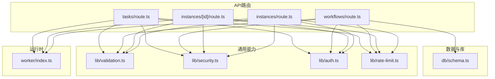
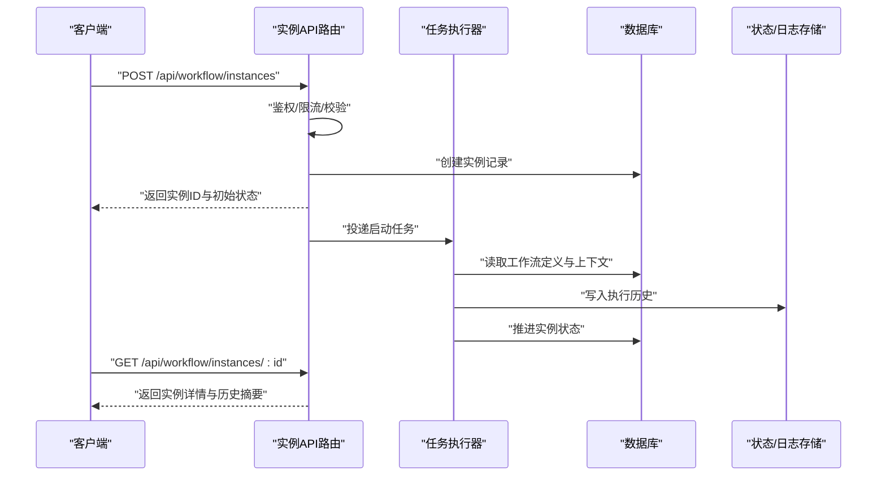
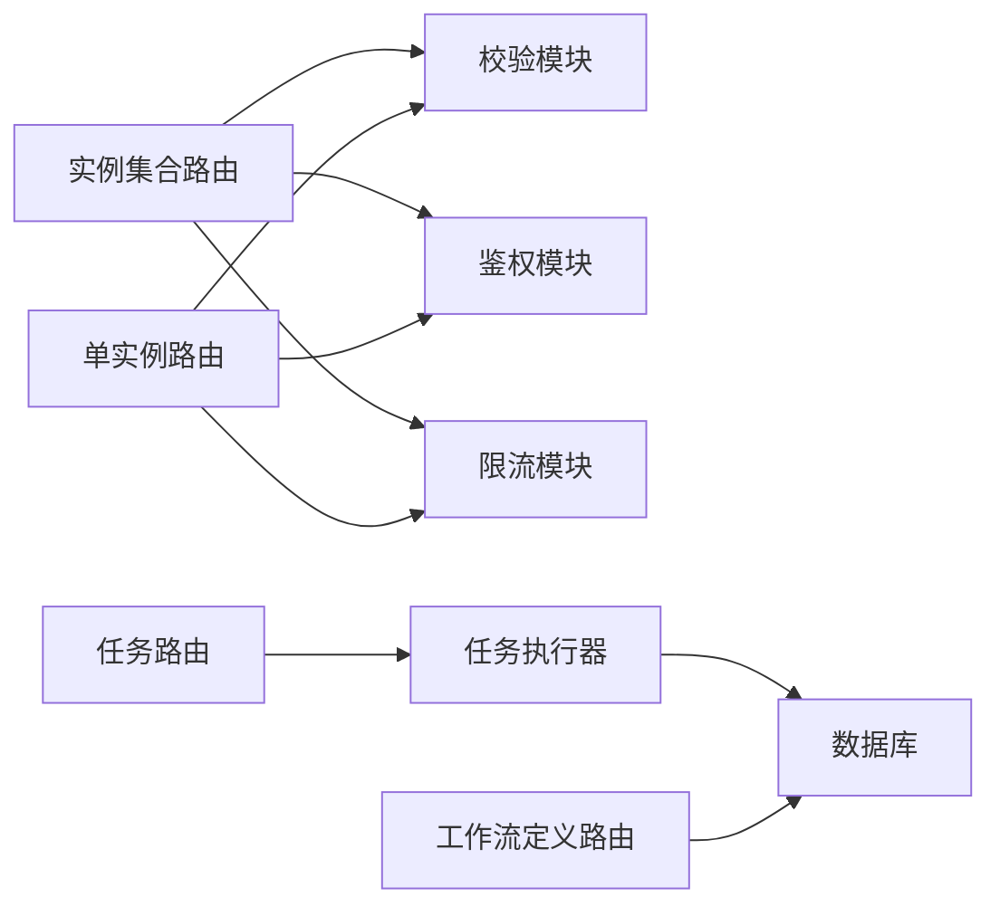
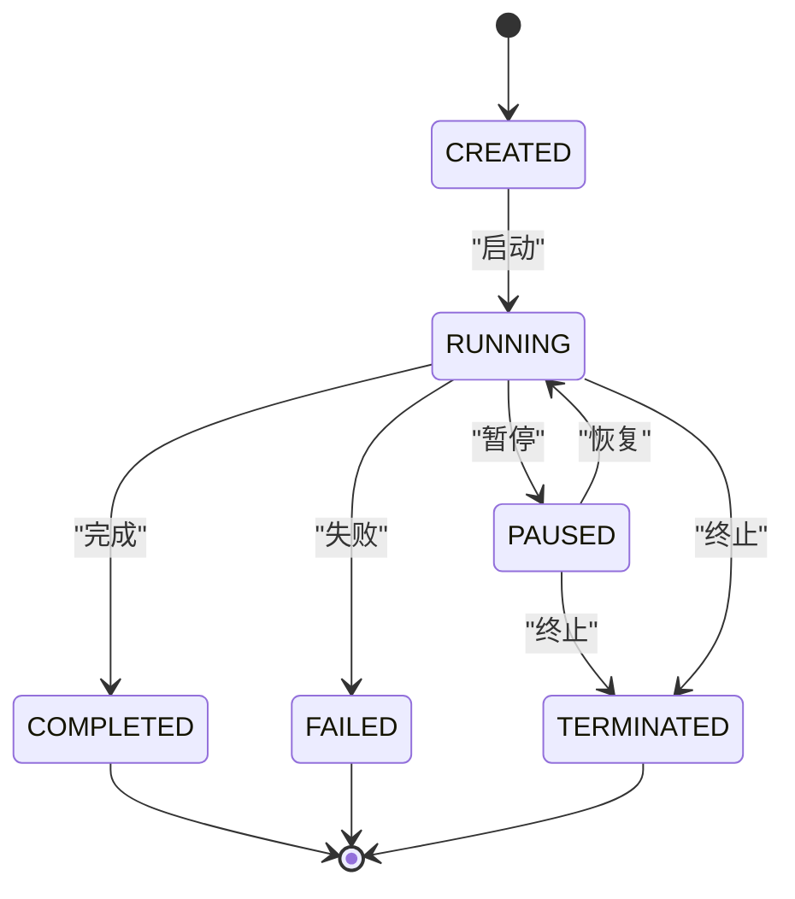

# 工作流实例API

<cite>
**本文引用的文件**   
- [app/api/workflow/instances/route.ts](file://app/api/workflow/instances/route.ts)
- [app/api/workflow/instances/[id]/route.ts](file://app/api/workflow/instances/[id]/route.ts)
- [app/api/workflows/route.ts](file://app/api/workflows/route.ts)
- [app/api/workflow/tasks/route.ts](file://app/api/workflow/tasks/route.ts)
- [worker/index.ts](file://worker/index.ts)
- [db/schema.ts](file://db/schema.ts)
- [lib/validation.ts](file://lib/validation.ts)
- [lib/security.ts](file://lib/security.ts)
- [lib/auth.ts](file://lib/auth.ts)
- [lib/rate-limit.ts](file://lib/rate-limit.ts)
</cite>

## 目录
1. [简介](#简介)
2. [项目结构](#项目结构)
3. [核心组件](#核心组件)
4. [架构总览](#架构总览)
5. [详细组件分析](#详细组件分析)
6. [依赖关系分析](#依赖关系分析)
7. [性能考虑](#性能考虑)
8. [故障排查指南](#故障排查指南)
9. [结论](#结论)
10. [附录](#附录)

## 简介
本文件为“工作流实例API”的完整技术文档，覆盖工作流实例的生命周期管理（创建、启动、暂停、恢复、终止）、状态机转换、执行历史追踪、错误处理与重试机制，以及监控、性能指标与调试信息的获取方式。文档面向开发者与运维人员，既提供接口规范，也给出实现要点与排障建议。

## 项目结构
工作流实例相关API位于Next.js App Router的API路由中：
- 实例集合与单实例操作：app/api/workflow/instances/*
- 工作流定义与版本：app/api/workflows/*
- 任务调度与执行：app/api/workflow/tasks/*
- 后台任务执行器：worker/index.ts
- 数据模型与校验：db/schema.ts、lib/validation.ts
- 鉴权与安全：lib/auth.ts、lib/security.ts
- 限流策略：lib/rate-limit.ts

图表来源
- [app/api/workflow/instances/route.ts](file://app/api/workflow/instances/route.ts)
- [app/api/workflow/instances/[id]/route.ts](file://app/api/workflow/instances/[id]/route.ts)
- [app/api/workflows/route.ts](file://app/api/workflows/route.ts)
- [app/api/workflow/tasks/route.ts](file://app/api/workflow/tasks/route.ts)
- [worker/index.ts](file://worker/index.ts)
- [db/schema.ts](file://db/schema.ts)
- [lib/validation.ts](file://lib/validation.ts)
- [lib/security.ts](file://lib/security.ts)
- [lib/auth.ts](file://lib/auth.ts)
- [lib/rate-limit.ts](file://lib/rate-limit.ts)

章节来源
- [app/api/workflow/instances/route.ts](file://app/api/workflow/instances/route.ts)
- [app/api/workflow/instances/[id]/route.ts](file://app/api/workflow/instances/[id]/route.ts)
- [app/api/workflows/route.ts](file://app/api/workflows/route.ts)
- [app/api/workflow/tasks/route.ts](file://app/api/workflow/tasks/route.ts)
- [worker/index.ts](file://worker/index.ts)
- [db/schema.ts](file://db/schema.ts)
- [lib/validation.ts](file://lib/validation.ts)
- [lib/security.ts](file://lib/security.ts)
- [lib/auth.ts](file://lib/auth.ts)
- [lib/rate-limit.ts](file://lib/rate-limit.ts)

## 核心组件
- 实例路由层
  - 集合路由：负责创建工作流实例、列表查询、批量操作入口等。
  - 单实例路由：负责按ID获取实例详情、启动/暂停/恢复/终止等生命周期控制。
- 任务执行器
  - 接收任务队列消息，驱动节点执行、状态推进、历史记录写入与异常上报。
- 数据模型
  - 工作流定义、实例、任务、执行历史等表结构与约束。
- 校验与安全
  - 请求体校验、输入清洗、权限校验、速率限制、安全头与CORS策略。

章节来源
- [app/api/workflow/instances/route.ts](file://app/api/workflow/instances/route.ts)
- [app/api/workflow/instances/[id]/route.ts](file://app/api/workflow/instances/[id]/route.ts)
- [worker/index.ts](file://worker/index.ts)
- [db/schema.ts](file://db/schema.ts)
- [lib/validation.ts](file://lib/validation.ts)
- [lib/security.ts](file://lib/security.ts)
- [lib/auth.ts](file://lib/auth.ts)
- [lib/rate-limit.ts](file://lib/rate-limit.ts)

## 架构总览
工作流实例API采用“HTTP API + 异步任务执行器”的解耦架构。客户端通过RESTful接口提交实例创建与生命周期变更请求，API层完成鉴权、校验与参数处理后，将任务投递至后台执行器；执行器持久化执行历史并更新实例状态，最终通过查询接口暴露最新状态与指标。

图表来源
- [app/api/workflow/instances/route.ts](file://app/api/workflow/instances/route.ts)
- [app/api/workflow/instances/[id]/route.ts](file://app/api/workflow/instances/[id]/route.ts)
- [worker/index.ts](file://worker/index.ts)
- [db/schema.ts](file://db/schema.ts)

## 详细组件分析

### 实例集合路由：创建与列表
- URL模式与方法
  - POST /api/workflow/instances：创建工作流实例
  - GET /api/workflow/instances：分页/过滤查询实例列表
- 请求体与响应
  - 创建请求包含工作流标识、运行上下文、触发源、优先级等字段；响应返回实例ID、初始状态、时间戳。
  - 列表响应包含分页元数据与实例摘要。
- 业务逻辑
  - 鉴权与限流：校验用户身份与访问频率。
  - 输入校验：基于schema对请求体进行严格校验。
  - 事务性创建：在数据库中创建实例记录，确保一致性。
  - 异步启动：投递启动任务到执行器，避免阻塞HTTP响应。
- 错误处理
  - 参数校验失败返回400。
  - 权限不足返回401/403。
  - 资源冲突或重复创建返回409。
  - 内部错误返回500并附带错误码。

章节来源
- [app/api/workflow/instances/route.ts](file://app/api/workflow/instances/route.ts)
- [lib/validation.ts](file://lib/validation.ts)
- [lib/auth.ts](file://lib/auth.ts)
- [lib/rate-limit.ts](file://lib/rate-limit.ts)

### 单实例路由：生命周期控制
- URL模式与方法
  - GET /api/workflow/instances/:id：获取实例详情（含最近历史）
  - POST /api/workflow/instances/:id/start：启动实例
  - POST /api/workflow/instances/:id/pause：暂停实例
  - POST /api/workflow/instances/:id/resume：恢复实例
  - POST /api/workflow/instances/:id/terminate：终止实例
- 请求体与响应
  - 启动/暂停/恢复/终止通常无需请求体或仅需备注；响应返回新状态与更新时间。
- 状态机转换
  - 初始态：CREATED
  - 运行态：RUNNING
  - 暂停态：PAUSED
  - 完成态：COMPLETED
  - 失败态：FAILED
  - 终止态：TERMINATED
  - 合法转换示例：CREATED→RUNNING；RUNNING→PAUSED；PAUSED→RUNNING；RUNNING→COMPLETED；任意可运行态→TERMINATED；异常→FAILED。
- 执行历史追踪
  - 每次状态变更均写入历史事件，包含事件类型、时间戳、操作者、原因、快照等。
- 错误处理
  - 非法状态转换返回400。
  - 实例不存在返回404。
  - 并发冲突使用乐观锁或版本号控制，返回409。

章节来源
- [app/api/workflow/instances/[id]/route.ts](file://app/api/workflow/instances/[id]/route.ts)
- [db/schema.ts](file://db/schema.ts)

### 任务执行器：执行与重试
- 职责
  - 消费任务队列，加载工作流定义与实例上下文，逐步执行节点。
  - 维护执行历史，推进实例状态，处理异常与重试。
- 重试机制
  - 指数退避：根据失败次数计算等待时间。
  - 最大重试次数：超过阈值标记为失败并通知调用方。
  - 幂等性：同一任务多次投递需保证结果一致。
- 监控与指标
  - 记录执行耗时、节点成功率、失败率、队列长度、吞吐等指标。
  - 支持导出或推送至监控系统。

章节来源
- [worker/index.ts](file://worker/index.ts)
- [db/schema.ts](file://db/schema.ts)

### 工作流定义与任务路由
- 工作流定义
  - GET/POST /api/workflows：查询与创建工作流定义，用于实例运行时解析。
- 任务路由
  - GET/POST /api/workflow/tasks：任务查询与手动触发（如重跑、补偿）。

章节来源
- [app/api/workflows/route.ts](file://app/api/workflows/route.ts)
- [app/api/workflow/tasks/route.ts](file://app/api/workflow/tasks/route.ts)

### 数据模型与校验
- 数据模型
  - 工作流定义：标识、版本、节点图、参数映射等。
  - 实例：关联工作流、状态、上下文、审计字段。
  - 任务：类型、目标、参数、重试策略、执行结果。
  - 执行历史：事件序列、快照、错误信息。
- 校验规则
  - 必填字段、格式校验、枚举值校验、范围校验、依赖校验。

章节来源
- [db/schema.ts](file://db/schema.ts)
- [lib/validation.ts](file://lib/validation.ts)

### 鉴权与安全
- 鉴权流程
  - 基于令牌的身份验证，校验用户角色与资源权限。
- 安全措施
  - 输入清洗、SQL注入防护、XSS防护、CORS配置、敏感信息脱敏。
- 限流策略
  - 按用户/IP/接口维度限流，防止滥用与DDoS。

章节来源
- [lib/auth.ts](file://lib/auth.ts)
- [lib/security.ts](file://lib/security.ts)
- [lib/rate-limit.ts](file://lib/rate-limit.ts)

## 依赖关系分析
- 路由层依赖校验、鉴权、限流模块，确保请求合法性与安全性。
- 实例路由与任务执行器通过消息队列或作业表解耦，提升吞吐与可靠性。
- 数据层统一由schema定义，保障一致性。
- 执行器依赖数据库与外部服务（如邮件、消息队列），需具备容错与降级能力。

图表来源
- [app/api/workflow/instances/route.ts](file://app/api/workflow/instances/route.ts)
- [app/api/workflow/instances/[id]/route.ts](file://app/api/workflow/instances/[id]/route.ts)
- [app/api/workflow/tasks/route.ts](file://app/api/workflow/tasks/route.ts)
- [app/api/workflows/route.ts](file://app/api/workflows/route.ts)
- [worker/index.ts](file://worker/index.ts)
- [db/schema.ts](file://db/schema.ts)
- [lib/validation.ts](file://lib/validation.ts)
- [lib/auth.ts](file://lib/auth.ts)
- [lib/rate-limit.ts](file://lib/rate-limit.ts)

## 性能考虑
- 异步化处理：创建与生命周期变更仅投递任务，避免长连接阻塞。
- 分页与过滤：列表接口支持分页与条件过滤，减少数据传输量。
- 索引优化：对实例ID、工作流ID、状态、时间戳建立索引，加速查询。
- 缓存策略：热点实例详情与工作流定义可使用短期缓存。
- 背压与限流：在高并发场景下启用限流与队列缓冲，保护后端。
- 批处理：批量操作采用事务与批写，降低IO开销。

## 故障排查指南
- 常见问题定位
  - 实例未启动：检查任务是否投递成功、执行器是否运行、数据库连接是否正常。
  - 状态卡住：查看执行历史中的最后事件与错误堆栈，确认节点逻辑与外部依赖。
  - 权限错误：核对用户角色与资源绑定，检查鉴权中间件配置。
  - 限流触发：观察限流计数与阈值，调整配额或扩容。
- 诊断信息获取
  - 实例详情：包含当前状态、最近历史、错误摘要。
  - 执行历史：逐条事件、时间线、上下文快照。
  - 任务队列：待处理、进行中、失败数量与延迟。
  - 系统指标：CPU、内存、队列长度、错误率、P95/P99延迟。
- 恢复步骤
  - 失败重试：针对瞬时错误自动重试；人工干预后重新触发。
  - 补偿任务：对部分失败的节点执行补偿逻辑。
  - 回滚：必要时回滚到上一个稳定状态。

章节来源
- [app/api/workflow/instances/[id]/route.ts](file://app/api/workflow/instances/[id]/route.ts)
- [worker/index.ts](file://worker/index.ts)
- [db/schema.ts](file://db/schema.ts)

## 结论
工作流实例API通过清晰的REST接口与异步执行器实现了高内聚、低耦合的工作流生命周期管理。结合严格的校验、鉴权与限流，以及完善的执行历史与重试机制，能够满足复杂业务流程的稳定运行需求。建议在部署时关注性能指标与监控告警，持续优化队列与数据库性能，确保系统在高负载下的可靠性与可扩展性。

## 附录

### 接口清单与行为说明
- 创建实例
  - 方法：POST
  - 路径：/api/workflow/instances
  - 行为：创建实例并投递启动任务，返回实例ID与初始状态。
- 启动实例
  - 方法：POST
  - 路径：/api/workflow/instances/:id/start
  - 行为：从非运行态切换到运行态，记录历史事件。
- 暂停实例
  - 方法：POST
  - 路径：/api/workflow/instances/:id/pause
  - 行为：从运行态切换到暂停态，保留上下文。
- 恢复实例
  - 方法：POST
  - 路径：/api/workflow/instances/:id/resume
  - 行为：从暂停态恢复到运行态，继续执行。
- 终止实例
  - 方法：POST
  - 路径：/api/workflow/instances/:id/terminate
  - 行为：终止正在运行的实例，进入终止态。
- 查询实例
  - 方法：GET
  - 路径：/api/workflow/instances/:id
  - 行为：返回实例详情与最近历史。
- 查询列表
  - 方法：GET
  - 路径：/api/workflow/instances
  - 行为：分页与过滤返回实例摘要。

### 状态机转换图

图表来源
- [app/api/workflow/instances/[id]/route.ts](file://app/api/workflow/instances/[id]/route.ts)

### 错误码参考
- 400：参数校验失败或非法状态转换
- 401：未认证
- 403：无权限
- 404：实例不存在
- 409：资源冲突或重复操作
- 429：触发限流
- 500：内部错误

章节来源
- [app/api/workflow/instances/route.ts](file://app/api/workflow/instances/route.ts)
- [app/api/workflow/instances/[id]/route.ts](file://app/api/workflow/instances/[id]/route.ts)
- [lib/rate-limit.ts](file://lib/rate-limit.ts)