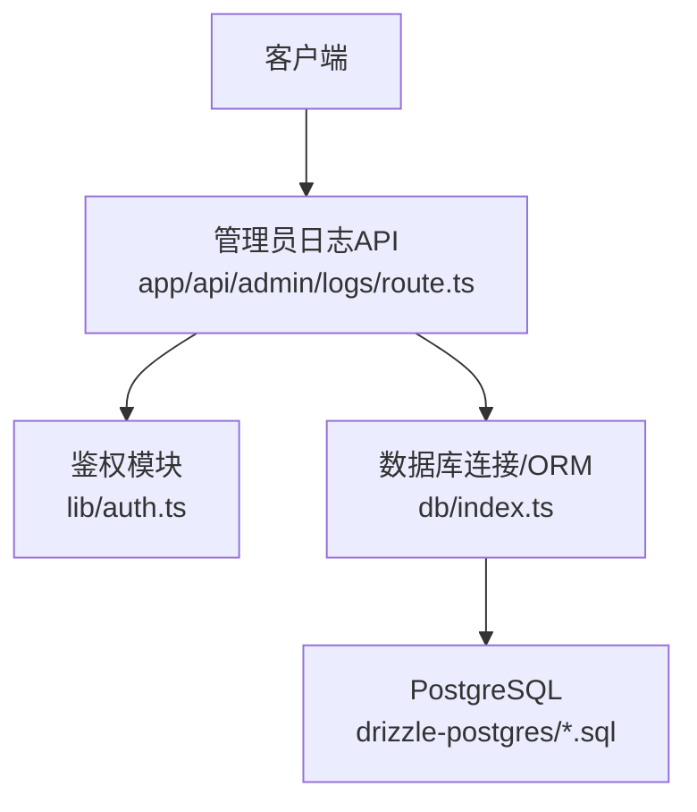
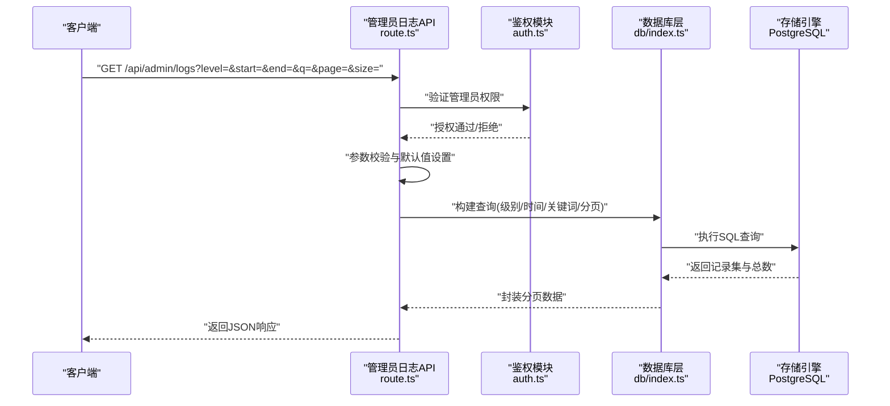
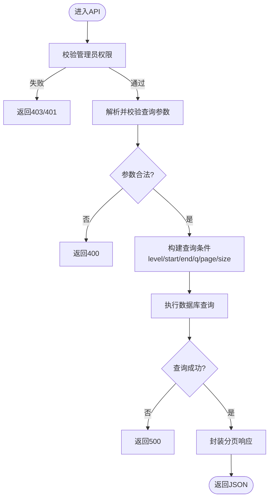
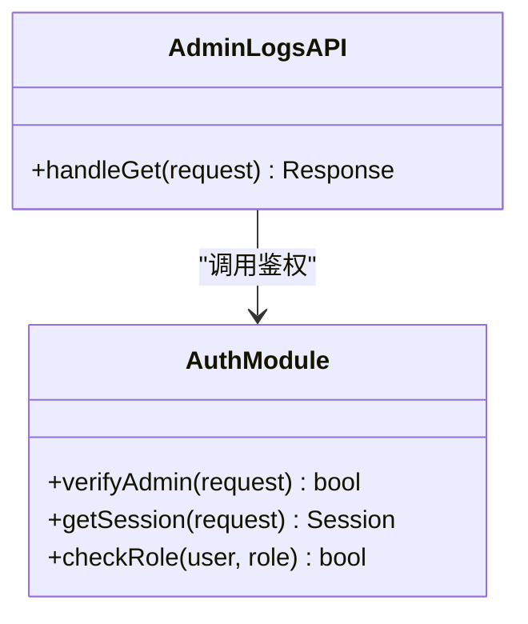
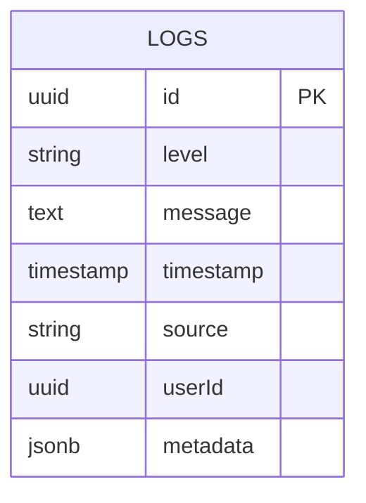
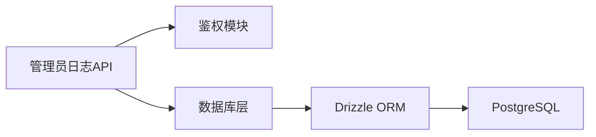

# 日志管理API

<cite>
**本文引用的文件**   
- [app/api/admin/logs/route.ts](file://app/api/admin/logs/route.ts)
- [lib/auth.ts](file://lib/auth.ts)
- [db/index.ts](file://db/index.ts)
- [drizzle-postgres/0000_fine_psylocke.sql](file://drizzle-postgres/0000_fine_psylocke.sql)
- [drizzle-postgres/0001_thin_queen_noir.sql](file://drizzle-postgres/0001_thin_queen_noir.sql)
- [drizzle-postgres/0002_crazy_ravenous.sql](file://drizzle-postgres/0002_crazy_ravenous.sql)
- [drizzle-postgres/0003_fine_quentin_quire.sql](file://drizzle-postgres/0003_fine_quentin_quire.sql)
</cite>

## 目录
1. [简介](#简介)
2. [项目结构](#项目结构)
3. [核心组件](#核心组件)
4. [架构总览](#架构总览)
5. [详细组件分析](#详细组件分析)
6. [依赖分析](#依赖分析)
7. [性能考虑](#性能考虑)
8. [故障排查指南](#故障排查指南)
9. [结论](#结论)
10. [附录](#附录)

## 简介
本文件面向CS1学生事务管理系统的管理员日志管理API，聚焦于系统日志的查询、过滤与检索能力。文档涵盖HTTP方法与URL模式、请求与响应结构、日志级别筛选、时间范围查询、关键词搜索等关键功能；同时说明日志数据结构、分页机制、性能优化策略以及访问控制策略，帮助开发者快速集成与正确使用该API。

## 项目结构
与日志管理API直接相关的后端入口位于Next.js App Router的API路由中：
- 管理员日志接口：app/api/admin/logs/route.ts
- 鉴权与权限校验：lib/auth.ts
- 数据库连接与ORM：db/index.ts
- 数据库迁移脚本（包含日志表定义）：drizzle-postgres/*.sql

**图表来源**
- [app/api/admin/logs/route.ts](file://app/api/admin/logs/route.ts)
- [lib/auth.ts](file://lib/auth.ts)
- [db/index.ts](file://db/index.ts)
- [drizzle-postgres/0000_fine_psylocke.sql](file://drizzle-postgres/0000_fine_psylocke.sql)
- [drizzle-postgres/0001_thin_queen_noir.sql](file://drizzle-postgres/0001_thin_queen_noir.sql)
- [drizzle-postgres/0002_crazy_ravenous.sql](file://drizzle-postgres/0002_crazy_ravenous.sql)
- [drizzle-postgres/0003_fine_quentin_quire.sql](file://drizzle-postgres/0003_fine_quentin_quire.sql)

**章节来源**
- [app/api/admin/logs/route.ts](file://app/api/admin/logs/route.ts)
- [lib/auth.ts](file://lib/auth.ts)
- [db/index.ts](file://db/index.ts)

## 核心组件
- 管理员日志API路由：提供GET方法用于查询系统日志，支持按级别、时间范围、关键词等条件过滤，并返回分页结果。
- 鉴权模块：对管理员角色进行校验，确保只有具备管理员权限的用户可访问日志接口。
- 数据库层：通过ORM执行SQL查询，结合索引与分页参数提升性能。

**章节来源**
- [app/api/admin/logs/route.ts](file://app/api/admin/logs/route.ts)
- [lib/auth.ts](file://lib/auth.ts)
- [db/index.ts](file://db/index.ts)

## 架构总览
下图展示了从客户端发起请求到数据库查询返回结果的完整流程，包括鉴权、参数校验、查询构建与分页处理。

**图表来源**
- [app/api/admin/logs/route.ts](file://app/api/admin/logs/route.ts)
- [lib/auth.ts](file://lib/auth.ts)
- [db/index.ts](file://db/index.ts)

## 详细组件分析

### 管理员日志API（GET /api/admin/logs）
- HTTP方法：GET
- URL模式：/api/admin/logs
- 查询参数：
  - level：日志级别筛选（如INFO、WARN、ERROR等）
  - start：开始时间（ISO 8601或Unix毫秒），可选
  - end：结束时间（ISO 8601或Unix毫秒），可选
  - q：关键词搜索（匹配消息内容或相关字段），可选
  - page：页码，默认1
  - size：每页条数，默认50，最大建议不超过200
- 成功响应体（示例结构）：
  - code：状态码（如200）
  - message：提示信息
  - data：
    - total：总记录数
    - page：当前页码
    - size：每页大小
    - items：日志条目数组，每条包含id、level、message、timestamp、source、userId等字段
- 错误响应体：
  - code：错误码（如401、403、400、500）
  - message：错误描述

实现要点：
- 鉴权：仅允许管理员角色访问，未授权时返回401/403。
- 参数校验：对level、start、end、q、page、size进行合法性检查，非法输入返回400。
- 查询构建：根据level、start、end、q动态拼接WHERE条件；使用索引字段（如timestamp、level）加速查询。
- 分页：基于LIMIT/OFFSET或游标分页，避免大偏移量带来的性能问题。
- 排序：默认按timestamp降序，支持按level或source排序（可选）。

**图表来源**
- [app/api/admin/logs/route.ts](file://app/api/admin/logs/route.ts)

**章节来源**
- [app/api/admin/logs/route.ts](file://app/api/admin/logs/route.ts)

### 鉴权模块（管理员权限校验）
- 职责：验证请求是否来自已登录且具备管理员角色的用户。
- 行为：
  - 若未认证：返回401。
  - 若非管理员：返回403。
  - 若认证成功：继续后续业务逻辑。

**图表来源**
- [lib/auth.ts](file://lib/auth.ts)
- [app/api/admin/logs/route.ts](file://app/api/admin/logs/route.ts)

**章节来源**
- [lib/auth.ts](file://lib/auth.ts)

### 数据库层（日志表结构与查询）
- 日志表字段（典型设计）：
  - id：主键
  - level：日志级别（枚举或字符串）
  - message：日志消息
  - timestamp：时间戳（索引）
  - source：来源模块或服务
  - userId：关联用户ID（可选）
  - metadata：扩展元数据（JSON或文本）
- 索引建议：
  - timestamp、level组合索引以优化时间范围与级别筛选。
  - 如需关键词搜索，可对message建立全文索引或使用LIKE+索引优化。
- 分页策略：
  - 优先使用LIMIT/OFFSET配合ORDER BY timestamp DESC。
  - 大数据量场景建议使用游标分页（基于timestamp或id）。

**图表来源**
- [db/index.ts](file://db/index.ts)
- [drizzle-postgres/0000_fine_psylocke.sql](file://drizzle-postgres/0000_fine_psylocke.sql)
- [drizzle-postgres/0001_thin_queen_noir.sql](file://drizzle-postgres/0001_thin_queen_noir.sql)
- [drizzle-postgres/0002_crazy_ravenous.sql](file://drizzle-postgres/0002_crazy_ravenous.sql)
- [drizzle-postgres/0003_fine_quentin_quire.sql](file://drizzle-postgres/0003_fine_quentin_quire.sql)

**章节来源**
- [db/index.ts](file://db/index.ts)
- [drizzle-postgres/0000_fine_psylocke.sql](file://drizzle-postgres/0000_fine_psylocke.sql)
- [drizzle-postgres/0001_thin_queen_noir.sql](file://drizzle-postgres/0001_thin_queen_noir.sql)
- [drizzle-postgres/0002_crazy_ravenous.sql](file://drizzle-postgres/0002_crazy_ravenous.sql)
- [drizzle-postgres/0003_fine_quentin_quire.sql](file://drizzle-postgres/0003_fine_quentin_quire.sql)

## 依赖分析
- API路由依赖鉴权模块进行访问控制。
- API路由依赖数据库层执行查询与分页。
- 数据库层依赖PostgreSQL及Drizzle ORM（由迁移脚本体现）。

**图表来源**
- [app/api/admin/logs/route.ts](file://app/api/admin/logs/route.ts)
- [lib/auth.ts](file://lib/auth.ts)
- [db/index.ts](file://db/index.ts)

**章节来源**
- [app/api/admin/logs/route.ts](file://app/api/admin/logs/route.ts)
- [lib/auth.ts](file://lib/auth.ts)
- [db/index.ts](file://db/index.ts)

## 性能考虑
- 索引优化：为timestamp、level建立复合索引，提高时间范围与级别筛选效率。
- 分页限制：限制每页大小（如最大200），避免过大OFFSET导致扫描开销。
- 关键词搜索：对message字段建立全文索引或使用高效的模糊匹配策略。
- 缓存策略：对高频查询（如最近N分钟的错误日志）可引入短期缓存。
- 连接池：合理配置数据库连接池大小，避免并发瓶颈。

[本节为通用指导，不直接分析具体文件]

## 故障排查指南
- 401/403错误：检查管理员权限与会话有效性，确认鉴权模块返回状态。
- 400错误：检查查询参数格式（时间戳、页码、大小等），确保符合预期。
- 500错误：查看数据库连接与查询执行日志，定位SQL错误或索引缺失。
- 慢查询：启用慢查询日志，分析执行计划，优化索引与查询条件。

**章节来源**
- [lib/auth.ts](file://lib/auth.ts)
- [app/api/admin/logs/route.ts](file://app/api/admin/logs/route.ts)
- [db/index.ts](file://db/index.ts)

## 结论
管理员日志管理API提供了安全、高效、可扩展的系统日志查询能力。通过严格的鉴权、灵活的过滤条件与合理的分页策略，能够满足日常运维与审计需求。建议在大数据量场景下进一步优化索引与分页方式，并结合缓存提升响应速度。

[本节为总结性内容，不直接分析具体文件]

## 附录
- 使用示例（概念性）：
  - 查询最近1小时的ERROR日志，第1页，每页50条：
    GET /api/admin/logs?level=ERROR&start=now()-1h&end=now&page=1&size=50
  - 搜索包含“支付失败”的日志，按时间倒序：
    GET /api/admin/logs?q=支付失败&sort=-timestamp
- 最佳实践：
  - 始终传递start与end以减少扫描范围。
  - 避免过大的size值，必要时分多次请求。
  - 对敏感信息在metadata中脱敏存储。

[本节为补充信息，不直接分析具体文件]