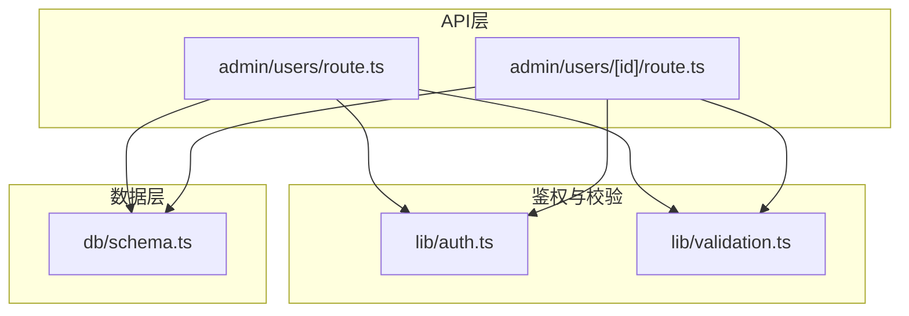
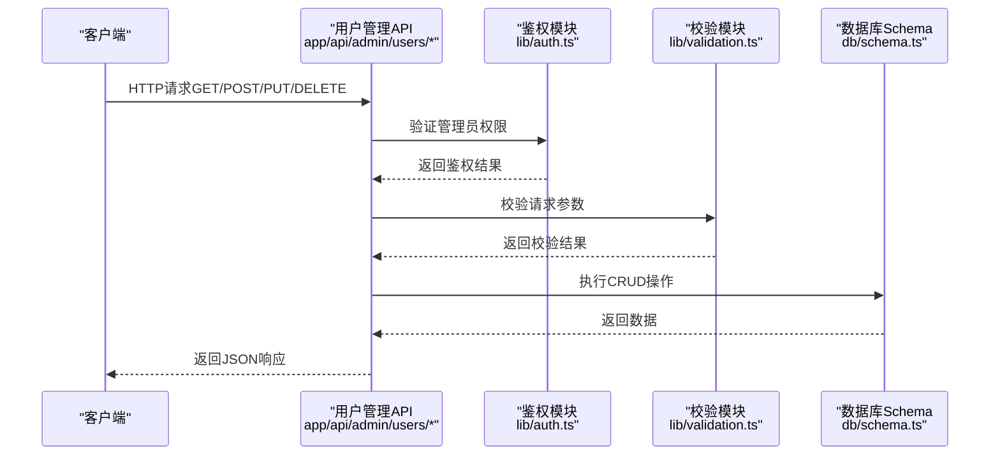
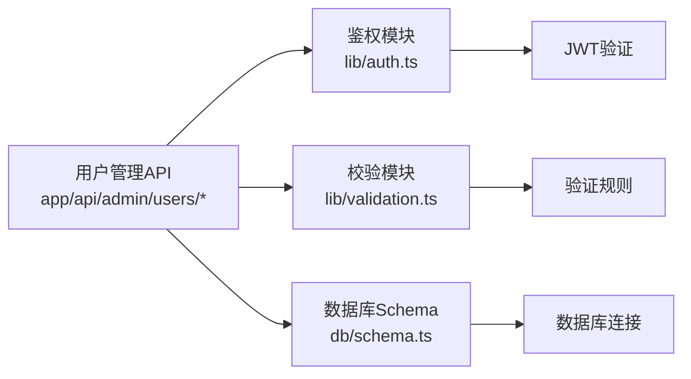

# 用户管理API

<cite>
**本文引用的文件**   
- [app/api/admin/users/route.ts](file://app/api/admin/users/route.ts)
- [app/api/admin/users/[id]/route.ts](file://app/api/admin/users/[id]/route.ts)
- [lib/auth.ts](file://lib/auth.ts)
- [db/schema.ts](file://db/schema.ts)
- [lib/validation.ts](file://lib/validation.ts)
</cite>

## 目录
1. [简介](#简介)
2. [项目结构](#项目结构)
3. [核心组件](#核心组件)
4. [架构总览](#架构总览)
5. [详细组件分析](#详细组件分析)
6. [依赖关系分析](#依赖关系分析)
7. [性能考虑](#性能考虑)
8. [故障排查指南](#故障排查指南)
9. [结论](#结论)
10. [附录](#附录)

## 简介
本文件为CS1学生事务管理系统的“管理员用户管理API”提供完整文档，覆盖以下方面：
- 用户CRUD操作的HTTP方法与URL模式
- 请求/响应结构与字段定义
- 权限控制与鉴权流程
- 用户列表查询、单个用户操作、用户状态管理等端点实现细节与使用示例
- 数据模型、验证规则与错误处理机制

该API基于Next.js App Router的Serverless路由组织，通过数据库Schema与校验库保障数据一致性与安全性。

## 项目结构
与用户管理相关的后端代码主要位于以下位置：
- app/api/admin/users：管理员用户管理的RESTful接口集合
- lib/auth.ts：鉴权与权限控制逻辑
- db/schema.ts：数据库表结构与字段定义
- lib/validation.ts：请求参数与响应数据的校验规则



图表来源
- [app/api/admin/users/route.ts](file://app/api/admin/users/route.ts)
- [app/api/admin/users/[id]/route.ts](file://app/api/admin/users/[id]/route.ts)
- [lib/auth.ts](file://lib/auth.ts)
- [lib/validation.ts](file://lib/validation.ts)
- [db/schema.ts](file://db/schema.ts)

章节来源
- [app/api/admin/users/route.ts](file://app/api/admin/users/route.ts)
- [app/api/admin/users/[id]/route.ts](file://app/api/admin/users/[id]/route.ts)
- [lib/auth.ts](file://lib/auth.ts)
- [lib/validation.ts](file://lib/validation.ts)
- [db/schema.ts](file://db/schema.ts)

## 核心组件
- 用户列表接口（GET /api/admin/users）
  - 功能：分页、过滤、排序的用户查询
  - 权限：需具备管理员角色或特定用户管理权限
  - 输入：查询参数（页码、每页大小、搜索关键字、状态筛选等）
  - 输出：用户列表、总数、分页信息
- 单个用户接口（GET/PUT/DELETE /api/admin/users/:id）
  - GET：获取指定用户详情
  - PUT：更新用户信息（如姓名、邮箱、角色、状态等）
  - DELETE：删除用户（软删除或硬删除取决于策略）
  - 权限：需具备管理员角色或用户编辑/删除权限
- 用户状态管理（通常通过PUT更新状态字段）
  - 支持启用/禁用、锁定/解锁等状态变更
  - 权限：需具备用户状态管理权限

章节来源
- [app/api/admin/users/route.ts](file://app/api/admin/users/route.ts)
- [app/api/admin/users/[id]/route.ts](file://app/api/admin/users/[id]/route.ts)

## 架构总览
下图展示了从客户端请求到数据库操作的完整调用链，包括鉴权、校验、业务逻辑与数据访问。



图表来源
- [app/api/admin/users/route.ts](file://app/api/admin/users/route.ts)
- [app/api/admin/users/[id]/route.ts](file://app/api/admin/users/[id]/route.ts)
- [lib/auth.ts](file://lib/auth.ts)
- [lib/validation.ts](file://lib/validation.ts)
- [db/schema.ts](file://db/schema.ts)

## 详细组件分析

### 用户列表查询（GET /api/admin/users）
- 方法：GET
- URL模式：/api/admin/users
- 查询参数：
  - page：页码（默认1）
  - pageSize：每页数量（默认20）
  - keyword：关键字搜索（用户名、邮箱等）
  - status：用户状态筛选（active/inactive/locked）
  - sortBy：排序字段（createdAt/updatedAt等）
  - sortOrder：排序方向（asc/desc）
- 成功响应：
  - data：用户数组
  - total：总记录数
  - page：当前页码
  - pageSize：每页数量
- 错误响应：
  - 401：未授权
  - 403：无权限
  - 422：参数校验失败
  - 500：服务器内部错误

章节来源
- [app/api/admin/users/route.ts](file://app/api/admin/users/route.ts)

### 单个用户操作（GET/PUT/DELETE /api/admin/users/:id）
- 方法：GET, PUT, DELETE
- URL模式：/api/admin/users/:id
- 路径参数：
  - id：用户唯一标识符
- GET响应：
  - data：用户对象（包含基本信息、角色、状态、创建时间等）
- PUT请求体：
  - name：用户名（可选更新）
  - email：邮箱（可选更新）
  - role：角色（可选更新）
  - status：状态（可选更新）
- PUT响应：
  - data：更新后的用户对象
- DELETE响应：
  - message：删除成功消息
- 错误响应：
  - 401：未授权
  - 403：无权限
  - 404：用户不存在
  - 422：参数校验失败
  - 500：服务器内部错误

章节来源
- [app/api/admin/users/[id]/route.ts](file://app/api/admin/users/[id]/route.ts)

### 用户状态管理（PUT /api/admin/users/:id/status）
- 方法：PUT
- URL模式：/api/admin/users/:id/status
- 路径参数：
  - id：用户唯一标识符
- 请求体：
  - status：新状态（active/inactive/locked）
- 成功响应：
  - data：更新后的用户状态
- 错误响应：
  - 401：未授权
  - 403：无权限
  - 404：用户不存在
  - 422：状态值无效
  - 500：服务器内部错误

章节来源
- [app/api/admin/users/[id]/route.ts](file://app/api/admin/users/[id]/route.ts)

### 数据模型与字段定义
用户数据模型包含以下核心字段：
- id：用户唯一标识符（UUID或自增ID）
- name：用户名（字符串，必填，长度限制）
- email：邮箱地址（字符串，必填，格式验证）
- role：用户角色（枚举：admin/user/support等）
- status：用户状态（枚举：active/inactive/locked）
- createdAt：创建时间（时间戳）
- updatedAt：更新时间（时间戳）

章节来源
- [db/schema.ts](file://db/schema.ts)

### 验证规则
- 用户创建/更新验证：
  - name：非空，长度2-50字符
  - email：非空，有效邮箱格式
  - role：必须在允许的角色列表中
  - status：必须在允许的状态列表中
- 查询参数验证：
  - page：正整数
  - pageSize：正整数，最大限制
  - keyword：字符串，长度限制
  - status：必须在允许的状态列表中
- 错误处理：
  - 422 Unprocessable Entity：参数校验失败时返回详细错误信息

章节来源
- [lib/validation.ts](file://lib/validation.ts)

### 权限控制
- 管理员权限检查：
  - 所有用户管理接口都需要管理员角色
  - 支持细粒度权限控制（如用户创建、编辑、删除、状态管理）
- 鉴权流程：
  - 验证请求头中的认证令牌
  - 解析并验证令牌有效性
  - 检查用户角色和权限
  - 拒绝无权限的请求

章节来源
- [lib/auth.ts](file://lib/auth.ts)

## 依赖关系分析
用户管理API的依赖关系如下：



图表来源
- [app/api/admin/users/route.ts](file://app/api/admin/users/route.ts)
- [app/api/admin/users/[id]/route.ts](file://app/api/admin/users/[id]/route.ts)
- [lib/auth.ts](file://lib/auth.ts)
- [lib/validation.ts](file://lib/validation.ts)
- [db/schema.ts](file://db/schema.ts)

章节来源
- [app/api/admin/users/route.ts](file://app/api/admin/users/route.ts)
- [app/api/admin/users/[id]/route.ts](file://app/api/admin/users/[id]/route.ts)
- [lib/auth.ts](file://lib/auth.ts)
- [lib/validation.ts](file://lib/validation.ts)
- [db/schema.ts](file://db/schema.ts)

## 性能考虑
- 分页查询：使用LIMIT/OFFSET进行分页，避免一次性加载大量数据
- 索引优化：对用户常用查询字段（email、status、role）建立索引
- 缓存策略：对频繁查询的用户列表结果进行缓存
- 连接池：合理配置数据库连接池大小
- 异步处理：使用异步操作提高并发处理能力

## 故障排查指南
常见问题及解决方案：
- 401未授权错误：
  - 检查请求头中是否包含有效的认证令牌
  - 确认令牌未过期且格式正确
- 403权限不足：
  - 验证用户是否具有管理员角色
  - 检查具体操作所需的权限配置
- 422参数校验失败：
  - 检查请求参数是否符合验证规则
  - 查看详细的错误信息定位问题字段
- 500服务器错误：
  - 检查数据库连接状态
  - 查看服务器日志获取详细错误信息

章节来源
- [lib/auth.ts](file://lib/auth.ts)
- [lib/validation.ts](file://lib/validation.ts)

## 结论
CS1学生事务管理系统的用户管理API提供了完整的用户CRUD操作能力，具备良好的权限控制和数据验证机制。通过清晰的API设计和完善的错误处理，为管理员提供了高效的用户管理工具。建议在生产环境中加强安全配置和监控措施，确保系统的稳定性和安全性。

## 附录

### API使用示例

#### 获取用户列表
```http
GET /api/admin/users?page=1&pageSize=20&keyword=admin&status=active
Authorization: Bearer <token>
```

#### 获取单个用户
```http
GET /api/admin/users/123e4567-e89b-12d3-a456-426614174000
Authorization: Bearer <token>
```

#### 更新用户状态
```http
PUT /api/admin/users/123e4567-e89b-12d3-a456-426614174000/status
Content-Type: application/json
Authorization: Bearer <token>

{
  "status": "inactive"
}
```

#### 删除用户
```http
DELETE /api/admin/users/123e4567-e89b-12d3-a456-426614174000
Authorization: Bearer <token>
```

### 错误响应格式
```json
{
  "error": {
    "code": "VALIDATION_ERROR",
    "message": "参数校验失败",
    "details": [
      {
        "field": "email",
        "message": "邮箱格式不正确"
      }
    ]
  }
}
```