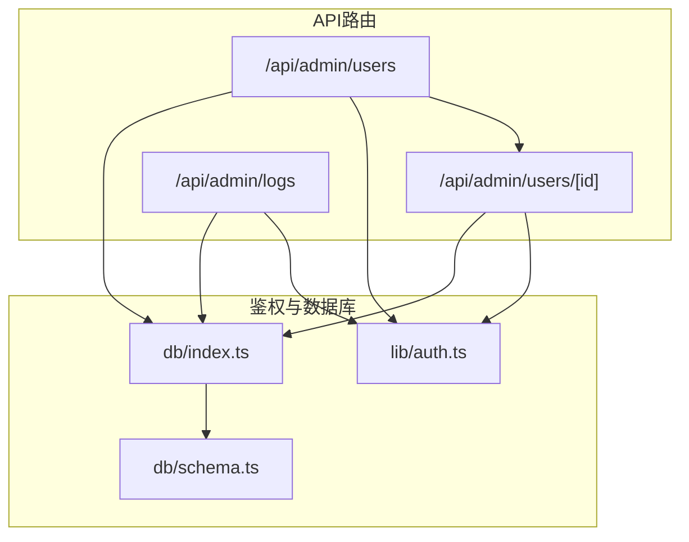
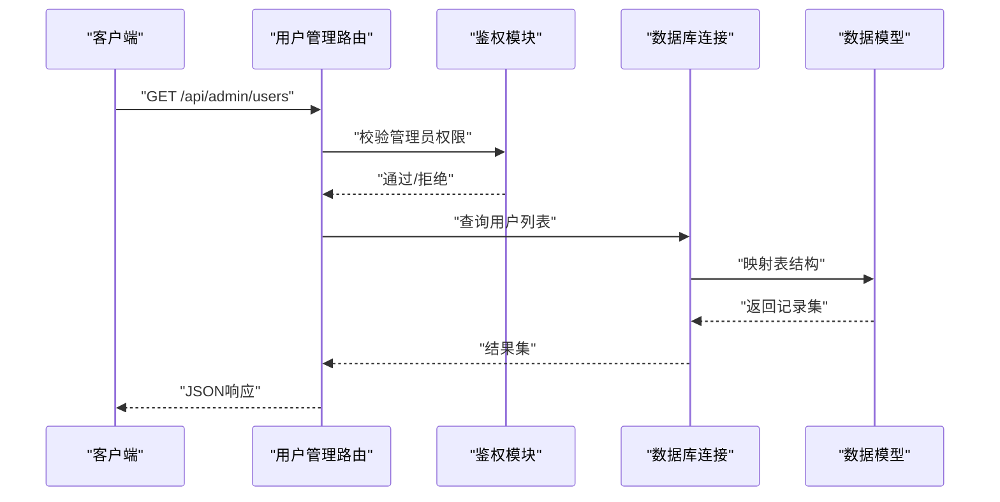
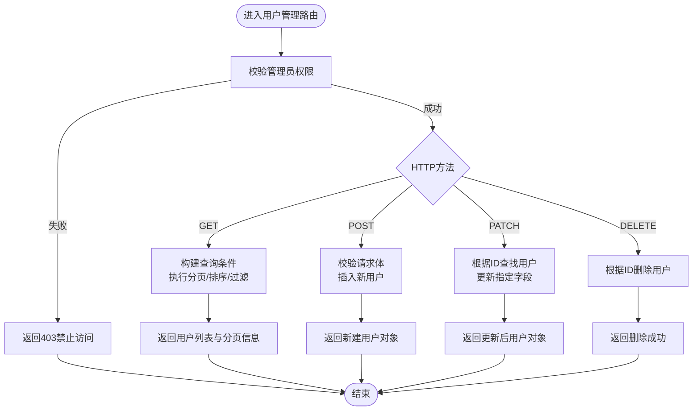
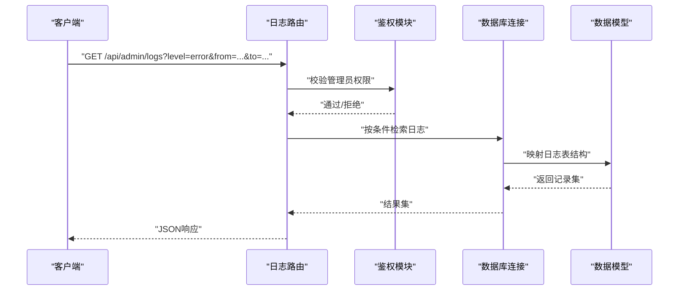
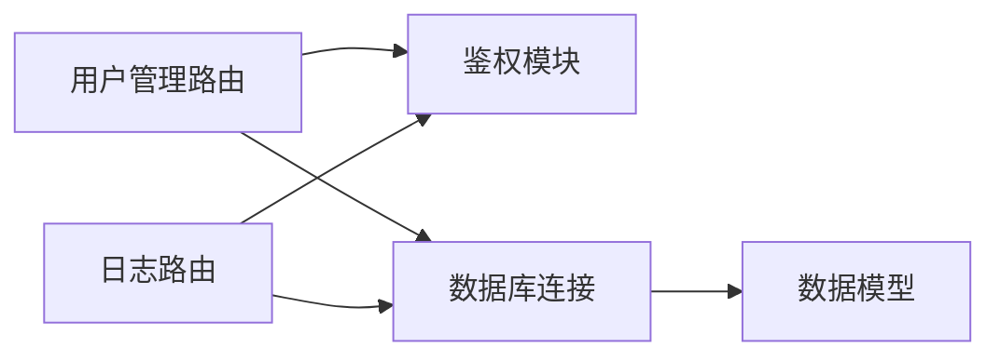

# 管理员API

<cite>
**本文档引用的文件**   
- [app/api/admin/users/route.ts](file://app/api/admin/users/route.ts)
- [app/api/admin/users/[id]/route.ts](file://app/api/admin/users/[id]/route.ts)
- [app/api/admin/logs/route.ts](file://app/api/admin/logs/route.ts)
- [lib/auth.ts](file://lib/auth.ts)
- [db/index.ts](file://db/index.ts)
- [db/schema.ts](file://db/schema.ts)
</cite>

## 目录
1. [简介](#简介)
2. [项目结构](#项目结构)
3. [核心组件](#核心组件)
4. [架构总览](#架构总览)
5. [详细组件分析](#详细组件分析)
6. [依赖分析](#依赖分析)
7. [性能考虑](#性能考虑)
8. [故障排查指南](#故障排查指南)
9. [结论](#结论)
10. [附录](#附录) 

## 简介
本文件为CS1学生事务管理系统的“管理员API”提供完整、可操作的文档。内容覆盖管理员专用端点：用户管理（CRUD与批量操作）与日志查询，包括HTTP方法、URL模式、请求/响应结构与管理权限控制。同时给出典型使用示例与常见问题排查建议，帮助开发者快速集成与运维。

## 项目结构
管理员API位于Next.js App Router的API路由下，采用按功能划分的路由组织方式：
- 用户管理：/api/admin/users、/api/admin/users/[id]
- 日志查询：/api/admin/logs

图表来源 
- [app/api/admin/users/route.ts](file://app/api/admin/users/route.ts)
- [app/api/admin/users/[id]/route.ts](file://app/api/admin/users/[id]/route.ts)
- [app/api/admin/logs/route.ts](file://app/api/admin/logs/route.ts)
- [lib/auth.ts](file://lib/auth.ts)
- [db/index.ts](file://db/index.ts)
- [db/schema.ts](file://db/schema.ts)

章节来源
- [app/api/admin/users/route.ts](file://app/api/admin/users/route.ts)
- [app/api/admin/users/[id]/route.ts](file://app/api/admin/users/[id]/route.ts)
- [app/api/admin/logs/route.ts](file://app/api/admin/logs/route.ts)
- [lib/auth.ts](file://lib/auth.ts)
- [db/index.ts](file://db/index.ts)
- [db/schema.ts](file://db/schema.ts)

## 核心组件
- 管理员用户管理API
  - 列表与创建：GET/POST /api/admin/users
  - 单用户更新/删除：PATCH/DELETE /api/admin/users/[id]
- 管理员日志查询API
  - 检索：GET /api/admin/logs

所有端点均要求管理员身份认证与授权校验，未通过鉴权的请求将被拒绝。

章节来源
- [app/api/admin/users/route.ts](file://app/api/admin/users/route.ts)
- [app/api/admin/users/[id]/route.ts](file://app/api/admin/users/[id]/route.ts)
- [app/api/admin/logs/route.ts](file://app/api/admin/logs/route.ts)
- [lib/auth.ts](file://lib/auth.ts)

## 架构总览
管理员API遵循“路由层 -> 鉴权中间件 -> 数据访问层”的分层设计：
- 路由层：定义HTTP方法与路径，解析请求参数与体，调用业务逻辑
- 鉴权层：统一校验会话/令牌与管理员权限
- 数据层：基于Drizzle ORM访问PostgreSQL，执行CRUD与查询

图表来源 
- [app/api/admin/users/route.ts](file://app/api/admin/users/route.ts)
- [lib/auth.ts](file://lib/auth.ts)
- [db/index.ts](file://db/index.ts)
- [db/schema.ts](file://db/schema.ts)

## 详细组件分析

### 用户管理API
- URL模式
  - GET /api/admin/users
  - POST /api/admin/users
  - PATCH /api/admin/users/[id]
  - DELETE /api/admin/users/[id]
- 权限控制
  - 仅管理员角色可访问；非管理员或无会话将返回401/403
- 请求/响应模式
  - GET /api/admin/users
    - 查询参数：分页、排序、过滤（如用户名、状态等）
    - 响应：用户列表数组、分页元信息
  - POST /api/admin/users
    - 请求体：用户名、邮箱、角色、初始密码等字段
    - 响应：新建用户对象或错误信息
  - PATCH /api/admin/users/[id]
    - 路径参数：用户ID
    - 请求体：可更新的字段集合
    - 响应：更新后的用户对象或错误信息
  - DELETE /api/admin/users/[id]
    - 路径参数：用户ID
    - 响应：删除成功或错误信息
- 错误处理
  - 参数缺失或格式错误：返回400及具体字段错误
  - 用户不存在：返回404
  - 权限不足：返回403
  - 服务器错误：返回500

图表来源 
- [app/api/admin/users/route.ts](file://app/api/admin/users/route.ts)
- [app/api/admin/users/[id]/route.ts](file://app/api/admin/users/[id]/route.ts)
- [lib/auth.ts](file://lib/auth.ts)
- [db/index.ts](file://db/index.ts)
- [db/schema.ts](file://db/schema.ts)

章节来源
- [app/api/admin/users/route.ts](file://app/api/admin/users/route.ts)
- [app/api/admin/users/[id]/route.ts](file://app/api/admin/users/[id]/route.ts)
- [lib/auth.ts](file://lib/auth.ts)
- [db/index.ts](file://db/index.ts)
- [db/schema.ts](file://db/schema.ts)

### 日志查询API
- URL模式
  - GET /api/admin/logs
- 权限控制
  - 仅管理员角色可访问；未通过鉴权将返回401/403
- 请求/响应模式
  - 查询参数：时间范围、级别、关键字、分页、排序
  - 响应：日志条目数组、分页元信息
- 错误处理
  - 非法参数：返回400
  - 权限不足：返回403
  - 服务器错误：返回500

图表来源 
- [app/api/admin/logs/route.ts](file://app/api/admin/logs/route.ts)
- [lib/auth.ts](file://lib/auth.ts)
- [db/index.ts](file://db/index.ts)
- [db/schema.ts](file://db/schema.ts)

章节来源
- [app/api/admin/logs/route.ts](file://app/api/admin/logs/route.ts)
- [lib/auth.ts](file://lib/auth.ts)
- [db/index.ts](file://db/index.ts)
- [db/schema.ts](file://db/schema.ts)

### 批量操作（概念性说明）
- 常见场景：批量导入学生、批量更新用户状态、批量导出报表
- 实现要点：
  - 使用事务保证一致性
  - 分片处理大体积数据，避免内存溢出
  - 返回进度或任务ID以便异步跟踪
- 注意：当前仓库中未包含管理员用户的批量端点；如需扩展，可在/api/admin/users下新增/batch路由并复用鉴权与数据访问逻辑

[本节为概念性说明，不直接分析具体文件]

## 依赖分析
- 路由层依赖鉴权模块进行权限校验
- 数据访问层依赖数据库连接与数据模型定义
- 各端点之间保持松耦合，便于独立测试与扩展

图表来源 
- [app/api/admin/users/route.ts](file://app/api/admin/users/route.ts)
- [app/api/admin/users/[id]/route.ts](file://app/api/admin/users/[id]/route.ts)
- [app/api/admin/logs/route.ts](file://app/api/admin/logs/route.ts)
- [lib/auth.ts](file://lib/auth.ts)
- [db/index.ts](file://db/index.ts)
- [db/schema.ts](file://db/schema.ts)

章节来源
- [app/api/admin/users/route.ts](file://app/api/admin/users/route.ts)
- [app/api/admin/users/[id]/route.ts](file://app/api/admin/users/[id]/route.ts)
- [app/api/admin/logs/route.ts](file://app/api/admin/logs/route.ts)
- [lib/auth.ts](file://lib/auth.ts)
- [db/index.ts](file://db/index.ts)
- [db/schema.ts](file://db/schema.ts)

## 性能考虑
- 分页与索引
  - 对高频查询字段建立索引（如用户名、邮箱、更新时间）
  - 合理设置分页大小，避免一次性返回过多数据
- 事务与锁
  - 批量写入使用事务，减少锁竞争
- 缓存策略
  - 对只读且变化不频繁的列表数据可引入短期缓存
- 流式处理
  - 大数据导出建议使用流式输出，降低内存占用

[本节提供通用指导，不直接分析具体文件]

## 故障排查指南
- 401/403错误
  - 检查会话/令牌是否有效
  - 确认当前用户具备管理员权限
- 400错误
  - 核对请求体字段类型与必填项
  - 校验查询参数合法性
- 404错误
  - 确认资源ID存在
- 500错误
  - 查看服务端日志定位异常堆栈
  - 检查数据库连接与权限配置

章节来源
- [lib/auth.ts](file://lib/auth.ts)
- [db/index.ts](file://db/index.ts)
- [db/schema.ts](file://db/schema.ts)

## 结论
管理员API围绕用户管理与日志查询两大核心能力，采用清晰的分层架构与统一的鉴权机制，确保安全性与可维护性。通过合理的分页、索引与事务策略，可在高并发场景下保持稳定性能。建议在后续迭代中补充批量操作与更丰富的过滤选项，以进一步提升管理效率。

[本节为总结性内容，不直接分析具体文件]

## 附录
- 常用请求示例（描述性）
  - 获取用户列表：GET /api/admin/users?page=1&size=20&sort=-createdAt
  - 创建用户：POST /api/admin/users，请求体包含用户名、邮箱、角色、初始密码
  - 更新用户：PATCH /api/admin/users/{id}，请求体包含需更新的字段
  - 删除用户：DELETE /api/admin/users/{id}
  - 查询日志：GET /api/admin/logs?level=error&from=2024-01-01T00:00:00Z&to=2024-01-31T23:59:59Z&page=1&size=50

[本节为示例性内容，不直接分析具体文件]