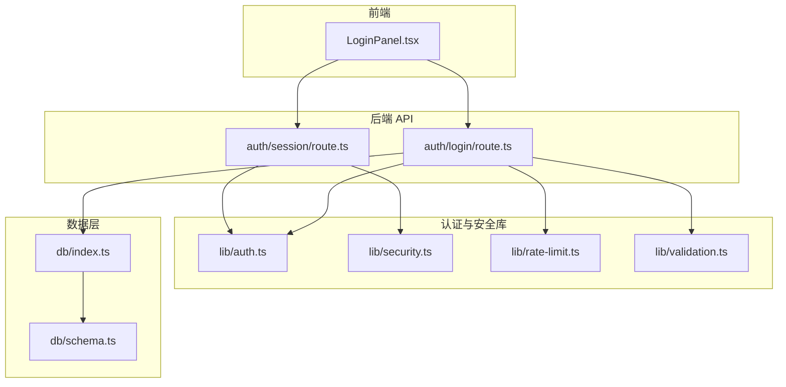
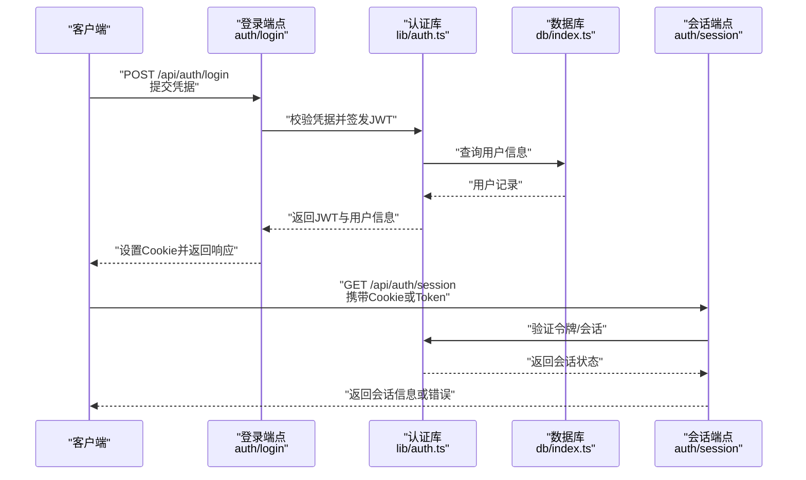
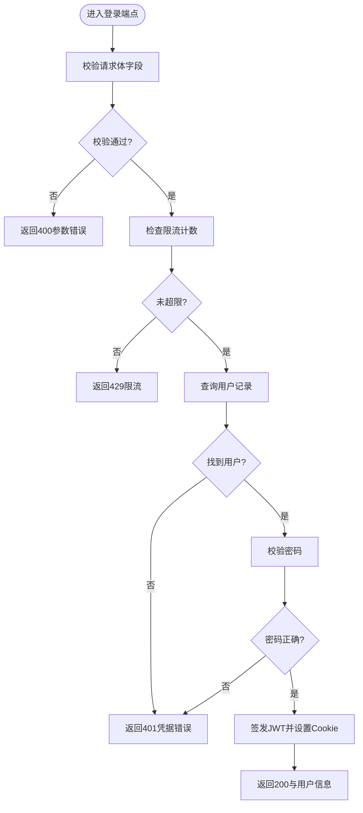
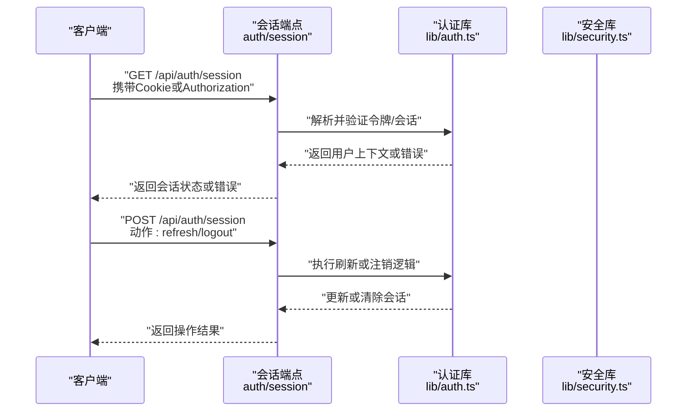
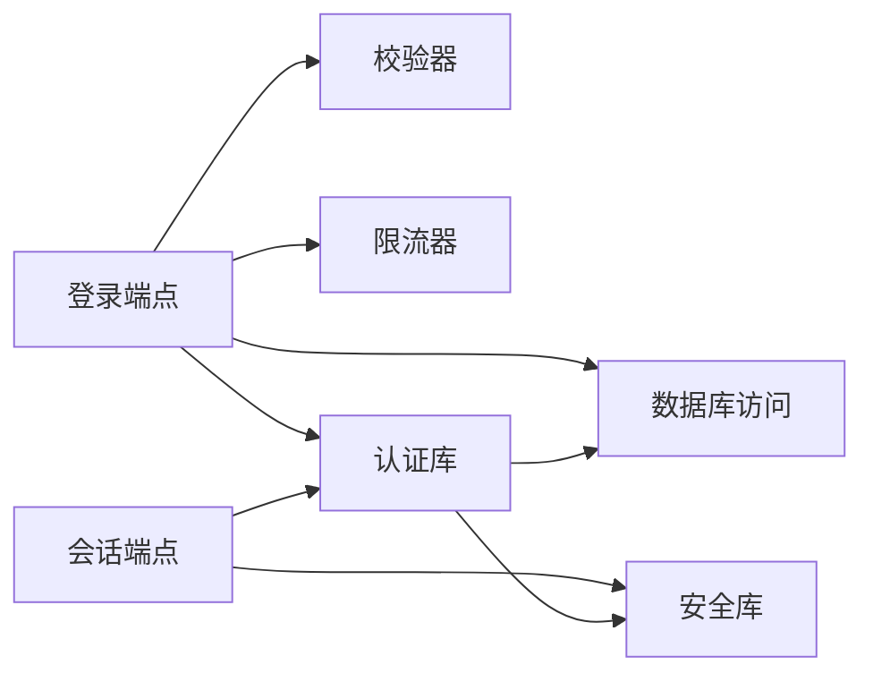

# 认证API

<cite>
**本文引用的文件**   
- [app/api/auth/login/route.ts](file://app/api/auth/login/route.ts)
- [app/api/auth/session/route.ts](file://app/api/auth/session/route.ts)
- [lib/auth.ts](file://lib/auth.ts)
- [lib/security.ts](file://lib/security.ts)
- [lib/rate-limit.ts](file://lib/rate-limit.ts)
- [lib/validation.ts](file://lib/validation.ts)
- [db/index.ts](file://db/index.ts)
- [db/schema.ts](file://db/schema.ts)
- [app/components/LoginPanel.tsx](file://app/components/LoginPanel.tsx)
</cite>

## 目录
1. [简介](#简介)
2. [项目结构](#项目结构)
3. [核心组件](#核心组件)
4. [架构总览](#架构总览)
5. [详细组件分析](#详细组件分析)
6. [依赖关系分析](#依赖关系分析)
7. [性能考虑](#性能考虑)
8. [故障排查指南](#故障排查指南)
9. [结论](#结论)
10. [附录](#附录)

## 简介
本文件为 CS1 学生事务管理系统的认证 API 提供完整文档，覆盖用户登录、会话管理等认证相关端点的 HTTP 方法、URL 模式、请求/响应模式与认证流程。重点说明 JWT 令牌处理、会话状态管理与错误处理策略，并提供具体请求示例与响应格式，以及安全考虑与最佳实践。

## 项目结构
认证功能主要位于以下位置：
- API 路由：app/api/auth/login/route.ts、app/api/auth/session/route.ts
- 认证与安全库：lib/auth.ts、lib/security.ts、lib/rate-limit.ts、lib/validation.ts
- 数据访问：db/index.ts、db/schema.ts
- 前端登录入口：app/components/LoginPanel.tsx

**图示来源** 
- [app/api/auth/login/route.ts](file://app/api/auth/login/route.ts)
- [app/api/auth/session/route.ts](file://app/api/auth/session/route.ts)
- [lib/auth.ts](file://lib/auth.ts)
- [lib/security.ts](file://lib/security.ts)
- [lib/rate-limit.ts](file://lib/rate-limit.ts)
- [lib/validation.ts](file://lib/validation.ts)
- [db/index.ts](file://db/index.ts)
- [db/schema.ts](file://db/schema.ts)
- [app/components/LoginPanel.tsx](file://app/components/LoginPanel.tsx)

**章节来源**
- [app/api/auth/login/route.ts](file://app/api/auth/login/route.ts)
- [app/api/auth/session/route.ts](file://app/api/auth/session/route.ts)
- [lib/auth.ts](file://lib/auth.ts)
- [lib/security.ts](file://lib/security.ts)
- [lib/rate-limit.ts](file://lib/rate-limit.ts)
- [lib/validation.ts](file://lib/validation.ts)
- [db/index.ts](file://db/index.ts)
- [db/schema.ts](file://db/schema.ts)
- [app/components/LoginPanel.tsx](file://app/components/LoginPanel.tsx)

## 核心组件
- 登录端点（POST /api/auth/login）
  - 职责：校验凭据、生成并返回 JWT、设置会话 Cookie、限流保护。
  - 输入：用户名/邮箱、密码等凭据字段。
  - 输出：JWT 令牌、会话信息或错误信息。
- 会话端点（GET/POST /api/auth/session）
  - 职责：读取当前会话状态、刷新或注销会话。
  - 输入：Cookie 中的会话标识或 Token。
  - 输出：会话状态、用户信息或错误信息。
- 认证库（lib/auth.ts）
  - 职责：JWT 签发与验证、令牌生命周期管理、权限上下文构建。
- 安全库（lib/security.ts）
  - 职责：敏感数据处理、常量配置、安全头建议。
- 限流器（lib/rate-limit.ts）
  - 职责：对认证接口进行速率限制，防止暴力破解。
- 校验器（lib/validation.ts）
  - 职责：请求体字段校验、类型与长度约束。
- 数据库访问（db/index.ts, db/schema.ts）
  - 职责：用户表结构与查询封装，用于凭据校验与会话持久化（如需要）。

**章节来源**
- [app/api/auth/login/route.ts](file://app/api/auth/login/route.ts)
- [app/api/auth/session/route.ts](file://app/api/auth/session/route.ts)
- [lib/auth.ts](file://lib/auth.ts)
- [lib/security.ts](file://lib/security.ts)
- [lib/rate-limit.ts](file://lib/rate-limit.ts)
- [lib/validation.ts](file://lib/validation.ts)
- [db/index.ts](file://db/index.ts)
- [db/schema.ts](file://db/schema.ts)

## 架构总览
认证流程采用“无状态 JWT + 可选会话 Cookie”的混合模式：
- 登录成功后服务端签发 JWT，并通过 Cookie 下发给客户端。
- 后续请求携带 Cookie 或 Authorization: Bearer <token> 进行鉴权。
- 会话端点用于获取当前会话状态、刷新或注销。

**图示来源** 
- [app/api/auth/login/route.ts](file://app/api/auth/login/route.ts)
- [app/api/auth/session/route.ts](file://app/api/auth/session/route.ts)
- [lib/auth.ts](file://lib/auth.ts)
- [db/index.ts](file://db/index.ts)

## 详细组件分析

### 登录端点（POST /api/auth/login）
- URL 模式：/api/auth/login
- HTTP 方法：POST
- 请求体字段（示例）：
  - username/email：字符串，必填
  - password：字符串，必填
- 响应体（成功）：
  - token：JWT 字符串
  - user：用户基本信息对象（id、角色、名称等）
  - expiresAt：令牌过期时间
- 错误码与消息：
  - 400：参数缺失或格式错误
  - 401：用户名/密码不正确
  - 429：请求频率过高（限流触发）
  - 500：服务器内部错误

**图示来源** 
- [app/api/auth/login/route.ts](file://app/api/auth/login/route.ts)
- [lib/validation.ts](file://lib/validation.ts)
- [lib/rate-limit.ts](file://lib/rate-limit.ts)
- [db/index.ts](file://db/index.ts)
- [lib/auth.ts](file://lib/auth.ts)

**章节来源**
- [app/api/auth/login/route.ts](file://app/api/auth/login/route.ts)
- [lib/validation.ts](file://lib/validation.ts)
- [lib/rate-limit.ts](file://lib/rate-limit.ts)
- [db/index.ts](file://db/index.ts)
- [lib/auth.ts](file://lib/auth.ts)

### 会话端点（GET/POST /api/auth/session）
- URL 模式：/api/auth/session
- HTTP 方法：
  - GET：获取当前会话状态
  - POST：刷新或注销会话（根据请求体动作）
- 请求头：
  - Cookie：包含会话标识或 Token
  - Authorization：Bearer <token>（可选）
- 响应体（成功）：
  - authenticated：布尔值
  - user：用户基本信息（若已认证）
  - tokenExpiry：令牌过期时间（若存在）
- 错误码与消息：
  - 401：未认证或令牌无效
  - 403：权限不足（某些操作）
  - 429：限流触发
  - 500：服务器内部错误

**图示来源** 
- [app/api/auth/session/route.ts](file://app/api/auth/session/route.ts)
- [lib/auth.ts](file://lib/auth.ts)
- [lib/security.ts](file://lib/security.ts)

**章节来源**
- [app/api/auth/session/route.ts](file://app/api/auth/session/route.ts)
- [lib/auth.ts](file://lib/auth.ts)
- [lib/security.ts](file://lib/security.ts)

### 认证库（lib/auth.ts）
- 职责：
  - JWT 签发：包含用户标识、角色、过期时间等声明。
  - JWT 验证：解析签名、校验过期、提取用户上下文。
  - 会话管理：支持基于 Cookie 的会话状态维护（可选）。
- 关键函数：
  - signToken(payload): 签发 JWT
  - verifyToken(token): 验证 JWT 并返回 payload
  - buildContext(user): 构建鉴权上下文
- 复杂度：
  - 签发与验证均为 O(1) 时间复杂度（哈希与签名计算常数级）。
- 优化建议：
  - 使用短生命周期 Token + 刷新机制降低泄露风险。
  - 缓存用户上下文以减少重复查询。

**章节来源**
- [lib/auth.ts](file://lib/auth.ts)

### 安全库（lib/security.ts）
- 职责：
  - 安全常量：密钥、算法、过期时间等。
  - 敏感数据处理：脱敏、编码、防注入。
  - 安全头建议：CSP、HSTS、X-Frame-Options 等。
- 最佳实践：
  - 强制 HTTPS，禁用不安全传输。
  - 合理设置 Cookie 属性（HttpOnly、Secure、SameSite）。
  - 避免在日志中输出敏感信息。

**章节来源**
- [lib/security.ts](file://lib/security.ts)

### 限流器（lib/rate-limit.ts）
- 职责：
  - 按 IP 或用户维度统计请求次数。
  - 超过阈值时返回 429 并提示重试间隔。
- 配置项：
  - windowMs：窗口时长（毫秒）
  - maxRequests：最大请求数
  - keyGenerator：键生成策略（IP、用户ID等）
- 性能影响：
  - 内存计数器在高并发下可能成为瓶颈，可迁移至 Redis。

**章节来源**
- [lib/rate-limit.ts](file://lib/rate-limit.ts)

### 校验器（lib/validation.ts）
- 职责：
  - 请求体验证：必填、类型、长度、格式。
  - 错误聚合：收集所有校验失败信息。
- 常用规则：
  - required、string、minLength、maxLength、email、password 强度。
- 扩展性：
  - 支持自定义校验器与异步校验。

**章节来源**
- [lib/validation.ts](file://lib/validation.ts)

### 数据库访问（db/index.ts, db/schema.ts）
- 职责：
  - 定义用户表结构（id、username、email、passwordHash、role、createdAt 等）。
  - 提供查询封装：按用户名/邮箱查找用户、更新最后登录时间等。
- 性能建议：
  - 为 username/email 建立唯一索引。
  - 分页与批量操作优化。

**章节来源**
- [db/index.ts](file://db/index.ts)
- [db/schema.ts](file://db/schema.ts)

### 前端登录入口（app/components/LoginPanel.tsx）
- 职责：
  - 渲染登录表单，调用 /api/auth/login。
  - 存储 Token 到 Cookie 或内存。
  - 跳转至受保护页面。
- 交互流程：
  - 用户输入凭据 -> 提交 -> 显示加载状态 -> 成功跳转或错误提示。

**章节来源**
- [app/components/LoginPanel.tsx](file://app/components/LoginPanel.tsx)

## 依赖关系分析
认证模块依赖关系如下：
- 登录端点依赖校验器、限流器、认证库与数据库。
- 会话端点依赖认证库与安全库。
- 认证库依赖安全库（密钥与算法）与数据库（用户查询）。

**图示来源** 
- [app/api/auth/login/route.ts](file://app/api/auth/login/route.ts)
- [app/api/auth/session/route.ts](file://app/api/auth/session/route.ts)
- [lib/auth.ts](file://lib/auth.ts)
- [lib/security.ts](file://lib/security.ts)
- [lib/rate-limit.ts](file://lib/rate-limit.ts)
- [lib/validation.ts](file://lib/validation.ts)
- [db/index.ts](file://db/index.ts)

**章节来源**
- [app/api/auth/login/route.ts](file://app/api/auth/login/route.ts)
- [app/api/auth/session/route.ts](file://app/api/auth/session/route.ts)
- [lib/auth.ts](file://lib/auth.ts)
- [lib/security.ts](file://lib/security.ts)
- [lib/rate-limit.ts](file://lib/rate-limit.ts)
- [lib/validation.ts](file://lib/validation.ts)
- [db/index.ts](file://db/index.ts)

## 性能考虑
- 认证库操作为 O(1)，但数据库查询可能成为瓶颈，建议：
  - 为常用查询字段建立索引。
  - 使用连接池与缓存减少重复查询。
- 限流器在高并发下建议使用分布式存储（如 Redis）替代内存计数器。
- JWT 签发与验证应使用高效加密库，避免阻塞事件循环。
- 前端应避免频繁刷新会话，合理设置轮询间隔或使用长连接。

[本节为通用性能指导，不直接分析具体文件]

## 故障排查指南
- 常见问题：
  - 401 未认证：检查 Cookie 是否携带、Token 是否过期、Authorization 头是否正确。
  - 400 参数错误：检查请求体字段是否齐全、类型是否符合预期。
  - 429 限流：检查请求频率是否过高，适当增加窗口或降低请求频率。
  - 500 服务器错误：查看服务端日志，定位数据库连接或签名验证异常。
- 调试建议：
  - 启用详细日志（注意脱敏）。
  - 使用 curl 或 Postman 模拟请求，逐步定位问题。
  - 检查环境变量配置（密钥、数据库连接串等）。

**章节来源**
- [lib/security.ts](file://lib/security.ts)
- [lib/rate-limit.ts](file://lib/rate-limit.ts)
- [lib/validation.ts](file://lib/validation.ts)

## 结论
CS1 学生事务管理系统的认证 API 采用 JWT 与可选会话 Cookie 的混合模式，具备完善的校验、限流与安全控制。通过模块化设计，登录与会话端点职责清晰，易于扩展与维护。建议在生产环境中强化安全配置、监控与日志审计，确保系统稳定与安全。

[本节为总结性内容，不直接分析具体文件]

## 附录
- 请求示例（登录）：
  - 方法：POST
  - URL：/api/auth/login
  - 请求体：{ "username": "student001", "password": "your_password" }
  - 响应体：{ "token": "eyJ...", "user": { "id": "1", "role": "student" }, "expiresAt": "2024-12-31T23:59:59Z" }
- 请求示例（会话）：
  - 方法：GET
  - URL：/api/auth/session
  - 请求头：Cookie: session=... 或 Authorization: Bearer eyJ...
  - 响应体：{ "authenticated": true, "user": { "id": "1", "role": "student" }, "tokenExpiry": "2024-12-31T23:59:59Z" }
- 安全最佳实践：
  - 强制 HTTPS，禁用明文传输。
  - 设置 Cookie 为 HttpOnly、Secure、SameSite=Strict。
  - 定期轮换密钥，最小化 Token 生命周期。
  - 避免在日志中记录敏感信息。

[本节为概念性内容，不直接分析具体文件]