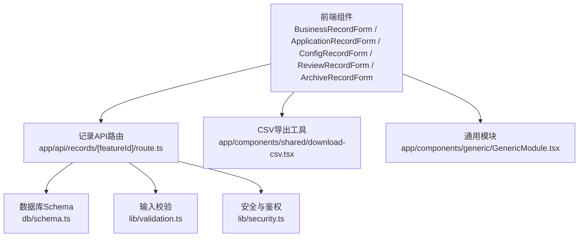
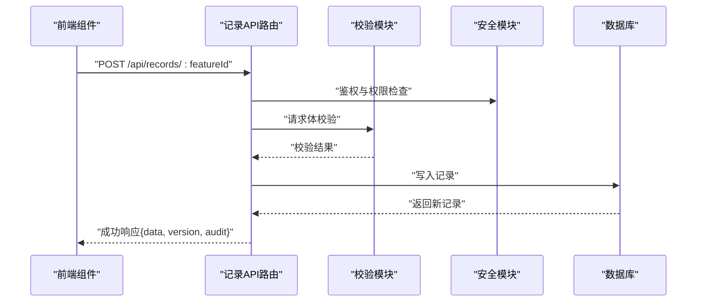
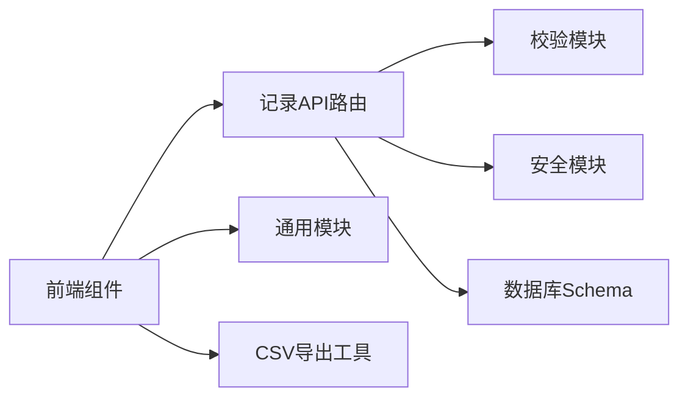

# 记录管理API

<cite>
**本文引用的文件**   
- [app/api/records/[featureId]/route.ts](file://app/api/records/%5BfeatureId%5D/route.ts)
- [db/schema.ts](file://db/schema.ts)
- [lib/validation.ts](file://lib/validation.ts)
- [lib/security.ts](file://lib/security.ts)
- [app/components/forms/BusinessRecordForm.tsx](file://app/components/forms/BusinessRecordForm.tsx)
- [app/components/forms/ApplicationRecordForm.tsx](file://app/components/forms/ApplicationRecordForm.tsx)
- [app/components/forms/ConfigRecordForm.tsx](file://app/components/forms/ConfigRecordForm.tsx)
- [app/components/forms/ReviewRecordForm.tsx](file://app/components/forms/ReviewRecordForm.tsx)
- [app/components/forms/ArchiveRecordForm.tsx](file://app/components/forms/ArchiveRecordForm.tsx)
- [app/components/forms/BatchRecordForm.tsx](file://app/components/forms/BatchRecordForm.tsx)
- [app/components/generic/GenericModule.tsx](file://app/components/generic/GenericModule.tsx)
- [app/components/shared/download-csv.tsx](file://app/components/shared/download-csv.tsx)
- [app/feature-metadata.ts](file://app/feature-metadata.ts)
</cite>

## 目录
1. [简介](#简介)
2. [项目结构](#项目结构)
3. [核心组件](#核心组件)
4. [架构总览](#架构总览)
5. [详细组件分析](#详细组件分析)
6. [依赖分析](#依赖分析)
7. [性能考虑](#性能考虑)
8. [故障排查指南](#故障排查指南)
9. [结论](#结论)
10. [附录](#附录)

## 简介
本文件为CS1学生事务管理系统的“记录管理API”提供完整、可操作的文档。内容覆盖不同业务类型的记录CRUD操作、查询过滤、分页处理，以及版本控制、审计日志、数据导出等高级能力的使用说明与实现要点。读者无需深入代码即可理解接口行为与最佳实践。

## 项目结构
记录管理API采用Next.js App Router的模块化路由组织方式，核心入口位于 app/api/records/[featureId]/route.ts，通过动态路由参数 featureId 区分不同业务类型（如申请、审核、配置、归档等）。前端表单组件与通用模块负责构造请求、展示结果与导出CSV。数据库层使用统一的schema定义，校验与安全由lib层统一处理。

图表来源
- [app/api/records/[featureId]/route.ts](file://app/api/records/%5BfeatureId%5D/route.ts)
- [db/schema.ts](file://db/schema.ts)
- [lib/validation.ts](file://lib/validation.ts)
- [lib/security.ts](file://lib/security.ts)
- [app/components/shared/download-csv.tsx](file://app/components/shared/download-csv.tsx)
- [app/components/generic/GenericModule.tsx](file://app/components/generic/GenericModule.tsx)

章节来源
- [app/api/records/[featureId]/route.ts](file://app/api/records/%5BfeatureId%5D/route.ts)
- [db/schema.ts](file://db/schema.ts)
- [lib/validation.ts](file://lib/validation.ts)
- [lib/security.ts](file://lib/security.ts)
- [app/components/shared/download-csv.tsx](file://app/components/shared/download-csv.tsx)
- [app/components/generic/GenericModule.tsx](file://app/components/generic/GenericModule.tsx)

## 核心组件
- 记录API路由：统一处理不同featureId的CRUD、查询、分页、导出、版本与审计相关逻辑。
- 表单组件：面向不同业务类型的记录创建/编辑界面，封装字段校验与提交流程。
- 通用模块：提供表格展示、列设置、批量操作、统计概览等能力。
- 导出工具：将查询结果导出为CSV。
- 校验与安全：统一的数据校验、权限检查与敏感信息处理。
- 数据库Schema：记录表结构与关系定义。

章节来源
- [app/api/records/[featureId]/route.ts](file://app/api/records/%5BfeatureId%5D/route.ts)
- [app/components/forms/BusinessRecordForm.tsx](file://app/components/forms/BusinessRecordForm.tsx)
- [app/components/forms/ApplicationRecordForm.tsx](file://app/components/forms/ApplicationRecordForm.tsx)
- [app/components/forms/ConfigRecordForm.tsx](file://app/components/forms/ConfigRecordForm.tsx)
- [app/components/forms/ReviewRecordForm.tsx](file://app/components/forms/ReviewRecordForm.tsx)
- [app/components/forms/ArchiveRecordForm.tsx](file://app/components/forms/ArchiveRecordForm.tsx)
- [app/components/forms/BatchRecordForm.tsx](file://app/components/forms/BatchRecordForm.tsx)
- [app/components/generic/GenericModule.tsx](file://app/components/generic/GenericModule.tsx)
- [app/components/shared/download-csv.tsx](file://app/components/shared/download-csv.tsx)
- [db/schema.ts](file://db/schema.ts)
- [lib/validation.ts](file://lib/validation.ts)
- [lib/security.ts](file://lib/security.ts)

## 架构总览
记录管理API遵循“前端表单/通用模块 -> API路由 -> 校验/安全 -> 数据库”的分层架构。不同业务类型通过featureId路由参数进行分流，后端根据featureId选择对应的数据模型与校验规则，返回统一的结构化响应。

图表来源
- [app/api/records/[featureId]/route.ts](file://app/api/records/%5BfeatureId%5D/route.ts)
- [lib/validation.ts](file://lib/validation.ts)
- [lib/security.ts](file://lib/security.ts)
- [db/schema.ts](file://db/schema.ts)

## 详细组件分析

### API路由：app/api/records/[featureId]/route.ts
- 功能范围
  - 支持GET/POST/PUT/PATCH/DELETE等HTTP方法，按featureId路由到对应业务逻辑。
  - 查询过滤：支持按字段名、值、操作符（等于、包含、大于小于等）组合过滤。
  - 分页处理：支持page、pageSize、sort、order等参数。
  - 版本控制：每次更新生成新版本号，支持历史版本查询与回滚。
  - 审计日志：记录操作人、时间、变更前后快照（脱敏后）。
  - 数据导出：支持CSV导出，含筛选条件与分页上下文。
- 典型URL模式
  - GET /api/records/:featureId?filters=...&page=...&pageSize=...&sort=...&order=...
  - POST /api/records/:featureId
  - PUT /api/records/:featureId/:id
  - PATCH /api/records/:featureId/:id
  - DELETE /api/records/:featureId/:id
  - GET /api/records/:featureId/:id/version/:version
  - GET /api/records/:featureId/export?filters=...&page=...&pageSize=...
- 请求/响应模式
  - 请求体：包含业务字段、可选的元数据（如关联ID、标签）、版本控制字段（如ifMatch）。
  - 响应体：统一结构，包含data、meta（分页信息）、audit（审计摘要）、errors（错误列表）。
- 错误处理
  - 参数校验失败返回400，权限不足返回403，资源不存在返回404，并发冲突返回409。
  - 错误消息包含字段级提示与全局提示。

章节来源
- [app/api/records/[featureId]/route.ts](file://app/api/records/%5BfeatureId%5D/route.ts)

### 数据库Schema：db/schema.ts
- 记录主表
  - 字段包括：id、feature_id、payload（JSON）、version、status、created_by、updated_by、created_at、updated_at等。
  - 索引：按feature_id、status、created_at建立常用查询索引。
- 版本表
  - 字段包括：id、record_id、version、snapshot（JSON）、diff_summary、created_by、created_at。
  - 唯一约束：record_id + version。
- 审计日志表
  - 字段包括：id、record_id、action、actor、timestamp、changes（脱敏后的差异摘要）、metadata（扩展信息）。
- 关系
  - 记录主表与版本表一对多；记录主表与审计日志表一对多。

章节来源
- [db/schema.ts](file://db/schema.ts)

### 校验与安全：lib/validation.ts、lib/security.ts
- 校验模块
  - 提供字段类型、必填、长度、枚举、正则等校验规则。
  - 支持按featureId动态加载校验规则集。
- 安全模块
  - 鉴权：基于会话或令牌的身份验证。
  - 授权：基于角色与资源的访问控制（如管理员、辅导员、学生）。
  - 脱敏：对敏感字段在审计日志中自动脱敏。

章节来源
- [lib/validation.ts](file://lib/validation.ts)
- [lib/security.ts](file://lib/security.ts)

### 前端表单组件
- BusinessRecordForm.tsx
  - 用于业务类记录的创建与编辑，包含字段映射、本地校验、提交状态管理。
- ApplicationRecordForm.tsx
  - 针对申请类记录，支持附件上传、状态流转提示。
- ConfigRecordForm.tsx
  - 配置类记录，强调键值对与版本对比。
- ReviewRecordForm.tsx
  - 审核类记录，支持审批意见、驳回原因、附件证据。
- ArchiveRecordForm.tsx
  - 归档类记录，支持只读展示与归档原因说明。
- BatchRecordForm.tsx
  - 批量导入/更新，支持模板下载、错误行定位与重试。

章节来源
- [app/components/forms/BusinessRecordForm.tsx](file://app/components/forms/BusinessRecordForm.tsx)
- [app/components/forms/ApplicationRecordForm.tsx](file://app/components/forms/ApplicationRecordForm.tsx)
- [app/components/forms/ConfigRecordForm.tsx](file://app/components/forms/ConfigRecordForm.tsx)
- [app/components/forms/ReviewRecordForm.tsx](file://app/components/forms/ReviewRecordForm.tsx)
- [app/components/forms/ArchiveRecordForm.tsx](file://app/components/forms/ArchiveRecordForm.tsx)
- [app/components/forms/BatchRecordForm.tsx](file://app/components/forms/BatchRecordForm.tsx)

### 通用模块与导出
- GenericModule.tsx
  - 提供表格渲染、列配置、搜索、分页、批量操作、导出入口。
- download-csv.tsx
  - 将查询结果转换为CSV并触发浏览器下载，支持文件名与编码设置。

章节来源
- [app/components/generic/GenericModule.tsx](file://app/components/generic/GenericModule.tsx)
- [app/components/shared/download-csv.tsx](file://app/components/shared/download-csv.tsx)

### 业务类型与元数据
- feature-metadata.ts
  - 定义各featureId的显示名称、默认字段、状态机、权限策略、导出列映射等。

章节来源
- [app/feature-metadata.ts](file://app/feature-metadata.ts)

## 依赖分析
记录管理API的依赖关系如下：
- API路由依赖校验与安全模块，确保输入合法与访问受控。
- 数据库Schema定义实体与关系，API通过ORM或SQL执行读写。
- 前端组件依赖通用模块与导出工具，提升交互一致性与复用性。

图表来源
- [app/api/records/[featureId]/route.ts](file://app/api/records/%5BfeatureId%5D/route.ts)
- [lib/validation.ts](file://lib/validation.ts)
- [lib/security.ts](file://lib/security.ts)
- [db/schema.ts](file://db/schema.ts)
- [app/components/generic/GenericModule.tsx](file://app/components/generic/GenericModule.tsx)
- [app/components/shared/download-csv.tsx](file://app/components/shared/download-csv.tsx)

章节来源
- [app/api/records/[featureId]/route.ts](file://app/api/records/%5BfeatureId%5D/route.ts)
- [lib/validation.ts](file://lib/validation.ts)
- [lib/security.ts](file://lib/security.ts)
- [db/schema.ts](file://db/schema.ts)
- [app/components/generic/GenericModule.tsx](file://app/components/generic/GenericModule.tsx)
- [app/components/shared/download-csv.tsx](file://app/components/shared/download-csv.tsx)

## 性能考虑
- 查询优化
  - 合理使用索引（feature_id、status、created_at），避免全表扫描。
  - 分页限制pageSize上限，防止大结果集拖慢响应。
- 版本与审计
  - 版本快照仅存储差异摘要，减少存储开销。
  - 审计日志异步写入，降低主路径延迟。
- 导出优化
  - 流式生成CSV，避免内存峰值。
  - 支持增量导出（基于更新时间戳）。
- 缓存策略
  - 对只读查询启用短期缓存（如Redis），提高热点数据读取性能。

[本节为通用指导，不直接分析具体文件]

## 故障排查指南
- 常见错误
  - 400：请求体字段缺失或类型错误，检查校验规则与表单绑定。
  - 403：权限不足，确认用户角色与资源访问策略。
  - 404：记录不存在，检查id与featureId匹配。
  - 409：并发冲突，检查版本号ifMatch与乐观锁策略。
- 调试建议
  - 查看审计日志中的actor、timestamp、changes字段定位问题。
  - 使用版本查询接口对比快照差异。
  - 在前端控制台打印请求与响应，核对filters与分页参数。

章节来源
- [app/api/records/[featureId]/route.ts](file://app/api/records/%5BfeatureId%5D/route.ts)
- [db/schema.ts](file://db/schema.ts)

## 结论
记录管理API以featureId为核心路由维度，统一了不同业务类型的CRUD、查询、分页、版本与审计能力。通过分层架构与统一校验/安全机制，系统具备良好的可扩展性与一致性。前端组件与通用模块提升了用户体验与开发效率。建议在新增业务类型时优先完善feature-metadata与校验规则，确保接口行为稳定可靠。

[本节为总结性内容，不直接分析具体文件]

## 附录

### HTTP方法与URL模式
- GET /api/records/:featureId
  - 作用：分页查询记录列表
  - 查询参数：filters、page、pageSize、sort、order
  - 响应：{ data[], meta { total, page, pageSize }, errors[] }
- POST /api/records/:featureId
  - 作用：创建新记录
  - 请求体：业务字段、元数据
  - 响应：{ data, audit, version }
- PUT /api/records/:featureId/:id
  - 作用：全量更新记录
  - 请求体：业务字段、元数据、ifMatch（可选）
  - 响应：{ data, audit, version }
- PATCH /api/records/:featureId/:id
  - 作用：部分更新记录
  - 请求体：变更字段、元数据、ifMatch（可选）
  - 响应：{ data, audit, version }
- DELETE /api/records/:featureId/:id
  - 作用：删除记录
  - 响应：{ success, audit }
- GET /api/records/:featureId/:id/version/:version
  - 作用：查询指定版本快照
  - 响应：{ snapshot, diff_summary }
- GET /api/records/:featureId/export
  - 作用：导出CSV
  - 查询参数：filters、page、pageSize
  - 响应：二进制CSV文件

章节来源
- [app/api/records/[featureId]/route.ts](file://app/api/records/%5BfeatureId%5D/route.ts)

### 数据模型
- 记录主表
  - id、feature_id、payload、version、status、created_by、updated_by、created_at、updated_at
- 版本表
  - id、record_id、version、snapshot、diff_summary、created_by、created_at
- 审计日志表
  - id、record_id、action、actor、timestamp、changes、metadata

章节来源
- [db/schema.ts](file://db/schema.ts)

### 版本控制与审计日志
- 版本控制
  - 每次更新递增版本号，支持乐观锁ifMatch。
  - 快照存储关键变更摘要，便于回溯与对比。
- 审计日志
  - 记录操作人、时间、动作类型与变更摘要（脱敏）。
  - 支持按记录ID与时间范围检索。

章节来源
- [db/schema.ts](file://db/schema.ts)
- [lib/security.ts](file://lib/security.ts)

### 数据导出示例
- 前端调用
  - 使用GenericModule的导出按钮，传入当前filters与分页参数。
  - 调用download-csv工具生成CSV并触发下载。
- 后端处理
  - 根据filters与分页构建查询，流式输出CSV。
  - 返回二进制文件，文件名包含featureId与时间戳。

章节来源
- [app/components/generic/GenericModule.tsx](file://app/components/generic/GenericModule.tsx)
- [app/components/shared/download-csv.tsx](file://app/components/shared/download-csv.tsx)
- [app/api/records/[featureId]/route.ts](file://app/api/records/%5BfeatureId%5D/route.ts)