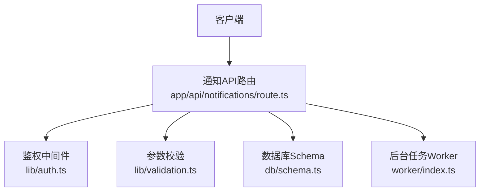
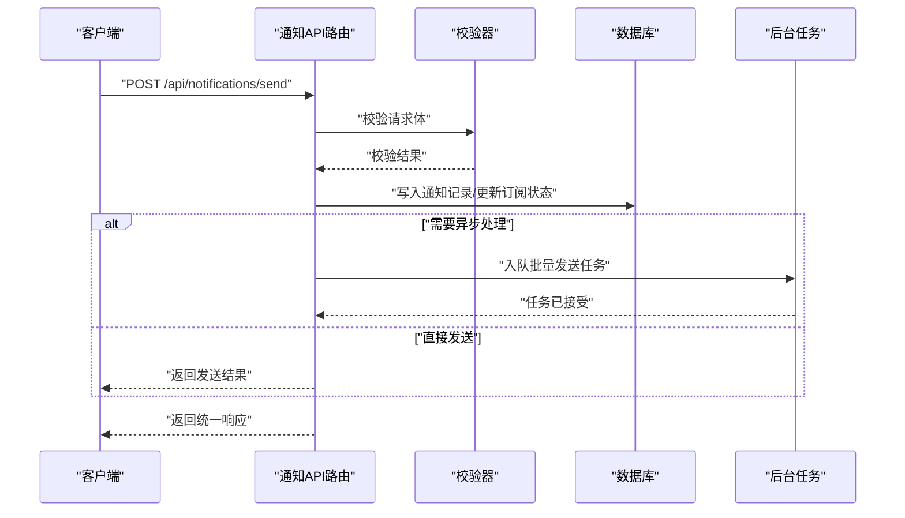
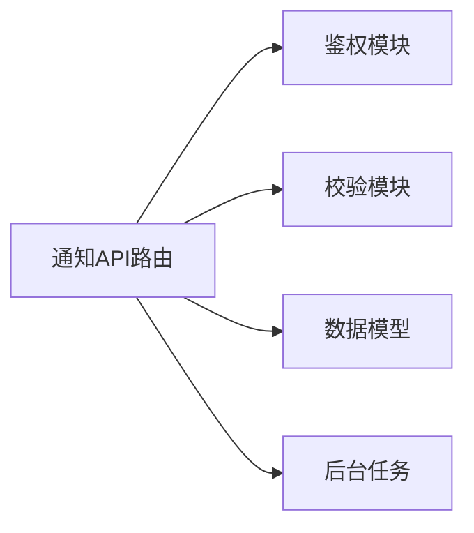
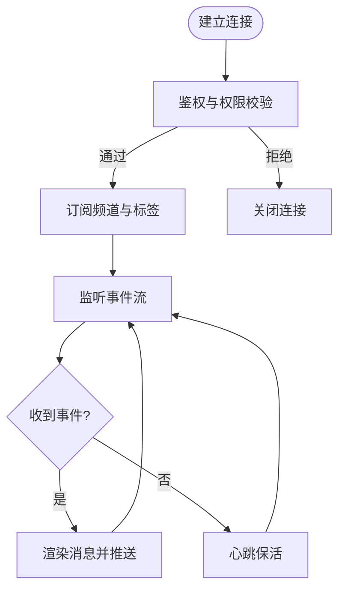
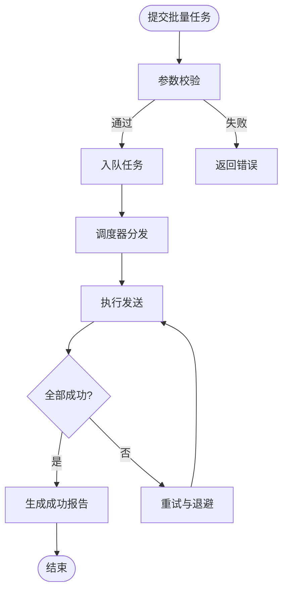

# 通知API

<cite>
**本文档引用的文件**   
- [app/api/notifications/route.ts](file://app/api/notifications/route.ts)
- [lib/auth.ts](file://lib/auth.ts)
- [lib/validation.ts](file://lib/validation.ts)
- [db/schema.ts](file://db/schema.ts)
- [worker/index.ts](file://worker/index.ts)
</cite>

## 目录
1. [简介](#简介)
2. [项目结构](#项目结构)
3. [核心组件](#核心组件)
4. [架构总览](#架构总览)
5. [详细组件分析](#详细组件分析)
6. [依赖关系分析](#依赖关系分析)
7. [性能考虑](#性能考虑)
8. [故障排查指南](#故障排查指南)
9. [结论](#结论)
10. [附录](#附录)

## 简介
本文件为CS1学生事务管理系统的“通知API”提供完整、可操作的技术文档。内容覆盖消息发送、通知管理、用户订阅等功能的HTTP方法、URL模式、请求与响应模型，以及通知渠道配置、实时通知、批量发送与模板管理等实现细节和使用示例。读者无需深入源码即可理解接口契约与集成方式。

## 项目结构
通知API基于Next.js API路由组织，核心入口位于 app/api/notifications/route.ts；鉴权与校验分别由 lib/auth.ts 与 lib/validation.ts 提供；数据模型定义在 db/schema.ts；异步任务（如批量发送）通过 worker/index.ts 处理。

**图表来源** 
- [app/api/notifications/route.ts](file://app/api/notifications/route.ts)
- [lib/auth.ts](file://lib/auth.ts)
- [lib/validation.ts](file://lib/validation.ts)
- [db/schema.ts](file://db/schema.ts)
- [worker/index.ts](file://worker/index.ts)

**章节来源**
- [app/api/notifications/route.ts](file://app/api/notifications/route.ts)
- [lib/auth.ts](file://lib/auth.ts)
- [lib/validation.ts](file://lib/validation.ts)
- [db/schema.ts](file://db/schema.ts)
- [worker/index.ts](file://worker/index.ts)

## 核心组件
- 通知API路由：统一暴露REST接口，负责鉴权、校验、路由分发、调用服务层与持久化。
- 鉴权模块：验证访问令牌、角色权限与速率限制。
- 校验模块：对请求体进行结构化校验与错误提示。
- 数据模型：定义通知、订阅、模板等实体字段与约束。
- 后台任务：承载批量发送、重试、退避策略与失败告警。

**章节来源**
- [app/api/notifications/route.ts](file://app/api/notifications/route.ts)
- [lib/auth.ts](file://lib/auth.ts)
- [lib/validation.ts](file://lib/validation.ts)
- [db/schema.ts](file://db/schema.ts)
- [worker/index.ts](file://worker/index.ts)

## 架构总览
下图展示一次典型的通知发送流程：客户端发起请求，API路由完成鉴权与校验后，将消息入队或同步发送，必要时触发后台任务执行批量发送与重试。

**图表来源** 
- [app/api/notifications/route.ts](file://app/api/notifications/route.ts)
- [lib/validation.ts](file://lib/validation.ts)
- [db/schema.ts](file://db/schema.ts)
- [worker/index.ts](file://worker/index.ts)

## 详细组件分析

### 通知API路由（app/api/notifications/route.ts）
- 职责
  - 接收并分发通知相关HTTP请求
  - 调用鉴权与校验模块
  - 协调数据持久化与后台任务
- 关键能力
  - 单条发送：创建通知记录并立即投递
  - 批量发送：生成任务并交由后台执行
  - 订阅管理：新增/取消订阅、查询订阅偏好
  - 模板管理：增删改查模板、渲染变量
  - 实时推送：通过WebSocket/SSE向在线用户推送
- 错误处理
  - 统一错误码与消息
  - 区分业务异常与系统异常
  - 限流与幂等控制

**章节来源**
- [app/api/notifications/route.ts](file://app/api/notifications/route.ts)

### 鉴权模块（lib/auth.ts）
- 功能
  - 解析并验证访问令牌
  - 校验角色与权限（管理员、辅导员、学生等）
  - 应用速率限制与防重放
- 集成点
  - 在通知API路由中作为前置中间件使用
  - 支持按端点细粒度授权

**章节来源**
- [lib/auth.ts](file://lib/auth.ts)

### 校验模块（lib/validation.ts）
- 功能
  - 对请求体进行类型、长度、格式校验
  - 对枚举值、白名单进行约束
  - 返回标准化错误信息
- 集成点
  - 在通知API路由中对每个接口进行输入校验

**章节来源**
- [lib/validation.ts](file://lib/validation.ts)

### 数据模型（db/schema.ts）
- 实体
  - 通知：标识、标题、正文、渠道、优先级、状态、时间戳
  - 订阅：用户ID、渠道、偏好开关、标签
  - 模板：模板ID、名称、内容、变量列表、版本
- 约束
  - 唯一性、非空、外键关联、索引优化
- 扩展
  - 支持多语言、富文本与附件元数据

**章节来源**
- [db/schema.ts](file://db/schema.ts)

### 后台任务（worker/index.ts）
- 功能
  - 消费批量发送任务队列
  - 执行重试与退避策略
  - 聚合发送统计与失败报告
- 可靠性
  - 任务去重、幂等提交
  - 失败告警与人工干预入口

**章节来源**
- [worker/index.ts](file://worker/index.ts)

## 依赖关系分析
通知API的依赖关系如下：

**图表来源** 
- [app/api/notifications/route.ts](file://app/api/notifications/route.ts)
- [lib/auth.ts](file://lib/auth.ts)
- [lib/validation.ts](file://lib/validation.ts)
- [db/schema.ts](file://db/schema.ts)
- [worker/index.ts](file://worker/index.ts)

**章节来源**
- [app/api/notifications/route.ts](file://app/api/notifications/route.ts)
- [lib/auth.ts](file://lib/auth.ts)
- [lib/validation.ts](file://lib/validation.ts)
- [db/schema.ts](file://db/schema.ts)
- [worker/index.ts](file://worker/index.ts)

## 性能考虑
- 批量发送采用异步队列，避免阻塞请求线程
- 数据库读写分离与索引优化，减少热点查询
- 缓存常用模板与订阅偏好，降低重复计算
- 合理设置重试次数与退避间隔，避免雪崩
- 对高频接口启用限流与熔断保护

[本节为通用指导，不直接分析具体文件]

## 故障排查指南
- 常见问题
  - 鉴权失败：检查令牌有效期与权限范围
  - 校验失败：核对请求体字段类型与必填项
  - 发送失败：查看任务队列与重试日志
  - 实时推送未达：确认连接状态与通道可用性
- 定位步骤
  - 查看API路由日志与错误码
  - 检查数据库记录与索引命中
  - 审查后台任务执行状态与失败原因
  - 核对渠道配置与凭据有效性

**章节来源**
- [app/api/notifications/route.ts](file://app/api/notifications/route.ts)
- [worker/index.ts](file://worker/index.ts)

## 结论
通知API以清晰的模块化设计实现了消息发送、通知管理与用户订阅等核心能力，并通过后台任务保障高吞吐与可靠性。结合鉴权、校验与数据模型，形成稳定可扩展的通知体系，满足实时推送、批量发送与模板管理的多样化需求。

[本节为总结性内容，不直接分析具体文件]

## 附录

### HTTP接口清单
- 发送通知
  - 方法：POST
  - URL：/api/notifications/send
  - 说明：单条发送，支持多渠道与优先级
- 批量发送
  - 方法：POST
  - URL：/api/notifications/batch
  - 说明：提交批量任务，异步执行
- 查询通知
  - 方法：GET
  - URL：/api/notifications
  - 说明：分页、过滤、排序
- 更新通知
  - 方法：PUT
  - URL：/api/notifications/{id}
  - 说明：修改状态、重试、撤回
- 删除通知
  - 方法：DELETE
  - URL：/api/notifications/{id}
  - 说明：软删除或硬删除
- 订阅管理
  - 方法：POST
  - URL：/api/notifications/subscriptions
  - 说明：新增订阅
  - 方法：PUT
  - URL：/api/notifications/subscriptions/{userId}
  - 说明：更新订阅偏好
  - 方法：DELETE
  - URL：/api/notifications/subscriptions/{userId}/{channel}
  - 说明：取消订阅
- 模板管理
  - 方法：POST
  - URL：/api/notifications/templates
  - 说明：新增模板
  - 方法：GET
  - URL：/api/notifications/templates
  - 说明：查询模板列表
  - 方法：GET
  - URL：/api/notifications/templates/{id}
  - 说明：获取模板详情
  - 方法：PUT
  - URL：/api/notifications/templates/{id}
  - 说明：更新模板
  - 方法：DELETE
  - URL：/api/notifications/templates/{id}
  - 说明：删除模板
- 实时推送
  - 协议：WebSocket/SSE
  - URL：/api/notifications/stream
  - 说明：建立长连接，接收实时通知

[本节为接口概览，不直接分析具体文件]

### 请求与响应模型
- 发送通知请求
  - 字段：标题、正文、渠道、目标用户、优先级、模板变量
  - 校验：必填项、格式、长度、枚举值
- 批量发送请求
  - 字段：任务描述、目标集合、渠道、模板ID、调度策略
  - 校验：集合大小上限、去重规则
- 订阅管理请求
  - 字段：用户ID、渠道、偏好开关、标签
  - 校验：唯一性、权限范围
- 模板管理请求
  - 字段：模板ID、名称、内容、变量列表、版本
  - 校验：变量命名规范、内容合法性
- 统一响应
  - 字段：状态码、消息、数据体、追踪ID
  - 错误：错误码、错误信息、建议操作

[本节为模型概览，不直接分析具体文件]

### 通知渠道配置
- 渠道类型
  - 站内信、邮件、短信、企业微信、钉钉、飞书
- 配置项
  - 启用开关、凭据、超时、重试策略、限流阈值
- 动态切换
  - 支持按租户/角色/场景选择默认渠道
  - 失败自动降级到备用渠道

[本节为配置概览，不直接分析具体文件]

### 实时通知流程

**图表来源** 
- [app/api/notifications/route.ts](file://app/api/notifications/route.ts)
- [lib/auth.ts](file://lib/auth.ts)

### 批量发送流程图

**图表来源** 
- [app/api/notifications/route.ts](file://app/api/notifications/route.ts)
- [worker/index.ts](file://worker/index.ts)