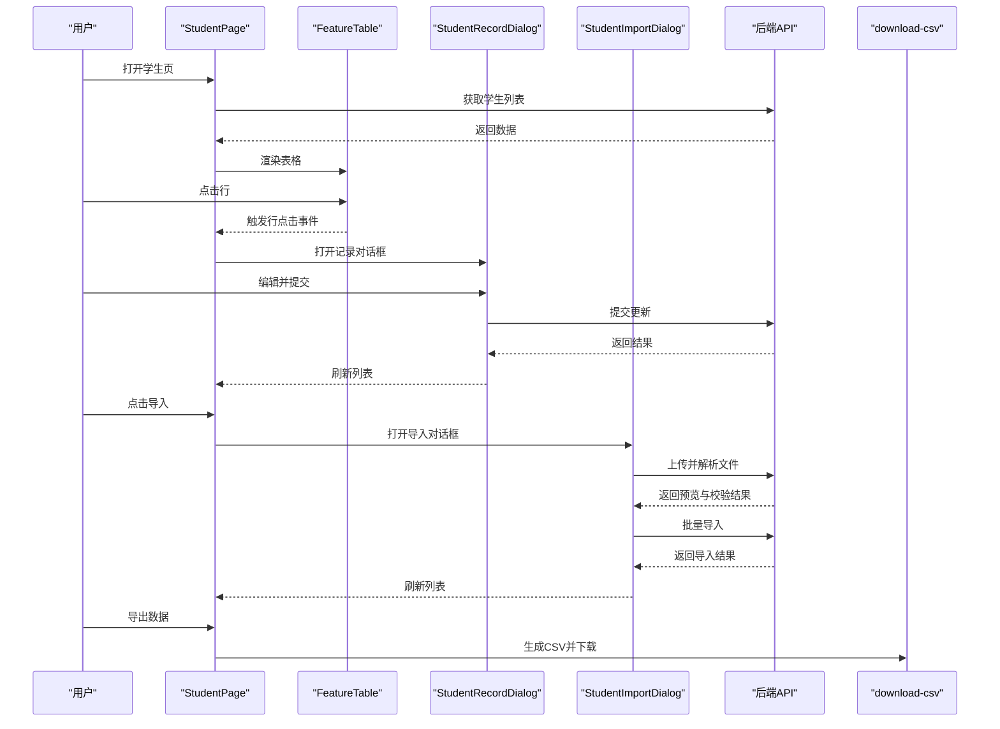
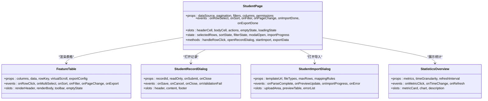
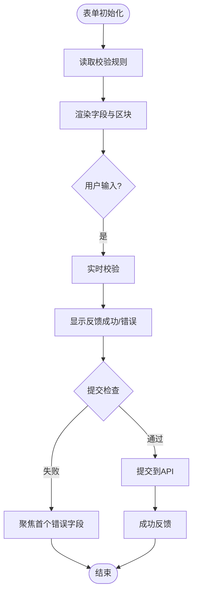
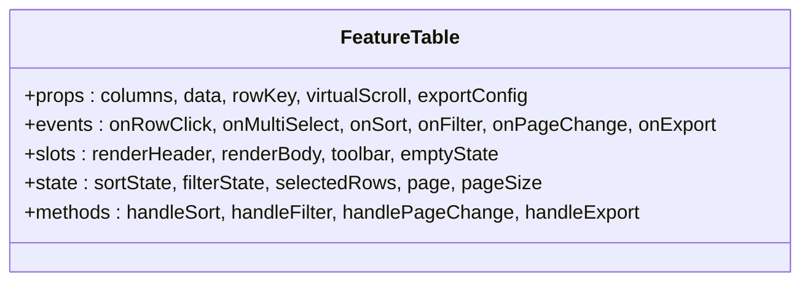
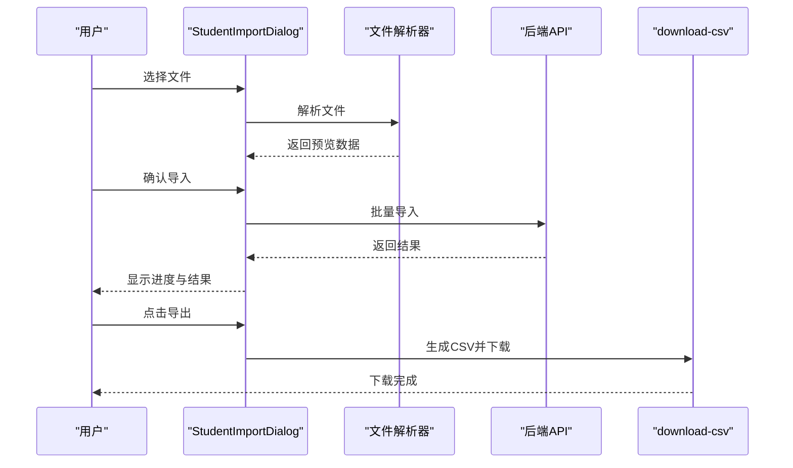
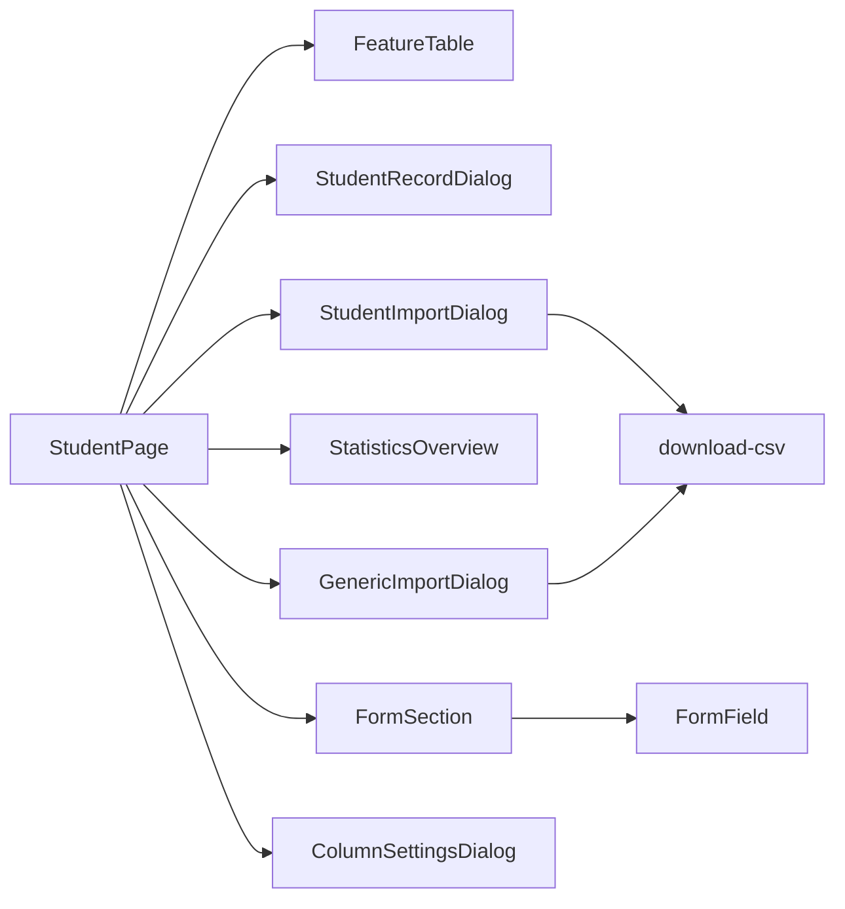

# UI组件库

<cite>
**本文引用的文件**   
- [StudentPage.tsx](file://app/components/student/StudentPage.tsx)
- [StudentRecordDialog.tsx](file://app/components/student/StudentRecordDialog.tsx)
- [StudentImportDialog.tsx](file://app/components/student/StudentImportDialog.tsx)
- [student-types.ts](file://app/components/student/student-types.ts)
- [FormSection.tsx](file://app/components/forms/FormSection.tsx)
- [FormField.tsx](file://app/components/forms/FormField.tsx)
- [ApplicationRecordForm.tsx](file://app/components/forms/ApplicationRecordForm.tsx)
- [ArchiveRecordForm.tsx](file://app/components/forms/ArchiveRecordForm.tsx)
- [BatchRecordForm.tsx](file://app/components/forms/BatchRecordForm.tsx)
- [BusinessRecordForm.tsx](file://app/components/forms/BusinessRecordForm.tsx)
- [ConfigRecordForm.tsx](file://app/components/forms/ConfigRecordForm.tsx)
- [ReviewRecordForm.tsx](file://app/components/forms/ReviewRecordForm.tsx)
- [FeatureTable.tsx](file://app/components/generic/FeatureTable.tsx)
- [GenericModule.tsx](file://app/components/generic/GenericModule.tsx)
- [StatisticsOverview.tsx](file://app/components/generic/StatisticsOverview.tsx)
- [ColumnSettingsDialog.tsx](file://app/components/generic/ColumnSettingsDialog.tsx)
- [GenericImportDialog.tsx](file://app/components/generic/GenericImportDialog.tsx)
- [SearchIcon.tsx](file://app/components/shared/SearchIcon.tsx)
- [download-csv.tsx](file://app/components/shared/download-csv.tsx)
- [AppWrapper.tsx](file://app/components/AppWrapper.tsx)
- [ErrorBoundary.tsx](file://app/components/ErrorBoundary.tsx)
- [LoginPanel.tsx](file://app/components/LoginPanel.tsx)
- [page.tsx](file://app/page.tsx)
- [layout.tsx](file://app/layout.tsx)
- [globals.css](file://app/globals.css)
</cite>

## 目录
1. [简介](#简介)
2. [项目结构](#项目结构)
3. [核心组件](#核心组件)
4. [架构总览](#架构总览)
5. [详细组件分析](#详细组件分析)
6. [依赖分析](#依赖分析)
7. [性能考虑](#性能考虑)
8. [故障排查指南](#故障排查指南)
9. [结论](#结论)
10. [附录](#附录)

## 简介
本文件为CS1学生事务管理系统的UI组件库提供系统化文档，覆盖视觉外观、交互行为、属性与事件、插槽与自定义选项、响应式设计与可访问性、状态与动画、样式与主题、跨浏览器兼容性与性能优化，以及组件组合模式与集成方式。读者可据此快速理解并正确使用各组件，同时获得最佳实践与排障建议。

## 项目结构
系统采用Next.js应用结构，UI组件按功能域划分：
- app/components/student：学生相关页面与对话框（导入、记录等）
- app/components/forms：表单类组件（字段、区块、各类业务表单）
- app/components/generic：通用表格、模块容器、统计概览、列设置、导入对话框等
- app/components/shared：共享图标与工具（如搜索图标、CSV下载）
- app/components：应用级包装器、错误边界、登录面板等
- app根目录：页面入口、布局、全局样式

```mermaid
graph TB
subgraph "应用层"
Page["页面入口<br/>app/page.tsx"]
Layout["布局容器<br/>app/layout.tsx"]
AppWrapper["应用包装器<br/>components/AppWrapper.tsx"]
ErrorBoundary["错误边界<br/>components/ErrorBoundary.tsx"]
LoginPanel["登录面板<br/>components/LoginPanel.tsx"]
end
subgraph "学生模块"
StudentPage["学生页<br/>components/student/StudentPage.tsx"]
StudentRecordDialog["学生记录对话框<br/>components/student/StudentRecordDialog.tsx"]
StudentImportDialog["学生导入对话框<br/>components/student/StudentImportDialog.tsx"]
StudentTypes["类型定义<br/>components/student/student-types.ts"]
end
subgraph "表单模块"
FormSection["表单区块<br/>components/forms/FormSection.tsx"]
FormField["表单字段<br/>components/forms/FormField.tsx"]
Forms["业务表单集合<br/>components/forms/*RecordForm.tsx"]
end
subgraph "通用模块"
FeatureTable["特性表格<br/>components/generic/FeatureTable.tsx"]
GenericModule["通用模块容器<br/>components/generic/GenericModule.tsx"]
StatisticsOverview["统计概览<br/>components/generic/StatisticsOverview.tsx"]
ColumnSettingsDialog["列设置对话框<br/>components/generic/ColumnSettingsDialog.tsx"]
GenericImportDialog["通用导入对话框<br/>components/generic/GenericImportDialog.tsx"]
end
subgraph "共享资源"
SearchIcon["搜索图标<br/>components/shared/SearchIcon.tsx"]
DownloadCSV["CSV下载工具<br/>components/shared/download-csv.tsx"]
end
Page --> Layout --> AppWrapper --> ErrorBoundary
AppWrapper --> StudentPage
StudentPage --> StudentRecordDialog
StudentPage --> StudentImportDialog
StudentPage --> FeatureTable
StudentPage --> StatisticsOverview
StudentPage --> FormSection
FormSection --> FormField
StudentPage --> Forms
StudentPage --> ColumnSettingsDialog
StudentPage --> GenericImportDialog
StudentPage --> SearchIcon
StudentPage --> DownloadCSV
```

**图表来源** 
- [page.tsx:1-200](file://app/page.tsx#L1-L200)
- [layout.tsx:1-200](file://app/layout.tsx#L1-L200)
- [AppWrapper.tsx:1-200](file://app/components/AppWrapper.tsx#L1-L200)
- [ErrorBoundary.tsx:1-200](file://app/components/ErrorBoundary.tsx#L1-L200)
- [LoginPanel.tsx:1-200](file://app/components/LoginPanel.tsx#L1-L200)
- [StudentPage.tsx:1-200](file://app/components/student/StudentPage.tsx#L1-L200)
- [StudentRecordDialog.tsx:1-200](file://app/components/student/StudentRecordDialog.tsx#L1-L200)
- [StudentImportDialog.tsx:1-200](file://app/components/student/StudentImportDialog.tsx#L1-L200)
- [student-types.ts:1-200](file://app/components/student/student-types.ts#L1-L200)
- [FormSection.tsx:1-200](file://app/components/forms/FormSection.tsx#L1-L200)
- [FormField.tsx:1-200](file://app/components/forms/FormField.tsx#L1-L200)
- [FeatureTable.tsx:1-200](file://app/components/generic/FeatureTable.tsx#L1-L200)
- [GenericModule.tsx:1-200](file://app/components/generic/GenericModule.tsx#L1-L200)
- [StatisticsOverview.tsx:1-200](file://app/components/generic/StatisticsOverview.tsx#L1-L200)
- [ColumnSettingsDialog.tsx:1-200](file://app/components/generic/ColumnSettingsDialog.tsx#L1-L200)
- [GenericImportDialog.tsx:1-200](file://app/components/generic/GenericImportDialog.tsx#L1-L200)
- [SearchIcon.tsx:1-200](file://app/components/shared/SearchIcon.tsx#L1-L200)
- [download-csv.tsx:1-200](file://app/components/shared/download-csv.tsx#L1-L200)

**章节来源**
- [page.tsx:1-200](file://app/page.tsx#L1-L200)
- [layout.tsx:1-200](file://app/layout.tsx#L1-L200)
- [AppWrapper.tsx:1-200](file://app/components/AppWrapper.tsx#L1-L200)
- [ErrorBoundary.tsx:1-200](file://app/components/ErrorBoundary.tsx#L1-L200)
- [LoginPanel.tsx:1-200](file://app/components/LoginPanel.tsx#L1-L200)

## 核心组件
本节聚焦学生事务管理中最常用的UI组件，涵盖其职责、属性、事件、插槽与自定义项、状态与动画、样式与主题、可访问性与响应式策略。

- 学生页（StudentPage）
  - 职责：展示学生列表、筛选、分页、批量操作、导入与导出、记录查看与编辑入口。
  - 关键属性：数据源、分页参数、筛选条件、列配置、权限控制开关。
  - 事件：行选择、排序、过滤、分页变更、批量操作回调。
  - 插槽：表头、单元格、操作按钮、空状态、加载态。
  - 状态与动画：加载中骨架屏、选中高亮、模态框弹出过渡。
  - 样式与主题：支持CSS变量、暗色模式、紧凑/宽松间距。
  - 可访问性：键盘导航、ARIA标签、焦点管理、对比度达标。
  - 响应式：移动端折叠列、横向滚动、触摸手势。

- 学生记录对话框（StudentRecordDialog）
  - 职责：以模态形式展示或编辑学生记录详情。
  - 关键属性：记录ID、是否只读、提交回调、关闭回调。
  - 事件：保存成功、取消、关闭、校验失败。
  - 插槽：头部、内容区、底部操作区。
  - 状态与动画：打开/关闭过渡、表单验证反馈。
  - 样式与主题：与主题一致、支持全屏模式。
  - 可访问性：焦点陷阱、Esc关闭、屏幕阅读器提示。

- 学生导入对话框（StudentImportDialog）
  - 职责：上传学生数据文件、预览、映射字段、批量导入。
  - 关键属性：模板URL、允许的文件类型、最大行数、映射规则。
  - 事件：文件解析完成、预览更新、导入进度、错误上报。
  - 插槽：上传区、预览表格、错误列表。
  - 状态与动画：拖拽高亮、进度条、错误抖动。
  - 样式与主题：上传区域主题化、错误颜色统一。
  - 可访问性：键盘上传、Aria-live播报进度。

- 表单区块（FormSection）与表单字段（FormField）
  - 职责：组织复杂表单的区块与字段，提供统一的校验、布局与样式。
  - 关键属性：标题、描述、校验规则、禁用态、布局方向。
  - 事件：字段值变化、校验结果、提交触发。
  - 插槽：字段前缀/后缀、帮助文本、错误信息。
  - 状态与动画：聚焦态、校验反馈、展开/收起。
  - 样式与主题：字段尺寸、间距、错误样式、主题变量。
  - 可访问性：标签关联、必填标识、错误朗读。

- 通用表格（FeatureTable）
  - 职责：高性能数据表格，支持排序、筛选、分页、列设置、导出。
  - 关键属性：列定义、数据源、行键、虚拟滚动开关、导出配置。
  - 事件：行点击、多选、排序、筛选、分页、导出完成。
  - 插槽：列渲染、行渲染、工具栏、空态。
  - 状态与动画：加载骨架、选中态、排序指示。
  - 样式与主题：斑马纹、边框、悬浮效果、主题适配。
  - 可访问性：键盘操作、ARIA表格语义、焦点顺序。

- 统计概览（StatisticsOverview）
  - 职责：展示关键指标卡片、趋势图、时间范围切换。
  - 关键属性：指标数组、时间粒度、刷新间隔。
  - 事件：指标点击、时间切换、刷新。
  - 插槽：指标卡、图表、说明文本。
  - 状态与动画：数字递增、图表过渡、刷新旋转。
  - 样式与主题：卡片阴影、颜色语义、暗色模式。
  - 可访问性：数值朗读、图表替代文本。

- 列设置对话框（ColumnSettingsDialog）
  - 职责：允许用户自定义显示列、排序与可见性。
  - 关键属性：可用列、当前列配置、保存回调。
  - 事件：列勾选变更、重置、保存。
  - 插槽：列列表、分组、说明。
  - 状态与动画：勾选切换、保存反馈。
  - 样式与主题：复选框样式、分组标题。
  - 可访问性：键盘选择、Aria-checked。

- 通用导入对话框（GenericImportDialog）
  - 职责：通用文件导入流程，适用于多类数据。
  - 关键属性：文件类型、映射函数、处理回调。
  - 事件：解析完成、处理中、完成/失败。
  - 插槽：上传区、进度、结果列表。
  - 状态与动画：进度条、错误提示。
  - 样式与主题：上传区域、错误高亮。
  - 可访问性：Aria-live、键盘操作。

- 共享图标与工具（SearchIcon、download-csv）
  - 职责：提供一致的图标与CSV下载能力。
  - 关键属性：尺寸、颜色、文件名、数据源。
  - 事件：下载完成、错误。
  - 插槽：无。
  - 状态与动画：下载进度、错误闪烁。
  - 样式与主题：SVG颜色继承、尺寸缩放。
  - 可访问性：aria-label、role="img"。

**章节来源**
- [StudentPage.tsx:1-200](file://app/components/student/StudentPage.tsx#L1-L200)
- [StudentRecordDialog.tsx:1-200](file://app/components/student/StudentRecordDialog.tsx#L1-L200)
- [StudentImportDialog.tsx:1-200](file://app/components/student/StudentImportDialog.tsx#L1-L200)
- [student-types.ts:1-200](file://app/components/student/student-types.ts#L1-L200)
- [FormSection.tsx:1-200](file://app/components/forms/FormSection.tsx#L1-L200)
- [FormField.tsx:1-200](file://app/components/forms/FormField.tsx#L1-L200)
- [ApplicationRecordForm.tsx:1-200](file://app/components/forms/ApplicationRecordForm.tsx#L1-L200)
- [ArchiveRecordForm.tsx:1-200](file://app/components/forms/ArchiveRecordForm.tsx#L1-L200)
- [BatchRecordForm.tsx:1-200](file://app/components/forms/BatchRecordForm.tsx#L1-L200)
- [BusinessRecordForm.tsx:1-200](file://app/components/forms/BusinessRecordForm.tsx#L1-L200)
- [ConfigRecordForm.tsx:1-200](file://app/components/forms/ConfigRecordForm.tsx#L1-L200)
- [ReviewRecordForm.tsx:1-200](file://app/components/forms/ReviewRecordForm.tsx#L1-L200)
- [FeatureTable.tsx:1-200](file://app/components/generic/FeatureTable.tsx#L1-L200)
- [GenericModule.tsx:1-200](file://app/components/generic/GenericModule.tsx#L1-L200)
- [StatisticsOverview.tsx:1-200](file://app/components/generic/StatisticsOverview.tsx#L1-L200)
- [ColumnSettingsDialog.tsx:1-200](file://app/components/generic/ColumnSettingsDialog.tsx#L1-L200)
- [GenericImportDialog.tsx:1-200](file://app/components/generic/GenericImportDialog.tsx#L1-L200)
- [SearchIcon.tsx:1-200](file://app/components/shared/SearchIcon.tsx#L1-L200)
- [download-csv.tsx:1-200](file://app/components/shared/download-csv.tsx#L1-L200)

## 架构总览
下图展示了从页面到组件的数据流与调用关系，强调学生模块与表单、通用表格、导入与统计的协作。

**图表来源** 
- [StudentPage.tsx:1-200](file://app/components/student/StudentPage.tsx#L1-L200)
- [FeatureTable.tsx:1-200](file://app/components/generic/FeatureTable.tsx#L1-L200)
- [StudentRecordDialog.tsx:1-200](file://app/components/student/StudentRecordDialog.tsx#L1-L200)
- [StudentImportDialog.tsx:1-200](file://app/components/student/StudentImportDialog.tsx#L1-L200)
- [download-csv.tsx:1-200](file://app/components/shared/download-csv.tsx#L1-L200)

## 详细组件分析

### 学生页（StudentPage）
- 视觉外观：顶部工具栏（搜索、筛选、导入、导出）、中部表格、底部分页与统计摘要。
- 行为与交互：支持键盘导航、多选、排序、筛选、分页；模态框打开/关闭；导入进度反馈。
- 属性/参数：数据源、分页、筛选、列配置、权限开关、主题变量。
- 事件：行选择、排序、筛选、分页、导入完成、导出完成。
- 插槽：表头、单元格、操作按钮、空态、加载态。
- 状态与动画：加载中骨架、选中高亮、模态过渡、错误抖动。
- 样式与主题：CSS变量、暗色模式、紧凑/宽松间距、斑马纹。
- 可访问性：ARIA标签、焦点管理、键盘操作、对比度。
- 响应式：移动端折叠列、横向滚动、触摸手势。
- 组合模式：与FeatureTable、StudentRecordDialog、StudentImportDialog、StatisticsOverview组合使用。

**图表来源** 
- [StudentPage.tsx:1-200](file://app/components/student/StudentPage.tsx#L1-L200)
- [FeatureTable.tsx:1-200](file://app/components/generic/FeatureTable.tsx#L1-L200)
- [StudentRecordDialog.tsx:1-200](file://app/components/student/StudentRecordDialog.tsx#L1-L200)
- [StudentImportDialog.tsx:1-200](file://app/components/student/StudentImportDialog.tsx#L1-L200)
- [StatisticsOverview.tsx:1-200](file://app/components/generic/StatisticsOverview.tsx#L1-L200)

**章节来源**
- [StudentPage.tsx:1-200](file://app/components/student/StudentPage.tsx#L1-L200)
- [FeatureTable.tsx:1-200](file://app/components/generic/FeatureTable.tsx#L1-L200)
- [StudentRecordDialog.tsx:1-200](file://app/components/student/StudentRecordDialog.tsx#L1-L200)
- [StudentImportDialog.tsx:1-200](file://app/components/student/StudentImportDialog.tsx#L1-L200)
- [StatisticsOverview.tsx:1-200](file://app/components/generic/StatisticsOverview.tsx#L1-L200)

### 表单组件族（FormSection、FormField与各RecordForm）
- 视觉外观：区块标题与描述、字段输入控件、帮助文本与错误提示、提交按钮。
- 行为与交互：实时校验、异步校验、提交防抖、错误聚焦跳转。
- 属性/参数：标题、描述、校验规则、禁用态、布局方向、字段类型。
- 事件：onChange、onValidate、onSubmit、onBlur。
- 插槽：前缀/后缀、帮助文本、错误信息、自定义渲染。
- 状态与动画：聚焦态、校验反馈、展开/收起、提交加载。
- 样式与主题：字段尺寸、间距、错误样式、主题变量。
- 可访问性：label关联、必填标识、错误朗读、键盘导航。
- 组合模式：FormSection包裹多个FormField，各RecordForm复用这些基础组件实现业务表单。

**图表来源** 
- [FormSection.tsx:1-200](file://app/components/forms/FormSection.tsx#L1-L200)
- [FormField.tsx:1-200](file://app/components/forms/FormField.tsx#L1-L200)
- [ApplicationRecordForm.tsx:1-200](file://app/components/forms/ApplicationRecordForm.tsx#L1-L200)
- [ArchiveRecordForm.tsx:1-200](file://app/components/forms/ArchiveRecordForm.tsx#L1-L200)
- [BatchRecordForm.tsx:1-200](file://app/components/forms/BatchRecordForm.tsx#L1-L200)
- [BusinessRecordForm.tsx:1-200](file://app/components/forms/BusinessRecordForm.tsx#L1-L200)
- [ConfigRecordForm.tsx:1-200](file://app/components/forms/ConfigRecordForm.tsx#L1-L200)
- [ReviewRecordForm.tsx:1-200](file://app/components/forms/ReviewRecordForm.tsx#L1-L200)

**章节来源**
- [FormSection.tsx:1-200](file://app/components/forms/FormSection.tsx#L1-L200)
- [FormField.tsx:1-200](file://app/components/forms/FormField.tsx#L1-L200)
- [ApplicationRecordForm.tsx:1-200](file://app/components/forms/ApplicationRecordForm.tsx#L1-L200)
- [ArchiveRecordForm.tsx:1-200](file://app/components/forms/ArchiveRecordForm.tsx#L1-L200)
- [BatchRecordForm.tsx:1-200](file://app/components/forms/BatchRecordForm.tsx#L1-L200)
- [BusinessRecordForm.tsx:1-200](file://app/components/forms/BusinessRecordForm.tsx#L1-L200)
- [ConfigRecordForm.tsx:1-200](file://app/components/forms/ConfigRecordForm.tsx#L1-L200)
- [ReviewRecordForm.tsx:1-200](file://app/components/forms/ReviewRecordForm.tsx#L1-L200)

### 通用表格（FeatureTable）
- 视觉外观：表头排序指示、筛选栏、分页控件、导出按钮、空态占位。
- 行为与交互：排序、筛选、分页、多选、虚拟滚动、导出CSV。
- 属性/参数：列定义、数据源、行键、虚拟滚动开关、导出配置。
- 事件：行点击、多选、排序、筛选、分页、导出完成。
- 插槽：列渲染、行渲染、工具栏、空态。
- 状态与动画：加载骨架、选中态、排序指示、导出进度。
- 样式与主题：斑马纹、边框、悬浮效果、主题适配。
- 可访问性：键盘操作、ARIA表格语义、焦点顺序。
- 响应式：列隐藏、横向滚动、触摸手势。

**图表来源** 
- [FeatureTable.tsx:1-200](file://app/components/generic/FeatureTable.tsx#L1-L200)

**章节来源**
- [FeatureTable.tsx:1-200](file://app/components/generic/FeatureTable.tsx#L1-L200)

### 导入与导出（StudentImportDialog、GenericImportDialog、download-csv）
- 视觉外观：拖拽上传区、预览表格、进度条、错误列表。
- 行为与交互：文件解析、字段映射、批量导入、错误提示、下载CSV。
- 属性/参数：模板URL、文件类型、最大行数、映射规则、文件名、数据源。
- 事件：解析完成、预览更新、导入进度、错误上报、下载完成。
- 插槽：上传区、预览表格、错误列表、结果列表。
- 状态与动画：拖拽高亮、进度条、错误抖动、下载旋转。
- 样式与主题：上传区域主题化、错误颜色统一。
- 可访问性：键盘上传、Aria-live播报进度、aria-label。

**图表来源** 
- [StudentImportDialog.tsx:1-200](file://app/components/student/StudentImportDialog.tsx#L1-L200)
- [GenericImportDialog.tsx:1-200](file://app/components/generic/GenericImportDialog.tsx#L1-L200)
- [download-csv.tsx:1-200](file://app/components/shared/download-csv.tsx#L1-L200)

**章节来源**
- [StudentImportDialog.tsx:1-200](file://app/components/student/StudentImportDialog.tsx#L1-L200)
- [GenericImportDialog.tsx:1-200](file://app/components/generic/GenericImportDialog.tsx#L1-L200)
- [download-csv.tsx:1-200](file://app/components/shared/download-csv.tsx#L1-L200)

### 统计概览（StatisticsOverview）
- 视觉外观：指标卡片、趋势图、时间范围切换。
- 行为与交互：指标点击、时间切换、自动刷新。
- 属性/参数：指标数组、时间粒度、刷新间隔。
- 事件：指标点击、时间切换、刷新。
- 插槽：指标卡、图表、说明文本。
- 状态与动画：数字递增、图表过渡、刷新旋转。
- 样式与主题：卡片阴影、颜色语义、暗色模式。
- 可访问性：数值朗读、图表替代文本。

**章节来源**
- [StatisticsOverview.tsx:1-200](file://app/components/generic/StatisticsOverview.tsx#L1-L200)

### 列设置对话框（ColumnSettingsDialog）
- 视觉外观：列列表、分组、勾选框、重置与保存按钮。
- 行为与交互：列勾选变更、重置默认、保存配置。
- 属性/参数：可用列、当前列配置、保存回调。
- 事件：列勾选变更、重置、保存。
- 插槽：列列表、分组、说明。
- 状态与动画：勾选切换、保存反馈。
- 样式与主题：复选框样式、分组标题。
- 可访问性：键盘选择、Aria-checked。

**章节来源**
- [ColumnSettingsDialog.tsx:1-200](file://app/components/generic/ColumnSettingsDialog.tsx#L1-L200)

### 应用级组件（AppWrapper、ErrorBoundary、LoginPanel）
- AppWrapper：应用上下文、主题注入、全局样式、路由守卫。
- ErrorBoundary：捕获渲染错误、降级UI、错误上报。
- LoginPanel：登录表单、认证流程、权限校验。

**章节来源**
- [AppWrapper.tsx:1-200](file://app/components/AppWrapper.tsx#L1-L200)
- [ErrorBoundary.tsx:1-200](file://app/components/ErrorBoundary.tsx#L1-L200)
- [LoginPanel.tsx:1-200](file://app/components/LoginPanel.tsx#L1-L200)

## 依赖分析
组件间依赖清晰，遵循单一职责与组合模式：
- StudentPage依赖FeatureTable、StudentRecordDialog、StudentImportDialog、StatisticsOverview。
- 表单组件族由FormSection与FormField组成，各RecordForm复用基础能力。
- 导入与导出由StudentImportDialog、GenericImportDialog与download-csv协作。
- 通用能力（图标、下载）集中在shared模块。

**图表来源** 
- [StudentPage.tsx:1-200](file://app/components/student/StudentPage.tsx#L1-L200)
- [FeatureTable.tsx:1-200](file://app/components/generic/FeatureTable.tsx#L1-L200)
- [StudentRecordDialog.tsx:1-200](file://app/components/student/StudentRecordDialog.tsx#L1-L200)
- [StudentImportDialog.tsx:1-200](file://app/components/student/StudentImportDialog.tsx#L1-L200)
- [StatisticsOverview.tsx:1-200](file://app/components/generic/StatisticsOverview.tsx#L1-L200)
- [FormSection.tsx:1-200](file://app/components/forms/FormSection.tsx#L1-L200)
- [FormField.tsx:1-200](file://app/components/forms/FormField.tsx#L1-L200)
- [ColumnSettingsDialog.tsx:1-200](file://app/components/generic/ColumnSettingsDialog.tsx#L1-L200)
- [GenericImportDialog.tsx:1-200](file://app/components/generic/GenericImportDialog.tsx#L1-L200)
- [download-csv.tsx:1-200](file://app/components/shared/download-csv.tsx#L1-L200)

**章节来源**
- [StudentPage.tsx:1-200](file://app/components/student/StudentPage.tsx#L1-L200)
- [FeatureTable.tsx:1-200](file://app/components/generic/FeatureTable.tsx#L1-L200)
- [StudentRecordDialog.tsx:1-200](file://app/components/student/StudentRecordDialog.tsx#L1-L200)
- [StudentImportDialog.tsx:1-200](file://app/components/student/StudentImportDialog.tsx#L1-L200)
- [StatisticsOverview.tsx:1-200](file://app/components/generic/StatisticsOverview.tsx#L1-L200)
- [FormSection.tsx:1-200](file://app/components/forms/FormSection.tsx#L1-L200)
- [FormField.tsx:1-200](file://app/components/forms/FormField.tsx#L1-L200)
- [ColumnSettingsDialog.tsx:1-200](file://app/components/generic/ColumnSettingsDialog.tsx#L1-L200)
- [GenericImportDialog.tsx:1-200](file://app/components/generic/GenericImportDialog.tsx#L1-L200)
- [download-csv.tsx:1-200](file://app/components/shared/download-csv.tsx#L1-L200)

## 性能考虑
- 表格性能：启用虚拟滚动、分页加载、惰性渲染、去抖筛选与排序。
- 导入性能：分块解析大文件、增量预览、并发限制、错误重试。
- 表单性能：字段级校验缓存、提交防抖、异步校验队列。
- 渲染优化：React.memo、useMemo/useCallback、避免不必要的重渲染。
- 网络优化：请求合并、缓存策略、错误重试与退避。
- 内存管理：及时释放监听器、清理定时器、避免闭包泄漏。

[本节为通用指导，不直接分析具体文件]

## 故障排查指南
- 常见问题
  - 表格数据不更新：检查数据源引用、分页参数、事件回调是否正确。
  - 导入失败：核对文件类型、字段映射、最大行数限制、后端接口状态。
  - 表单校验不生效：确认校验规则、异步校验回调、错误聚焦逻辑。
  - 模态框无法关闭：检查焦点陷阱、Esc事件、关闭回调。
- 调试技巧
  - 使用浏览器开发者工具观察网络请求与响应。
  - 在关键事件处添加日志输出，定位问题链路。
  - 使用错误边界捕获渲染异常，查看堆栈信息。
- 可访问性自检
  - 键盘导航是否完整，焦点顺序是否符合预期。
  - ARIA标签与角色是否正确，屏幕阅读器是否能朗读关键信息。
  - 颜色对比度是否达标，错误提示是否足够明显。

**章节来源**
- [ErrorBoundary.tsx:1-200](file://app/components/ErrorBoundary.tsx#L1-L200)
- [StudentImportDialog.tsx:1-200](file://app/components/student/StudentImportDialog.tsx#L1-L200)
- [FormSection.tsx:1-200](file://app/components/forms/FormSection.tsx#L1-L200)
- [StudentRecordDialog.tsx:1-200](file://app/components/student/StudentRecordDialog.tsx#L1-L200)

## 结论
本UI组件库围绕学生事务管理场景，提供了高内聚、低耦合、可组合的组件体系。通过统一的属性/事件/插槽规范、完善的可访问性与响应式设计、稳定的状态与动画、灵活的样式与主题支持，以及清晰的依赖关系与性能优化策略，能够支撑复杂业务场景的高效开发与稳定运行。建议在实际使用中遵循本文档的最佳实践，结合具体需求进行扩展与定制。

[本节为总结，不直接分析具体文件]

## 附录
- 使用示例路径（不含代码内容）
  - 学生页使用：[StudentPage.tsx:1-200](file://app/components/student/StudentPage.tsx#L1-L200)
  - 记录对话框使用：[StudentRecordDialog.tsx:1-200](file://app/components/student/StudentRecordDialog.tsx#L1-L200)
  - 导入对话框使用：[StudentImportDialog.tsx:1-200](file://app/components/student/StudentImportDialog.tsx#L1-L200)
  - 表单区块与字段：[FormSection.tsx:1-200](file://app/components/forms/FormSection.tsx#L1-L200)、[FormField.tsx:1-200](file://app/components/forms/FormField.tsx#L1-L200)
  - 业务表单示例：[ApplicationRecordForm.tsx:1-200](file://app/components/forms/ApplicationRecordForm.tsx#L1-L200)、[ArchiveRecordForm.tsx:1-200](file://app/components/forms/ArchiveRecordForm.tsx#L1-L200)、[BatchRecordForm.tsx:1-200](file://app/components/forms/BatchRecordForm.tsx#L1-L200)、[BusinessRecordForm.tsx:1-200](file://app/components/forms/BusinessRecordForm.tsx#L1-L200)、[ConfigRecordForm.tsx:1-200](file://app/components/forms/ConfigRecordForm.tsx#L1-L200)、[ReviewRecordForm.tsx:1-200](file://app/components/forms/ReviewRecordForm.tsx#L1-L200)
  - 通用表格使用：[FeatureTable.tsx:1-200](file://app/components/generic/FeatureTable.tsx#L1-L200)
  - 统计概览使用：[StatisticsOverview.tsx:1-200](file://app/components/generic/StatisticsOverview.tsx#L1-L200)
  - 列设置对话框使用：[ColumnSettingsDialog.tsx:1-200](file://app/components/generic/ColumnSettingsDialog.tsx#L1-L200)
  - 通用导入对话框使用：[GenericImportDialog.tsx:1-200](file://app/components/generic/GenericImportDialog.tsx#L1-L200)
  - 共享图标与下载：[SearchIcon.tsx:1-200](file://app/components/shared/SearchIcon.tsx#L1-L200)、[download-csv.tsx:1-200](file://app/components/shared/download-csv.tsx#L1-L200)
  - 应用级组件：[AppWrapper.tsx:1-200](file://app/components/AppWrapper.tsx#L1-L200)、[ErrorBoundary.tsx:1-200](file://app/components/ErrorBoundary.tsx#L1-L200)、[LoginPanel.tsx:1-200](file://app/components/LoginPanel.tsx#L1-L200)

- 响应式与可访问性合规要点
  - 响应式：媒体查询、弹性布局、移动端手势、横向滚动与列折叠。
  - 可访问性：语义化HTML、ARIA标签、键盘导航、焦点管理、屏幕阅读器友好、颜色对比度。

- 样式与主题支持
  - CSS变量：颜色、字体、间距、阴影等主题化。
  - 暗色模式：通过类名或数据属性切换。
  - 组件主题：通过props或上下文注入主题对象。

- 跨浏览器兼容性
  - 现代浏览器优先，必要时提供polyfill与降级方案。
  - 测试覆盖主流浏览器版本，确保一致性。

- 性能优化清单
  - 虚拟滚动、分页加载、惰性渲染、去抖与节流。
  - 请求合并、缓存策略、错误重试与退避。
  - React性能优化：memo、useMemo、useCallback、避免不必要重渲染。

[本节为补充信息，不直接分析具体文件]