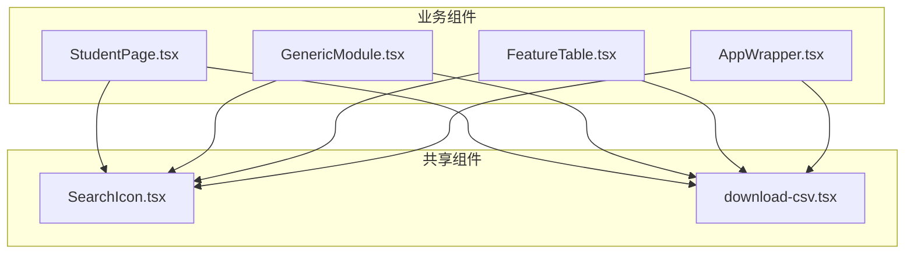
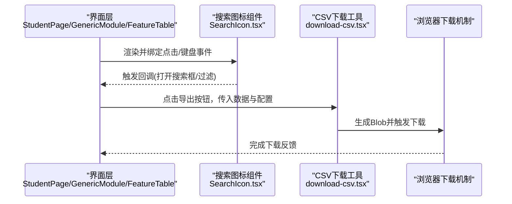
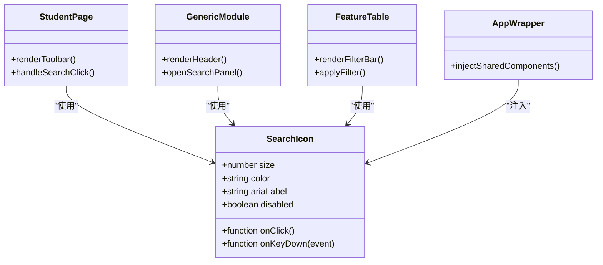
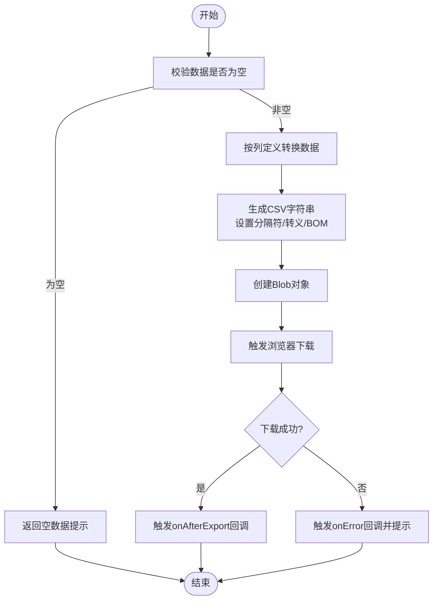
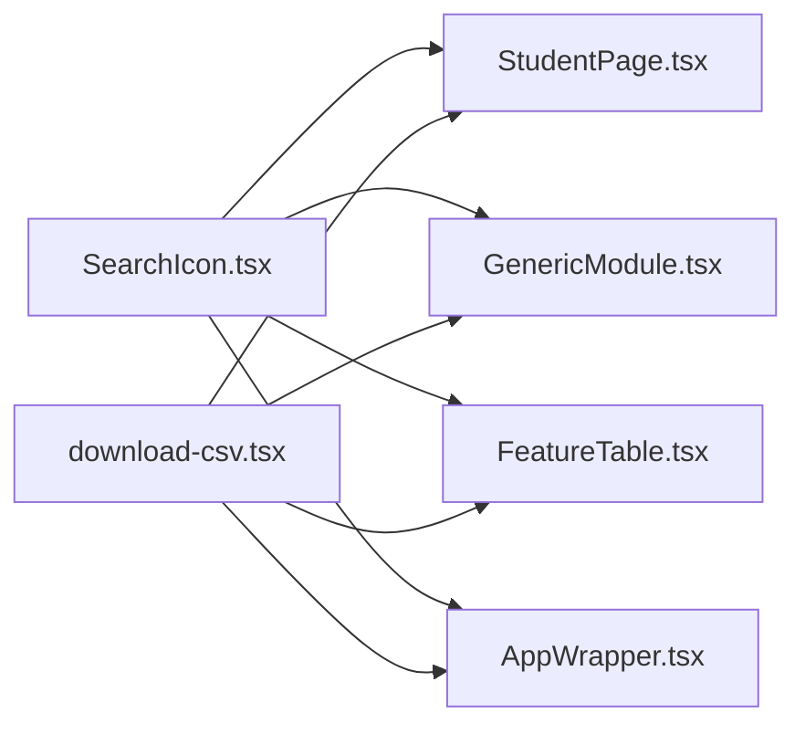

# 共享组件

<cite>
**本文引用的文件**   
- [SearchIcon.tsx](file://app/components/shared/SearchIcon.tsx)
- [download-csv.tsx](file://app/components/shared/download-csv.tsx)
- [StudentPage.tsx](file://app/components/student/StudentPage.tsx)
- [GenericModule.tsx](file://app/components/generic/GenericModule.tsx)
- [FeatureTable.tsx](file://app/components/generic/FeatureTable.tsx)
- [AppWrapper.tsx](file://app/components/AppWrapper.tsx)
</cite>

## 目录
1. [简介](#简介)
2. [项目结构](#项目结构)
3. [核心组件](#核心组件)
4. [架构总览](#架构总览)
5. [详细组件分析](#详细组件分析)
6. [依赖关系分析](#依赖关系分析)
7. [性能考虑](#性能考虑)
8. [故障排查指南](#故障排查指南)
9. [结论](#结论)
10. [附录](#附录)

## 简介
本文件面向CS1学生事务管理系统的共享组件，聚焦以下两个能力：
- 搜索图标组件：提供统一的搜索入口图标与交互语义，便于在表格、工具栏等位置复用。
- CSV下载工具：封装CSV导出逻辑，支持数据转换、编码处理与浏览器端下载触发。

文档将详细说明这两个组件的功能特性、参数/属性、事件与自定义选项，给出在其他组件中的集成方式示例（以路径引用代替代码片段），并提供样式定制与国际化支持指南，以及性能优化建议与最佳实践。

## 项目结构
共享组件位于 app/components/shared 目录下，被多个业务模块复用：
- SearchIcon.tsx：搜索图标组件
- download-csv.tsx：CSV下载工具函数/组件

这些组件被页面级或通用组件（如 StudentPage、GenericModule、FeatureTable）引入使用，形成“共享能力 -> 业务组件”的复用模式。

图表来源
- [SearchIcon.tsx](file://app/components/shared/SearchIcon.tsx)
- [download-csv.tsx](file://app/components/shared/download-csv.tsx)
- [StudentPage.tsx](file://app/components/student/StudentPage.tsx)
- [GenericModule.tsx](file://app/components/generic/GenericModule.tsx)
- [FeatureTable.tsx](file://app/components/generic/FeatureTable.tsx)
- [AppWrapper.tsx](file://app/components/AppWrapper.tsx)

章节来源
- [SearchIcon.tsx](file://app/components/shared/SearchIcon.tsx)
- [download-csv.tsx](file://app/components/shared/download-csv.tsx)
- [StudentPage.tsx](file://app/components/student/StudentPage.tsx)
- [GenericModule.tsx](file://app/components/generic/GenericModule.tsx)
- [FeatureTable.tsx](file://app/components/generic/FeatureTable.tsx)
- [AppWrapper.tsx](file://app/components/AppWrapper.tsx)

## 核心组件
本节对两个共享组件进行概览说明，后续章节展开详细分析与集成示例。

- 搜索图标组件（SearchIcon）
  - 职责：渲染搜索图标，承载可访问性标签、点击行为与可选回调。
  - 典型用法：嵌入工具栏、表格头部、筛选区域。
  - 可配置项：尺寸、颜色、提示文案、是否禁用、点击回调等。
  - 事件：onClick、onKeyDown（键盘无障碍）。
  - 样式：通过CSS类名或内联样式覆盖；支持主题色与暗色模式。
  - 国际化：提示文案可通过传入i18n键值或文本实现多语言。

- CSV下载工具（download-csv）
  - 职责：将结构化数据转换为CSV字符串，设置MIME类型与文件名，触发浏览器下载。
  - 典型用法：在导出按钮点击时调用，传入列定义与数据数组。
  - 可配置项：分隔符、换行符、BOM头、字段转义策略、文件名、MIME类型。
  - 错误处理：空数据校验、非法字符处理、大体积分块或流式导出建议。
  - 性能：避免重复序列化，缓存列映射，控制数据量。

章节来源
- [SearchIcon.tsx](file://app/components/shared/SearchIcon.tsx)
- [download-csv.tsx](file://app/components/shared/download-csv.tsx)

## 架构总览
下图展示共享组件在应用中的调用关系与数据流向。搜索图标作为UI原子组件，被多处复用；CSV下载工具作为纯函数或轻量组件，被导出按钮触发执行。

图表来源
- [SearchIcon.tsx](file://app/components/shared/SearchIcon.tsx)
- [download-csv.tsx](file://app/components/shared/download-csv.tsx)
- [StudentPage.tsx](file://app/components/student/StudentPage.tsx)
- [GenericModule.tsx](file://app/components/generic/GenericModule.tsx)
- [FeatureTable.tsx](file://app/components/generic/FeatureTable.tsx)

## 详细组件分析

### 搜索图标组件（SearchIcon）
- 功能特性
  - 统一视觉风格与可访问性标签，确保屏幕阅读器可读。
  - 支持点击与键盘操作（Enter/Space）触发回调。
  - 可组合到输入框前缀、工具栏按钮或表格筛选区。
- 属性/参数
  - 尺寸：宽/高或字号比例
  - 颜色：主色、悬停色、禁用态
  - 提示文案：aria-label/title
  - 禁用态：disabled
  - 回调：onClick、onKeyDown
- 事件
  - onClick：打开搜索面板或触发过滤
  - onKeyDown：无障碍键盘导航
- 样式定制
  - 通过className或CSS变量覆盖图标颜色与尺寸
  - 支持主题切换（明/暗）
- 国际化
  - 提示文案通过外部传入，避免硬编码
- 集成示例（路径引用）
  - 在表格头部工具栏中引入并使用：[StudentPage.tsx](file://app/components/student/StudentPage.tsx)
  - 在通用模块顶部导航中使用：[GenericModule.tsx](file://app/components/generic/GenericModule.tsx)
  - 在功能表格的筛选区域嵌入：[FeatureTable.tsx](file://app/components/generic/FeatureTable.tsx)
  - 在全局包装器中统一注入：[AppWrapper.tsx](file://app/components/AppWrapper.tsx)

图表来源
- [SearchIcon.tsx](file://app/components/shared/SearchIcon.tsx)
- [StudentPage.tsx](file://app/components/student/StudentPage.tsx)
- [GenericModule.tsx](file://app/components/generic/GenericModule.tsx)
- [FeatureTable.tsx](file://app/components/generic/FeatureTable.tsx)
- [AppWrapper.tsx](file://app/components/AppWrapper.tsx)

章节来源
- [SearchIcon.tsx](file://app/components/shared/SearchIcon.tsx)
- [StudentPage.tsx](file://app/components/student/StudentPage.tsx)
- [GenericModule.tsx](file://app/components/generic/GenericModule.tsx)
- [FeatureTable.tsx](file://app/components/generic/FeatureTable.tsx)
- [AppWrapper.tsx](file://app/components/AppWrapper.tsx)

### CSV下载工具（download-csv）
- 功能特性
  - 将对象数组转换为CSV字符串，支持自定义分隔符与转义规则
  - 自动添加BOM头以兼容Excel中文显示
  - 生成Blob并通过URL.createObjectURL触发下载
- 参数/配置
  - 数据：二维数组或对象数组
  - 列定义：字段映射、标题、格式化函数
  - 格式：分隔符、换行符、引号字符、转义策略
  - 文件：文件名、MIME类型、BOM开关
- 事件/回调
  - onBeforeExport：导出前预处理数据
  - onAfterExport：导出完成后回调（如统计日志）
  - onError：异常捕获与用户提示
- 错误处理
  - 空数据校验、非法字符清理、内存占用监控
  - 大文件建议分页导出或后端流式导出
- 样式定制
  - 该工具为无UI函数/组件，样式由调用方决定（如按钮样式）
- 国际化
  - 文件名与提示信息通过传入的多语言文本实现
- 集成示例（路径引用）
  - 在导出按钮点击事件中调用：[StudentPage.tsx](file://app/components/student/StudentPage.tsx)
  - 在通用模块的数据导出流程中使用：[GenericModule.tsx](file://app/components/generic/GenericModule.tsx)
  - 在功能表格的批量导出场景中使用：[FeatureTable.tsx](file://app/components/generic/FeatureTable.tsx)
  - 在全局导出入口统一封装：[AppWrapper.tsx](file://app/components/AppWrapper.tsx)

图表来源
- [download-csv.tsx](file://app/components/shared/download-csv.tsx)

章节来源
- [download-csv.tsx](file://app/components/shared/download-csv.tsx)
- [StudentPage.tsx](file://app/components/student/StudentPage.tsx)
- [GenericModule.tsx](file://app/components/generic/GenericModule.tsx)
- [FeatureTable.tsx](file://app/components/generic/FeatureTable.tsx)
- [AppWrapper.tsx](file://app/components/AppWrapper.tsx)

## 依赖关系分析
- 组件耦合度
  - SearchIcon与调用方低耦合，仅通过props与事件通信
  - download-csv为纯函数/轻组件，无状态，易于测试与替换
- 直接依赖
  - 调用方仅依赖共享组件导出的接口，不关心内部实现细节
- 外部依赖
  - 浏览器API：Blob、URL.createObjectURL、URL.revokeObjectURL
  - 可选：i18n库用于多语言文案
- 潜在循环依赖
  - 当前设计无循环导入风险，共享组件不反向依赖业务组件

图表来源
- [SearchIcon.tsx](file://app/components/shared/SearchIcon.tsx)
- [download-csv.tsx](file://app/components/shared/download-csv.tsx)
- [StudentPage.tsx](file://app/components/student/StudentPage.tsx)
- [GenericModule.tsx](file://app/components/generic/GenericModule.tsx)
- [FeatureTable.tsx](file://app/components/generic/FeatureTable.tsx)
- [AppWrapper.tsx](file://app/components/AppWrapper.tsx)

章节来源
- [SearchIcon.tsx](file://app/components/shared/SearchIcon.tsx)
- [download-csv.tsx](file://app/components/shared/download-csv.tsx)
- [StudentPage.tsx](file://app/components/student/StudentPage.tsx)
- [GenericModule.tsx](file://app/components/generic/GenericModule.tsx)
- [FeatureTable.tsx](file://app/components/generic/FeatureTable.tsx)
- [AppWrapper.tsx](file://app/components/AppWrapper.tsx)

## 性能考虑
- 搜索图标
  - 避免在高频重渲染路径中创建新函数对象，使用useCallback或稳定引用
  - 图标资源使用SVG内联或Sprite以减少HTTP请求
- CSV下载
  - 大数据集建议分批生成CSV或使用后端流式导出
  - 避免重复序列化：缓存列映射与格式化函数
  - 及时释放URL对象，防止内存泄漏
  - 控制单次导出行数，必要时提供进度提示

## 故障排查指南
- 搜索图标无响应
  - 检查onClick/onKeyDown是否正确绑定
  - 确认disabled状态未意外启用
  - 验证无障碍标签aria-label已设置
- CSV下载失败
  - 检查数据是否为空或包含非法字符
  - 确认分隔符与转义策略匹配目标系统要求
  - 查看浏览器控制台是否有Blob/URL相关错误
  - 大文件导致内存不足时，改用分页或后端导出

章节来源
- [SearchIcon.tsx](file://app/components/shared/SearchIcon.tsx)
- [download-csv.tsx](file://app/components/shared/download-csv.tsx)

## 结论
SearchIcon与download-csv作为CS1学生事务管理系统的共享组件，提供了稳定的UI原子能力与通用的数据导出能力。通过清晰的接口设计与低耦合的集成方式，它们能够在多个业务场景中高效复用。遵循本文的样式定制、国际化支持与性能优化建议，可进一步提升用户体验与系统稳定性。

## 附录
- 集成要点清单
  - 在需要搜索入口的位置引入SearchIcon，并传入必要的尺寸、颜色与提示文案
  - 在导出按钮点击事件中调用download-csv，传入数据、列定义与文件配置
  - 为无障碍与多语言需求提供aria-label与i18n文案
  - 对大数据导出采用分页或后端流式方案
- 参考路径（示例）
  - 搜索图标在页面中的使用：[StudentPage.tsx](file://app/components/student/StudentPage.tsx)
  - CSV下载在模块中的使用：[GenericModule.tsx](file://app/components/generic/GenericModule.tsx)
  - 表格导出场景：[FeatureTable.tsx](file://app/components/generic/FeatureTable.tsx)
  - 全局导出入口：[AppWrapper.tsx](file://app/components/AppWrapper.tsx)