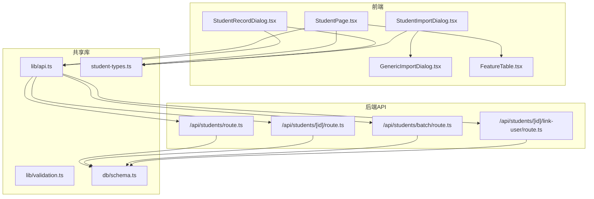
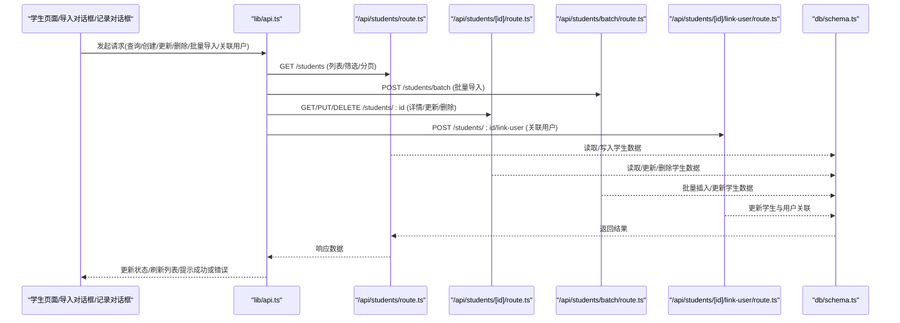
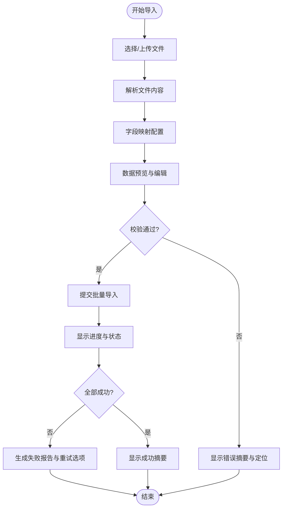
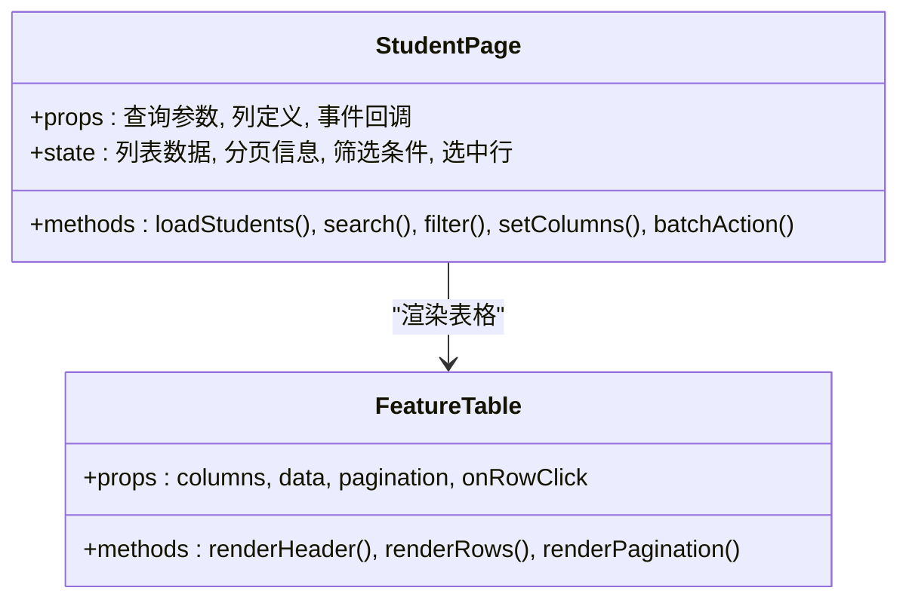
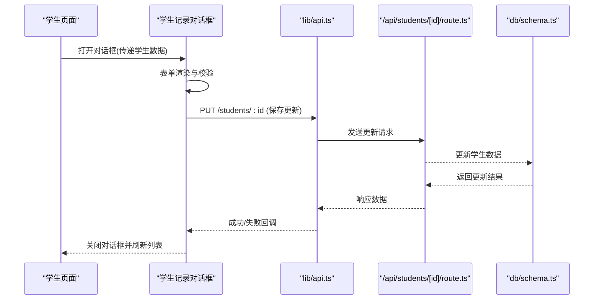
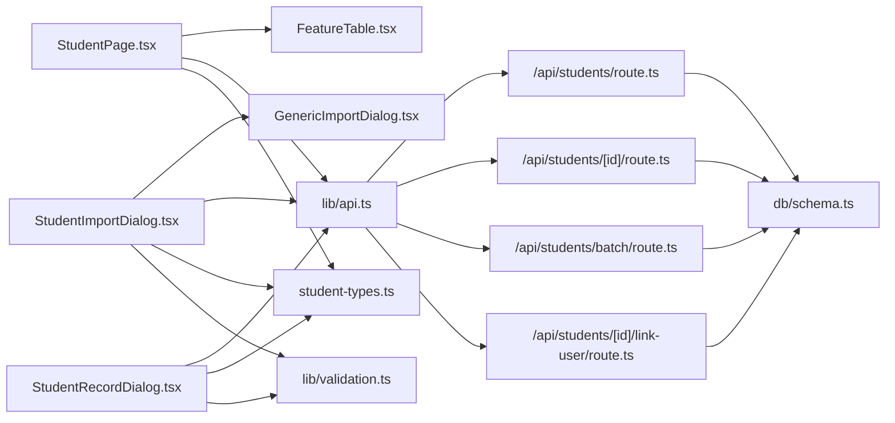

# 学生管理组件

<cite>
**本文档引用的文件**   
- [StudentImportDialog.tsx](file://app/components/student/StudentImportDialog.tsx)
- [StudentPage.tsx](file://app/components/student/StudentPage.tsx)
- [StudentRecordDialog.tsx](file://app/components/student/StudentRecordDialog.tsx)
- [student-types.ts](file://app/components/student/student-types.ts)
- [GenericImportDialog.tsx](file://app/components/generic/GenericImportDialog.tsx)
- [FeatureTable.tsx](file://app/components/generic/FeatureTable.tsx)
- [students/route.ts](file://app/api/students/route.ts)
- [students/[id]/route.ts](file://app/api/students/[id]/route.ts)
- [students/batch/route.ts](file://app/api/students/batch/route.ts)
- [students/[id]/link-user/route.ts](file://app/api/students/[id]/link-user/route.ts)
- [api.ts](file://lib/api.ts)
- [validation.ts](file://lib/validation.ts)
- [schema.ts](file://db/schema.ts)
</cite>

## 目录
1. [简介](#简介)
2. [项目结构](#项目结构)
3. [核心组件](#核心组件)
4. [架构总览](#架构总览)
5. [详细组件分析](#详细组件分析)
6. [依赖关系分析](#依赖关系分析)
7. [性能考虑](#性能考虑)
8. [故障排查指南](#故障排查指南)
9. [结论](#结论)
10. [附录](#附录)

## 简介
本文件面向CS1学生事务管理系统中的“学生管理”相关前端与后端集成，重点覆盖以下三个核心UI组件：
- 学生导入对话框：用于批量导入学生数据（如CSV），提供字段映射、预览、校验与错误报告。
- 学生页面：展示学生列表、搜索筛选、分页、列设置、批量操作与状态更新。
- 学生记录对话框：查看或编辑单个学生的详细信息，支持保存、撤销、错误提示与权限控制。

文档将详细说明这些组件的视觉外观、功能特性、用户交互模式、属性/参数、事件与数据绑定方式，并给出与后端API的集成方式和数据同步机制，同时包含数据验证、错误处理与用户体验优化建议。

## 项目结构
学生管理模块采用前后端分离设计：
- 前端组件位于 app/components/student 与通用组件 app/components/generic。
- 后端API路由位于 app/api/students 及其子路由。
- 类型定义位于 student-types.ts，数据库模型在 db/schema.ts，通用API客户端在 lib/api.ts，通用校验工具在 lib/validation.ts。

图表来源
- [StudentImportDialog.tsx](file://app/components/student/StudentImportDialog.tsx)
- [StudentPage.tsx](file://app/components/student/StudentPage.tsx)
- [StudentRecordDialog.tsx](file://app/components/student/StudentRecordDialog.tsx)
- [GenericImportDialog.tsx](file://app/components/generic/GenericImportDialog.tsx)
- [FeatureTable.tsx](file://app/components/generic/FeatureTable.tsx)
- [students/route.ts](file://app/api/students/route.ts)
- [students/[id]/route.ts](file://app/api/students/[id]/route.ts)
- [students/batch/route.ts](file://app/api/students/batch/route.ts)
- [students/[id]/link-user/route.ts](file://app/api/students/[id]/link-user/route.ts)
- [api.ts](file://lib/api.ts)
- [validation.ts](file://lib/validation.ts)
- [schema.ts](file://db/schema.ts)
- [student-types.ts](file://app/components/student/student-types.ts)

章节来源
- [StudentImportDialog.tsx](file://app/components/student/StudentImportDialog.tsx)
- [StudentPage.tsx](file://app/components/student/StudentPage.tsx)
- [StudentRecordDialog.tsx](file://app/components/student/StudentRecordDialog.tsx)
- [GenericImportDialog.tsx](file://app/components/generic/GenericImportDialog.tsx)
- [FeatureTable.tsx](file://app/components/generic/FeatureTable.tsx)
- [students/route.ts](file://app/api/students/route.ts)
- [students/[id]/route.ts](file://app/api/students/[id]/route.ts)
- [students/batch/route.ts](file://app/api/students/batch/route.ts)
- [students/[id]/link-user/route.ts](file://app/api/students/[id]/link-user/route.ts)
- [api.ts](file://lib/api.ts)
- [validation.ts](file://lib/validation.ts)
- [schema.ts](file://db/schema.ts)
- [student-types.ts](file://app/components/student/student-types.ts)

## 核心组件
本节概述三大组件的职责与交互要点：
- 学生导入对话框：负责文件上传、格式解析、字段映射、数据预览、校验与错误汇总，最终调用批量接口提交。
- 学生页面：负责学生列表渲染、搜索过滤、分页、列显示配置、行选择与批量操作，以及跳转到记录对话框。
- 学生记录对话框：负责单条记录的查看/编辑、表单校验、保存与撤销、权限控制与错误反馈。

章节来源
- [StudentImportDialog.tsx](file://app/components/student/StudentImportDialog.tsx)
- [StudentPage.tsx](file://app/components/student/StudentPage.tsx)
- [StudentRecordDialog.tsx](file://app/components/student/StudentRecordDialog.tsx)

## 架构总览
学生管理的前端通过统一的API客户端访问后端REST接口，后端基于数据库Schema进行持久化。导入流程涉及文件解析与批量写入；查看与编辑流程涉及单条记录的CRUD；关联用户流程用于将学生与系统用户账户绑定。

图表来源
- [api.ts](file://lib/api.ts)
- [students/route.ts](file://app/api/students/route.ts)
- [students/[id]/route.ts](file://app/api/students/[id]/route.ts)
- [students/batch/route.ts](file://app/api/students/batch/route.ts)
- [students/[id]/link-user/route.ts](file://app/api/students/[id]/link-user/route.ts)
- [schema.ts](file://db/schema.ts)

## 详细组件分析

### 学生导入对话框
- 视觉外观：模态窗口，包含文件选择区、字段映射表、数据预览表格、校验错误摘要与操作按钮（确认导入、取消）。
- 功能特性：
  - 支持CSV等格式上传与解析。
  - 字段映射：将文件列映射到目标字段，支持默认值与转换规则。
  - 数据预览：分页展示解析后的数据，允许手动修正。
  - 校验：必填项、数据类型、唯一性、范围限制等。
  - 错误报告：逐行错误定位与汇总统计。
  - 批量提交：调用批量导入接口，支持进度与失败重试。
- 用户交互：
  - 拖拽或点击选择文件，自动解析并进入映射阶段。
  - 映射完成后进入预览，可编辑单元格或整行删除。
  - 点击导入后显示进度，完成后弹出结果摘要（成功/失败计数与错误明细）。
- 属性/参数：
  - 文件类型与大小限制。
  - 字段映射配置（源列名、目标字段、转换器、默认值）。
  - 校验规则集合（必填、正则、枚举、范围）。
  - 回调事件（onPreview、onValidate、onSubmit、onError、onSuccess）。
- 数据绑定：
  - 本地状态管理解析后的数据与错误。
  - 与通用导入对话框复用解析与预览逻辑。
  - 提交时通过API客户端封装请求体与错误处理。
- 使用示例（路径引用）：
  - 打开导入对话框并传入字段映射配置：[StudentImportDialog.tsx](file://app/components/student/StudentImportDialog.tsx)
  - 监听导入完成事件并刷新列表：[StudentPage.tsx](file://app/components/student/StudentPage.tsx)
  - 批量导入API调用：[students/batch/route.ts](file://app/api/students/batch/route.ts)

图表来源
- [StudentImportDialog.tsx](file://app/components/student/StudentImportDialog.tsx)
- [GenericImportDialog.tsx](file://app/components/generic/GenericImportDialog.tsx)
- [students/batch/route.ts](file://app/api/students/batch/route.ts)

章节来源
- [StudentImportDialog.tsx](file://app/components/student/StudentImportDialog.tsx)
- [GenericImportDialog.tsx](file://app/components/generic/GenericImportDialog.tsx)
- [students/batch/route.ts](file://app/api/students/batch/route.ts)

### 学生页面
- 视觉外观：顶部工具栏（搜索框、筛选器、列设置、批量操作）、中间数据表格（分页、排序、多选）、底部页码导航。
- 功能特性：
  - 列表加载：分页、排序、筛选（按姓名、学号、状态等）。
  - 列设置：自定义显示列、顺序与宽度。
  - 行操作：查看详情、编辑、删除、批量启用/禁用。
  - 导入入口：跳转或打开导入对话框。
  - 实时刷新：导入成功后自动刷新列表。
- 用户交互：
  - 输入关键词触发防抖搜索。
  - 勾选多行执行批量操作，二次确认。
  - 点击行或操作按钮打开记录对话框。
- 属性/参数：
  - 查询参数（page、pageSize、sort、filter）。
  - 列定义（字段、标题、格式化、可排序、可筛选）。
  - 事件回调（onRowClick、onBatchAction、onRefresh）。
- 数据绑定：
  - 通过API客户端获取数据，本地状态缓存分页与筛选条件。
  - 与FeatureTable组件协作渲染表格与列设置。
- 使用示例（路径引用）：
  - 初始化列表与查询参数：[StudentPage.tsx](file://app/components/student/StudentPage.tsx)
  - 列设置与渲染：[FeatureTable.tsx](file://app/components/generic/FeatureTable.tsx)
  - 调用API获取数据：[students/route.ts](file://app/api/students/route.ts)

图表来源
- [StudentPage.tsx](file://app/components/student/StudentPage.tsx)
- [FeatureTable.tsx](file://app/components/generic/FeatureTable.tsx)

章节来源
- [StudentPage.tsx](file://app/components/student/StudentPage.tsx)
- [FeatureTable.tsx](file://app/components/generic/FeatureTable.tsx)
- [students/route.ts](file://app/api/students/route.ts)

### 学生记录对话框
- 视觉外观：模态窗口，包含表单区域（只读/编辑模式切换）、保存/撤销按钮、错误提示区。
- 功能特性：
  - 查看模式：展示学生详细信息，支持复制关键字段。
  - 编辑模式：表单字段可编辑，实时校验与错误提示。
  - 保存：提交更新请求，成功后关闭对话框并刷新父级列表。
  - 撤销：恢复未保存更改。
  - 权限控制：根据角色隐藏敏感字段或禁用编辑。
- 用户交互：
  - 从学生页面点击行或操作按钮打开。
  - 切换编辑模式后，修改字段即时校验。
  - 保存失败时高亮错误字段并提示原因。
- 属性/参数：
  - 学生数据对象（初始值）。
  - 表单字段定义（类型、校验规则、格式化）。
  - 事件回调（onSave、onCancel、onError）。
- 数据绑定：
  - 受控表单，双向绑定字段值与校验状态。
  - 通过API客户端调用更新接口，处理响应与错误。
- 使用示例（路径引用）：
  - 打开记录对话框并传入学生数据：[StudentRecordDialog.tsx](file://app/components/student/StudentRecordDialog.tsx)
  - 调用更新接口：[students/[id]/route.ts](file://app/api/students/[id]/route.ts)
  - 关联用户操作：[students/[id]/link-user/route.ts](file://app/api/students/[id]/link-user/route.ts)

图表来源
- [StudentRecordDialog.tsx](file://app/components/student/StudentRecordDialog.tsx)
- [api.ts](file://lib/api.ts)
- [students/[id]/route.ts](file://app/api/students/[id]/route.ts)
- [schema.ts](file://db/schema.ts)

章节来源
- [StudentRecordDialog.tsx](file://app/components/student/StudentRecordDialog.tsx)
- [api.ts](file://lib/api.ts)
- [students/[id]/route.ts](file://app/api/students/[id]/route.ts)
- [students/[id]/link-user/route.ts](file://app/api/students/[id]/link-user/route.ts)

## 依赖关系分析
- 组件间依赖：
  - 学生导入对话框依赖通用导入对话框进行解析与预览。
  - 学生页面依赖FeatureTable进行表格渲染与列设置。
  - 学生记录对话框独立处理表单与保存逻辑。
- 前后端依赖：
  - 所有组件通过lib/api.ts统一访问后端API。
  - 后端路由依赖db/schema.ts进行数据模型定义与校验。
- 类型与校验：
  - student-types.ts定义学生数据结构与接口契约。
  - validation.ts提供通用校验函数，被导入与记录组件复用。

图表来源
- [StudentImportDialog.tsx](file://app/components/student/StudentImportDialog.tsx)
- [GenericImportDialog.tsx](file://app/components/generic/GenericImportDialog.tsx)
- [StudentPage.tsx](file://app/components/student/StudentPage.tsx)
- [FeatureTable.tsx](file://app/components/generic/FeatureTable.tsx)
- [StudentRecordDialog.tsx](file://app/components/student/StudentRecordDialog.tsx)
- [api.ts](file://lib/api.ts)
- [students/route.ts](file://app/api/students/route.ts)
- [students/[id]/route.ts](file://app/api/students/[id]/route.ts)
- [students/batch/route.ts](file://app/api/students/batch/route.ts)
- [students/[id]/link-user/route.ts](file://app/api/students/[id]/link-user/route.ts)
- [schema.ts](file://db/schema.ts)
- [student-types.ts](file://app/components/student/student-types.ts)
- [validation.ts](file://lib/validation.ts)

章节来源
- [StudentImportDialog.tsx](file://app/components/student/StudentImportDialog.tsx)
- [GenericImportDialog.tsx](file://app/components/generic/GenericImportDialog.tsx)
- [StudentPage.tsx](file://app/components/student/StudentPage.tsx)
- [FeatureTable.tsx](file://app/components/generic/FeatureTable.tsx)
- [StudentRecordDialog.tsx](file://app/components/student/StudentRecordDialog.tsx)
- [api.ts](file://lib/api.ts)
- [students/route.ts](file://app/api/students/route.ts)
- [students/[id]/route.ts](file://app/api/students/[id]/route.ts)
- [students/batch/route.ts](file://app/api/students/batch/route.ts)
- [students/[id]/link-user/route.ts](file://app/api/students/[id]/link-user/route.ts)
- [schema.ts](file://db/schema.ts)
- [student-types.ts](file://app/components/student/student-types.ts)
- [validation.ts](file://lib/validation.ts)

## 性能考虑
- 列表加载：
  - 使用分页与懒加载减少首屏数据量。
  - 对搜索与筛选实现防抖，避免频繁请求。
- 导入性能：
  - 大文件分块解析与预览，避免阻塞主线程。
  - 批量导入采用流式处理与失败重试机制。
- 表单交互：
  - 实时校验仅对当前焦点字段进行，降低计算开销。
  - 使用受控组件与局部状态更新，避免全量重渲染。
- 网络优化：
  - 合并重复请求，使用缓存策略（如最近查询结果缓存）。
  - 错误快速失败与友好提示，提升用户体验。

## 故障排查指南
- 导入失败：
  - 检查文件格式与编码是否正确。
  - 核对字段映射是否完整且符合目标字段约束。
  - 查看错误摘要定位具体行与字段问题。
- 列表不更新：
  - 确认API返回状态码与数据结构是否符合预期。
  - 检查本地状态是否被正确更新与触发重新渲染。
- 保存失败：
  - 查看表单校验错误提示与后端返回的错误信息。
  - 检查权限与字段可写性，确保请求体包含必要字段。
- 关联用户失败：
  - 确认学生ID与用户ID有效且未被占用。
  - 检查关联接口的权限与业务规则。

章节来源
- [StudentImportDialog.tsx](file://app/components/student/StudentImportDialog.tsx)
- [StudentPage.tsx](file://app/components/student/StudentPage.tsx)
- [StudentRecordDialog.tsx](file://app/components/student/StudentRecordDialog.tsx)
- [validation.ts](file://lib/validation.ts)
- [api.ts](file://lib/api.ts)

## 结论
学生管理组件通过清晰的前端结构与稳健的后端API集成，实现了高效的学生数据导入、查看与管理。组件间职责明确、依赖关系清晰，配合通用的导入与表格能力，提升了开发效率与用户体验。建议在后续迭代中继续优化大文件导入性能、增强表单校验的可配置性与扩展性，并完善错误监控与日志记录。

## 附录
- 数据模型参考：[schema.ts](file://db/schema.ts)
- 类型定义参考：[student-types.ts](file://app/components/student/student-types.ts)
- 通用校验工具参考：[validation.ts](file://lib/validation.ts)
- API客户端参考：[api.ts](file://lib/api.ts)