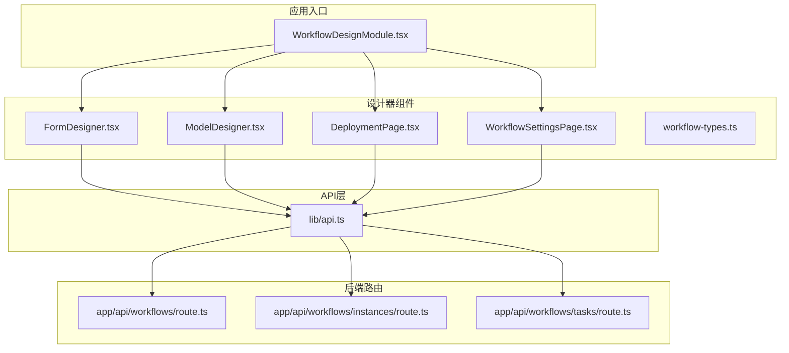
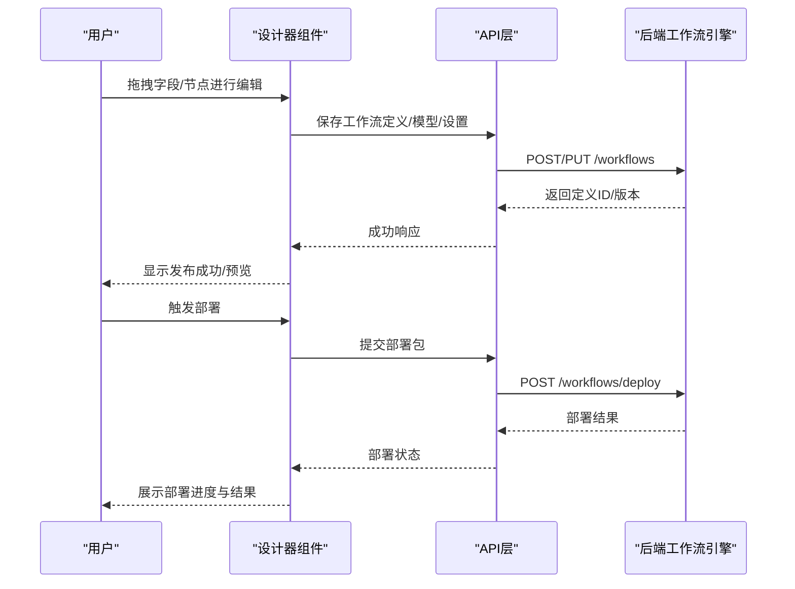
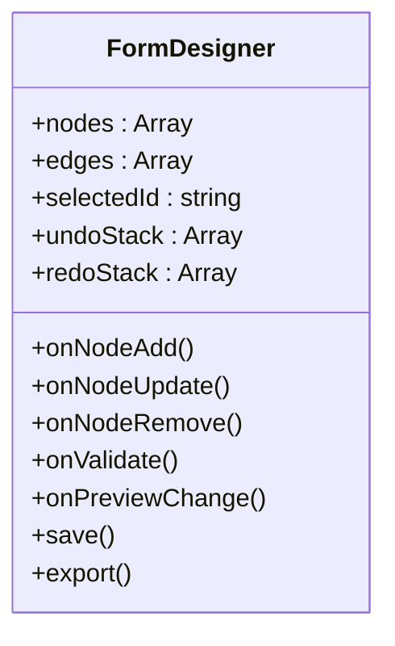
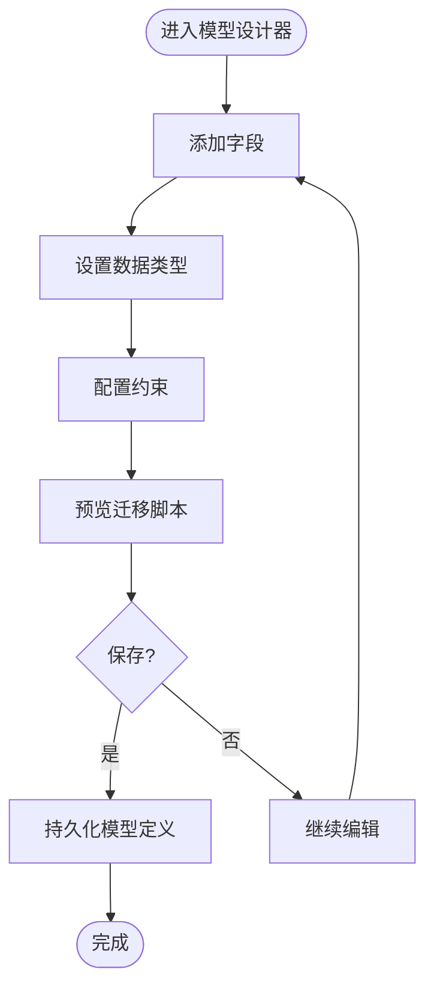
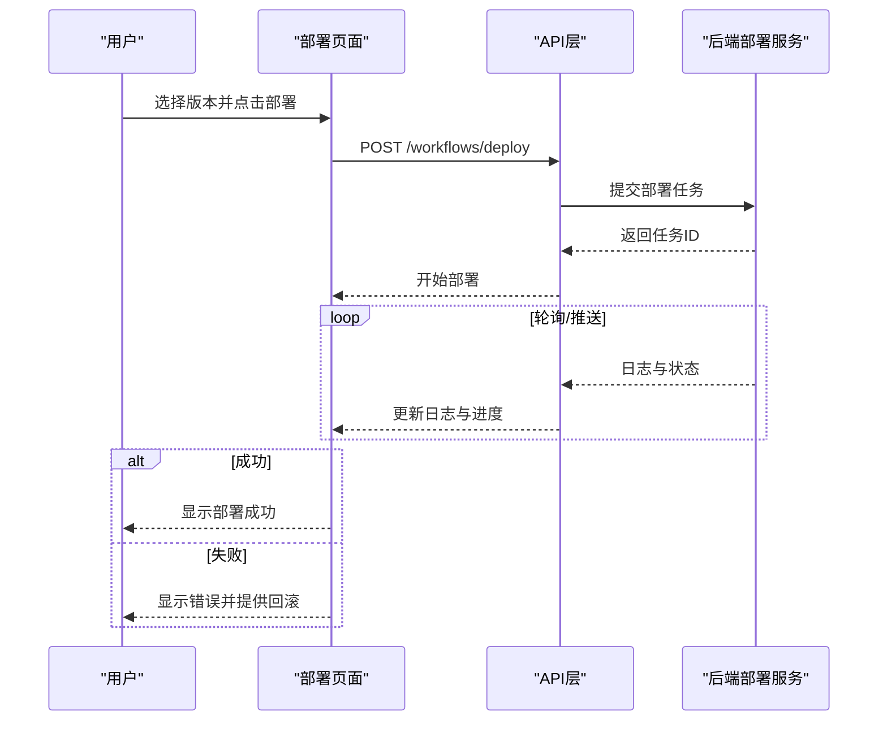
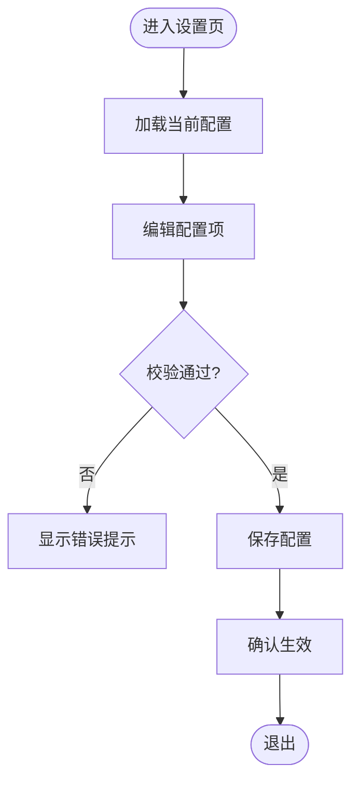
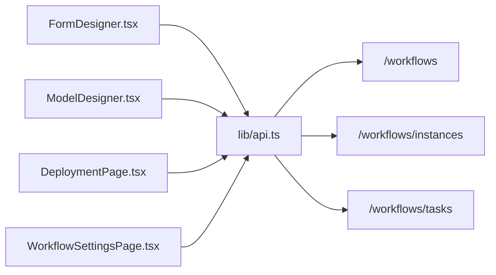

# 工作流组件

<cite>
**本文引用的文件**   
- [WorkflowDesignModule.tsx](file://app/WorkflowDesignModule.tsx)
- [FormDesigner.tsx](file://app/components/workflow/FormDesigner.tsx)
- [ModelDesigner.tsx](file://app/components/workflow/ModelDesigner.tsx)
- [DeploymentPage.tsx](file://app/components/workflow/DeploymentPage.tsx)
- [WorkflowSettingsPage.tsx](file://app/components/workflow/WorkflowSettingsPage.tsx)
- [workflow-types.ts](file://app/components/workflow/workflow-types.ts)
- [api.ts](file://lib/api.ts)
- [route.ts](file://app/api/workflows/route.ts)
- [route.ts](file://app/api/workflows/instances/route.ts)
- [route.ts](file://app/api/workflows/tasks/route.ts)
</cite>

## 目录
1. [简介](#简介)
2. [项目结构](#项目结构)
3. [核心组件](#核心组件)
4. [架构总览](#架构总览)
5. [详细组件分析](#详细组件分析)
6. [依赖关系分析](#依赖关系分析)
7. [性能考虑](#性能考虑)
8. [故障排查指南](#故障排查指南)
9. [结论](#结论)
10. [附录](#附录)

## 简介
本文件面向CS1学生事务管理系统中的“工作流设计器”相关前端组件，系统性说明表单设计器、模型设计器、部署页面与工作流设置页面的视觉外观、拖拽交互与可视化编辑能力；记录关键属性/参数、事件回调与状态管理；提供自定义工作流与表单的设计示例路径；总结组件扩展、插件开发与自定义设计的最佳实践；并阐述与后端工作流引擎的集成方式及数据持久化策略。

## 项目结构
工作流设计器位于应用模块中，以模块化方式组织：
- 入口模块负责路由与容器组装
- 设计器组件（表单/模型）提供可视化编辑能力
- 部署页与工作流设置页提供发布与配置能力
- 类型定义集中管理工作流数据结构
- API层封装与后端工作流服务的通信
- 后端API路由提供工作流定义、实例与任务的CRUD能力

图表来源
- [WorkflowDesignModule.tsx](file://app/WorkflowDesignModule.tsx)
- [FormDesigner.tsx](file://app/components/workflow/FormDesigner.tsx)
- [ModelDesigner.tsx](file://app/components/workflow/ModelDesigner.tsx)
- [DeploymentPage.tsx](file://app/components/workflow/DeploymentPage.tsx)
- [WorkflowSettingsPage.tsx](file://app/components/workflow/WorkflowSettingsPage.tsx)
- [workflow-types.ts](file://app/components/workflow/workflow-types.ts)
- [api.ts](file://lib/api.ts)
- [route.ts](file://app/api/workflows/route.ts)
- [route.ts](file://app/api/workflows/instances/route.ts)
- [route.ts](file://app/api/workflows/tasks/route.ts)

章节来源
- [WorkflowDesignModule.tsx](file://app/WorkflowDesignModule.tsx)
- [workflow-types.ts](file://app/components/workflow/workflow-types.ts)

## 核心组件
- 表单设计器：用于通过拖拽与可视化编辑构建表单结构与字段属性，支持预览与校验规则配置。
- 模型设计器：用于定义工作流数据模型（字段、类型、约束），为表单与流程节点提供数据契约。
- 部署页面：将已设计的工作流与表单打包并发布到运行环境，支持版本管理与回滚。
- 工作流设置页：管理工作流全局配置（如超时、重试、权限、通知等）。

这些组件共同构成“设计—验证—发布—运行”的闭环，确保业务人员可低代码地编排学生事务处理流程。

章节来源
- [FormDesigner.tsx](file://app/components/workflow/FormDesigner.tsx)
- [ModelDesigner.tsx](file://app/components/workflow/ModelDesigner.tsx)
- [DeploymentPage.tsx](file://app/components/workflow/DeploymentPage.tsx)
- [WorkflowSettingsPage.tsx](file://app/components/workflow/WorkflowSettingsPage.tsx)

## 架构总览
工作流设计器采用“前端可视化编辑器 + API服务层 + 后端工作流引擎”的分层架构。前端负责交互与渲染，API层统一封装请求与错误处理，后端提供工作流定义、实例与任务的管理接口。

图表来源
- [FormDesigner.tsx](file://app/components/workflow/FormDesigner.tsx)
- [ModelDesigner.tsx](file://app/components/workflow/ModelDesigner.tsx)
- [DeploymentPage.tsx](file://app/components/workflow/DeploymentPage.tsx)
- [WorkflowSettingsPage.tsx](file://app/components/workflow/WorkflowSettingsPage.tsx)
- [api.ts](file://lib/api.ts)
- [route.ts](file://app/api/workflows/route.ts)
- [route.ts](file://app/api/workflows/instances/route.ts)
- [route.ts](file://app/api/workflows/tasks/route.ts)

## 详细组件分析

### 表单设计器（FormDesigner）
- 视觉外观
  - 左侧组件面板（字段库）
  - 中间画布区域（拖放布局）
  - 右侧属性面板（字段属性、校验、联动）
  - 顶部工具栏（撤销/重做、预览、导出）
- 拖拽交互
  - 从组件面板拖拽至画布生成节点
  - 画布内节点自由移动、对齐、分组
  - 连线连接字段或节点，表达数据流向
- 可视化编辑
  - 选中节点后在属性面板修改标签、占位符、默认值、必填、正则校验、条件显示
  - 实时预览表单渲染效果
  - 支持导入/导出JSON定义
- 属性/参数
  - 字段类型、名称、键名、是否必填、默认值、校验规则、可见性条件、联动表达式
  - 布局选项（栅格、间距、分节）
- 事件回调
  - onNodeAdd/onNodeUpdate/onNodeRemove
  - onValidate/onPreviewChange
  - onSave/onExport
- 状态管理
  - 画布节点集合、连线关系、选中状态、撤销栈、预览态
- 使用示例（路径）
  - 新建表单：[FormDesigner.tsx](file://app/components/workflow/FormDesigner.tsx)
  - 字段属性面板：[FormDesigner.tsx](file://app/components/workflow/FormDesigner.tsx)
  - 校验规则配置：[FormDesigner.tsx](file://app/components/workflow/FormDesigner.tsx)

图表来源
- [FormDesigner.tsx](file://app/components/workflow/FormDesigner.tsx)

章节来源
- [FormDesigner.tsx](file://app/components/workflow/FormDesigner.tsx)

### 模型设计器（ModelDesigner）
- 视觉外观
  - 左侧实体/字段树
  - 中间ER图或表格视图
  - 右侧字段详情（类型、长度、索引、约束）
- 拖拽交互
  - 拖拽新增字段、调整顺序
  - 连线表示关联关系（一对一、一对多）
- 可视化编辑
  - 字段类型切换（字符串、数字、日期、枚举）
  - 约束配置（唯一、非空、默认值、检查表达式）
  - 自动生成迁移脚本预览
- 属性/参数
  - 模型名称、字段名、数据类型、长度、精度、索引、外键、注释
- 事件回调
  - onFieldChange/onRelationChange/onGenerateMigration
  - onSaveSchema
- 状态管理
  - 模型定义、字段集合、关系图、变更历史
- 使用示例（路径）
  - 新建模型：[ModelDesigner.tsx](file://app/components/workflow/ModelDesigner.tsx)
  - 字段约束配置：[ModelDesigner.tsx](file://app/components/workflow/ModelDesigner.tsx)

图表来源
- [ModelDesigner.tsx](file://app/components/workflow/ModelDesigner.tsx)

章节来源
- [ModelDesigner.tsx](file://app/components/workflow/ModelDesigner.tsx)

### 部署页面（DeploymentPage）
- 视觉外观
  - 版本列表与选择器
  - 部署包上传区
  - 部署日志与状态指示
- 交互流程
  - 选择目标版本/环境
  - 上传或选择已构建的部署包
  - 执行部署并观察日志
  - 失败时支持回滚
- 属性/参数
  - 环境标识、版本策略（灰度/全量）、回滚开关、并发限制
- 事件回调
  - onDeploy/onRollback/onLogUpdate
- 状态管理
  - 当前版本、部署任务队列、日志缓冲、错误信息
- 使用示例（路径）
  - 触发部署：[DeploymentPage.tsx](file://app/components/workflow/DeploymentPage.tsx)
  - 查看部署日志：[DeploymentPage.tsx](file://app/components/workflow/DeploymentPage.tsx)

图表来源
- [DeploymentPage.tsx](file://app/components/workflow/DeploymentPage.tsx)
- [api.ts](file://lib/api.ts)
- [route.ts](file://app/api/workflows/route.ts)

章节来源
- [DeploymentPage.tsx](file://app/components/workflow/DeploymentPage.tsx)

### 工作流设置页（WorkflowSettingsPage）
- 视觉外观
  - 设置分组（基础、运行时、通知、权限）
  - 表单式配置项（开关、下拉、输入框）
- 交互逻辑
  - 修改配置即时校验
  - 一键恢复默认
  - 保存后生效提示
- 属性/参数
  - 超时时间、重试次数、最大并行度、通知渠道、角色权限映射
- 事件回调
  - onConfigChange/onSaveDefault/onSave
- 状态管理
  - 当前配置对象、原始快照、校验错误集
- 使用示例（路径）
  - 修改运行时参数：[WorkflowSettingsPage.tsx](file://app/components/workflow/WorkflowSettingsPage.tsx)
  - 保存配置：[WorkflowSettingsPage.tsx](file://app/components/workflow/WorkflowSettingsPage.tsx)

图表来源
- [WorkflowSettingsPage.tsx](file://app/components/workflow/WorkflowSettingsPage.tsx)

章节来源
- [WorkflowSettingsPage.tsx](file://app/components/workflow/WorkflowSettingsPage.tsx)

### 类型与数据模型（workflow-types）
- 作用
  - 统一定义工作流节点、边、表单字段、模型字段、部署任务、设置项等数据结构
- 关键点
  - 强类型约束保障前后端一致性
  - 便于IDE智能提示与静态检查
- 使用建议
  - 新增字段或节点类型时同步更新类型定义
  - 对可选字段提供默认值与校验

章节来源
- [workflow-types.ts](file://app/components/workflow/workflow-types.ts)

## 依赖关系分析
- 组件间耦合
  - 设计器组件共享类型定义，降低耦合
  - 部署页与工作流设置页通过API层与后端解耦
- 外部依赖
  - API层封装HTTP请求、鉴权、错误码转换
  - 后端路由提供REST接口，承载工作流定义、实例与任务管理

图表来源
- [FormDesigner.tsx](file://app/components/workflow/FormDesigner.tsx)
- [ModelDesigner.tsx](file://app/components/workflow/ModelDesigner.tsx)
- [DeploymentPage.tsx](file://app/components/workflow/DeploymentPage.tsx)
- [WorkflowSettingsPage.tsx](file://app/components/workflow/WorkflowSettingsPage.tsx)
- [api.ts](file://lib/api.ts)
- [route.ts](file://app/api/workflows/route.ts)
- [route.ts](file://app/api/workflows/instances/route.ts)
- [route.ts](file://app/api/workflows/tasks/route.ts)

章节来源
- [api.ts](file://lib/api.ts)
- [route.ts](file://app/api/workflows/route.ts)
- [route.ts](file://app/api/workflows/instances/route.ts)
- [route.ts](file://app/api/workflows/tasks/route.ts)

## 性能考虑
- 渲染优化
  - 大画布场景下按需渲染节点，避免全量重绘
  - 使用虚拟滚动或分页加载字段库
- 状态管理
  - 合并频繁的状态更新，减少重渲染
  - 撤销/重做栈采用增量差异存储
- 网络请求
  - 批量保存与防抖提交，避免重复请求
  - 长轮询或WebSocket获取部署日志，降低轮询开销
- 缓存策略
  - 只读配置与模板本地缓存
  - 模型元数据缓存，加速字段选择

## 故障排查指南
- 常见问题
  - 拖拽失效：检查画布容器尺寸与事件冒泡
  - 属性不生效：确认字段键名唯一且类型匹配
  - 部署失败：查看日志定位阶段错误（校验、打包、发布）
  - 设置未生效：确认保存成功后刷新或重新加载配置
- 调试建议
  - 打开浏览器控制台查看网络请求与错误堆栈
  - 使用类型检查与单元测试覆盖关键路径
  - 在后端路由打印入参与出参，核对数据结构

章节来源
- [DeploymentPage.tsx](file://app/components/workflow/DeploymentPage.tsx)
- [WorkflowSettingsPage.tsx](file://app/components/workflow/WorkflowSettingsPage.tsx)

## 结论
工作流设计器组件通过可视化的表单与模型设计、统一的部署与设置管理，显著降低了学生事务流程编排的门槛。借助强类型定义与清晰的API边界，系统具备良好的可扩展性与维护性。建议在后续迭代中持续完善校验规则、联动表达式与插件生态，以提升业务适配能力与开发效率。

## 附录
- 自定义工作流设计示例（路径）
  - 新建工作流节点与连线：[FormDesigner.tsx](file://app/components/workflow/FormDesigner.tsx)
  - 定义数据模型与约束：[ModelDesigner.tsx](file://app/components/workflow/ModelDesigner.tsx)
  - 发布与回滚流程：[DeploymentPage.tsx](file://app/components/workflow/DeploymentPage.tsx)
  - 配置运行时参数：[WorkflowSettingsPage.tsx](file://app/components/workflow/WorkflowSettingsPage.tsx)
- 组件扩展与插件开发最佳实践
  - 基于类型定义扩展字段类型与节点类型
  - 通过事件回调注入自定义逻辑（校验、联动、导出）
  - 保持UI与逻辑分离，便于主题与样式定制
- 与后端集成与数据持久化策略
  - 工作流定义持久化：通过/workflows接口保存与版本管理
  - 实例与任务管理：通过/instances与/tasks接口跟踪运行状态
  - 部署产物与配置：通过部署接口与设置接口统一管理