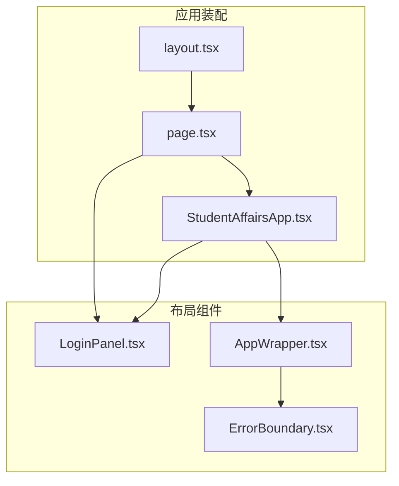
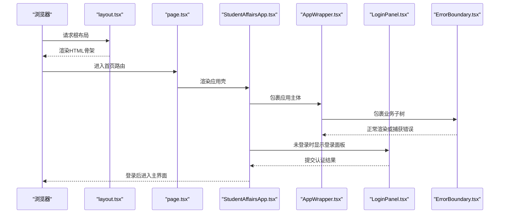
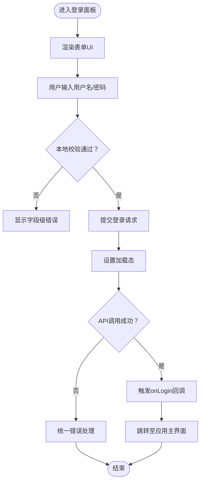
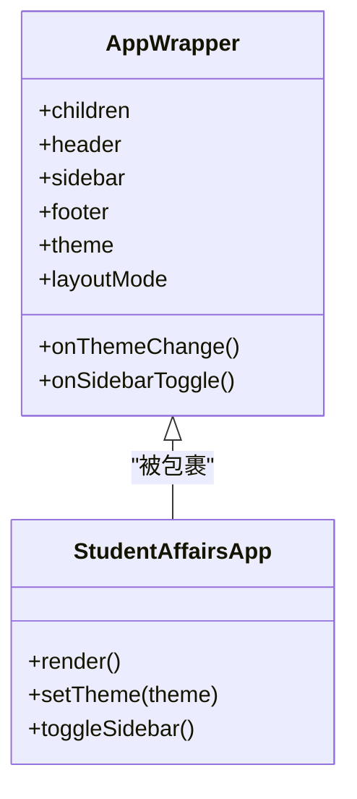
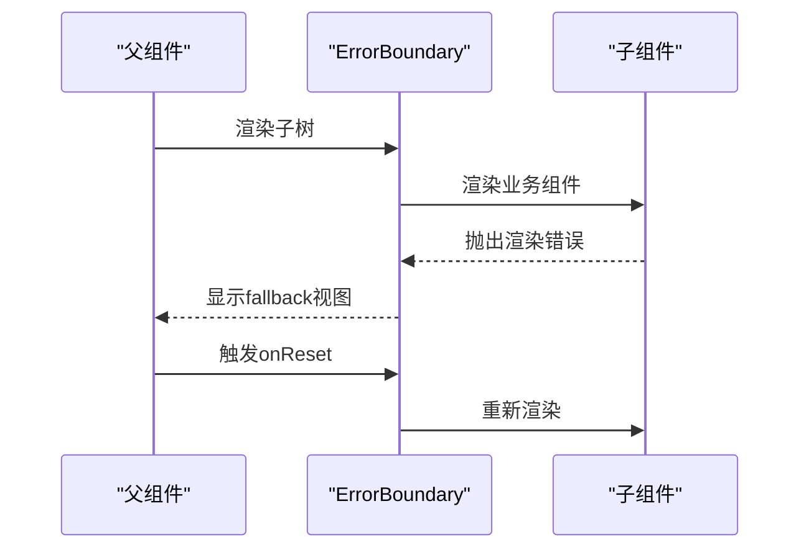
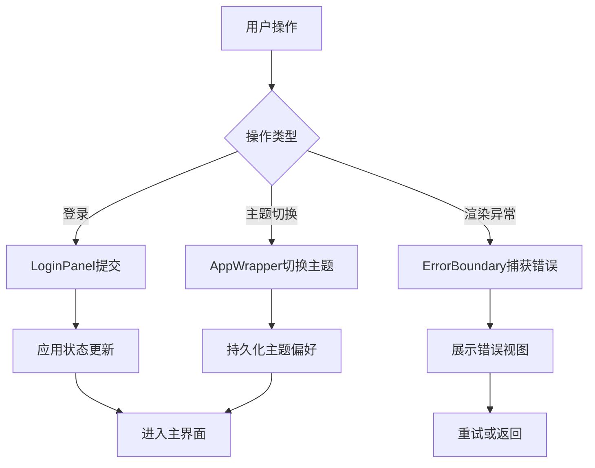
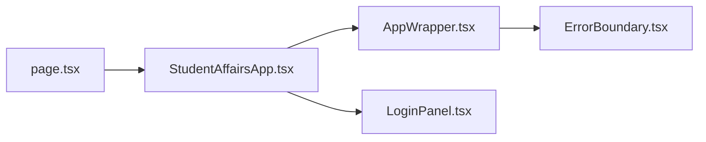

# 布局组件

<cite>
**本文引用的文件**   
- [LoginPanel.tsx](file://app/components/LoginPanel.tsx)
- [AppWrapper.tsx](file://app/components/AppWrapper.tsx)
- [ErrorBoundary.tsx](file://app/components/ErrorBoundary.tsx)
- [layout.tsx](file://app/layout.tsx)
- [page.tsx](file://app/page.tsx)
- [StudentAffairsApp.tsx](file://app/StudentAffairsApp.tsx)
- [globals.css](file://app/globals.css)
</cite>

## 目录
1. [简介](#简介)
2. [项目结构](#项目结构)
3. [核心组件](#核心组件)
4. [架构总览](#架构总览)
5. [详细组件分析](#详细组件分析)
6. [依赖分析](#依赖分析)
7. [性能考虑](#性能考虑)
8. [故障排查指南](#故障排查指南)
9. [结论](#结论)
10. [附录](#附录)

## 简介
本章节面向CS1学生事务管理系统的布局层，聚焦三大布局组件：登录面板、应用包装器与错误边界。文档从视觉外观、布局与交互行为出发，系统梳理属性/参数、事件与配置项，并给出响应式布局、主题适配、错误处理的最佳实践，以及可访问性与SEO优化建议。读者无需深入源码即可理解如何正确集成与扩展这些布局组件。

## 项目结构
布局相关代码集中在 app/components 目录下，并通过 Next.js 的根布局与页面入口进行装配。关键路径如下：
- 布局组件：app/components/LoginPanel.tsx、app/components/AppWrapper.tsx、app/components/ErrorBoundary.tsx
- 应用装配：app/layout.tsx（根布局）、app/page.tsx（首页路由）
- 应用壳：app/StudentAffairsApp.tsx（业务外壳）
- 全局样式：app/globals.css（主题与响应式基础）

图表来源
- [layout.tsx](file://app/layout.tsx)
- [page.tsx](file://app/page.tsx)
- [StudentAffairsApp.tsx](file://app/StudentAffairsApp.tsx)
- [LoginPanel.tsx](file://app/components/LoginPanel.tsx)
- [AppWrapper.tsx](file://app/components/AppWrapper.tsx)
- [ErrorBoundary.tsx](file://app/components/ErrorBoundary.tsx)

章节来源
- [layout.tsx](file://app/layout.tsx)
- [page.tsx](file://app/page.tsx)
- [StudentAffairsApp.tsx](file://app/StudentAffairsApp.tsx)
- [LoginPanel.tsx](file://app/components/LoginPanel.tsx)
- [AppWrapper.tsx](file://app/components/AppWrapper.tsx)
- [ErrorBoundary.tsx](file://app/components/ErrorBoundary.tsx)

## 核心组件
本节概述三个布局组件的职责与协作关系：
- 登录面板（LoginPanel）：提供用户身份验证入口，包含表单输入、校验提示、加载状态与错误提示；支持键盘导航与屏幕阅读器语义。
- 应用包装器（AppWrapper）：作为应用主容器，承载头部、侧边栏、内容区与页脚等区域，负责响应式布局与主题切换。
- 错误边界（ErrorBoundary）：捕获子树渲染期错误，展示友好错误界面并提供重试或返回入口，避免整页崩溃。

章节来源
- [LoginPanel.tsx](file://app/components/LoginPanel.tsx)
- [AppWrapper.tsx](file://app/components/AppWrapper.tsx)
- [ErrorBoundary.tsx](file://app/components/ErrorBoundary.tsx)

## 架构总览
下图展示了从根布局到页面再到应用壳与布局组件的整体装配流程，以及错误边界在渲染链中的位置。

图表来源
- [layout.tsx](file://app/layout.tsx)
- [page.tsx](file://app/page.tsx)
- [StudentAffairsApp.tsx](file://app/StudentAffairsApp.tsx)
- [AppWrapper.tsx](file://app/components/AppWrapper.tsx)
- [LoginPanel.tsx](file://app/components/LoginPanel.tsx)
- [ErrorBoundary.tsx](file://app/components/ErrorBoundary.tsx)

## 详细组件分析

### 登录面板（LoginPanel）
- 视觉外观与布局
  - 居中卡片式布局，标题、说明文案、用户名与密码输入框、登录按钮、辅助链接（如忘记密码）。
  - 移动端优先，宽度自适应，内边距随断点变化。
- 交互行为
  - 表单校验：必填、格式校验，实时反馈与提交前二次校验。
  - 加载态：提交时禁用按钮并显示加载指示。
  - 错误处理：网络异常或认证失败时展示友好提示。
  - 键盘可达性：Tab顺序合理，Enter提交，Esc取消。
- 属性/参数（示例）
  - onLogin：登录成功回调，接收凭证对象。
  - onError：统一错误回调，接收错误信息。
  - loading：控制加载态。
  - initialValues：初始值填充（可选）。
  - layout：布局模式（如“居中”、“分栏”）。
  - theme：主题键（如“默认”、“深色”）。
- 事件
  - onSubmit：表单提交事件。
  - onFieldChange：字段变更事件（用于联动校验）。
- 配置选项
  - 是否显示记住我、是否启用自动填充、是否允许空密码提交提示。
- 使用示例（路径引用）
  - 在页面中引入并传入 onLogin、onError、loading 等属性以完成集成。
  - 参考路径：[LoginPanel.tsx](file://app/components/LoginPanel.tsx)、[page.tsx](file://app/page.tsx)、[StudentAffairsApp.tsx](file://app/StudentAffairsApp.tsx)

图表来源
- [LoginPanel.tsx](file://app/components/LoginPanel.tsx)

章节来源
- [LoginPanel.tsx](file://app/components/LoginPanel.tsx)
- [page.tsx](file://app/page.tsx)
- [StudentAffairsApp.tsx](file://app/StudentAffairsApp.tsx)

### 应用包装器（AppWrapper）
- 视觉外观与布局
  - 典型后台布局：顶部导航、左侧菜单、主内容区、底部版权信息。
  - 响应式：小屏隐藏侧边栏并提供抽屉式菜单；内容区自适应宽度。
  - 主题：支持明暗主题切换，颜色变量集中管理。
- 交互行为
  - 侧边栏折叠/展开，当前路由高亮。
  - 主题切换持久化（本地存储）。
  - 内容区滚动与分页联动。
- 属性/参数（示例）
  - children：子节点（业务页面）。
  - header：自定义头部组件。
  - sidebar：自定义侧边栏组件。
  - footer：自定义页脚组件。
  - theme：主题键。
  - layoutMode：布局模式（如“经典”、“紧凑”）。
- 事件
  - onThemeChange：主题切换回调。
  - onSidebarToggle：侧边栏开关回调。
- 配置选项
  - 是否固定头部、是否显示面包屑、是否启用水印。
- 使用示例（路径引用）
  - 在应用壳中包裹业务模块，传入主题与布局模式。
  - 参考路径：[AppWrapper.tsx](file://app/components/AppWrapper.tsx)、[StudentAffairsApp.tsx](file://app/StudentAffairsApp.tsx)

图表来源
- [AppWrapper.tsx](file://app/components/AppWrapper.tsx)
- [StudentAffairsApp.tsx](file://app/StudentAffairsApp.tsx)

章节来源
- [AppWrapper.tsx](file://app/components/AppWrapper.tsx)
- [StudentAffairsApp.tsx](file://app/StudentAffairsApp.tsx)

### 错误边界（ErrorBoundary）
- 视觉外观与布局
  - 全屏或局部占位错误视图，包含错误消息、堆栈摘要（开发环境）、重试按钮与返回入口。
- 交互行为
  - 捕获子树渲染期错误，阻止错误冒泡导致整页崩溃。
  - 提供重试机制，必要时重置状态。
- 属性/参数（示例）
  - fallback：自定义错误视图组件。
  - onReset：重置回调。
  - logLevel：日志级别（如“error”、“warn”）。
- 事件
  - componentDidCatch：捕获错误后触发。
  - onReset：用户点击重试或返回时触发。
- 配置选项
  - 是否记录错误上报、是否显示开发者堆栈。
- 使用示例（路径引用）
  - 在应用壳或页面层级包裹需要保护的业务模块。
  - 参考路径：[ErrorBoundary.tsx](file://app/components/ErrorBoundary.tsx)、[StudentAffairsApp.tsx](file://app/StudentAffairsApp.tsx)

图表来源
- [ErrorBoundary.tsx](file://app/components/ErrorBoundary.tsx)

章节来源
- [ErrorBoundary.tsx](file://app/components/ErrorBoundary.tsx)
- [StudentAffairsApp.tsx](file://app/StudentAffairsApp.tsx)

### 概念总览
以下流程图概括了登录、主题切换与错误处理的通用工作流，便于跨组件理解。

[本图为概念性流程图，不直接映射具体源码文件]

## 依赖分析
布局组件之间的依赖关系清晰，遵循单向数据流与职责分离原则：
- page.tsx 与 StudentAffairsApp.tsx 负责装配布局与业务壳。
- AppWrapper 包裹业务子树，ErrorBoundary 进一步保护渲染稳定性。
- LoginPanel 独立于业务逻辑，仅通过回调与上层通信。

图表来源
- [page.tsx](file://app/page.tsx)
- [StudentAffairsApp.tsx](file://app/StudentAffairsApp.tsx)
- [AppWrapper.tsx](file://app/components/AppWrapper.tsx)
- [ErrorBoundary.tsx](file://app/components/ErrorBoundary.tsx)
- [LoginPanel.tsx](file://app/components/LoginPanel.tsx)

章节来源
- [page.tsx](file://app/page.tsx)
- [StudentAffairsApp.tsx](file://app/StudentAffairsApp.tsx)
- [AppWrapper.tsx](file://app/components/AppWrapper.tsx)
- [ErrorBoundary.tsx](file://app/components/ErrorBoundary.tsx)
- [LoginPanel.tsx](file://app/components/LoginPanel.tsx)

## 性能考虑
- 减少重排与重绘：在 AppWrapper 中使用 CSS 变量与 GPU 加速动画，避免频繁修改布局尺寸。
- 懒加载与代码分割：将非首屏模块按需加载，提升首屏性能。
- 表单优化：对 LoginPanel 的输入做防抖与增量校验，降低无效提交。
- 错误边界最小化影响：仅在必要层级包裹易错子树，避免过度捕获。

[本节为通用指导，不直接分析具体文件]

## 故障排查指南
- 登录失败
  - 检查网络请求与后端接口状态码。
  - 查看 onLogin 与 onError 回调的参数是否正确传递。
  - 确认表单校验规则与后端约束一致。
- 主题不生效
  - 检查 theme 键是否与样式变量匹配。
  - 确认本地存储读取与写入逻辑正常。
- 错误边界未捕获
  - 确认错误发生在受保护的子树内。
  - 检查 fallback 组件是否正确渲染。
  - 查看控制台与日志级别设置。

章节来源
- [LoginPanel.tsx](file://app/components/LoginPanel.tsx)
- [AppWrapper.tsx](file://app/components/AppWrapper.tsx)
- [ErrorBoundary.tsx](file://app/components/ErrorBoundary.tsx)

## 结论
登录面板、应用包装器与错误边界共同构成了CS1学生事务管理系统稳定、易用且可扩展的布局层。通过清晰的属性/参数设计、完善的交互与错误处理、响应式与主题适配能力，以及可访问性与SEO优化策略，团队可以快速构建高质量的用户界面并保持长期可维护性。

[本节为总结性内容，不直接分析具体文件]

## 附录

### 响应式布局最佳实践
- 采用移动优先的CSS策略，在小屏上优先保证核心功能可用。
- 使用栅格系统与弹性布局，确保在不同屏幕尺寸下内容可读性。
- 侧边栏在小屏下切换为抽屉式，避免遮挡主内容。

[本节为通用指导，不直接分析具体文件]

### 主题适配最佳实践
- 集中管理颜色与字体变量，通过 CSS 变量实现一键换肤。
- 提供明暗主题切换，并持久化用户偏好。
- 确保对比度符合无障碍标准。

[本节为通用指导，不直接分析具体文件]

### 错误处理最佳实践
- 在关键路径使用错误边界保护渲染。
- 对用户可见的错误提供明确信息与可操作指引。
- 区分开发环境与生产环境的错误展示与日志记录。

[本节为通用指导，不直接分析具体文件]

### 可访问性支持
- 为表单元素提供正确的标签与描述。
- 确保键盘可达性与焦点管理。
- 使用语义化HTML与ARIA属性增强屏幕阅读器体验。

[本节为通用指导，不直接分析具体文件]

### SEO优化建议
- 在布局层提供必要的元数据与结构化数据。
- 确保首屏内容可被搜索引擎抓取。
- 合理使用标题层级与链接文本。

[本节为通用指导，不直接分析具体文件]