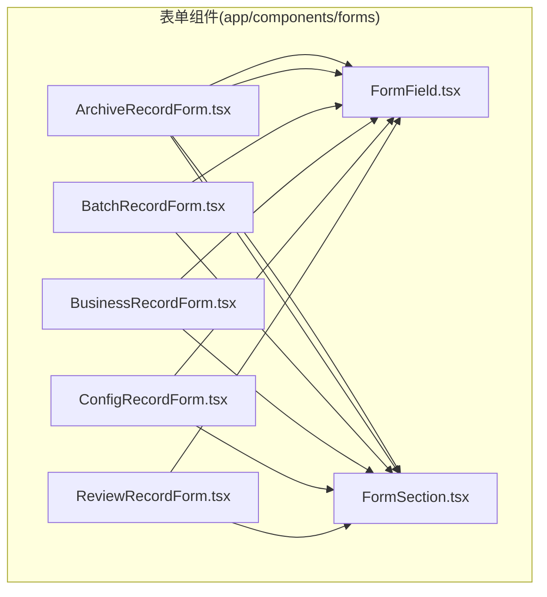
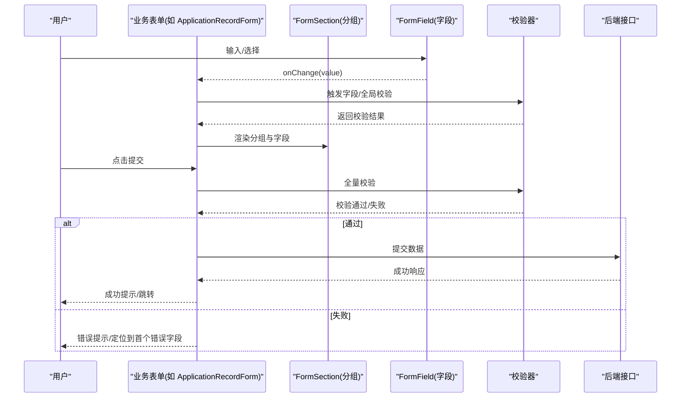
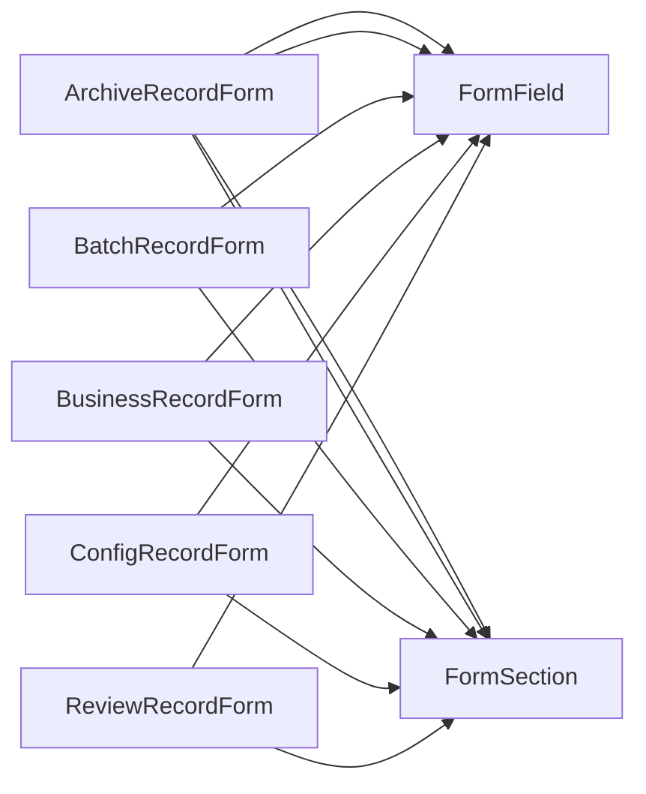

# 表单组件

<cite>
**本文引用的文件**   
- [ApplicationRecordForm.tsx](file://app/components/forms/ApplicationRecordForm.tsx)
- [ArchiveRecordForm.tsx](file://app/components/forms/ArchiveRecordForm.tsx)
- [BatchRecordForm.tsx](file://app/components/forms/BatchRecordForm.tsx)
- [BusinessRecordForm.tsx](file://app/components/forms/BusinessRecordForm.tsx)
- [ConfigRecordForm.tsx](file://app/components/forms/ConfigRecordForm.tsx)
- [ReviewRecordForm.tsx](file://app/components/forms/ReviewRecordForm.tsx)
- [FormField.tsx](file://app/components/forms/FormField.tsx)
- [FormSection.tsx](file://app/components/forms/FormSection.tsx)
</cite>

## 目录
1. [简介](#简介)
2. [项目结构](#项目结构)
3. [核心组件](#核心组件)
4. [架构总览](#架构总览)
5. [详细组件分析](#详细组件分析)
6. [依赖关系分析](#依赖关系分析)
7. [性能考量](#性能考量)
8. [故障排查指南](#故障排查指南)
9. [结论](#结论)
10. [附录](#附录)

## 简介
本文件面向CS1学生事务管理系统的表单子系统，聚焦以下六类业务表单：应用记录、归档记录、批量记录、业务记录、配置记录、审核记录。文档从视觉外观、交互行为、字段与分组属性/参数、事件与插槽、自定义选项等维度进行系统化说明，并提供构建复杂业务表单的实践建议、验证与错误处理策略、响应式设计与可访问性合规要点，帮助开发者快速落地高质量表单。

## 项目结构
表单相关代码位于 app/components/forms 目录，采用“按功能域拆分”的组织方式：每个业务表单一个独立组件；通用能力由 FormField（字段）与 FormSection（分组）抽象封装，便于复用与组合。

图表来源
- [ApplicationRecordForm.tsx](file://app/components/forms/ApplicationRecordForm.tsx)
- [ArchiveRecordForm.tsx](file://app/components/forms/ArchiveRecordForm.tsx)
- [BatchRecordForm.tsx](file://app/components/forms/BatchRecordForm.tsx)
- [BusinessRecordForm.tsx](file://app/components/forms/BusinessRecordForm.tsx)
- [ConfigRecordForm.tsx](file://app/components/forms/ConfigRecordForm.tsx)
- [ReviewRecordForm.tsx](file://app/components/forms/ReviewRecordForm.tsx)
- [FormField.tsx](file://app/components/forms/FormField.tsx)
- [FormSection.tsx](file://app/components/forms/FormSection.tsx)

章节来源
- [ApplicationRecordForm.tsx](file://app/components/forms/ApplicationRecordForm.tsx)
- [ArchiveRecordForm.tsx](file://app/components/forms/ArchiveRecordForm.tsx)
- [BatchRecordForm.tsx](file://app/components/forms/BatchRecordForm.tsx)
- [BusinessRecordForm.tsx](file://app/components/forms/BusinessRecordForm.tsx)
- [ConfigRecordForm.tsx](file://app/components/forms/ConfigRecordForm.tsx)
- [ReviewRecordForm.tsx](file://app/components/forms/ReviewRecordForm.tsx)
- [FormField.tsx](file://app/components/forms/FormField.tsx)
- [FormSection.tsx](file://app/components/forms/FormSection.tsx)

## 核心组件
- 字段组件 FormField
  - 职责：渲染单一输入控件（文本、数字、选择、日期、开关、富文本等），统一处理标签、占位符、提示、校验、错误展示、禁用/只读状态、尺寸与布局。
  - 关键属性/参数：字段名、类型、默认值、是否必填、校验规则、提示信息、错误信息、禁用/只读、尺寸、布局对齐、样式覆盖、事件回调（如 onChange、onBlur、onFocus）。
  - 事件：值变更、失焦校验、提交前校验、自定义校验回调。
  - 插槽：支持在输入前后插入辅助元素（如图标、按钮、说明文案）。
  - 自定义选项：主题色、边框风格、圆角、阴影、间距、响应式断点适配。
- 分组组件 FormSection
  - 职责：将多个字段按业务模块分组，提供标题、描述、折叠/展开、条件显示、内边距与分隔线等。
  - 关键属性/参数：分组标题、描述、是否折叠、默认展开、条件渲染、布局（栅格/列数）、样式覆盖。
  - 事件：折叠/展开切换、条件变化回调。
  - 插槽：支持在分组头部或底部插入操作区（如保存/重置按钮、帮助链接）。

章节来源
- [FormField.tsx](file://app/components/forms/FormField.tsx)
- [FormSection.tsx](file://app/components/forms/FormSection.tsx)

## 架构总览
表单子系统以“字段 + 分组”为原子单元，各业务表单通过组合这些单元完成页面级表单。数据流遵循“受控组件”模式：父组件持有表单状态，字段通过 props 接收值与变更回调，提交时聚合校验并触发业务逻辑。

图表来源
- [ApplicationRecordForm.tsx](file://app/components/forms/ApplicationRecordForm.tsx)
- [FormField.tsx](file://app/components/forms/FormField.tsx)
- [FormSection.tsx](file://app/components/forms/FormSection.tsx)

## 详细组件分析

### 应用记录表单(ApplicationRecordForm)
- 视觉外观：典型申请类表单，包含申请人基本信息、申请事项、附件上传、备注等区域，使用分组区分不同业务块。
- 行为与交互：
  - 动态显示：根据申请类型切换字段集与校验规则。
  - 实时校验：失焦与提交时双重校验，错误即时反馈。
  - 附件上传：支持拖拽、预览、删除与大小限制。
- 字段与分组：
  - 分组：基本信息、申请详情、附件材料、补充说明。
  - 字段：姓名、学号、学院、专业、申请类型、时间范围、附件列表、备注等。
- 事件与插槽：
  - 事件：onChange、onValidate、onSubmit、onUploadProgress。
  - 插槽：分组头部操作区（如“一键填充”）、字段右侧快捷操作。
- 示例用法（路径引用）：
  - 构建基础申请表单：[ApplicationRecordForm.tsx](file://app/components/forms/ApplicationRecordForm.tsx)
  - 组合字段与分组：[FormField.tsx](file://app/components/forms/FormField.tsx), [FormSection.tsx](file://app/components/forms/FormSection.tsx)

章节来源
- [ApplicationRecordForm.tsx](file://app/components/forms/ApplicationRecordForm.tsx)
- [FormField.tsx](file://app/components/forms/FormField.tsx)
- [FormSection.tsx](file://app/components/forms/FormSection.tsx)

### 归档记录表单(ArchiveRecordForm)
- 视觉外观：归档类表单强调结构化与检索友好，常用表格化布局与筛选面板。
- 行为与交互：
  - 批量选择：支持全选、反选、按条件筛选后批量归档。
  - 版本控制：归档后可查看历史版本与差异对比。
- 字段与分组：
  - 分组：归档元数据、内容摘要、关联文档、归档说明。
  - 字段：归档编号、分类、关键词、密级、有效期、关联ID集合等。
- 事件与插槽：
  - 事件：onBatchSelect、onArchive、onVersionSwitch。
  - 插槽：筛选栏、工具栏、分页器。
- 示例用法（路径引用）：
  - 归档流程入口与字段编排：[ArchiveRecordForm.tsx](file://app/components/forms/ArchiveRecordForm.tsx)

章节来源
- [ArchiveRecordForm.tsx](file://app/components/forms/ArchiveRecordForm.tsx)
- [FormField.tsx](file://app/components/forms/FormField.tsx)
- [FormSection.tsx](file://app/components/forms/FormSection.tsx)

### 批量记录表单(BatchRecordForm)
- 视觉外观：以导入/导出为核心，提供模板下载、CSV/Excel上传、进度条与错误行高亮。
- 行为与交互：
  - 模板校验：上传前解析并校验表头与数据类型。
  - 增量更新：支持合并策略与冲突解决。
- 字段与分组：
  - 分组：导入设置、数据预览、错误报告、执行日志。
  - 字段：文件、编码、分隔符、映射规则、冲突策略、重试次数等。
- 事件与插槽：
  - 事件：onParse、onPreview、onImport、onErrorRow。
  - 插槽：预览表格、错误行详情、操作按钮组。
- 示例用法（路径引用）：
  - 批量导入与校验：[BatchRecordForm.tsx](file://app/components/forms/BatchRecordForm.tsx)

章节来源
- [BatchRecordForm.tsx](file://app/components/forms/BatchRecordForm.tsx)
- [FormField.tsx](file://app/components/forms/FormField.tsx)
- [FormSection.tsx](file://app/components/forms/FormSection.tsx)

### 业务记录表单(BusinessRecordForm)
- 视觉外观：通用业务记录，强调灵活扩展与多步骤引导。
- 行为与交互：
  - 多步骤：分步向导，支持前进/后退与草稿保存。
  - 联动计算：字段间依赖与自动计算。
- 字段与分组：
  - 分组：基础信息、业务参数、审批意见、附件材料。
  - 字段：名称、类型、数值、区间、枚举、公式表达式等。
- 事件与插槽：
  - 事件：onStepChange、onCalculate、onDraftSave。
  - 插槽：步骤导航、计算结果展示、帮助提示。
- 示例用法（路径引用）：
  - 多步骤与联动：[BusinessRecordForm.tsx](file://app/components/forms/BusinessRecordForm.tsx)

章节来源
- [BusinessRecordForm.tsx](file://app/components/forms/BusinessRecordForm.tsx)
- [FormField.tsx](file://app/components/forms/FormField.tsx)
- [FormSection.tsx](file://app/components/forms/FormSection.tsx)

### 配置记录表单(ConfigRecordForm)
- 视觉外观：配置项密集，常以键值对、开关、下拉、滑块等形式呈现。
- 行为与交互：
  - 热更新：部分配置支持即时生效与回滚。
  - 权限控制：敏感配置需二次确认或管理员权限。
- 字段与分组：
  - 分组：系统配置、业务开关、阈值设置、高级选项。
  - 字段：键名、值类型、默认值、取值范围、是否可见、是否可编辑等。
- 事件与插槽：
  - 事件：onApply、onRollback、onPermissionCheck。
  - 插槽：配置说明、风险提示、操作确认。
- 示例用法（路径引用）：
  - 配置管理与权限校验：[ConfigRecordForm.tsx](file://app/components/forms/ConfigRecordForm.tsx)

章节来源
- [ConfigRecordForm.tsx](file://app/components/forms/ConfigRecordForm.tsx)
- [FormField.tsx](file://app/components/forms/FormField.tsx)
- [FormSection.tsx](file://app/components/forms/FormSection.tsx)

### 审核记录表单(ReviewRecordForm)
- 视觉外观：审核流程导向，突出审批意见、流转记录与证据材料。
- 行为与交互：
  - 工作流集成：与任务/实例联动，支持转交、加签、驳回。
  - 审计追踪：记录操作人、时间与原因。
- 字段与分组：
  - 分组：审核信息、流转历史、附件证据、审核意见。
  - 字段：审核结果、意见、依据、附件、备注、下一步动作等。
- 事件与插槽：
  - 事件：onApprove、onReject、onTransfer、onAttach。
  - 插槽：时间线、操作按钮、证据预览。
- 示例用法（路径引用）：
  - 审核流程与审计：[ReviewRecordForm.tsx](file://app/components/forms/ReviewRecordForm.tsx)

章节来源
- [ReviewRecordForm.tsx](file://app/components/forms/ReviewRecordForm.tsx)
- [FormField.tsx](file://app/components/forms/FormField.tsx)
- [FormSection.tsx](file://app/components/forms/FormSection.tsx)

### 字段与分组通用能力
- 字段组件(FormField)
  - 属性/参数：name、type、defaultValue、required、rules、placeholder、help、disabled、readOnly、size、layout、style、events。
  - 事件：onChange、onBlur、onFocus、onValidate、onCustomAction。
  - 插槽：prefix、suffix、addonBefore、addonAfter、labelSlot、helpSlot。
  - 自定义选项：theme、variant、borderStyle、radius、shadow、spacing、responsiveBreakpoints。
- 分组组件(FormSection)
  - 属性/参数：title、description、collapsible、defaultExpanded、condition、grid、padding、divider、style。
  - 事件：onToggle、onConditionChange。
  - 插槽：headerActions、footerActions、customHeader、customFooter。

章节来源
- [FormField.tsx](file://app/components/forms/FormField.tsx)
- [FormSection.tsx](file://app/components/forms/FormSection.tsx)

## 依赖关系分析
- 组件耦合
  - 业务表单强依赖 FormField 与 FormSection，二者解耦了具体输入与分组渲染，提升复用性。
  - 各业务表单之间无直接依赖，保持高内聚低耦合。
- 外部依赖
  - 校验逻辑可由内部规则引擎或第三方库实现，建议在 FormField 中统一接入。
  - 上传与预览依赖前端存储与网络层，应在业务表单中隔离处理。
- 潜在循环依赖
  - 当前结构未见循环引用风险，若引入跨表单通信，建议使用事件总线或状态管理。

图表来源
- [ApplicationRecordForm.tsx](file://app/components/forms/ApplicationRecordForm.tsx)
- [ArchiveRecordForm.tsx](file://app/components/forms/ArchiveRecordForm.tsx)
- [BatchRecordForm.tsx](file://app/components/forms/BatchRecordForm.tsx)
- [BusinessRecordForm.tsx](file://app/components/forms/BusinessRecordForm.tsx)
- [ConfigRecordForm.tsx](file://app/components/forms/ConfigRecordForm.tsx)
- [ReviewRecordForm.tsx](file://app/components/forms/ReviewRecordForm.tsx)
- [FormField.tsx](file://app/components/forms/FormField.tsx)
- [FormSection.tsx](file://app/components/forms/FormSection.tsx)

章节来源
- [ApplicationRecordForm.tsx](file://app/components/forms/ApplicationRecordForm.tsx)
- [ArchiveRecordForm.tsx](file://app/components/forms/ArchiveRecordForm.tsx)
- [BatchRecordForm.tsx](file://app/components/forms/BatchRecordForm.tsx)
- [BusinessRecordForm.tsx](file://app/components/forms/BusinessRecordForm.tsx)
- [ConfigRecordForm.tsx](file://app/components/forms/ConfigRecordForm.tsx)
- [ReviewRecordForm.tsx](file://app/components/forms/ReviewRecordForm.tsx)
- [FormField.tsx](file://app/components/forms/FormField.tsx)
- [FormSection.tsx](file://app/components/forms/FormSection.tsx)

## 性能考量
- 渲染优化
  - 大表单分页或分步加载，避免一次性渲染过多节点。
  - 使用虚拟滚动处理长列表预览（如批量导入预览）。
- 校验优化
  - 防抖与节流：输入防抖减少频繁校验。
  - 增量校验：仅校验变更字段，必要时再全量校验。
- 网络与IO
  - 上传分片与并发控制，失败重试与断点续传。
  - 缓存模板与字典数据，减少重复请求。
- 内存与资源
  - 及时释放大对象（如图片预览URL）。
  - 懒加载重型组件（如富文本编辑器）。

## 故障排查指南
- 常见错误
  - 字段未绑定 name：导致值无法同步，检查 FormField 的 name 属性。
  - 校验规则缺失或类型不匹配：确保 rules 与 type 一致，并在 onValidate 中打印中间结果。
  - 上传失败：检查文件大小、MIME类型与服务器限制，查看 onUploadProgress 与 onError 回调。
  - 分组条件不生效：确认 condition 表达式与依赖字段变更事件。
- 调试建议
  - 在 FormField 的 onChange/onBlur 添加日志输出。
  - 使用浏览器开发者工具的 Network 面板跟踪接口调用。
  - 对复杂表单启用“草稿模式”，逐步定位问题。
- 恢复策略
  - 提供“重置表单”与“撤销上一步”能力。
  - 对关键操作增加二次确认与回滚机制。

章节来源
- [FormField.tsx](file://app/components/forms/FormField.tsx)
- [FormSection.tsx](file://app/components/forms/FormSection.tsx)
- [ApplicationRecordForm.tsx](file://app/components/forms/ApplicationRecordForm.tsx)
- [ArchiveRecordForm.tsx](file://app/components/forms/ArchiveRecordForm.tsx)
- [BatchRecordForm.tsx](file://app/components/forms/BatchRecordForm.tsx)
- [BusinessRecordForm.tsx](file://app/components/forms/BusinessRecordForm.tsx)
- [ConfigRecordForm.tsx](file://app/components/forms/ConfigRecordForm.tsx)
- [ReviewRecordForm.tsx](file://app/components/forms/ReviewRecordForm.tsx)

## 结论
本表单子系统以 FormField 与 FormSection 为核心，通过组合模式快速构建多样化业务表单。统一的字段与分组能力、完善的校验与事件体系、以及良好的响应式与可访问性设计，使得 CS1 学生事务管理系统中的各类表单具备高可用性与可扩展性。建议在实际项目中结合业务场景选择合适的表单形态，并遵循本文档的最佳实践以提升用户体验与开发效率。

## 附录
- 响应式设计建议
  - 移动端优先：单列布局、触摸友好的输入控件、简化操作步骤。
  - 断点适配：在小屏隐藏次要字段，在大屏展示完整信息。
- 可访问性合规
  - 语义化标签：正确使用 label、aria-*、role。
  - 键盘导航：Tab 顺序合理，支持 Enter/Space 提交。
  - 颜色与对比度：确保可读性，提供替代文本与提示。
- 复杂表单构建清单
  - 明确字段依赖与校验规则。
  - 设计合理的分组与步骤。
  - 预留插槽用于扩展操作与提示。
  - 完善错误处理与用户反馈。
  - 进行跨设备与无障碍测试。