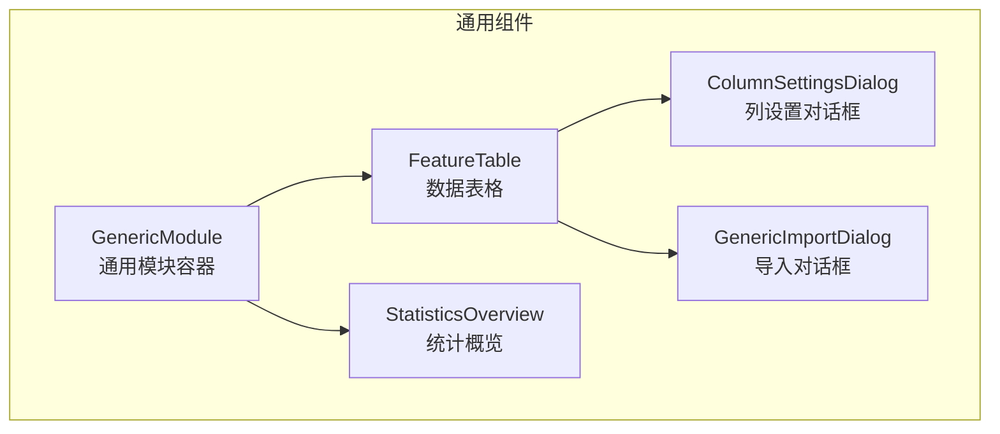
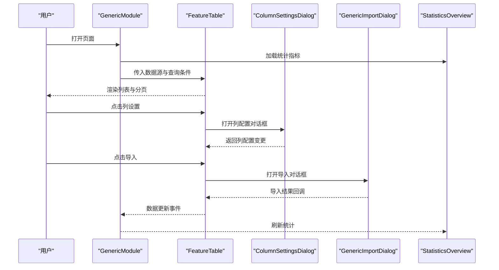
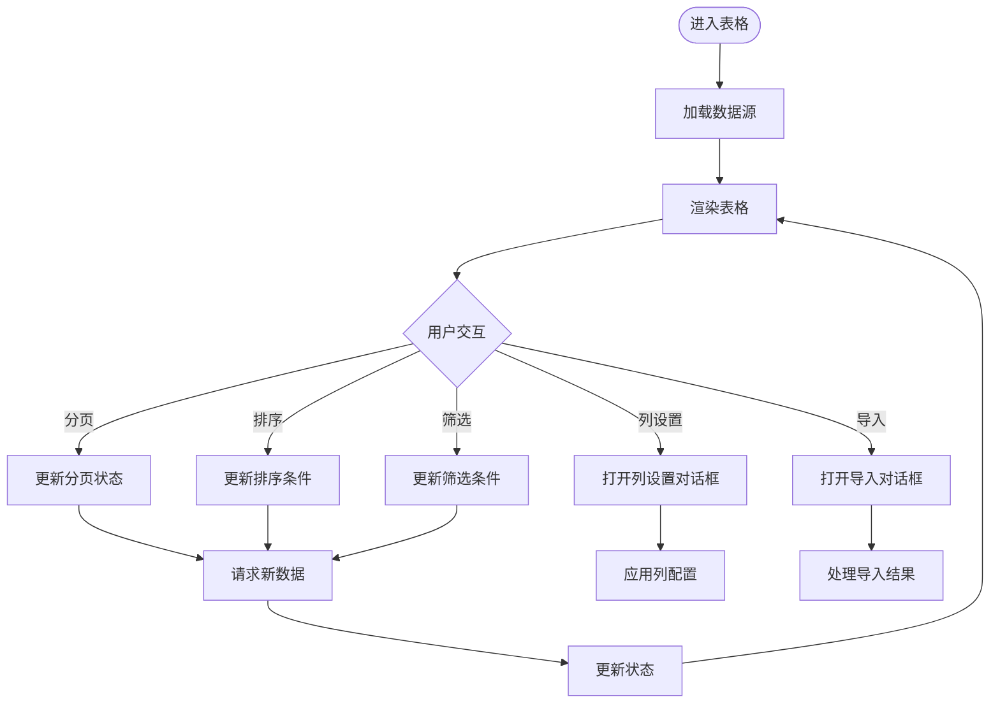
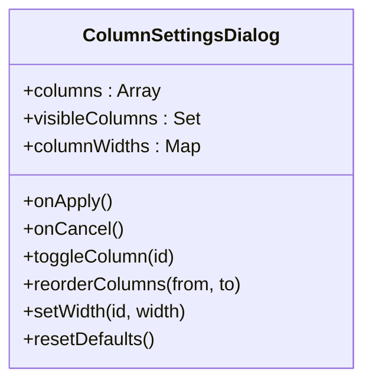
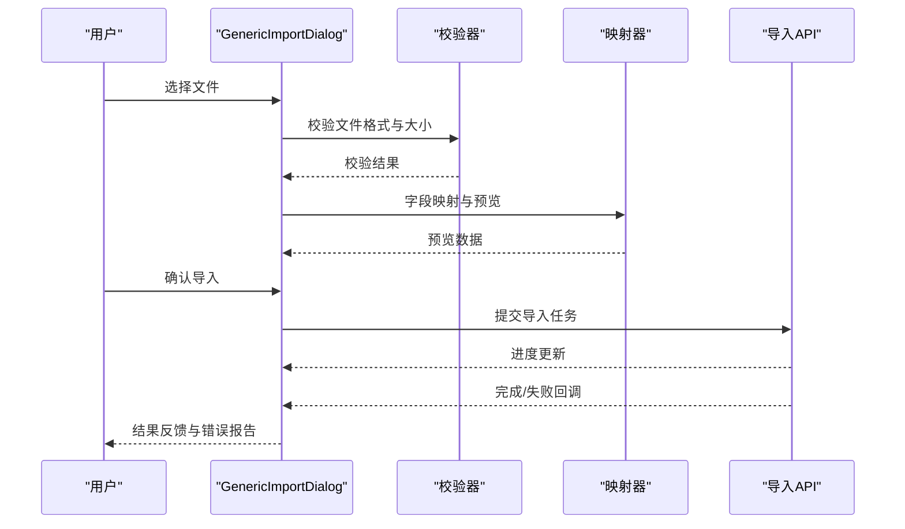
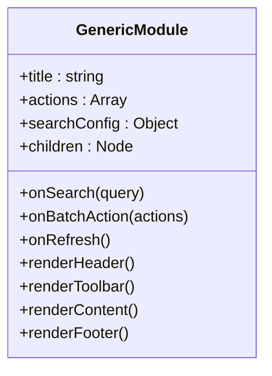
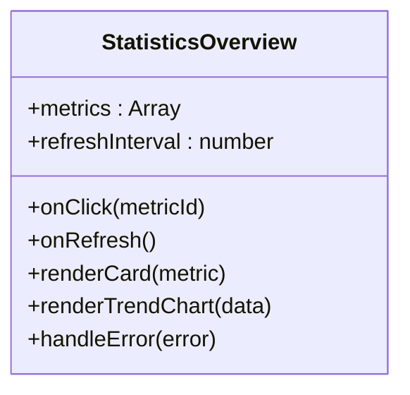
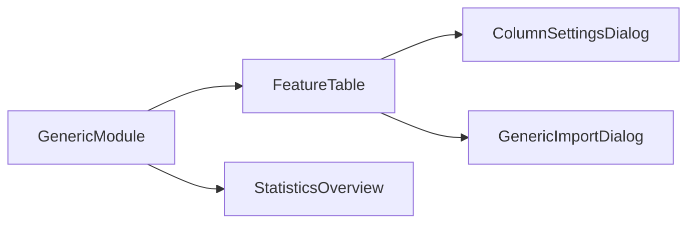

# 通用组件

<cite>
**本文引用的文件**   
- [FeatureTable.tsx](file://app/components/generic/FeatureTable.tsx)
- [ColumnSettingsDialog.tsx](file://app/components/generic/ColumnSettingsDialog.tsx)
- [GenericImportDialog.tsx](file://app/components/generic/GenericImportDialog.tsx)
- [GenericModule.tsx](file://app/components/generic/GenericModule.tsx)
- [StatisticsOverview.tsx](file://app/components/generic/StatisticsOverview.tsx)
</cite>

## 目录
1. [简介](#简介)
2. [项目结构](#项目结构)
3. [核心组件](#核心组件)
4. [架构总览](#架构总览)
5. [详细组件分析](#详细组件分析)
6. [依赖关系分析](#依赖关系分析)
7. [性能考虑](#性能考虑)
8. [故障排查指南](#故障排查指南)
9. [结论](#结论)
10. [附录](#附录)

## 简介
本文件面向CS1学生事务管理系统的“通用组件”模块，聚焦以下五个可复用UI组件的视觉外观、行为与交互模式：表格组件、列设置对话框、导入对话框、通用模块容器与统计概览组件。文档将系统化说明各组件的属性/参数、事件、插槽与自定义选项，并提供数据绑定、状态管理与性能优化建议，以及可扩展性与主题定制能力说明。读者无需深入源码即可理解如何在不同业务场景中使用这些组件。

## 项目结构
通用组件位于 app/components/generic 目录下，围绕“数据展示与操作”的核心流程组织：
- FeatureTable.tsx：通用数据表格，支持分页、排序、筛选、导出等常见功能。
- ColumnSettingsDialog.tsx：列配置对话框，允许用户动态显示/隐藏/调整列顺序与宽度。
- GenericImportDialog.tsx：通用导入对话框，支持模板下载、文件校验、进度反馈与错误汇总。
- GenericModule.tsx：页面级通用容器，统一布局、工具栏、搜索与批量操作区域。
- StatisticsOverview.tsx：统计概览卡片，聚合关键指标并支持刷新与趋势展示。

图表来源 
- [FeatureTable.tsx](file://app/components/generic/FeatureTable.tsx)
- [ColumnSettingsDialog.tsx](file://app/components/generic/ColumnSettingsDialog.tsx)
- [GenericImportDialog.tsx](file://app/components/generic/GenericImportDialog.tsx)
- [GenericModule.tsx](file://app/components/generic/GenericModule.tsx)
- [StatisticsOverview.tsx](file://app/components/generic/StatisticsOverview.tsx)

章节来源
- [FeatureTable.tsx](file://app/components/generic/FeatureTable.tsx)
- [ColumnSettingsDialog.tsx](file://app/components/generic/ColumnSettingsDialog.tsx)
- [GenericImportDialog.tsx](file://app/components/generic/GenericImportDialog.tsx)
- [GenericModule.tsx](file://app/components/generic/GenericModule.tsx)
- [StatisticsOverview.tsx](file://app/components/generic/StatisticsOverview.tsx)

## 核心组件
本节概述各组件的职责边界与典型用法，帮助快速定位所需能力。

- 表格组件（FeatureTable）
  - 职责：渲染数据列表，提供分页、排序、筛选、列配置、导出等功能入口。
  - 数据绑定：通过受控属性接收数据源与分页信息，内部维护选中状态与查询条件。
  - 事件：行点击、多选变化、分页切换、排序变更、筛选更新、导出触发等。
  - 插槽：单元格内容、表头渲染、工具栏按钮、空态占位等。
  - 主题：支持列宽拖拽、斑马纹、行高、边框样式等可视化定制。

- 列设置对话框（ColumnSettingsDialog）
  - 职责：管理列可见性、顺序与宽度；保存用户偏好到本地或后端。
  - 交互：勾选显示/隐藏、拖拽排序、输入宽度值、重置默认。
  - 数据绑定：列定义数组与当前用户配置双向同步。
  - 事件：确认应用、取消关闭、列配置变更回调。

- 导入对话框（GenericImportDialog）
  - 职责：引导用户上传文件、选择模板、预览数据、执行导入并反馈结果。
  - 交互：拖拽上传、格式校验、字段映射、错误行定位、重试机制。
  - 数据绑定：表单字段、文件对象、导入任务状态。
  - 事件：开始导入、进度更新、完成/失败回调、错误详情获取。

- 通用模块容器（GenericModule）
  - 职责：统一页面布局、顶部标题区、搜索与批量操作区、内容区与底部信息。
  - 插槽：头部左侧/右侧、工具栏、内容主体、底部统计条。
  - 事件：搜索提交、批量操作触发、刷新数据、权限控制回调。
  - 主题：布局间距、颜色主题、响应式断点。

- 统计概览（StatisticsOverview）
  - 职责：以卡片形式展示关键指标，支持趋势图、同比环比、刷新与钻取。
  - 数据绑定：指标集合、时间范围、刷新频率。
  - 事件：卡片点击跳转、刷新触发、异常上报。
  - 主题：数值颜色、图标风格、图表配色。

章节来源
- [FeatureTable.tsx](file://app/components/generic/FeatureTable.tsx)
- [ColumnSettingsDialog.tsx](file://app/components/generic/ColumnSettingsDialog.tsx)
- [GenericImportDialog.tsx](file://app/components/generic/GenericImportDialog.tsx)
- [GenericModule.tsx](file://app/components/generic/GenericModule.tsx)
- [StatisticsOverview.tsx](file://app/components/generic/StatisticsOverview.tsx)

## 架构总览
通用组件遵循“容器-展示”分离与“受控组件”原则：
- 容器层（GenericModule）负责页面结构与用户操作入口。
- 展示层（FeatureTable、StatisticsOverview）专注数据渲染与交互反馈。
- 对话框（ColumnSettingsDialog、GenericImportDialog）作为模态交互封装复杂流程。
- 数据流通过属性传递与事件回调实现单向数据流，避免隐式状态耦合。

图表来源 
- [GenericModule.tsx](file://app/components/generic/GenericModule.tsx)
- [FeatureTable.tsx](file://app/components/generic/FeatureTable.tsx)
- [ColumnSettingsDialog.tsx](file://app/components/generic/ColumnSettingsDialog.tsx)
- [GenericImportDialog.tsx](file://app/components/generic/GenericImportDialog.tsx)
- [StatisticsOverview.tsx](file://app/components/generic/StatisticsOverview.tsx)

## 详细组件分析

### 表格组件（FeatureTable）
- 视觉外观
  - 标准表格布局，支持固定表头、滚动区域、空态提示与加载骨架屏。
  - 斑马纹、行悬停高亮、选中行背景色、边框与圆角可选。
- 行为与交互
  - 分页：页码、每页条数、跳转。
  - 排序：单列/多列排序，升序/降序切换。
  - 筛选：文本模糊、下拉枚举、日期范围、组合条件。
  - 导出：CSV/Excel导出，支持当前页或全部数据。
  - 列设置：打开列配置对话框，实时预览列效果。
- 属性/参数
  - 数据源：rows、columns、total、page、pageSize、loading、error。
  - 交互回调：onRowClick、onSelectionChange、onPageChange、onSortChange、onFilterChange、onExport。
  - 插槽：cellRenderer、headerRenderer、toolbar、emptyState、paginationFooter。
  - 主题：rowHeight、bordered、striped、hover、selectionMode。
- 数据绑定与状态管理
  - 受控模式：父组件持有分页与筛选状态，通过属性下发，子组件通过事件回传变更。
  - 本地缓存：排序与筛选条件可持久化至localStorage，提升用户体验。
- 性能优化
  - 虚拟滚动：大数据量时启用虚拟化渲染。
  - 防抖：搜索与筛选输入防抖，减少请求频率。
  - 懒加载：按需加载列配置与扩展功能。
- 可扩展性
  - 自定义列渲染器与单元格编辑器。
  - 插件化导出与筛选策略。
- 主题定制
  - CSS变量覆盖：颜色、字号、间距、阴影等。
  - 主题开关：明暗主题、高密度模式。

图表来源 
- [FeatureTable.tsx](file://app/components/generic/FeatureTable.tsx)

章节来源
- [FeatureTable.tsx](file://app/components/generic/FeatureTable.tsx)

### 列设置对话框（ColumnSettingsDialog）
- 视觉外观
  - 模态窗口，包含列列表、复选框、拖拽手柄与宽度输入框。
  - 底部操作区：确认、取消、重置默认。
- 行为与交互
  - 拖拽排序：改变列顺序。
  - 勾选显示/隐藏：实时更新表格列可见性。
  - 宽度调整：输入像素值或百分比。
  - 重置：恢复系统默认列配置。
- 属性/参数
  - columns：列定义数组。
  - visibleColumns：当前可见列ID集合。
  - columnWidths：列宽度映射。
  - onApply：应用配置回调。
  - onCancel：取消关闭回调。
- 数据绑定与状态管理
  - 受控模式：visibleColumns与columnWidths由父组件管理，对话框内变更通过事件上报。
  - 本地存储：用户偏好保存到localStorage，下次打开自动恢复。
- 性能优化
  - 增量更新：仅重渲染变更列。
  - 防抖：宽度输入防抖，避免频繁计算。
- 可扩展性
  - 自定义列渲染与验证规则。
  - 批量操作：全选/反选、按组显示。
- 主题定制
  - 对话框尺寸、间距、颜色与字体。

图表来源 
- [ColumnSettingsDialog.tsx](file://app/components/generic/ColumnSettingsDialog.tsx)

章节来源
- [ColumnSettingsDialog.tsx](file://app/components/generic/ColumnSettingsDialog.tsx)

### 导入对话框（GenericImportDialog）
- 视觉外观
  - 分步向导：选择模板、上传文件、预览数据、确认导入、结果反馈。
  - 进度条与错误行高亮，支持下载错误报告。
- 行为与交互
  - 拖拽上传与点击选择，支持CSV/Excel格式。
  - 字段映射：自动识别列名，允许手动修正。
  - 校验：必填项、数据类型、重复检测。
  - 重试：失败任务支持重试与部分成功处理。
- 属性/参数
  - acceptFormats：接受的文件类型。
  - templateUrl：模板下载地址。
  - validator：校验函数。
  - mapper：字段映射函数。
  - onProgress：进度回调。
  - onComplete：完成回调。
  - onError：错误回调。
- 数据绑定与状态管理
  - 表单状态：文件对象、映射关系、校验结果。
  - 任务状态：pending、processing、success、failed。
- 性能优化
  - 分片读取大文件，避免阻塞主线程。
  - 异步校验与映射，使用Web Worker。
- 可扩展性
  - 自定义校验规则与映射策略。
  - 插件化处理器：支持多种数据源与目标系统。
- 主题定制
  - 步骤指示器、进度条样式、错误提示样式。

图表来源 
- [GenericImportDialog.tsx](file://app/components/generic/GenericImportDialog.tsx)

章节来源
- [GenericImportDialog.tsx](file://app/components/generic/GenericImportDialog.tsx)

### 通用模块容器（GenericModule）
- 视觉外观
  - 顶部标题区、搜索与批量操作工具栏、内容区与底部统计条。
  - 响应式布局，适配移动端与桌面端。
- 行为与交互
  - 搜索：关键词输入、高级筛选面板。
  - 批量操作：全选、删除、导出、状态变更。
  - 刷新：手动刷新与自动轮询。
- 属性/参数
  - title：模块标题。
  - actions：工具栏按钮配置。
  - searchConfig：搜索配置。
  - children：内容插槽。
  - onSearch：搜索回调。
  - onBatchAction：批量操作回调。
  - onRefresh：刷新回调。
- 数据绑定与状态管理
  - 搜索条件与批量选择状态由父组件管理，容器通过事件上报。
- 性能优化
  - 懒加载内容区，按需渲染。
  - 防抖搜索与节流刷新。
- 可扩展性
  - 插件化工具栏与操作菜单。
  - 权限控制：根据角色动态显示按钮。
- 主题定制
  - 布局间距、颜色主题、图标库替换。

图表来源 
- [GenericModule.tsx](file://app/components/generic/GenericModule.tsx)

章节来源
- [GenericModule.tsx](file://app/components/generic/GenericModule.tsx)

### 统计概览（StatisticsOverview）
- 视觉外观
  - 卡片网格布局，每个卡片展示一个指标，支持图标、数值、单位、趋势箭头。
  - 可选迷你折线图或柱状图展示历史趋势。
- 行为与交互
  - 点击卡片跳转到详情页或展开更多维度。
  - 刷新按钮与自动轮询。
  - 异常状态：数据缺失、加载失败、超时提示。
- 属性/参数
  - metrics：指标数组，包含id、label、value、unit、trend、color等。
  - refreshInterval：刷新间隔。
  - onClick：卡片点击回调。
  - onRefresh：刷新回调。
- 数据绑定与状态管理
  - 指标数据由父组件提供，内部维护加载与错误状态。
- 性能优化
  - 按需加载图表库，延迟初始化。
  - 缓存最近一次数据，避免闪烁。
- 可扩展性
  - 自定义卡片渲染器与图表类型。
  - 指标聚合策略：同比、环比、累计。
- 主题定制
  - 卡片颜色、图标风格、图表配色。

图表来源 
- [StatisticsOverview.tsx](file://app/components/generic/StatisticsOverview.tsx)

章节来源
- [StatisticsOverview.tsx](file://app/components/generic/StatisticsOverview.tsx)

## 依赖关系分析
通用组件之间松耦合，通过事件与属性通信：
- GenericModule 作为容器，组合 FeatureTable 与 StatisticsOverview。
- FeatureTable 依赖 ColumnSettingsDialog 与 GenericImportDialog 完成列配置与导入流程。
- 所有组件均不直接依赖外部状态库，采用React原生状态管理，便于替换为全局状态方案。

图表来源 
- [GenericModule.tsx](file://app/components/generic/GenericModule.tsx)
- [FeatureTable.tsx](file://app/components/generic/FeatureTable.tsx)
- [ColumnSettingsDialog.tsx](file://app/components/generic/ColumnSettingsDialog.tsx)
- [GenericImportDialog.tsx](file://app/components/generic/GenericImportDialog.tsx)
- [StatisticsOverview.tsx](file://app/components/generic/StatisticsOverview.tsx)

章节来源
- [GenericModule.tsx](file://app/components/generic/GenericModule.tsx)
- [FeatureTable.tsx](file://app/components/generic/FeatureTable.tsx)
- [ColumnSettingsDialog.tsx](file://app/components/generic/ColumnSettingsDialog.tsx)
- [GenericImportDialog.tsx](file://app/components/generic/GenericImportDialog.tsx)
- [StatisticsOverview.tsx](file://app/components/generic/StatisticsOverview.tsx)

## 性能考虑
- 表格组件
  - 大数据量：启用虚拟滚动与分页加载。
  - 搜索与筛选：防抖输入，服务端分页与过滤。
  - 列配置：增量更新，避免全量重渲染。
- 导入对话框
  - 大文件：分片读取与Web Worker处理。
  - 校验与映射：异步并行，错误快速失败。
- 统计概览
  - 图表懒加载与缓存，避免重复计算。
  - 刷新节流与错误重试。
- 通用模块
  - 内容区懒加载，按需渲染。
  - 搜索防抖与批量操作合并。

[本节为通用指导，不直接分析具体文件]

## 故障排查指南
- 表格组件
  - 数据为空：检查数据源与分页参数，确认接口返回结构。
  - 排序失效：确认列定义是否支持排序，服务端是否实现排序逻辑。
  - 筛选无响应：检查防抖配置与输入合法性。
- 列设置对话框
  - 列未生效：确认visibleColumns更新后是否触发重渲染。
  - 宽度异常：检查宽度值单位与最小值限制。
- 导入对话框
  - 文件校验失败：检查文件格式与大小限制。
  - 映射错误：核对字段映射规则与数据类型。
  - 导入失败：查看错误报告与重试机制。
- 统计概览
  - 指标缺失：检查数据源与时间范围。
  - 图表不显示：确认图表库加载与数据格式。

章节来源
- [FeatureTable.tsx](file://app/components/generic/FeatureTable.tsx)
- [ColumnSettingsDialog.tsx](file://app/components/generic/ColumnSettingsDialog.tsx)
- [GenericImportDialog.tsx](file://app/components/generic/GenericImportDialog.tsx)
- [StatisticsOverview.tsx](file://app/components/generic/StatisticsOverview.tsx)

## 结论
通用组件为CS1学生事务管理系统提供了高度可复用的UI能力，涵盖数据展示、列配置、导入流程、页面容器与统计概览。通过受控组件与事件驱动的数据流，确保状态清晰、可测试与易维护。结合性能优化与主题定制，能够灵活适配不同业务场景与品牌需求。

[本节为总结，不直接分析具体文件]

## 附录
- 使用示例路径
  - 表格组件：参考 [FeatureTable.tsx](file://app/components/generic/FeatureTable.tsx) 中的属性与插槽用法。
  - 列设置对话框：参考 [ColumnSettingsDialog.tsx](file://app/components/generic/ColumnSettingsDialog.tsx) 中的列配置流程。
  - 导入对话框：参考 [GenericImportDialog.tsx](file://app/components/generic/GenericImportDialog.tsx) 中的导入步骤与回调。
  - 通用模块容器：参考 [GenericModule.tsx](file://app/components/generic/GenericModule.tsx) 中的布局与插槽。
  - 统计概览：参考 [StatisticsOverview.tsx](file://app/components/generic/StatisticsOverview.tsx) 中的指标渲染与刷新。

[本节为附录，不直接分析具体文件]