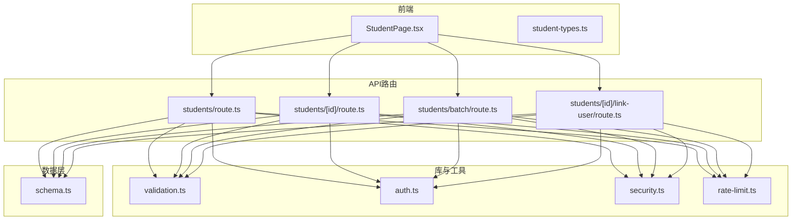
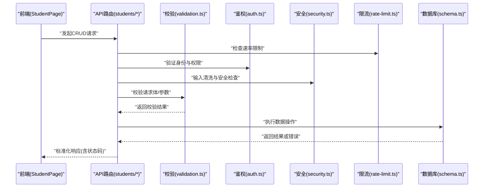
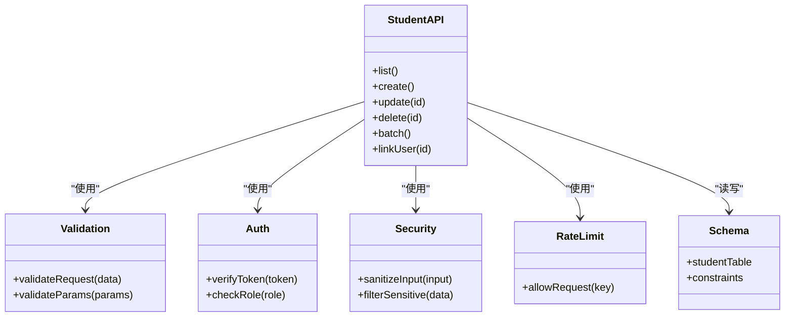

# 学生CRUD操作

<cite>
**本文引用的文件**   
- [app/api/students/route.ts](file://app/api/students/route.ts)
- [app/api/students/[id]/route.ts](file://app/api/students/[id]/route.ts)
- [app/api/students/batch/route.ts](file://app/api/students/batch/route.ts)
- [app/api/students/[id]/link-user/route.ts](file://app/api/students/[id]/link-user/route.ts)
- [db/schema.ts](file://db/schema.ts)
- [lib/validation.ts](file://lib/validation.ts)
- [lib/auth.ts](file://lib/auth.ts)
- [lib/security.ts](file://lib/security.ts)
- [lib/rate-limit.ts](file://lib/rate-limit.ts)
- [app/components/student/StudentPage.tsx](file://app/components/student/StudentPage.tsx)
- [app/components/student/student-types.ts](file://app/components/student/student-types.ts)
</cite>

## 目录
1. [简介](#简介)
2. [项目结构](#项目结构)
3. [核心组件](#核心组件)
4. [架构总览](#架构总览)
5. [详细组件分析](#详细组件分析)
6. [依赖关系分析](#依赖关系分析)
7. [性能考虑](#性能考虑)
8. [故障排查指南](#故障排查指南)
9. [结论](#结论)
10. [附录](#附录)

## 简介
本文件面向学生管理模块的增删改查（CRUD）功能，系统化说明API端点设计、数据验证、错误处理与权限控制策略；完整记录HTTP方法（GET、POST、PUT、DELETE）的请求参数、响应格式与状态码；提供调用示例与最佳实践，帮助开发者快速集成并稳定运行。

## 项目结构
学生CRUD相关代码主要分布在以下位置：
- API路由层：app/api/students/*
- 数据模型与迁移：db/schema.ts
- 校验与安全：lib/validation.ts、lib/security.ts
- 认证与鉴权：lib/auth.ts
- 限流：lib/rate-limit.ts
- 前端页面与类型：app/components/student/*

图表来源
- [app/api/students/route.ts](file://app/api/students/route.ts)
- [app/api/students/[id]/route.ts](file://app/api/students/[id]/route.ts)
- [app/api/students/batch/route.ts](file://app/api/students/batch/route.ts)
- [app/api/students/[id]/link-user/route.ts](file://app/api/students/[id]/link-user/route.ts)
- [lib/validation.ts](file://lib/validation.ts)
- [lib/auth.ts](file://lib/auth.ts)
- [lib/security.ts](file://lib/security.ts)
- [lib/rate-limit.ts](file://lib/rate-limit.ts)
- [db/schema.ts](file://db/schema.ts)
- [app/components/student/StudentPage.tsx](file://app/components/student/StudentPage.tsx)
- [app/components/student/student-types.ts](file://app/components/student/student-types.ts)

章节来源
- [app/api/students/route.ts](file://app/api/students/route.ts)
- [app/api/students/[id]/route.ts](file://app/api/students/[id]/route.ts)
- [app/api/students/batch/route.ts](file://app/api/students/batch/route.ts)
- [app/api/students/[id]/link-user/route.ts](file://app/api/students/[id]/link-user/route.ts)
- [db/schema.ts](file://db/schema.ts)
- [lib/validation.ts](file://lib/validation.ts)
- [lib/auth.ts](file://lib/auth.ts)
- [lib/security.ts](file://lib/security.ts)
- [lib/rate-limit.ts](file://lib/rate-limit.ts)
- [app/components/student/StudentPage.tsx](file://app/components/student/StudentPage.tsx)
- [app/components/student/student-types.ts](file://app/components/student/student-types.ts)

## 核心组件
- 学生实体与字段约束：由数据库模式定义，包含主键、唯一性、非空等约束，以及时间戳字段。
- 请求校验：统一在lib/validation.ts中实现，对输入字段进行类型、长度、枚举值等校验。
- 认证与鉴权：通过lib/auth.ts进行会话/令牌校验与角色判断，确保仅授权用户可执行敏感操作。
- 安全加固：lib/security.ts提供输入清洗、防注入、敏感信息过滤等能力。
- 限流保护：lib/rate-limit.ts限制高频访问，防止滥用。
- 前端交互：StudentPage.tsx负责渲染列表、表单与批量操作，student-types.ts定义前后端共享的数据类型。

章节来源
- [db/schema.ts](file://db/schema.ts)
- [lib/validation.ts](file://lib/validation.ts)
- [lib/auth.ts](file://lib/auth.ts)
- [lib/security.ts](file://lib/security.ts)
- [lib/rate-limit.ts](file://lib/rate-limit.ts)
- [app/components/student/StudentPage.tsx](file://app/components/student/StudentPage.tsx)
- [app/components/student/student-types.ts](file://app/components/student/student-types.ts)

## 架构总览
学生CRUD采用Next.js API路由作为入口，结合中间件式的校验、鉴权、限流与安全处理，最终访问数据库模式定义的数据表。

图表来源
- [app/api/students/route.ts](file://app/api/students/route.ts)
- [app/api/students/[id]/route.ts](file://app/api/students/[id]/route.ts)
- [app/api/students/batch/route.ts](file://app/api/students/batch/route.ts)
- [app/api/students/[id]/link-user/route.ts](file://app/api/students/[id]/link-user/route.ts)
- [lib/validation.ts](file://lib/validation.ts)
- [lib/auth.ts](file://lib/auth.ts)
- [lib/security.ts](file://lib/security.ts)
- [lib/rate-limit.ts](file://lib/rate-limit.ts)
- [db/schema.ts](file://db/schema.ts)

## 详细组件分析

### 数据模型与字段约束
- 学生表包含主键、学号（唯一）、姓名、班级、联系方式、状态、创建/更新时间等字段。
- 字段约束包括非空、唯一、长度限制、枚举值范围等，保证数据一致性与完整性。
- 建议在前端与后端同时实施相同约束，避免不一致。

章节来源
- [db/schema.ts](file://db/schema.ts)

### 通用校验与安全
- 校验器支持必填项、数据类型、长度、正则表达式、枚举值等规则。
- 安全模块负责清理输入、防止注入攻击、过滤敏感字段。
- 限流模块基于IP或用户标识限制单位时间内的请求次数。

章节来源
- [lib/validation.ts](file://lib/validation.ts)
- [lib/security.ts](file://lib/security.ts)
- [lib/rate-limit.ts](file://lib/rate-limit.ts)

### 认证与权限控制
- 认证流程校验会话或令牌有效性，解析用户身份。
- 权限控制根据角色决定是否允许执行特定操作（如删除、批量导入）。
- 未认证或无权限时返回明确的错误响应。

章节来源
- [lib/auth.ts](file://lib/auth.ts)

### API端点设计与规范

#### GET /api/students
- 用途：查询学生列表，支持分页、排序、筛选。
- 请求参数（Query）：page、pageSize、sort、order、filters（如姓名、班级、状态）。
- 响应格式：{ code, message, data: { list, total, page, pageSize } }
- 状态码：200成功；400参数错误；401未认证；403无权限；500服务器错误。

章节来源
- [app/api/students/route.ts](file://app/api/students/route.ts)
- [lib/validation.ts](file://lib/validation.ts)
- [lib/auth.ts](file://lib/auth.ts)
- [lib/security.ts](file://lib/security.ts)
- [lib/rate-limit.ts](file://lib/rate-limit.ts)
- [db/schema.ts](file://db/schema.ts)

#### POST /api/students
- 用途：新增单个学生。
- 请求体（JSON）：包含必填字段（学号、姓名、班级等），遵循字段约束。
- 响应格式：{ code, message, data: student }
- 状态码：201创建成功；400参数错误；401未认证；403无权限；409学号重复；500服务器错误。

章节来源
- [app/api/students/route.ts](file://app/api/students/route.ts)
- [lib/validation.ts](file://lib/validation.ts)
- [lib/auth.ts](file://lib/auth.ts)
- [lib/security.ts](file://lib/security.ts)
- [db/schema.ts](file://db/schema.ts)

#### PUT /api/students/:id
- 用途：更新指定学生信息。
- 路径参数：id（学生ID）。
- 请求体（JSON）：需要更新的字段，遵循字段约束。
- 响应格式：{ code, message, data: student }
- 状态码：200更新成功；400参数错误；401未认证；403无权限；404不存在；500服务器错误。

章节来源
- [app/api/students/[id]/route.ts](file://app/api/students/[id]/route.ts)
- [lib/validation.ts](file://lib/validation.ts)
- [lib/auth.ts](file://lib/auth.ts)
- [lib/security.ts](file://lib/security.ts)
- [db/schema.ts](file://db/schema.ts)

#### DELETE /api/students/:id
- 用途：删除指定学生。
- 路径参数：id（学生ID）。
- 响应格式：{ code, message }
- 状态码：200删除成功；401未认证；403无权限；404不存在；500服务器错误。

章节来源
- [app/api/students/[id]/route.ts](file://app/api/students/[id]/route.ts)
- [lib/auth.ts](file://lib/auth.ts)
- [lib/security.ts](file://lib/security.ts)
- [db/schema.ts](file://db/schema.ts)

#### POST /api/students/batch
- 用途：批量导入或更新学生数据。
- 请求体（JSON）：数组形式的学生对象集合，每个对象需满足字段约束。
- 响应格式：{ code, message, data: { successCount, failCount, errors } }
- 状态码：200批量成功；400参数错误；401未认证；403无权限；500服务器错误。

章节来源
- [app/api/students/batch/route.ts](file://app/api/students/batch/route.ts)
- [lib/validation.ts](file://lib/validation.ts)
- [lib/auth.ts](file://lib/auth.ts)
- [lib/security.ts](file://lib/security.ts)
- [db/schema.ts](file://db/schema.ts)

#### POST /api/students/:id/link-user
- 用途：将学生账号与系统用户关联。
- 路径参数：id（学生ID）。
- 请求体（JSON）：userId（系统用户ID）。
- 响应格式：{ code, message, data: linkInfo }
- 状态码：200关联成功；400参数错误；401未认证；403无权限；404不存在；500服务器错误。

章节来源
- [app/api/students/[id]/link-user/route.ts](file://app/api/students/[id]/link-user/route.ts)
- [lib/validation.ts](file://lib/validation.ts)
- [lib/auth.ts](file://lib/auth.ts)
- [lib/security.ts](file://lib/security.ts)
- [db/schema.ts](file://db/schema.ts)

### 调用示例（前端）
- 获取列表：使用GET请求，携带分页与筛选参数。
- 新增学生：使用POST请求，提交符合约束的JSON对象。
- 更新学生：使用PUT请求，指定id与更新字段。
- 删除学生：使用DELETE请求，传入id。
- 批量导入：使用POST到batch端点，提交学生数组。
- 关联用户：使用POST到link-user端点，传入userId。

章节来源
- [app/components/student/StudentPage.tsx](file://app/components/student/StudentPage.tsx)
- [app/components/student/student-types.ts](file://app/components/student/student-types.ts)

### 业务规则与异常处理
- 唯一性约束：学号必须唯一，冲突时返回409。
- 必填字段：缺失必填字段返回400，并附带字段级错误信息。
- 权限不足：返回403，提示无权限操作。
- 资源不存在：返回404，提示目标不存在。
- 限流触发：返回429，提示请求过于频繁。
- 服务器错误：返回500，附带错误摘要以便排查。

章节来源
- [lib/validation.ts](file://lib/validation.ts)
- [lib/auth.ts](file://lib/auth.ts)
- [lib/security.ts](file://lib/security.ts)
- [lib/rate-limit.ts](file://lib/rate-limit.ts)

## 依赖关系分析
- API路由依赖校验、鉴权、安全与限流模块，形成统一的请求处理管线。
- 数据层通过schema.ts定义表结构与约束，确保数据一致性。
- 前端通过类型定义与API交互，保持前后端数据结构一致。

图表来源
- [app/api/students/route.ts](file://app/api/students/route.ts)
- [app/api/students/[id]/route.ts](file://app/api/students/[id]/route.ts)
- [app/api/students/batch/route.ts](file://app/api/students/batch/route.ts)
- [app/api/students/[id]/link-user/route.ts](file://app/api/students/[id]/link-user/route.ts)
- [lib/validation.ts](file://lib/validation.ts)
- [lib/auth.ts](file://lib/auth.ts)
- [lib/security.ts](file://lib/security.ts)
- [lib/rate-limit.ts](file://lib/rate-limit.ts)
- [db/schema.ts](file://db/schema.ts)

章节来源
- [app/api/students/route.ts](file://app/api/students/route.ts)
- [app/api/students/[id]/route.ts](file://app/api/students/[id]/route.ts)
- [app/api/students/batch/route.ts](file://app/api/students/batch/route.ts)
- [app/api/students/[id]/link-user/route.ts](file://app/api/students/[id]/link-user/route.ts)
- [lib/validation.ts](file://lib/validation.ts)
- [lib/auth.ts](file://lib/auth.ts)
- [lib/security.ts](file://lib/security.ts)
- [lib/rate-limit.ts](file://lib/rate-limit.ts)
- [db/schema.ts](file://db/schema.ts)

## 性能考虑
- 分页与索引：为常用查询字段建立索引，合理设置分页大小。
- 批量操作：优先使用批量接口减少网络往返与事务开销。
- 缓存策略：对热点数据（如班级列表、字典）进行缓存。
- 连接池：数据库连接池配置优化，避免连接耗尽。
- 限流与降级：在高负载下启用限流与降级策略，保障服务稳定性。

[本节为通用指导，不直接分析具体文件]

## 故障排查指南
- 参数校验失败：检查请求体字段是否符合约束，关注错误消息中的字段定位。
- 权限问题：确认用户角色与所需权限匹配，检查鉴权逻辑。
- 唯一性冲突：学号重复时调整输入或处理冲突策略。
- 限流触发：降低请求频率或提升限流阈值。
- 服务器错误：查看服务端日志，定位数据库或外部依赖问题。

章节来源
- [lib/validation.ts](file://lib/validation.ts)
- [lib/auth.ts](file://lib/auth.ts)
- [lib/security.ts](file://lib/security.ts)
- [lib/rate-limit.ts](file://lib/rate-limit.ts)

## 结论
学生CRUD模块通过清晰的API设计、严格的校验与鉴权、完善的安全与限流机制，提供了稳定可靠的数据管理能力。遵循本文档的规范与实践，可有效提升开发效率与系统健壮性。

[本节为总结，不直接分析具体文件]

## 附录
- 常见状态码速查：200成功、201创建、400参数错误、401未认证、403无权限、404不存在、409冲突、429限流、500服务器错误。
- 最佳实践：始终在后端重复前端校验；使用统一错误响应格式；对敏感操作增加二次确认与审计日志。

[本节为补充信息，不直接分析具体文件]