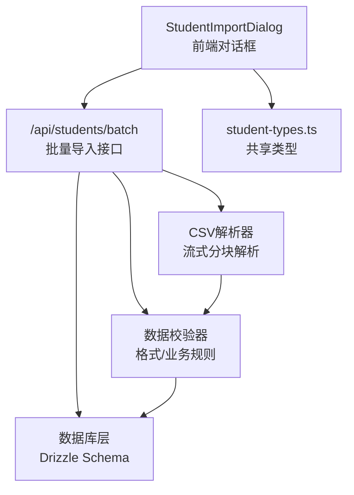
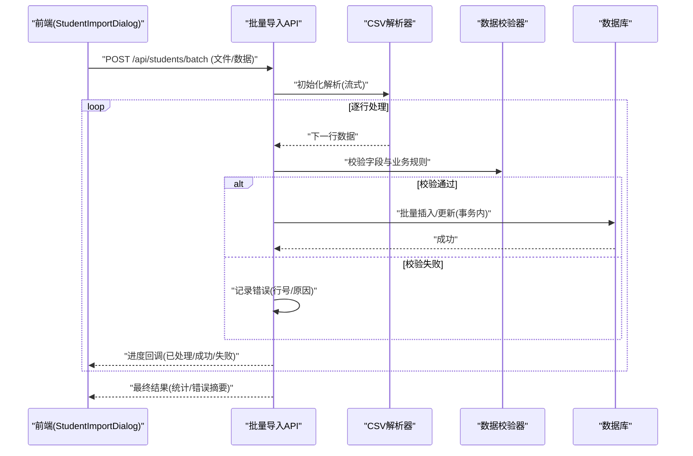
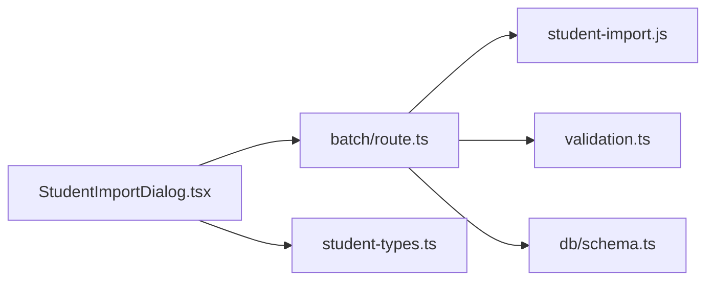

# 学生批量导入

<cite>
**本文引用的文件**   
- [app/api/students/batch/route.ts](file://app/api/students/batch/route.ts)
- [app/student-import.js](file://app/student-import.js)
- [app/components/student/StudentImportDialog.tsx](file://app/components/student/StudentImportDialog.tsx)
- [app/components/student/student-types.ts](file://app/components/student/student-types.ts)
- [lib/validation.ts](file://lib/validation.ts)
- [db/schema.ts](file://db/schema.ts)
- [tests/fixtures/students-valid.csv](file://tests/fixtures/students-valid.csv)
- [tests/app/student-import.test.ts](file://tests/app/student-import.test.ts)
</cite>

## 目录
1. [简介](#简介)
2. [项目结构](#项目结构)
3. [核心组件](#核心组件)
4. [架构总览](#架构总览)
5. [详细组件分析](#详细组件分析)
6. [依赖关系分析](#依赖关系分析)
7. [性能考虑](#性能考虑)
8. [故障排查指南](#故障排查指南)
9. [结论](#结论)
10. [附录](#附录)

## 简介
本文件面向“学生批量导入”功能，系统化阐述CSV解析、数据校验、批量处理与错误恢复机制的实现要点。文档覆盖文件格式要求、字段映射规则、导入流程、并发策略、事务管理与一致性保证，并提供大文件导入的性能优化方案与内存管理建议。同时给出前端上传、数据处理与进度反馈的示例指引，以及导入模板、错误日志分析与数据修复工具的使用说明。

## 项目结构
学生批量导入涉及前后端协作：
- 前端负责文件选择、预览、校验提示与进度展示
- 后端提供批量导入API，负责流式读取、分块解析、校验、写入数据库并返回统计结果
- 共享类型定义与校验逻辑确保两端数据结构一致

图表来源
- [app/components/student/StudentImportDialog.tsx](file://app/components/student/StudentImportDialog.tsx)
- [app/api/students/batch/route.ts](file://app/api/students/batch/route.ts)
- [app/student-import.js](file://app/student-import.js)
- [app/components/student/student-types.ts](file://app/components/student/student-types.ts)
- [db/schema.ts](file://db/schema.ts)

章节来源
- [app/api/students/batch/route.ts](file://app/api/students/batch/route.ts)
- [app/student-import.js](file://app/student-import.js)
- [app/components/student/StudentImportDialog.tsx](file://app/components/student/StudentImportDialog.tsx)
- [app/components/student/student-types.ts](file://app/components/student/student-types.ts)
- [db/schema.ts](file://db/schema.ts)

## 核心组件
- 批量导入API（路由）：接收multipart/form-data或JSON数组，执行分块解析、校验、写入与统计
- CSV解析器：支持流式读取、行级错误捕获、跳过坏行、记录失败原因
- 数据校验器：字段类型、必填项、唯一性、业务规则校验
- 数据库层：基于Schema定义进行插入/更新，支持事务与回滚
- 前端对话框：文件选择、预览、进度条、错误汇总展示

章节来源
- [app/api/students/batch/route.ts](file://app/api/students/batch/route.ts)
- [app/student-import.js](file://app/student-import.js)
- [app/components/student/StudentImportDialog.tsx](file://app/components/student/StudentImportDialog.tsx)
- [lib/validation.ts](file://lib/validation.ts)
- [db/schema.ts](file://db/schema.ts)

## 架构总览
整体流程从前端上传开始，经后端解析、校验、持久化，最终返回导入结果与统计信息。关键路径包括：
- 文件上传与分块传输
- 流式解析与逐行校验
- 批量写入与事务边界控制
- 错误收集与重试/跳过策略
- 进度上报与前端反馈

图表来源
- [app/api/students/batch/route.ts](file://app/api/students/batch/route.ts)
- [app/student-import.js](file://app/student-import.js)
- [app/components/student/StudentImportDialog.tsx](file://app/components/student/StudentImportDialog.tsx)

## 详细组件分析

### 批量导入API（/api/students/batch）
职责
- 接收文件上传或JSON数组
- 调用解析器进行流式读取与分块处理
- 调用校验器对每行数据进行字段与业务规则校验
- 在事务中批量写入数据库，支持部分失败的回滚或隔离
- 累计成功/失败计数，生成错误摘要并返回

关键点
- 支持分块大小配置，避免一次性加载大文件导致内存溢出
- 使用事务边界包裹批量写入，确保一致性
- 错误行记录行号、字段名与错误原因，便于定位与修复
- 进度回调用于前端实时更新

章节来源
- [app/api/students/batch/route.ts](file://app/api/students/batch/route.ts)

### CSV解析器（student-import.js）
职责
- 流式读取CSV内容，按行分割
- 处理BOM、换行符差异、引号包裹字段
- 识别表头并建立列索引映射
- 捕获解析异常，记录失败行及原因

关键点
- 采用流式处理降低内存占用
- 支持跳过损坏行并继续处理后续行
- 提供行级错误上下文（行号、原始片段）

章节来源
- [app/student-import.js](file://app/student-import.js)

### 数据校验器（validation.ts）
职责
- 字段类型校验（字符串、数字、日期等）
- 必填项检查
- 唯一性约束（如学号/身份证号）
- 业务规则（如年龄范围、状态枚举）

关键点
- 可配置的校验规则集
- 快速失败与全量收集两种模式
- 错误消息标准化，便于前端展示

章节来源
- [lib/validation.ts](file://lib/validation.ts)

### 数据库层（schema.ts）
职责
- 定义学生相关表结构与字段类型
- 提供插入/更新操作封装
- 支持事务API

关键点
- 字段约束与默认值
- 批量插入接口
- 事务提交/回滚语义

章节来源
- [db/schema.ts](file://db/schema.ts)

### 前端对话框（StudentImportDialog.tsx）
职责
- 文件选择与预览
- 显示导入进度与实时统计
- 展示错误列表与下载错误报告
- 提供重试/跳过选项

关键点
- 使用事件流或轮询获取进度
- 本地缓存错误详情以便导出
- 友好的用户交互与提示

章节来源
- [app/components/student/StudentImportDialog.tsx](file://app/components/student/StudentImportDialog.tsx)

### 共享类型（student-types.ts）
职责
- 定义学生实体字段与导入数据结构
- 统一前后端类型契约

关键点
- 字段命名规范与可选性
- 枚举值定义（如性别、状态）

章节来源
- [app/components/student/student-types.ts](file://app/components/student/student-types.ts)

## 依赖关系分析
- 前端依赖共享类型与API接口
- 后端API依赖解析器、校验器与数据库层
- 校验器依赖共享类型与业务规则
- 数据库层依赖Schema定义

图表来源
- [app/components/student/StudentImportDialog.tsx](file://app/components/student/StudentImportDialog.tsx)
- [app/api/students/batch/route.ts](file://app/api/students/batch/route.ts)
- [app/student-import.js](file://app/student-import.js)
- [lib/validation.ts](file://lib/validation.ts)
- [db/schema.ts](file://db/schema.ts)
- [app/components/student/student-types.ts](file://app/components/student/student-types.ts)

章节来源
- [app/api/students/batch/route.ts](file://app/api/students/batch/route.ts)
- [app/student-import.js](file://app/student-import.js)
- [lib/validation.ts](file://lib/validation.ts)
- [db/schema.ts](file://db/schema.ts)
- [app/components/student/StudentImportDialog.tsx](file://app/components/student/StudentImportDialog.tsx)
- [app/components/student/student-types.ts](file://app/components/student/student-types.ts)

## 性能考虑
- 流式解析：避免一次性加载整个CSV到内存，按块读取与处理
- 批处理写入：合并多条记录为一次批量插入，减少数据库往返
- 事务边界：合理划分事务粒度，平衡一致性与性能
- 并发策略：限制并发写入数量，防止数据库连接池耗尽
- 内存管理：及时释放临时对象，避免引用泄漏
- 大文件优化：分段上传、断点续传、进度上报
- 索引与约束：在数据库层面设置必要索引与约束，提升查询与冲突检测效率

[本节为通用指导，不直接分析具体文件]

## 故障排查指南
常见问题与定位方法
- 解析失败：检查CSV编码、分隔符、换行符；查看解析器错误日志中的行号与原始片段
- 校验失败：核对字段类型、必填项、唯一性与业务规则；参考校验器错误消息
- 写入失败：检查数据库连接、事务状态、约束冲突；查看数据库错误日志
- 进度不更新：确认后端是否推送进度事件；检查前端事件监听与状态更新逻辑

调试建议
- 启用详细日志，记录每步处理的输入输出
- 导出错误报告，包含行号、字段名、错误原因与原始数据片段
- 使用测试用例验证解析与校验逻辑

章节来源
- [tests/app/student-import.test.ts](file://tests/app/student-import.test.ts)
- [tests/fixtures/students-valid.csv](file://tests/fixtures/students-valid.csv)

## 结论
学生批量导入功能通过流式解析、严格校验、事务写入与完善的错误处理，实现了高可靠、高性能的数据导入能力。前端提供直观的进度反馈与错误展示，后端保障数据一致性与完整性。遵循本文档的格式要求、字段映射与最佳实践，可有效提升导入成功率与用户体验。

[本节为总结性内容，不直接分析具体文件]

## 附录

### 文件格式要求
- 编码：UTF-8（推荐），支持BOM
- 分隔符：逗号
- 换行符：\n 或 \r\n
- 首行：表头行，字段名需与映射规则一致
- 数据类型：字符串、数字、日期等需符合校验规则
- 特殊字符：使用双引号包裹含逗号或换行的字段

章节来源
- [tests/fixtures/students-valid.csv](file://tests/fixtures/students-valid.csv)

### 字段映射规则
- 表头字段名与student-types.ts中定义的字段一一对应
- 必填字段：根据业务规则标记为必需
- 唯一性字段：如学号/身份证号，需在导入前去重或允许覆盖策略
- 枚举字段：如性别、状态，需匹配预定义值

章节来源
- [app/components/student/student-types.ts](file://app/components/student/student-types.ts)

### 导入流程步骤
1. 选择CSV文件或粘贴数据
2. 预览数据并确认字段映射
3. 启动导入，前端显示进度与实时统计
4. 处理完成后，展示成功/失败统计与错误详情
5. 下载错误报告并进行数据修复

章节来源
- [app/components/student/StudentImportDialog.tsx](file://app/components/student/StudentImportDialog.tsx)
- [app/api/students/batch/route.ts](file://app/api/students/batch/route.ts)

### 代码示例指引
- 文件上传：参考StudentImportDialog.tsx中的文件选择与提交逻辑
- 数据处理：参考student-import.js中的解析与校验流程
- 进度反馈：参考API返回的进度事件与前端状态更新

章节来源
- [app/components/student/StudentImportDialog.tsx](file://app/components/student/StudentImportDialog.tsx)
- [app/student-import.js](file://app/student-import.js)
- [app/api/students/batch/route.ts](file://app/api/students/batch/route.ts)

### 并发处理策略
- 限制并发写入数量，避免数据库压力过大
- 使用队列管理待处理批次，按顺序或优先级调度
- 监控并发指标，动态调整批大小与并发度

[本节为通用指导，不直接分析具体文件]

### 事务管理与数据一致性
- 将批量写入包裹在事务中，确保原子性
- 遇到不可恢复错误时回滚事务，保持数据一致性
- 记录事务状态与日志，便于审计与恢复

章节来源
- [db/schema.ts](file://db/schema.ts)

### 错误恢复机制
- 跳过错误行并继续处理后续行
- 记录错误详情，支持导出与修复
- 提供重试机制，针对网络或临时错误自动重试

章节来源
- [app/student-import.js](file://app/student-import.js)
- [lib/validation.ts](file://lib/validation.ts)

### 导入模板
- 提供标准CSV模板，包含所有必填字段与示例数据
- 模板字段与student-types.ts保持一致
- 用户下载模板后填写数据再导入

章节来源
- [tests/fixtures/students-valid.csv](file://tests/fixtures/students-valid.csv)

### 错误日志分析
- 查看解析器日志，定位格式问题
- 查看校验器日志，定位字段错误
- 查看数据库日志，定位写入失败原因

章节来源
- [tests/app/student-import.test.ts](file://tests/app/student-import.test.ts)

### 数据修复工具
- 基于错误报告生成修复脚本
- 支持批量修正字段值或删除错误记录
- 提供预览与确认步骤，避免误操作

[本节为通用指导，不直接分析具体文件]