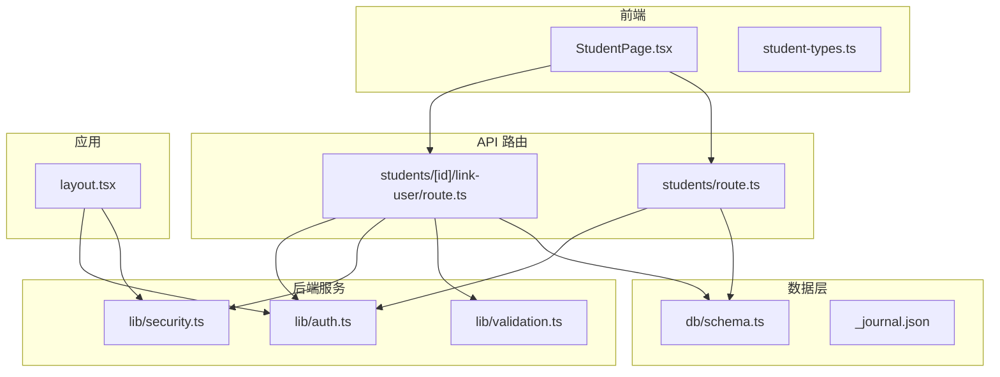
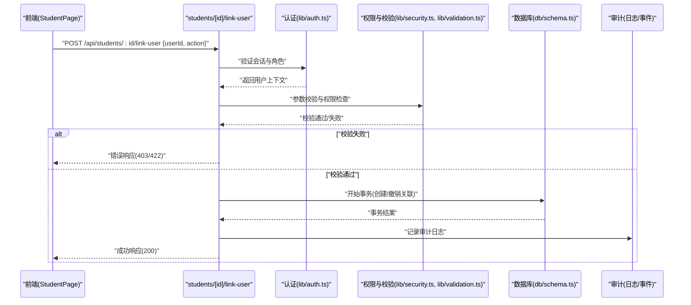
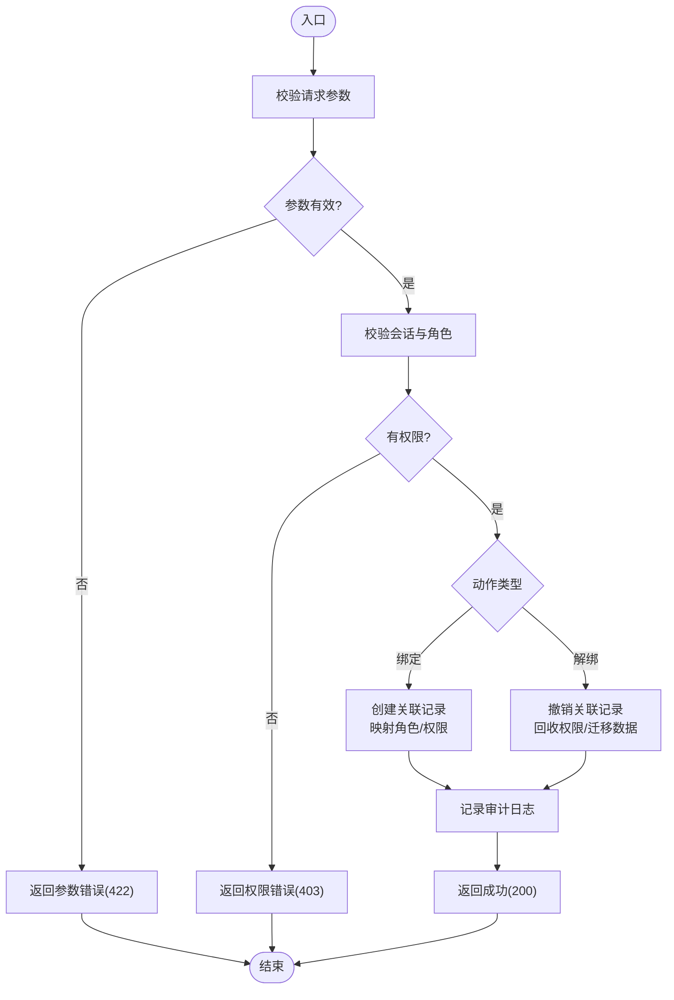
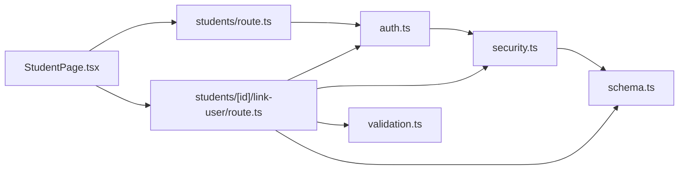

# 学生用户关联

<cite>
**本文引用的文件**   
- [app/api/students/[id]/link-user/route.ts](file://app/api/students/%5Bid%5D/link-user/route.ts)
- [app/api/students/route.ts](file://app/api/students/route.ts)
- [db/schema.ts](file://db/schema.ts)
- [lib/auth.ts](file://lib/auth.ts)
- [lib/security.ts](file://lib/security.ts)
- [lib/validation.ts](file://lib/validation.ts)
- [app/components/student/StudentPage.tsx](file://app/components/student/StudentPage.tsx)
- [app/components/student/student-types.ts](file://app/components/student/student-types.ts)
- [app/layout.tsx](file://app/layout.tsx)
- [drizzle-postgres/meta/_journal.json](file://drizzle-postgres/meta/_journal.json)
</cite>

## 目录
1. [简介](#简介)
2. [项目结构](#项目结构)
3. [核心组件](#核心组件)
4. [架构总览](#架构总览)
5. [详细组件分析](#详细组件分析)
6. [依赖关系分析](#依赖关系分析)
7. [性能考虑](#性能考虑)
8. [故障排除指南](#故障排除指南)
9. [结论](#结论)
10. [附录](#附录)

## 简介
本文件面向“学生用户关联”功能，系统性阐述学生账号与系统用户之间的绑定关系、权限继承与安全隔离机制；覆盖用户关联的创建、解除与权限同步逻辑；给出实现用户绑定、权限检查与会话管理的具体代码示例路径；解释多角色支持、权限矩阵与访问控制列表的实现思路；处理解绑时的数据迁移、权限回收与审计追踪；并提供最佳实践、安全注意事项与故障排除指南。

## 项目结构
围绕学生用户关联的核心代码分布在以下位置：
- API 路由层：学生关联接口与学生列表接口
- 数据模型与数据库迁移：Drizzle schema 与迁移记录
- 认证与授权：会话、鉴权与安全检查
- 前端交互：学生页面与类型定义
- 应用布局：全局上下文与权限注入

图表来源
- [app/components/student/StudentPage.tsx](file://app/components/student/StudentPage.tsx)
- [app/api/students/[id]/link-user/route.ts](file://app/api/students/%5Bid%5D/link-user/route.ts)
- [app/api/students/route.ts](file://app/api/students/route.ts)
- [lib/auth.ts](file://lib/auth.ts)
- [lib/security.ts](file://lib/security.ts)
- [lib/validation.ts](file://lib/validation.ts)
- [db/schema.ts](file://db/schema.ts)
- [drizzle-postgres/meta/_journal.json](file://drizzle-postgres/meta/_journal.json)
- [app/layout.tsx](file://app/layout.tsx)

章节来源
- [app/api/students/[id]/link-user/route.ts](file://app/api/students/%5Bid%5D/link-user/route.ts)
- [app/api/students/route.ts](file://app/api/students/route.ts)
- [db/schema.ts](file://db/schema.ts)
- [lib/auth.ts](file://lib/auth.ts)
- [lib/security.ts](file://lib/security.ts)
- [lib/validation.ts](file://lib/validation.ts)
- [app/components/student/StudentPage.tsx](file://app/components/student/StudentPage.tsx)
- [app/components/student/student-types.ts](file://app/components/student/student-types.ts)
- [app/layout.tsx](file://app/layout.tsx)
- [drizzle-postgres/meta/_journal.json](file://drizzle-postgres/meta/_journal.json)

## 核心组件
- 学生-用户关联接口：提供将系统用户与学生记录进行绑定或解绑的能力，包含参数校验、权限检查、事务性写入与审计日志。
- 学生列表接口：用于查询学生及其关联状态，支持按关联状态过滤。
- 认证与会话：基于会话令牌的身份识别，确保仅具备管理员或相关角色的请求可执行关联操作。
- 权限与安全：统一的权限判定与输入校验，防止越权与注入攻击。
- 数据模型：通过 Drizzle Schema 定义学生表、用户表及关联表（如存在），并配合迁移脚本保证一致性。
- 前端交互：在学生页面中触发绑定/解绑操作，展示当前关联状态与权限提示。

章节来源
- [app/api/students/[id]/link-user/route.ts](file://app/api/students/%5Bid%5D/link-user/route.ts)
- [app/api/students/route.ts](file://app/api/students/route.ts)
- [lib/auth.ts](file://lib/auth.ts)
- [lib/security.ts](file://lib/security.ts)
- [lib/validation.ts](file://lib/validation.ts)
- [db/schema.ts](file://db/schema.ts)
- [app/components/student/StudentPage.tsx](file://app/components/student/StudentPage.tsx)
- [app/components/student/student-types.ts](file://app/components/student/student-types.ts)

## 架构总览
学生用户关联的整体流程如下：
- 前端发起绑定/解绑请求，携带学生 ID 与目标系统用户 ID。
- API 路由层校验请求参数与当前会话身份，执行权限判定。
- 若通过校验，进入业务逻辑：创建或撤销关联，必要时进行权限同步与数据迁移。
- 持久化到数据库，记录审计日志。
- 返回结果给前端，更新 UI 状态。

图表来源
- [app/api/students/[id]/link-user/route.ts](file://app/api/students/%5Bid%5D/link-user/route.ts)
- [lib/auth.ts](file://lib/auth.ts)
- [lib/security.ts](file://lib/security.ts)
- [lib/validation.ts](file://lib/validation.ts)
- [db/schema.ts](file://db/schema.ts)

## 详细组件分析

### 学生-用户关联接口（students/[id]/link-user）
职责与流程：
- 接收学生 ID 与目标系统用户 ID，以及动作（绑定/解绑）。
- 校验请求体字段合法性（如必填、格式、范围）。
- 校验当前会话身份与角色权限（例如管理员或学生管理员）。
- 执行关联逻辑：
  - 绑定：建立学生与用户的关联记录，并将用户角色映射为学生角色，完成权限继承。
  - 解绑：撤销关联，回收学生侧权限，必要时迁移学生数据归属。
- 记录审计日志（操作人、时间、对象、动作、结果）。
- 返回统一响应结构。

权限继承与安全隔离：
- 绑定后，学生资源访问权限由系统用户角色派生，遵循最小权限原则。
- 解绑时，立即回收学生侧权限，避免残留访问能力。
- 所有敏感操作需二次确认与审计追踪。

图表来源
- [app/api/students/[id]/link-user/route.ts](file://app/api/students/%5Bid%5D/link-user/route.ts)
- [lib/validation.ts](file://lib/validation.ts)
- [lib/auth.ts](file://lib/auth.ts)
- [lib/security.ts](file://lib/security.ts)

章节来源
- [app/api/students/[id]/link-user/route.ts](file://app/api/students/%5Bid%5D/link-user/route.ts)
- [lib/validation.ts](file://lib/validation.ts)
- [lib/auth.ts](file://lib/auth.ts)
- [lib/security.ts](file://lib/security.ts)

### 学生列表接口（students）
职责与流程：
- 查询学生列表，支持按关联状态过滤（已绑定/未绑定）。
- 返回学生基本信息与关联标识（如已绑定用户 ID）。
- 受会话与角色保护，仅允许具备查看权限的用户访问。

章节来源
- [app/api/students/route.ts](file://app/api/students/route.ts)
- [lib/auth.ts](file://lib/auth.ts)
- [db/schema.ts](file://db/schema.ts)

### 数据模型与迁移（db/schema.ts 与 drizzle 迁移）
- 学生表：包含学生基础信息与可能的关联字段（如 user_id）。
- 用户表：系统用户信息、角色与权限集合。
- 关联表（可选）：显式维护学生与用户的绑定关系，便于多对多扩展与审计。
- 迁移脚本：确保数据库结构与版本一致，避免脏读与不一致。

建议的数据模型要点：
- 关联字段设置唯一约束，防止重复绑定。
- 外键约束保障引用完整性。
- 索引优化常见查询（如按 user_id、student_id 查询）。

章节来源
- [db/schema.ts](file://db/schema.ts)
- [drizzle-postgres/meta/_journal.json](file://drizzle-postgres/meta/_journal.json)

### 认证与会话（lib/auth.ts）
- 会话解析：从请求头或 Cookie 中提取会话令牌，解析出用户身份与角色。
- 权限判定：根据角色与资源路径判断是否允许操作。
- 安全策略：令牌过期、刷新、注销与会话清理。

章节来源
- [lib/auth.ts](file://lib/auth.ts)

### 权限与安全（lib/security.ts 与 lib/validation.ts）
- 权限矩阵：定义角色与资源的访问矩阵，支持细粒度控制。
- 访问控制列表（ACL）：在资源级附加 ACL，限制特定用户或角色访问。
- 输入校验：严格校验请求体与路径参数，防止注入与越权。

章节来源
- [lib/security.ts](file://lib/security.ts)
- [lib/validation.ts](file://lib/validation.ts)

### 前端交互（StudentPage.tsx 与 student-types.ts）
- 展示学生列表与关联状态。
- 触发绑定/解绑操作，显示加载与错误状态。
- 类型定义：明确学生、用户与关联数据结构，确保前后端一致性。

章节来源
- [app/components/student/StudentPage.tsx](file://app/components/student/StudentPage.tsx)
- [app/components/student/student-types.ts](file://app/components/student/student-types.ts)

### 应用布局与权限注入（layout.tsx）
- 全局注入用户上下文与权限信息。
- 为页面级权限守卫提供基础能力。

章节来源
- [app/layout.tsx](file://app/layout.tsx)

## 依赖关系分析
- 前端 StudentPage 依赖 students API 与类型定义。
- students API 依赖认证、权限、校验与数据库模型。
- 认证模块依赖会话存储与令牌验证。
- 权限模块依赖角色与资源矩阵配置。
- 数据层依赖 Drizzle 迁移以确保结构一致性。

图表来源
- [app/components/student/StudentPage.tsx](file://app/components/student/StudentPage.tsx)
- [app/api/students/route.ts](file://app/api/students/route.ts)
- [app/api/students/[id]/link-user/route.ts](file://app/api/students/%5Bid%5D/link-user/route.ts)
- [lib/auth.ts](file://lib/auth.ts)
- [lib/security.ts](file://lib/security.ts)
- [lib/validation.ts](file://lib/validation.ts)
- [db/schema.ts](file://db/schema.ts)

章节来源
- [app/components/student/StudentPage.tsx](file://app/components/student/StudentPage.tsx)
- [app/api/students/route.ts](file://app/api/students/route.ts)
- [app/api/students/[id]/link-user/route.ts](file://app/api/students/%5Bid%5D/link-user/route.ts)
- [lib/auth.ts](file://lib/auth.ts)
- [lib/security.ts](file://lib/security.ts)
- [lib/validation.ts](file://lib/validation.ts)
- [db/schema.ts](file://db/schema.ts)

## 性能考虑
- 数据库索引：为关联查询与过滤条件建立合适索引，减少全表扫描。
- 事务粒度：尽量缩小事务范围，避免长事务阻塞。
- 缓存策略：对频繁读取的学生列表与权限矩阵使用短期缓存。
- 批量操作：批量绑定/解绑时使用事务与分批提交，降低锁竞争。
- 审计日志异步化：将审计写入异步队列，避免阻塞主流程。

## 故障排除指南
常见问题与排查步骤：
- 权限不足（403）：检查当前会话角色与资源权限矩阵，确认是否具备管理员或学生管理员角色。
- 参数错误（422）：核对请求体字段是否完整且格式正确，参考校验规则。
- 重复绑定：检查关联表的唯一约束与业务逻辑，避免重复创建关联。
- 解绑失败：确认是否存在外键约束或依赖数据，必要时先迁移或删除依赖项。
- 会话失效：检查令牌有效期与刷新逻辑，确保前端正确传递会话信息。
- 审计缺失：确认审计日志写入是否成功，检查日志服务与权限。

章节来源
- [lib/validation.ts](file://lib/validation.ts)
- [lib/auth.ts](file://lib/auth.ts)
- [lib/security.ts](file://lib/security.ts)
- [db/schema.ts](file://db/schema.ts)

## 结论
学生用户关联功能通过清晰的 API 分层、严格的权限与安全校验、可靠的数据模型与迁移机制，实现了学生与系统用户的安全绑定与权限继承。建议在后续迭代中完善权限矩阵与 ACL 配置，增强审计与监控能力，提升批量操作的效率与稳定性。

## 附录
- 最佳实践
  - 始终使用最小权限原则分配角色与资源访问。
  - 对敏感操作启用二次确认与审计追踪。
  - 使用事务保证关联创建/撤销的原子性。
  - 定期审查权限矩阵与 ACL，及时回收冗余权限。
- 安全考虑
  - 严格校验输入，防止注入与越权。
  - 会话令牌加密存储与传输，设置合理过期时间。
  - 解绑后立即回收权限，避免残留访问。
- 示例路径（不展示具体代码内容）
  - 用户绑定：[app/api/students/[id]/link-user/route.ts](file://app/api/students/%5Bid%5D/link-user/route.ts)
  - 权限检查：[lib/security.ts](file://lib/security.ts)
  - 会话管理：[lib/auth.ts](file://lib/auth.ts)
  - 数据模型：[db/schema.ts](file://db/schema.ts)
  - 前端交互：[app/components/student/StudentPage.tsx](file://app/components/student/StudentPage.tsx)