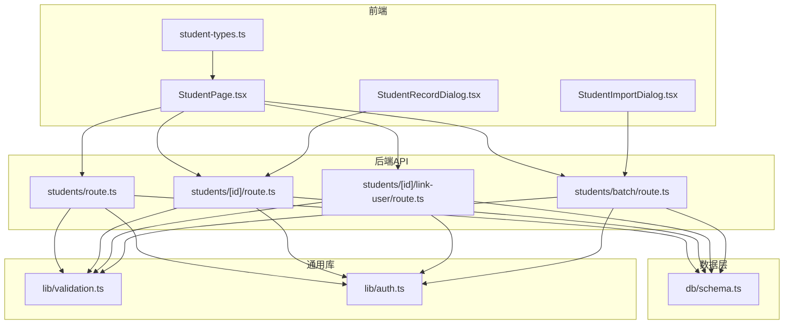
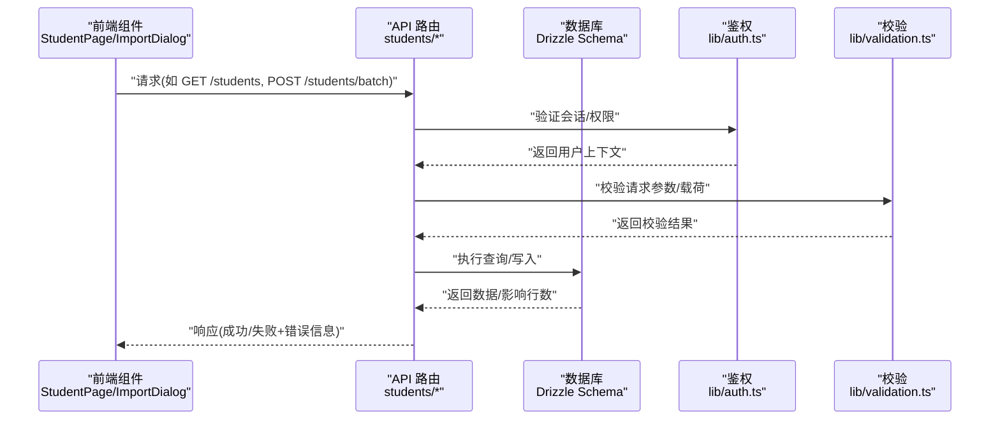
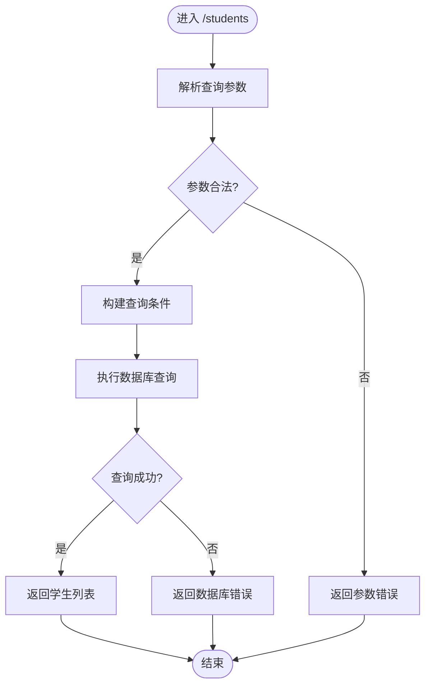
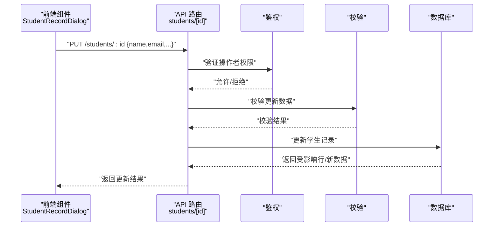
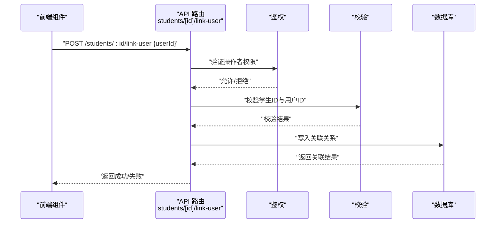
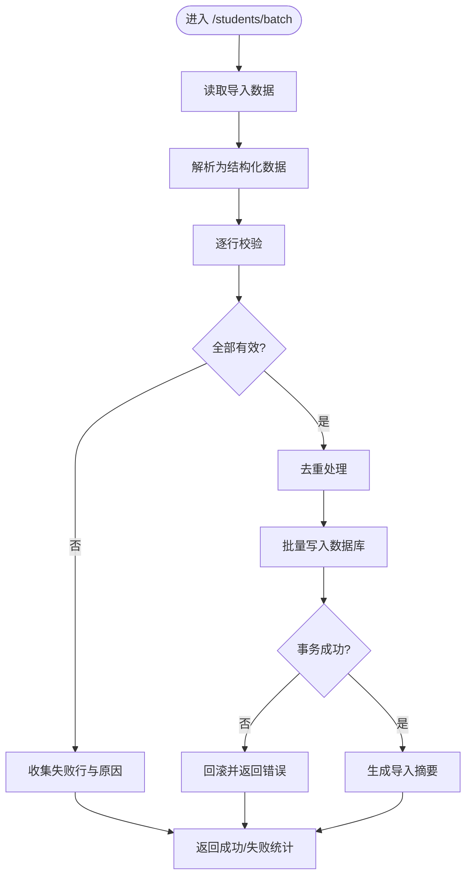
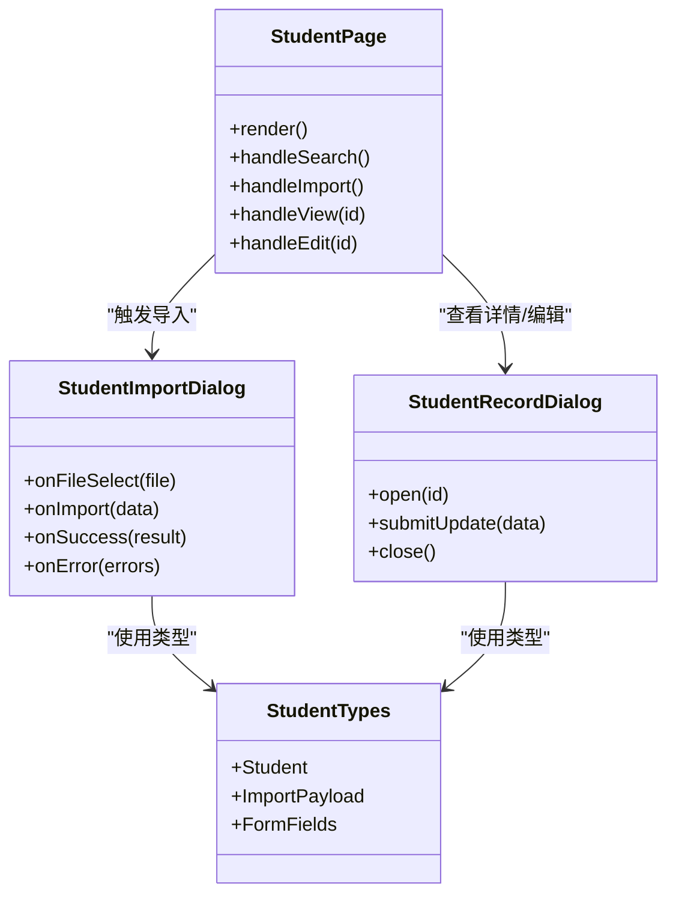
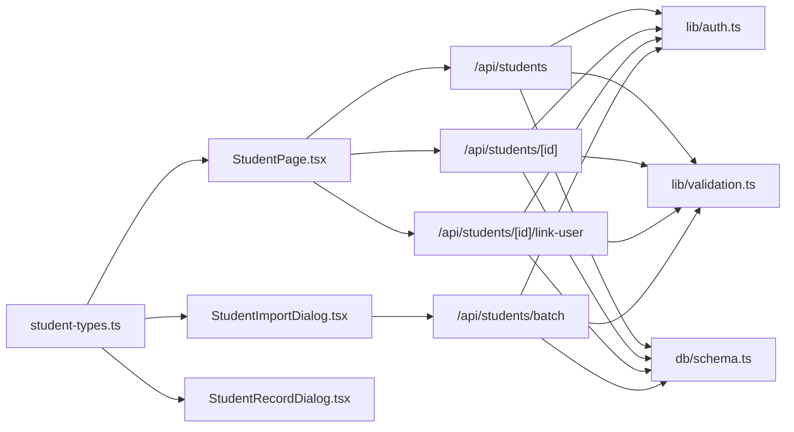

# 学生管理模块

<cite>
**本文引用的文件**   
- [app/api/students/route.ts](file://app/api/students/route.ts)
- [app/api/students/[id]/route.ts](file://app/api/students/[id]/route.ts)
- [app/api/students/[id]/link-user/route.ts](file://app/api/students/[id]/link-user/route.ts)
- [app/api/students/batch/route.ts](file://app/api/students/batch/route.ts)
- [app/components/student/StudentPage.tsx](file://app/components/student/StudentPage.tsx)
- [app/components/student/StudentImportDialog.tsx](file://app/components/student/StudentImportDialog.tsx)
- [app/components/student/StudentRecordDialog.tsx](file://app/components/student/StudentRecordDialog.tsx)
- [app/components/student/student-types.ts](file://app/components/student/student-types.ts)
- [db/schema.ts](file://db/schema.ts)
- [lib/validation.ts](file://lib/validation.ts)
- [lib/auth.ts](file://lib/auth.ts)
- [tests/fixtures/students-valid.csv](file://tests/fixtures/students-valid.csv)
</cite>

## 目录
1. [简介](#简介)
2. [项目结构](#项目结构)
3. [核心组件](#核心组件)
4. [架构总览](#架构总览)
5. [详细组件分析](#详细组件分析)
6. [依赖关系分析](#依赖关系分析)
7. [性能考虑](#性能考虑)
8. [故障排查指南](#故障排查指南)
9. [结论](#结论)
10. [附录](#附录)

## 简介
本模块面向高校学生工作场景，提供学生信息管理、批量导入、学生记录查看与编辑、以及学生与系统用户的关联能力。后端基于 Next.js API Routes，数据持久化通过 Drizzle ORM 映射到数据库；前端以 React 组件组织页面与交互流程，包含导入对话框、学生列表页与学生记录对话框等。文档将围绕接口契约、领域模型、调用链路与错误处理展开，帮助初学者快速上手，并为有经验的开发者提供深入的技术细节。

## 项目结构
学生管理相关代码主要分布在以下位置：
- API 路由：app/api/students/*
- 前端组件：app/components/student/*
- 数据模型与迁移：db/schema.ts 与 drizzle-postgres 迁移脚本
- 校验与鉴权：lib/validation.ts、lib/auth.ts
- 测试样例数据：tests/fixtures/students-valid.csv

图表来源
- [app/components/student/StudentPage.tsx](file://app/components/student/StudentPage.tsx)
- [app/components/student/StudentImportDialog.tsx](file://app/components/student/StudentImportDialog.tsx)
- [app/components/student/StudentRecordDialog.tsx](file://app/components/student/StudentRecordDialog.tsx)
- [app/components/student/student-types.ts](file://app/components/student/student-types.ts)
- [app/api/students/route.ts](file://app/api/students/route.ts)
- [app/api/students/[id]/route.ts](file://app/api/students/[id]/route.ts)
- [app/api/students/[id]/link-user/route.ts](file://app/api/students/[id]/link-user/route.ts)
- [app/api/students/batch/route.ts](file://app/api/students/batch/route.ts)
- [db/schema.ts](file://db/schema.ts)
- [lib/validation.ts](file://lib/validation.ts)
- [lib/auth.ts](file://lib/auth.ts)

章节来源
- [app/api/students/route.ts](file://app/api/students/route.ts)
- [app/api/students/[id]/route.ts](file://app/api/students/[id]/route.ts)
- [app/api/students/[id]/link-user/route.ts](file://app/api/students/[id]/link-user/route.ts)
- [app/api/students/batch/route.ts](file://app/api/students/batch/route.ts)
- [app/components/student/StudentPage.tsx](file://app/components/student/StudentPage.tsx)
- [app/components/student/StudentImportDialog.tsx](file://app/components/student/StudentImportDialog.tsx)
- [app/components/student/StudentRecordDialog.tsx](file://app/components/student/StudentRecordDialog.tsx)
- [app/components/student/student-types.ts](file://app/components/student/student-types.ts)
- [db/schema.ts](file://db/schema.ts)
- [lib/validation.ts](file://lib/validation.ts)
- [lib/auth.ts](file://lib/auth.ts)

## 核心组件
- 学生列表与查询（GET /api/students）
  - 支持分页、排序、筛选等常见参数
  - 返回学生基础信息集合
- 学生详情与更新（GET/PUT /api/students/[id]）
  - 获取单个学生详细信息
  - 更新学生字段，含输入校验与权限控制
- 学生-用户关联（POST /api/students/[id]/link-user）
  - 将系统用户与学生绑定，建立一对一或一对多关系（依领域模型而定）
- 批量导入（POST /api/students/batch）
  - 接收 CSV/JSON 数据，进行解析、校验、去重与入库
  - 返回导入结果统计与失败明细

章节来源
- [app/api/students/route.ts](file://app/api/students/route.ts)
- [app/api/students/[id]/route.ts](file://app/api/students/[id]/route.ts)
- [app/api/students/[id]/link-user/route.ts](file://app/api/students/[id]/link-user/route.ts)
- [app/api/students/batch/route.ts](file://app/api/students/batch/route.ts)

## 架构总览
学生管理模块采用前后端分离的 RESTful 风格设计：
- 前端组件负责表单与交互，发起 HTTP 请求至 API 路由
- API 路由负责鉴权、参数校验、业务编排与数据访问
- 数据层使用 Drizzle ORM 映射数据库表结构，确保类型安全与一致性

图表来源
- [app/api/students/route.ts](file://app/api/students/route.ts)
- [app/api/students/batch/route.ts](file://app/api/students/batch/route.ts)
- [lib/auth.ts](file://lib/auth.ts)
- [lib/validation.ts](file://lib/validation.ts)
- [db/schema.ts](file://db/schema.ts)

## 详细组件分析

### 学生列表与查询（GET /api/students）
- 功能要点
  - 分页：page、pageSize
  - 排序：sortBy、sortOrder
  - 筛选：关键字、学院、年级、状态等
  - 返回字段：学生ID、姓名、学号、学院、年级、状态、创建时间等
- 典型调用流程
  - 前端构造查询参数并发起请求
  - 后端校验参数合法性
  - 根据条件构建查询并返回结果集

图表来源
- [app/api/students/route.ts](file://app/api/students/route.ts)
- [lib/validation.ts](file://lib/validation.ts)
- [db/schema.ts](file://db/schema.ts)

章节来源
- [app/api/students/route.ts](file://app/api/students/route.ts)
- [lib/validation.ts](file://lib/validation.ts)

### 学生详情与更新（GET/PUT /api/students/[id]）
- 功能要点
  - 获取指定学生详细信息
  - 更新学生字段，需具备相应权限
  - 对必填字段、格式、取值范围进行校验
- 典型调用流程
  - 前端传入学生ID与更新数据
  - 后端校验ID有效性及更新载荷
  - 执行更新并返回最新数据

图表来源
- [app/api/students/[id]/route.ts](file://app/api/students/[id]/route.ts)
- [lib/auth.ts](file://lib/auth.ts)
- [lib/validation.ts](file://lib/validation.ts)
- [db/schema.ts](file://db/schema.ts)

章节来源
- [app/api/students/[id]/route.ts](file://app/api/students/[id]/route.ts)
- [lib/validation.ts](file://lib/validation.ts)

### 学生-用户关联（POST /api/students/[id]/link-user）
- 功能要点
  - 将系统用户与学生进行绑定，便于后续权限与审计
  - 支持解除关联（视实现而定）
  - 需要严格的权限校验，避免越权操作
- 典型调用流程
  - 前端传入学生ID与目标用户ID
  - 后端校验双方存在性与关联规则
  - 写入关联关系并返回结果

图表来源
- [app/api/students/[id]/link-user/route.ts](file://app/api/students/[id]/link-user/route.ts)
- [lib/auth.ts](file://lib/auth.ts)
- [lib/validation.ts](file://lib/validation.ts)
- [db/schema.ts](file://db/schema.ts)

章节来源
- [app/api/students/[id]/link-user/route.ts](file://app/api/students/[id]/link-user/route.ts)
- [lib/validation.ts](file://lib/validation.ts)

### 批量导入（POST /api/students/batch）
- 功能要点
  - 支持 CSV/JSON 格式导入
  - 解析、清洗、校验、去重与批量写入
  - 返回导入统计（成功数、失败数）与失败明细（行号、原因）
- 典型调用流程
  - 前端上传文件或提交 JSON 数据
  - 后端解析并逐行校验
  - 批量插入或更新，记录失败原因
  - 汇总结果返回

图表来源
- [app/api/students/batch/route.ts](file://app/api/students/batch/route.ts)
- [lib/validation.ts](file://lib/validation.ts)
- [db/schema.ts](file://db/schema.ts)

章节来源
- [app/api/students/batch/route.ts](file://app/api/students/batch/route.ts)
- [lib/validation.ts](file://lib/validation.ts)

### 前端组件与类型定义
- StudentPage.tsx
  - 展示学生列表、搜索、分页、排序
  - 触发导入、查看详情、编辑等操作
- StudentImportDialog.tsx
  - 提供文件选择、预览、导入进度与结果反馈
- StudentRecordDialog.tsx
  - 打开学生详情与编辑表单，提交更新
- student-types.ts
  - 定义学生实体、导入数据结构、表单字段类型

图表来源
- [app/components/student/StudentPage.tsx](file://app/components/student/StudentPage.tsx)
- [app/components/student/StudentImportDialog.tsx](file://app/components/student/StudentImportDialog.tsx)
- [app/components/student/StudentRecordDialog.tsx](file://app/components/student/StudentRecordDialog.tsx)
- [app/components/student/student-types.ts](file://app/components/student/student-types.ts)

章节来源
- [app/components/student/StudentPage.tsx](file://app/components/student/StudentPage.tsx)
- [app/components/student/StudentImportDialog.tsx](file://app/components/student/StudentImportDialog.tsx)
- [app/components/student/StudentRecordDialog.tsx](file://app/components/student/StudentRecordDialog.tsx)
- [app/components/student/student-types.ts](file://app/components/student/student-types.ts)

## 依赖关系分析
- 组件耦合
  - 前端组件通过类型定义保持强约束，降低接口变更风险
  - API 路由统一依赖鉴权与校验模块，保证一致的安全策略
- 外部依赖
  - Drizzle ORM 用于数据库访问与类型安全
  - 标准 HTTP 协议与 Next.js 路由机制
- 潜在循环依赖
  - 当前分层清晰，未见明显循环依赖

图表来源
- [app/components/student/student-types.ts](file://app/components/student/student-types.ts)
- [app/components/student/StudentPage.tsx](file://app/components/student/StudentPage.tsx)
- [app/components/student/StudentImportDialog.tsx](file://app/components/student/StudentImportDialog.tsx)
- [app/components/student/StudentRecordDialog.tsx](file://app/components/student/StudentRecordDialog.tsx)
- [app/api/students/route.ts](file://app/api/students/route.ts)
- [app/api/students/[id]/route.ts](file://app/api/students/[id]/route.ts)
- [app/api/students/[id]/link-user/route.ts](file://app/api/students/[id]/link-user/route.ts)
- [app/api/students/batch/route.ts](file://app/api/students/batch/route.ts)
- [lib/auth.ts](file://lib/auth.ts)
- [lib/validation.ts](file://lib/validation.ts)
- [db/schema.ts](file://db/schema.ts)

章节来源
- [app/components/student/student-types.ts](file://app/components/student/student-types.ts)
- [app/api/students/route.ts](file://app/api/students/route.ts)
- [app/api/students/[id]/route.ts](file://app/api/students/[id]/route.ts)
- [app/api/students/[id]/link-user/route.ts](file://app/api/students/[id]/link-user/route.ts)
- [app/api/students/batch/route.ts](file://app/api/students/batch/route.ts)
- [lib/auth.ts](file://lib/auth.ts)
- [lib/validation.ts](file://lib/validation.ts)
- [db/schema.ts](file://db/schema.ts)

## 性能考虑
- 批量导入优化
  - 使用事务减少多次写入开销
  - 分批写入与流式解析避免内存峰值
  - 预校验与去重减少无效写入
- 查询性能
  - 合理索引：学号、姓名、学院、年级等常用筛选字段
  - 分页与懒加载提升列表渲染性能
- 并发与限流
  - 对导入接口实施速率限制，防止滥用
  - 长耗时任务可异步化处理（队列/Worker）

[本节为通用指导，不直接分析具体文件]

## 故障排查指南
- 常见问题
  - 参数校验失败：检查必填字段、格式、取值范围
  - 权限不足：确认当前用户角色与资源访问策略
  - 导入失败：查看失败明细中的行号与原因，修正数据后重试
  - 数据库异常：检查连接、事务与约束冲突
- 定位方法
  - 查看 API 返回的错误码与消息
  - 启用调试日志，追踪请求链路
  - 核对 schema 定义与迁移是否一致

章节来源
- [lib/validation.ts](file://lib/validation.ts)
- [lib/auth.ts](file://lib/auth.ts)
- [db/schema.ts](file://db/schema.ts)

## 结论
学生管理模块通过清晰的 API 设计与严谨的校验与鉴权机制，提供了稳定的学生信息管理、批量导入与用户关联能力。前端组件与类型定义保证了良好的用户体验与开发体验。建议在后续迭代中持续完善索引策略、错误提示与监控告警，以提升系统的可用性与可维护性。

[本节为总结性内容，不直接分析具体文件]

## 附录

### 接口定义与参数说明
- GET /api/students
  - 查询参数：page、pageSize、sortBy、sortOrder、keyword、college、grade、status
  - 返回：学生列表数组、总数、分页信息
- GET /api/students/:id
  - 路径参数：id（学生ID）
  - 返回：学生详细信息对象
- PUT /api/students/:id
  - 路径参数：id（学生ID）
  - 请求体：可更新字段集合（姓名、学号、学院、年级、状态等）
  - 返回：更新后的学生对象
- POST /api/students/:id/link-user
  - 路径参数：id（学生ID）
  - 请求体：userId（系统用户ID）
  - 返回：关联结果（成功/失败与原因）
- POST /api/students/batch
  - 请求体：CSV/JSON 数据
  - 返回：导入摘要（成功数、失败数、失败明细）

章节来源
- [app/api/students/route.ts](file://app/api/students/route.ts)
- [app/api/students/[id]/route.ts](file://app/api/students/[id]/route.ts)
- [app/api/students/[id]/link-user/route.ts](file://app/api/students/[id]/link-user/route.ts)
- [app/api/students/batch/route.ts](file://app/api/students/batch/route.ts)

### 领域模型与数据表
- 学生实体
  - 字段：id、name、studentNo、college、grade、status、createdAt、updatedAt
- 用户-学生关联
  - 字段：studentId、userId、createdAt
- 导入数据模型
  - 字段：name、studentNo、college、grade、status（示例）

章节来源
- [db/schema.ts](file://db/schema.ts)
- [app/components/student/student-types.ts](file://app/components/student/student-types.ts)

### 批量导入样例数据
- 参考测试夹具 students-valid.csv，了解期望的数据结构与字段顺序

章节来源
- [tests/fixtures/students-valid.csv](file://tests/fixtures/students-valid.csv)