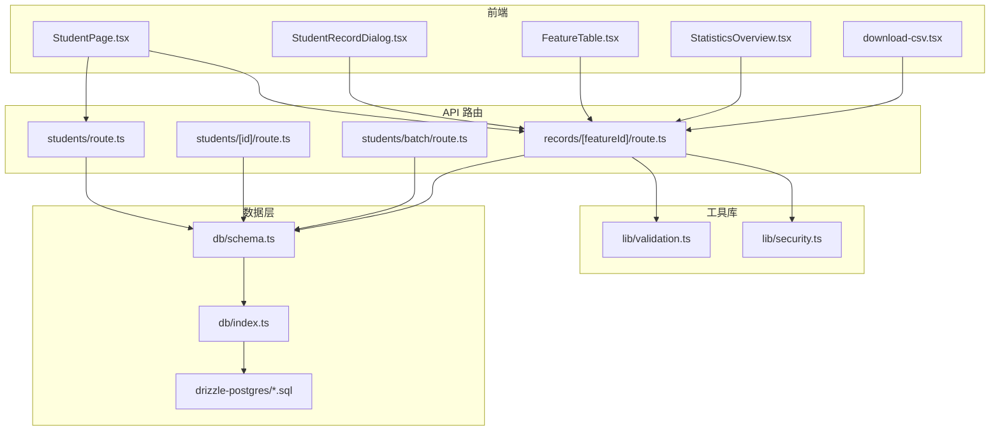
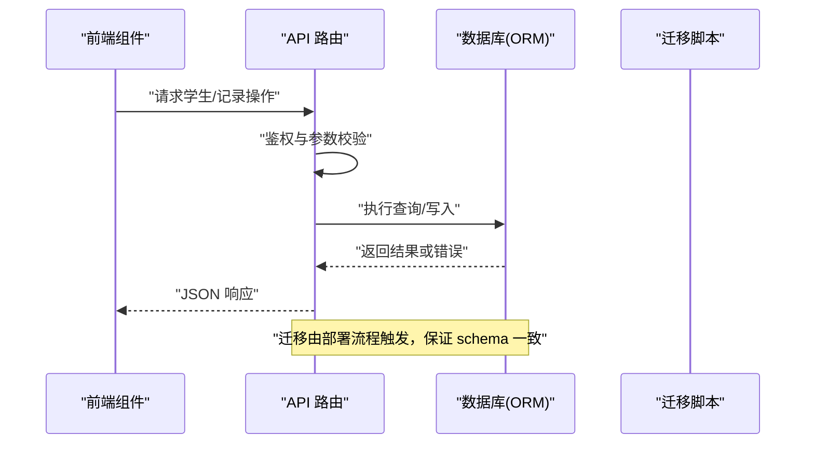
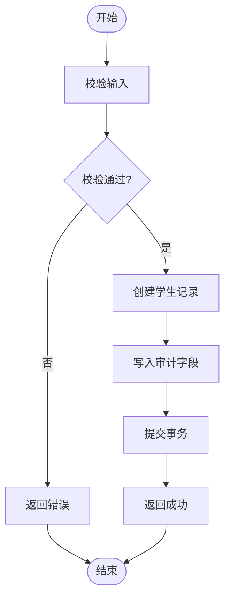
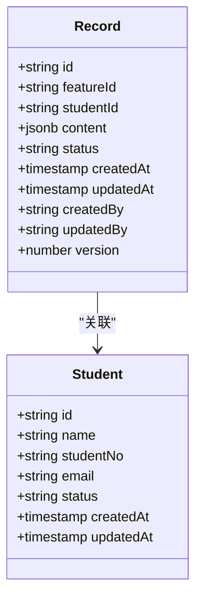
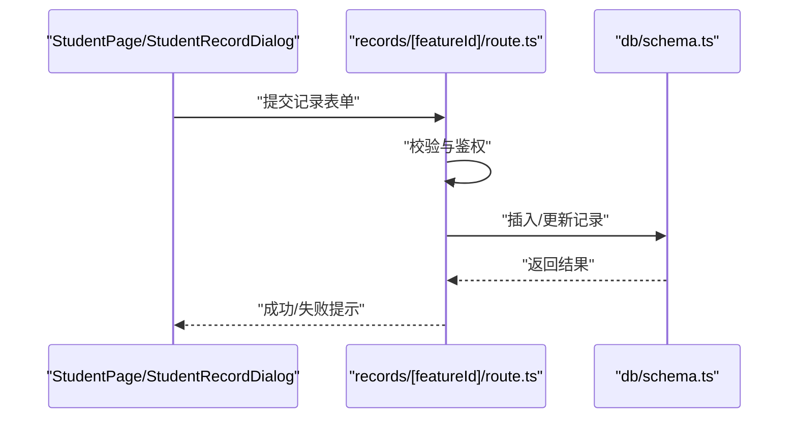
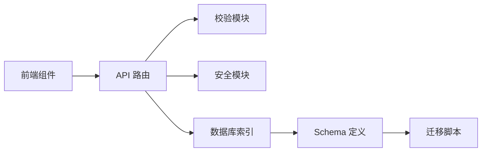

# 学生记录管理

<cite>
**本文引用的文件**   
- [app/api/students/route.ts](file://app/api/students/route.ts)
- [app/api/students/[id]/route.ts](file://app/api/students/[id]/route.ts)
- [app/api/students/batch/route.ts](file://app/api/students/batch/route.ts)
- [app/api/records/[featureId]/route.ts](file://app/api/records/[featureId]/route.ts)
- [db/schema.ts](file://db/schema.ts)
- [db/index.ts](file://db/index.ts)
- [drizzle-postgres/meta/_journal.json](file://drizzle-postgres/meta/_journal.json)
- [drizzle-postgres/0000_fine_psylocke.sql](file://drizzle-postgres/0000_fine_psylocke.sql)
- [drizzle-postgres/0001_thin_queen_noir.sql](file://drizzle-postgres/0001_thin_queen_noir.sql)
- [drizzle-postgres/0002_crazy_ravenous.sql](file://drizzle-postgres/0002_crazy_ravenous.sql)
- [drizzle-postgres/0003_fine_quentin_quire.sql](file://drizzle-postgres/0003_fine_quentin_quire.sql)
- [lib/validation.ts](file://lib/validation.ts)
- [lib/security.ts](file://lib/security.ts)
- [app/components/student/StudentPage.tsx](file://app/components/student/StudentPage.tsx)
- [app/components/student/StudentRecordDialog.tsx](file://app/components/student/StudentRecordDialog.tsx)
- [app/components/student/student-types.ts](file://app/components/student/student-types.ts)
- [app/components/generic/FeatureTable.tsx](file://app/components/generic/FeatureTable.tsx)
- [app/components/generic/StatisticsOverview.tsx](file://app/components/generic/StatisticsOverview.tsx)
- [app/components/shared/download-csv.tsx](file://app/components/shared/download-csv.tsx)
- [app/feature-metadata.ts](file://app/feature-metadata.ts)
- [app/system-data.ts](file://app/system-data.ts)
</cite>

## 目录
1. [简介](#简介)
2. [项目结构](#项目结构)
3. [核心组件](#核心组件)
4. [架构总览](#架构总览)
5. [详细组件分析](#详细组件分析)
6. [依赖关系分析](#依赖关系分析)
7. [性能考量](#性能考量)
8. [故障排查指南](#故障排查指南)
9. [结论](#结论)
10. [附录](#附录)

## 简介
本文件面向“学生记录管理”功能，系统性阐述学生档案、成绩记录、行为记录等记录类型的数据结构、CRUD 操作与关联关系；定义记录类型、字段规范与数据验证规则；提供创建、查询、更新、删除的具体示例路径；说明版本控制、审计日志与数据完整性检查；并覆盖历史记录的回溯、归档与清理策略，以及数据导出、报表生成与统计分析能力。

## 项目结构
围绕学生记录管理的代码主要分布在以下位置：
- API 层：学生与记录的 REST 路由
- 数据层：数据库 schema 与迁移脚本
- 前端组件：学生页面、记录对话框、通用表格与统计概览
- 工具库：校验与安全模块

图表来源
- [app/components/student/StudentPage.tsx](file://app/components/student/StudentPage.tsx)
- [app/components/student/StudentRecordDialog.tsx](file://app/components/student/StudentRecordDialog.tsx)
- [app/components/generic/FeatureTable.tsx](file://app/components/generic/FeatureTable.tsx)
- [app/components/generic/StatisticsOverview.tsx](file://app/components/generic/StatisticsOverview.tsx)
- [app/components/shared/download-csv.tsx](file://app/components/shared/download-csv.tsx)
- [app/api/students/route.ts](file://app/api/students/route.ts)
- [app/api/students/[id]/route.ts](file://app/api/students/[id]/route.ts)
- [app/api/students/batch/route.ts](file://app/api/students/batch/route.ts)
- [app/api/records/[featureId]/route.ts](file://app/api/records/[featureId]/route.ts)
- [db/schema.ts](file://db/schema.ts)
- [db/index.ts](file://db/index.ts)
- [drizzle-postgres/0000_fine_psylocke.sql](file://drizzle-postgres/0000_fine_psylocke.sql)
- [drizzle-postgres/0001_thin_queen_noir.sql](file://drizzle-postgres/0001_thin_queen_noir.sql)
- [drizzle-postgres/0002_crazy_ravenous.sql](file://drizzle-postgres/0002_crazy_ravenous.sql)
- [drizzle-postgres/0003_fine_quentin_quire.sql](file://drizzle-postgres/0003_fine_quentin_quire.sql)

章节来源
- [app/api/students/route.ts](file://app/api/students/route.ts)
- [app/api/students/[id]/route.ts](file://app/api/students/[id]/route.ts)
- [app/api/students/batch/route.ts](file://app/api/students/batch/route.ts)
- [app/api/records/[featureId]/route.ts](file://app/api/records/[featureId]/route.ts)
- [db/schema.ts](file://db/schema.ts)
- [db/index.ts](file://db/index.ts)

## 核心组件
- 学生档案（学生实体）
  - 职责：维护学生的基础信息、状态与关联标识
  - 关键能力：创建、查询、更新、删除、批量导入、用户绑定
- 记录中心（按 featureId 多态记录）
  - 职责：统一承载成绩、行为、申请、业务、配置、审核、归档等多类记录
  - 关键能力：按类型增删改查、分页筛选、导出、统计
- 数据模型与迁移
  - 职责：通过 Drizzle ORM 定义表结构与约束，SQL 迁移保障一致性
- 校验与安全
  - 职责：输入校验、权限与访问控制、敏感数据处理

章节来源
- [app/api/students/route.ts](file://app/api/students/route.ts)
- [app/api/students/[id]/route.ts](file://app/api/students/[id]/route.ts)
- [app/api/students/batch/route.ts](file://app/api/students/batch/route.ts)
- [app/api/records/[featureId]/route.ts](file://app/api/records/[featureId]/route.ts)
- [db/schema.ts](file://db/schema.ts)
- [db/index.ts](file://db/index.ts)
- [lib/validation.ts](file://lib/validation.ts)
- [lib/security.ts](file://lib/security.ts)

## 架构总览
系统采用前后端分离的 Next.js 应用，API 路由暴露 REST 接口，数据层使用 Drizzle ORM + PostgreSQL，前端通过组件调用 API 完成学生与记录的 CRUD、导出与统计。

图表来源
- [app/api/students/route.ts](file://app/api/students/route.ts)
- [app/api/records/[featureId]/route.ts](file://app/api/records/[featureId]/route.ts)
- [db/index.ts](file://db/index.ts)
- [drizzle-postgres/meta/_journal.json](file://drizzle-postgres/meta/_journal.json)

## 详细组件分析

### 学生档案（学生实体）
- 数据结构要点
  - 主键：唯一标识
  - 基本信息：姓名、学号、班级、联系方式等
  - 状态与时间戳：创建/更新时间、当前状态
  - 关联：与用户账户的绑定关系
- 字段规范与校验
  - 必填字段、长度限制、格式校验（如邮箱、手机号）
  - 唯一性约束（学号、邮箱等）
- CRUD 操作
  - 创建：POST /api/students
  - 查询：GET /api/students（支持分页、筛选）
  - 更新：PATCH/PUT /api/students/:id
  - 删除：DELETE /api/students/:id
  - 批量导入：POST /api/students/batch
  - 用户绑定：POST /api/students/:id/link-user
- 数据完整性与审计
  - 外键约束、非空约束、唯一约束
  - 审计字段（创建人、修改人、时间戳）
- 版本控制与回溯
  - 建议引入版本号字段与快照表，用于变更追踪
  - 结合迁移脚本确保历史数据兼容

章节来源
- [app/api/students/route.ts](file://app/api/students/route.ts)
- [app/api/students/[id]/route.ts](file://app/api/students/[id]/route.ts)
- [app/api/students/batch/route.ts](file://app/api/students/batch/route.ts)
- [db/schema.ts](file://db/schema.ts)
- [lib/validation.ts](file://lib/validation.ts)

### 记录中心（按 featureId 的多态记录）
- 记录类型定义
  - 成绩记录、行为记录、申请记录、业务记录、配置记录、审核记录、归档记录等
  - 通过 featureId 区分类型，统一存储与处理
- 数据结构要点
  - 主键、类型标识（featureId）、关联对象（如学生ID）
  - 内容字段（JSON/结构化字段）、状态、时间戳
  - 审计字段（创建/修改人、时间）、版本字段
- 字段规范与校验
  - 类型枚举校验、必填字段、数值范围、日期格式
  - JSON 内容结构的 Schema 校验
- CRUD 操作
  - 创建：POST /api/records/:featureId
  - 查询：GET /api/records/:featureId（分页、筛选、排序）
  - 更新：PATCH/PUT /api/records/:featureId/:id
  - 删除：DELETE /api/records/:featureId/:id
- 数据完整性与审计
  - 外键约束（关联学生/用户）
  - 审计日志（谁在何时做了什么）
- 版本控制与回溯
  - 版本号递增、变更记录表
  - 支持历史版本对比与回滚
- 归档与清理
  - 归档标记、归档时间、归档存储
  - 定期清理过期或冗余数据

图表来源
- [db/schema.ts](file://db/schema.ts)
- [app/api/records/[featureId]/route.ts](file://app/api/records/[featureId]/route.ts)

章节来源
- [app/api/records/[featureId]/route.ts](file://app/api/records/[featureId]/route.ts)
- [db/schema.ts](file://db/schema.ts)
- [lib/validation.ts](file://lib/validation.ts)

### 前端交互与展示
- 学生页面
  - 列表展示、搜索筛选、分页、导出 CSV
- 记录对话框
  - 新增/编辑记录、表单校验、提交反馈
- 通用表格与统计
  - 动态列配置、聚合统计、图表展示

图表来源
- [app/components/student/StudentPage.tsx](file://app/components/student/StudentPage.tsx)
- [app/components/student/StudentRecordDialog.tsx](file://app/components/student/StudentRecordDialog.tsx)
- [app/api/records/[featureId]/route.ts](file://app/api/records/[featureId]/route.ts)
- [db/schema.ts](file://db/schema.ts)

章节来源
- [app/components/student/StudentPage.tsx](file://app/components/student/StudentPage.tsx)
- [app/components/student/StudentRecordDialog.tsx](file://app/components/student/StudentRecordDialog.tsx)
- [app/components/generic/FeatureTable.tsx](file://app/components/generic/FeatureTable.tsx)
- [app/components/generic/StatisticsOverview.tsx](file://app/components/generic/StatisticsOverview.tsx)
- [app/components/shared/download-csv.tsx](file://app/components/shared/download-csv.tsx)

## 依赖关系分析
- 组件耦合
  - 前端组件依赖 API 路由，API 路由依赖数据库 schema
  - 校验与安全模块被 API 路由复用
- 外部依赖
  - Drizzle ORM 与 PostgreSQL
  - 迁移脚本管理 schema 演进
- 潜在循环依赖
  - 避免组件直接依赖数据库，保持分层清晰

图表来源
- [app/components/student/StudentPage.tsx](file://app/components/student/StudentPage.tsx)
- [app/api/students/route.ts](file://app/api/students/route.ts)
- [app/api/records/[featureId]/route.ts](file://app/api/records/[featureId]/route.ts)
- [db/index.ts](file://db/index.ts)
- [db/schema.ts](file://db/schema.ts)
- [drizzle-postgres/meta/_journal.json](file://drizzle-postgres/meta/_journal.json)

章节来源
- [db/index.ts](file://db/index.ts)
- [db/schema.ts](file://db/schema.ts)
- [drizzle-postgres/meta/_journal.json](file://drizzle-postgres/meta/_journal.json)

## 性能考量
- 查询优化
  - 合理使用索引（如学生学号、记录类型、时间戳）
  - 分页与过滤减少数据传输量
- 写入优化
  - 批量导入使用事务与批量插入
  - 避免频繁小写操作
- 缓存策略
  - 对热点统计数据使用缓存（如统计概览）
- 资源管理
  - 连接池配置、超时设置、错误重试

[本节为通用指导，不直接分析具体文件]

## 故障排查指南
- 常见错误
  - 参数校验失败：检查必填字段与格式
  - 权限不足：确认用户角色与访问控制
  - 数据冲突：唯一约束冲突、外键约束失败
- 调试步骤
  - 查看 API 响应与错误码
  - 检查数据库约束与索引
  - 核对迁移状态与 schema 一致性
- 日志与审计
  - 启用审计日志，定位问题发生时间与操作人
  - 使用版本字段进行变更追踪

章节来源
- [lib/validation.ts](file://lib/validation.ts)
- [lib/security.ts](file://lib/security.ts)
- [db/schema.ts](file://db/schema.ts)

## 结论
学生记录管理功能通过统一的记录中心与标准化的数据模型，实现了学生档案与多种记录类型的集中化管理。借助严格的校验与安全控制、完善的审计与版本控制、以及灵活的导出与统计能力，系统能够支撑复杂的学生事务场景。建议在后续迭代中持续完善数据质量监控、性能调优与用户体验优化。

[本节为总结，不直接分析具体文件]

## 附录
- 数据导出
  - CSV 导出：通过下载组件实现批量导出
- 报表与统计
  - 统计概览组件提供聚合指标与可视化
- 迁移与版本
  - 迁移脚本与元数据确保 schema 演进可追溯

章节来源
- [app/components/shared/download-csv.tsx](file://app/components/shared/download-csv.tsx)
- [app/components/generic/StatisticsOverview.tsx](file://app/components/generic/StatisticsOverview.tsx)
- [drizzle-postgres/meta/_journal.json](file://drizzle-postgres/meta/_journal.json)
- [drizzle-postgres/0000_fine_psylocke.sql](file://drizzle-postgres/0000_fine_psylocke.sql)
- [drizzle-postgres/0001_thin_queen_noir.sql](file://drizzle-postgres/0001_thin_queen_noir.sql)
- [drizzle-postgres/0002_crazy_ravenous.sql](file://drizzle-postgres/0002_crazy_ravenous.sql)
- [drizzle-postgres/0003_fine_quentin_quire.sql](file://drizzle-postgres/0003_fine_quentin_quire.sql)