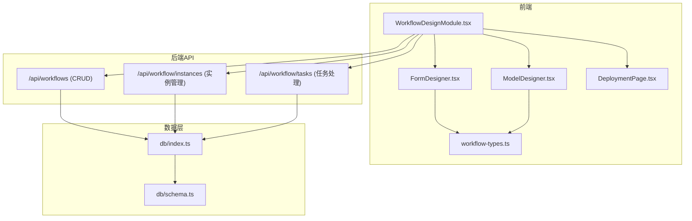
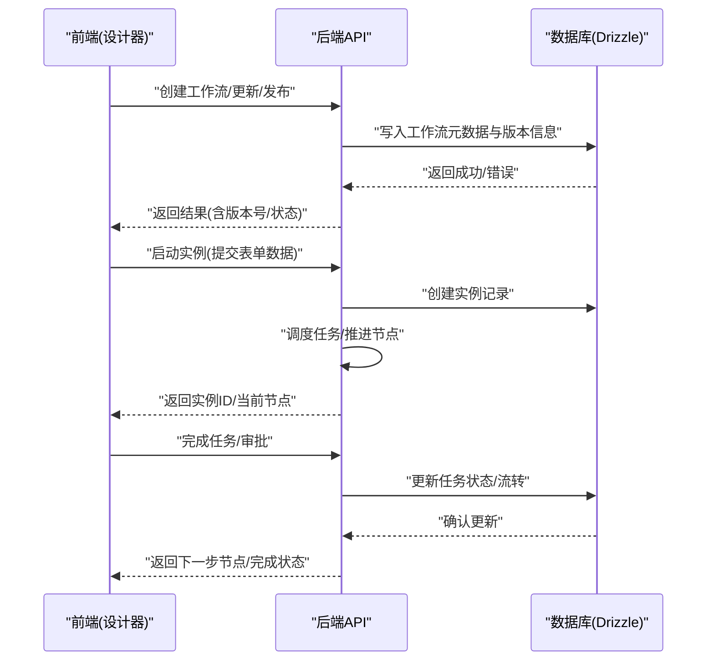
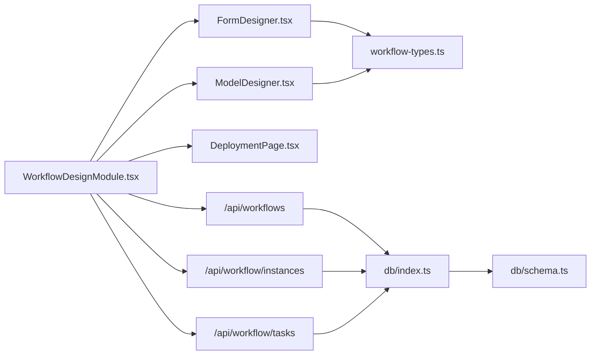

# 工作流引擎

<cite>
**本文档引用的文件**   
- [WorkflowDesignModule.tsx](file://app/WorkflowDesignModule.tsx)
- [FormDesigner.tsx](file://app/components/workflow/FormDesigner.tsx)
- [ModelDesigner.tsx](file://app/components/workflow/ModelDesigner.tsx)
- [DeploymentPage.tsx](file://app/components/workflow/DeploymentPage.tsx)
- [workflow-types.ts](file://app/components/workflow/workflow-types.ts)
- [route.ts](file://app/api/workflows/route.ts)
- [route.ts](file://app/api/workflow/instances/route.ts)
- [route.ts](file://app/api/workflow/instances/[id]/route.ts)
- [route.ts](file://app/api/workflow/tasks/route.ts)
- [db/index.ts](file://db/index.ts)
- [db/schema.ts](file://db/schema.ts)
</cite>

## 目录
1. [简介](#简介)
2. [项目结构](#项目结构)
3. [核心组件](#核心组件)
4. [架构总览](#架构总览)
5. [详细组件分析](#详细组件分析)
6. [依赖关系分析](#依赖关系分析)
7. [性能考虑](#性能考虑)
8. [故障排查指南](#故障排查指南)
9. [结论](#结论)
10. [附录](#附录)

## 简介
本文件面向工作流引擎的设计与实现，重点覆盖以下能力：
- 工作流设计器：可视化编排节点、连线、条件分支与变量映射。
- 表单设计器：拖拽式构建表单字段、校验规则与布局。
- 模型设计器：定义数据模型（字段、类型、约束）并生成持久化结构。
- 部署页面：将设计好的工作流与表单/模型发布到运行时环境。

文档同时梳理前后端接口、领域模型、调用链路与常见问题的解决方案，力求对初学者友好，并为有经验的开发者提供足够的技术深度。

## 项目结构
工作流相关的前端模块集中在 app/components/workflow 下，后端 API 路由位于 app/api/workflow 与 app/api/workflows。数据库访问通过 db 目录下的 Drizzle ORM 配置与 schema 定义。

图表来源
- [WorkflowDesignModule.tsx](file://app/WorkflowDesignModule.tsx)
- [FormDesigner.tsx](file://app/components/workflow/FormDesigner.tsx)
- [ModelDesigner.tsx](file://app/components/workflow/ModelDesigner.tsx)
- [DeploymentPage.tsx](file://app/components/workflow/DeploymentPage.tsx)
- [workflow-types.ts](file://app/components/workflow/workflow-types.ts)
- [route.ts](file://app/api/workflows/route.ts)
- [route.ts](file://app/api/workflow/instances/route.ts)
- [route.ts](file://app/api/workflow/instances/[id]/route.ts)
- [route.ts](file://app/api/workflow/tasks/route.ts)
- [db/index.ts](file://db/index.ts)
- [db/schema.ts](file://db/schema.ts)

章节来源
- [WorkflowDesignModule.tsx](file://app/WorkflowDesignModule.tsx)
- [FormDesigner.tsx](file://app/components/workflow/FormDesigner.tsx)
- [ModelDesigner.tsx](file://app/components/workflow/ModelDesigner.tsx)
- [DeploymentPage.tsx](file://app/components/workflow/DeploymentPage.tsx)
- [workflow-types.ts](file://app/components/workflow/workflow-types.ts)
- [route.ts](file://app/api/workflows/route.ts)
- [route.ts](file://app/api/workflow/instances/route.ts)
- [route.ts](file://app/api/workflow/instances/[id]/route.ts)
- [route.ts](file://app/api/workflow/tasks/route.ts)
- [db/index.ts](file://db/index.ts)
- [db/schema.ts](file://db/schema.ts)

## 核心组件
- 工作流设计器（WorkflowDesignModule）：聚合表单设计器、模型设计器与部署页，负责整体导航与状态协调。
- 表单设计器（FormDesigner）：维护表单字段集合、布局与校验规则，支持预览与导出。
- 模型设计器（ModelDesigner）：维护数据模型定义（字段名、类型、是否必填、默认值等），用于生成表结构与校验。
- 部署页面（DeploymentPage）：将当前工作流、表单与模型打包并发布，触发后端版本化与激活流程。

章节来源
- [WorkflowDesignModule.tsx](file://app/WorkflowDesignModule.tsx)
- [FormDesigner.tsx](file://app/components/workflow/FormDesigner.tsx)
- [ModelDesigner.tsx](file://app/components/workflow/ModelDesigner.tsx)
- [DeploymentPage.tsx](file://app/components/workflow/DeploymentPage.tsx)

## 架构总览
系统采用“前端可视化设计 + 后端API + 数据库持久化”的分层架构。前端通过统一类型定义（workflow-types.ts）保证设计与运行时的契约一致；后端以 RESTful API 暴露工作流、实例与任务的 CRUD 与执行能力；数据层使用 Drizzle ORM 进行迁移与查询。

图表来源
- [route.ts](file://app/api/workflows/route.ts)
- [route.ts](file://app/api/workflow/instances/route.ts)
- [route.ts](file://app/api/workflow/instances/[id]/route.ts)
- [route.ts](file://app/api/workflow/tasks/route.ts)
- [db/index.ts](file://db/index.ts)
- [db/schema.ts](file://db/schema.ts)

## 详细组件分析

### 工作流设计器（WorkflowDesignModule）
职责
- 作为容器组件，集成表单设计器、模型设计器与部署页面。
- 管理全局上下文（如当前编辑的工作流ID、版本、权限）。
- 协调各子组件之间的状态同步与事件回调。

关键交互
- 从后端加载已存在的工作流定义（若存在）。
- 保存草稿与发布新版本时调用 /api/workflows。
- 触发实例创建与任务处理时调用 /api/workflow/instances 与 /api/workflow/tasks。

章节来源
- [WorkflowDesignModule.tsx](file://app/WorkflowDesignModule.tsx)
- [route.ts](file://app/api/workflows/route.ts)
- [route.ts](file://app/api/workflow/instances/route.ts)
- [route.ts](file://app/api/workflow/tasks/route.ts)

### 表单设计器（FormDesigner）
职责
- 维护表单字段集合（文本、数字、选择、日期、附件等）。
- 管理字段校验规则（必填、格式、范围、自定义表达式）。
- 提供预览模式与导出 JSON 的能力，供工作流节点读取输入。

数据结构要点
- 字段定义包含：标识、标签、类型、默认值、校验规则、可见性控制。
- 布局信息包含：分组、列数、占位符、帮助文本。

章节来源
- [FormDesigner.tsx](file://app/components/workflow/FormDesigner.tsx)
- [workflow-types.ts](file://app/components/workflow/workflow-types.ts)

### 模型设计器（ModelDesigner）
职责
- 定义数据模型的字段、类型与约束，用于生成数据库表结构或运行时校验。
- 支持字段关联（一对一、一对多）与索引策略。
- 导出模型定义以供工作流节点读写数据。

数据结构要点
- 模型包含：名称、描述、字段列表、主键、唯一约束、索引。
- 字段包含：名称、类型、长度、可空、默认值、外键引用。

章节来源
- [ModelDesigner.tsx](file://app/components/workflow/ModelDesigner.tsx)
- [workflow-types.ts](file://app/components/workflow/workflow-types.ts)
- [db/schema.ts](file://db/schema.ts)

### 部署页面（DeploymentPage）
职责
- 将当前工作流、表单与模型打包为“版本”，并提交至后端。
- 触发后端校验、迁移与激活流程，使新版本生效。
- 展示部署历史与回滚选项。

关键流程
- 收集设计态产物（工作流图、表单JSON、模型JSON）。
- 调用 /api/workflows 的发布接口，携带版本信息与变更说明。
- 监听后端返回的状态（成功/失败/需要人工确认）。

章节来源
- [DeploymentPage.tsx](file://app/components/workflow/DeploymentPage.tsx)
- [route.ts](file://app/api/workflows/route.ts)

### 领域模型与类型（workflow-types.ts）
作用
- 统一定义工作流节点、连线、变量、表单字段、模型字段等类型。
- 确保前端设计与后端解析的一致性，减少序列化/反序列化错误。

典型类型
- 工作流节点：类型、属性、入参出参、条件表达式。
- 表单字段：类型、校验、布局。
- 模型字段：类型、约束、索引。

章节来源
- [workflow-types.ts](file://app/components/workflow/workflow-types.ts)

### 后端 API 与数据层
工作流 API（/api/workflows）
- 功能：创建、更新、删除、获取工作流定义与版本列表。
- 请求体：工作流元数据、节点定义、连线、变量映射。
- 响应：工作流ID、版本号、状态、错误信息。

实例 API（/api/workflow/instances）
- 功能：创建实例、查询实例列表、按ID查询实例详情。
- 请求体：工作流ID、初始表单数据、上下文变量。
- 响应：实例ID、当前节点、状态、错误信息。

实例详情 API（/api/workflow/instances/[id]）
- 功能：更新实例状态、推进节点、记录审计日志。
- 请求体：动作（开始/完成/跳过）、附加数据。
- 响应：新状态、下一节点、错误信息。

任务 API（/api/workflow/tasks）
- 功能：查询待办任务、认领/完成任务、批量操作。
- 请求体：任务ID、操作类型、审批意见。
- 响应：任务状态、流转结果、错误信息。

数据层（db/index.ts, db/schema.ts）
- 使用 Drizzle ORM 定义表结构与迁移脚本。
- 提供统一的连接管理与事务封装。

章节来源
- [route.ts](file://app/api/workflows/route.ts)
- [route.ts](file://app/api/workflow/instances/route.ts)
- [route.ts](file://app/api/workflow/instances/[id]/route.ts)
- [route.ts](file://app/api/workflow/tasks/route.ts)
- [db/index.ts](file://db/index.ts)
- [db/schema.ts](file://db/schema.ts)

## 依赖关系分析
- 前端组件依赖 workflow-types.ts 的类型定义，确保设计产物与后端契约一致。
- 工作流设计器依赖表单与模型设计器的输出，作为部署包的一部分。
- 后端 API 依赖数据库层进行持久化与查询，遵循 Drizzle ORM 的迁移与连接管理。

图表来源
- [FormDesigner.tsx](file://app/components/workflow/FormDesigner.tsx)
- [ModelDesigner.tsx](file://app/components/workflow/ModelDesigner.tsx)
- [workflow-types.ts](file://app/components/workflow/workflow-types.ts)
- [WorkflowDesignModule.tsx](file://app/WorkflowDesignModule.tsx)
- [DeploymentPage.tsx](file://app/components/workflow/DeploymentPage.tsx)
- [route.ts](file://app/api/workflows/route.ts)
- [route.ts](file://app/api/workflow/instances/route.ts)
- [route.ts](file://app/api/workflow/tasks/route.ts)
- [db/index.ts](file://db/index.ts)
- [db/schema.ts](file://db/schema.ts)

章节来源
- [workflow-types.ts](file://app/components/workflow/workflow-types.ts)
- [db/index.ts](file://db/index.ts)
- [db/schema.ts](file://db/schema.ts)

## 性能考虑
- 前端设计态：避免在大型工作流图中频繁重渲染，建议按需加载节点与连线数据。
- 表单与模型定义：合理拆分字段组，减少一次性渲染开销。
- 后端 API：对查询接口增加分页与过滤，避免全量拉取；对写操作使用事务保证一致性。
- 数据库层：利用 Drizzle 的查询优化与索引策略，减少慢查询。

[本节为通用指导，不直接分析具体文件]

## 故障排查指南
常见问题与解决思路
- 工作流发布失败：检查版本冲突与校验规则，查看后端返回的错误码与消息。
- 实例无法启动：确认工作流定义完整、表单数据符合校验规则、上下文变量正确。
- 任务卡住：检查节点条件表达式与变量映射，确认前置任务已完成。
- 数据库连接异常：检查环境变量与连接字符串，确认迁移脚本已执行。

定位方法
- 前端控制台查看网络请求与响应。
- 后端日志中搜索工作流ID与实例ID。
- 数据库查询实例与任务状态，核对流转路径。

章节来源
- [route.ts](file://app/api/workflows/route.ts)
- [route.ts](file://app/api/workflow/instances/route.ts)
- [route.ts](file://app/api/workflow/instances/[id]/route.ts)
- [route.ts](file://app/api/workflow/tasks/route.ts)
- [db/index.ts](file://db/index.ts)

## 结论
本工作流引擎通过可视化的设计器与标准化的类型定义，实现了从设计到部署的闭环。前后端通过清晰的 API 契约协作，数据层借助 Drizzle ORM 保障一致性与可维护性。建议在后续迭代中加强错误提示、监控与性能优化，以提升用户体验与系统稳定性。

[本节为总结，不直接分析具体文件]

## 附录
- 术语表
  - 工作流：由多个节点组成的业务流程定义。
  - 实例：工作流的某次运行，包含状态与上下文数据。
  - 任务：实例中需要用户或系统处理的步骤。
  - 模型：数据结构的定义，用于持久化与校验。

[本节为补充信息，不直接分析具体文件]