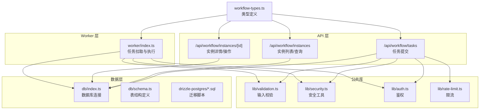
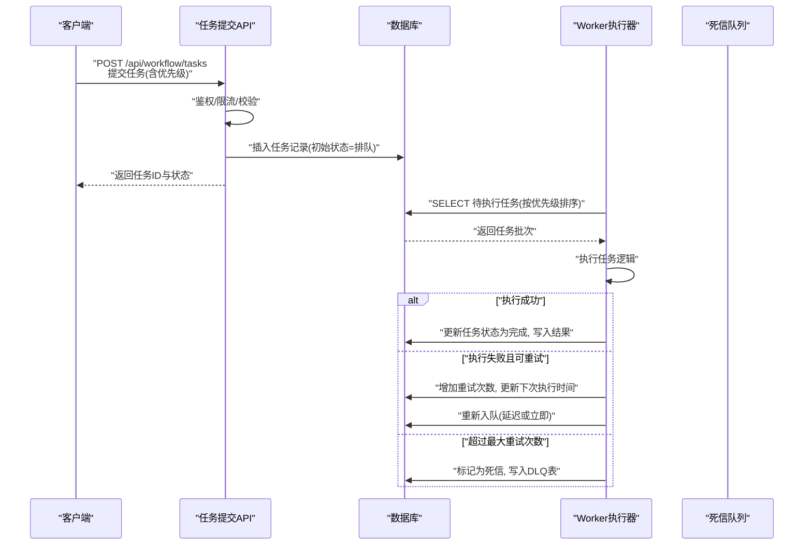
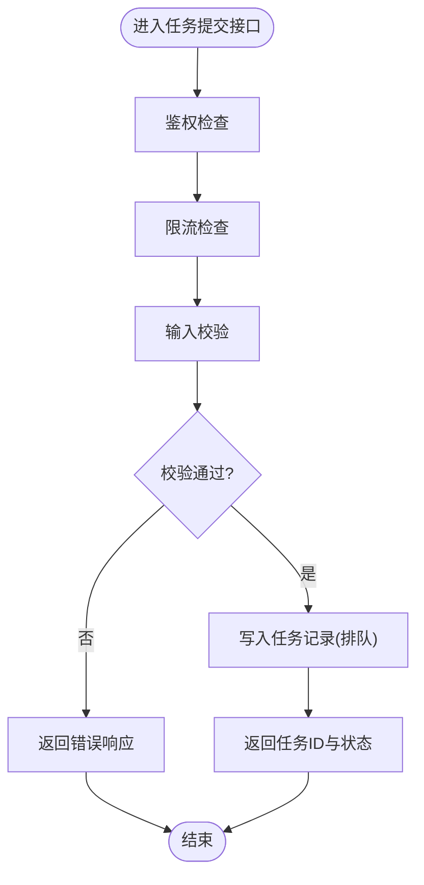
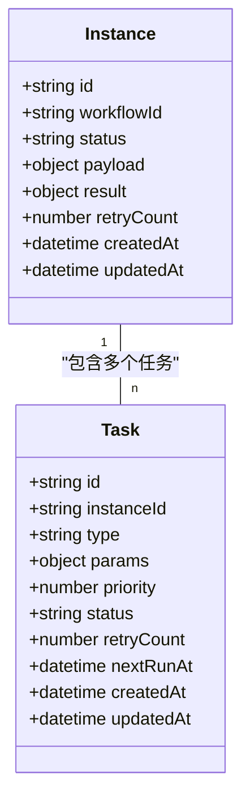
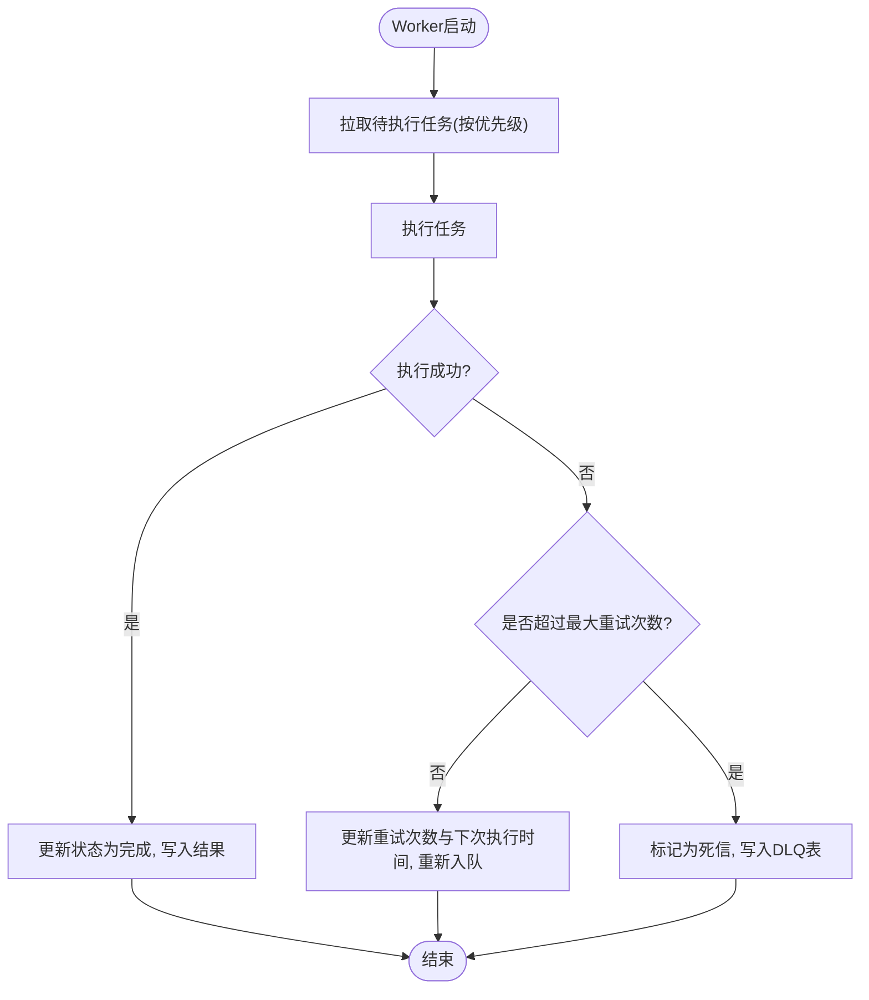
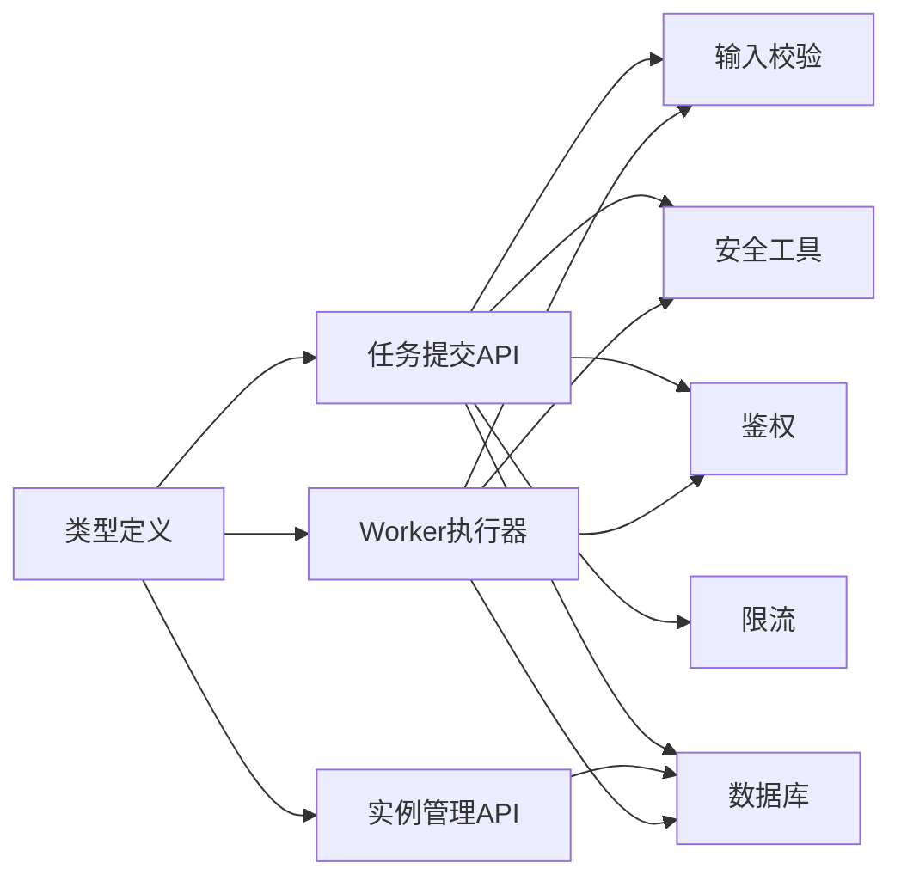

# 任务调度系统

<cite>
**本文引用的文件**   
- [app/api/workflow/tasks/route.ts](file://app/api/workflow/tasks/route.ts)
- [app/api/workflow/instances/route.ts](file://app/api/workflow/instances/route.ts)
- [app/api/workflow/instances/[id]/route.ts](file://app/api/workflow/instances/[id]/route.ts)
- [worker/index.ts](file://worker/index.ts)
- [db/index.ts](file://db/index.ts)
- [db/schema.ts](file://db/schema.ts)
- [drizzle-postgres/0000_fine_psylocke.sql](file://drizzle-postgres/0000_fine_psylocke.sql)
- [drizzle-postgres/0001_thin_queen_noir.sql](file://drizzle-postgres/0001_thin_queen_noir.sql)
- [drizzle-postgres/0002_crazy_ravenous.sql](file://drizzle-postgres/0002_crazy_ravenous.sql)
- [drizzle-postgres/0003_fine_quentin_quire.sql](file://drizzle-postgres/0003_fine_quentin_quire.sql)
- [lib/validation.ts](file://lib/validation.ts)
- [lib/security.ts](file://lib/security.ts)
- [lib/auth.ts](file://lib/auth.ts)
- [lib/rate-limit.ts](file://lib/rate-limit.ts)
- [app/components/workflow/workflow-types.ts](file://app/components/workflow/workflow-types.ts)
</cite>

## 目录
1. [简介](#简介)
2. [项目结构](#项目结构)
3. [核心组件](#核心组件)
4. [架构总览](#架构总览)
5. [详细组件分析](#详细组件分析)
6. [依赖关系分析](#依赖关系分析)
7. [性能考量](#性能考量)
8. [故障排查指南](#故障排查指南)
9. [结论](#结论)
10. [附录](#附录)

## 简介
本文件面向“任务调度系统”的完整设计与实现，覆盖工作流任务的创建、分发、执行与结果处理的全链路流程。文档重点阐述：
- 任务队列管理与优先级调度
- 重试机制与死信队列（DLQ）
- 分布式任务处理的负载均衡、故障转移与数据一致性保障
- 任务调度的API接口规范（提交、状态查询、结果获取）
- 监控、日志追踪与性能优化实践

本系统基于 Next.js API Routes 暴露任务相关接口，使用数据库持久化任务与实例，Worker 进程负责拉取并执行任务，结合校验、鉴权与限流等通用能力，形成高可用、可观测的任务调度平台。

## 项目结构
从仓库结构看，任务调度相关代码主要分布在以下位置：
- API 层：app/api/workflow/** 提供任务与实例的 REST 接口
- Worker 层：worker/index.ts 作为独立进程消费任务
- 数据层：db/** 与 drizzle-postgres/** 定义数据库连接与迁移脚本
- 公共库：lib/** 提供校验、安全、鉴权、限流等横切能力
- 前端类型：app/components/workflow/workflow-types.ts 定义工作流与任务的数据模型

图表来源
- [app/api/workflow/tasks/route.ts](file://app/api/workflow/tasks/route.ts)
- [app/api/workflow/instances/route.ts](file://app/api/workflow/instances/route.ts)
- [app/api/workflow/instances/[id]/route.ts](file://app/api/workflow/instances/[id]/route.ts)
- [worker/index.ts](file://worker/index.ts)
- [db/index.ts](file://db/index.ts)
- [db/schema.ts](file://db/schema.ts)
- [drizzle-postgres/0000_fine_psylocke.sql](file://drizzle-postgres/0000_fine_psylocke.sql)
- [drizzle-postgres/0001_thin_queen_noir.sql](file://drizzle-postgres/0001_thin_queen_noir.sql)
- [drizzle-postgres/0002_crazy_ravenous.sql](file://drizzle-postgres/0002_crazy_ravenous.sql)
- [drizzle-postgres/0003_fine_quentin_quire.sql](file://drizzle-postgres/0003_fine_quentin_quire.sql)
- [lib/validation.ts](file://lib/validation.ts)
- [lib/security.ts](file://lib/security.ts)
- [lib/auth.ts](file://lib/auth.ts)
- [lib/rate-limit.ts](file://lib/rate-limit.ts)
- [app/components/workflow/workflow-types.ts](file://app/components/workflow/workflow-types.ts)

章节来源
- [app/api/workflow/tasks/route.ts](file://app/api/workflow/tasks/route.ts)
- [app/api/workflow/instances/route.ts](file://app/api/workflow/instances/route.ts)
- [app/api/workflow/instances/[id]/route.ts](file://app/api/workflow/instances/[id]/route.ts)
- [worker/index.ts](file://worker/index.ts)
- [db/index.ts](file://db/index.ts)
- [db/schema.ts](file://db/schema.ts)
- [drizzle-postgres/0000_fine_psylocke.sql](file://drizzle-postgres/0000_fine_psylocke.sql)
- [drizzle-postgres/0001_thin_queen_noir.sql](file://drizzle-postgres/0001_thin_queen_noir.sql)
- [drizzle-postgres/0002_crazy_ravenous.sql](file://drizzle-postgres/0002_crazy_ravenous.sql)
- [drizzle-postgres/0003_fine_quentin_quire.sql](file://drizzle-postgres/0003_fine_quentin_quire.sql)
- [lib/validation.ts](file://lib/validation.ts)
- [lib/security.ts](file://lib/security.ts)
- [lib/auth.ts](file://lib/auth.ts)
- [lib/rate-limit.ts](file://lib/rate-limit.ts)
- [app/components/workflow/workflow-types.ts](file://app/components/workflow/workflow-types.ts)

## 核心组件
- 任务提交接口：接收任务定义、参数与优先级，完成鉴权、限流、校验后写入任务表，返回任务ID与初始状态
- 实例管理接口：提供工作流实例的创建、查询、状态更新与结果获取
- Worker 执行器：周期性或事件驱动地从队列中拉取待执行任务，按优先级调度执行，记录执行结果与重试信息
- 数据模型与迁移：通过 Drizzle ORM 与 SQL 迁移脚本维护任务、实例、重试与死信队列等表结构
- 横切能力：输入校验、鉴权、限流与安全工具贯穿API与Worker

章节来源
- [app/api/workflow/tasks/route.ts](file://app/api/workflow/tasks/route.ts)
- [app/api/workflow/instances/route.ts](file://app/api/workflow/instances/route.ts)
- [app/api/workflow/instances/[id]/route.ts](file://app/api/workflow/instances/[id]/route.ts)
- [worker/index.ts](file://worker/index.ts)
- [db/schema.ts](file://db/schema.ts)
- [drizzle-postgres/0000_fine_psylocke.sql](file://drizzle-postgres/0000_fine_psylocke.sql)
- [drizzle-postgres/0001_thin_queen_noir.sql](file://drizzle-postgres/0001_thin_queen_noir.sql)
- [drizzle-postgres/0002_crazy_ravenous.sql](file://drizzle-postgres/0002_crazy_ravenous.sql)
- [drizzle-postgres/0003_fine_quentin_quire.sql](file://drizzle-postgres/0003_fine_quentin_quire.sql)
- [lib/validation.ts](file://lib/validation.ts)
- [lib/security.ts](file://lib/security.ts)
- [lib/auth.ts](file://lib/auth.ts)
- [lib/rate-limit.ts](file://lib/rate-limit.ts)

## 架构总览
下图展示任务从提交到执行的端到端流程，以及失败重试与死信队列的处理路径。

图表来源
- [app/api/workflow/tasks/route.ts](file://app/api/workflow/tasks/route.ts)
- [worker/index.ts](file://worker/index.ts)
- [db/schema.ts](file://db/schema.ts)
- [drizzle-postgres/0000_fine_psylocke.sql](file://drizzle-postgres/0000_fine_psylocke.sql)
- [drizzle-postgres/0001_thin_queen_noir.sql](file://drizzle-postgres/0001_thin_queen_noir.sql)
- [drizzle-postgres/0002_crazy_ravenous.sql](file://drizzle-postgres/0002_crazy_ravenous.sql)
- [drizzle-postgres/0003_fine_quentin_quire.sql](file://drizzle-postgres/0003_fine_quentin_quire.sql)

## 详细组件分析

### 任务提交接口（/api/workflow/tasks）
职责与流程
- 接收任务请求体，包含任务类型、参数、优先级、超时、重试策略等
- 调用鉴权、限流与输入校验中间件
- 将任务持久化到数据库，设置初始状态为“排队”，并返回任务ID与状态
- 支持批量提交（可选），保证事务一致性与幂等性

关键实现要点
- 鉴权：验证用户身份与权限范围
- 限流：防止突发流量导致队列拥塞
- 校验：严格校验字段类型、取值范围与业务约束
- 幂等：通过唯一键或去重策略避免重复提交

图表来源
- [app/api/workflow/tasks/route.ts](file://app/api/workflow/tasks/route.ts)
- [lib/validation.ts](file://lib/validation.ts)
- [lib/security.ts](file://lib/security.ts)
- [lib/auth.ts](file://lib/auth.ts)
- [lib/rate-limit.ts](file://lib/rate-limit.ts)

章节来源
- [app/api/workflow/tasks/route.ts](file://app/api/workflow/tasks/route.ts)
- [lib/validation.ts](file://lib/validation.ts)
- [lib/security.ts](file://lib/security.ts)
- [lib/auth.ts](file://lib/auth.ts)
- [lib/rate-limit.ts](file://lib/rate-limit.ts)

### 实例管理接口（/api/workflow/instances 与 /[id]）
职责与流程
- 提供工作流实例的创建、查询、状态更新与结果获取
- 支持分页、过滤与排序，便于监控与管理
- 对实例的生命周期进行状态机管理（如：创建、运行、完成、失败、取消）

关键实现要点
- 状态机：确保状态转换合法，避免非法跳转
- 结果存储：任务完成后将结果关联到实例，供查询
- 并发控制：避免同一实例被重复操作

图表来源
- [app/api/workflow/instances/route.ts](file://app/api/workflow/instances/route.ts)
- [app/api/workflow/instances/[id]/route.ts](file://app/api/workflow/instances/[id]/route.ts)
- [db/schema.ts](file://db/schema.ts)
- [drizzle-postgres/0000_fine_psylocke.sql](file://drizzle-postgres/0000_fine_psylocke.sql)
- [drizzle-postgres/0001_thin_queen_noir.sql](file://drizzle-postgres/0001_thin_queen_noir.sql)
- [drizzle-postgres/0002_crazy_ravenous.sql](file://drizzle-postgres/0002_crazy_ravenous.sql)
- [drizzle-postgres/0003_fine_quentin_quire.sql](file://drizzle-postgres/0003_fine_quentin_quire.sql)

章节来源
- [app/api/workflow/instances/route.ts](file://app/api/workflow/instances/route.ts)
- [app/api/workflow/instances/[id]/route.ts](file://app/api/workflow/instances/[id]/route.ts)
- [db/schema.ts](file://db/schema.ts)

### Worker 执行器（worker/index.ts）
职责与流程
- 定时或事件驱动地拉取待执行任务，按优先级排序
- 执行任务逻辑，记录执行结果、错误信息与重试计数
- 当任务失败且未超过最大重试次数时，重新入队；否则转入死信队列

关键实现要点
- 优先级调度：优先执行高优先级任务
- 重试策略：指数退避或固定间隔，避免雪崩
- 死信队列：隔离不可恢复任务，便于人工干预与审计
- 幂等执行：确保相同任务不会重复执行

图表来源
- [worker/index.ts](file://worker/index.ts)
- [db/schema.ts](file://db/schema.ts)
- [drizzle-postgres/0000_fine_psylocke.sql](file://drizzle-postgres/0000_fine_psylocke.sql)
- [drizzle-postgres/0001_thin_queen_noir.sql](file://drizzle-postgres/0001_thin_queen_noir.sql)
- [drizzle-postgres/0002_crazy_ravenous.sql](file://drizzle-postgres/0002_crazy_ravenous.sql)
- [drizzle-postgres/0003_fine_quentin_quire.sql](file://drizzle-postgres/0003_fine_quentin_quire.sql)

章节来源
- [worker/index.ts](file://worker/index.ts)
- [db/schema.ts](file://db/schema.ts)

### 数据模型与迁移（db/schema.ts 与 drizzle-postgres/*.sql）
职责与内容
- 定义任务、实例、重试与死信队列等表结构
- 通过迁移脚本逐步演进数据库模式，保证向后兼容
- 索引设计：针对任务状态、优先级、实例ID等高频查询字段建立索引

关键实现要点
- 主键与外键：确保数据完整性与关联关系
- 状态枚举：明确任务与实例的状态值域
- 时间戳字段：记录创建、更新时间与下次执行时间
- 重试与DLQ：分离正常队列与死信队列，便于监控与治理

章节来源
- [db/schema.ts](file://db/schema.ts)
- [drizzle-postgres/0000_fine_psylocke.sql](file://drizzle-postgres/0000_fine_psylocke.sql)
- [drizzle-postgres/0001_thin_queen_noir.sql](file://drizzle-postgres/0001_thin_queen_noir.sql)
- [drizzle-postgres/0002_crazy_ravenous.sql](file://drizzle-postgres/0002_crazy_ravenous.sql)
- [drizzle-postgres/0003_fine_quentin_quire.sql](file://drizzle-postgres/0003_fine_quentin_quire.sql)

### 类型定义（app/components/workflow/workflow-types.ts）
职责与内容
- 定义工作流、任务、实例、结果等数据结构
- 统一前后端与Worker之间的数据契约
- 提供类型约束，减少运行时错误

章节来源
- [app/components/workflow/workflow-types.ts](file://app/components/workflow/workflow-types.ts)

## 依赖关系分析
- API 层依赖鉴权、限流、校验与安全工具，确保请求合法性与安全性
- Worker 依赖数据库连接与任务模型，执行任务并更新状态
- 数据层通过 Drizzle ORM 与迁移脚本维护表结构与版本演进
- 类型定义贯穿API、Worker与前端，保证数据一致性

图表来源
- [app/api/workflow/tasks/route.ts](file://app/api/workflow/tasks/route.ts)
- [app/api/workflow/instances/route.ts](file://app/api/workflow/instances/route.ts)
- [worker/index.ts](file://worker/index.ts)
- [lib/validation.ts](file://lib/validation.ts)
- [lib/security.ts](file://lib/security.ts)
- [lib/auth.ts](file://lib/auth.ts)
- [lib/rate-limit.ts](file://lib/rate-limit.ts)
- [db/index.ts](file://db/index.ts)
- [db/schema.ts](file://db/schema.ts)
- [app/components/workflow/workflow-types.ts](file://app/components/workflow/workflow-types.ts)

章节来源
- [app/api/workflow/tasks/route.ts](file://app/api/workflow/tasks/route.ts)
- [app/api/workflow/instances/route.ts](file://app/api/workflow/instances/route.ts)
- [worker/index.ts](file://worker/index.ts)
- [lib/validation.ts](file://lib/validation.ts)
- [lib/security.ts](file://lib/security.ts)
- [lib/auth.ts](file://lib/auth.ts)
- [lib/rate-limit.ts](file://lib/rate-limit.ts)
- [db/index.ts](file://db/index.ts)
- [db/schema.ts](file://db/schema.ts)
- [app/components/workflow/workflow-types.ts](file://app/components/workflow/workflow-types.ts)

## 性能考量
- 优先级调度：在高负载场景下，优先处理高优先级任务，降低关键任务延迟
- 批处理拉取：Worker 批量拉取任务，减少数据库往返开销
- 索引优化：为状态、优先级、实例ID等字段建立合适索引，提升查询效率
- 重试退避：采用指数退避策略，避免重试风暴
- 死信隔离：将不可恢复任务隔离至DLQ，避免阻塞正常队列
- 水平扩展：多Worker实例并行执行，提升吞吐能力
- 连接池：合理配置数据库连接池大小，避免连接耗尽

[本节为通用性能建议，不直接分析具体文件]

## 故障排查指南
常见问题与定位方法
- 任务未执行：检查任务状态是否为“排队”，确认Worker是否正常运行，查看数据库连接与权限
- 执行失败：查看任务错误信息与重试计数，判断是否达到最大重试次数，必要时手动重试或清理DLQ
- 实例状态异常：核对状态机转换逻辑，确保无非法状态跳转
- 性能问题：监控数据库慢查询与Worker CPU占用，调整批处理大小与重试策略
- 鉴权/限流失败：检查鉴权令牌与限流阈值配置，确认请求频率与权限范围

章节来源
- [worker/index.ts](file://worker/index.ts)
- [app/api/workflow/tasks/route.ts](file://app/api/workflow/tasks/route.ts)
- [app/api/workflow/instances/route.ts](file://app/api/workflow/instances/route.ts)
- [app/api/workflow/instances/[id]/route.ts](file://app/api/workflow/instances/[id]/route.ts)
- [lib/validation.ts](file://lib/validation.ts)
- [lib/security.ts](file://lib/security.ts)
- [lib/auth.ts](file://lib/auth.ts)
- [lib/rate-limit.ts](file://lib/rate-limit.ts)

## 结论
本任务调度系统通过清晰的API分层、可靠的Worker执行器与完善的数据模型，实现了任务的高效调度与稳定执行。优先级调度、重试机制与死信队列共同保障了系统的鲁棒性与可观测性。在生产环境中，建议结合监控与日志系统进行持续优化，确保高可用与高性能。

[本节为总结性内容，不直接分析具体文件]

## 附录
- API 接口规范
  - 任务提交：POST /api/workflow/tasks，请求体包含任务类型、参数、优先级、超时与重试策略，返回任务ID与初始状态
  - 实例查询：GET /api/workflow/instances，支持分页、过滤与排序，返回实例列表
  - 实例详情：GET /api/workflow/instances/:id，返回实例状态、结果与执行历史
- 监控与日志
  - 任务生命周期日志：记录创建、执行、重试、完成与失败等关键节点
  - 指标采集：任务吞吐量、平均延迟、失败率与DLQ积压量
- 最佳实践
  - 幂等提交：通过唯一键或去重策略避免重复提交
  - 合理重试：根据任务特性选择固定间隔或指数退避
  - 资源隔离：将CPU密集型与IO密集型任务分流到不同Worker池

[本节为补充说明，不直接分析具体文件]