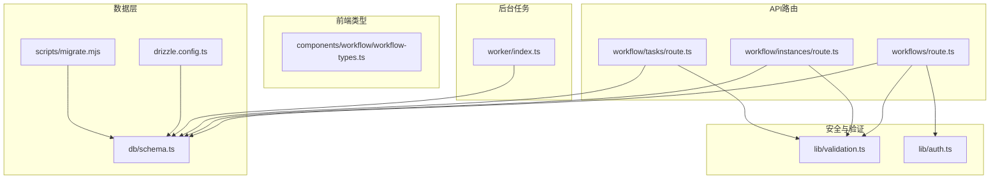
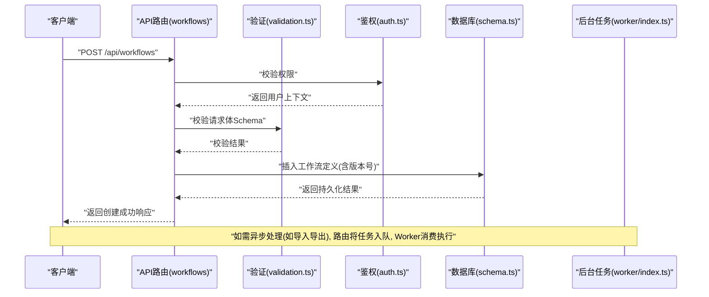
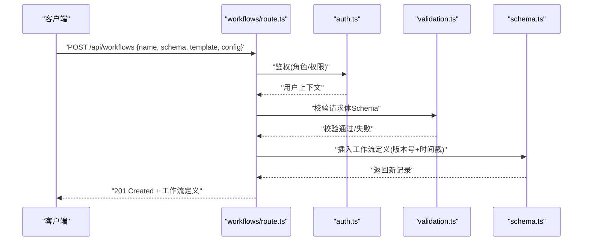
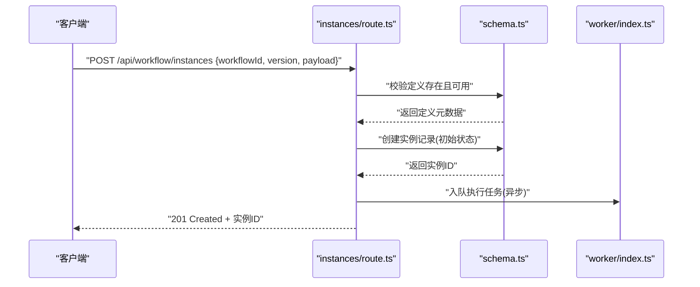
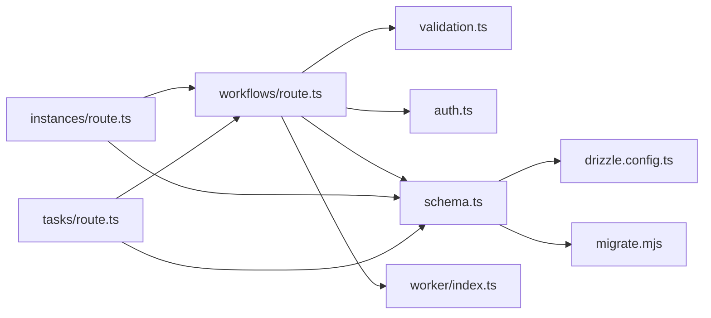

# 工作流定义管理

<cite>
**本文引用的文件**   
- [app/api/workflows/route.ts](file://app/api/workflows/route.ts)
- [app/api/workflow/instances/route.ts](file://app/api/workflow/instances/route.ts)
- [app/api/workflow/tasks/route.ts](file://app/api/workflow/tasks/route.ts)
- [app/components/workflow/workflow-types.ts](file://app/components/workflow/workflow-types.ts)
- [lib/validation.ts](file://lib/validation.ts)
- [db/schema.ts](file://db/schema.ts)
- [drizzle.config.ts](file://drizzle.config.ts)
- [scripts/migrate.mjs](file://scripts/migrate.mjs)
- [worker/index.ts](file://worker/index.ts)
- [lib/auth.ts](file://lib/auth.ts)
</cite>

## 目录
1. [简介](#简介)
2. [项目结构](#项目结构)
3. [核心组件](#核心组件)
4. [架构总览](#架构总览)
5. [详细组件分析](#详细组件分析)
6. [依赖关系分析](#依赖关系分析)
7. [性能考量](#性能考量)
8. [故障排查指南](#故障排查指南)
9. [结论](#结论)
10. [附录](#附录)

## 简介
本文件围绕“工作流定义管理”展开，聚焦以下目标：
- 工作流定义的CRUD操作、版本控制与存储机制的实现细节
- 工作流Schema验证、模板引擎集成与配置管理的核心逻辑
- 工作流定义的API接口规范（请求/响应格式、错误处理、权限校验）
- 序列化、反序列化与持久化策略
- 导入导出与批量操作方法

该文档以仓库中的工作流相关API、类型定义、数据库Schema与迁移脚本为依据，结合通用工程实践进行系统化说明。

## 项目结构
与工作流定义管理直接相关的代码主要分布在以下位置：
- API路由层：app/api/workflows、app/api/workflow/instances、app/api/workflow/tasks
- 前端类型与页面：app/components/workflow/*
- 数据模型与迁移：db/schema.ts、drizzle.config.ts、scripts/migrate.mjs
- 验证与安全：lib/validation.ts、lib/auth.ts
- 后台任务：worker/index.ts

图表来源
- [app/api/workflows/route.ts](file://app/api/workflows/route.ts)
- [app/api/workflow/instances/route.ts](file://app/api/workflow/instances/route.ts)
- [app/api/workflow/tasks/route.ts](file://app/api/workflow/tasks/route.ts)
- [app/components/workflow/workflow-types.ts](file://app/components/workflow/workflow-types.ts)
- [db/schema.ts](file://db/schema.ts)
- [drizzle.config.ts](file://drizzle.config.ts)
- [scripts/migrate.mjs](file://scripts/migrate.mjs)
- [lib/validation.ts](file://lib/validation.ts)
- [lib/auth.ts](file://lib/auth.ts)
- [worker/index.ts](file://worker/index.ts)

章节来源
- [app/api/workflows/route.ts](file://app/api/workflows/route.ts)
- [app/api/workflow/instances/route.ts](file://app/api/workflow/instances/route.ts)
- [app/api/workflow/tasks/route.ts](file://app/api/workflow/tasks/route.ts)
- [app/components/workflow/workflow-types.ts](file://app/components/workflow/workflow-types.ts)
- [db/schema.ts](file://db/schema.ts)
- [drizzle.config.ts](file://drizzle.config.ts)
- [scripts/migrate.mjs](file://scripts/migrate.mjs)
- [lib/validation.ts](file://lib/validation.ts)
- [lib/auth.ts](file://lib/auth.ts)
- [worker/index.ts](file://worker/index.ts)

## 核心组件
- 工作流定义API（workflows）：提供工作流定义的创建、读取、更新、删除、列表查询、版本管理等能力
- 工作流实例API（instances）：管理工作流运行时的实例生命周期
- 任务API（tasks）：管理与工作流执行相关的任务调度与状态
- 类型定义（workflow-types.ts）：统一前后端关于工作流定义的结构约定
- 验证模块（validation.ts）：对输入数据进行Schema校验与错误聚合
- 数据库Schema（schema.ts）：使用Drizzle ORM定义表结构与约束
- 迁移工具（migrate.mjs、drizzle.config.ts）：数据库版本演进与迁移执行
- 认证授权（auth.ts）：鉴权中间件与权限校验
- 后台任务（worker/index.ts）：异步任务处理（如批量导入导出、定时任务等）

章节来源
- [app/api/workflows/route.ts](file://app/api/workflows/route.ts)
- [app/api/workflow/instances/route.ts](file://app/api/workflow/instances/route.ts)
- [app/api/workflow/tasks/route.ts](file://app/api/workflow/tasks/route.ts)
- [app/components/workflow/workflow-types.ts](file://app/components/workflow/workflow-types.ts)
- [lib/validation.ts](file://lib/validation.ts)
- [db/schema.ts](file://db/schema.ts)
- [drizzle.config.ts](file://drizzle.config.ts)
- [scripts/migrate.mjs](file://scripts/migrate.mjs)
- [lib/auth.ts](file://lib/auth.ts)
- [worker/index.ts](file://worker/index.ts)

## 架构总览
工作流定义管理采用分层架构：
- 表现层：Next.js API路由暴露REST风格接口
- 业务层：路由内调用验证、权限、领域服务（可抽象为函数或类）
- 数据层：通过Drizzle ORM访问PostgreSQL，使用迁移脚本维护版本
- 辅助层：验证器、安全模块、后台任务Worker

图表来源
- [app/api/workflows/route.ts](file://app/api/workflows/route.ts)
- [lib/validation.ts](file://lib/validation.ts)
- [lib/auth.ts](file://lib/auth.ts)
- [db/schema.ts](file://db/schema.ts)
- [worker/index.ts](file://worker/index.ts)

## 详细组件分析

### 工作流定义API（workflows）
- 职责：提供工作流定义的CRUD、版本控制、列表查询、批量操作、导入导出入口
- 典型流程：
  - 创建：接收定义JSON，进行Schema校验，生成版本号并持久化
  - 读取：按ID或版本获取定义，支持历史版本查询
  - 更新：基于当前版本进行乐观锁更新，避免并发覆盖
  - 删除：软删除或归档，保留审计轨迹
  - 列表：分页、过滤、排序
  - 版本控制：每次变更生成新版本号，支持回滚到指定版本
  - 导入导出：批量导入JSON/CSV，导出为结构化文件
- 权限校验：仅允许具备相应角色的用户执行写操作
- 错误处理：统一错误码与消息，包含字段级校验失败信息

章节来源
- [app/api/workflows/route.ts](file://app/api/workflows/route.ts)
- [lib/validation.ts](file://lib/validation.ts)
- [lib/auth.ts](file://lib/auth.ts)

#### 序列图：创建工作流定义

图表来源
- [app/api/workflows/route.ts](file://app/api/workflows/route.ts)
- [lib/auth.ts](file://lib/auth.ts)
- [lib/validation.ts](file://lib/validation.ts)
- [db/schema.ts](file://db/schema.ts)

### 工作流实例API（instances）
- 职责：根据工作流定义创建运行时实例，跟踪实例状态、节点执行进度、异常恢复
- 关键能力：
  - 启动实例：绑定定义版本，初始化上下文
  - 推进状态：节点完成回调驱动状态机流转
  - 查询实例：按ID、状态、时间范围筛选
  - 终止/重试：支持人工干预与自动重试策略

章节来源
- [app/api/workflow/instances/route.ts](file://app/api/workflow/instances/route.ts)
- [db/schema.ts](file://db/schema.ts)

#### 序列图：启动工作流实例

图表来源
- [app/api/workflow/instances/route.ts](file://app/api/workflow/instances/route.ts)
- [db/schema.ts](file://db/schema.ts)
- [worker/index.ts](file://worker/index.ts)

### 任务API（tasks）
- 职责：管理与工作流执行相关的任务队列、调度、重试、失败处理
- 关键能力：
  - 任务创建：由实例或外部触发
  - 任务状态：待处理、执行中、成功、失败、重试
  - 任务查询：按实例、状态、优先级筛选
  - 任务重试：指数退避与最大重试次数

章节来源
- [app/api/workflow/tasks/route.ts](file://app/api/workflow/tasks/route.ts)
- [db/schema.ts](file://db/schema.ts)
- [worker/index.ts](file://worker/index.ts)

### 类型定义（workflow-types.ts）
- 作用：统一前后端关于工作流定义的数据结构，包括：
  - 基础信息：名称、描述、标签
  - Schema：字段定义、校验规则、默认值
  - 模板：渲染模板、变量注入
  - 配置：环境参数、开关、阈值
  - 版本：版本号、创建时间、修改人
- 建议：在API层严格遵循该类型进行序列化/反序列化

章节来源
- [app/components/workflow/workflow-types.ts](file://app/components/workflow/workflow-types.ts)

### 验证模块（validation.ts）
- 作用：对请求体、查询参数、路径参数进行Schema校验
- 能力：
  - 字段类型检查、必填项、枚举值、范围限制
  - 自定义校验规则（如唯一性、格式）
  - 错误聚合与友好提示

章节来源
- [lib/validation.ts](file://lib/validation.ts)

### 数据库Schema与迁移（schema.ts、drizzle.config.ts、migrate.mjs）
- Schema设计要点：
  - 工作流定义表：id、name、schema、template、config、version、created_at、updated_at、is_active
  - 工作流实例表：id、workflow_id、version、status、payload、created_at、updated_at
  - 任务表：id、instance_id、type、status、retry_count、error_message、created_at、updated_at
- 迁移策略：
  - 使用Drizzle迁移脚本逐步演进表结构
  - 保持向后兼容，新增字段默认值与非空约束谨慎处理

章节来源
- [db/schema.ts](file://db/schema.ts)
- [drizzle.config.ts](file://drizzle.config.ts)
- [scripts/migrate.mjs](file://scripts/migrate.mjs)

### 认证与授权（auth.ts）
- 作用：JWT/Session鉴权、角色权限校验、资源访问控制
- 关键点：
  - 登录与会话管理
  - 基于角色的访问控制（RBAC）
  - 敏感操作的二次确认与审计日志

章节来源
- [lib/auth.ts](file://lib/auth.ts)

### 后台任务（worker/index.ts）
- 作用：异步处理耗时任务（如批量导入导出、复杂计算、通知发送）
- 能力：
  - 任务队列消费
  - 失败重试与死信队列
  - 监控与告警

章节来源
- [worker/index.ts](file://worker/index.ts)

## 依赖关系分析

图表来源
- [app/api/workflows/route.ts](file://app/api/workflows/route.ts)
- [app/api/workflow/instances/route.ts](file://app/api/workflow/instances/route.ts)
- [app/api/workflow/tasks/route.ts](file://app/api/workflow/tasks/route.ts)
- [lib/validation.ts](file://lib/validation.ts)
- [lib/auth.ts](file://lib/auth.ts)
- [db/schema.ts](file://db/schema.ts)
- [drizzle.config.ts](file://drizzle.config.ts)
- [scripts/migrate.mjs](file://scripts/migrate.mjs)
- [worker/index.ts](file://worker/index.ts)

章节来源
- [app/api/workflows/route.ts](file://app/api/workflows/route.ts)
- [app/api/workflow/instances/route.ts](file://app/api/workflow/instances/route.ts)
- [app/api/workflow/tasks/route.ts](file://app/api/workflow/tasks/route.ts)
- [lib/validation.ts](file://lib/validation.ts)
- [lib/auth.ts](file://lib/auth.ts)
- [db/schema.ts](file://db/schema.ts)
- [drizzle.config.ts](file://drizzle.config.ts)
- [scripts/migrate.mjs](file://scripts/migrate.mjs)
- [worker/index.ts](file://worker/index.ts)

## 性能考量
- 数据库索引：对常用查询字段（如workflow_id、version、status、created_at）建立索引
- 分页与限流：列表接口采用分页；对高频写入接口实施速率限制
- 缓存策略：热点工作流定义可缓存至Redis，缩短读取延迟
- 异步处理：导入导出、复杂计算走Worker队列，避免阻塞主线程
- 连接池：合理配置数据库连接池大小，避免连接耗尽

[本节为通用指导，不直接分析具体文件]

## 故障排查指南
- 常见错误：
  - 400 请求体校验失败：检查字段类型、必填项、枚举值
  - 401/403 权限不足：确认用户角色与资源权限
  - 409 版本冲突：更新时未携带正确版本号或使用乐观锁
  - 500 服务器内部错误：查看日志与数据库约束
- 排查步骤：
  - 启用详细日志，记录请求ID与关键参数
  - 检查数据库约束与索引是否生效
  - 验证Worker任务是否堆积或失败
  - 使用健康检查接口确认服务可用性

章节来源
- [lib/validation.ts](file://lib/validation.ts)
- [lib/auth.ts](file://lib/auth.ts)
- [db/schema.ts](file://db/schema.ts)
- [worker/index.ts](file://worker/index.ts)

## 结论
工作流定义管理通过清晰的API分层、严格的Schema验证、完善的版本控制与稳健的持久化策略，提供了可靠的工作流设计与执行能力。结合后台任务与迁移工具，系统具备良好的扩展性与可维护性。建议在后续迭代中持续优化性能与可观测性，完善监控与告警体系。

[本节为总结性内容，不直接分析具体文件]

## 附录

### API接口规范（示例）
- 创建工作流定义
  - 方法：POST
  - 路径：/api/workflows
  - 请求体：{ name, description, schema, template, config }
  - 响应：201 Created + 工作流定义对象
  - 错误：400 校验失败、401 未授权、409 版本冲突
- 获取工作流定义
  - 方法：GET
  - 路径：/api/workflows/{id}
  - 查询参数：?version=latest|{version}
  - 响应：200 OK + 工作流定义对象
- 更新工作流定义
  - 方法：PUT
  - 路径：/api/workflows/{id}
  - 请求体：{ ...fields, version }
  - 响应：200 OK + 更新后的定义
- 删除工作流定义
  - 方法：DELETE
  - 路径：/api/workflows/{id}
  - 响应：204 No Content
- 批量导入/导出
  - 方法：POST /api/workflows/batch/import
  - 方法：GET /api/workflows/batch/export
  - 请求体/响应：结构化文件（JSON/CSV）

[本节为概念性规范，不直接映射具体文件]

### 版本控制与持久化策略
- 版本号策略：语义化版本或自增整数，确保不可变历史
- 乐观锁：更新时校验版本号，防止并发覆盖
- 软删除：标记删除而非物理删除，便于审计与恢复
- 备份与归档：定期快照与归档，支持灾难恢复

[本节为概念性策略，不直接映射具体文件]

### 模板引擎集成与配置管理
- 模板引擎：支持变量替换、条件渲染、循环遍历
- 配置管理：环境变量、配置文件、动态配置中心
- 安全隔离：模板执行沙箱、白名单变量、资源限制

[本节为概念性实现，不直接映射具体文件]