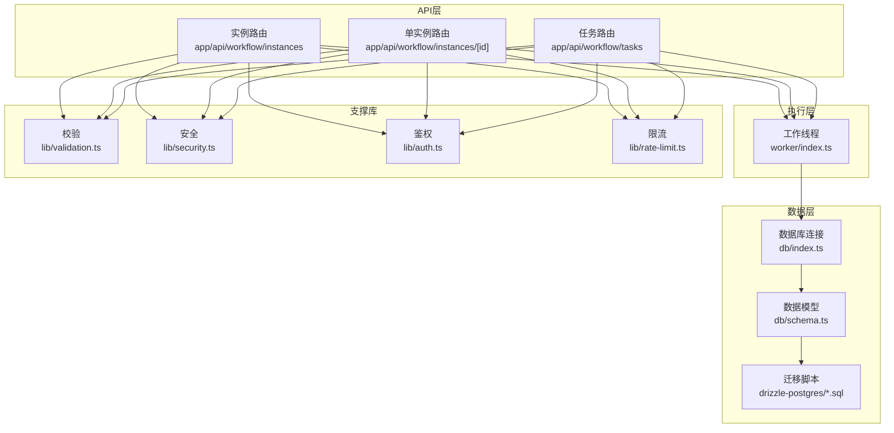
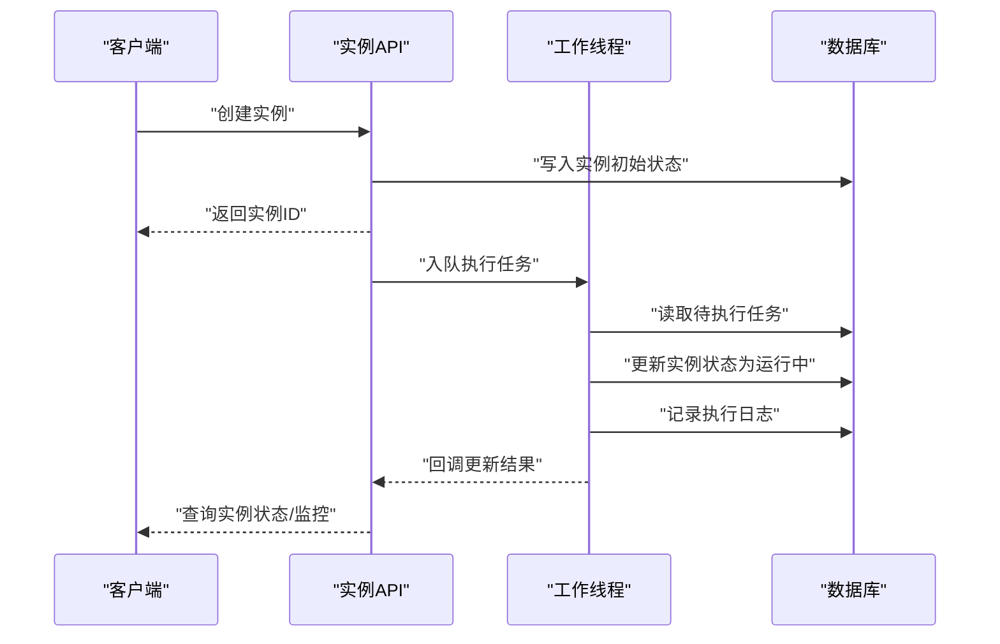
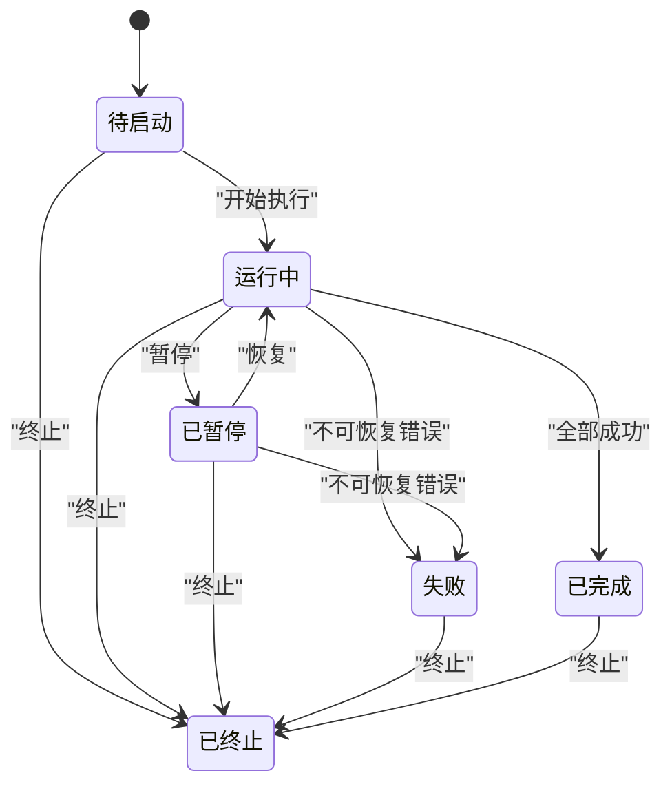
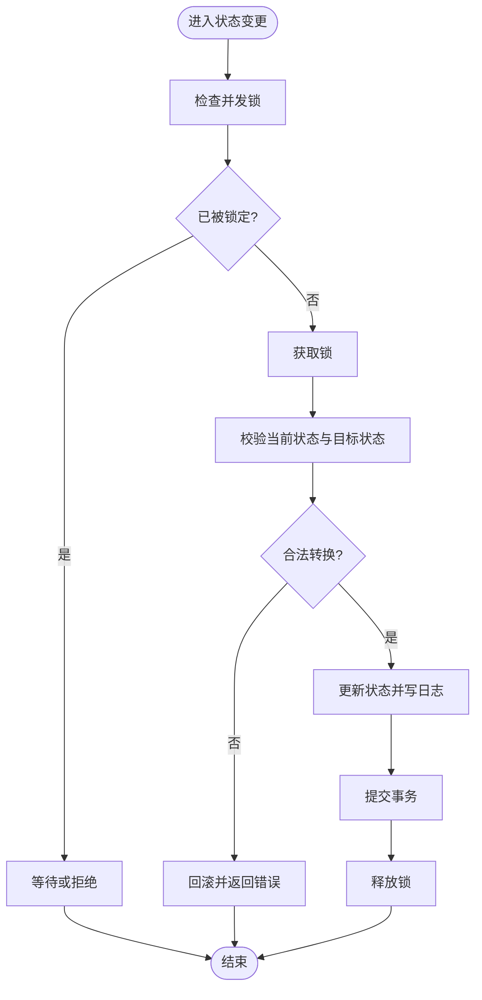
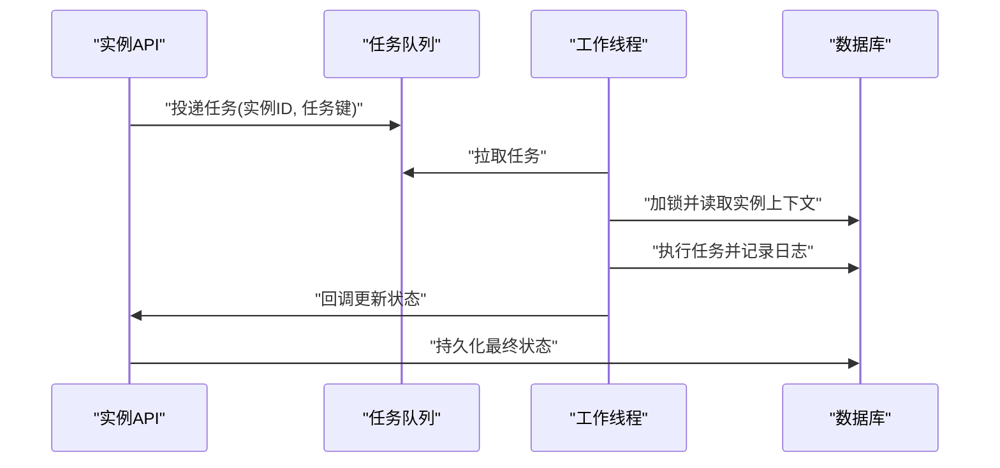
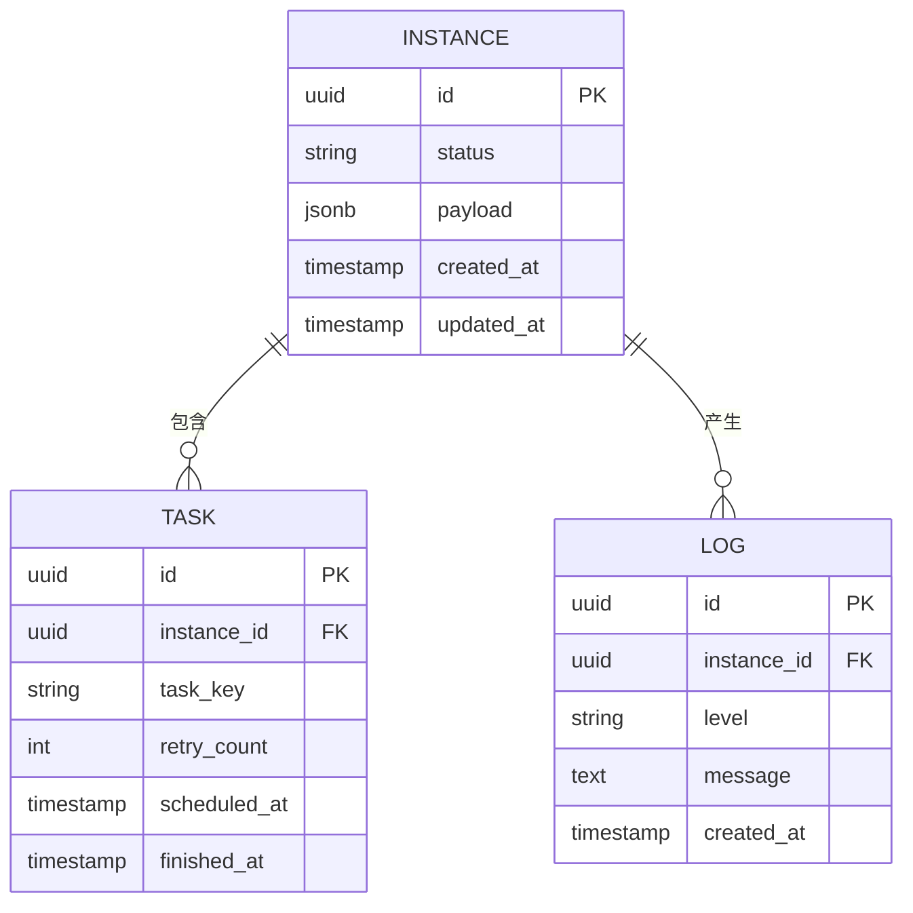
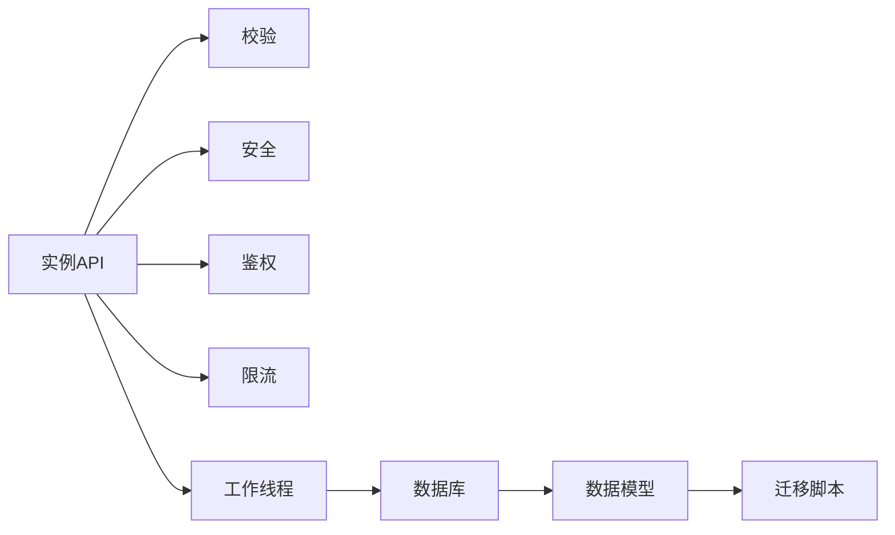

# 工作流实例生命周期

<cite>
**本文引用的文件**   
- [app/api/workflow/instances/route.ts](file://app/api/workflow/instances/route.ts)
- [app/api/workflow/instances/[id]/route.ts](file://app/api/workflow/instances/[id]/route.ts)
- [app/api/workflow/tasks/route.ts](file://app/api/workflow/tasks/route.ts)
- [worker/index.ts](file://worker/index.ts)
- [db/index.ts](file://db/index.ts)
- [db/schema.ts](file://db/schema.ts)
- [drizzle-postgres/meta/_journal.json](file://drizzle-postgres/meta/_journal.json)
- [drizzle-postgres/0000_fine_psylocke.sql](file://drizzle-postgres/0000_fine_psylocke.sql)
- [drizzle-postgres/0001_thin_queen_noir.sql](file://drizzle-postgres/0001_thin_queen_noir.sql)
- [drizzle-postgres/0002_crazy_ravenous.sql](file://drizzle-postgres/0002_crazy_ravenous.sql)
- [drizzle-postgres/0003_fine_quentin_quire.sql](file://drizzle-postgres/0003_fine_quentin_quire.sql)
- [lib/validation.ts](file://lib/validation.ts)
- [lib/security.ts](file://lib/security.ts)
- [lib/auth.ts](file://lib/auth.ts)
- [lib/rate-limit.ts](file://lib/rate-limit.ts)
- [app/components/workflow/workflow-types.ts](file://app/components/workflow/workflow-types.ts)
</cite>

## 目录
1. [简介](#简介)
2. [项目结构](#项目结构)
3. [核心组件](#核心组件)
4. [架构总览](#架构总览)
5. [详细组件分析](#详细组件分析)
6. [依赖关系分析](#依赖关系分析)
7. [性能考量](#性能考量)
8. [故障排查指南](#故障排查指南)
9. [结论](#结论)
10. [附录](#附录)

## 简介
本文件围绕“工作流实例生命周期”展开，系统化阐述实例的创建、执行、暂停、恢复与终止等状态转换的核心逻辑；给出实例状态机设计、并发控制机制与异常处理策略；记录实例管理的API接口规范（查询、监控、批量操作）；说明实例数据的持久化、备份恢复与清理策略；并提供调试工具与性能监控方法。文档面向不同技术背景的读者，力求以循序渐进的方式呈现从概念到实现的完整知识体系。

## 项目结构
本项目采用 Next.js API Routes + Drizzle ORM + PostgreSQL 的架构。工作流实例相关的API位于 app/api/workflow 下，任务调度由 worker/index.ts 承担，数据模型与迁移脚本位于 db 与 drizzle-postgres 目录，校验与安全能力在 lib 中提供。前端组件通过 workflow-types.ts 定义类型契约，便于前后端协作。

图表来源
- [app/api/workflow/instances/route.ts](file://app/api/workflow/instances/route.ts)
- [app/api/workflow/instances/[id]/route.ts](file://app/api/workflow/instances/[id]/route.ts)
- [app/api/workflow/tasks/route.ts](file://app/api/workflow/tasks/route.ts)
- [worker/index.ts](file://worker/index.ts)
- [db/index.ts](file://db/index.ts)
- [db/schema.ts](file://db/schema.ts)
- [drizzle-postgres/0000_fine_psylocke.sql](file://drizzle-postgres/0000_fine_psylocke.sql)
- [drizzle-postgres/0001_thin_queen_noir.sql](file://drizzle-postgres/0001_thin_queen_noir.sql)
- [drizzle-postgres/0002_crazy_ravenous.sql](file://drizzle-postgres/0002_crazy_ravenous.sql)
- [drizzle-postgres/0003_fine_quentin_quire.sql](file://drizzle-postgres/0003_fine_quentin_quire.sql)
- [lib/validation.ts](file://lib/validation.ts)
- [lib/security.ts](file://lib/security.ts)
- [lib/auth.ts](file://lib/auth.ts)
- [lib/rate-limit.ts](file://lib/rate-limit.ts)

章节来源
- [app/api/workflow/instances/route.ts](file://app/api/workflow/instances/route.ts)
- [app/api/workflow/instances/[id]/route.ts](file://app/api/workflow/instances/[id]/route.ts)
- [app/api/workflow/tasks/route.ts](file://app/api/workflow/tasks/route.ts)
- [worker/index.ts](file://worker/index.ts)
- [db/index.ts](file://db/index.ts)
- [db/schema.ts](file://db/schema.ts)
- [drizzle-postgres/meta/_journal.json](file://drizzle-postgres/meta/_journal.json)

## 核心组件
- 实例管理API：负责实例的创建、查询、状态变更（暂停/恢复/终止）、批量操作与监控指标暴露。
- 任务调度器：接收API下发的任务，驱动工作流实例进入执行阶段，并维护执行上下文与重试策略。
- 数据模型与迁移：定义实例、任务、日志等表结构与约束，保证数据一致性与可演进性。
- 校验与安全：对输入进行严格校验，结合鉴权与限流保障系统安全与稳定。
- 前端类型契约：统一前后端数据结构，降低集成成本。

章节来源
- [app/api/workflow/instances/route.ts](file://app/api/workflow/instances/route.ts)
- [app/api/workflow/instances/[id]/route.ts](file://app/api/workflow/instances/[id]/route.ts)
- [app/api/workflow/tasks/route.ts](file://app/api/workflow/tasks/route.ts)
- [worker/index.ts](file://worker/index.ts)
- [db/schema.ts](file://db/schema.ts)
- [lib/validation.ts](file://lib/validation.ts)
- [lib/security.ts](file://lib/security.ts)
- [lib/auth.ts](file://lib/auth.ts)
- [lib/rate-limit.ts](file://lib/rate-limit.ts)
- [app/components/workflow/workflow-types.ts](file://app/components/workflow/workflow-types.ts)

## 架构总览
工作流实例的生命周期由“API层—执行层—数据层”三层协同完成。API层对外暴露REST接口，执行层负责编排与调度，数据层提供强一致性的持久化能力。校验、鉴权与限流贯穿请求链路，确保安全性与稳定性。

图表来源
- [app/api/workflow/instances/route.ts](file://app/api/workflow/instances/route.ts)
- [app/api/workflow/tasks/route.ts](file://app/api/workflow/tasks/route.ts)
- [worker/index.ts](file://worker/index.ts)
- [db/index.ts](file://db/index.ts)
- [db/schema.ts](file://db/schema.ts)

## 详细组件分析

### 实例状态机设计
- 状态集合：待启动、运行中、已暂停、已完成、失败、已终止。
- 合法转换：
  - 待启动 → 运行中：开始执行首个任务或批处理。
  - 运行中 → 已暂停：外部触发暂停或资源不足。
  - 已暂停 → 运行中：恢复执行。
  - 运行中 → 已完成：所有任务成功。
  - 运行中/已暂停 → 失败：不可恢复错误。
  - 任意状态 → 已终止：管理员强制终止。
- 幂等性：状态转换需基于当前状态校验，避免重复操作导致不一致。

图表来源
- [app/api/workflow/instances/route.ts](file://app/api/workflow/instances/route.ts)
- [app/api/workflow/instances/[id]/route.ts](file://app/api/workflow/instances/[id]/route.ts)
- [app/api/workflow/tasks/route.ts](file://app/api/workflow/tasks/route.ts)
- [worker/index.ts](file://worker/index.ts)

章节来源
- [app/api/workflow/instances/route.ts](file://app/api/workflow/instances/route.ts)
- [app/api/workflow/instances/[id]/route.ts](file://app/api/workflow/instances/[id]/route.ts)
- [app/api/workflow/tasks/route.ts](file://app/api/workflow/tasks/route.ts)
- [worker/index.ts](file://worker/index.ts)

### 并发控制机制
- 分布式锁：针对同一实例的并发状态变更使用行级锁或应用层锁，防止竞态条件。
- 任务去重：基于实例ID与任务键生成唯一标识，避免重复执行。
- 限流与背压：API层按IP或用户维度限流，执行层根据队列长度动态调整消费速率。
- 事务边界：状态变更与日志落盘在同一事务内提交，保证一致性。

图表来源
- [app/api/workflow/instances/[id]/route.ts](file://app/api/workflow/instances/[id]/route.ts)
- [worker/index.ts](file://worker/index.ts)
- [db/index.ts](file://db/index.ts)

章节来源
- [app/api/workflow/instances/[id]/route.ts](file://app/api/workflow/instances/[id]/route.ts)
- [worker/index.ts](file://worker/index.ts)
- [db/index.ts](file://db/index.ts)

### 异常处理策略
- 分类处理：区分业务异常（如参数非法、权限不足）与系统异常（如数据库超时、网络错误）。
- 重试与退避：对瞬时错误采用指数退避重试，超过阈值转入失败状态。
- 补偿与回滚：关键步骤失败时执行补偿操作，必要时回滚事务。
- 告警与追踪：记录结构化错误日志，附带实例ID、任务ID与堆栈信息，便于定位。

章节来源
- [lib/validation.ts](file://lib/validation.ts)
- [lib/security.ts](file://lib/security.ts)
- [lib/auth.ts](file://lib/auth.ts)
- [app/api/workflow/instances/route.ts](file://app/api/workflow/instances/route.ts)
- [app/api/workflow/instances/[id]/route.ts](file://app/api/workflow/instances/[id]/route.ts)
- [app/api/workflow/tasks/route.ts](file://app/api/workflow/tasks/route.ts)
- [worker/index.ts](file://worker/index.ts)

### 实例管理API接口规范
- 创建实例
  - 路径：POST /api/workflow/instances
  - 功能：创建新实例，初始化状态为“待启动”，返回实例ID。
  - 校验：必填字段、格式校验、权限校验、限流。
- 查询实例
  - 路径：GET /api/workflow/instances
  - 功能：分页、过滤、排序，支持按状态、时间范围筛选。
- 单实例详情
  - 路径：GET /api/workflow/instances/:id
  - 功能：返回实例基本信息、当前状态、最近日志摘要。
- 状态变更
  - 路径：PATCH /api/workflow/instances/:id
  - 功能：暂停、恢复、终止；包含状态合法性校验与并发锁。
- 批量操作
  - 路径：POST /api/workflow/instances/batch
  - 功能：批量暂停/恢复/终止，支持事务与部分失败回滚。
- 监控指标
  - 路径：GET /api/workflow/instances/:id/metrics
  - 功能：返回运行时长、任务成功率、重试次数、队列深度等。

章节来源
- [app/api/workflow/instances/route.ts](file://app/api/workflow/instances/route.ts)
- [app/api/workflow/instances/[id]/route.ts](file://app/api/workflow/instances/[id]/route.ts)
- [lib/validation.ts](file://lib/validation.ts)
- [lib/security.ts](file://lib/security.ts)
- [lib/auth.ts](file://lib/auth.ts)
- [lib/rate-limit.ts](file://lib/rate-limit.ts)

### 任务调度与执行
- 任务入队：API创建实例后向队列投递任务，携带实例ID、任务键与优先级。
- 消费执行：工作线程拉取任务，加锁后执行，更新实例状态与日志。
- 重试策略：失败重试N次，指数退避；达到上限标记失败。
- 回调更新：执行完成后回调API更新最终状态，确保端到端一致性。

图表来源
- [app/api/workflow/tasks/route.ts](file://app/api/workflow/tasks/route.ts)
- [worker/index.ts](file://worker/index.ts)
- [db/index.ts](file://db/index.ts)

章节来源
- [app/api/workflow/tasks/route.ts](file://app/api/workflow/tasks/route.ts)
- [worker/index.ts](file://worker/index.ts)
- [db/index.ts](file://db/index.ts)

### 数据持久化、备份恢复与清理
- 数据模型：实例表、任务表、日志表，包含必要索引与约束。
- 迁移管理：Drizzle迁移脚本按版本演进，支持回滚与增量更新。
- 备份策略：定期全量快照+增量日志归档，保留周期可配置。
- 清理策略：历史实例与日志按时间窗口清理，释放存储。

图表来源
- [db/schema.ts](file://db/schema.ts)
- [drizzle-postgres/0000_fine_psylocke.sql](file://drizzle-postgres/0000_fine_psylocke.sql)
- [drizzle-postgres/0001_thin_queen_noir.sql](file://drizzle-postgres/0001_thin_queen_noir.sql)
- [drizzle-postgres/0002_crazy_ravenous.sql](file://drizzle-postgres/0002_crazy_ravenous.sql)
- [drizzle-postgres/0003_fine_quentin_quire.sql](file://drizzle-postgres/0003_fine_quentin_quire.sql)

章节来源
- [db/schema.ts](file://db/schema.ts)
- [drizzle-postgres/meta/_journal.json](file://drizzle-postgres/meta/_journal.json)
- [drizzle-postgres/0000_fine_psylocke.sql](file://drizzle-postgres/0000_fine_psylocke.sql)
- [drizzle-postgres/0001_thin_queen_noir.sql](file://drizzle-postgres/0001_thin_queen_noir.sql)
- [drizzle-postgres/0002_crazy_ravenous.sql](file://drizzle-postgres/0002_crazy_ravenous.sql)
- [drizzle-postgres/0003_fine_quentin_quire.sql](file://drizzle-postgres/0003_fine_quentin_quire.sql)

### 调试工具与性能监控
- 调试工具：
  - 实例追踪：通过实例ID检索全链路日志与状态变更轨迹。
  - 任务回放：基于任务键与时间戳回放执行过程，辅助定位问题。
  - 模拟执行：在不影响生产数据的前提下模拟任务执行。
- 性能监控：
  - 指标采集：QPS、延迟分布、错误率、队列深度、CPU/内存占用。
  - 告警规则：阈值触发告警，自动扩容或降级。
  - 容量规划：基于历史峰值评估资源需求，优化批次大小与并发度。

章节来源
- [app/api/workflow/instances/route.ts](file://app/api/workflow/instances/route.ts)
- [app/api/workflow/instances/[id]/route.ts](file://app/api/workflow/instances/[id]/route.ts)
- [app/api/workflow/tasks/route.ts](file://app/api/workflow/tasks/route.ts)
- [worker/index.ts](file://worker/index.ts)

## 依赖关系分析
- API层依赖校验、鉴权、限流模块，确保请求安全与稳定。
- 执行层依赖数据库连接与事务能力，保证状态一致。
- 数据层依赖迁移脚本，实现模型演进与兼容性。
- 前端类型契约与后端API保持一致，减少集成错误。

图表来源
- [app/api/workflow/instances/route.ts](file://app/api/workflow/instances/route.ts)
- [lib/validation.ts](file://lib/validation.ts)
- [lib/security.ts](file://lib/security.ts)
- [lib/auth.ts](file://lib/auth.ts)
- [lib/rate-limit.ts](file://lib/rate-limit.ts)
- [worker/index.ts](file://worker/index.ts)
- [db/index.ts](file://db/index.ts)
- [db/schema.ts](file://db/schema.ts)
- [drizzle-postgres/meta/_journal.json](file://drizzle-postgres/meta/_journal.json)

章节来源
- [app/api/workflow/instances/route.ts](file://app/api/workflow/instances/route.ts)
- [lib/validation.ts](file://lib/validation.ts)
- [lib/security.ts](file://lib/security.ts)
- [lib/auth.ts](file://lib/auth.ts)
- [lib/rate-limit.ts](file://lib/rate-limit.ts)
- [worker/index.ts](file://worker/index.ts)
- [db/index.ts](file://db/index.ts)
- [db/schema.ts](file://db/schema.ts)
- [drizzle-postgres/meta/_journal.json](file://drizzle-postgres/meta/_journal.json)

## 性能考量
- 并发度调优：根据CPU与IO特性设置合适的消费者数量与批次大小。
- 缓存策略：热点实例元数据可短期缓存，注意失效与一致性。
- 异步解耦：将耗时操作放入任务队列，缩短API响应时间。
- 资源隔离：实例级别隔离，避免相互干扰；关键路径加锁粒度最小化。
- 监控与弹性：基于指标自动扩缩容，保障SLA。

[本节为通用指导，不直接分析具体文件]

## 故障排查指南
- 常见问题：
  - 状态不一致：检查事务提交与锁释放是否成对出现。
  - 任务重复执行：核对任务键唯一性与去重逻辑。
  - 性能瓶颈：观察队列堆积与数据库慢查询。
- 排查步骤：
  - 通过实例ID检索日志，定位失败节点。
  - 查看任务重试次数与退避策略是否合理。
  - 检查限流与鉴权是否误拦截。
- 修复建议：
  - 增加重试上限与死信队列。
  - 优化SQL与索引，减少锁竞争。
  - 调整限流阈值与并发度。

章节来源
- [app/api/workflow/instances/route.ts](file://app/api/workflow/instances/route.ts)
- [app/api/workflow/instances/[id]/route.ts](file://app/api/workflow/instances/[id]/route.ts)
- [app/api/workflow/tasks/route.ts](file://app/api/workflow/tasks/route.ts)
- [worker/index.ts](file://worker/index.ts)
- [lib/validation.ts](file://lib/validation.ts)
- [lib/security.ts](file://lib/security.ts)
- [lib/auth.ts](file://lib/auth.ts)
- [lib/rate-limit.ts](file://lib/rate-limit.ts)

## 结论
工作流实例生命周期通过清晰的状态机、严格的并发控制与完善的异常处理，实现了高可靠与可扩展的执行框架。API层提供丰富的管理能力，执行层保证任务编排与一致性，数据层确保持久化与可演进性。配合调试工具与性能监控，可有效提升运维效率与系统稳定性。

[本节为总结，不直接分析具体文件]

## 附录
- 术语表：实例、任务、状态机、幂等性、事务、限流、鉴权、迁移。
- 参考链接：Drizzle ORM 文档、Next.js API Routes 指南、PostgreSQL 事务与锁机制。

[本节为补充信息，不直接分析具体文件]