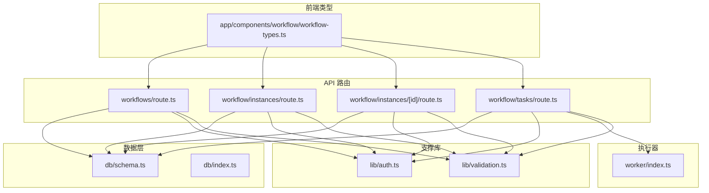
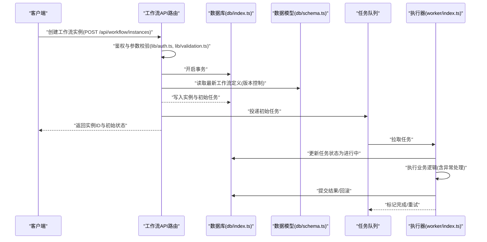
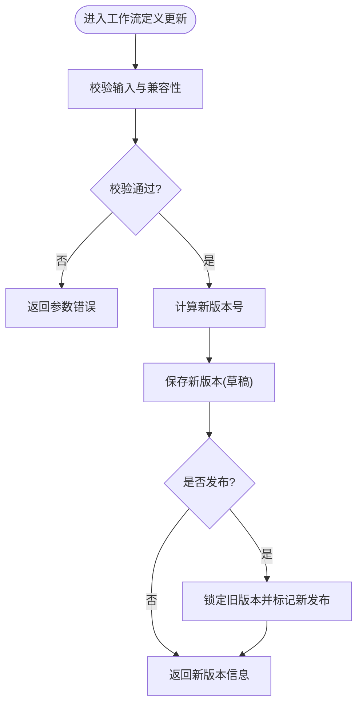
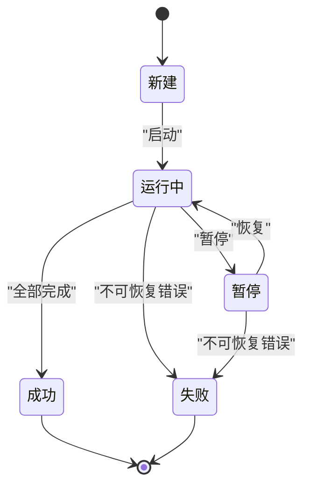
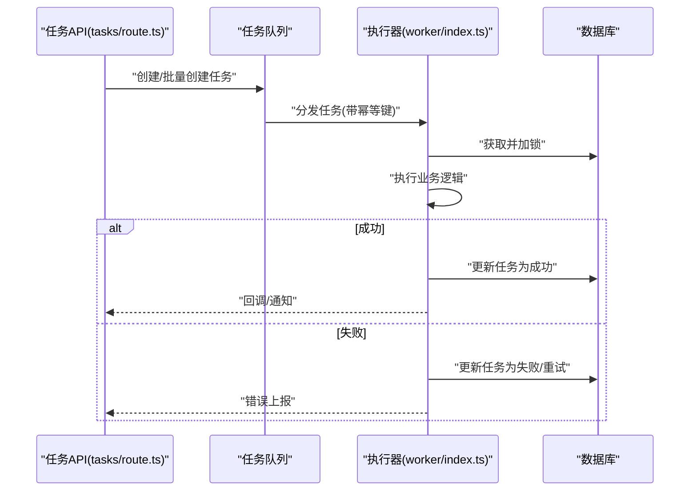
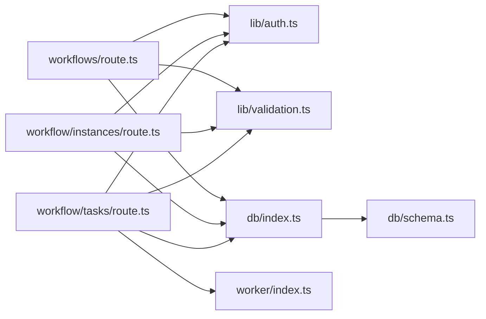

# 工作流管理

<cite>
**本文引用的文件**   
- [app/api/workflows/route.ts](file://app/api/workflows/route.ts)
- [app/api/workflow/instances/route.ts](file://app/api/workflow/instances/route.ts)
- [app/api/workflow/instances/[id]/route.ts](file://app/api/workflow/instances/[id]/route.ts)
- [app/api/workflow/tasks/route.ts](file://app/api/workflow/tasks/route.ts)
- [db/schema.ts](file://db/schema.ts)
- [db/index.ts](file://db/index.ts)
- [lib/auth.ts](file://lib/auth.ts)
- [lib/validation.ts](file://lib/validation.ts)
- [worker/index.ts](file://worker/index.ts)
- [app/components/workflow/workflow-types.ts](file://app/components/workflow/workflow-types.ts)
</cite>

## 目录
1. [简介](#简介)
2. [项目结构](#项目结构)
3. [核心组件](#核心组件)
4. [架构总览](#架构总览)
5. [详细组件分析](#详细组件分析)
6. [依赖分析](#依赖分析)
7. [性能考虑](#性能考虑)
8. [故障排查指南](#故障排查指南)
9. [结论](#结论)
10. [附录](#附录)

## 简介
本文件面向工作流管理系统，系统性阐述工作流定义与实例的CRUD、实例生命周期管理、任务调度与执行引擎的实现要点。内容覆盖：
- 工作流定义的存储与版本控制
- 实例状态机与转换规则
- 任务调度与并发控制
- API 接口请求/响应格式、错误处理与权限校验
- 执行原理、异常处理策略
- 监控与调试工具使用方法

## 项目结构
工作流相关代码主要分布在以下位置：
- API 路由层：app/api/workflows、app/api/workflow/instances、app/api/workflow/tasks
- 数据模型与数据库访问：db/schema.ts、db/index.ts
- 鉴权与校验：lib/auth.ts、lib/validation.ts
- 后台任务执行器：worker/index.ts
- 前端类型定义（与工作流交互相关）：app/components/workflow/workflow-types.ts

图表来源
- [app/api/workflows/route.ts](file://app/api/workflows/route.ts)
- [app/api/workflow/instances/route.ts](file://app/api/workflow/instances/route.ts)
- [app/api/workflow/instances/[id]/route.ts](file://app/api/workflow/instances/[id]/route.ts)
- [app/api/workflow/tasks/route.ts](file://app/api/workflow/tasks/route.ts)
- [db/schema.ts](file://db/schema.ts)
- [db/index.ts](file://db/index.ts)
- [lib/auth.ts](file://lib/auth.ts)
- [lib/validation.ts](file://lib/validation.ts)
- [worker/index.ts](file://worker/index.ts)
- [app/components/workflow/workflow-types.ts](file://app/components/workflow/workflow-types.ts)

章节来源
- [app/api/workflows/route.ts](file://app/api/workflows/route.ts)
- [app/api/workflow/instances/route.ts](file://app/api/workflow/instances/route.ts)
- [app/api/workflow/instances/[id]/route.ts](file://app/api/workflow/instances/[id]/route.ts)
- [app/api/workflow/tasks/route.ts](file://app/api/workflow/tasks/route.ts)
- [db/schema.ts](file://db/schema.ts)
- [db/index.ts](file://db/index.ts)
- [lib/auth.ts](file://lib/auth.ts)
- [lib/validation.ts](file://lib/validation.ts)
- [worker/index.ts](file://worker/index.ts)
- [app/components/workflow/workflow-types.ts](file://app/components/workflow/workflow-types.ts)

## 核心组件
- 工作流定义 CRUD：提供工作流模板的增删改查与版本化能力，用于驱动实例生成。
- 工作流实例生命周期：创建、启动、暂停、恢复、完成、失败等状态流转，保证一致性。
- 任务调度系统：将工作流步骤转化为可执行任务，支持队列、重试、幂等与并发控制。
- 权限与校验：统一鉴权中间件与输入校验，确保接口安全与数据正确性。
- 持久化与迁移：基于 schema 定义的数据表结构与数据库连接管理。
- 执行器：后台 worker 消费任务并执行业务逻辑，具备异常捕获与日志上报。

章节来源
- [app/api/workflows/route.ts](file://app/api/workflows/route.ts)
- [app/api/workflow/instances/route.ts](file://app/api/workflow/instances/route.ts)
- [app/api/workflow/instances/[id]/route.ts](file://app/api/workflow/instances/[id]/route.ts)
- [app/api/workflow/tasks/route.ts](file://app/api/workflow/tasks/route.ts)
- [db/schema.ts](file://db/schema.ts)
- [db/index.ts](file://db/index.ts)
- [lib/auth.ts](file://lib/auth.ts)
- [lib/validation.ts](file://lib/validation.ts)
- [worker/index.ts](file://worker/index.ts)

## 架构总览
整体采用“API 路由 + 数据层 + 执行器”的分层架构：
- API 层负责鉴权、参数校验、事务编排与结果返回
- 数据层通过 schema 定义表结构，集中管理数据库连接
- 执行器作为独立进程或线程池，负责任务的可靠执行与重试

图表来源
- [app/api/workflow/instances/route.ts](file://app/api/workflow/instances/route.ts)
- [app/api/workflow/tasks/route.ts](file://app/api/workflow/tasks/route.ts)
- [db/index.ts](file://db/index.ts)
- [db/schema.ts](file://db/schema.ts)
- [lib/auth.ts](file://lib/auth.ts)
- [lib/validation.ts](file://lib/validation.ts)
- [worker/index.ts](file://worker/index.ts)

## 详细组件分析

### 工作流定义与版本控制
- 设计目标：支持同一工作流的多版本并存，实例创建时绑定具体版本，避免后续修改影响运行中实例。
- 关键能力：
  - 版本递增与快照：每次变更生成新版本，保留历史版本只读。
  - 发布与锁定：仅发布后的版本可用于创建实例；已发布版本可锁定防止再编辑。
  - 兼容性校验：新增字段需兼容旧版本，避免破坏既有实例。
- 存储建议：
  - 工作流定义表包含 id、name、version、schema、status、created_at、updated_at 等字段。
  - 使用唯一约束 (name, version) 保证版本不重复。
- 典型流程：
  - 创建/更新工作流定义 -> 校验 -> 生成新版本 -> 可选发布 -> 返回最新版本信息。

章节来源
- [app/api/workflows/route.ts](file://app/api/workflows/route.ts)
- [db/schema.ts](file://db/schema.ts)
- [lib/validation.ts](file://lib/validation.ts)

### 工作流实例生命周期管理
- 状态机：包括新建、运行中、暂停、恢复、成功、失败等状态，严格限制非法转换。
- 生命周期事件：
  - 创建：根据工作流定义生成初始节点与任务。
  - 启动：将实例置为运行中，并派发首个任务。
  - 暂停/恢复：允许外部干预，保持上下文一致。
  - 完成/失败：最终态，记录结果与错误原因。
- 一致性保障：
  - 使用数据库事务保证实例与任务的状态同步。
  - 幂等键与去重机制防止重复触发。
- 查询与审计：
  - 提供按实例ID、状态、时间范围查询。
  - 记录状态变更日志，便于追踪。

章节来源
- [app/api/workflow/instances/route.ts](file://app/api/workflow/instances/route.ts)
- [app/api/workflow/instances/[id]/route.ts](file://app/api/workflow/instances/[id]/route.ts)
- [db/schema.ts](file://db/schema.ts)

### 任务调度系统与执行引擎
- 任务模型：每个工作流步骤对应一个任务，包含类型、参数、优先级、重试次数、超时、幂等键等。
- 调度策略：
  - 队列优先：支持优先级队列与公平调度。
  - 重试与退避：指数退避与最大重试次数限制。
  - 并发控制：全局与实例级并发上限，避免资源争用。
- 执行器职责：
  - 拉取任务、加锁、执行、落盘结果、释放锁。
  - 异常捕获与分类（业务异常、系统异常），记录日志与指标。
  - 死信队列：对多次失败的任务进行隔离与告警。
- 幂等性与一致性：
  - 幂等键确保相同任务不会重复生效。
  - 任务状态变更必须原子化，避免部分成功。

图表来源
- [app/api/workflow/tasks/route.ts](file://app/api/workflow/tasks/route.ts)
- [worker/index.ts](file://worker/index.ts)
- [db/index.ts](file://db/index.ts)

章节来源
- [app/api/workflow/tasks/route.ts](file://app/api/workflow/tasks/route.ts)
- [worker/index.ts](file://worker/index.ts)
- [db/index.ts](file://db/index.ts)

### 权限验证与输入校验
- 鉴权：
  - 统一鉴权中间件，校验用户身份与角色权限。
  - 支持细粒度授权（如仅管理员可发布工作流）。
- 输入校验：
  - 对所有入参进行类型、长度、枚举值等校验。
  - 失败时返回标准化错误码与消息。
- 安全加固：
  - 防注入、限流、速率限制。
  - 敏感字段脱敏输出。

章节来源
- [lib/auth.ts](file://lib/auth.ts)
- [lib/validation.ts](file://lib/validation.ts)

### 数据模型与存储
- 工作流定义表：
  - 字段：id、name、version、schema、status、created_at、updated_at
  - 约束：唯一(name, version)、索引(name)、索引(status)
- 工作流实例表：
  - 字段：id、workflow_id、version、status、context、created_at、updated_at
  - 约束：外键(workflow_id)、索引(status)、索引(created_at)
- 任务表：
  - 字段：id、instance_id、step、payload、status、retry_count、idempotency_key、created_at、updated_at
  - 约束：外键(instance_id)、唯一(idempotency_key)、索引(status)、索引(instance_id)
- 数据库连接：
  - 连接池配置、超时与重试策略、事务封装。

章节来源
- [db/schema.ts](file://db/schema.ts)
- [db/index.ts](file://db/index.ts)

### 前端类型与交互
- 类型定义：
  - 工作流定义、实例、任务的类型声明，确保前后端数据结构一致。
- 交互约定：
  - 统一的请求/响应包装格式，包含 code、message、data。
  - 错误码规范与提示文案。

章节来源
- [app/components/workflow/workflow-types.ts](file://app/components/workflow/workflow-types.ts)

## 依赖分析
- 模块耦合：
  - API 路由依赖鉴权与校验库，调用数据层进行持久化。
  - 任务API与执行器通过队列解耦，降低直接依赖。
- 外部依赖：
  - 数据库驱动与ORM（Drizzle）
  - 任务队列（内存或外部消息队列）
- 潜在风险：
  - 循环依赖应避免（当前分层清晰，未见循环）。
  - 外部服务可用性（数据库、队列）需有降级与熔断策略。

图表来源
- [app/api/workflows/route.ts](file://app/api/workflows/route.ts)
- [app/api/workflow/instances/route.ts](file://app/api/workflow/instances/route.ts)
- [app/api/workflow/tasks/route.ts](file://app/api/workflow/tasks/route.ts)
- [lib/auth.ts](file://lib/auth.ts)
- [lib/validation.ts](file://lib/validation.ts)
- [db/index.ts](file://db/index.ts)
- [db/schema.ts](file://db/schema.ts)
- [worker/index.ts](file://worker/index.ts)

章节来源
- [app/api/workflows/route.ts](file://app/api/workflows/route.ts)
- [app/api/workflow/instances/route.ts](file://app/api/workflow/instances/route.ts)
- [app/api/workflow/tasks/route.ts](file://app/api/workflow/tasks/route.ts)
- [lib/auth.ts](file://lib/auth.ts)
- [lib/validation.ts](file://lib/validation.ts)
- [db/index.ts](file://db/index.ts)
- [db/schema.ts](file://db/schema.ts)
- [worker/index.ts](file://worker/index.ts)

## 性能考虑
- 数据库优化：
  - 合理索引（状态、时间戳、关联ID）
  - 分页与过滤，避免全表扫描
  - 读写分离与连接池调优
- 任务调度：
  - 批量拉取与批处理提交
  - 优先级队列与公平调度结合
  - 重试退避策略避免雪崩
- 并发控制：
  - 全局并发上限与实例级并发上限
  - 分布式锁避免重复执行
- 缓存与异步：
  - 热点数据缓存（工作流定义）
  - 非关键路径异步化（通知、日志）

[本节为通用指导，无需特定文件来源]

## 故障排查指南
- 常见问题定位：
  - 实例卡住：检查任务状态、执行器日志、数据库锁等待
  - 任务重复执行：核对幂等键与去重逻辑
  - 版本冲突：确认发布与锁定策略
- 日志与监控：
  - 统一日志格式，包含 traceId、userId、workflowId、instanceId、taskId
  - 关键指标：任务成功率、平均耗时、重试率、队列积压
- 调试技巧：
  - 启用慢查询日志
  - 模拟失败场景（网络、数据库、执行器）
  - 回放任务与断点调试

章节来源
- [worker/index.ts](file://worker/index.ts)
- [db/index.ts](file://db/index.ts)

## 结论
本工作流管理系统通过清晰的层次划分与严格的版本控制、状态机与任务调度机制，实现了稳定可靠的工作流执行能力。建议在后续迭代中持续完善监控与可观测性，强化异常恢复与弹性伸缩能力。

[本节为总结，无需特定文件来源]

## 附录
- API 接口概览（示例说明）：
  - 工作流定义：
    - POST /api/workflows：创建工作流定义（草稿/发布）
    - GET /api/workflows：查询工作流列表（支持过滤与分页）
    - GET /api/workflows/:id：获取工作流详情（含版本）
    - PUT /api/workflows/:id：更新工作流定义（生成新版本）
    - DELETE /api/workflows/:id：删除工作流（软删除）
  - 工作流实例：
    - POST /api/workflow/instances：创建实例（绑定工作流版本）
    - GET /api/workflow/instances：查询实例列表（支持状态过滤）
    - GET /api/workflow/instances/:id：获取实例详情与状态
    - PATCH /api/workflow/instances/:id：操作实例（启动/暂停/恢复/终止）
  - 任务：
    - POST /api/workflow/tasks：创建任务（单条/批量）
    - GET /api/workflow/tasks：查询任务（支持实例ID、状态过滤）
    - POST /api/workflow/tasks/retry：重试失败任务
- 错误码与响应格式：
  - 统一响应体：{ code, message, data }
  - 常见错误码：400（参数错误）、401（未认证）、403（无权限）、404（资源不存在）、409（冲突）、500（服务器错误）
- 权限矩阵：
  - 管理员：工作流定义CRUD、发布/锁定、实例管理、任务管理
  - 普通用户：实例创建与查询、任务查询与重试（受限）

[本节为概念性说明，无需特定文件来源]