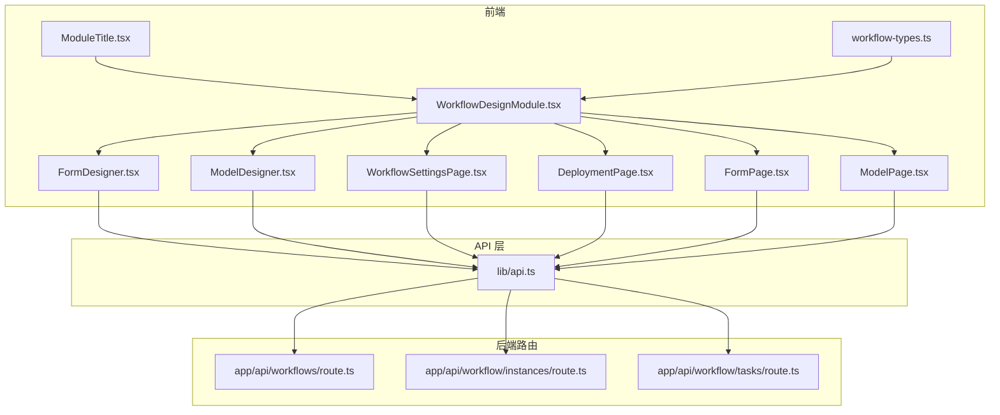
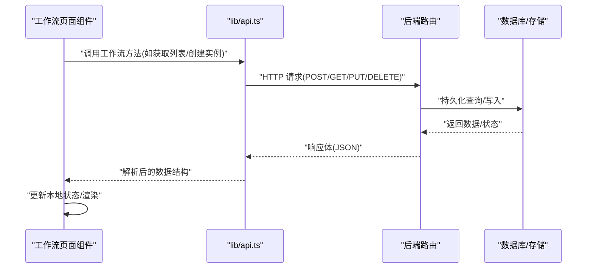
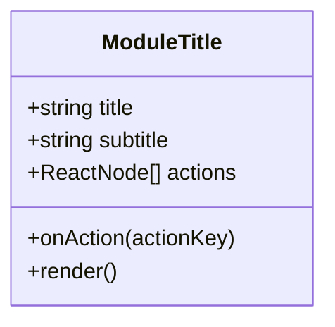
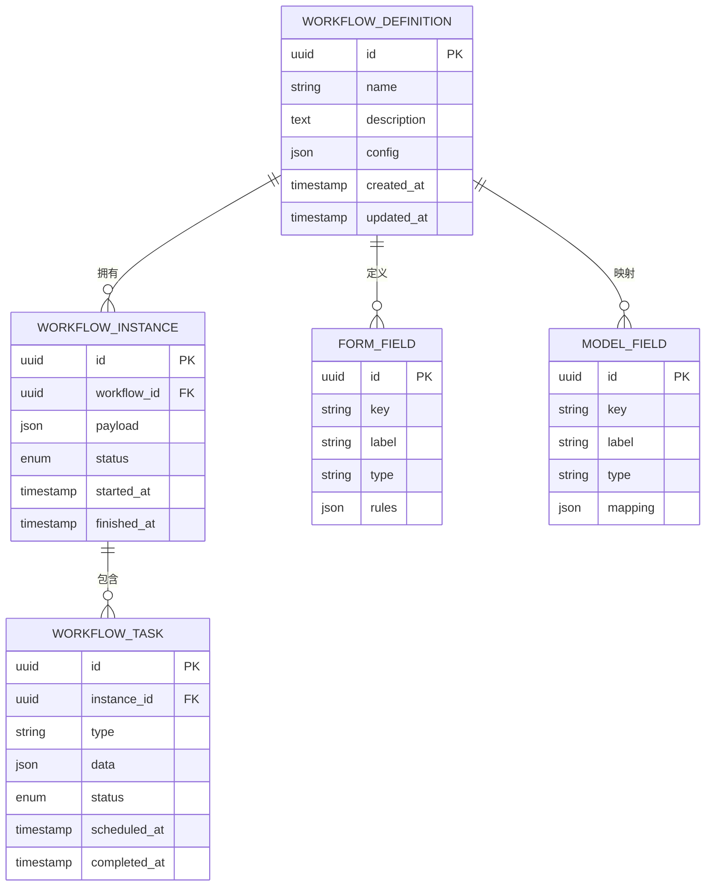
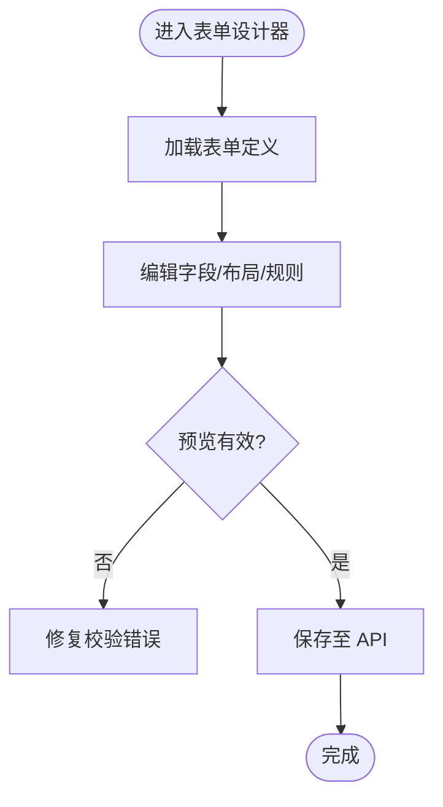
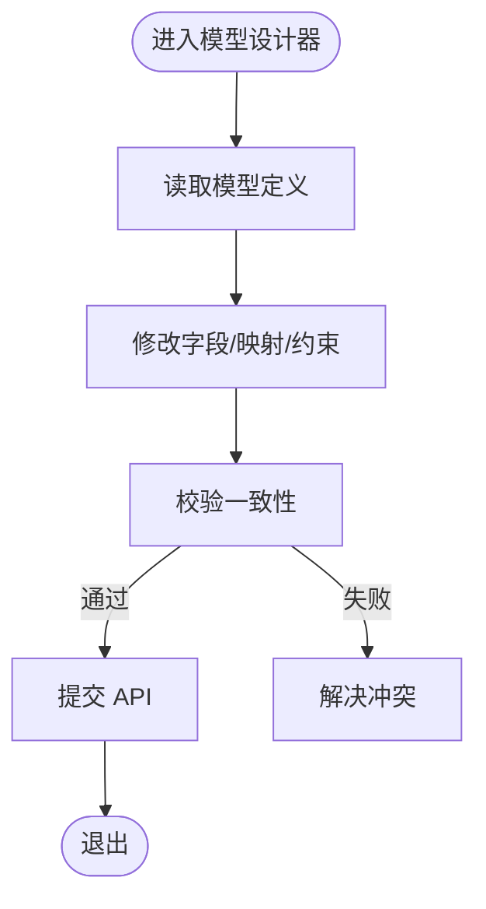
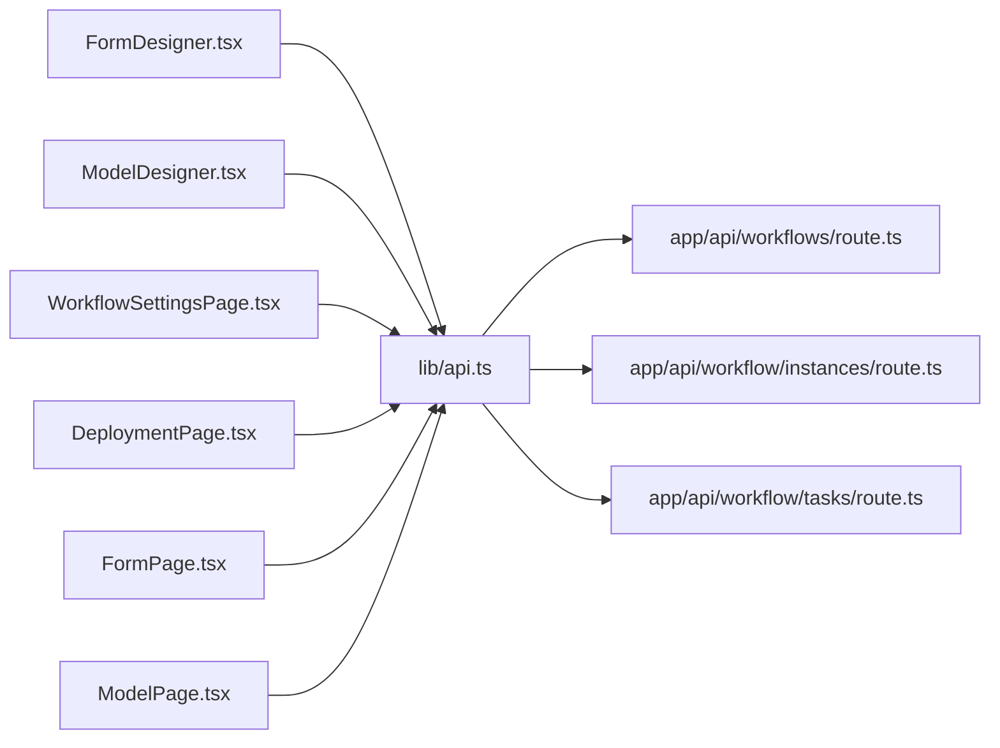

# 工作流组件

<cite>
**本文引用的文件**   
- [ModuleTitle.tsx](file://app/components/workflow/ModuleTitle.tsx)
- [workflow-types.ts](file://app/components/workflow/workflow-types.ts)
- [FormDesigner.tsx](file://app/components/workflow/FormDesigner.tsx)
- [ModelDesigner.tsx](file://app/components/workflow/ModelDesigner.tsx)
- [WorkflowSettingsPage.tsx](file://app/components/workflow/WorkflowSettingsPage.tsx)
- [DeploymentPage.tsx](file://app/components/workflow/DeploymentPage.tsx)
- [FormPage.tsx](file://app/components/workflow/FormPage.tsx)
- [ModelPage.tsx](file://app/components/workflow/ModelPage.tsx)
- [WorkflowDesignModule.tsx](file://app/WorkflowDesignModule.tsx)
- [api.ts](file://lib/api.ts)
- [route.ts](file://app/api/workflows/route.ts)
- [route.ts](file://app/api/workflow/instances/route.ts)
- [route.ts](file://app/api/workflow/tasks/route.ts)
</cite>

## 目录
1. [简介](#简介)
2. [项目结构](#项目结构)
3. [核心组件](#核心组件)
4. [架构总览](#架构总览)
5. [详细组件分析](#详细组件分析)
6. [依赖关系分析](#依赖关系分析)
7. [性能考量](#性能考量)
8. [故障排查指南](#故障排查指南)
9. [结论](#结论)
10. [附录](#附录)

## 简介
本文件面向工作流模块的通用组件与类型体系，重点覆盖：
- 模块标题组件（ModuleTitle）的实现细节、接口规范与使用模式
- 工作流类型定义（workflow-types.ts）的结构与扩展点
- 共享工具函数与数据访问约定（API 层与路由层）
- 组件间通信机制、状态共享与数据传递方式
- 可扩展性设计与自定义开发指南
- 测试与调试最佳实践

## 项目结构
工作流相关代码主要分布在以下位置：
- app/components/workflow：前端工作流页面与通用组件
- app/WorkflowDesignModule.tsx：工作流设计入口模块
- lib/api.ts：统一 API 调用封装
- app/api/workflow*：后端工作流相关路由（实例、任务、工作流定义等）

图表来源
- [WorkflowDesignModule.tsx](file://app/WorkflowDesignModule.tsx)
- [FormDesigner.tsx](file://app/components/workflow/FormDesigner.tsx)
- [ModelDesigner.tsx](file://app/components/workflow/ModelDesigner.tsx)
- [WorkflowSettingsPage.tsx](file://app/components/workflow/WorkflowSettingsPage.tsx)
- [DeploymentPage.tsx](file://app/components/workflow/DeploymentPage.tsx)
- [FormPage.tsx](file://app/components/workflow/FormPage.tsx)
- [ModelPage.tsx](file://app/components/workflow/ModelPage.tsx)
- [ModuleTitle.tsx](file://app/components/workflow/ModuleTitle.tsx)
- [workflow-types.ts](file://app/components/workflow/workflow-types.ts)
- [api.ts](file://lib/api.ts)
- [route.ts](file://app/api/workflows/route.ts)
- [route.ts](file://app/api/workflow/instances/route.ts)
- [route.ts](file://app/api/workflow/tasks/route.ts)

章节来源
- [WorkflowDesignModule.tsx](file://app/WorkflowDesignModule.tsx)
- [workflow-types.ts](file://app/components/workflow/workflow-types.ts)
- [api.ts](file://lib/api.ts)

## 核心组件
本节聚焦工作流中的通用组件与类型定义，说明其职责边界、属性接口与使用方式。

- 模块标题组件（ModuleTitle）
  - 职责：为工作流各子页面提供统一的标题展示区域，支持标题文本、副标题、操作按钮插槽等
  - 典型属性：标题、副标题、是否显示操作区、操作回调、样式控制键
  - 使用模式：在页面顶部包裹内容区域，配合路由切换或页面级状态更新

- 工作流类型定义（workflow-types.ts）
  - 职责：集中定义工作流实体、表单字段、模型字段、节点、步骤、权限等类型
  - 关键类型：工作流定义、实例、任务、表单配置、模型配置、节点与边、校验规则、错误码
  - 扩展点：新增字段类型、节点类型、动作类型时，优先在此处扩展并保证向后兼容

- 页面与设计师组件（FormDesigner / ModelDesigner / WorkflowSettingsPage / DeploymentPage / FormPage / ModelPage）
  - 职责：分别负责表单设计器、模型设计器、工作流设置、部署页、表单页与模型页
  - 交互模式：通过 API 层读写工作流定义与实例；通过事件回调与父级状态同步

章节来源
- [ModuleTitle.tsx](file://app/components/workflow/ModuleTitle.tsx)
- [workflow-types.ts](file://app/components/workflow/workflow-types.ts)
- [FormDesigner.tsx](file://app/components/workflow/FormDesigner.tsx)
- [ModelDesigner.tsx](file://app/components/workflow/ModelDesigner.tsx)
- [WorkflowSettingsPage.tsx](file://app/components/workflow/WorkflowSettingsPage.tsx)
- [DeploymentPage.tsx](file://app/components/workflow/DeploymentPage.tsx)
- [FormPage.tsx](file://app/components/workflow/FormPage.tsx)
- [ModelPage.tsx](file://app/components/workflow/ModelPage.tsx)

## 架构总览
工作流模块采用“前端页面 + 统一 API 层 + 后端路由”的分层架构：
- 前端页面组件通过 lib/api.ts 发起请求，避免直接耦合后端路径
- 后端路由按资源划分（workflows、instances、tasks），提供 RESTful 接口
- 类型定义集中在 workflow-types.ts，前后端契约以类型为准，便于演进

图表来源
- [api.ts](file://lib/api.ts)
- [route.ts](file://app/api/workflows/route.ts)
- [route.ts](file://app/api/workflow/instances/route.ts)
- [route.ts](file://app/api/workflow/tasks/route.ts)

## 详细组件分析

### 模块标题组件（ModuleTitle）
- 设计目标
  - 统一工作流子页面的头部展示，降低重复布局成本
  - 提供可插拔的操作区，便于在不同页面注入不同行为
- 属性接口（建议）
  - title: string（必填）
  - subtitle?: string（可选）
  - actions?: ReactNode[]（可选）
  - onAction?(actionKey: string): void（可选）
  - className?: string（可选）
- 使用示例（概念）
  - 在页面顶部引入并传入标题与操作按钮数组
  - 点击操作按钮触发 onAction，由父组件处理业务逻辑
- 可访问性与国际化
  - 建议为标题与操作按钮提供 aria-label
  - 文案建议抽离到 i18n 资源文件

图表来源
- [ModuleTitle.tsx](file://app/components/workflow/ModuleTitle.tsx)

章节来源
- [ModuleTitle.tsx](file://app/components/workflow/ModuleTitle.tsx)

### 工作流类型体系（workflow-types.ts）
- 类型分层
  - 基础类型：ID、时间戳、枚举、分页参数
  - 领域类型：工作流定义、实例、任务、表单字段、模型字段、节点、边
  - 校验与错误：错误码、校验结果、异常包装
- 扩展策略
  - 新增字段类型时，保持向后兼容（可选字段、默认值）
  - 对枚举进行版本化管理，避免破坏现有实例
- 契约管理
  - 前端类型与后端响应保持一致，必要时在 API 层做适配转换

图表来源
- [workflow-types.ts](file://app/components/workflow/workflow-types.ts)

章节来源
- [workflow-types.ts](file://app/components/workflow/workflow-types.ts)

### 表单设计器（FormDesigner）
- 职责
  - 可视化编辑表单字段、布局与校验规则
  - 预览与导出表单配置
- 数据流
  - 从 API 加载表单定义 -> 本地状态维护 -> 变更保存至 API
- 交互要点
  - 拖拽排序、字段增删改、校验规则编辑器
  - 实时预览与校验反馈

图表来源
- [FormDesigner.tsx](file://app/components/workflow/FormDesigner.tsx)
- [api.ts](file://lib/api.ts)

章节来源
- [FormDesigner.tsx](file://app/components/workflow/FormDesigner.tsx)
- [api.ts](file://lib/api.ts)

### 模型设计器（ModelDesigner）
- 职责
  - 可视化编辑数据模型字段、映射与约束
  - 与表单设计器联动，确保字段一致性
- 数据流
  - 读取模型定义 -> 本地编辑 -> 校验与合并 -> 提交 API
- 关键点
  - 字段类型映射、必填/唯一性等约束可视化

图表来源
- [ModelDesigner.tsx](file://app/components/workflow/ModelDesigner.tsx)
- [api.ts](file://lib/api.ts)

章节来源
- [ModelDesigner.tsx](file://app/components/workflow/ModelDesigner.tsx)
- [api.ts](file://lib/api.ts)

### 工作流设置页（WorkflowSettingsPage）
- 职责
  - 管理工作流全局设置（名称、描述、权限、版本等）
- 交互
  - 表单输入与校验、保存与回滚、版本历史查看

章节来源
- [WorkflowSettingsPage.tsx](file://app/components/workflow/WorkflowSettingsPage.tsx)

### 部署页（DeploymentPage）
- 职责
  - 发布/回滚工作流版本、查看部署状态
- 流程
  - 选择版本 -> 预检 -> 部署 -> 监控状态

章节来源
- [DeploymentPage.tsx](file://app/components/workflow/DeploymentPage.tsx)

### 表单页（FormPage）与模型页（ModelPage）
- 职责
  - 运行态展示与交互：表单填写、提交、结果展示；模型数据浏览与筛选
- 数据流
  - 通过 API 获取数据 -> 本地缓存 -> 用户交互 -> 写回 API

章节来源
- [FormPage.tsx](file://app/components/workflow/FormPage.tsx)
- [ModelPage.tsx](file://app/components/workflow/ModelPage.tsx)

## 依赖关系分析
- 组件耦合
  - 页面组件依赖 api.ts 进行数据访问，避免直接耦合后端路径
  - 类型定义集中在 workflow-types.ts，减少跨文件重复声明
- 外部依赖
  - 后端路由提供 RESTful 接口，遵循标准 HTTP 语义
- 潜在循环依赖
  - 页面组件之间尽量通过状态提升或事件总线解耦，避免相互引用

图表来源
- [FormDesigner.tsx](file://app/components/workflow/FormDesigner.tsx)
- [ModelDesigner.tsx](file://app/components/workflow/ModelDesigner.tsx)
- [WorkflowSettingsPage.tsx](file://app/components/workflow/WorkflowSettingsPage.tsx)
- [DeploymentPage.tsx](file://app/components/workflow/DeploymentPage.tsx)
- [FormPage.tsx](file://app/components/workflow/FormPage.tsx)
- [ModelPage.tsx](file://app/components/workflow/ModelPage.tsx)
- [api.ts](file://lib/api.ts)
- [route.ts](file://app/api/workflows/route.ts)
- [route.ts](file://app/api/workflow/instances/route.ts)
- [route.ts](file://app/api/workflow/tasks/route.ts)

章节来源
- [api.ts](file://lib/api.ts)
- [route.ts](file://app/api/workflows/route.ts)
- [route.ts](file://app/api/workflow/instances/route.ts)
- [route.ts](file://app/api/workflow/tasks/route.ts)

## 性能考量
- 数据加载
  - 列表分页与懒加载，避免一次性拉取大量数据
  - 合理缓存热点数据（如表单/模型定义），减少重复请求
- 渲染优化
  - 大列表虚拟化渲染，减少 DOM 节点数量
  - 组件拆分与按需加载，降低首屏体积
- 网络优化
  - 合并请求与去重，避免并发风暴
  - 错误重试与退避策略，提高稳定性

[本节为通用指导，不直接分析具体文件]

## 故障排查指南
- 常见问题定位
  - 检查 API 层请求参数与响应结构是否符合类型定义
  - 确认后端路由是否正确处理请求方法与路径
  - 查看浏览器控制台与网络面板的错误信息
- 调试技巧
  - 在关键路径添加日志输出（注意脱敏）
  - 使用断点调试组件状态变化与事件回调
- 恢复策略
  - 提供回滚与撤销功能，保障用户数据安全
  - 记录操作审计日志，便于问题回溯

章节来源
- [api.ts](file://lib/api.ts)
- [route.ts](file://app/api/workflows/route.ts)
- [route.ts](file://app/api/workflow/instances/route.ts)
- [route.ts](file://app/api/workflow/tasks/route.ts)

## 结论
工作流组件通过清晰的类型定义、统一的 API 层与模块化页面组件，实现了高内聚、低耦合的设计。模块标题组件提供了统一的视觉与交互基线，类型体系保障了前后端契约稳定。建议在后续迭代中持续完善错误处理、性能优化与可观测性，以提升整体质量与可维护性。

[本节为总结，不直接分析具体文件]

## 附录
- 扩展开发指南
  - 新增节点类型：在 workflow-types.ts 扩展类型，并在对应设计器中实现渲染与编辑逻辑
  - 自定义字段类型：扩展表单字段类型映射与校验规则
  - 插件化：通过事件总线或上下文注入扩展点，避免侵入核心逻辑
- 测试与调试
  - 单元测试：针对工具函数与类型转换编写用例
  - 集成测试：模拟 API 响应，验证页面组件的数据流
  - E2E 测试：覆盖关键用户路径（创建、编辑、部署、运行）

[本节为补充说明，不直接分析具体文件]