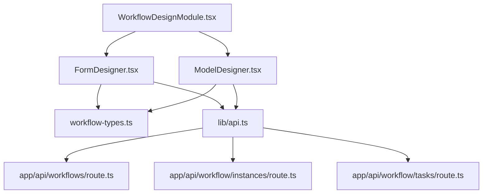
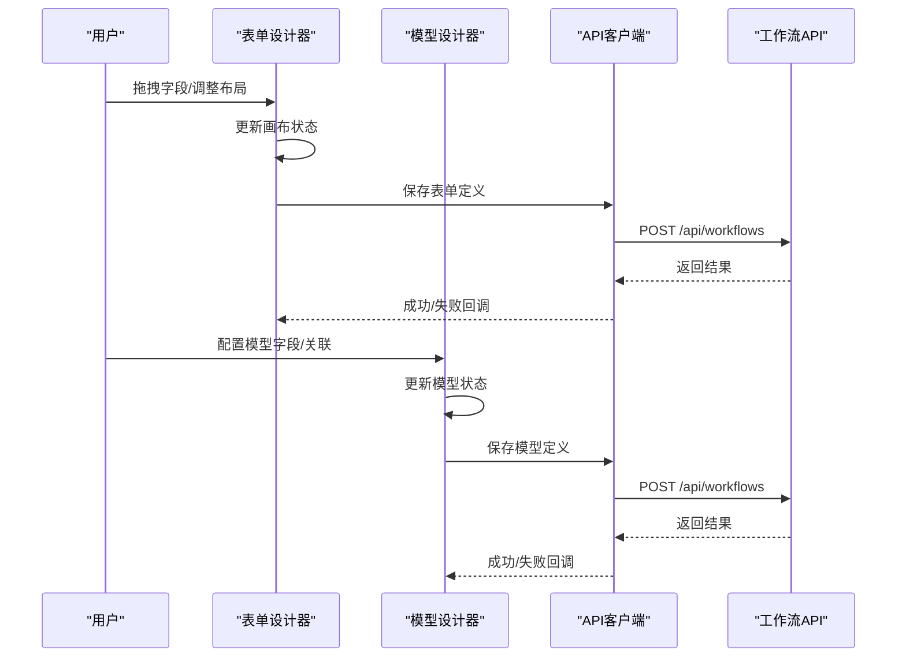
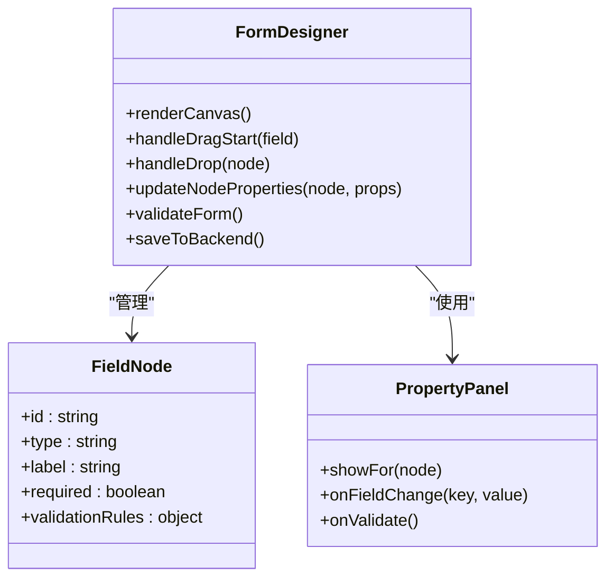
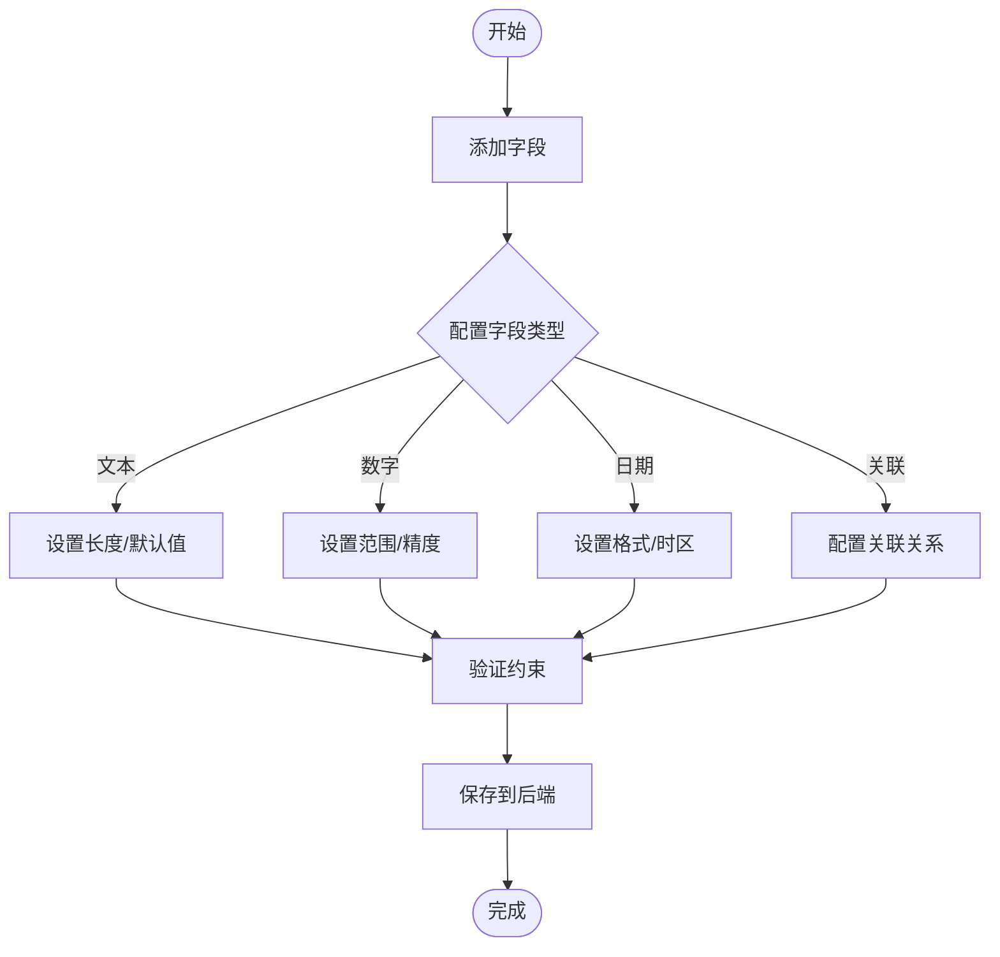
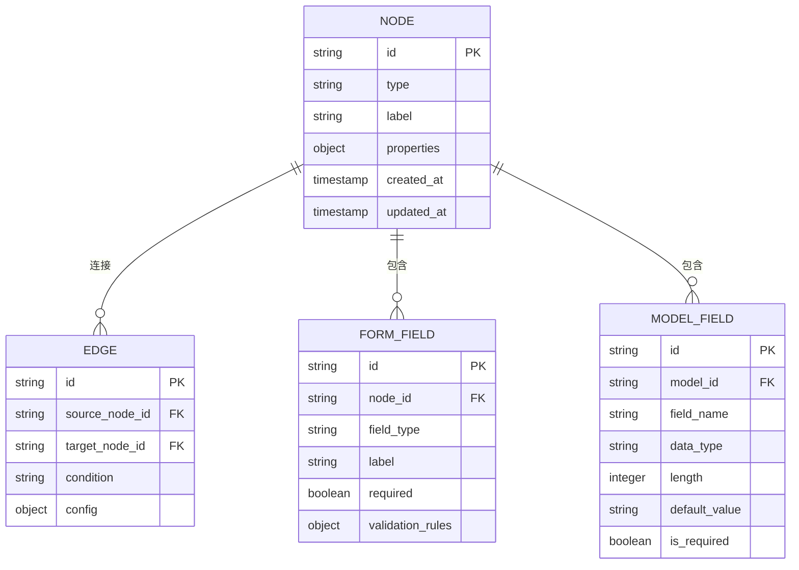
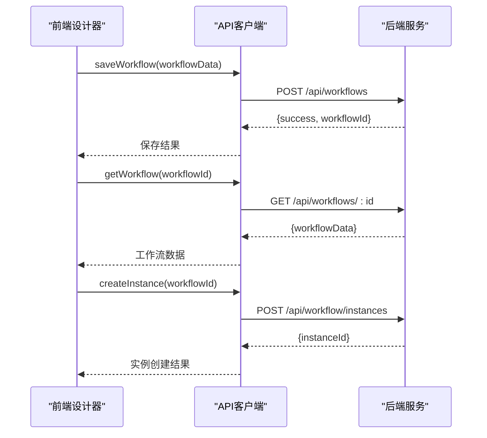
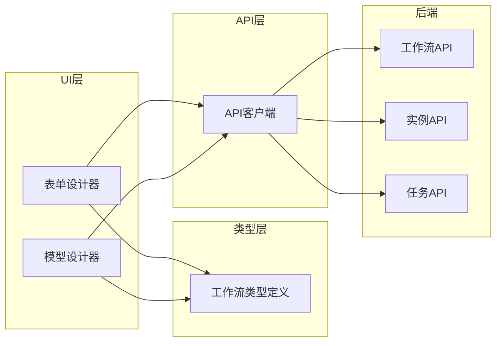

# 工作流设计器

<cite>
**本文引用的文件**   
- [WorkflowDesignModule.tsx](file://app/WorkflowDesignModule.tsx)
- [FormDesigner.tsx](file://app/components/workflow/FormDesigner.tsx)
- [ModelDesigner.tsx](file://app/components/workflow/ModelDesigner.tsx)
- [workflow-types.ts](file://app/components/workflow/workflow-types.ts)
- [route.ts](file://app/api/workflows/route.ts)
- [route.ts](file://app/api/workflow/instances/route.ts)
- [route.ts](file://app/api/workflow/tasks/route.ts)
- [api.ts](file://lib/api.ts)
</cite>

## 目录
1. [简介](#简介)
2. [项目结构](#项目结构)
3. [核心组件](#核心组件)
4. [架构总览](#架构总览)
5. [详细组件分析](#详细组件分析)
6. [依赖关系分析](#依赖关系分析)
7. [性能考虑](#性能考虑)
8. [故障排查指南](#故障排查指南)
9. [结论](#结论)
10. [附录](#附录)

## 简介
本文件面向工作流设计器的开发者与使用者，系统性阐述表单设计器与模型设计器的实现细节、组件交互与可视化编辑能力。重点覆盖拖拽操作、节点配置、连线逻辑等核心功能的数据结构与状态管理，以及与后端API的集成和数据同步策略。同时提供自定义节点开发与扩展指南，帮助快速扩展设计器能力。

## 项目结构
工作流设计器位于前端应用模块中，包含页面级入口、两个核心设计器（表单设计器与模型设计器）、类型定义以及对应的后端API路由。整体采用“页面-组件-类型-API”的分层组织方式：
- 页面入口：负责路由与容器渲染
- 设计器组件：承载可视化画布、工具栏、属性面板与事件总线
- 类型定义：统一描述节点、边、表单字段、模型字段等数据结构
- API层：封装HTTP请求与错误处理，对接后端工作流相关接口

图表来源 
- [WorkflowDesignModule.tsx](file://app/WorkflowDesignModule.tsx)
- [FormDesigner.tsx](file://app/components/workflow/FormDesigner.tsx)
- [ModelDesigner.tsx](file://app/components/workflow/ModelDesigner.tsx)
- [workflow-types.ts](file://app/components/workflow/workflow-types.ts)
- [api.ts](file://lib/api.ts)
- [route.ts](file://app/api/workflows/route.ts)
- [route.ts](file://app/api/workflow/instances/route.ts)
- [route.ts](file://app/api/workflow/tasks/route.ts)

章节来源
- [WorkflowDesignModule.tsx](file://app/WorkflowDesignModule.tsx)
- [FormDesigner.tsx](file://app/components/workflow/FormDesigner.tsx)
- [ModelDesigner.tsx](file://app/components/workflow/ModelDesigner.tsx)
- [workflow-types.ts](file://app/components/workflow/workflow-types.ts)
- [api.ts](file://lib/api.ts)
- [route.ts](file://app/api/workflows/route.ts)
- [route.ts](file://app/api/workflow/instances/route.ts)
- [route.ts](file://app/api/workflow/tasks/route.ts)

## 核心组件
- 表单设计器：提供可视化表单布局、字段拖拽、属性配置与预览校验能力
- 模型设计器：提供数据模型建模、字段类型定义、关联关系与约束配置能力
- 类型系统：集中定义节点、边、表单字段、模型字段、连接规则等数据结构
- API客户端：封装工作流相关API调用，统一错误处理与重试策略

章节来源
- [FormDesigner.tsx](file://app/components/workflow/FormDesigner.tsx)
- [ModelDesigner.tsx](file://app/components/workflow/ModelDesigner.tsx)
- [workflow-types.ts](file://app/components/workflow/workflow-types.ts)
- [api.ts](file://lib/api.ts)

## 架构总览
工作流设计器采用“前端设计器 + 后端API”的解耦架构。前端通过事件驱动的状态管理维护画布状态，用户操作触发状态变更并持久化到后端；后端提供RESTful接口用于保存/加载工作流定义、实例与任务信息。

图表来源 
- [FormDesigner.tsx](file://app/components/workflow/FormDesigner.tsx)
- [ModelDesigner.tsx](file://app/components/workflow/ModelDesigner.tsx)
- [api.ts](file://lib/api.ts)
- [route.ts](file://app/api/workflows/route.ts)

## 详细组件分析

### 表单设计器
表单设计器负责可视化编辑表单结构，支持字段拖拽、属性配置、实时预览与校验。其核心包括：
- 画布区域：渲染字段节点与布局
- 工具栏：提供可拖拽字段源
- 属性面板：根据选中节点动态显示配置项
- 事件总线：处理拖拽、选择、删除等操作

图表来源 
- [FormDesigner.tsx](file://app/components/workflow/FormDesigner.tsx)
- [workflow-types.ts](file://app/components/workflow/workflow-types.ts)

章节来源
- [FormDesigner.tsx](file://app/components/workflow/FormDesigner.tsx)
- [workflow-types.ts](file://app/components/workflow/workflow-types.ts)

### 模型设计器
模型设计器用于定义数据模型结构，包括字段类型、长度、默认值、关联关系等。核心功能：
- 模型画布：展示实体与关系
- 字段编辑器：添加/修改字段属性
- 关系配置：定义一对一、一对多等关联
- 约束验证：确保模型完整性

图表来源 
- [ModelDesigner.tsx](file://app/components/workflow/ModelDesigner.tsx)
- [workflow-types.ts](file://app/components/workflow/workflow-types.ts)

章节来源
- [ModelDesigner.tsx](file://app/components/workflow/ModelDesigner.tsx)
- [workflow-types.ts](file://app/components/workflow/workflow-types.ts)

### 类型系统与数据结构
工作流设计器使用统一的类型定义来描述所有设计元素，确保前后端数据一致性：

图表来源 
- [workflow-types.ts](file://app/components/workflow/workflow-types.ts)

章节来源
- [workflow-types.ts](file://app/components/workflow/workflow-types.ts)

### 后端API集成
设计器通过API客户端与工作流后端服务通信，主要接口包括：
- 工作流定义CRUD：保存/获取工作流结构
- 实例管理：创建工作流实例
- 任务处理：查询和处理工作流任务

图表来源 
- [api.ts](file://lib/api.ts)
- [route.ts](file://app/api/workflows/route.ts)
- [route.ts](file://app/api/workflow/instances/route.ts)

章节来源
- [api.ts](file://lib/api.ts)
- [route.ts](file://app/api/workflows/route.ts)
- [route.ts](file://app/api/workflow/instances/route.ts)
- [route.ts](file://app/api/workflow/tasks/route.ts)

## 依赖关系分析
设计器组件之间的依赖关系清晰，遵循单一职责原则：

图表来源 
- [FormDesigner.tsx](file://app/components/workflow/FormDesigner.tsx)
- [ModelDesigner.tsx](file://app/components/workflow/ModelDesigner.tsx)
- [workflow-types.ts](file://app/components/workflow/workflow-types.ts)
- [api.ts](file://lib/api.ts)
- [route.ts](file://app/api/workflows/route.ts)
- [route.ts](file://app/api/workflow/instances/route.ts)
- [route.ts](file://app/api/workflow/tasks/route.ts)

章节来源
- [FormDesigner.tsx](file://app/components/workflow/FormDesigner.tsx)
- [ModelDesigner.tsx](file://app/components/workflow/ModelDesigner.tsx)
- [workflow-types.ts](file://app/components/workflow/workflow-types.ts)
- [api.ts](file://lib/api.ts)
- [route.ts](file://app/api/workflows/route.ts)
- [route.ts](file://app/api/workflow/instances/route.ts)
- [route.ts](file://app/api/workflow/tasks/route.ts)

## 性能考虑
- 虚拟滚动：对于大量字段或节点的场景，建议使用虚拟滚动优化渲染性能
- 增量更新：只更新变化的节点和属性，避免全量重渲染
- 防抖节流：对频繁的属性修改操作进行防抖处理
- 缓存策略：对已加载的工作流数据进行本地缓存
- 异步加载：按需加载大型组件和第三方库

## 故障排查指南
常见问题及解决方案：
- 拖拽失效：检查拖拽事件绑定和z-index层级
- 节点不显示：验证节点数据类型和渲染条件
- 连线错误：确认节点ID唯一性和连接规则
- API请求失败：检查网络状态和错误响应处理
- 状态不同步：验证状态更新逻辑和持久化机制

## 结论
工作流设计器提供了完整的可视化工作流编辑能力，通过清晰的组件架构和类型系统，实现了表单设计与模型设计的分离与协作。结合后端API，形成了完整的工作流定义、实例管理和任务处理闭环。建议在实际使用中根据业务需求扩展自定义节点类型，并优化性能表现。

## 附录

### 自定义节点开发指南
1. 定义节点类型：在类型系统中注册新的节点类型
2. 实现渲染组件：创建节点的可视化表示
3. 配置属性面板：定义节点的编辑界面
4. 处理交互逻辑：实现拖拽、连接、配置等功能
5. 注册到设计器：将新节点添加到工具栏和渲染器

### 数据同步策略
- 乐观更新：先更新UI，再同步后端，失败时回滚
- 冲突解决：基于时间戳的版本控制
- 增量同步：只传输变更的数据
- 离线支持：本地存储和网络恢复机制

章节来源
- [workflow-types.ts](file://app/components/workflow/workflow-types.ts)
- [api.ts](file://lib/api.ts)
- [route.ts](file://app/api/workflows/route.ts)
- [route.ts](file://app/api/workflow/instances/route.ts)
- [route.ts](file://app/api/workflow/tasks/route.ts)