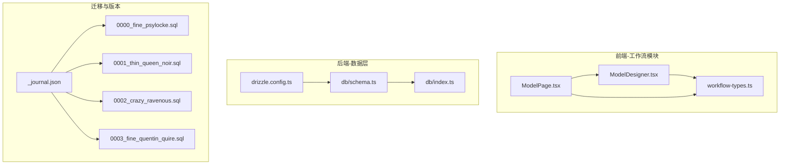
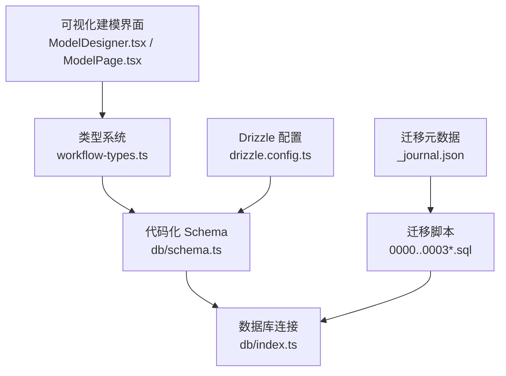
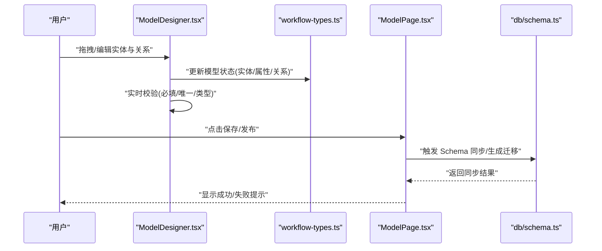
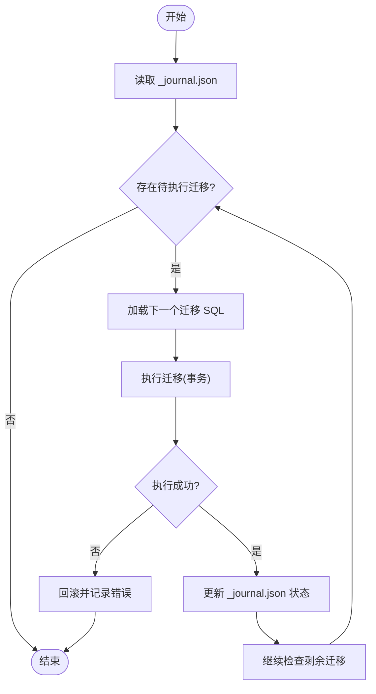
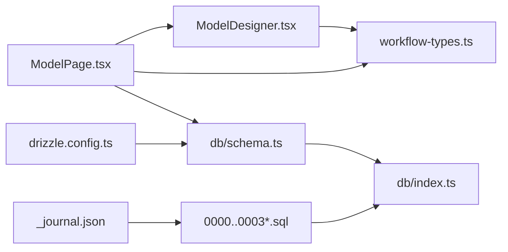

# 模型设计器

<cite>
**本文引用的文件**   
- [ModelDesigner.tsx](file://app/components/workflow/ModelDesigner.tsx)
- [ModelPage.tsx](file://app/components/workflow/ModelPage.tsx)
- [workflow-types.ts](file://app/components/workflow/workflow-types.ts)
- [schema.ts](file://db/schema.ts)
- [index.ts](file://db/index.ts)
- [drizzle.config.ts](file://drizzle.config.ts)
- [_journal.json](file://drizzle-postgres/meta/_journal.json)
- [0000_fine_psylocke.sql](file://drizzle-postgres/0000_fine_psylocke.sql)
- [0001_thin_queen_noir.sql](file://drizzle-postgres/0001_thin_queen_noir.sql)
- [0002_crazy_ravenous.sql](file://drizzle-postgres/0002_crazy_ravenous.sql)
- [0003_fine_quentin_quire.sql](file://drizzle-postgres/0003_fine_quentin_quire.sql)
</cite>

## 目录
1. [简介](#简介)
2. [项目结构](#项目结构)
3. [核心组件](#核心组件)
4. [架构总览](#架构总览)
5. [详细组件分析](#详细组件分析)
6. [依赖关系分析](#依赖关系分析)
7. [性能考量](#性能考量)
8. [故障排查指南](#故障排查指南)
9. [结论](#结论)
10. [附录](#附录)

## 简介
本文件面向“模型设计器”的可视化建模能力，围绕实体关系图、属性定义、约束设置、数据模型与关系映射、业务规则配置、版本控制与变更追踪、数据库 Schema 自动生成与迁移、以及扩展开发与自定义类型等主题进行系统化说明。文档旨在帮助开发者快速理解并高效使用模型设计器，同时为后续扩展与维护提供清晰指引。

## 项目结构
模型设计器位于前端工作流模块中，主要涉及以下文件：
- 可视化建模界面与交互逻辑：ModelDesigner.tsx、ModelPage.tsx
- 类型定义与共享数据结构：workflow-types.ts
- 数据库 Schema 定义与连接：db/schema.ts、db/index.ts
- Drizzle ORM 配置与迁移元数据：drizzle.config.ts、drizzle-postgres/meta/_journal.json 与各迁移 SQL

图表来源
- [ModelDesigner.tsx](file://app/components/workflow/ModelDesigner.tsx)
- [ModelPage.tsx](file://app/components/workflow/ModelPage.tsx)
- [workflow-types.ts](file://app/components/workflow/workflow-types.ts)
- [schema.ts](file://db/schema.ts)
- [index.ts](file://db/index.ts)
- [drizzle.config.ts](file://drizzle.config.ts)
- [_journal.json](file://drizzle-postgres/meta/_journal.json)
- [0000_fine_psylocke.sql](file://drizzle-postgres/0000_fine_psylocke.sql)
- [0001_thin_queen_noir.sql](file://drizzle-postgres/0001_thin_queen_noir.sql)
- [0002_crazy_ravenous.sql](file://drizzle-postgres/0002_crazy_ravenous.sql)
- [0003_fine_quentin_quire.sql](file://drizzle-postgres/0003_fine_quentin_quire.sql)

章节来源
- [ModelDesigner.tsx](file://app/components/workflow/ModelDesigner.tsx)
- [ModelPage.tsx](file://app/components/workflow/ModelPage.tsx)
- [workflow-types.ts](file://app/components/workflow/workflow-types.ts)
- [schema.ts](file://db/schema.ts)
- [index.ts](file://db/index.ts)
- [drizzle.config.ts](file://drizzle.config.ts)
- [_journal.json](file://drizzle-postgres/meta/_journal.json)
- [0000_fine_psylocke.sql](file://drizzle-postgres/0000_fine_psylocke.sql)
- [0001_thin_queen_noir.sql](file://drizzle-postgres/0001_thin_queen_noir.sql)
- [0002_crazy_ravenous.sql](file://drizzle-postgres/0002_crazy_ravenous.sql)
- [0003_fine_quentin_quire.sql](file://drizzle-postgres/0003_fine_quentin_quire.sql)

## 核心组件
- 可视化建模界面（ModelDesigner）：负责实体节点、关系连线、属性面板、约束编辑与预览导出。
- 页面容器（ModelPage）：承载设计器视图、状态管理、保存/发布流程以及与后端的交互。
- 类型系统（workflow-types）：统一描述实体、属性、关系、约束、版本与迁移元数据等数据结构。
- 数据库 Schema（db/schema）：以代码形式声明表结构、字段类型、索引与约束，作为生成迁移与运行时的权威源。
- 迁移与版本（drizzle-postgres/*）：按时间顺序记录每次变更，支持回滚与同步策略。

章节来源
- [ModelDesigner.tsx](file://app/components/workflow/ModelDesigner.tsx)
- [ModelPage.tsx](file://app/components/workflow/ModelPage.tsx)
- [workflow-types.ts](file://app/components/workflow/workflow-types.ts)
- [schema.ts](file://db/schema.ts)
- [index.ts](file://db/index.ts)
- [drizzle.config.ts](file://drizzle.config.ts)
- [_journal.json](file://drizzle-postgres/meta/_journal.json)
- [0000_fine_psylocke.sql](file://drizzle-postgres/0000_fine_psylocke.sql)
- [0001_thin_queen_noir.sql](file://drizzle-postgres/0001_thin_queen_noir.sql)
- [0002_crazy_ravenous.sql](file://drizzle-postgres/0002_crazy_ravenous.sql)
- [0003_fine_quentin_quire.sql](file://drizzle-postgres/0003_fine_quentin_quire.sql)

## 架构总览
模型设计器的整体架构由“前端可视化建模 + 类型驱动的数据模型 + 代码化 Schema + 迁移版本管理”构成。用户通过可视化界面完成实体与关系的建模，类型系统确保前后端一致；Schema 作为单一事实源，驱动迁移脚本生成与执行，保证数据库结构与模型定义始终同步。

图表来源
- [ModelDesigner.tsx](file://app/components/workflow/ModelDesigner.tsx)
- [ModelPage.tsx](file://app/components/workflow/ModelPage.tsx)
- [workflow-types.ts](file://app/components/workflow/workflow-types.ts)
- [schema.ts](file://db/schema.ts)
- [index.ts](file://db/index.ts)
- [drizzle.config.ts](file://drizzle.config.ts)
- [_journal.json](file://drizzle-postgres/meta/_journal.json)
- [0000_fine_psylocke.sql](file://drizzle-postgres/0000_fine_psylocke.sql)
- [0001_thin_queen_noir.sql](file://drizzle-postgres/0001_thin_queen_noir.sql)
- [0002_crazy_ravenous.sql](file://drizzle-postgres/0002_crazy_ravenous.sql)
- [0003_fine_quentin_quire.sql](file://drizzle-postgres/0003_fine_quentin_quire.sql)

## 详细组件分析

### 可视化建模界面（ModelDesigner）
- 功能要点
  - 实体节点：创建、移动、选择、删除；展示名称、标识符与关键属性摘要。
  - 关系连线：一对一、一对多、多对多；支持方向性与基数标注。
  - 属性面板：字段名、类型、是否必填、默认值、长度限制、正则校验等。
  - 约束设置：唯一性、外键、检查约束、级联行为。
  - 预览与导出：生成 JSON/YAML 模型描述，或触发 Schema 同步。
- 交互流程
  - 用户在画布上操作 → 更新内存中的模型状态 → 实时校验与高亮错误 → 保存/发布时持久化。

图表来源
- [ModelDesigner.tsx](file://app/components/workflow/ModelDesigner.tsx)
- [ModelPage.tsx](file://app/components/workflow/ModelPage.tsx)
- [workflow-types.ts](file://app/components/workflow/workflow-types.ts)
- [schema.ts](file://db/schema.ts)

章节来源
- [ModelDesigner.tsx](file://app/components/workflow/ModelDesigner.tsx)
- [ModelPage.tsx](file://app/components/workflow/ModelPage.tsx)
- [workflow-types.ts](file://app/components/workflow/workflow-types.ts)

### 页面容器（ModelPage）
- 职责
  - 管理设计器生命周期：初始化、加载已有模型、保存草稿、发布上线。
  - 协调前后端：调用 API 或本地持久化，处理错误与重试。
  - 集成迁移流程：在发布阶段触发迁移执行与状态上报。
- 关键点
  - 状态隔离：草稿与已发布版本分离，避免误覆盖。
  - 权限控制：仅授权用户可发布或执行迁移。

章节来源
- [ModelPage.tsx](file://app/components/workflow/ModelPage.tsx)

### 类型系统（workflow-types）
- 作用
  - 统一定义实体、属性、关系、约束、版本与迁移元数据的 TypeScript 类型。
  - 为可视化编辑器与后端 Schema 生成提供一致的契约。
- 典型结构
  - 实体：名称、标识、字段集合、索引、约束。
  - 属性：名称、类型、可选性、默认值、校验规则。
  - 关系：源实体、目标实体、基数、外键命名。
  - 版本：版本号、变更集、时间戳、作者。
  - 迁移：ID、SQL 内容、状态、依赖。

章节来源
- [workflow-types.ts](file://app/components/workflow/workflow-types.ts)

### 数据库 Schema（db/schema）
- 作用
  - 以代码形式声明表结构、字段类型、索引与约束，作为迁移生成的权威源。
  - 与 Drizzle ORM 集成，提供类型安全的查询与写入。
- 关键点
  - 字段类型映射：字符串、数值、布尔、日期、枚举等。
  - 约束表达：主键、唯一、非空、外键、检查约束。
  - 索引优化：单列/复合索引、唯一索引、部分索引。

章节来源
- [schema.ts](file://db/schema.ts)
- [index.ts](file://db/index.ts)

### 迁移与版本控制（drizzle-postgres）
- 机制
  - 每个迁移对应一个带序号的 SQL 文件，按时间顺序执行。
  - _journal.json 记录迁移元数据（ID、状态、依赖），用于幂等执行与回滚。
- 策略
  - 向前兼容：新增字段优先允许为空，再回填数据。
  - 原子性：事务包裹复杂变更，失败自动回滚。
  - 可观测性：记录执行日志与耗时，便于审计与排障。

图表来源
- [_journal.json](file://drizzle-postgres/meta/_journal.json)
- [0000_fine_psylocke.sql](file://drizzle-postgres/0000_fine_psylocke.sql)
- [0001_thin_queen_noir.sql](file://drizzle-postgres/0001_thin_queen_noir.sql)
- [0002_crazy_ravenous.sql](file://drizzle-postgres/0002_crazy_ravenous.sql)
- [0003_fine_quentin_quire.sql](file://drizzle-postgres/0003_fine_quentin_quire.sql)

章节来源
- [_journal.json](file://drizzle-postgres/meta/_journal.json)
- [0000_fine_psylocke.sql](file://drizzle-postgres/0000_fine_psylocke.sql)
- [0001_thin_queen_noir.sql](file://drizzle-postgres/0001_thin_queen_noir.sql)
- [0002_crazy_ravenous.sql](file://drizzle-postgres/0002_crazy_ravenous.sql)
- [0003_fine_quentin_quire.sql](file://drizzle-postgres/0003_fine_quentin_quire.sql)

## 依赖关系分析
- 前端依赖
  - ModelDesigner.tsx 依赖 workflow-types.ts 的类型定义，确保模型状态一致性。
  - ModelPage.tsx 协调 UI 与 Schema/迁移流程，可能依赖 db/index.ts 的连接配置。
- 后端依赖
  - db/schema.ts 作为 Schema 权威源，被迁移工具与运行时查询共同依赖。
  - drizzle.config.ts 指定数据库连接与迁移路径，影响迁移执行环境。
- 迁移依赖
  - _journal.json 决定迁移执行顺序与幂等性，各 SQL 文件按序执行。

图表来源
- [ModelDesigner.tsx](file://app/components/workflow/ModelDesigner.tsx)
- [ModelPage.tsx](file://app/components/workflow/ModelPage.tsx)
- [workflow-types.ts](file://app/components/workflow/workflow-types.ts)
- [schema.ts](file://db/schema.ts)
- [index.ts](file://db/index.ts)
- [drizzle.config.ts](file://drizzle.config.ts)
- [_journal.json](file://drizzle-postgres/meta/_journal.json)
- [0000_fine_psylocke.sql](file://drizzle-postgres/0000_fine_psylocke.sql)
- [0001_thin_queen_noir.sql](file://drizzle-postgres/0001_thin_queen_noir.sql)
- [0002_crazy_ravenous.sql](file://drizzle-postgres/0002_crazy_ravenous.sql)
- [0003_fine_quentin_quire.sql](file://drizzle-postgres/0003_fine_quentin_quire.sql)

章节来源
- [ModelDesigner.tsx](file://app/components/workflow/ModelDesigner.tsx)
- [ModelPage.tsx](file://app/components/workflow/ModelPage.tsx)
- [workflow-types.ts](file://app/components/workflow/workflow-types.ts)
- [schema.ts](file://db/schema.ts)
- [index.ts](file://db/index.ts)
- [drizzle.config.ts](file://drizzle.config.ts)
- [_journal.json](file://drizzle-postgres/meta/_journal.json)
- [0000_fine_psylocke.sql](file://drizzle-postgres/0000_fine_psylocke.sql)
- [0001_thin_queen_noir.sql](file://drizzle-postgres/0001_thin_queen_noir.sql)
- [0002_crazy_ravenous.sql](file://drizzle-postgres/0002_crazy_ravenous.sql)
- [0003_fine_quentin_quire.sql](file://drizzle-postgres/0003_fine_quentin_quire.sql)

## 性能考量
- 渲染性能
  - 实体与属性数量较大时，采用虚拟滚动与增量更新减少重绘。
  - 关系连线计算复杂度 O(E)，建议限制边数或使用聚合视图。
- 校验性能
  - 将高频校验（必填、类型）前置到输入事件，低频校验（唯一性、外键）延迟至提交。
- 迁移性能
  - 大表变更分批次执行，避免长事务锁表。
  - 使用并行迁移与幂等检查降低重复执行开销。

[本节为通用指导，不直接分析具体文件]

## 故障排查指南
- 常见问题
  - 迁移执行失败：检查 _journal.json 状态与 SQL 语法，确认依赖顺序。
  - 类型不一致：核对 workflow-types.ts 与 db/schema.ts 的字段映射。
  - 权限不足：确认当前用户具备发布与迁移执行权限。
- 定位步骤
  - 查看浏览器控制台错误与网络请求响应。
  - 检查迁移日志与数据库错误日志。
  - 回滚最近一次迁移，逐步缩小问题范围。

章节来源
- [_journal.json](file://drizzle-postgres/meta/_journal.json)
- [0000_fine_psylocke.sql](file://drizzle-postgres/0000_fine_psylocke.sql)
- [0001_thin_queen_noir.sql](file://drizzle-postgres/0001_thin_queen_noir.sql)
- [0002_crazy_ravenous.sql](file://drizzle-postgres/0002_crazy_ravenous.sql)
- [0003_fine_quentin_quire.sql](file://drizzle-postgres/0003_fine_quentin_quire.sql)

## 结论
模型设计器通过可视化建模、类型驱动与代码化 Schema，实现了从设计到落地的闭环。借助迁移与版本控制，保证了数据库结构的演进可控、可追溯。建议在扩展开发中严格遵循类型契约与迁移规范，确保系统稳定与可维护性。

[本节为总结性内容，不直接分析具体文件]

## 附录
- 扩展开发指南
  - 自定义类型：在 workflow-types.ts 中扩展类型定义，并在 db/schema.ts 中映射到数据库类型。
  - 约束扩展：在前端增加约束编辑器，在后端实现校验与迁移脚本生成。
  - 插件化：将特定实体的编辑逻辑封装为独立组件，按需注入到 ModelDesigner。
- 最佳实践
  - 变更前评审：所有 Schema 变更需经过代码审查与测试验证。
  - 渐进式发布：先灰度发布，观察指标后再全量上线。
  - 监控与告警：对迁移执行时长、失败率与回滚次数设置阈值告警。

[本节为补充信息，不直接分析具体文件]