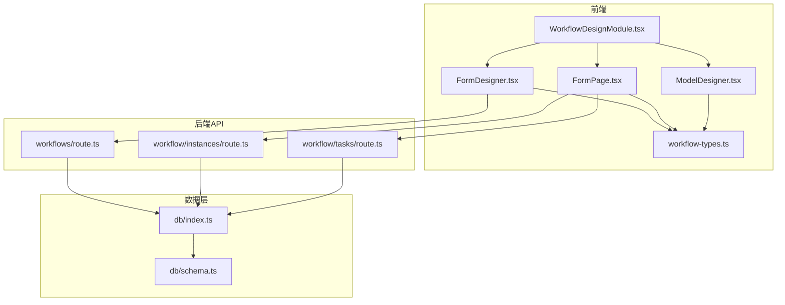
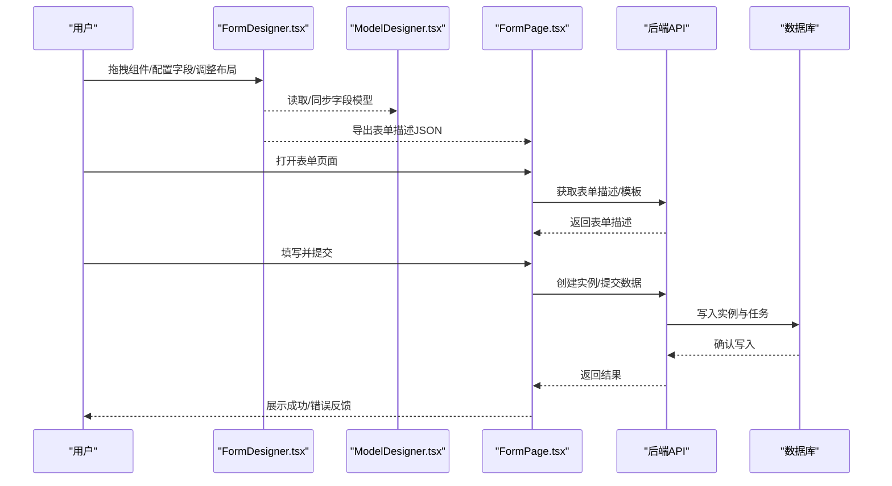
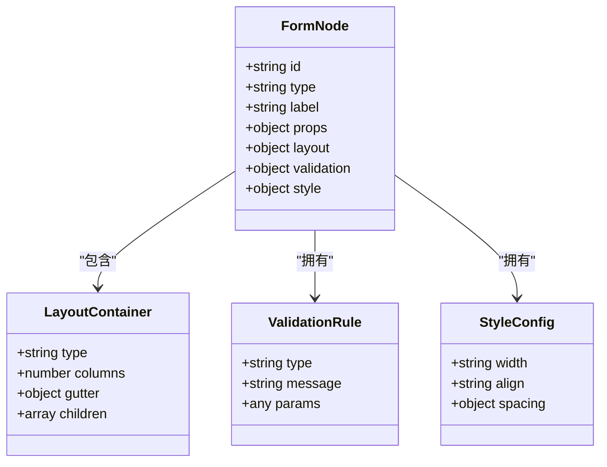
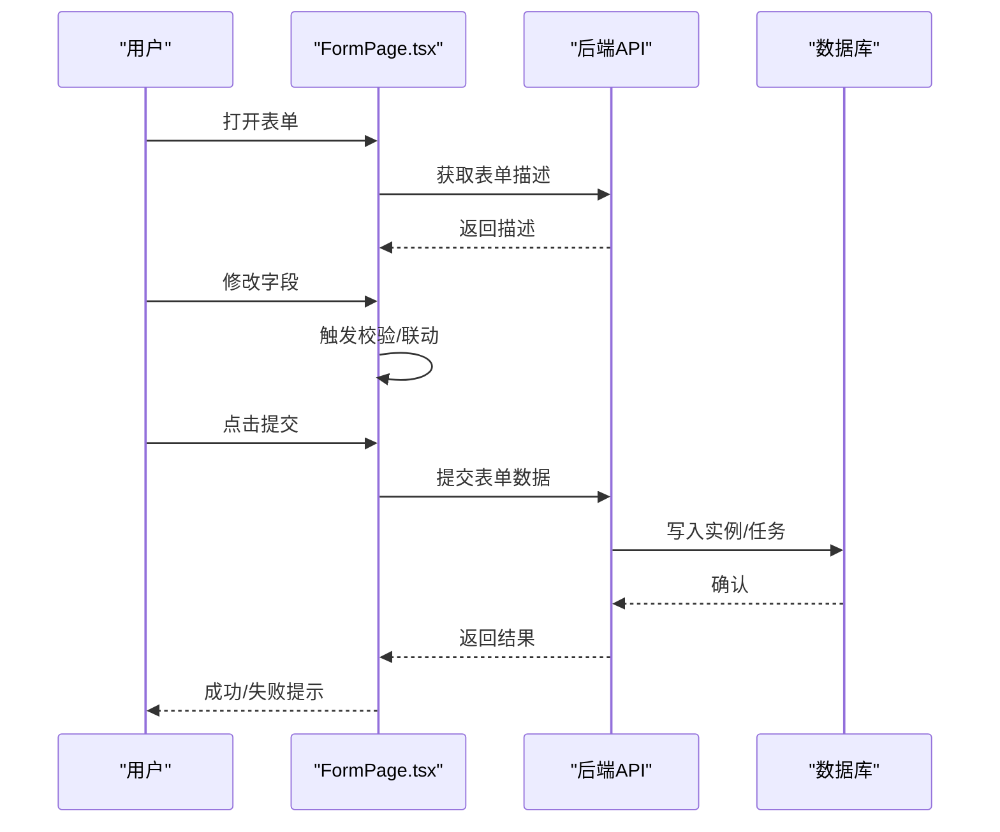
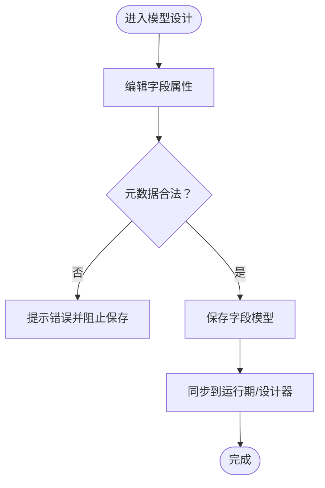
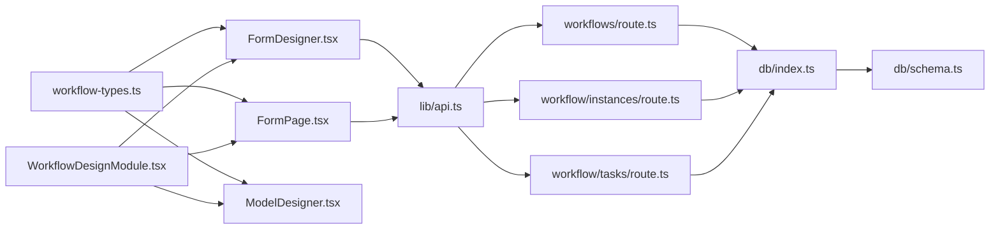

# 表单设计器

<cite>
**本文引用的文件**   
- [FormDesigner.tsx](file://app/components/workflow/FormDesigner.tsx)
- [workflow-types.ts](file://app/components/workflow/workflow-types.ts)
- [FormPage.tsx](file://app/components/workflow/FormPage.tsx)
- [ModelDesigner.tsx](file://app/components/workflow/ModelDesigner.tsx)
- [WorkflowDesignModule.tsx](file://app/WorkflowDesignModule.tsx)
- [api.ts](file://lib/api.ts)
- [route.ts](file://app/api/workflows/route.ts)
- [route.ts](file://app/api/workflow/instances/route.ts)
- [route.ts](file://app/api/workflow/tasks/route.ts)
- [schema.ts](file://db/schema.ts)
- [index.ts](file://db/index.ts)
</cite>

## 目录
1. [简介](#简介)
2. [项目结构](#项目结构)
3. [核心组件](#核心组件)
4. [架构总览](#架构总览)
5. [详细组件分析](#详细组件分析)
6. [依赖关系分析](#依赖关系分析)
7. [性能考量](#性能考量)
8. [故障排查指南](#故障排查指南)
9. [结论](#结论)
10. [附录](#附录)

## 简介
本文件面向“表单设计器”的可视化编辑能力，系统性阐述拖拽组件、字段配置、布局管理、数据模型与状态管理、事件处理流程、字段类型与验证规则、样式定制选项，以及与后端 API 的集成、数据持久化策略和版本管理。文档同时提供自定义表单组件的开发指南与最佳实践，帮助读者从零到一理解并扩展该设计器。

## 项目结构
围绕表单设计器的代码主要分布在以下位置：
- 前端设计与交互
  - 设计器主界面与画布：FormDesigner.tsx
  - 运行时表单渲染与提交：FormPage.tsx
  - 数据模型设计器（用于定义字段元数据）：ModelDesigner.tsx
  - 模块入口与路由组织：WorkflowDesignModule.tsx
  - 类型定义（字段、布局、校验等）：workflow-types.ts
- 后端接口与数据层
  - 工作流与表单相关 API：app/api/workflows/route.ts、app/api/workflow/instances/route.ts、app/api/workflow/tasks/route.ts
  - 数据库 Schema 与连接：db/schema.ts、db/index.ts
  - 通用 API 客户端封装：lib/api.ts

图表来源
- [FormDesigner.tsx](file://app/components/workflow/FormDesigner.tsx)
- [FormPage.tsx](file://app/components/workflow/FormPage.tsx)
- [ModelDesigner.tsx](file://app/components/workflow/ModelDesigner.tsx)
- [WorkflowDesignModule.tsx](file://app/WorkflowDesignModule.tsx)
- [workflow-types.ts](file://app/components/workflow/workflow-types.ts)
- [route.ts](file://app/api/workflows/route.ts)
- [route.ts](file://app/api/workflow/instances/route.ts)
- [route.ts](file://app/api/workflow/tasks/route.ts)
- [index.ts](file://db/index.ts)
- [schema.ts](file://db/schema.ts)

章节来源
- [WorkflowDesignModule.tsx](file://app/WorkflowDesignModule.tsx)
- [FormDesigner.tsx](file://app/components/workflow/FormDesigner.tsx)
- [FormPage.tsx](file://app/components/workflow/FormPage.tsx)
- [ModelDesigner.tsx](file://app/components/workflow/ModelDesigner.tsx)
- [workflow-types.ts](file://app/components/workflow/workflow-types.ts)
- [api.ts](file://lib/api.ts)
- [route.ts](file://app/api/workflows/route.ts)
- [route.ts](file://app/api/workflow/instances/route.ts)
- [route.ts](file://app/api/workflow/tasks/route.ts)
- [index.ts](file://db/index.ts)
- [schema.ts](file://db/schema.ts)

## 核心组件
- 表单设计器（FormDesigner.tsx）
  - 负责可视化画布、组件面板、属性面板、拖拽编排、布局管理与预览。
  - 通过 workflow-types.ts 中的类型定义驱动字段元数据、布局结构与校验规则。
- 表单运行页（FormPage.tsx）
  - 根据设计期生成的表单描述渲染运行时表单，处理用户输入、校验与提交。
  - 调用后端实例与任务接口完成数据持久化与工作流推进。
- 模型设计器（ModelDesigner.tsx）
  - 用于定义或编辑字段模型（字段名、类型、必填、默认值、枚举、关联等），为设计器提供可插拔的字段能力。
- 模块入口（WorkflowDesignModule.tsx）
  - 组合设计器、运行页与模型设计器，提供统一导航与上下文。

章节来源
- [FormDesigner.tsx](file://app/components/workflow/FormDesigner.tsx)
- [FormPage.tsx](file://app/components/workflow/FormPage.tsx)
- [ModelDesigner.tsx](file://app/components/workflow/ModelDesigner.tsx)
- [WorkflowDesignModule.tsx](file://app/WorkflowDesignModule.tsx)
- [workflow-types.ts](file://app/components/workflow/workflow-types.ts)

## 架构总览
表单设计器采用“设计期—运行期—数据层”三层分离：
- 设计期：FormDesigner.tsx + ModelDesigner.tsx 生成表单描述（字段、布局、校验、样式）。
- 运行期：FormPage.tsx 解析表单描述，渲染 UI，收集数据，执行校验，提交至后端。
- 数据层：通过 API 路由将表单实例、任务与工作流状态持久化到数据库。

图表来源
- [FormDesigner.tsx](file://app/components/workflow/FormDesigner.tsx)
- [ModelDesigner.tsx](file://app/components/workflow/ModelDesigner.tsx)
- [FormPage.tsx](file://app/components/workflow/FormPage.tsx)
- [route.ts](file://app/api/workflows/route.ts)
- [route.ts](file://app/api/workflow/instances/route.ts)
- [route.ts](file://app/api/workflow/tasks/route.ts)
- [index.ts](file://db/index.ts)
- [schema.ts](file://db/schema.ts)

## 详细组件分析

### 表单设计器（FormDesigner.tsx）
- 功能要点
  - 可视化画布：支持拖拽组件、选中高亮、层级管理、撤销/重做。
  - 属性面板：字段名称、占位符、默认值、是否必填、校验规则、样式（宽度、对齐、边距等）。
  - 布局管理：栅格/分栏、嵌套区块、响应式断点。
  - 预览与导出：实时预览、导出 JSON 描述供运行期使用。
- 数据结构
  - 基于 workflow-types.ts 定义的字段节点、区块节点、布局容器、校验规则与样式配置。
- 状态管理
  - 设计态状态包括：当前选中节点、节点树、撤销栈、预览模式开关、导出缓存。
- 事件处理
  - 拖拽开始/结束、节点增删改、属性变更、保存/导出、预览切换。
- 与后端集成
  - 保存设计稿时调用工作流 API；预览阶段仅本地渲染。

图表来源
- [workflow-types.ts](file://app/components/workflow/workflow-types.ts)
- [FormDesigner.tsx](file://app/components/workflow/FormDesigner.tsx)

章节来源
- [FormDesigner.tsx](file://app/components/workflow/FormDesigner.tsx)
- [workflow-types.ts](file://app/components/workflow/workflow-types.ts)

### 表单运行页（FormPage.tsx）
- 功能要点
  - 解析表单描述，动态渲染字段与区块。
  - 实时校验与错误提示，支持联动显示/隐藏。
  - 提交前聚合数据，调用后端接口创建实例与任务。
- 数据流
  - 从 API 获取表单描述 → 渲染 → 用户输入 → 校验 → 提交 → 持久化 → 反馈。
- 事件处理
  - 字段 onChange/onBlur、区块展开/收起、提交按钮点击、取消/重置。
- 错误处理
  - 网络异常、校验失败、权限不足等场景的统一提示与重试。

图表来源
- [FormPage.tsx](file://app/components/workflow/FormPage.tsx)
- [route.ts](file://app/api/workflow/instances/route.ts)
- [route.ts](file://app/api/workflow/tasks/route.ts)
- [index.ts](file://db/index.ts)
- [schema.ts](file://db/schema.ts)

章节来源
- [FormPage.tsx](file://app/components/workflow/FormPage.tsx)
- [route.ts](file://app/api/workflow/instances/route.ts)
- [route.ts](file://app/api/workflow/tasks/route.ts)

### 模型设计器（ModelDesigner.tsx）
- 功能要点
  - 定义字段元数据：名称、类型、必填、默认值、枚举、长度、范围、正则等。
  - 维护字段字典，供设计器与运行期共享。
  - 支持字段分组、排序与可见性控制。
- 数据结构
  - 字段模型数组，每个字段包含类型、标签、校验、默认值、可选值等。
- 与运行期联动
  - 运行期根据模型渲染对应控件，确保前后端一致。

图表来源
- [ModelDesigner.tsx](file://app/components/workflow/ModelDesigner.tsx)
- [workflow-types.ts](file://app/components/workflow/workflow-types.ts)

章节来源
- [ModelDesigner.tsx](file://app/components/workflow/ModelDesigner.tsx)
- [workflow-types.ts](file://app/components/workflow/workflow-types.ts)

### 模块入口（WorkflowDesignModule.tsx）
- 职责
  - 组织设计器、运行页与模型设计器的路由与布局。
  - 提供全局上下文（如当前工作流 ID、用户权限）。
- 集成点
  - 与 API 客户端对接，统一鉴权与错误处理。

章节来源
- [WorkflowDesignModule.tsx](file://app/WorkflowDesignModule.tsx)
- [api.ts](file://lib/api.ts)

## 依赖关系分析
- 前端内部依赖
  - FormDesigner.tsx、FormPage.tsx、ModelDesigner.tsx 均依赖 workflow-types.ts 的类型定义，保证设计期与运行期一致性。
  - WorkflowDesignModule.tsx 作为模块入口，协调各子组件。
- 前后端依赖
  - 前端通过 lib/api.ts 调用后端路由，路由再访问 db/index.ts 与 db/schema.ts 进行数据操作。
- 潜在循环依赖
  - 类型定义独立于实现，避免循环引用；组件间通过 props 与事件通信，降低耦合。

图表来源
- [workflow-types.ts](file://app/components/workflow/workflow-types.ts)
- [FormDesigner.tsx](file://app/components/workflow/FormDesigner.tsx)
- [FormPage.tsx](file://app/components/workflow/FormPage.tsx)
- [ModelDesigner.tsx](file://app/components/workflow/ModelDesigner.tsx)
- [WorkflowDesignModule.tsx](file://app/WorkflowDesignModule.tsx)
- [api.ts](file://lib/api.ts)
- [route.ts](file://app/api/workflows/route.ts)
- [route.ts](file://app/api/workflow/instances/route.ts)
- [route.ts](file://app/api/workflow/tasks/route.ts)
- [index.ts](file://db/index.ts)
- [schema.ts](file://db/schema.ts)

章节来源
- [workflow-types.ts](file://app/components/workflow/workflow-types.ts)
- [api.ts](file://lib/api.ts)
- [route.ts](file://app/api/workflows/route.ts)
- [route.ts](file://app/api/workflow/instances/route.ts)
- [route.ts](file://app/api/workflow/tasks/route.ts)
- [index.ts](file://db/index.ts)
- [schema.ts](file://db/schema.ts)

## 性能考量
- 设计期
  - 大表单节点树建议分页加载与懒渲染，减少首屏压力。
  - 撤销/重做栈按需裁剪，避免内存膨胀。
- 运行期
  - 字段校验采用增量计算与防抖，避免频繁重渲染。
  - 长列表字段（如多选）虚拟滚动。
- 后端
  - 批量写入与事务优化，减少往返次数。
  - 对热点查询建立索引，提升实例与任务检索性能。

[本节为通用指导，不直接分析具体文件]

## 故障排查指南
- 常见前端问题
  - 字段渲染异常：检查 workflow-types.ts 中字段类型与运行时控件映射是否一致。
  - 校验不生效：确认字段校验规则与消息文案配置正确。
  - 提交失败：查看浏览器控制台与网络请求，核对后端返回的错误码与消息。
- 常见后端问题
  - 数据库连接失败：检查 db/index.ts 的连接配置与环境变量。
  - 表结构不一致：核对 db/schema.ts 与实际迁移脚本是否匹配。
  - 权限不足：确认鉴权中间件与用户角色配置。
- 定位步骤
  - 启用调试日志，记录关键事件与数据快照。
  - 使用浏览器开发者工具的网络面板与 React DevTools 辅助定位。

章节来源
- [index.ts](file://db/index.ts)
- [schema.ts](file://db/schema.ts)
- [api.ts](file://lib/api.ts)

## 结论
表单设计器通过“设计期—运行期—数据层”的清晰分层，实现了可视化拖拽、字段配置、布局管理与校验联动的完整闭环。借助统一的类型定义与 API 抽象，系统具备良好的可扩展性与可维护性。建议在后续迭代中持续完善字段生态、增强响应式布局与多端适配，并引入更完善的版本管理与灰度发布机制。

[本节为总结性内容，不直接分析具体文件]

## 附录

### 支持的表单字段类型与验证规则
- 字段类型
  - 文本、数字、日期、时间、日期时间、单选、多选、下拉、富文本、附件、关联选择等。
- 验证规则
  - 必填、长度、数值范围、正则表达式、唯一性、跨字段联动校验、异步校验等。
- 样式定制
  - 宽度、对齐、间距、颜色、字体、边框、阴影等。

章节来源
- [workflow-types.ts](file://app/components/workflow/workflow-types.ts)
- [FormDesigner.tsx](file://app/components/workflow/FormDesigner.tsx)
- [FormPage.tsx](file://app/components/workflow/FormPage.tsx)

### 与后端 API 的集成方式
- 工作流与表单
  - 通过 workflows/route.ts 获取/保存表单描述与模板。
- 实例与任务
  - 通过 workflow/instances/route.ts 创建与查询表单实例。
  - 通过 workflow/tasks/route.ts 推进任务状态与流转。
- 数据持久化
  - 使用 db/index.ts 连接数据库，依据 db/schema.ts 定义的结构进行读写。

章节来源
- [route.ts](file://app/api/workflows/route.ts)
- [route.ts](file://app/api/workflow/instances/route.ts)
- [route.ts](file://app/api/workflow/tasks/route.ts)
- [index.ts](file://db/index.ts)
- [schema.ts](file://db/schema.ts)

### 数据持久化策略与版本管理
- 持久化策略
  - 表单描述以 JSON 形式存储，便于版本对比与回滚。
  - 表单实例与任务按工作流生命周期管理，支持历史追溯。
- 版本管理
  - 设计稿每次保存生成版本号，支持分支与合并。
  - 运行期优先加载指定版本，保障稳定性。

章节来源
- [route.ts](file://app/api/workflows/route.ts)
- [route.ts](file://app/api/workflow/instances/route.ts)
- [schema.ts](file://db/schema.ts)

### 自定义表单组件开发指南与最佳实践
- 开发步骤
  - 在 workflow-types.ts 中声明新字段类型与属性。
  - 在设计器中实现拖拽与属性面板配置。
  - 在运行期实现渲染控件与校验逻辑。
  - 编写单元测试覆盖边界情况。
- 最佳实践
  - 保持字段元数据与运行时控件解耦，通过适配器映射。
  - 校验规则集中管理，复用公共校验函数。
  - 样式采用主题变量，支持多套皮肤。
  - 提供无障碍支持与键盘导航。

章节来源
- [workflow-types.ts](file://app/components/workflow/workflow-types.ts)
- [FormDesigner.tsx](file://app/components/workflow/FormDesigner.tsx)
- [FormPage.tsx](file://app/components/workflow/FormPage.tsx)