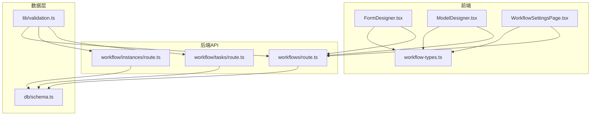
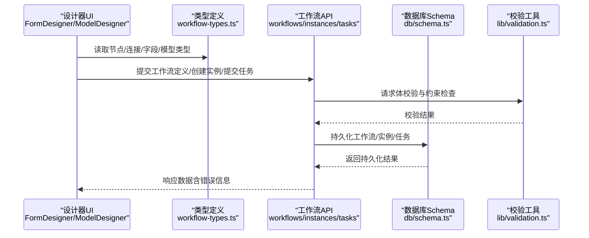
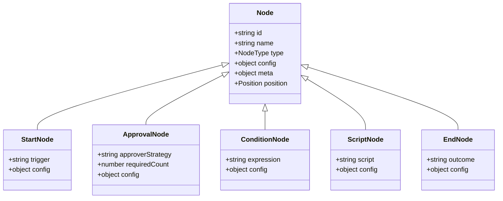
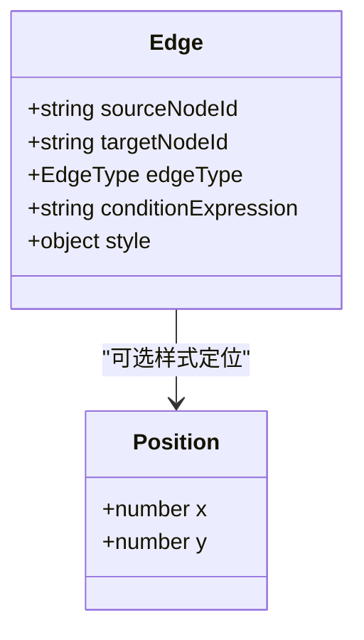
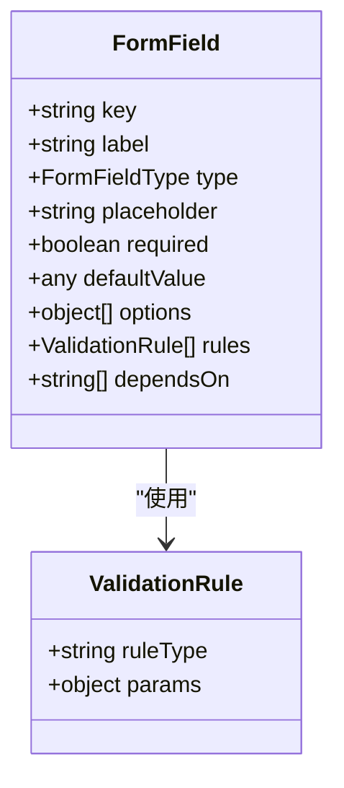
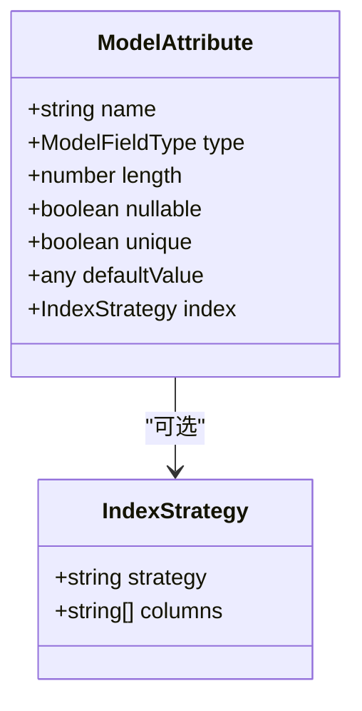
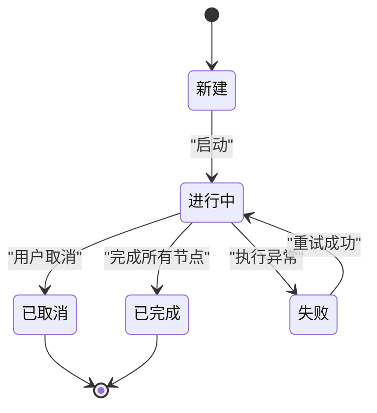
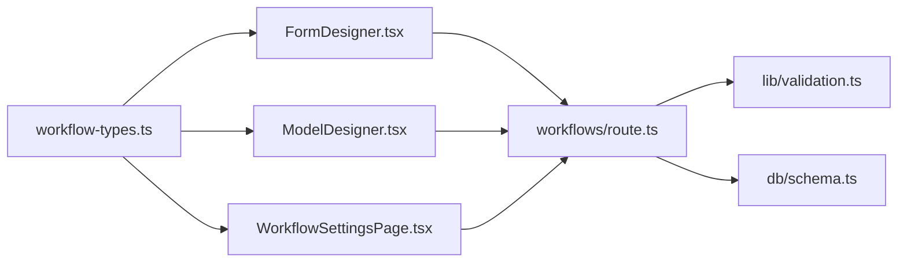

# 数据类型定义

<cite>
**本文档引用的文件**
- [workflow-types.ts](file://app/components/workflow/workflow-types.ts)
- [FormDesigner.tsx](file://app/components/workflow/FormDesigner.tsx)
- [ModelDesigner.tsx](file://app/components/workflow/ModelDesigner.tsx)
- [WorkflowSettingsPage.tsx](file://app/components/workflow/WorkflowSettingsPage.tsx)
- [route.ts](file://app/api/workflows/route.ts)
- [route.ts](file://app/api/workflow/instances/route.ts)
- [route.ts](file://app/api/workflow/tasks/route.ts)
- [schema.ts](file://db/schema.ts)
- [validation.ts](file://lib/validation.ts)
</cite>

## 目录
1. [简介](#简介)
2. [项目结构](#项目结构)
3. [核心组件](#核心组件)
4. [架构总览](#架构总览)
5. [详细组件分析](#详细组件分析)
6. [依赖关系分析](#依赖关系分析)
7. [性能考虑](#性能考虑)
8. [故障排查指南](#故障排查指南)
9. [结论](#结论)
10. [附录](#附录)

## 简介
本文件面向工作流系统的数据类型定义，聚焦于工作流节点、连接、表单字段、模型属性等核心数据结构，解释其类型继承关系、验证规则与序列化机制。文档同时记录枚举值、常量定义与接口规范，并说明类型系统在开发中的作用与最佳实践，最后提供类型扩展与自定义类型的开发指南。

## 项目结构
工作流相关类型主要位于前端组件的类型文件中，并通过 API 路由与数据库 Schema 进行交互。关键位置如下：
- 类型定义与共享模型：app/components/workflow/workflow-types.ts
- 表单设计器（渲染与校验）：app/components/workflow/FormDesigner.tsx
- 模型设计器（实体建模）：app/components/workflow/ModelDesigner.tsx
- 工作流设置页（全局配置）：app/components/workflow/WorkflowSettingsPage.tsx
- 工作流 API（CRUD 与实例化）：app/api/workflows/route.ts、app/api/workflow/instances/route.ts、app/api/workflow/tasks/route.ts
- 数据库模式（持久化结构）：db/schema.ts
- 通用校验工具：lib/validation.ts

图表来源
- [workflow-types.ts](file://app/components/workflow/workflow-types.ts)
- [FormDesigner.tsx](file://app/components/workflow/FormDesigner.tsx)
- [ModelDesigner.tsx](file://app/components/workflow/ModelDesigner.tsx)
- [WorkflowSettingsPage.tsx](file://app/components/workflow/WorkflowSettingsPage.tsx)
- [route.ts](file://app/api/workflows/route.ts)
- [route.ts](file://app/api/workflow/instances/route.ts)
- [route.ts](file://app/api/workflow/tasks/route.ts)
- [schema.ts](file://db/schema.ts)
- [validation.ts](file://lib/validation.ts)

章节来源
- [workflow-types.ts](file://app/components/workflow/workflow-types.ts)
- [FormDesigner.tsx](file://app/components/workflow/FormDesigner.tsx)
- [ModelDesigner.tsx](file://app/components/workflow/ModelDesigner.tsx)
- [WorkflowSettingsPage.tsx](file://app/components/workflow/WorkflowSettingsPage.tsx)
- [route.ts](file://app/api/workflows/route.ts)
- [route.ts](file://app/api/workflow/instances/route.ts)
- [route.ts](file://app/api/workflow/tasks/route.ts)
- [schema.ts](file://db/schema.ts)
- [validation.ts](file://lib/validation.ts)

## 核心组件
本节概述工作流系统中的核心数据类型及其职责：
- 工作流节点：描述流程中的处理单元（如开始、审批、条件分支、结束等），包含节点类型、标识、显示名、默认配置与约束。
- 连接：描述节点之间的有向边，包含源节点、目标节点、连线类型与条件表达式。
- 表单字段：描述运行时表单的输入控件，包括字段类型、标签、占位符、是否必填、默认值、校验规则与选项集。
- 模型属性：描述业务实体的数据模型字段，包括字段名、类型、长度、可空性、唯一性与索引策略。
- 工作流实例：描述一次运行时的执行上下文，包含状态机、当前节点、历史轨迹与变量作用域。
- 任务：描述待办事项或动作项，包含关联实例、节点、处理人、优先级与截止时间。

章节来源
- [workflow-types.ts](file://app/components/workflow/workflow-types.ts)
- [FormDesigner.tsx](file://app/components/workflow/FormDesigner.tsx)
- [ModelDesigner.tsx](file://app/components/workflow/ModelDesigner.tsx)
- [WorkflowSettingsPage.tsx](file://app/components/workflow/WorkflowSettingsPage.tsx)
- [route.ts](file://app/api/workflows/route.ts)
- [route.ts](file://app/api/workflow/instances/route.ts)
- [route.ts](file://app/api/workflow/tasks/route.ts)
- [schema.ts](file://db/schema.ts)
- [validation.ts](file://lib/validation.ts)

## 架构总览
下图展示了从前端类型到后端 API 再到数据库模式的完整数据流与类型契约。

图表来源
- [FormDesigner.tsx](file://app/components/workflow/FormDesigner.tsx)
- [ModelDesigner.tsx](file://app/components/workflow/ModelDesigner.tsx)
- [workflow-types.ts](file://app/components/workflow/workflow-types.ts)
- [route.ts](file://app/api/workflows/route.ts)
- [route.ts](file://app/api/workflow/instances/route.ts)
- [route.ts](file://app/api/workflow/tasks/route.ts)
- [schema.ts](file://db/schema.ts)
- [validation.ts](file://lib/validation.ts)

## 详细组件分析

### 工作流节点类型
- 节点类型枚举：用于区分不同行为（如开始、审批、条件、脚本、结束）。
- 节点基础属性：id、name、type、config、meta（元数据）、position（布局坐标）。
- 节点配置：按类型扩展的配置对象，例如审批节点的审批人策略、条件节点的条件表达式、脚本节点的脚本内容等。
- 节点约束：唯一性、必填项、类型匹配、表达式合法性。

图表来源
- [workflow-types.ts](file://app/components/workflow/workflow-types.ts)

章节来源
- [workflow-types.ts](file://app/components/workflow/workflow-types.ts)

### 连接类型
- 连接基础属性：sourceNodeId、targetNodeId、edgeType、conditionExpression。
- 连接约束：源/目标节点存在性、循环检测、条件表达式合法性。
- 连接可视化：样式、箭头方向、标注文本。

图表来源
- [workflow-types.ts](file://app/components/workflow/workflow-types.ts)

章节来源
- [workflow-types.ts](file://app/components/workflow/workflow-types.ts)

### 表单字段类型
- 字段类型枚举：文本、数字、日期、选择、多选、富文本、附件等。
- 字段属性：key、label、placeholder、required、defaultValue、options、rules。
- 字段校验：内置规则（必填、长度、格式、范围）与自定义规则函数。
- 字段联动：依赖其他字段的可见性或取值。

图表来源
- [workflow-types.ts](file://app/components/workflow/workflow-types.ts)
- [FormDesigner.tsx](file://app/components/workflow/FormDesigner.tsx)

章节来源
- [workflow-types.ts](file://app/components/workflow/workflow-types.ts)
- [FormDesigner.tsx](file://app/components/workflow/FormDesigner.tsx)

### 模型属性类型
- 属性类型：字符串、整数、浮点、布尔、日期、枚举、JSON等。
- 属性约束：长度、精度、可空性、唯一性、默认值、索引。
- 模型版本控制：变更历史与迁移策略。

图表来源
- [workflow-types.ts](file://app/components/workflow/workflow-types.ts)
- [ModelDesigner.tsx](file://app/components/workflow/ModelDesigner.tsx)

章节来源
- [workflow-types.ts](file://app/components/workflow/workflow-types.ts)
- [ModelDesigner.tsx](file://app/components/workflow/ModelDesigner.tsx)

### 工作流实例与任务
- 实例状态机：新建、进行中、已完成、已取消、失败等。
- 实例数据：变量作用域、上下文快照、审计日志。
- 任务属性：实例ID、节点ID、处理人、优先级、截止时间、状态。

图表来源
- [workflow-types.ts](file://app/components/workflow/workflow-types.ts)
- [route.ts](file://app/api/workflow/instances/route.ts)
- [route.ts](file://app/api/workflow/tasks/route.ts)

章节来源
- [workflow-types.ts](file://app/components/workflow/workflow-types.ts)
- [route.ts](file://app/api/workflow/instances/route.ts)
- [route.ts](file://app/api/workflow/tasks/route.ts)

### 工作流设置与全局常量
- 全局设置：时区、语言、默认超时、重试策略、权限策略。
- 常量定义：节点类型枚举、连接类型枚举、字段类型枚举、状态码枚举。
- 国际化键：用于多语言展示。

章节来源
- [WorkflowSettingsPage.tsx](file://app/components/workflow/WorkflowSettingsPage.tsx)
- [workflow-types.ts](file://app/components/workflow/workflow-types.ts)

## 依赖关系分析
- 前端类型与工作流设计器：FormDesigner.tsx 与 ModelDesigner.tsx 依赖 workflow-types.ts 提供的类型定义，确保 UI 与数据结构一致。
- API 与校验：各 API 路由在接收请求后调用 lib/validation.ts 进行参数校验，保证入参符合类型与约束。
- API 与数据库：持久化逻辑遵循 db/schema.ts 定义的表结构与字段约束，避免类型漂移。

图表来源
- [workflow-types.ts](file://app/components/workflow/workflow-types.ts)
- [FormDesigner.tsx](file://app/components/workflow/FormDesigner.tsx)
- [ModelDesigner.tsx](file://app/components/workflow/ModelDesigner.tsx)
- [WorkflowSettingsPage.tsx](file://app/components/workflow/WorkflowSettingsPage.tsx)
- [route.ts](file://app/api/workflows/route.ts)
- [validation.ts](file://lib/validation.ts)
- [schema.ts](file://db/schema.ts)

章节来源
- [workflow-types.ts](file://app/components/workflow/workflow-types.ts)
- [FormDesigner.tsx](file://app/components/workflow/FormDesigner.tsx)
- [ModelDesigner.tsx](file://app/components/workflow/ModelDesigner.tsx)
- [WorkflowSettingsPage.tsx](file://app/components/workflow/WorkflowSettingsPage.tsx)
- [route.ts](file://app/api/workflows/route.ts)
- [validation.ts](file://lib/validation.ts)
- [schema.ts](file://db/schema.ts)

## 性能考虑
- 类型校验前置：在 API 层尽早进行参数校验，减少无效计算与数据库访问。
- 缓存热点数据：工作流定义与模型元数据可缓存，降低重复解析成本。
- 批量操作优化：表单字段与模型属性的批量更新应合并为单次事务。
- 表达式求值优化：条件表达式与脚本节点执行需限制复杂度与超时时间。

## 故障排查指南
- 常见校验错误：必填缺失、类型不匹配、长度越界、格式非法。
- 调试建议：查看 API 响应中的错误码与消息；核对 workflow-types.ts 的定义与 lib/validation.ts 的规则一致性。
- 数据一致性：检查 db/schema.ts 的字段约束是否与前端类型一致，避免迁移问题。

章节来源
- [validation.ts](file://lib/validation.ts)
- [route.ts](file://app/api/workflows/route.ts)
- [route.ts](file://app/api/workflow/instances/route.ts)
- [route.ts](file://app/api/workflow/tasks/route.ts)
- [schema.ts](file://db/schema.ts)

## 结论
通过统一的前端类型定义、严格的 API 校验与一致的数据库模式，工作流系统实现了高内聚、低耦合的数据契约。遵循本文档的类型规范与最佳实践，可有效提升开发效率与系统稳定性。

## 附录

### 类型扩展与自定义类型开发指南
- 扩展节点类型：在 workflow-types.ts 中新增节点类型枚举与对应的配置对象，并在设计器与运行时引擎中注册新节点的行为。
- 自定义表单字段：新增字段类型与渲染组件，完善校验规则与联动逻辑，确保与 API 与数据库保持一致。
- 自定义模型属性：扩展属性类型与约束策略，同步更新 db/schema.ts 的迁移脚本。
- 校验规则扩展：在 lib/validation.ts 中添加新的校验器，并在表单字段中使用。
- 常量与枚举管理：集中维护枚举值与常量，避免硬编码与不一致。

章节来源
- [workflow-types.ts](file://app/components/workflow/workflow-types.ts)
- [FormDesigner.tsx](file://app/components/workflow/FormDesigner.tsx)
- [ModelDesigner.tsx](file://app/components/workflow/ModelDesigner.tsx)
- [validation.ts](file://lib/validation.ts)
- [schema.ts](file://db/schema.ts)