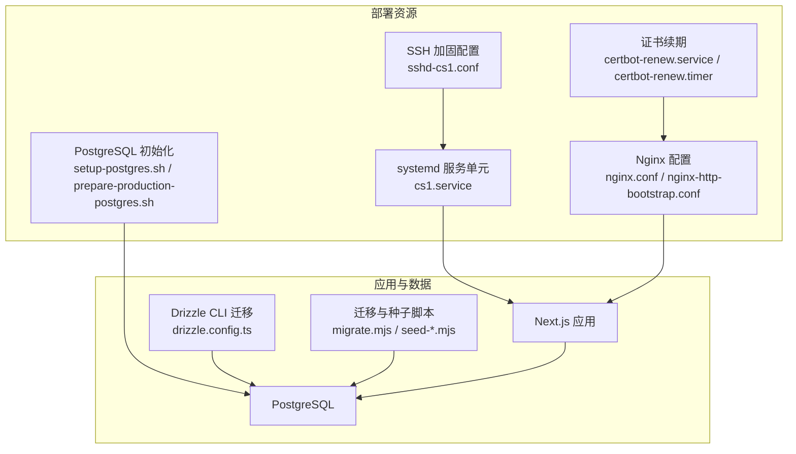
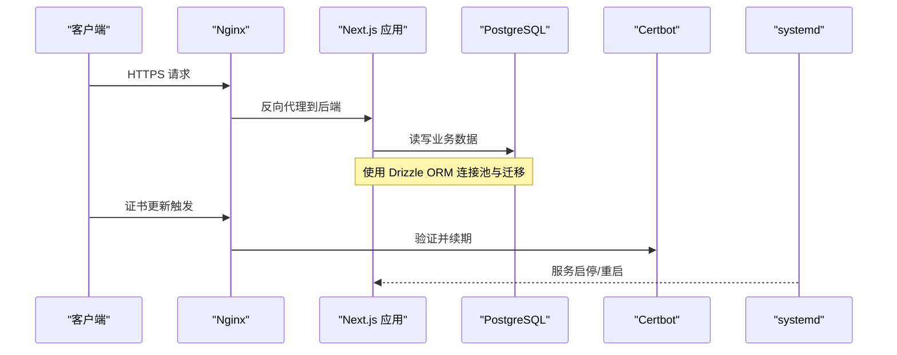
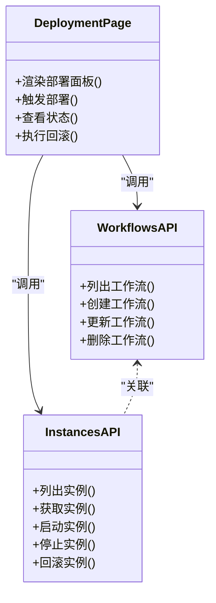
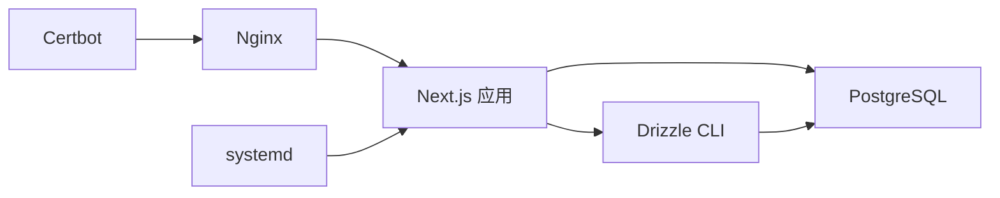

# 部署系统

<cite>
**本文引用的文件**   
- [deploy/cs1.service](file://deploy/cs1.service)
- [deploy/nginx.conf](file://deploy/nginx.conf)
- [deploy/nginx-http-bootstrap.conf](file://deploy/nginx-http-bootstrap.conf)
- [deploy/prepare-production-postgres.sh](file://deploy/prepare-production-postgres.sh)
- [deploy/setup-postgres.sh](file://deploy/setup-postgres.sh)
- [deploy/certbot-renew.service](file://deploy/certbot-renew.service)
- [deploy/certbot-renew.timer](file://deploy/certbot-renew.timer)
- [deploy/sshd-cs1.conf](file://deploy/sshd-cs1.conf)
- [drizzle.config.ts](file://drizzle.config.ts)
- [db/schema.ts](file://db/schema.ts)
- [scripts/migrate.mjs](file://scripts/migrate.mjs)
- [scripts/migrate-sqlite-to-postgres.mjs](file://scripts/migrate-sqlite-to-postgres.mjs)
- [scripts/seed-admin.mjs](file://scripts/seed-admin.mjs)
- [scripts/seed-full-test-data.mjs](file://scripts/seed-full-test-data.mjs)
- [package.json](file://package.json)
- [next.config.ts](file://next.config.ts)
- [vite.config.ts](file://vite.config.ts)
- [app/api/workflows/route.ts](file://app/api/workflows/route.ts)
- [app/api/workflow/instances/route.ts](file://app/api/workflow/instances/route.ts)
- [app/components/workflow/DeploymentPage.tsx](file://app/components/workflow/DeploymentPage.tsx)
</cite>

## 目录
1. [简介](#简介)
2. [项目结构](#项目结构)
3. [核心组件](#核心组件)
4. [架构总览](#架构总览)
5. [详细组件分析](#详细组件分析)
6. [依赖关系分析](#依赖关系分析)
7. [性能考虑](#性能考虑)
8. [故障排查指南](#故障排查指南)
9. [结论](#结论)
10. [附录](#附录)

## 简介
本文件面向部署与运维工程师，系统化阐述该项目的部署体系：工作流驱动的部署流程、环境配置管理、版本发布策略、数据库迁移与数据初始化、证书与反向代理、服务进程管理、状态监控与回滚机制、多环境最佳实践与性能优化建议，以及CI/CD集成示例。文档以仓库中的部署脚本、系统服务单元、Nginx配置、Drizzle 配置与迁移脚本为依据，确保内容可落地、可复现。

## 项目结构
部署相关的关键目录与文件如下：
- deploy：系统服务单元、Nginx 配置、PostgreSQL 初始化脚本、证书续期定时任务等
- drizzle-postgres：数据库迁移 SQL 快照与增量脚本
- scripts：数据库迁移与种子数据脚本
- 应用层：Next.js API 路由与工作流前端页面提供部署编排入口

图表来源
- [deploy/cs1.service](file://deploy/cs1.service)
- [deploy/nginx.conf](file://deploy/nginx.conf)
- [deploy/nginx-http-bootstrap.conf](file://deploy/nginx-http-bootstrap.conf)
- [deploy/certbot-renew.service](file://deploy/certbot-renew.service)
- [deploy/certbot-renew.timer](file://deploy/certbot-renew.timer)
- [deploy/sshd-cs1.conf](file://deploy/sshd-cs1.conf)
- [deploy/setup-postgres.sh](file://deploy/setup-postgres.sh)
- [deploy/prepare-production-postgres.sh](file://deploy/prepare-production-postgres.sh)
- [drizzle.config.ts](file://drizzle.config.ts)
- [scripts/migrate.mjs](file://scripts/migrate.mjs)
- [scripts/seed-admin.mjs](file://scripts/seed-admin.mjs)
- [scripts/seed-full-test-data.mjs](file://scripts/seed-full-test-data.mjs)

章节来源
- [deploy/cs1.service](file://deploy/cs1.service)
- [deploy/nginx.conf](file://deploy/nginx.conf)
- [deploy/nginx-http-bootstrap.conf](file://deploy/nginx-http-bootstrap.conf)
- [deploy/setup-postgres.sh](file://deploy/setup-postgres.sh)
- [deploy/prepare-production-postgres.sh](file://deploy/prepare-production-postgres.sh)
- [drizzle.config.ts](file://drizzle.config.ts)
- [scripts/migrate.mjs](file://scripts/migrate.mjs)

## 核心组件
- 系统服务与进程管理：通过 systemd 单元管理应用进程生命周期、重启策略、日志输出与运行用户
- 反向代理与HTTPS：Nginx 作为入口，统一端口转发、静态资源缓存、TLS 终止与证书自动续期
- 数据库准备与迁移：PostgreSQL 初始化脚本与 Drizzle 迁移流水线，支持从 SQLite 迁移到 PostgreSQL
- 工作流驱动部署：API 与工作流前端页面提供实例化、执行、状态查询能力，支撑灰度与回滚
- 安全与访问控制：SSH 加固配置、认证与会话接口、速率限制与安全策略

章节来源
- [deploy/cs1.service](file://deploy/cs1.service)
- [deploy/nginx.conf](file://deploy/nginx.conf)
- [deploy/nginx-http-bootstrap.conf](file://deploy/nginx-http-bootstrap.conf)
- [deploy/setup-postgres.sh](file://deploy/setup-postgres.sh)
- [deploy/prepare-production-postgres.sh](file://deploy/prepare-production-postgres.sh)
- [drizzle.config.ts](file://drizzle.config.ts)
- [scripts/migrate.mjs](file://scripts/migrate.mjs)
- [app/api/auth/login/route.ts](file://app/api/auth/login/route.ts)
- [app/api/auth/session/route.ts](file://app/api/auth/session/route.ts)
- [lib/security.ts](file://lib/security.ts)
- [lib/rate-limit.ts](file://lib/rate-limit.ts)

## 架构总览
下图展示从 Nginx 到应用、数据库与证书管理的整体交互路径，以及工作流驱动的部署调用链。

图表来源
- [deploy/nginx.conf](file://deploy/nginx.conf)
- [deploy/nginx-http-bootstrap.conf](file://deploy/nginx-http-bootstrap.conf)
- [deploy/certbot-renew.service](file://deploy/certbot-renew.service)
- [deploy/certbot-renew.timer](file://deploy/certbot-renew.timer)
- [deploy/cs1.service](file://deploy/cs1.service)
- [drizzle.config.ts](file://drizzle.config.ts)

## 详细组件分析

### 系统服务与进程管理（systemd）
- 职责：定义应用运行用户、工作目录、环境变量、启动命令、重启策略、日志位置与依赖顺序
- 关键点：
  - 设置健康检查与失败重试，保障高可用
  - 隔离运行用户与权限，最小化风险面
  - 集中日志便于排障与审计

章节来源
- [deploy/cs1.service](file://deploy/cs1.service)

### 反向代理与HTTPS（Nginx）
- 职责：统一入口、负载均衡、静态资源缓存、TLS 终止、HTTP→HTTPS 重定向
- 关键点：
  - 使用引导配置快速启用 HTTP 服务，再切换为 HTTPS
  - 合理设置缓存头与压缩，提升前端加载性能
  - 将动态请求代理至应用进程，保持长连接与超时策略

章节来源
- [deploy/nginx.conf](file://deploy/nginx.conf)
- [deploy/nginx-http-bootstrap.conf](file://deploy/nginx-http-bootstrap.conf)

### 证书自动续期（Certbot）
- 职责：定期检测并续期 TLS 证书，平滑重载 Nginx
- 关键点：
  - 使用 systemd timer 周期性触发
  - 成功后自动 reload Nginx，避免中断

章节来源
- [deploy/certbot-renew.service](file://deploy/certbot-renew.service)
- [deploy/certbot-renew.timer](file://deploy/certbot-renew.timer)

### SSH 加固配置
- 职责：限制登录方式、禁用密码登录、限定允许用户与IP、强化密钥校验
- 关键点：
  - 关闭不必要的认证方法
  - 启用强加密套件与协议版本
  - 记录登录审计日志

章节来源
- [deploy/sshd-cs1.conf](file://deploy/sshd-cs1.conf)

### 数据库准备与迁移
- 职责：创建数据库与用户、设置权限、执行迁移与种子数据
- 关键点：
  - setup-postgres.sh 完成基础库与用户初始化
  - prepare-production-postgres.sh 用于生产环境参数调优与约束
  - Drizzle 配置与迁移脚本保证 schema 一致性
  - 提供从 SQLite 迁移到 PostgreSQL 的专用脚本

章节来源
- [deploy/setup-postgres.sh](file://deploy/setup-postgres.sh)
- [deploy/prepare-production-postgres.sh](file://deploy/prepare-production-postgres.sh)
- [drizzle.config.ts](file://drizzle.config.ts)
- [scripts/migrate.mjs](file://scripts/migrate.mjs)
- [scripts/migrate-sqlite-to-postgres.mjs](file://scripts/migrate-sqlite-to-postgres.mjs)
- [scripts/seed-admin.mjs](file://scripts/seed-admin.mjs)
- [scripts/seed-full-test-data.mjs](file://scripts/seed-full-test-data.mjs)
- [db/schema.ts](file://db/schema.ts)

### 工作流驱动的部署流程
- 职责：通过 API 与工作流前端编排部署任务，包括构建、迁移、滚动更新、灰度与回滚
- 关键点：
  - 工作流定义与实例化管理
  - 任务调度与状态跟踪
  - 事件驱动的状态变更与通知

图表来源
- [app/api/workflows/route.ts](file://app/api/workflows/route.ts)
- [app/api/workflow/instances/route.ts](file://app/api/workflow/instances/route.ts)
- [app/components/workflow/DeploymentPage.tsx](file://app/components/workflow/DeploymentPage.tsx)

章节来源
- [app/api/workflows/route.ts](file://app/api/workflows/route.ts)
- [app/api/workflow/instances/route.ts](file://app/api/workflow/instances/route.ts)
- [app/components/workflow/DeploymentPage.tsx](file://app/components/workflow/DeploymentPage.tsx)

### 环境变量与依赖管理
- 环境变量：在 systemd 单元中注入运行时变量（如数据库连接串、密钥、功能开关），避免硬编码
- 依赖管理：通过包管理器锁定版本，构建产物与依赖分离，确保可重复性
- 构建与运行：Next.js/Vite 配置区分开发与生产模式，开启必要的优化选项

章节来源
- [deploy/cs1.service](file://deploy/cs1.service)
- [package.json](file://package.json)
- [next.config.ts](file://next.config.ts)
- [vite.config.ts](file://vite.config.ts)

## 依赖关系分析
- 外部依赖：Nginx、systemd、PostgreSQL、Certbot
- 内部依赖：应用依赖数据库与缓存（如有）、工作流模块依赖 API 与持久化存储
- 迁移依赖：Drizzle CLI 与数据库驱动、迁移脚本与 schema 定义保持一致

图表来源
- [deploy/nginx.conf](file://deploy/nginx.conf)
- [deploy/cs1.service](file://deploy/cs1.service)
- [drizzle.config.ts](file://drizzle.config.ts)
- [deploy/certbot-renew.service](file://deploy/certbot-renew.service)

## 性能考虑
- 反向代理层：启用 gzip/brotli、静态资源缓存、连接复用与合理的超时设置
- 应用层：连接池大小、异步 I/O、内存与CPU限制、按需加载与代码分割
- 数据库层：索引优化、慢查询分析、连接池与事务边界控制
- 证书与TLS：会话复用、ECDHE 套件选择、证书链优化
- 构建与部署：增量构建、缓存命中、并行任务与蓝绿/灰度发布降低冷启动时间

[本节为通用指导，不直接分析具体文件]

## 故障排查指南
- 服务无法启动：检查 systemd 日志、环境变量、端口占用与依赖服务状态
- 反向代理异常：验证 Nginx 配置语法、证书路径与权限、上游应用健康检查
- 数据库连接失败：确认连接串、用户权限、网络可达性与防火墙规则
- 迁移失败：核对 schema 与迁移脚本版本、回滚到上一版本并修复后再试
- 证书过期：检查 certbot 定时器是否生效、域名解析与ACME挑战是否通过
- 工作流部署卡住：查看实例状态、任务日志与依赖锁，必要时强制清理并重建

章节来源
- [deploy/cs1.service](file://deploy/cs1.service)
- [deploy/nginx.conf](file://deploy/nginx.conf)
- [deploy/certbot-renew.timer](file://deploy/certbot-renew.timer)
- [drizzle.config.ts](file://drizzle.config.ts)
- [scripts/migrate.mjs](file://scripts/migrate.mjs)

## 结论
本部署体系以 systemd 与 Nginx 为核心基础设施，结合 Drizzle 迁移与脚本化工具，形成稳定、可观测、可回滚的发布流水线。工作流驱动的部署能力为灰度与回滚提供了灵活手段。建议在多环境中严格隔离配置与凭据，采用蓝绿或金丝雀发布策略，配合自动化测试与监控告警，持续提升交付质量与稳定性。

[本节为总结性内容，不直接分析具体文件]

## 附录

### 部署模板与环境变量清单
- 系统服务模板：定义运行用户、工作目录、启动命令、重启策略、日志路径
- 环境变量清单：数据库连接串、密钥、功能开关、日志级别、限流阈值
- 反向代理模板：HTTP→HTTPS 重定向、静态资源缓存、上游代理与健康检查
- 证书模板：域名绑定、ACME 账户、邮箱与续期策略

章节来源
- [deploy/cs1.service](file://deploy/cs1.service)
- [deploy/nginx.conf](file://deploy/nginx.conf)
- [deploy/nginx-http-bootstrap.conf](file://deploy/nginx-http-bootstrap.conf)
- [deploy/certbot-renew.service](file://deploy/certbot-renew.service)
- [deploy/certbot-renew.timer](file://deploy/certbot-renew.timer)

### 依赖管理与构建脚本
- 包依赖锁定：使用包管理器生成锁定文件，确保构建可重复
- 构建与打包：区分开发/生产配置，启用必要优化与代码分割
- 运行环境：最小化镜像或容器，仅包含运行所需依赖

章节来源
- [package.json](file://package.json)
- [next.config.ts](file://next.config.ts)
- [vite.config.ts](file://vite.config.ts)

### CI/CD 集成示例（步骤说明）
- 拉取代码与依赖安装
- 运行单元测试与集成测试
- 构建产物与镜像打包
- 执行数据库迁移与种子数据
- 部署到目标环境并验证健康检查
- 推送制品到制品库并归档日志

[本节为概念性流程说明，不直接分析具体文件]

### 多环境部署最佳实践
- 环境隔离：开发、预发、生产环境独立配置与凭据
- 配置外置：使用环境变量或配置中心，禁止硬编码
- 发布策略：蓝绿/金丝雀发布，逐步放量与快速回滚
- 可观测性：指标、日志、追踪三件套，关键路径埋点与告警

[本节为通用指导，不直接分析具体文件]

### 回滚与故障恢复
- 版本快照：每次发布前保存当前版本与配置快照
- 一键回滚：通过工作流实例快速切换到上一个稳定版本
- 数据回滚：谨慎评估，优先向前兼容；必要时执行逆向迁移
- 故障恢复：自动重试、熔断降级、隔离问题节点

章节来源
- [app/api/workflow/instances/route.ts](file://app/api/workflow/instances/route.ts)
- [app/components/workflow/DeploymentPage.tsx](file://app/components/workflow/DeploymentPage.tsx)