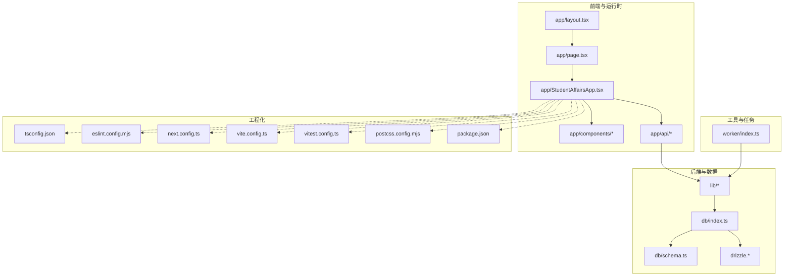
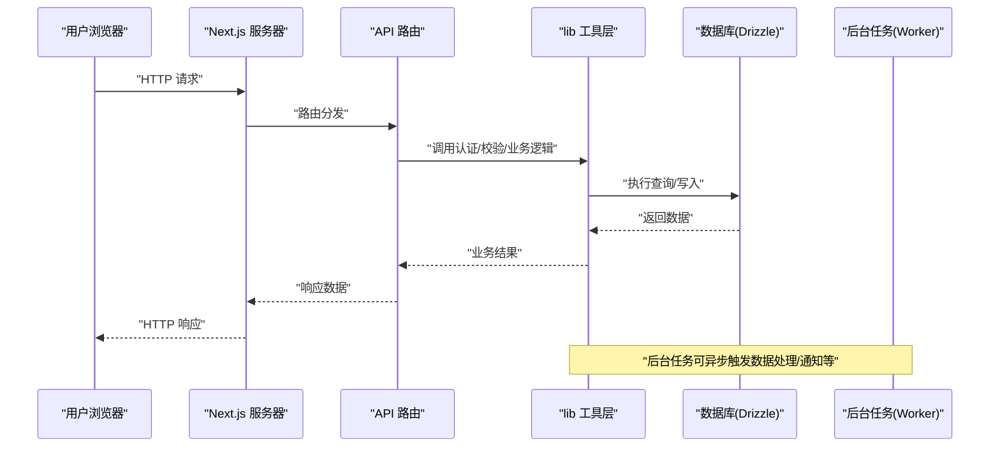
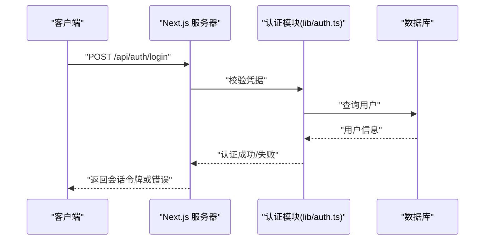
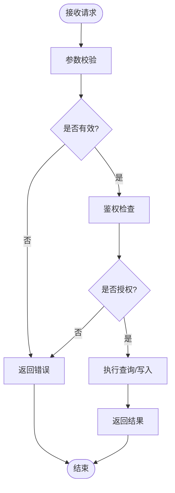
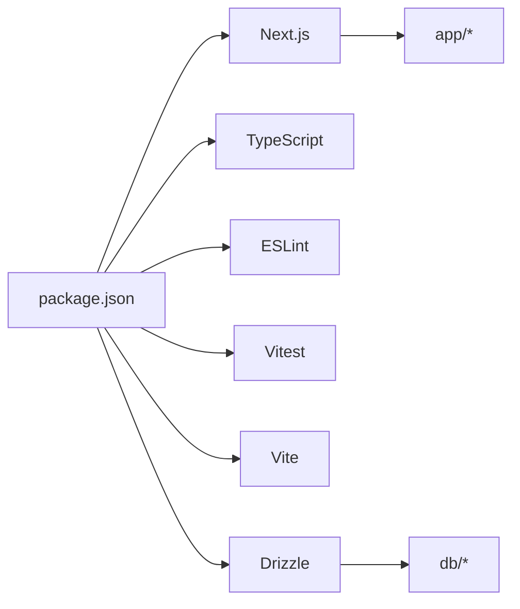

# 开发指南

<cite>
**本文引用的文件**   
- [package.json](file://package.json)
- [tsconfig.json](file://tsconfig.json)
- [eslint.config.mjs](file://eslint.config.mjs)
- [next.config.ts](file://next.config.ts)
- [vite.config.ts](file://vite.config.ts)
- [vitest.config.ts](file://vitest.config.ts)
- [drizzle.config.ts](file://drizzle.config.ts)
- [postcss.config.mjs](file://postcss.config.mjs)
- [.gitignore](file://.gitignore)
- [README.md](file://README.md)
- [app/layout.tsx](file://app/layout.tsx)
- [app/page.tsx](file://app/page.tsx)
- [app/StudentAffairsApp.tsx](file://app/StudentAffairsApp.tsx)
- [lib/auth.ts](file://lib/auth.ts)
- [lib/api.ts](file://lib/api.ts)
- [db/index.ts](file://db/index.ts)
- [db/schema.ts](file://db/schema.ts)
- [worker/index.ts](file://worker/index.ts)
- [deploy/cs1.service](file://deploy/cs1.service)
- [deploy/nginx.conf](file://deploy/nginx.conf)
</cite>

## 目录
1. [简介](#简介)
2. [项目结构](#项目结构)
3. [核心组件](#核心组件)
4. [架构总览](#架构总览)
5. [详细组件分析](#详细组件分析)
6. [依赖分析](#依赖分析)
7. [性能考虑](#性能考虑)
8. [故障排查指南](#故障排查指南)
9. [结论](#结论)
10. [附录](#附录)

## 简介
本指南面向CS1学生事务管理系统的开发者，覆盖开发环境搭建、代码规范与构建配置、TypeScript/ESLint/Next.js/Vite配置说明、Git工作流、代码审查与发布流程、调试技巧、性能分析与常见问题解决方案。文档基于仓库现有结构与配置文件进行梳理，帮助初学者快速上手并高效协作。

## 项目结构
- 应用层：Next.js App Router（app 目录）提供页面、API路由与通用组件；入口布局与根页面位于 app/layout.tsx 与 app/page.tsx；主应用容器在 app/StudentAffairsApp.tsx。
- 数据层：Drizzle ORM 用于数据库访问，schema 定义在 db/schema.ts，连接与初始化在 db/index.ts；迁移脚本与配置在 drizzle.* 相关文件中。
- 工具与库：认证、鉴权、速率限制、安全与校验等能力集中在 lib 目录；后台任务由 worker/index.ts 处理。
- 测试：Vitest 作为测试框架，配置文件 vitest.config.ts，测试用例分布在 tests 目录。
- 部署：Nginx 反向代理与系统服务配置在 deploy 目录。

图表来源
- [app/layout.tsx](file://app/layout.tsx)
- [app/page.tsx](file://app/page.tsx)
- [app/StudentAffairsApp.tsx](file://app/StudentAffairsApp.tsx)
- [lib/auth.ts](file://lib/auth.ts)
- [lib/api.ts](file://lib/api.ts)
- [db/index.ts](file://db/index.ts)
- [db/schema.ts](file://db/schema.ts)
- [drizzle.config.ts](file://drizzle.config.ts)
- [vite.config.ts](file://vite.config.ts)
- [vitest.config.ts](file://vitest.config.ts)
- [postcss.config.mjs](file://postcss.config.mjs)
- [package.json](file://package.json)

章节来源
- [README.md](file://README.md)
- [package.json](file://package.json)

## 核心组件
- 应用入口与布局
  - 根布局与页面：负责全局样式、元信息、路由挂载与基础UI壳。
  - 主应用容器：组织功能模块、状态与导航。
- API 路由
  - Next.js App Router 的 API 路由用于业务接口实现，按功能域划分目录。
- 数据模型与ORM
  - Drizzle schema 定义表结构，db/index.ts 管理连接与查询封装。
- 认证与安全
  - 认证与会话逻辑、权限校验、速率限制与安全策略集中在 lib 目录。
- 后台任务
  - worker/index.ts 处理异步或耗时任务，避免阻塞请求。
- 测试
  - Vitest 统一测试框架，覆盖单元与集成测试。

章节来源
- [app/layout.tsx](file://app/layout.tsx)
- [app/page.tsx](file://app/page.tsx)
- [app/StudentAffairsApp.tsx](file://app/StudentAffairsApp.tsx)
- [lib/auth.ts](file://lib/auth.ts)
- [lib/api.ts](file://lib/api.ts)
- [db/index.ts](file://db/index.ts)
- [db/schema.ts](file://db/schema.ts)
- [worker/index.ts](file://worker/index.ts)
- [vitest.config.ts](file://vitest.config.ts)

## 架构总览
系统采用前后端一体化（Next.js App Router）+ 后台任务（Worker）+ 数据库（Postgres/SQLite 通过 Drizzle）的架构。前端页面与组件通过 API 路由与后端交互，认证与安全由中间件与库函数保障，数据层通过 Drizzle 抽象，迁移与种子脚本支持环境初始化。

图表来源
- [app/page.tsx](file://app/page.tsx)
- [app/api/*/route.ts](file://app/api/admin/logs/route.ts)
- [lib/auth.ts](file://lib/auth.ts)
- [lib/api.ts](file://lib/api.ts)
- [db/index.ts](file://db/index.ts)
- [worker/index.ts](file://worker/index.ts)

## 详细组件分析

### 开发环境与工具链
- Node.js 与包管理器
  - 使用 package.json 中声明的脚本进行安装、启动、构建与测试。
- TypeScript
  - tsconfig.json 定义编译目标、路径别名、严格模式与输出目录。
- ESLint
  - eslint.config.mjs 集中配置规则与插件，确保代码风格一致。
- Next.js
  - next.config.ts 配置构建行为、环境变量注入、静态资源与中间件。
- Vite
  - vite.config.ts 为部分模块或工具提供更快的开发与构建体验。
- Vitest
  - vitest.config.ts 配置测试运行器、覆盖率与测试环境。
- PostCSS
  - postcss.config.mjs 管理CSS预处理与插件链。
- Drizzle
  - drizzle.config.ts 管理数据库连接、迁移与生成。

章节来源
- [package.json](file://package.json)
- [tsconfig.json](file://tsconfig.json)
- [eslint.config.mjs](file://eslint.config.mjs)
- [next.config.ts](file://next.config.ts)
- [vite.config.ts](file://vite.config.ts)
- [vitest.config.ts](file://vitest.config.ts)
- [postcss.config.mjs](file://postcss.config.mjs)
- [drizzle.config.ts](file://drizzle.config.ts)

### 代码规范与IDE设置
- 代码规范
  - 启用严格TS检查与ESLint规则，统一命名、导入顺序、错误处理与日志格式。
- IDE建议
  - VS Code：安装 TypeScript、ESLint、Prettier、Drizzle 插件；开启保存时格式化与自动修复。
  - 推荐设置：启用“保存时运行ESLint”、“TS类型检查”、“自动导入”。
- Git钩子
  - 建议在 pre-commit 阶段运行 lint 与单元测试，保证提交质量。

章节来源
- [eslint.config.mjs](file://eslint.config.mjs)
- [tsconfig.json](file://tsconfig.json)
- [.gitignore](file://.gitignore)

### 构建与运行
- 本地开发
  - 安装依赖后启动开发服务器，启用热重载与类型检查。
- 构建产物
  - 生产构建优化压缩、Tree-shaking与静态资源处理。
- 测试
  - 运行单元测试与集成测试，生成覆盖率报告。
- 数据库
  - 执行迁移与种子数据，确保本地与测试环境一致性。

章节来源
- [package.json](file://package.json)
- [next.config.ts](file://next.config.ts)
- [vite.config.ts](file://vite.config.ts)
- [vitest.config.ts](file://vitest.config.ts)
- [drizzle.config.ts](file://drizzle.config.ts)

### 认证与授权流程
- 登录与会话
  - 客户端提交凭证，服务端验证并签发会话令牌。
- 鉴权中间件
  - 对受保护路由进行权限校验，未授权返回错误。
- 速率限制与安全
  - 防止暴力破解与滥用，记录关键操作日志。

图表来源
- [lib/auth.ts](file://lib/auth.ts)
- [app/api/auth/login/route.ts](file://app/api/auth/login/route.ts)
- [db/index.ts](file://db/index.ts)

章节来源
- [lib/auth.ts](file://lib/auth.ts)
- [app/api/auth/login/route.ts](file://app/api/auth/login/route.ts)

### API 路由与数据流
- 路由组织
  - 按功能域划分目录，便于维护与权限控制。
- 数据访问
  - 通过 Drizzle 封装查询，统一错误处理与分页。
- 输入校验
  - 参数校验与类型转换，减少无效请求进入业务层。

图表来源
- [lib/api.ts](file://lib/api.ts)
- [db/index.ts](file://db/index.ts)
- [db/schema.ts](file://db/schema.ts)

章节来源
- [lib/api.ts](file://lib/api.ts)
- [db/index.ts](file://db/index.ts)
- [db/schema.ts](file://db/schema.ts)

### 后台任务与工作流
- Worker 职责
  - 处理耗时任务、批量导入、报表生成与通知发送。
- 任务调度
  - 可通过队列或定时任务触发，避免阻塞主线程。
- 错误重试与监控
  - 失败重试、死信队列与日志上报。

章节来源
- [worker/index.ts](file://worker/index.ts)

### 测试策略
- 单元测试
  - 针对工具函数、校验逻辑与数据模型编写用例。
- 集成测试
  - 模拟数据库与外部依赖，验证端到端流程。
- 覆盖率与持续集成
  - 设定阈值并在CI中执行，保证质量。

章节来源
- [vitest.config.ts](file://vitest.config.ts)

## 依赖分析
- 运行时依赖
  - Next.js、React、Drizzle、数据库驱动、认证库等。
- 开发依赖
  - TypeScript、ESLint、Vitest、Vite、PostCSS、Tailwind（如使用）。
- 部署依赖
  - Nginx、Node.js 运行时、系统服务管理。

图表来源
- [package.json](file://package.json)
- [next.config.ts](file://next.config.ts)
- [drizzle.config.ts](file://drizzle.config.ts)

章节来源
- [package.json](file://package.json)

## 性能考虑
- 前端优化
  - 按需加载、代码分割、图片与字体优化、缓存策略。
- 后端优化
  - 数据库索引、查询优化、连接池、限流与缓存。
- 构建优化
  - Tree-shaking、压缩、静态资源预取与CDN。
- 监控与剖析
  - 使用浏览器性能面板与APM工具定位瓶颈。

[本节为通用指导，不直接分析具体文件]

## 故障排查指南
- 常见环境问题
  - Node版本不匹配、端口占用、数据库连接失败、环境变量缺失。
- 构建与运行问题
  - 依赖冲突、路径别名解析失败、ESLint报错、TypeScript类型错误。
- 认证与权限
  - 会话失效、令牌过期、权限不足导致的401/403。
- 数据库问题
  - 迁移失败、Schema不一致、外键约束冲突。
- 调试技巧
  - 启用详细日志、断点调试、网络抓包、数据库慢查询分析。

章节来源
- [next.config.ts](file://next.config.ts)
- [tsconfig.json](file://tsconfig.json)
- [eslint.config.mjs](file://eslint.config.mjs)
- [drizzle.config.ts](file://drizzle.config.ts)

## 结论
本指南从环境搭建、工程化配置到开发流程与排错方法进行了系统化整理。遵循本文档的规范与流程，团队可更高效地协作与维护CS1学生事务管理系统。

[本节为总结性内容，不直接分析具体文件]

## 附录

### 开发环境搭建清单
- 安装Node.js与包管理器
- 克隆仓库并安装依赖
- 配置环境变量与数据库
- 执行迁移与种子数据
- 启动开发服务器与Worker

章节来源
- [package.json](file://package.json)
- [drizzle.config.ts](file://drizzle.config.ts)

### 代码规范与提交约定
- 分支策略：feature/bugfix/hotfix/release
- 提交信息：语义化版本前缀（feat/fix/docs等）
- PR模板：变更说明、影响范围、测试覆盖

[本节为通用指导，不直接分析具体文件]

### 发布流程
- 版本标签与变更日志
- 构建与打包产物校验
- 部署到生产环境（Nginx + Systemd）
- 回滚与灰度策略

章节来源
- [deploy/cs1.service](file://deploy/cs1.service)
- [deploy/nginx.conf](file://deploy/nginx.conf)

### 调试与IDE设置要点
- 启用Source Map与调试断点
- 配置VS Code任务与调试配置
- 使用ESLint与Prettier自动化格式化

章节来源
- [tsconfig.json](file://tsconfig.json)
- [eslint.config.mjs](file://eslint.config.mjs)
- [.gitignore](file://.gitignore)