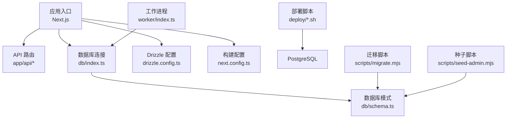
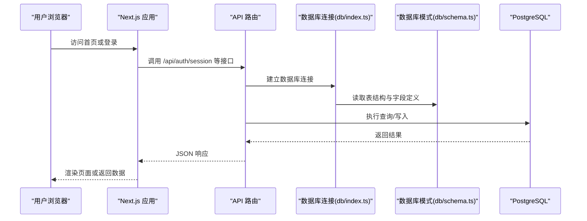
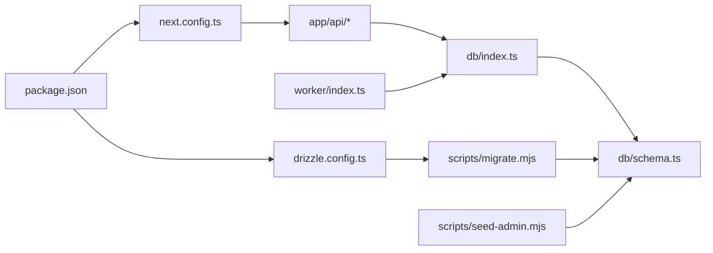

# 快速开始

<cite>
**本文引用的文件**   
- [package.json](file://package.json)
- [README.md](file://README.md)
- [next.config.ts](file://next.config.ts)
- [drizzle.config.ts](file://drizzle.config.ts)
- [db/index.ts](file://db/index.ts)
- [db/schema.ts](file://db/schema.ts)
- [deploy/setup-postgres.sh](file://deploy/setup-postgres.sh)
- [deploy/prepare-production-postgres.sh](file://deploy/prepare-production-postgres.sh)
- [scripts/migrate.mjs](file://scripts/migrate.mjs)
- [scripts/seed-admin.mjs](file://scripts/seed-admin.mjs)
- [worker/index.ts](file://worker/index.ts)
</cite>

## 目录
1. [简介](#简介)
2. [项目结构](#项目结构)
3. [核心组件](#核心组件)
4. [架构总览](#架构总览)
5. [详细组件分析](#详细组件分析)
6. [依赖关系分析](#依赖关系分析)
7. [性能注意事项](#性能注意事项)
8. [故障排除指南](#故障排除指南)
9. [结论](#结论)
10. [附录](#附录)

## 简介
本指南面向首次接触 CS1 学生事务管理系统的用户，提供从零开始的完整部署流程。你将完成 Node.js 环境准备、PostgreSQL 数据库配置、依赖安装与初始化、数据迁移与种子数据导入，最终成功启动系统并访问前端页面。文档同时包含常见安装问题与解决方案，帮助新手在最短时间内运行系统。

## 项目结构
CS1 是一个基于 Next.js 的全栈应用，后端 API 使用 Next.js API Routes，数据库通过 Drizzle ORM 进行迁移与操作，生产部署脚本位于 deploy 目录，工作进程由 worker 模块提供。

图表来源
- [next.config.ts](file://next.config.ts)
- [drizzle.config.ts](file://drizzle.config.ts)
- [db/index.ts](file://db/index.ts)
- [db/schema.ts](file://db/schema.ts)
- [deploy/setup-postgres.sh](file://deploy/setup-postgres.sh)
- [scripts/migrate.mjs](file://scripts/migrate.mjs)
- [scripts/seed-admin.mjs](file://scripts/seed-admin.mjs)
- [worker/index.ts](file://worker/index.ts)

章节来源
- [package.json](file://package.json)
- [README.md](file://README.md)

## 核心组件
- 运行时与框架：Next.js（含 API Routes）
- 数据库：PostgreSQL
- ORM 与迁移：Drizzle ORM + Drizzle Kit
- 部署与运维：Shell 脚本（PostgreSQL 初始化）、Nginx（可选）
- 后台任务：worker 进程

章节来源
- [package.json](file://package.json)
- [next.config.ts](file://next.config.ts)
- [drizzle.config.ts](file://drizzle.config.ts)
- [db/index.ts](file://db/index.ts)
- [db/schema.ts](file://db/schema.ts)
- [worker/index.ts](file://worker/index.ts)

## 架构总览
下图展示了从浏览器到数据库的端到端请求路径，以及迁移与种子数据的执行位置。

图表来源
- [next.config.ts](file://next.config.ts)
- [db/index.ts](file://db/index.ts)
- [db/schema.ts](file://db/schema.ts)

## 详细组件分析

### 环境与依赖准备
- 需要 Node.js 版本与包管理器（npm/yarn/pnpm），具体版本以项目依赖为准。
- 安装依赖：在项目根目录执行包管理器安装命令，确保所有依赖下载完成。
- 环境变量：根据运行环境设置数据库连接字符串、端口、安全密钥等变量（如 DATABASE_URL、PORT 等）。

章节来源
- [package.json](file://package.json)
- [next.config.ts](file://next.config.ts)

### PostgreSQL 数据库配置
- 本地开发：可使用 Docker 或本机安装的 PostgreSQL。
- 生产初始化：使用 deploy 目录下的脚本创建数据库、用户与权限。
- 连接参数：确保 DATABASE_URL 指向正确的 host、port、database、user、password。

章节来源
- [deploy/setup-postgres.sh](file://deploy/setup-postgres.sh)
- [deploy/prepare-production-postgres.sh](file://deploy/prepare-production-postgres.sh)
- [db/index.ts](file://db/index.ts)

### 数据库迁移与种子数据
- 迁移：使用 Drizzle Kit 将 schema 变更应用到数据库。
- 种子数据：运行种子脚本创建管理员账号与基础数据，便于首次体验。

章节来源
- [drizzle.config.ts](file://drizzle.config.ts)
- [scripts/migrate.mjs](file://scripts/migrate.mjs)
- [scripts/seed-admin.mjs](file://scripts/seed-admin.mjs)
- [db/schema.ts](file://db/schema.ts)

### 应用启动与工作进程
- 开发模式：启动 Next.js 开发服务器，自动热重载。
- 生产模式：构建后启动服务，可配合 Nginx 反向代理与 HTTPS。
- 工作进程：如需异步任务处理，启动 worker 进程。

章节来源
- [package.json](file://package.json)
- [worker/index.ts](file://worker/index.ts)
- [next.config.ts](file://next.config.ts)

## 依赖关系分析
- Next.js 作为应用容器，承载页面与 API。
- Drizzle ORM 负责数据库连接与迁移，schema 定义在 db/schema.ts。
- 部署脚本为 PostgreSQL 提供一键初始化能力。
- worker 进程与数据库连接共享 db/index.ts 的连接配置。

图表来源
- [package.json](file://package.json)
- [next.config.ts](file://next.config.ts)
- [drizzle.config.ts](file://drizzle.config.ts)
- [db/index.ts](file://db/index.ts)
- [db/schema.ts](file://db/schema.ts)
- [scripts/migrate.mjs](file://scripts/migrate.mjs)
- [scripts/seed-admin.mjs](file://scripts/seed-admin.mjs)
- [worker/index.ts](file://worker/index.ts)

章节来源
- [package.json](file://package.json)

## 性能注意事项
- 数据库连接池：合理配置连接数与超时，避免在高并发下耗尽连接。
- 缓存策略：对热点查询启用缓存（如 Redis），减少数据库压力。
- 静态资源优化：开启 Next.js 的静态资源压缩与 CDN 分发。
- 日志与监控：在生产环境启用结构化日志与指标采集，便于定位瓶颈。

## 故障排除指南
- 无法连接数据库
  - 检查 DATABASE_URL 是否正确，host/port/user/password 是否匹配。
  - 确认 PostgreSQL 服务已启动且监听正确端口。
  - 查看 db/index.ts 的连接配置与错误日志。
- 迁移失败
  - 确认 drizzle.config.ts 中的数据库连接信息。
  - 检查 scripts/migrate.mjs 的执行权限与环境变量。
  - 查看数据库用户是否具有足够的权限。
- 首次登录无管理员账号
  - 运行 scripts/seed-admin.mjs 生成管理员账户。
  - 确认种子脚本执行成功且数据库中有对应记录。
- 端口冲突或服务未启动
  - 检查 next.config.ts 与 package.json 中定义的端口。
  - 使用系统工具查看端口占用情况并调整配置。

章节来源
- [db/index.ts](file://db/index.ts)
- [drizzle.config.ts](file://drizzle.config.ts)
- [scripts/migrate.mjs](file://scripts/migrate.mjs)
- [scripts/seed-admin.mjs](file://scripts/seed-admin.mjs)
- [next.config.ts](file://next.config.ts)

## 结论
按照本指南完成环境准备、数据库配置、依赖安装、迁移与种子数据导入后，即可启动 CS1 学生事务管理系统并进行基本操作。如遇问题，请参考故障排除部分逐步排查。建议在生产环境中结合 Nginx、HTTPS 与监控方案提升稳定性与安全性。

## 附录

### 从零开始部署步骤（推荐顺序）
- 准备 Node.js 环境
  - 安装 Node.js 与包管理器（npm/yarn/pnpm）。
  - 验证版本与可用性。
- 克隆与进入项目
  - 将代码仓库克隆到本地，进入项目根目录。
- 安装依赖
  - 执行包管理器安装命令，等待依赖下载完成。
- 配置 PostgreSQL
  - 本地：使用 Docker 或本机安装 PostgreSQL。
  - 生产：运行 deploy/setup-postgres.sh 或 prepare-production-postgres.sh 初始化数据库与用户。
- 设置环境变量
  - 配置 DATABASE_URL、PORT 等必要变量。
- 执行数据库迁移
  - 运行迁移脚本，确保表结构与应用一致。
- 导入种子数据
  - 运行种子脚本，创建管理员账号与基础数据。
- 启动应用
  - 开发模式：启动 Next.js 开发服务器。
  - 生产模式：构建后启动服务，必要时配置 Nginx 反向代理与 HTTPS。
- 验证系统
  - 访问首页与登录页，使用管理员账号登录，检查功能是否正常。

章节来源
- [package.json](file://package.json)
- [deploy/setup-postgres.sh](file://deploy/setup-postgres.sh)
- [deploy/prepare-production-postgres.sh](file://deploy/prepare-production-postgres.sh)
- [scripts/migrate.mjs](file://scripts/migrate.mjs)
- [scripts/seed-admin.mjs](file://scripts/seed-admin.mjs)
- [next.config.ts](file://next.config.ts)