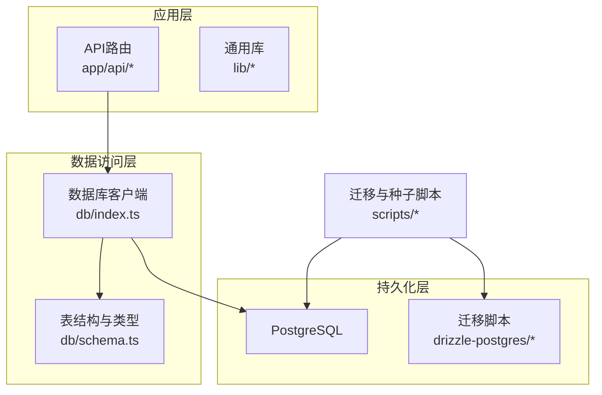
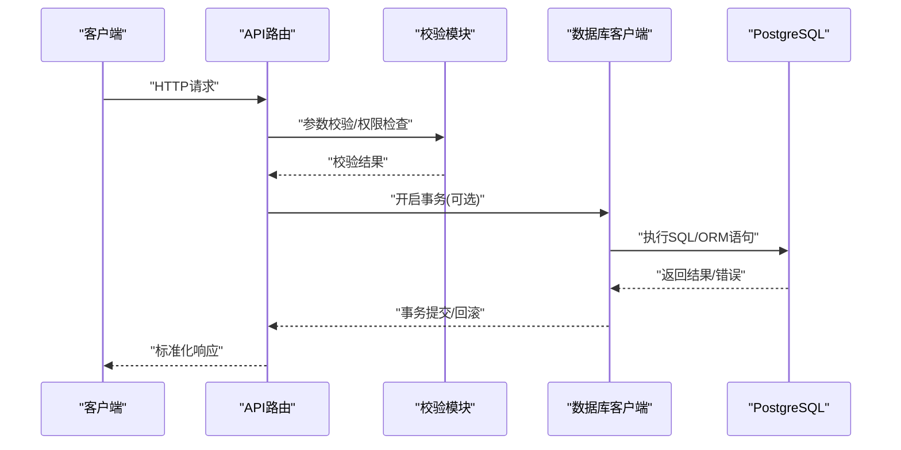
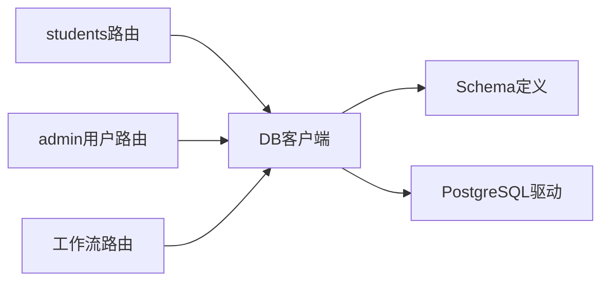

# 数据库操作与查询

<cite>
**本文引用的文件**   
- [db/index.ts](file://db/index.ts)
- [db/schema.ts](file://db/schema.ts)
- [drizzle.config.ts](file://drizzle.config.ts)
- [scripts/migrate.mjs](file://scripts/migrate.mjs)
- [scripts/seed-admin.mjs](file://scripts/seed-admin.mjs)
- [scripts/seed-full-test-data.mjs](file://scripts/seed-full-test-data.mjs)
- [lib/validation.ts](file://lib/validation.ts)
- [app/api/students/route.ts](file://app/api/students/route.ts)
- [app/api/students/[id]/route.ts](file://app/api/students/[id]/route.ts)
- [app/api/students/batch/route.ts](file://app/api/students/batch/route.ts)
- [app/api/admin/users/route.ts](file://app/api/admin/users/route.ts)
- [app/api/admin/users/[id]/route.ts](file://app/api/admin/users/[id]/route.ts)
- [app/api/workflows/route.ts](file://app/api/workflows/route.ts)
- [app/api/workflow/instances/route.ts](file://app/api/workflow/instances/route.ts)
- [app/api/workflow/tasks/route.ts](file://app/api/workflow/tasks/route.ts)
- [tests/helpers/db-mock.ts](file://tests/helpers/db-mock.ts)
</cite>

## 目录
1. [简介](#简介)
2. [项目结构](#项目结构)
3. [核心组件](#核心组件)
4. [架构总览](#架构总览)
5. [详细组件分析](#详细组件分析)
6. [依赖关系分析](#依赖关系分析)
7. [性能考量](#性能考量)
8. [故障排查指南](#故障排查指南)
9. [结论](#结论)
10. [附录](#附录)

## 简介
本文件面向CS1系统的数据库层，系统性说明PostgreSQL连接配置、连接池管理、事务处理机制，以及基于Drizzle ORM的CRUD实现模式、查询构建器用法与批量操作技巧。同时给出复杂查询优化、索引利用与性能监控方法，并总结错误处理策略、重试机制与连接故障恢复实践，最后提供常用查询模板与最佳实践清单，帮助开发者高效、稳定地编写数据访问代码。

## 项目结构
CS1使用Next.js作为应用框架，数据库访问通过Drizzle ORM与PostgreSQL集成。关键目录与职责如下：
- db: 数据库客户端初始化、Schema定义与迁移入口
- drizzle-postgres: Drizzle迁移SQL脚本与元数据
- scripts: 数据迁移、种子数据生成等运维脚本
- app/api: REST API路由，封装业务逻辑与数据库调用
- lib: 通用库（校验、安全、速率限制等）
- tests: 单元测试与集成测试，包含数据库Mock工具

图表来源
- [db/index.ts](file://db/index.ts)
- [db/schema.ts](file://db/schema.ts)
- [drizzle.config.ts](file://drizzle.config.ts)
- [scripts/migrate.mjs](file://scripts/migrate.mjs)

章节来源
- [db/index.ts](file://db/index.ts)
- [db/schema.ts](file://db/schema.ts)
- [drizzle.config.ts](file://drizzle.config.ts)
- [scripts/migrate.mjs](file://scripts/migrate.mjs)

## 核心组件
- 数据库客户端与连接池
  - 通过环境变量加载PostgreSQL连接字符串，创建Drizzle客户端实例，内部维护连接池与超时、重试等参数。
  - 建议在生产环境启用连接池大小上限、空闲超时、最大生命周期等调优项。
- Schema与类型
  - 使用Drizzle Table DSL定义表结构、字段约束、默认值与索引声明，确保类型安全与迁移一致性。
- 迁移与种子
  - 使用drizzle-kit进行迁移管理与SQL生成；scripts下提供迁移执行与种子数据注入脚本。
- API路由与数据访问
  - 各API路由负责请求校验、事务边界控制、调用DB客户端执行CRUD或批量操作，并返回标准化响应。

章节来源
- [db/index.ts](file://db/index.ts)
- [db/schema.ts](file://db/schema.ts)
- [drizzle.config.ts](file://drizzle.config.ts)
- [scripts/migrate.mjs](file://scripts/migrate.mjs)
- [scripts/seed-admin.mjs](file://scripts/seed-admin.mjs)
- [scripts/seed-full-test-data.mjs](file://scripts/seed-full-test-data.mjs)

## 架构总览
下图展示从HTTP请求到数据库操作的端到端流程，包括鉴权、校验、事务与结果返回。

图表来源
- [app/api/students/route.ts](file://app/api/students/route.ts)
- [app/api/students/[id]/route.ts](file://app/api/students/[id]/route.ts)
- [app/api/students/batch/route.ts](file://app/api/students/batch/route.ts)
- [db/index.ts](file://db/index.ts)

## 详细组件分析

### 数据库客户端与连接池
- 连接配置
  - 从环境变量读取PostgreSQL连接串，设置连接池大小、超时、重试次数等。
  - 在开发环境与生产环境采用不同策略（如连接池大小、日志级别）。
- 连接池管理
  - 合理设置最小/最大连接数，避免连接泄漏；对长事务和批量写入进行限流。
  - 监控连接池状态（活跃连接、等待队列、空闲连接），及时告警。
- 事务处理
  - 使用事务包裹多步写操作，保证原子性；失败时自动回滚。
  - 对读多写少的场景考虑只读事务或快照隔离级别。

章节来源
- [db/index.ts](file://db/index.ts)
- [drizzle.config.ts](file://drizzle.config.ts)

### Schema与类型定义
- 表结构
  - 使用Table DSL定义主键、唯一约束、外键、非空、默认值等。
  - 为高频查询字段添加索引，避免过度索引影响写入性能。
- 类型安全
  - 所有查询与插入均基于TS类型，减少运行时错误。
- 迁移一致性
  - 通过drizzle-kit生成并应用迁移，保持开发与生产一致。

章节来源
- [db/schema.ts](file://db/schema.ts)
- [drizzle.config.ts](file://drizzle.config.ts)

### CRUD操作实现模式
- 创建（Create）
  - 接收请求体，进行输入校验后调用insert，返回新记录ID与基础信息。
- 读取（Read）
  - 支持按ID查询、分页列表、条件过滤与排序；优先使用索引字段过滤。
- 更新（Update）
  - 根据ID更新部分字段，注意并发冲突与乐观锁（版本号字段）。
- 删除（Delete）
  - 软删除或硬删除策略需统一；删除前检查关联数据完整性。

章节来源
- [app/api/students/route.ts](file://app/api/students/route.ts)
- [app/api/students/[id]/route.ts](file://app/api/students/[id]/route.ts)
- [app/api/admin/users/route.ts](file://app/api/admin/users/route.ts)
- [app/api/admin/users/[id]/route.ts](file://app/api/admin/users/[id]/route.ts)

### 查询构建器与复杂查询
- 条件过滤
  - 使用eq、in、like、between等组合条件，避免N+1查询。
- 聚合与分组
  - 使用count、sum、avg、group by进行统计报表，必要时物化视图。
- 分页与排序
  - 基于游标或偏移量分页，结合索引字段排序提升性能。
- 子查询与联表
  - 谨慎使用join，必要时拆分为多次查询并在应用层合并。

章节来源
- [app/api/students/route.ts](file://app/api/students/route.ts)
- [app/api/workflow/instances/route.ts](file://app/api/workflow/instances/route.ts)
- [app/api/workflow/tasks/route.ts](file://app/api/workflow/tasks/route.ts)

### 批量操作技巧
- 批量插入
  - 使用批量insert减少往返开销；分批次提交避免单条过大。
- 批量更新/删除
  - 使用updateMany/deleteMany配合条件集合，注意事务边界。
- 导入导出
  - CSV导入采用流式解析与分批入库，失败可回滚或跳过错误行。

章节来源
- [app/api/students/batch/route.ts](file://app/api/students/batch/route.ts)
- [scripts/seed-admin.mjs](file://scripts/seed-admin.mjs)
- [scripts/seed-full-test-data.mjs](file://scripts/seed-full-test-data.mjs)

### 事务与错误处理
- 事务边界
  - 明确事务开始与提交点，异常时回滚；避免长事务占用连接。
- 错误分类
  - 区分参数错误、业务规则错误、数据库错误，返回统一错误码与消息。
- 重试机制
  - 对幂等写操作实施指数退避重试；对非幂等操作禁止自动重试。
- 连接故障恢复
  - 检测连接断开、超时，触发重连与降级策略（只读模式或缓存）。

章节来源
- [lib/validation.ts](file://lib/validation.ts)
- [tests/helpers/db-mock.ts](file://tests/helpers/db-mock.ts)

### 性能监控与优化
- 慢查询分析
  - 启用PostgreSQL慢查询日志，定期分析top SQL。
- 索引策略
  - 针对高频过滤与排序字段建立索引；覆盖索引减少回表。
- 连接池监控
  - 监控连接池利用率、等待时间、活跃连接数，动态扩缩容。
- 缓存与物化
  - 热点数据使用Redis缓存；报表类数据使用物化视图定时刷新。

章节来源
- [db/index.ts](file://db/index.ts)
- [db/schema.ts](file://db/schema.ts)

## 依赖关系分析
- 模块耦合
  - API路由依赖DB客户端与Schema类型；DB客户端依赖环境变量与PostgreSQL驱动。
- 外部依赖
  - Drizzle ORM、PostgreSQL驱动、drizzle-kit迁移工具。
- 潜在循环依赖
  - 确保API不直接依赖DB内部实现细节，仅通过客户端接口调用。

图表来源
- [app/api/students/route.ts](file://app/api/students/route.ts)
- [app/api/admin/users/route.ts](file://app/api/admin/users/route.ts)
- [app/api/workflows/route.ts](file://app/api/workflows/route.ts)
- [db/index.ts](file://db/index.ts)
- [db/schema.ts](file://db/schema.ts)

章节来源
- [app/api/students/route.ts](file://app/api/students/route.ts)
- [app/api/admin/users/route.ts](file://app/api/admin/users/route.ts)
- [app/api/workflows/route.ts](file://app/api/workflows/route.ts)
- [db/index.ts](file://db/index.ts)
- [db/schema.ts](file://db/schema.ts)

## 性能考量
- 连接池调优
  - 根据并发QPS与平均响应时间调整maxConnections、idleTimeout、acquireTimeout。
- 查询优化
  - 避免SELECT *，仅选择必要字段；合理使用EXPLAIN ANALYZE定位瓶颈。
- 批量与事务
  - 大批量写入拆分事务，降低锁竞争与内存占用。
- 缓存策略
  - 读多写少场景引入缓存层，设置合理的TTL与失效策略。

[本节为通用指导，无需特定文件引用]

## 故障排查指南
- 常见问题
  - 连接超时：检查网络、防火墙、连接池耗尽与慢查询。
  - 死锁：缩短事务、统一加锁顺序、避免跨表长事务。
  - 数据不一致：核对事务边界与重试策略，确保幂等性。
- 诊断步骤
  - 查看应用日志与数据库慢查询日志；使用EXPLAIN分析SQL。
  - 监控连接池指标与CPU/IO负载，定位热点资源。
- 恢复措施
  - 重启服务释放连接；临时降级为只读模式；扩容数据库实例。

章节来源
- [lib/validation.ts](file://lib/validation.ts)
- [tests/helpers/db-mock.ts](file://tests/helpers/db-mock.ts)

## 结论
CS1系统通过Drizzle ORM与PostgreSQL构建了类型安全、可迁移、易维护的数据访问层。遵循本文的连接池管理、事务处理、查询优化与错误恢复实践，可显著提升系统稳定性与性能。建议在上线前完成慢查询治理、索引优化与监控告警配置，确保在高并发场景下的稳健运行。

[本节为总结性内容，无需特定文件引用]

## 附录

### 常用查询模板
- 分页列表查询
  - 条件过滤 + 排序 + 分页 + 投影字段
- 按ID获取详情
  - 精确匹配 + 关联数据懒加载
- 批量插入
  - 分批次insert + 事务包裹 + 失败回滚
- 统计聚合
  - group by + count/sum/avg + 物化视图

[本节为模板说明，无需特定文件引用]

### 最佳实践清单
- 始终使用事务包裹写操作，确保原子性与一致性
- 为高频查询字段建立合适索引，避免过度索引
- 使用参数化查询防止SQL注入
- 对幂等写操作实施指数退避重试
- 监控连接池与慢查询，及时告警与优化
- 分离读写路径，必要时引入缓存与只读副本

[本节为实践建议，无需特定文件引用]