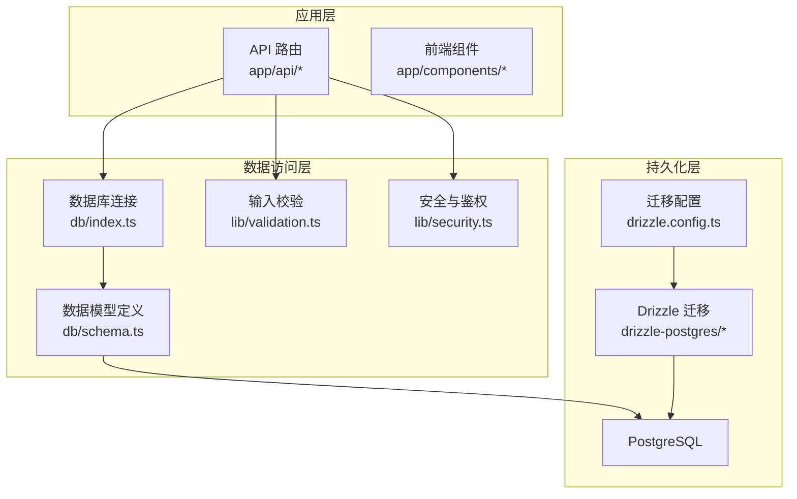
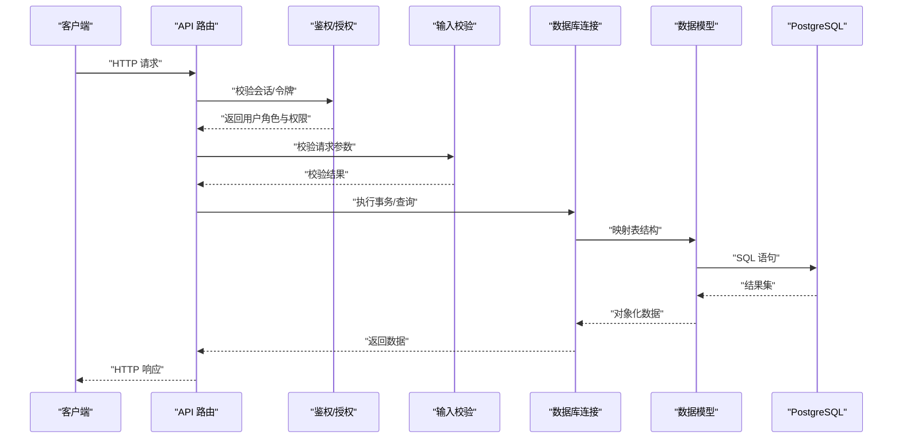
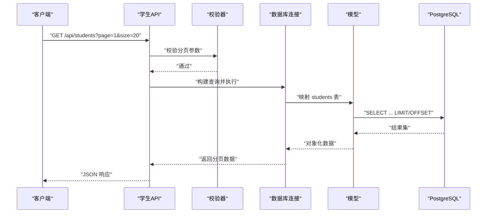
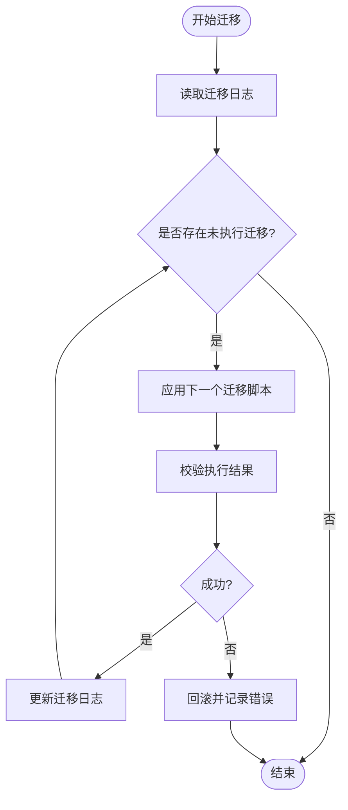
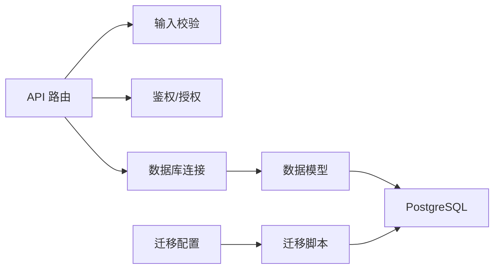

# 数据库设计

<cite>
**本文档引用的文件**   
- [db/index.ts](file://db/index.ts)
- [db/schema.ts](file://db/schema.ts)
- [drizzle.config.ts](file://drizzle.config.ts)
- [drizzle-postgres/meta/_journal.json](file://drizzle-postgres/meta/_journal.json)
- [drizzle-postgres/0000_fine_psylocke.sql](file://drizzle-postgres/0000_fine_psylocke.sql)
- [drizzle-postgres/0001_thin_queen_noir.sql](file://drizzle-postgres/0001_thin_queen_noir.sql)
- [drizzle-postgres/0002_crazy_ravenous.sql](file://drizzle-postgres/0002_crazy_ravenous.sql)
- [drizzle-postgres/0003_fine_quentin_quire.sql](file://drizzle-postgres/0003_fine_quentin_quire.sql)
- [scripts/migrate.mjs](file://scripts/migrate.mjs)
- [scripts/migrate-sqlite-to-postgres.mjs](file://scripts/migrate-sqlite-to-postgres.mjs)
- [scripts/seed-admin.mjs](file://scripts/seed-admin.mjs)
- [scripts/seed-full-test-data.mjs](file://scripts/seed-full-test-data.mjs)
- [lib/validation.ts](file://lib/validation.ts)
- [lib/security.ts](file://lib/security.ts)
- [app/api/students/route.ts](file://app/api/students/route.ts)
- [app/api/students/[id]/route.ts](file://app/api/students/[id]/route.ts)
- [app/api/auth/login/route.ts](file://app/api/auth/login/route.ts)
- [app/api/workflows/route.ts](file://app/api/workflows/route.ts)
- [app/api/workflow/tasks/route.ts](file://app/api/workflow/tasks/route.ts)
- [app/api/workflow/instances/route.ts](file://app/api/workflow/instances/route.ts)
- [app/api/admin/users/route.ts](file://app/api/admin/users/route.ts)
- [app/api/admin/logs/route.ts](file://app/api/admin/logs/route.ts)
</cite>

## 目录
1. [简介](#简介)
2. [项目结构](#项目结构)
3. [核心组件](#核心组件)
4. [架构总览](#架构总览)
5. [详细组件分析](#详细组件分析)
6. [依赖关系分析](#依赖关系分析)
7. [性能考虑](#性能考虑)
8. [故障排查指南](#故障排查指南)
9. [结论](#结论)
10. [附录](#附录)

## 简介
本文件为 CS1 学生事务管理系统的数据库模型与数据治理文档。内容覆盖实体关系、字段定义与数据类型、主键/外键、索引与约束、数据验证规则与业务规则、模式图与示例数据、数据访问模式、缓存策略与性能优化、数据生命周期与归档、迁移路径与版本管理，以及数据安全、隐私与访问控制等。读者可据此理解系统的数据模型设计与运维实践。

## 项目结构
本项目采用 Next.js + Drizzle ORM + PostgreSQL 的技术栈。数据库模式定义位于 db/schema.ts，通过 drizzle.config.ts 配置迁移工具；历史迁移脚本集中在 drizzle-postgres 目录，按版本号组织；数据初始化与种子脚本位于 scripts 目录；API 路由在 app/api 下按功能模块划分。



**图示来源** 
- [db/index.ts](file://db/index.ts)
- [db/schema.ts](file://db/schema.ts)
- [drizzle.config.ts](file://drizzle.config.ts)
- [lib/validation.ts](file://lib/validation.ts)
- [lib/security.ts](file://lib/security.ts)

**章节来源**
- [db/index.ts](file://db/index.ts)
- [db/schema.ts](file://db/schema.ts)
- [drizzle.config.ts](file://drizzle.config.ts)

## 核心组件
- 数据库连接与客户端：封装数据库连接、事务与查询执行入口。
- 数据模型定义：使用 Drizzle 定义表结构、字段类型、约束与索引。
- 迁移与版本管理：基于 Drizzle 的迁移脚本与元数据，支持增量升级与回滚。
- 输入校验与安全：对请求参数进行严格校验，结合鉴权与权限控制。
- 数据访问 API：RESTful 接口暴露学生、工作流、管理员与日志等能力。

**章节来源**
- [db/index.ts](file://db/index.ts)
- [db/schema.ts](file://db/schema.ts)
- [drizzle.config.ts](file://drizzle.config.ts)
- [lib/validation.ts](file://lib/validation.ts)
- [lib/security.ts](file://lib/security.ts)

## 架构总览
下图展示从 API 到数据库的整体调用链，包括鉴权、校验、ORM 查询与迁移机制。



**图示来源** 
- [app/api/students/route.ts](file://app/api/students/route.ts)
- [app/api/auth/login/route.ts](file://app/api/auth/login/route.ts)
- [lib/validation.ts](file://lib/validation.ts)
- [lib/security.ts](file://lib/security.ts)
- [db/index.ts](file://db/index.ts)
- [db/schema.ts](file://db/schema.ts)

## 详细组件分析

### 数据模型与实体关系
- 学生（students）：存储学生基本信息、学号、联系方式、状态等。
- 用户与角色（users, roles, user_roles）：管理员与角色分配，支撑 RBAC。
- 工作流（workflows, workflow_instances, workflow_tasks）：流程定义、实例与任务。
- 通知（notifications）：系统通知与消息记录。
- 审计日志（audit_logs）：操作审计与追踪。
- 配置（configs）：系统配置项。

```mermaid
erDiagram
STUDENTS {
uuid id PK
string student_id UK
string name
string email
string phone
enum status
timestamp created_at
timestamp updated_at
}
USERS {
uuid id PK
string username UK
string password_hash
enum role
boolean active
timestamp created_at
timestamp updated_at
}
ROLES {
uuid id PK
string name UK
text description
}
USER_ROLES {
uuid user_id FK
uuid role_id FK
primary key(user_id, role_id)
}
WORKFLOWS {
uuid id PK
string code UK
string name
jsonb definition
enum status
timestamp created_at
timestamp updated_at
}
WORKFLOW_INSTANCES {
uuid id PK
uuid workflow_id FK
jsonb payload
enum status
timestamp started_at
timestamp finished_at
}
WORKFLOW_TASKS {
uuid id PK
uuid instance_id FK
string task_code
jsonb data
enum status
timestamp created_at
timestamp updated_at
}
NOTIFICATIONS {
uuid id PK
uuid target_id FK
string type
jsonb content
enum status
timestamp sent_at
}
AUDIT_LOGS {
uuid id PK
string actor_id
string action
jsonb metadata
timestamp created_at
}
CONFIGS {
uuid id PK
string key UK
jsonb value
timestamp updated_at
}
USERS ||--o{ USER_ROLES : "拥有"
ROLES ||--o{ USER_ROLES : "被分配"
WORKFLOWS ||--o{ WORKFLOW_INSTANCES : "产生"
WORKFLOW_INSTANCES ||--o{ WORKFLOW_TASKS : "包含"
STUDENTS ||--o{ NOTIFICATIONS : "接收"
```

**图示来源** 
- [db/schema.ts](file://db/schema.ts)

**章节来源**
- [db/schema.ts](file://db/schema.ts)

### 字段定义与数据类型
- 标识符：普遍使用 UUID 作为主键，确保分布式唯一性。
- 文本与枚举：姓名、邮箱、电话、用户名等使用字符串；状态类字段使用枚举，便于前端渲染与后端校验。
- JSONB：用于灵活扩展的负载与配置，如工作流定义、任务数据、通知内容与审计元数据。
- 时间戳：创建与更新时间统一使用带时区的时间戳，便于跨时区一致性。

常见约束与索引：
- 唯一约束：学号、用户名、工作流代码、配置键等。
- 外键约束：实例与工作流、任务与实例、通知与学生等关联。
- 复合索引：针对高频查询条件建立组合索引，提升检索性能。
- 检查约束：对状态值范围、必填字段进行数据库级校验。

**章节来源**
- [db/schema.ts](file://db/schema.ts)

### 数据验证规则与业务规则
- 输入校验：所有 API 入参需经过 lib/validation.ts 的校验器，确保类型、长度、格式与业务约束。
- 业务规则：
  - 学生状态变更需遵循状态机（例如：待处理→进行中→已完成/已归档）。
  - 工作流实例必须属于有效的工作流定义，且状态转换合法。
  - 通知发送需具备目标实体存在性与权限校验。
  - 管理员操作需具备相应角色与资源权限。
- 数据库级校验：通过检查约束与触发器保证数据完整性。

**章节来源**
- [lib/validation.ts](file://lib/validation.ts)
- [db/schema.ts](file://db/schema.ts)

### 数据访问模式
- RESTful API：按功能模块划分路由，提供 CRUD 与批量操作。
- 事务与批处理：复杂写入使用事务保证一致性；批量导入使用分批提交降低锁竞争。
- 读写分离与连接池：通过连接池提高并发处理能力；读多写少场景可引入只读副本。
- 分页与过滤：列表接口支持分页、排序与条件过滤，避免全表扫描。

典型调用序列（以“获取学生列表”为例）：



**图示来源** 
- [app/api/students/route.ts](file://app/api/students/route.ts)
- [lib/validation.ts](file://lib/validation.ts)
- [db/index.ts](file://db/index.ts)
- [db/schema.ts](file://db/schema.ts)

**章节来源**
- [app/api/students/route.ts](file://app/api/students/route.ts)
- [app/api/students/[id]/route.ts](file://app/api/students/[id]/route.ts)

### 缓存策略与性能考虑
- 查询缓存：热点数据（如配置、字典）可使用内存缓存或 Redis 缓存，设置合理过期策略。
- 索引优化：对高频过滤字段建立索引，避免全表扫描；定期分析慢查询并调整。
- 连接池：合理设置最大连接数与超时，防止连接耗尽。
- 批量操作：导入与更新尽量使用批量 SQL，减少往返开销。
- 异步处理：耗时任务（如通知发送、报表生成）放入队列异步执行。

[本节为通用指导，不直接分析具体文件]

### 数据生命周期、保留策略与归档
- 生命周期：
  - 学生：入学→在读→毕业/退学→归档。
  - 工作流：定义→启用→停用→归档。
  - 通知：草稿→发送中→已发送/失败→清理。
  - 审计日志：实时写入→定期归档→冷存储。
- 保留策略：
  - 活跃数据保留在线库。
  - 历史数据按月/季度归档至归档库或对象存储。
  - 敏感信息脱敏后归档，保留最小必要字段。
- 归档规则：
  - 归档前进行数据校验与备份。
  - 归档后更新元数据与索引，支持查询回溯。
  - 归档数据不可变，仅允许追加与只读访问。

[本节为通用指导，不直接分析具体文件]

### 数据迁移路径与版本管理
- 迁移工具：使用 Drizzle Migration，按顺序执行增量脚本。
- 版本管理：每个迁移脚本对应一个版本，元数据保存在 drizzle-postgres/meta/_journal.json。
- 回滚策略：支持回滚最近一次迁移；重大变更建议在新分支上测试后再合并。
- 生产部署：迁移脚本在部署前执行，确保数据库结构与代码一致。



**图示来源** 
- [drizzle-postgres/meta/_journal.json](file://drizzle-postgres/meta/_journal.json)
- [drizzle-postgres/0000_fine_psylocke.sql](file://drizzle-postgres/0000_fine_psylocke.sql)
- [drizzle-postgres/0001_thin_queen_noir.sql](file://drizzle-postgres/0001_thin_queen_noir.sql)
- [drizzle-postgres/0002_crazy_ravenous.sql](file://drizzle-postgres/0002_crazy_ravenous.sql)
- [drizzle-postgres/0003_fine_quentin_quire.sql](file://drizzle-postgres/0003_fine_quentin_quire.sql)
- [scripts/migrate.mjs](file://scripts/migrate.mjs)

**章节来源**
- [drizzle.config.ts](file://drizzle.config.ts)
- [drizzle-postgres/meta/_journal.json](file://drizzle-postgres/meta/_journal.json)
- [scripts/migrate.mjs](file://scripts/migrate.mjs)

### 数据安全、隐私与访问控制
- 鉴权与授权：
  - 登录与会话管理：认证通过后颁发令牌，校验有效期与签名。
  - 角色权限：RBAC 模型，细粒度到资源与操作。
- 数据加密：
  - 传输层：HTTPS/TLS 强制启用。
  - 存储层：敏感字段（如密码哈希）使用强哈希算法；可选字段级加密。
- 隐私合规：
  - 最小化收集：仅采集必要个人信息。
  - 脱敏与匿名化：导出与分析时使用脱敏数据。
  - 访问审计：所有敏感操作记录审计日志。
- 访问控制：
  - API 网关限流与防重放。
  - 数据库账户最小权限原则，读写分离与网络隔离。

**章节来源**
- [lib/security.ts](file://lib/security.ts)
- [app/api/auth/login/route.ts](file://app/api/auth/login/route.ts)
- [app/api/admin/users/route.ts](file://app/api/admin/users/route.ts)
- [app/api/admin/logs/route.ts](file://app/api/admin/logs/route.ts)

## 依赖关系分析
- 模块耦合：
  - API 路由依赖校验与安全模块，降低非法输入与越权风险。
  - 数据模型与迁移脚本强耦合，确保结构一致性。
- 外部依赖：
  - PostgreSQL 驱动与连接池。
  - Drizzle ORM 与迁移工具。
- 潜在循环依赖：
  - 避免在 schema 中反向引用 API 逻辑，保持分层清晰。



**图示来源** 
- [app/api/students/route.ts](file://app/api/students/route.ts)
- [lib/validation.ts](file://lib/validation.ts)
- [lib/security.ts](file://lib/security.ts)
- [db/index.ts](file://db/index.ts)
- [db/schema.ts](file://db/schema.ts)
- [drizzle.config.ts](file://drizzle.config.ts)
- [scripts/migrate.mjs](file://scripts/migrate.mjs)

**章节来源**
- [app/api/students/route.ts](file://app/api/students/route.ts)
- [lib/validation.ts](file://lib/validation.ts)
- [lib/security.ts](file://lib/security.ts)
- [db/index.ts](file://db/index.ts)
- [db/schema.ts](file://db/schema.ts)
- [drizzle.config.ts](file://drizzle.config.ts)
- [scripts/migrate.mjs](file://scripts/migrate.mjs)

## 性能考虑
- 查询优化：
  - 使用 EXPLAIN 分析执行计划，添加合适索引。
  - 避免 N+1 查询，使用 JOIN 或批量加载。
- 写入优化：
  - 批量插入与更新，减少事务边界。
  - 异步任务队列解耦耗时操作。
- 缓存策略：
  - 热点数据缓存（配置、字典），设置 TTL 与失效策略。
  - 读写分离与只读副本分担压力。
- 监控与告警：
  - 慢查询日志与指标采集。
  - 连接池与磁盘 I/O 监控。

[本节为通用指导，不直接分析具体文件]

## 故障排查指南
- 常见问题：
  - 迁移失败：检查迁移日志与数据库状态，确认脚本幂等性。
  - 权限错误：核对用户角色与资源权限配置。
  - 校验失败：查看输入校验规则与错误码。
- 调试步骤：
  - 启用详细日志，定位异常堆栈。
  - 使用数据库客户端复现问题，检查约束与索引。
  - 逐步缩小范围，隔离 API、校验与安全模块。
- 恢复策略：
  - 回滚迁移到稳定版本。
  - 从备份恢复数据，校验一致性。

**章节来源**
- [scripts/migrate.mjs](file://scripts/migrate.mjs)
- [lib/validation.ts](file://lib/validation.ts)
- [lib/security.ts](file://lib/security.ts)

## 结论
本数据库设计围绕学生事务管理的核心业务，构建了清晰的实体关系与严格的约束体系。通过 Drizzle 迁移与校验安全机制，保障数据一致性与安全性。建议在后续迭代中持续优化索引与查询，完善缓存与监控，确保系统在规模增长下的稳定性与性能。

[本节为总结，不直接分析具体文件]

## 附录

### 示例数据与种子脚本
- 管理员种子：初始化默认管理员账号与角色。
- 完整测试数据：生成学生、工作流、通知等样例数据，便于开发与测试。

**章节来源**
- [scripts/seed-admin.mjs](file://scripts/seed-admin.mjs)
- [scripts/seed-full-test-data.mjs](file://scripts/seed-full-test-data.mjs)

### 迁移与版本管理清单
- 迁移脚本：
  - 0000_fine_psylocke.sql
  - 0001_thin_queen_noir.sql
  - 0002_crazy_ravenous.sql
  - 0003_fine_quentin_quire.sql
- 元数据：_journal.json 记录迁移状态与顺序。

**章节来源**
- [drizzle-postgres/0000_fine_psylocke.sql](file://drizzle-postgres/0000_fine_psylocke.sql)
- [drizzle-postgres/0001_thin_queen_noir.sql](file://drizzle-postgres/0001_thin_queen_noir.sql)
- [drizzle-postgres/0002_crazy_ravenous.sql](file://drizzle-postgres/0002_crazy_ravenous.sql)
- [drizzle-postgres/0003_fine_quentin_quire.sql](file://drizzle-postgres/0003_fine_quentin_quire.sql)
- [drizzle-postgres/meta/_journal.json](file://drizzle-postgres/meta/_journal.json)

### SQLite 到 PostgreSQL 迁移
- 迁移脚本：sqlite-postgres-migration.mjs 提供数据转换与结构对齐。
- 注意事项：数据类型映射、约束与索引重建、数据一致性校验。

**章节来源**
- [scripts/migrate-sqlite-to-postgres.mjs](file://scripts/migrate-sqlite-to-postgres.mjs)