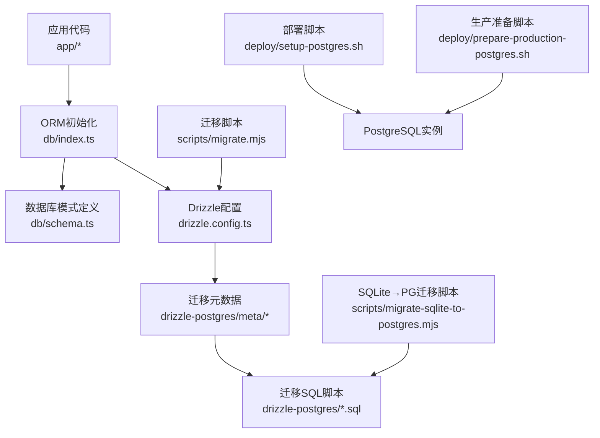
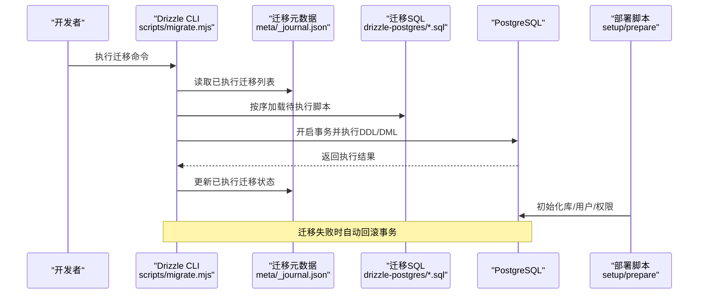
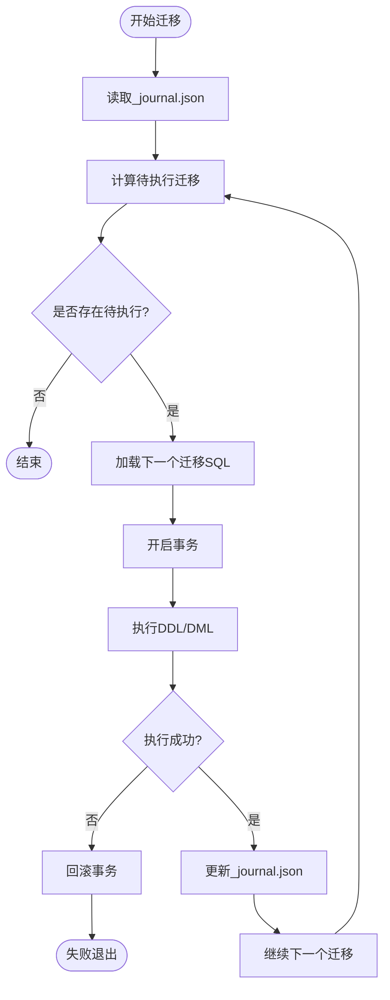
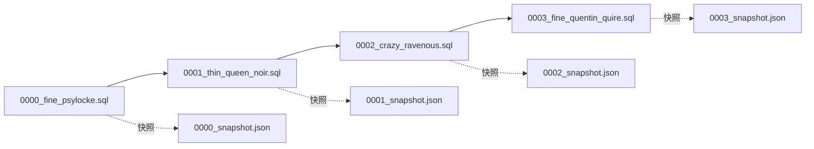
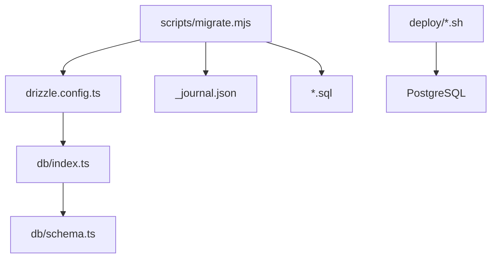

# 数据迁移管理

<cite>
**本文引用的文件**   
- [drizzle.config.ts](file://drizzle.config.ts)
- [db/index.ts](file://db/index.ts)
- [db/schema.ts](file://db/schema.ts)
- [drizzle-postgres/meta/_journal.json](file://drizzle-postgres/meta/_journal.json)
- [drizzle-postgres/meta/0000_snapshot.json](file://drizzle-postgres/meta/0000_snapshot.json)
- [drizzle-postgres/meta/0001_snapshot.json](file://drizzle-postgres/meta/0001_snapshot.json)
- [drizzle-postgres/meta/0002_snapshot.json](file://drizzle-postgres/meta/0002_snapshot.json)
- [drizzle-postgres/meta/0003_snapshot.json](file://drizzle-postgres/meta/0003_snapshot.json)
- [drizzle-postgres/0000_fine_psylocke.sql](file://drizzle-postgres/0000_fine_psylocke.sql)
- [drizzle-postgres/0001_thin_queen_noir.sql](file://drizzle-postgres/0001_thin_queen_noir.sql)
- [drizzle-postgres/0002_crazy_ravenous.sql](file://drizzle-postgres/0002_crazy_ravenous.sql)
- [drizzle-postgres/0003_fine_quentin_quire.sql](file://drizzle-postgres/0003_fine_quentin_quire.sql)
- [scripts/migrate.mjs](file://scripts/migrate.mjs)
- [scripts/migrate-sqlite-to-postgres.mjs](file://scripts/migrate-sqlite-to-postgres.mjs)
- [deploy/setup-postgres.sh](file://deploy/setup-postgres.sh)
- [deploy/prepare-production-postgres.sh](file://deploy/prepare-production-postgres.sh)
- [package.json](file://package.json)
</cite>

## 目录
1. [简介](#简介)
2. [项目结构](#项目结构)
3. [核心组件](#核心组件)
4. [架构总览](#架构总览)
5. [详细组件分析](#详细组件分析)
6. [依赖关系分析](#依赖关系分析)
7. [性能考虑](#性能考虑)
8. [故障排查指南](#故障排查指南)
9. [结论](#结论)
10. [附录](#附录)

## 简介
本文件面向CS1系统的数据迁移管理，聚焦于基于Drizzle ORM的PostgreSQL迁移机制、版本控制策略与回滚方案。文档涵盖：
- Drizzle迁移的工作流程与执行顺序
- 迁移文件的变更内容与依赖关系
- 数据库模式演进与向后兼容性处理
- 数据转换逻辑与脚本化迁移
- 迁移命令使用指南、错误排查方法与性能优化建议
- 生产环境最佳实践与安全注意事项

## 项目结构
与数据迁移相关的核心位置如下：
- 配置与ORM初始化：drizzle.config.ts、db/index.ts、db/schema.ts
- 迁移元数据与SQL脚本：drizzle-postgres/meta/* 与 drizzle-postgres/*.sql
- 迁移与数据转换脚本：scripts/migrate.mjs、scripts/migrate-sqlite-to-postgres.mjs
- 部署与初始化脚本：deploy/setup-postgres.sh、deploy/prepare-production-postgres.sh
- 包管理与命令入口：package.json

图表来源
- [drizzle.config.ts](file://drizzle.config.ts)
- [db/index.ts](file://db/index.ts)
- [db/schema.ts](file://db/schema.ts)
- [drizzle-postgres/meta/_journal.json](file://drizzle-postgres/meta/_journal.json)
- [drizzle-postgres/0000_fine_psylocke.sql](file://drizzle-postgres/0000_fine_psylocke.sql)
- [drizzle-postgres/0001_thin_queen_noir.sql](file://drizzle-postgres/0001_thin_queen_noir.sql)
- [drizzle-postgres/0002_crazy_ravenous.sql](file://drizzle-postgres/0002_crazy_ravenous.sql)
- [drizzle-postgres/0003_fine_quentin_quire.sql](file://drizzle-postgres/0003_fine_quentin_quire.sql)
- [scripts/migrate.mjs](file://scripts/migrate.mjs)
- [scripts/migrate-sqlite-to-postgres.mjs](file://scripts/migrate-sqlite-to-postgres.mjs)
- [deploy/setup-postgres.sh](file://deploy/setup-postgres.sh)
- [deploy/prepare-production-postgres.sh](file://deploy/prepare-production-postgres.sh)

章节来源
- [drizzle.config.ts](file://drizzle.config.ts)
- [db/index.ts](file://db/index.ts)
- [db/schema.ts](file://db/schema.ts)
- [drizzle-postgres/meta/_journal.json](file://drizzle-postgres/meta/_journal.json)
- [package.json](file://package.json)

## 核心组件
- Drizzle配置与连接
  - 通过配置文件集中管理数据库连接参数与迁移目录路径，确保开发/测试/生产环境一致。
  - ORM初始化模块负责建立连接池、事务上下文与查询构建器。
- 模式定义
  - schema.ts集中声明表、字段、约束与索引，作为迁移生成的权威来源。
- 迁移元数据与SQL
  - meta/_journal.json记录已执行迁移的顺序与状态；每个快照文件描述某一版本的完整模式。
  - 每个迁移对应一个SQL脚本，按序号递增顺序执行。
- 迁移与数据转换脚本
  - migrate.mjs用于驱动Drizzle CLI执行迁移任务（生成、执行、回滚等）。
  - migrate-sqlite-to-postgres.mjs用于历史数据从SQLite到PostgreSQL的结构与类型转换。
- 部署脚本
  - setup-postgres.sh用于本地或CI环境快速搭建PostgreSQL。
  - prepare-production-postgres.sh用于生产环境的数据库初始化与权限配置。

章节来源
- [drizzle.config.ts](file://drizzle.config.ts)
- [db/index.ts](file://db/index.ts)
- [db/schema.ts](file://db/schema.ts)
- [drizzle-postgres/meta/_journal.json](file://drizzle-postgres/meta/_journal.json)
- [scripts/migrate.mjs](file://scripts/migrate.mjs)
- [scripts/migrate-sqlite-to-postgres.mjs](file://scripts/migrate-sqlite-to-postgres.mjs)
- [deploy/setup-postgres.sh](file://deploy/setup-postgres.sh)
- [deploy/prepare-production-postgres.sh](file://deploy/prepare-production-postgres.sh)

## 架构总览
下图展示了从应用代码到数据库的迁移链路，以及脚本与部署环节如何协同工作。

图表来源
- [scripts/migrate.mjs](file://scripts/migrate.mjs)
- [drizzle-postgres/meta/_journal.json](file://drizzle-postgres/meta/_journal.json)
- [drizzle-postgres/0000_fine_psylocke.sql](file://drizzle-postgres/0000_fine_psylocke.sql)
- [drizzle-postgres/0001_thin_queen_noir.sql](file://drizzle-postgres/0001_thin_queen_noir.sql)
- [drizzle-postgres/0002_crazy_ravenous.sql](file://drizzle-postgres/0002_crazy_ravenous.sql)
- [drizzle-postgres/0003_fine_quentin_quire.sql](file://drizzle-postgres/0003_fine_quentin_quire.sql)
- [deploy/setup-postgres.sh](file://deploy/setup-postgres.sh)
- [deploy/prepare-production-postgres.sh](file://deploy/prepare-production-postgres.sh)

## 详细组件分析

### Drizzle迁移机制与版本控制
- 版本控制策略
  - 以数字前缀命名迁移文件，保证严格执行顺序。
  - _journal.json维护已执行迁移清单，避免重复执行与乱序。
  - 每个快照文件保存该版本的全量模式，便于校验与重建。
- 执行流程
  - 启动迁移时，读取当前已执行版本，计算待执行集合。
  - 逐个执行SQL脚本，通常包裹在事务中，失败即整体回滚。
  - 成功后更新_journal.json，标记迁移完成。
- 回滚方案
  - 若支持反向迁移，则按逆序执行对应的撤销脚本。
  - 对于不可逆变更，需配合数据备份与人工干预。

图表来源
- [drizzle-postgres/meta/_journal.json](file://drizzle-postgres/meta/_journal.json)
- [drizzle-postgres/0000_fine_psylocke.sql](file://drizzle-postgres/0000_fine_psylocke.sql)
- [drizzle-postgres/0001_thin_queen_noir.sql](file://drizzle-postgres/0001_thin_queen_noir.sql)
- [drizzle-postgres/0002_crazy_ravenous.sql](file://drizzle-postgres/0002_crazy_ravenous.sql)
- [drizzle-postgres/0003_fine_quentin_quire.sql](file://drizzle-postgres/0003_fine_quentin_quire.sql)
- [scripts/migrate.mjs](file://scripts/migrate.mjs)

章节来源
- [drizzle-postgres/meta/_journal.json](file://drizzle-postgres/meta/_journal.json)
- [scripts/migrate.mjs](file://scripts/migrate.mjs)

### 迁移文件变更内容、执行顺序与依赖关系
- 执行顺序
  - 严格按文件名前缀数字升序执行：0000 → 0001 → 0002 → 0003。
- 依赖关系
  - 后续迁移可依赖前置迁移创建的表、索引与约束。
  - 建议在schema.ts中保持单一事实源，避免手工SQL与模式不一致。
- 变更内容
  - 每个SQL脚本包含创建/修改表、添加字段、建索引、插入初始数据等DDL/DML。
  - 快照文件提供全量模式视图，可用于一致性校验与重建。

图表来源
- [drizzle-postgres/0000_fine_psylocke.sql](file://drizzle-postgres/0000_fine_psylocke.sql)
- [drizzle-postgres/0001_thin_queen_noir.sql](file://drizzle-postgres/0001_thin_queen_noir.sql)
- [drizzle-postgres/0002_crazy_ravenous.sql](file://drizzle-postgres/0002_crazy_ravenous.sql)
- [drizzle-postgres/0003_fine_quentin_quire.sql](file://drizzle-postgres/0003_fine_quentin_quire.sql)
- [drizzle-postgres/meta/0000_snapshot.json](file://drizzle-postgres/meta/0000_snapshot.json)
- [drizzle-postgres/meta/0001_snapshot.json](file://drizzle-postgres/meta/0001_snapshot.json)
- [drizzle-postgres/meta/0002_snapshot.json](file://drizzle-postgres/meta/0002_snapshot.json)
- [drizzle-postgres/meta/0003_snapshot.json](file://drizzle-postgres/meta/0003_snapshot.json)

章节来源
- [drizzle-postgres/meta/_journal.json](file://drizzle-postgres/meta/_journal.json)
- [drizzle-postgres/meta/0000_snapshot.json](file://drizzle-postgres/meta/0000_snapshot.json)
- [drizzle-postgres/meta/0001_snapshot.json](file://drizzle-postgres/meta/0001_snapshot.json)
- [drizzle-postgres/meta/0002_snapshot.json](file://drizzle-postgres/meta/0002_snapshot.json)
- [drizzle-postgres/meta/0003_snapshot.json](file://drizzle-postgres/meta/0003_snapshot.json)

### 数据库模式演进与向后兼容性
- 模式演进原则
  - 优先采用“新增字段/表”而非直接删除或重命名字段。
  - 对可能破坏兼容性的变更（如类型变更）采用双写过渡期。
- 向后兼容策略
  - 新增字段设置默认值，允许旧版本代码正常运行。
  - 对必填字段变更，先允许NULL再逐步填充数据，最后加NOT NULL约束。
  - 索引与约束增量添加，避免长事务阻塞。
- 数据转换逻辑
  - 通过迁移脚本进行数据清洗、映射与聚合。
  - 复杂转换拆分为多步迁移，每步幂等且可重试。

章节来源
- [db/schema.ts](file://db/schema.ts)
- [drizzle-postgres/0000_fine_psylocke.sql](file://drizzle-postgres/0000_fine_psylocke.sql)
- [drizzle-postgres/0001_thin_queen_noir.sql](file://drizzle-postgres/0001_thin_queen_noir.sql)
- [drizzle-postgres/0002_crazy_ravenous.sql](file://drizzle-postgres/0002_crazy_ravenous.sql)
- [drizzle-postgres/0003_fine_quentin_quire.sql](file://drizzle-postgres/0003_fine_quentin_quire.sql)

### 迁移命令使用指南
- 常用命令
  - 生成迁移：根据schema.ts差异生成SQL脚本。
  - 执行迁移：将未执行的迁移应用到目标数据库。
  - 回滚迁移：撤销最近一次或指定次数的迁移（视实现而定）。
  - 同步模式：将数据库结构与schema.ts保持一致。
- 环境变量与配置
  - 通过配置文件或环境变量指定数据库连接信息与迁移目录。
  - 生产环境建议使用只读账号进行预检，再用具备DDL权限的账号执行。
- 典型流程
  - 开发阶段：生成→执行→验证→提交。
  - 测试阶段：清理→重建→执行→断言。
  - 生产阶段：备份→灰度执行→监控→回滚预案。

章节来源
- [drizzle.config.ts](file://drizzle.config.ts)
- [scripts/migrate.mjs](file://scripts/migrate.mjs)
- [package.json](file://package.json)

### SQLite到PostgreSQL数据转换
- 转换目标
  - 将SQLite中的表结构、数据类型与数据迁移至PostgreSQL。
- 转换要点
  - 类型映射：如INTEGER→BIGINT、TEXT→VARCHAR/TEXT、BOOLEAN→BOOL。
  - 主键与自增：调整序列与主键策略。
  - 约束与索引：补齐缺失约束，重建必要索引。
- 执行方式
  - 运行专用脚本，按步骤导出、转换、导入，并校验一致性。

章节来源
- [scripts/migrate-sqlite-to-postgres.mjs](file://scripts/migrate-sqlite-to-postgres.mjs)

### 部署与初始化
- 本地/CI环境
  - 使用部署脚本快速拉起PostgreSQL实例，创建数据库与用户。
- 生产环境
  - 准备脚本负责安全初始化：最小权限、加密传输、备份策略。
  - 迁移应在发布流水线中执行，并与服务重启解耦。

章节来源
- [deploy/setup-postgres.sh](file://deploy/setup-postgres.sh)
- [deploy/prepare-production-postgres.sh](file://deploy/prepare-production-postgres.sh)

## 依赖关系分析
- 组件耦合
  - db/index.ts依赖drizzle.config.ts的连接配置。
  - 迁移脚本依赖meta/_journal.json的状态与SQL脚本的存在性。
  - 部署脚本独立于应用代码，仅关注数据库基础设施。
- 外部依赖
  - PostgreSQL为唯一持久化后端。
  - Drizzle CLI负责迁移编排与事务管理。

图表来源
- [drizzle.config.ts](file://drizzle.config.ts)
- [db/index.ts](file://db/index.ts)
- [db/schema.ts](file://db/schema.ts)
- [scripts/migrate.mjs](file://scripts/migrate.mjs)
- [drizzle-postgres/meta/_journal.json](file://drizzle-postgres/meta/_journal.json)
- [drizzle-postgres/0000_fine_psylocke.sql](file://drizzle-postgres/0000_fine_psylocke.sql)
- [deploy/setup-postgres.sh](file://deploy/setup-postgres.sh)
- [deploy/prepare-production-postgres.sh](file://deploy/prepare-production-postgres.sh)

章节来源
- [drizzle.config.ts](file://drizzle.config.ts)
- [db/index.ts](file://db/index.ts)
- [scripts/migrate.mjs](file://scripts/migrate.mjs)
- [drizzle-postgres/meta/_journal.json](file://drizzle-postgres/meta/_journal.json)

## 性能考虑
- 迁移批量化
  - 将多个小变更合并为单次迁移，减少事务开销与锁竞争。
- 大表变更
  - 使用在线DDL策略（如分步添加列、延迟索引构建）。
  - 避免在高峰期执行长事务。
- 连接池与并发
  - 合理设置连接池大小，避免迁移期间耗尽连接。
- 监控与审计
  - 记录迁移耗时、失败率与锁等待，纳入告警体系。

[本节为通用指导，不直接分析具体文件]

## 故障排查指南
- 常见问题
  - 迁移重复执行：检查_journal.json与实际数据库状态是否一致。
  - 权限不足：确认迁移账号具备DDL权限。
  - 类型不匹配：核对schema.ts与SQL脚本的类型映射。
  - 死锁与超时：拆分大事务，增加超时与重试策略。
- 定位方法
  - 查看迁移日志与错误堆栈。
  - 对比快照文件与当前数据库结构。
  - 在测试库先行复现问题。
- 恢复策略
  - 回滚最近一次迁移（若支持）。
  - 从备份恢复后重新执行迁移序列。
  - 人工修复损坏状态后，修正迁移脚本并补跑。

章节来源
- [scripts/migrate.mjs](file://scripts/migrate.mjs)
- [drizzle-postgres/meta/_journal.json](file://drizzle-postgres/meta/_journal.json)

## 结论
通过Drizzle ORM与结构化迁移脚本，CS1系统实现了可追溯、可回滚、可审计的数据库模式演进。结合严格的版本控制、幂等脚本与完善的部署流程，可在保证向后兼容的前提下高效推进数据模型迭代。生产环境应坚持最小权限、备份优先、灰度执行与快速回滚的原则，确保数据安全与服务稳定。

[本节为总结性内容，不直接分析具体文件]

## 附录
- 术语
  - 迁移：对数据库结构的增量变更脚本。
  - 快照：某版本的完整模式描述。
  - 幂等：多次执行结果与一次执行相同。
- 参考
  - Drizzle官方文档与CLI用法说明
  - PostgreSQL在线DDL与事务最佳实践

[本节为补充信息，不直接分析具体文件]