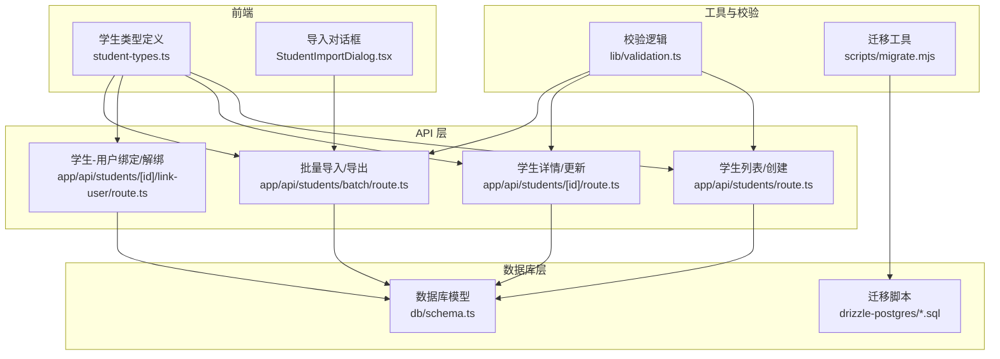
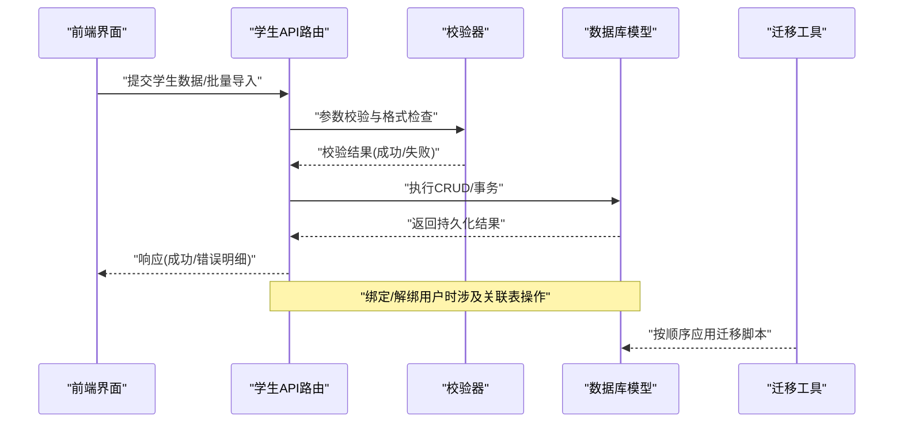
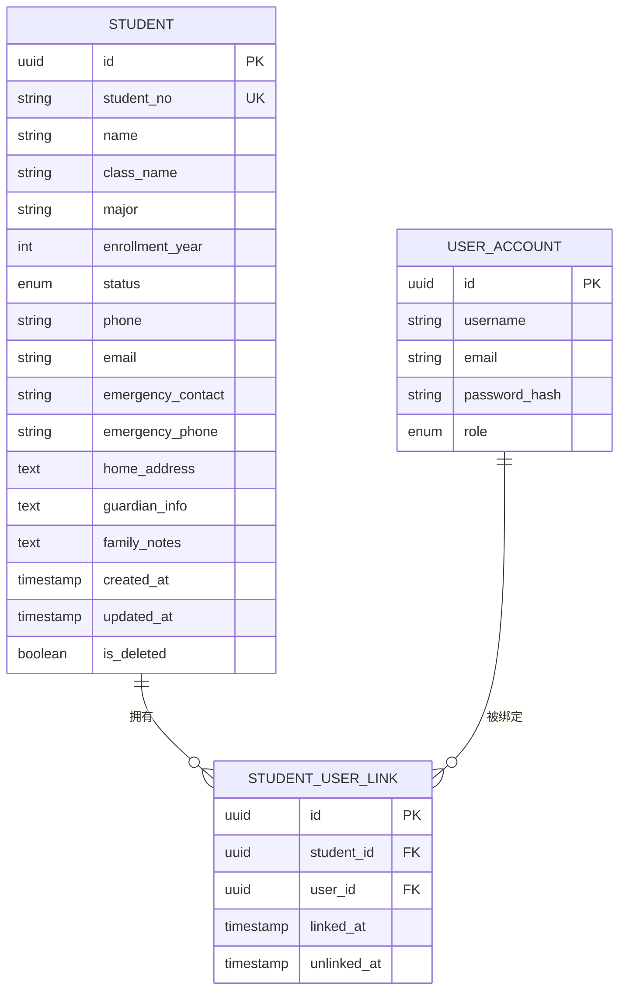
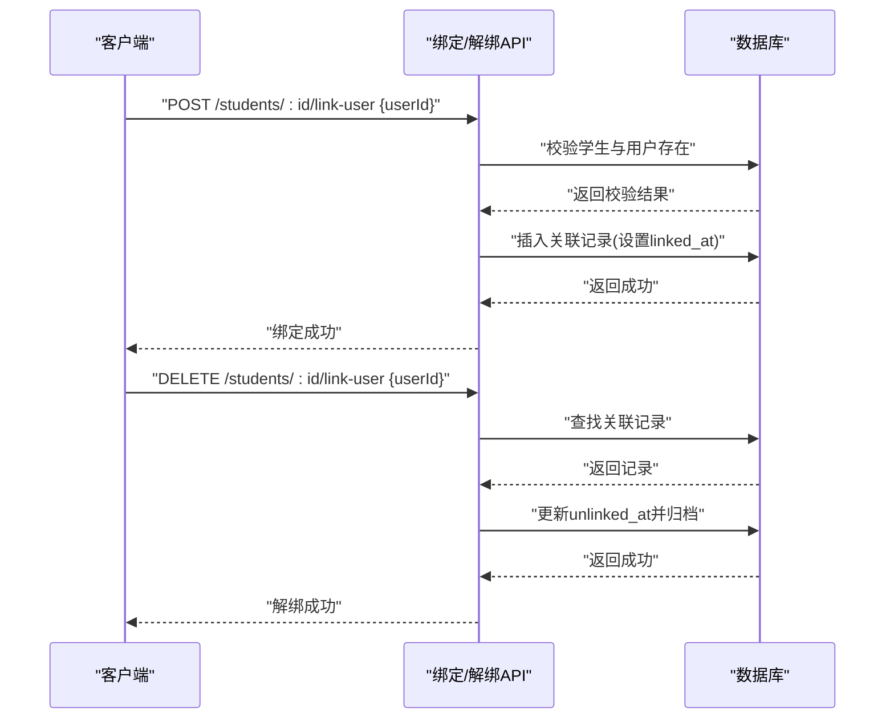
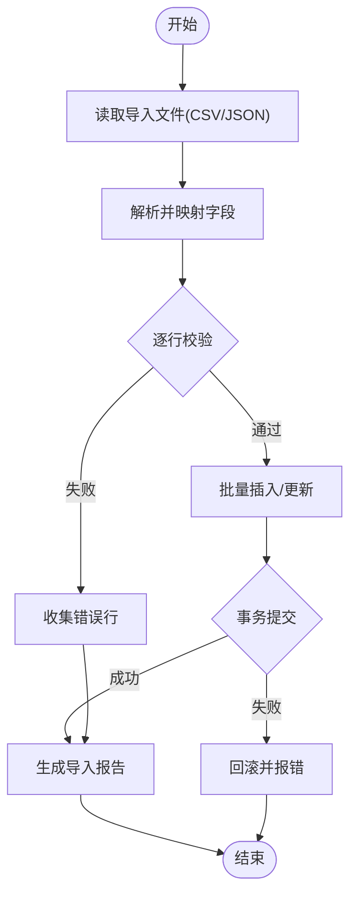
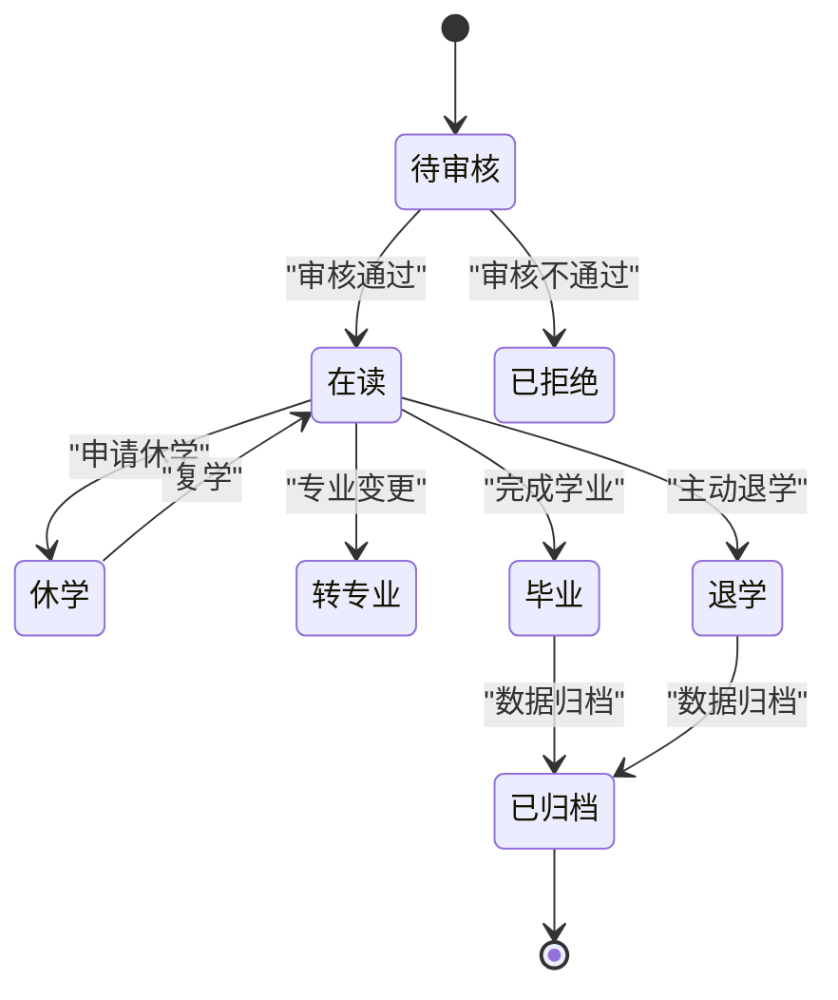
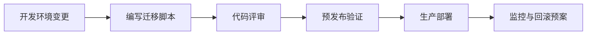
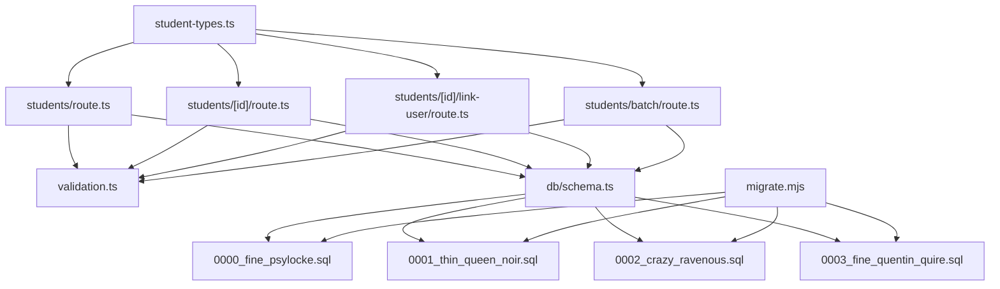

# 学生信息实体

<cite>
**本文引用的文件**   
- [db/schema.ts](file://db/schema.ts)
- [drizzle-postgres/0000_fine_psylocke.sql](file://drizzle-postgres/0000_fine_psylocke.sql)
- [drizzle-postgres/0001_thin_queen_noir.sql](file://drizzle-postgres/0001_thin_queen_noir.sql)
- [drizzle-postgres/0002_crazy_ravenous.sql](file://drizzle-postgres/0002_crazy_ravenous.sql)
- [drizzle-postgres/0003_fine_quentin_quire.sql](file://drizzle-postgres/0003_fine_quentin_quire.sql)
- [app/api/students/route.ts](file://app/api/students/route.ts)
- [app/api/students/[id]/route.ts](file://app/api/students/[id]/route.ts)
- [app/api/students/[id]/link-user/route.ts](file://app/api/students/[id]/link-user/route.ts)
- [app/api/students/batch/route.ts](file://app/api/students/batch/route.ts)
- [app/components/student/student-types.ts](file://app/components/student/student-types.ts)
- [app/components/student/StudentImportDialog.tsx](file://app/components/student/StudentImportDialog.tsx)
- [lib/validation.ts](file://lib/validation.ts)
- [scripts/migrate.mjs](file://scripts/migrate.mjs)
</cite>

## 目录
1. [简介](#简介)
2. [项目结构](#项目结构)
3. [核心组件](#核心组件)
4. [架构总览](#架构总览)
5. [详细组件分析](#详细组件分析)
6. [依赖关系分析](#依赖关系分析)
7. [性能考量](#性能考量)
8. [故障排查指南](#故障排查指南)
9. [结论](#结论)
10. [附录](#附录)

## 简介
本文件围绕“学生信息”数据实体，系统化梳理学生表的基础字段（学生ID、学号、姓名、班级、专业、入学年份等）、状态管理、联系方式与家庭背景字段设计；阐述学生与用户账户的绑定/解绑机制；给出批量导入导出模式与校验规则；并覆盖学生档案的全生命周期管理与数据迁移策略。文档面向技术与非技术读者，力求清晰易懂且可操作。

## 项目结构
与学生信息相关的代码主要分布在以下位置：
- 数据库模型与迁移脚本：db/schema.ts 与 drizzle-postgres/*.sql
- 学生相关 API：app/api/students/*
- 前端类型与导入对话框：app/components/student/*
- 通用校验库：lib/validation.ts
- 迁移工具：scripts/migrate.mjs

图表来源
- [db/schema.ts](file://db/schema.ts)
- [drizzle-postgres/0000_fine_psylocke.sql](file://drizzle-postgres/0000_fine_psylocke.sql)
- [drizzle-postgres/0001_thin_queen_noir.sql](file://drizzle-postgres/0001_thin_queen_noir.sql)
- [drizzle-postgres/0002_crazy_ravenous.sql](file://drizzle-postgres/0002_crazy_ravenous.sql)
- [drizzle-postgres/0003_fine_quentin_quire.sql](file://drizzle-postgres/0003_fine_quentin_quire.sql)
- [app/api/students/route.ts](file://app/api/students/route.ts)
- [app/api/students/[id]/route.ts](file://app/api/students/[id]/route.ts)
- [app/api/students/[id]/link-user/route.ts](file://app/api/students/[id]/link-user/route.ts)
- [app/api/students/batch/route.ts](file://app/api/students/batch/route.ts)
- [app/components/student/student-types.ts](file://app/components/student/student-types.ts)
- [app/components/student/StudentImportDialog.tsx](file://app/components/student/StudentImportDialog.tsx)
- [lib/validation.ts](file://lib/validation.ts)
- [scripts/migrate.mjs](file://scripts/migrate.mjs)

章节来源
- [db/schema.ts](file://db/schema.ts)
- [app/api/students/route.ts](file://app/api/students/route.ts)
- [app/api/students/[id]/route.ts](file://app/api/students/[id]/route.ts)
- [app/api/students/[id]/link-user/route.ts](file://app/api/students/[id]/link-user/route.ts)
- [app/api/students/batch/route.ts](file://app/api/students/batch/route.ts)
- [app/components/student/student-types.ts](file://app/components/student/student-types.ts)
- [app/components/student/StudentImportDialog.tsx](file://app/components/student/StudentImportDialog.tsx)
- [lib/validation.ts](file://lib/validation.ts)
- [scripts/migrate.mjs](file://scripts/migrate.mjs)

## 核心组件
- 学生数据模型与字段设计：涵盖基础信息、状态、联系方式、家庭背景、时间戳与审计字段。
- 学生-用户关联：通过独立关联表实现多对一或一对一绑定，支持绑定与解绑。
- 批量导入导出：基于 CSV/JSON 的批量处理，包含字段映射、去重、校验与错误报告。
- 校验与约束：统一在 lib/validation.ts 中集中管理，确保入库数据质量。
- 迁移与版本演进：通过 Drizzle 迁移脚本驱动数据库结构变更。

章节来源
- [db/schema.ts](file://db/schema.ts)
- [lib/validation.ts](file://lib/validation.ts)
- [drizzle-postgres/0000_fine_psylocke.sql](file://drizzle-postgres/0000_fine_psylocke.sql)
- [drizzle-postgres/0001_thin_queen_noir.sql](file://drizzle-postgres/0001_thin_queen_noir.sql)
- [drizzle-postgres/0002_crazy_ravenous.sql](file://drizzle-postgres/0002_crazy_ravenous.sql)
- [drizzle-postgres/0003_fine_quentin_quire.sql](file://drizzle-postgres/0003_fine_quentin_quire.sql)

## 架构总览
学生信息实体的整体交互流程如下：
- 前端通过 student-types.ts 定义的数据结构与表单/导入对话框发起请求。
- API 路由负责参数校验、权限控制、业务编排与事务处理。
- 数据访问层使用 db/schema.ts 定义的模型进行 CRUD 操作。
- 批量导入导出由 batch 路由协调，结合校验器与错误聚合返回结果。
- 迁移脚本保证数据库结构随需求演进保持一致性。

图表来源
- [app/api/students/route.ts](file://app/api/students/route.ts)
- [app/api/students/batch/route.ts](file://app/api/students/batch/route.ts)
- [lib/validation.ts](file://lib/validation.ts)
- [db/schema.ts](file://db/schema.ts)
- [scripts/migrate.mjs](file://scripts/migrate.mjs)

## 详细组件分析

### 学生数据模型与字段设计
- 基础信息字段
  - 学生ID：主键标识，唯一且不可变。
  - 学号：学校分配的唯一编号，建议唯一索引。
  - 姓名：显示名，支持模糊查询。
  - 班级：所属行政班或教学班。
  - 专业：所属专业名称或编码。
  - 入学年份：入学年度，便于统计与筛选。
- 状态管理字段
  - 学生状态：如在读、休学、退学、毕业等，配合状态机与审计日志。
- 联系方式字段
  - 手机号、邮箱、紧急联系人及电话等，需遵循隐私保护与脱敏展示。
- 家庭背景字段
  - 家庭住址、监护人信息、经济状况备注等，用于辅导员工作参考。
- 时间与审计字段
  - 创建时间、更新时间、删除标记（软删）等。

图表来源
- [db/schema.ts](file://db/schema.ts)
- [drizzle-postgres/0000_fine_psylocke.sql](file://drizzle-postgres/0000_fine_psylocke.sql)
- [drizzle-postgres/0001_thin_queen_noir.sql](file://drizzle-postgres/0001_thin_queen_noir.sql)
- [drizzle-postgres/0002_crazy_ravenous.sql](file://drizzle-postgres/0002_crazy_ravenous.sql)
- [drizzle-postgres/0003_fine_quentin_quire.sql](file://drizzle-postgres/0003_fine_quentin_quire.sql)

章节来源
- [db/schema.ts](file://db/schema.ts)
- [drizzle-postgres/0000_fine_psylocke.sql](file://drizzle-postgres/0000_fine_psylocke.sql)
- [drizzle-postgres/0001_thin_queen_noir.sql](file://drizzle-postgres/0001_thin_queen_noir.sql)
- [drizzle-postgres/0002_crazy_ravenous.sql](file://drizzle-postgres/0002_crazy_ravenous.sql)
- [drizzle-postgres/0003_fine_quentin_quire.sql](file://drizzle-postgres/0003_fine_quentin_quire.sql)

### 学生与用户账户的关联关系（绑定/解绑）
- 关联表设计：STUDENT_USER_LINK 记录学生与用户的绑定关系，包含绑定时间与解绑时间，支持历史追溯。
- 绑定机制：
  - 前置校验：学生存在、用户存在、未重复绑定。
  - 写入关联记录，设置 linked_at。
  - 可选：同步角色或权限至学生上下文。
- 解绑机制：
  - 前置校验：关联存在、未被其他主体占用（若为强绑定）。
  - 写入 unlinked_at，保留历史记录。
  - 清理临时权限或会话。

图表来源
- [app/api/students/[id]/link-user/route.ts](file://app/api/students/[id]/link-user/route.ts)
- [db/schema.ts](file://db/schema.ts)

章节来源
- [app/api/students/[id]/link-user/route.ts](file://app/api/students/[id]/link-user/route.ts)
- [db/schema.ts](file://db/schema.ts)

### 批量导入导出模式与验证规则
- 导入模式
  - 输入格式：CSV/JSON，字段映射到学生模型字段。
  - 去重策略：以学号为唯一键，冲突时选择跳过或覆盖。
  - 校验规则：必填项、格式（邮箱、手机号）、枚举值（状态）、范围（入学年份）。
  - 错误聚合：逐行错误收集，返回失败明细与成功计数。
- 导出模式
  - 输出格式：CSV/Excel，支持分页与过滤条件。
  - 敏感字段：手机号、邮箱按需脱敏或加密下载。
  - 性能优化：流式读取/写入，避免内存溢出。

图表来源
- [app/api/students/batch/route.ts](file://app/api/students/batch/route.ts)
- [lib/validation.ts](file://lib/validation.ts)

章节来源
- [app/api/students/batch/route.ts](file://app/api/students/batch/route.ts)
- [lib/validation.ts](file://lib/validation.ts)

### 学生档案生命周期管理
- 创建：新生注册或批量导入后进入“待审核”或“在读”状态。
- 审核：辅导员或管理员审核通过后状态变更为“在读”。
- 变更：转专业、调班、联系方式更新等触发更新与审计。
- 异动：休学、复学、退学、毕业等状态流转，记录原因与时间。
- 归档：毕业后数据归档，保留必要字段供统计与证明开具。
- 删除：软删除，支持恢复与审计追踪。

图表来源
- [db/schema.ts](file://db/schema.ts)
- [drizzle-postgres/0000_fine_psylocke.sql](file://drizzle-postgres/0000_fine_psylocke.sql)
- [drizzle-postgres/0001_thin_queen_noir.sql](file://drizzle-postgres/0001_thin_queen_noir.sql)
- [drizzle-postgres/0002_crazy_ravenous.sql](file://drizzle-postgres/0002_crazy_ravenous.sql)
- [drizzle-postgres/0003_fine_quentin_quire.sql](file://drizzle-postgres/0003_fine_quentin_quire.sql)

章节来源
- [db/schema.ts](file://db/schema.ts)
- [drizzle-postgres/0000_fine_psylocke.sql](file://drizzle-postgres/0000_fine_psylocke.sql)
- [drizzle-postgres/0001_thin_queen_noir.sql](file://drizzle-postgres/0001_thin_queen_noir.sql)
- [drizzle-postgres/0002_crazy_ravenous.sql](file://drizzle-postgres/0002_crazy_ravenous.sql)
- [drizzle-postgres/0003_fine_quentin_quire.sql](file://drizzle-postgres/0003_fine_quentin_quire.sql)

### 数据迁移策略
- 使用 Drizzle 迁移脚本逐步演进数据库结构，确保幂等与可回滚。
- 迁移顺序：先建表与索引，再添加约束与默认值，最后调整字段类型与长度。
- 数据兼容：新增字段提供默认值或迁移脚本填充历史数据。
- 回滚方案：保留反向迁移脚本，支持快速回滚。

图表来源
- [scripts/migrate.mjs](file://scripts/migrate.mjs)
- [drizzle-postgres/0000_fine_psylocke.sql](file://drizzle-postgres/0000_fine_psylocke.sql)
- [drizzle-postgres/0001_thin_queen_noir.sql](file://drizzle-postgres/0001_thin_queen_noir.sql)
- [drizzle-postgres/0002_crazy_ravenous.sql](file://drizzle-postgres/0002_crazy_ravenous.sql)
- [drizzle-postgres/0003_fine_quentin_quire.sql](file://drizzle-postgres/0003_fine_quentin_quire.sql)

章节来源
- [scripts/migrate.mjs](file://scripts/migrate.mjs)
- [drizzle-postgres/0000_fine_psylocke.sql](file://drizzle-postgres/0000_fine_psylocke.sql)
- [drizzle-postgres/0001_thin_queen_noir.sql](file://drizzle-postgres/0001_thin_queen_noir.sql)
- [drizzle-postgres/0002_crazy_ravenous.sql](file://drizzle-postgres/0002_crazy_ravenous.sql)
- [drizzle-postgres/0003_fine_quentin_quire.sql](file://drizzle-postgres/0003_fine_quentin_quire.sql)

## 依赖关系分析
- 前端类型依赖：student-types.ts 为各 API 调用提供数据结构契约。
- API 层依赖：students 路由依赖 validation.ts 进行参数校验，依赖 db/schema.ts 进行数据访问。
- 数据库层依赖：schema.ts 与迁移脚本共同维护表结构与约束。
- 工具依赖：migrate.mjs 驱动迁移脚本执行。

图表来源
- [app/components/student/student-types.ts](file://app/components/student/student-types.ts)
- [app/api/students/route.ts](file://app/api/students/route.ts)
- [app/api/students/[id]/route.ts](file://app/api/students/[id]/route.ts)
- [app/api/students/[id]/link-user/route.ts](file://app/api/students/[id]/link-user/route.ts)
- [app/api/students/batch/route.ts](file://app/api/students/batch/route.ts)
- [lib/validation.ts](file://lib/validation.ts)
- [db/schema.ts](file://db/schema.ts)
- [drizzle-postgres/0000_fine_psylocke.sql](file://drizzle-postgres/0000_fine_psylocke.sql)
- [drizzle-postgres/0001_thin_queen_noir.sql](file://drizzle-postgres/0001_thin_queen_noir.sql)
- [drizzle-postgres/0002_crazy_ravenous.sql](file://drizzle-postgres/0002_crazy_ravenous.sql)
- [drizzle-postgres/0003_fine_quentin_quire.sql](file://drizzle-postgres/0003_fine_quentin_quire.sql)
- [scripts/migrate.mjs](file://scripts/migrate.mjs)

章节来源
- [app/components/student/student-types.ts](file://app/components/student/student-types.ts)
- [app/api/students/route.ts](file://app/api/students/route.ts)
- [app/api/students/[id]/route.ts](file://app/api/students/[id]/route.ts)
- [app/api/students/[id]/link-user/route.ts](file://app/api/students/[id]/link-user/route.ts)
- [app/api/students/batch/route.ts](file://app/api/students/batch/route.ts)
- [lib/validation.ts](file://lib/validation.ts)
- [db/schema.ts](file://db/schema.ts)
- [scripts/migrate.mjs](file://scripts/migrate.mjs)

## 性能考量
- 批量导入：采用事务与分批提交，避免长事务锁表；对大文件使用流式处理。
- 索引策略：学号、姓名、专业、入学年份建立合适索引，提升查询效率。
- 导出优化：分页与异步任务，避免阻塞主线程；敏感字段按需脱敏减少计算开销。
- 缓存与限流：对高频查询引入缓存；对导入接口实施限流防止滥用。

[本节为通用指导，无需特定文件引用]

## 故障排查指南
- 常见错误
  - 学号重复：检查唯一约束与导入去重策略。
  - 状态非法：确认枚举值与校验规则。
  - 绑定失败：核对用户与学生是否存在且未被重复绑定。
- 定位步骤
  - 查看 API 返回的错误明细与日志。
  - 检查数据库约束与索引是否生效。
  - 审查迁移脚本是否完整执行。
- 修复建议
  - 修正输入数据格式与必填项。
  - 清理异常关联记录并重新绑定。
  - 回滚或补跑迁移脚本。

章节来源
- [lib/validation.ts](file://lib/validation.ts)
- [app/api/students/batch/route.ts](file://app/api/students/batch/route.ts)
- [app/api/students/[id]/link-user/route.ts](file://app/api/students/[id]/link-user/route.ts)

## 结论
学生信息实体围绕清晰的字段设计、严格的校验与稳健的迁移策略，支撑了从创建、审核、变更到归档的全生命周期管理。通过独立的绑定/解绑机制与批量导入导出能力，系统兼顾了灵活性与数据质量。建议在后续迭代中持续完善审计日志、权限控制与性能优化，以提升用户体验与系统稳定性。

[本节为总结性内容，无需特定文件引用]

## 附录
- 字段字典与示例：详见 student-types.ts 中的类型定义与导入对话框的字段映射。
- 校验规则清单：详见 lib/validation.ts 中的校验函数集合。
- 迁移清单：详见 drizzle-postgres/*.sql 与 scripts/migrate.mjs。

章节来源
- [app/components/student/student-types.ts](file://app/components/student/student-types.ts)
- [app/components/student/StudentImportDialog.tsx](file://app/components/student/StudentImportDialog.tsx)
- [lib/validation.ts](file://lib/validation.ts)
- [drizzle-postgres/0000_fine_psylocke.sql](file://drizzle-postgres/0000_fine_psylocke.sql)
- [drizzle-postgres/0001_thin_queen_noir.sql](file://drizzle-postgres/0001_thin_queen_noir.sql)
- [drizzle-postgres/0002_crazy_ravenous.sql](file://drizzle-postgres/0002_crazy_ravenous.sql)
- [drizzle-postgres/0003_fine_quentin_quire.sql](file://drizzle-postgres/0003_fine_quentin_quire.sql)
- [scripts/migrate.mjs](file://scripts/migrate.mjs)