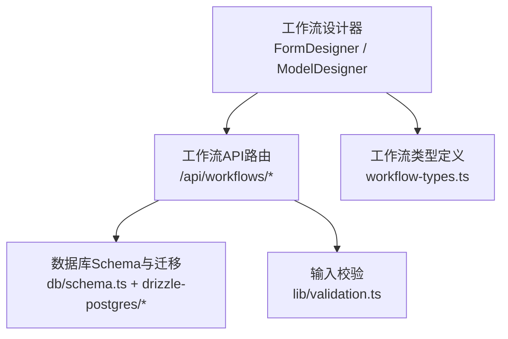
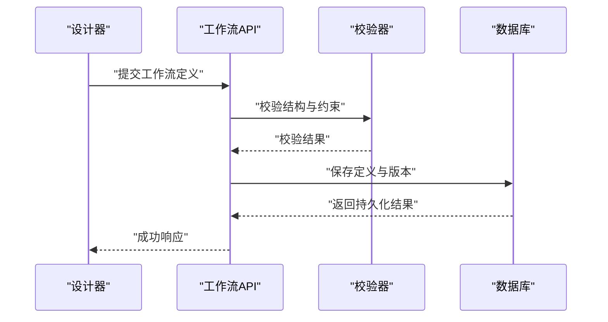
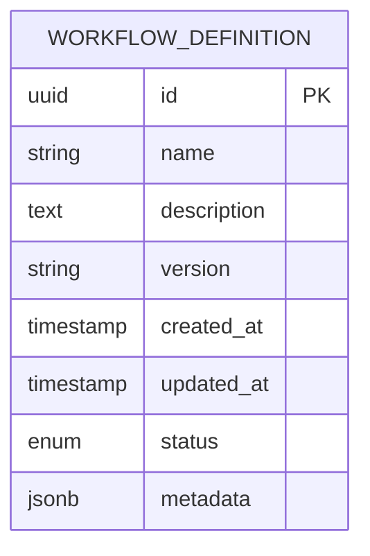
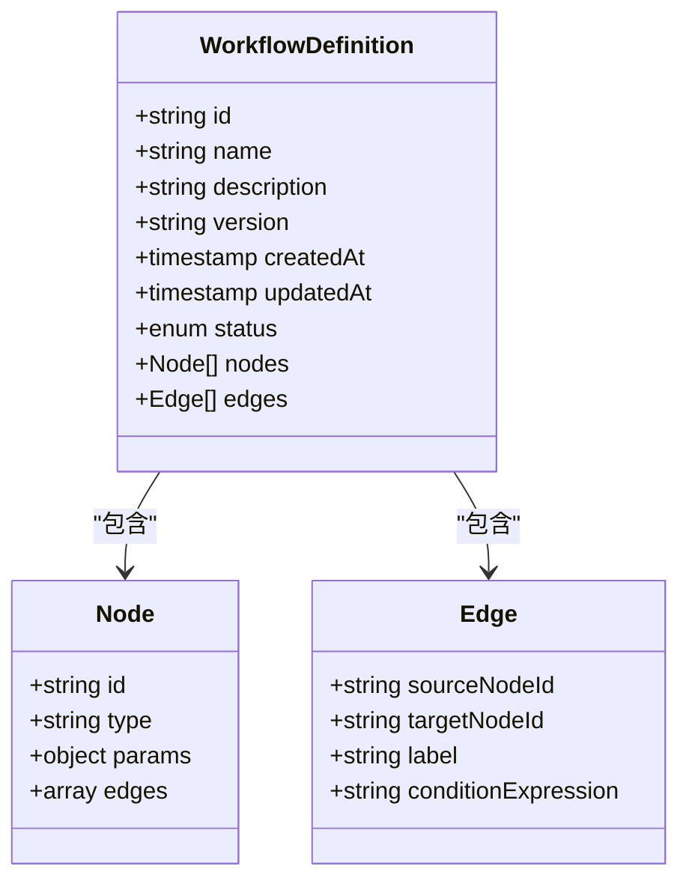
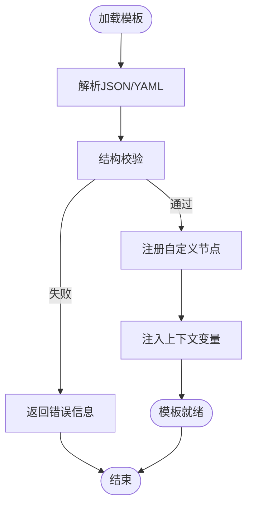
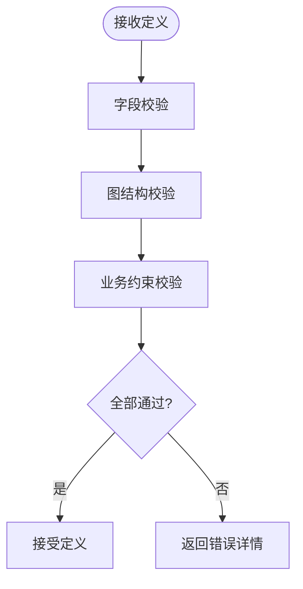
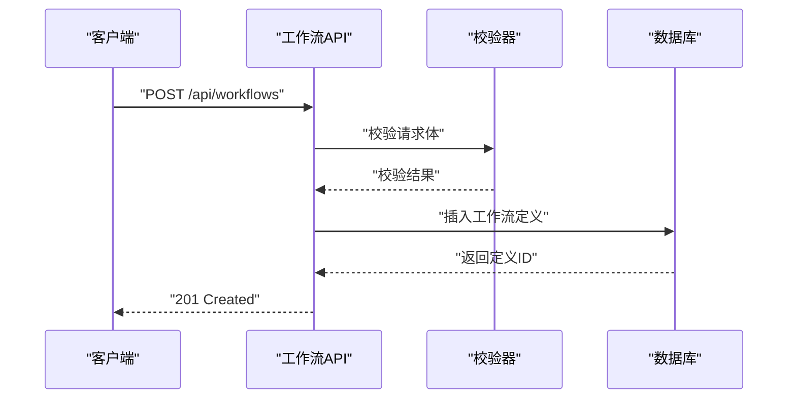
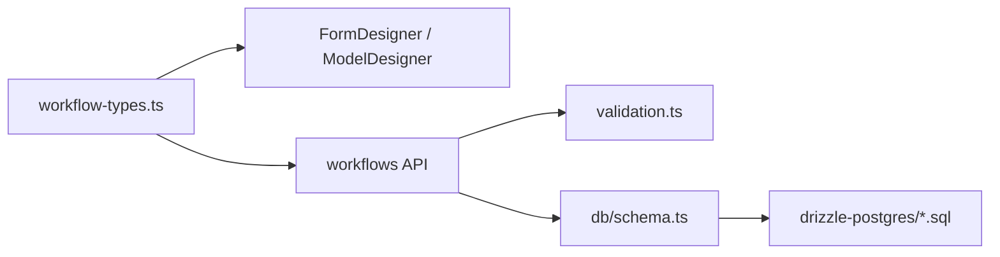

# 工作流定义模式

<cite>
**本文档引用的文件**   
- [workflow-types.ts](file://app/components/workflow/workflow-types.ts)
- [route.ts](file://app/api/workflows/route.ts)
- [route.ts](file://app/api/workflows/instances/route.ts)
- [route.ts](file://app/api/workflows/tasks/route.ts)
- [schema.ts](file://db/schema.ts)
- [index.ts](file://drizzle-postgres/meta/_journal.json)
- [0000_fine_psylocke.sql](file://drizzle-postgres/0000_fine_psylocke.sql)
- [0001_thin_queen_noir.sql](file://drizzle-postgres/0001_thin_queen_noir.sql)
- [0002_crazy_ravenous.sql](file://drizzle-postgres/0002_crazy_ravenous.sql)
- [0003_fine_quentin_quire.sql](file://drizzle-postgres/0003_fine_quentin_quire.sql)
- [WorkflowDesignModule.tsx](file://app/WorkflowDesignModule.tsx)
- [FormDesigner.tsx](file://app/components/workflow/FormDesigner.tsx)
- [ModelDesigner.tsx](file://app/components/workflow/ModelDesigner.tsx)
- [DeploymentPage.tsx](file://app/components/workflow/DeploymentPage.tsx)
- [WorkflowSettingsPage.tsx](file://app/components/workflow/WorkflowSettingsPage.tsx)
- [validation.ts](file://lib/validation.ts)
- [api.ts](file://lib/api.ts)
</cite>

## 目录
1. [简介](#简介)
2. [项目结构](#项目结构)
3. [核心组件](#核心组件)
4. [架构总览](#架构总览)
5. [详细组件分析](#详细组件分析)
6. [依赖关系分析](#依赖关系分析)
7. [性能考虑](#性能考虑)
8. [故障排查指南](#故障排查指南)
9. [结论](#结论)
10. [附录](#附录)

## 简介
本文件面向“工作流定义数据模式”的完整说明，覆盖工作流定义表的字段规范、节点配置数据结构、模板定义与扩展机制、验证规则与约束条件，并提供实际数据示例与最佳实践建议。文档基于仓库中的前端类型定义、API路由、数据库Schema与迁移脚本进行梳理，确保读者既能理解整体架构，也能落地到具体实现细节。

## 项目结构
与工作流定义相关的关键位置：
- 前端类型与UI设计器：app/components/workflow/*
- API路由：app/api/workflows/*
- 数据库Schema与迁移：db/schema.ts、drizzle-postgres/*
- 通用校验与API封装：lib/validation.ts、lib/api.ts
- 工作流设计入口：app/WorkflowDesignModule.tsx

图表来源
- [FormDesigner.tsx](file://app/components/workflow/FormDesigner.tsx)
- [ModelDesigner.tsx](file://app/components/workflow/ModelDesigner.tsx)
- [route.ts](file://app/api/workflows/route.ts)
- [schema.ts](file://db/schema.ts)
- [workflow-types.ts](file://app/components/workflow/workflow-types.ts)
- [validation.ts](file://lib/validation.ts)

章节来源
- [workflow-types.ts](file://app/components/workflow/workflow-types.ts)
- [route.ts](file://app/api/workflows/route.ts)
- [schema.ts](file://db/schema.ts)

## 核心组件
- 工作流定义表（元数据）
  - 流程ID：唯一标识符，用于实例化与追踪
  - 名称：可读的工作流名称
  - 描述：工作流用途与说明
  - 版本控制：语义化版本号或迭代号，支持多版本并存
  - 创建时间/更新时间：审计字段，记录生命周期变更
  - 状态：草稿、已发布、已归档等
  - 其他扩展字段：标签、负责人、环境等

- 工作流节点配置
  - 节点类型：如开始、结束、任务、条件分支、并行网关、子流程等
  - 执行参数：节点运行所需的输入输出映射、超时、重试策略等
  - 条件分支：表达式或规则引擎驱动的路由判断
  - 连接边：上游节点与下游节点的拓扑关系

- 工作流模板
  - 模板格式：以JSON/YAML描述的图结构，包含节点集合与边集合
  - 扩展机制：通过自定义节点类型、插件钩子、变量注入点扩展能力

- 验证规则与约束
  - 必填字段校验、类型校验、范围校验
  - 图结构约束：无环、连通性、入度出度限制
  - 权限与命名冲突检查

章节来源
- [workflow-types.ts](file://app/components/workflow/workflow-types.ts)
- [validation.ts](file://lib/validation.ts)

## 架构总览
工作流定义从设计器生成，经API路由持久化至数据库；运行时通过实例与任务路由驱动执行。

图表来源
- [route.ts](file://app/api/workflows/route.ts)
- [validation.ts](file://lib/validation.ts)
- [schema.ts](file://db/schema.ts)

## 详细组件分析

### 工作流定义表字段规范
- 流程ID：主键或唯一索引，建议使用UUID或自增整数
- 名称：非空，长度限制，避免特殊字符
- 描述：可选，富文本或纯文本
- 版本控制：语义化版本（主.次.修订），禁止重复版本
- 创建时间/更新时间：自动维护的时间戳
- 状态：枚举值，限制为受控状态集
- 扩展字段：JSONB或扩展表，便于灵活演进

图表来源
- [schema.ts](file://db/schema.ts)
- [0000_fine_psylocke.sql](file://drizzle-postgres/0000_fine_psylocke.sql)
- [0001_thin_queen_noir.sql](file://drizzle-postgres/0001_thin_queen_noir.sql)
- [0002_crazy_ravenous.sql](file://drizzle-postgres/0002_crazy_ravenous.sql)
- [0003_fine_quentin_quire.sql](file://drizzle-postgres/0003_fine_quentin_quire.sql)

章节来源
- [schema.ts](file://db/schema.ts)
- [0000_fine_psylocke.sql](file://drizzle-postgres/0000_fine_psylocke.sql)
- [0001_thin_queen_noir.sql](file://drizzle-postgres/0001_thin_queen_noir.sql)
- [0002_crazy_ravenous.sql](file://drizzle-postgres/0002_crazy_ravenous.sql)
- [0003_fine_quentin_quire.sql](file://drizzle-postgres/0003_fine_quentin_quire.sql)

### 工作流节点配置的数据结构
- 节点类型：字符串枚举，如 start、end、task、condition、parallel_gateway、subprocess
- 执行参数：对象结构，包含输入映射、输出映射、超时、重试次数、错误处理策略
- 条件分支：表达式或规则列表，决定流向
- 连接边：sourceNodeId、targetNodeId、label、conditionExpression

图表来源
- [workflow-types.ts](file://app/components/workflow/workflow-types.ts)

章节来源
- [workflow-types.ts](file://app/components/workflow/workflow-types.ts)

### 工作流模板的定义格式与扩展机制
- 模板格式：JSON/YAML，包含nodes数组与edges数组，以及全局变量与上下文
- 扩展机制：
  - 自定义节点类型注册
  - 插件钩子：before/after执行、错误回调
  - 变量注入：运行时上下文注入，支持函数调用与表达式求值

图表来源
- [FormDesigner.tsx](file://app/components/workflow/FormDesigner.tsx)
- [ModelDesigner.tsx](file://app/components/workflow/ModelDesigner.tsx)

章节来源
- [FormDesigner.tsx](file://app/components/workflow/FormDesigner.tsx)
- [ModelDesigner.tsx](file://app/components/workflow/ModelDesigner.tsx)

### 验证规则与约束条件
- 字段级校验：必填、类型、长度、格式
- 图结构约束：
  - 无环检测
  - 连通性检查
  - 入度/出度限制
  - 条件表达式语法校验
- 业务约束：
  - 版本唯一性
  - 状态流转合法性
  - 命名冲突检查

图表来源
- [validation.ts](file://lib/validation.ts)

章节来源
- [validation.ts](file://lib/validation.ts)

### API接口与数据流
- 工作流定义CRUD：/api/workflows
- 工作流实例管理：/api/workflows/instances
- 任务调度与执行：/api/workflows/tasks

图表来源
- [route.ts](file://app/api/workflows/route.ts)
- [validation.ts](file://lib/validation.ts)
- [schema.ts](file://db/schema.ts)

章节来源
- [route.ts](file://app/api/workflows/route.ts)
- [route.ts](file://app/api/workflows/instances/route.ts)
- [route.ts](file://app/api/workflows/tasks/route.ts)

## 依赖关系分析
- 前端类型定义被设计器与API层共同引用
- API路由依赖校验模块与数据库Schema
- 数据库迁移脚本确保Schema演进一致性

图表来源
- [workflow-types.ts](file://app/components/workflow/workflow-types.ts)
- [FormDesigner.tsx](file://app/components/workflow/FormDesigner.tsx)
- [ModelDesigner.tsx](file://app/components/workflow/ModelDesigner.tsx)
- [route.ts](file://app/api/workflows/route.ts)
- [validation.ts](file://lib/validation.ts)
- [schema.ts](file://db/schema.ts)
- [_journal.json](file://drizzle-postgres/meta/_journal.json)

章节来源
- [workflow-types.ts](file://app/components/workflow/workflow-types.ts)
- [route.ts](file://app/api/workflows/route.ts)
- [schema.ts](file://db/schema.ts)
- [_journal.json](file://drizzle-postgres/meta/_journal.json)

## 性能考虑
- 大定义存储：使用压缩或分片存储，避免单行过大
- 查询优化：为常用过滤字段建立索引（名称、状态、版本）
- 缓存策略：对只读模板与定义进行缓存
- 并发控制：版本更新时使用乐观锁防止覆盖

[本节为通用指导，不直接分析具体文件]

## 故障排查指南
- 常见错误：
  - 字段缺失或类型错误：检查请求体与校验规则
  - 图结构非法：检查环路与连通性
  - 版本冲突：检查版本唯一性与状态流转
- 调试步骤：
  - 启用详细日志
  - 回放请求体与响应体
  - 检查数据库约束与索引

章节来源
- [validation.ts](file://lib/validation.ts)
- [route.ts](file://app/api/workflows/route.ts)

## 结论
工作流定义模式围绕清晰的元数据字段、灵活的节点配置、严格的验证规则与可扩展的模板机制构建。通过前后端协作与数据库迁移保障一致性，可实现稳定可靠的工作流设计与执行。

[本节为总结，不直接分析具体文件]

## 附录
- 实际数据示例（概念性）：
  - 工作流定义：包含id、name、description、version、createdAt、updatedAt、status、nodes、edges
  - 节点配置：type、params、edges
  - 模板格式：JSON结构的nodes与edges数组
- 最佳实践建议：
  - 使用语义化版本管理
  - 保持节点类型与参数向后兼容
  - 在测试环境充分验证图结构
  - 定期归档旧版本定义

[本节为补充信息，不直接分析具体文件]