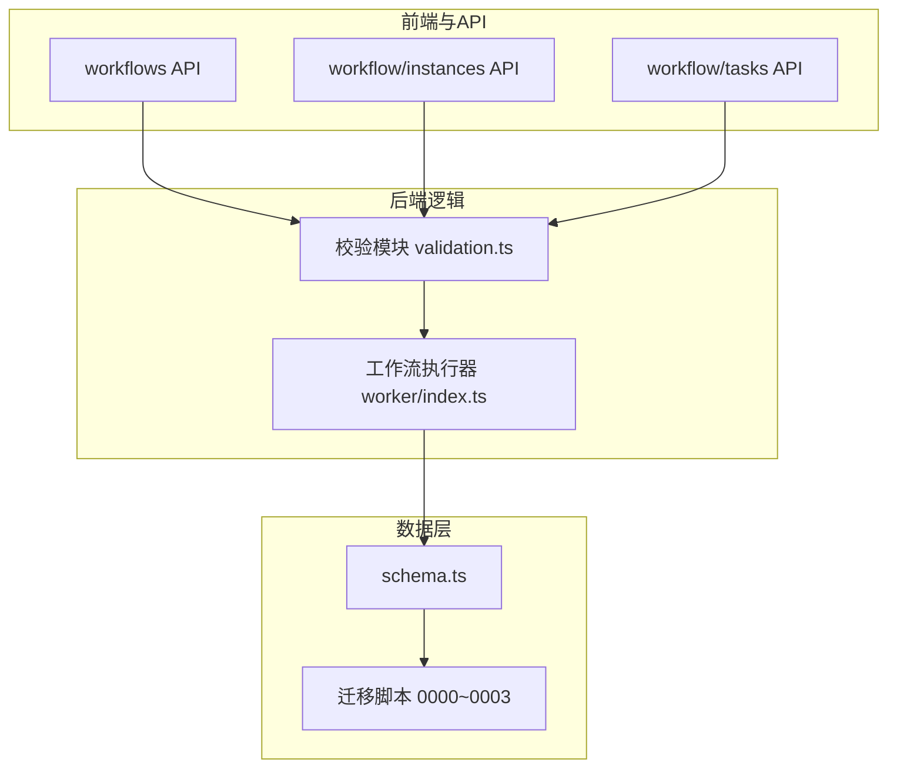
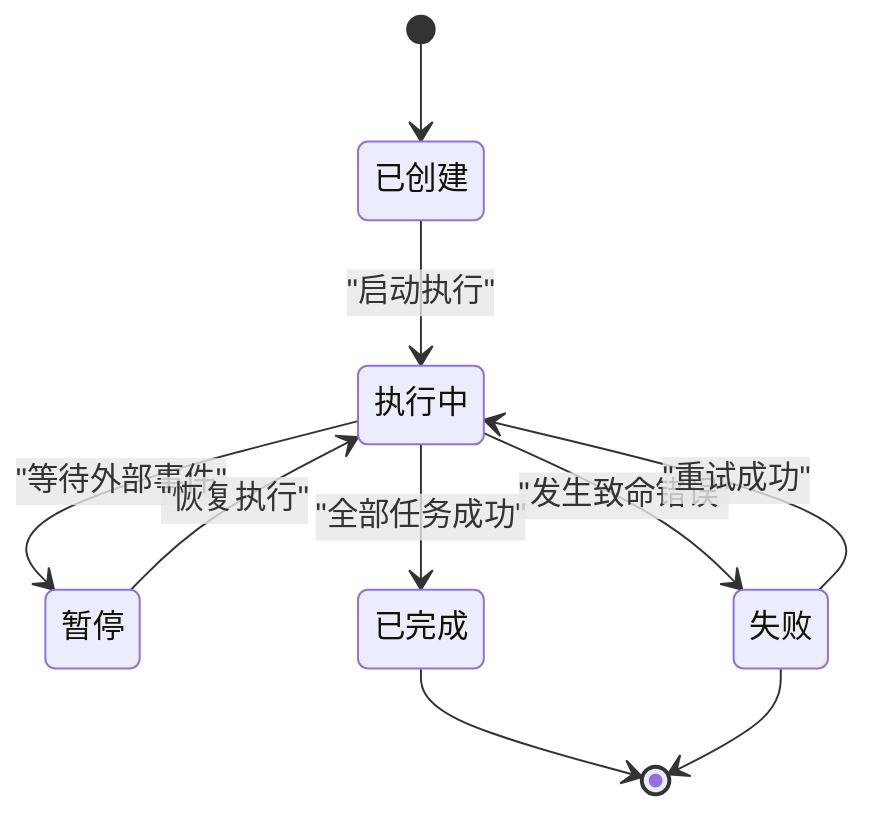
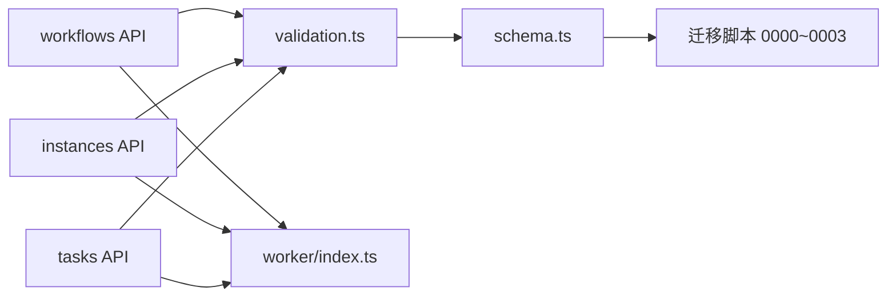

# 工作流实体

<cite>
**本文档引用的文件**   
- [db/schema.ts](file://db/schema.ts)
- [drizzle-postgres/meta/0000_snapshot.json](file://drizzle-postgres/meta/0000_snapshot.json)
- [drizzle-postgres/meta/0001_snapshot.json](file://drizzle-postgres/meta/0001_snapshot.json)
- [drizzle-postgres/meta/0002_snapshot.json](file://drizzle-postgres/meta/0002_snapshot.json)
- [drizzle-postgres/meta/0003_snapshot.json](file://drizzle-postgres/meta/0003_snapshot.json)
- [drizzle-postgres/0000_fine_psylocke.sql](file://drizzle-postgres/0000_fine_psylocke.sql)
- [drizzle-postgres/0001_thin_queen_noir.sql](file://drizzle-postgres/0001_thin_queen_noir.sql)
- [drizzle-postgres/0002_crazy_ravenous.sql](file://drizzle-postgres/0002_crazy_ravenous.sql)
- [drizzle-postgres/0003_fine_quentin_quire.sql](file://drizzle-postgres/0003_fine_quentin_quire.sql)
- [app/api/workflows/route.ts](file://app/api/workflows/route.ts)
- [app/api/workflow/instances/route.ts](file://app/api/workflow/instances/route.ts)
- [app/api/workflow/instances/[id]/route.ts](file://app/api/workflow/instances/[id]/route.ts)
- [app/api/workflow/tasks/route.ts](file://app/api/workflow/tasks/route.ts)
- [lib/validation.ts](file://lib/validation.ts)
- [worker/index.ts](file://worker/index.ts)
</cite>

## 目录
1. [简介](#简介)
2. [项目结构](#项目结构)
3. [核心组件](#核心组件)
4. [架构总览](#架构总览)
5. [详细组件分析](#详细组件分析)
6. [依赖关系分析](#依赖关系分析)
7. [性能考虑](#性能考虑)
8. [故障排查指南](#故障排查指南)
9. [结论](#结论)
10. [附录](#附录)

## 简介
本文件围绕工作流引擎的数据实体进行系统化文档化，覆盖以下方面：
- 工作流定义表的元数据字段（流程ID、名称、描述、版本控制等）
- 工作流节点配置与条件分支设置、执行参数的数据结构
- 工作流实例的状态管理（创建、执行、暂停、完成等状态转换）
- 工作流模板的定义格式与扩展机制
- 工作流执行的审计日志与错误处理记录

该文档面向开发者与运维人员，既提供高层架构概览，也深入到数据库表结构与API交互细节，帮助读者快速理解并正确使用工作流相关的数据模型。

## 项目结构
工作流相关代码主要分布在以下位置：
- 数据库模式与迁移脚本：db/schema.ts 与 drizzle-postgres 下的 schema 快照与 SQL 迁移
- API 路由：app/api/workflows、app/api/workflow/instances、app/api/workflow/tasks
- 校验与工具：lib/validation.ts
- 后台任务执行：worker/index.ts



图表来源 
- [db/schema.ts](file://db/schema.ts)
- [drizzle-postgres/0000_fine_psylocke.sql](file://drizzle-postgres/0000_fine_psylocke.sql)
- [drizzle-postgres/0001_thin_queen_noir.sql](file://drizzle-postgres/0001_thin_queen_noir.sql)
- [drizzle-postgres/0002_crazy_ravenous.sql](file://drizzle-postgres/0002_crazy_ravenous.sql)
- [drizzle-postgres/0003_fine_quentin_quire.sql](file://drizzle-postgres/0003_fine_quentin_quire.sql)
- [app/api/workflows/route.ts](file://app/api/workflows/route.ts)
- [app/api/workflow/instances/route.ts](file://app/api/workflow/instances/route.ts)
- [app/api/workflow/tasks/route.ts](file://app/api/workflow/tasks/route.ts)
- [lib/validation.ts](file://lib/validation.ts)
- [worker/index.ts](file://worker/index.ts)

章节来源
- [db/schema.ts](file://db/schema.ts)
- [drizzle-postgres/meta/0000_snapshot.json](file://drizzle-postgres/meta/0000_snapshot.json)
- [drizzle-postgres/meta/0001_snapshot.json](file://drizzle-postgres/meta/0001_snapshot.json)
- [drizzle-postgres/meta/0002_snapshot.json](file://drizzle-postgres/meta/0002_snapshot.json)
- [drizzle-postgres/meta/0003_snapshot.json](file://drizzle-postgres/meta/0003_snapshot.json)

## 核心组件
- 工作流定义（Workflow Definition）
  - 用于描述一个可重复使用的工作流蓝图，包含流程ID、名称、描述、版本等元数据
  - 支持多版本共存，便于灰度发布与回滚
- 工作流实例（Workflow Instance）
  - 一次具体运行的工作流，承载运行时上下文、输入参数、当前状态、进度与结果
- 工作流任务（Workflow Task）
  - 工作流执行过程中的最小执行单元，如节点执行、条件判断、外部调用等
- 审计日志（Audit Log）
  - 记录关键操作与执行轨迹，包括创建、变更、执行、失败与恢复事件
- 错误记录（Error Record）
  - 捕获并持久化执行期异常信息，便于定位与修复

章节来源
- [db/schema.ts](file://db/schema.ts)
- [drizzle-postgres/0000_fine_psylocke.sql](file://drizzle-postgres/0000_fine_psylocke.sql)
- [drizzle-postgres/0001_thin_queen_noir.sql](file://drizzle-postgres/0001_thin_queen_noir.sql)
- [drizzle-postgres/0002_crazy_ravenous.sql](file://drizzle-postgres/0002_crazy_ravenous.sql)
- [drizzle-postgres/0003_fine_quentin_quire.sql](file://drizzle-postgres/0003_fine_quentin_quire.sql)

## 架构总览
工作流引擎采用“定义-实例-任务”的三层数据模型，配合API路由与后台执行器，形成完整的生命周期管理能力。

```mermaid
classDiagram
class WorkflowDefinition {
+string id
+string name
+string description
+string version
+jsonb config
+timestamp created_at
+timestamp updated_at
}
class WorkflowInstance {
+string id
+string workflow_id
+string status
+jsonb input_params
+jsonb output_result
+timestamp started_at
+timestamp finished_at
}
class WorkflowTask {
+string id
+string instance_id
+string node_id
+string type
+jsonb params
+string status
+jsonb error_info
+timestamp created_at
+timestamp updated_at
}
class AuditLog {
+string id
+string entity_type
+string entity_id
+string action
+jsonb detail
+timestamp created_at
}
class ErrorRecord {
+string id
+string instance_id
+string task_id
+string code
+string message
+jsonb stack_trace
+timestamp created_at
}
WorkflowDefinition ||--o{ WorkflowInstance : "被实例化"
WorkflowInstance ||--o{ WorkflowTask : "包含多个任务"
WorkflowInstance ||--o{ AuditLog : "产生审计日志"
WorkflowInstance ||--o{ ErrorRecord : "产生错误记录"
```

图表来源 
- [db/schema.ts](file://db/schema.ts)
- [drizzle-postgres/0000_fine_psylocke.sql](file://drizzle-postgres/0000_fine_psylocke.sql)
- [drizzle-postgres/0001_thin_queen_noir.sql](file://drizzle-postgres/0001_thin_queen_noir.sql)
- [drizzle-postgres/0002_crazy_ravenous.sql](file://drizzle-postgres/0002_crazy_ravenous.sql)
- [drizzle-postgres/0003_fine_quentin_quire.sql](file://drizzle-postgres/0003_fine_quentin_quire.sql)

## 详细组件分析

### 工作流定义（Workflow Definition）
- 元数据字段
  - 流程ID：唯一标识工作流定义，通常由系统生成或业务约定
  - 名称：可读性强的标题，便于管理与检索
  - 描述：详细说明工作流的用途与约束
  - 版本：语义化版本号，支持同ID多版本并存
  - 配置：JSON结构，存储节点配置、条件分支、执行参数等
- 设计要点
  - 版本隔离：通过版本字段实现向后兼容与灰度切换
  - 配置可扩展：使用JSONB存储灵活的结构，便于扩展新节点类型与参数

章节来源
- [db/schema.ts](file://db/schema.ts)
- [drizzle-postgres/0000_fine_psylocke.sql](file://drizzle-postgres/0000_fine_psylocke.sql)
- [drizzle-postgres/0001_thin_queen_noir.sql](file://drizzle-postgres/0001_thin_queen_noir.sql)
- [drizzle-postgres/0002_crazy_ravenous.sql](file://drizzle-postgres/0002_crazy_ravenous.sql)
- [drizzle-postgres/0003_fine_quentin_quire.sql](file://drizzle-postgres/0003_fine_quentin_quire.sql)

### 工作流实例（Workflow Instance）
- 状态管理
  - 创建：初始化实例，绑定工作流定义与输入参数
  - 执行：调度任务队列，逐步推进状态
  - 暂停：因外部依赖或人工审批而挂起
  - 完成：所有任务成功结束，输出结果
  - 失败：出现不可恢复错误，进入失败态并可重试
- 数据字段
  - 实例ID：唯一标识一次运行
  - 工作流ID：关联的定义ID
  - 状态：枚举值，表示当前生命周期阶段
  - 输入/输出：JSON结构，承载运行时数据
  - 时间戳：开始与结束时间，便于追踪耗时



图表来源 
- [app/api/workflow/instances/route.ts](file://app/api/workflow/instances/route.ts)
- [app/api/workflow/instances/[id]/route.ts](file://app/api/workflow/instances/[id]/route.ts)
- [worker/index.ts](file://worker/index.ts)

章节来源
- [app/api/workflow/instances/route.ts](file://app/api/workflow/instances/route.ts)
- [app/api/workflow/instances/[id]/route.ts](file://app/api/workflow/instances/[id]/route.ts)
- [worker/index.ts](file://worker/index.ts)

### 工作流任务（Workflow Task）
- 任务类型
  - 节点执行：对应工作流图中的节点动作
  - 条件分支：根据表达式决定后续路径
  - 外部调用：HTTP请求、消息队列等
- 数据结构
  - 任务ID：唯一标识
  - 实例ID：所属实例
  - 节点ID：对应定义的节点
  - 类型：任务类别
  - 参数：执行所需参数
  - 状态：待执行、执行中、成功、失败
  - 错误信息：失败时的诊断数据

章节来源
- [db/schema.ts](file://db/schema.ts)
- [drizzle-postgres/0000_fine_psylocke.sql](file://drizzle-postgres/0000_fine_psylocke.sql)
- [drizzle-postgres/0001_thin_queen_noir.sql](file://drizzle-postgres/0001_thin_queen_noir.sql)
- [drizzle-postgres/0002_crazy_ravenous.sql](file://drizzle-postgres/0002_crazy_ravenous.sql)
- [drizzle-postgres/0003_fine_quentin_quire.sql](file://drizzle-postgres/0003_fine_quentin_quire.sql)
- [app/api/workflow/tasks/route.ts](file://app/api/workflow/tasks/route.ts)

### 审计日志（Audit Log）
- 记录范围
  - 工作流定义的创建、更新、删除
  - 实例的生命周期事件（创建、启动、暂停、恢复、完成、失败）
  - 任务的关键状态变更
- 字段说明
  - 实体类型与ID：关联的业务对象
  - 动作：操作类型（create/update/delete/start/pause/resume/complete/fail）
  - 详情：结构化变更记录或上下文快照
  - 时间戳：事件发生时间

章节来源
- [db/schema.ts](file://db/schema.ts)
- [drizzle-postgres/0000_fine_psylocke.sql](file://drizzle-postgres/0000_fine_psylocke.sql)
- [drizzle-postgres/0001_thin_queen_noir.sql](file://drizzle-postgres/0001_thin_queen_noir.sql)
- [drizzle-postgres/0002_crazy_ravenous.sql](file://drizzle-postgres/0002_crazy_ravenous.sql)
- [drizzle-postgres/0003_fine_quentin_quire.sql](file://drizzle-postgres/0003_fine_quentin_quire.sql)

### 错误记录（Error Record）
- 触发场景
  - 任务执行异常（网络超时、权限不足、数据校验失败）
  - 实例级致命错误（定义缺失、参数不合法）
- 字段说明
  - 实例ID与任务ID：定位问题上下文
  - 错误码与信息：标准化错误分类与人类可读描述
  - 堆栈跟踪：调试所需的调用栈信息
  - 时间戳：错误发生时间

章节来源
- [db/schema.ts](file://db/schema.ts)
- [drizzle-postgres/0000_fine_psylocke.sql](file://drizzle-postgres/0000_fine_psylocke.sql)
- [drizzle-postgres/0001_thin_queen_noir.sql](file://drizzle-postgres/0001_thin_queen_noir.sql)
- [drizzle-postgres/0002_crazy_ravenous.sql](file://drizzle-postgres/0002_crazy_ravenous.sql)
- [drizzle-postgres/0003_fine_quentin_quire.sql](file://drizzle-postgres/0003_fine_quentin_quire.sql)

### 工作流模板与扩展机制
- 模板定义格式
  - 节点集合：定义可用节点类型及其默认参数
  - 条件表达式：支持布尔表达式与变量引用
  - 执行参数：输入校验规则、默认值、必填项
- 扩展机制
  - 插件式节点：通过注册新的节点处理器扩展能力
  - 动态参数：运行时注入环境变量或上下文数据
  - 版本兼容：新版本模板需声明兼容旧版本的字段映射

章节来源
- [db/schema.ts](file://db/schema.ts)
- [drizzle-postgres/0000_fine_psylocke.sql](file://drizzle-postgres/0000_fine_psylocke.sql)
- [drizzle-postgres/0001_thin_queen_noir.sql](file://drizzle-postgres/0001_thin_queen_noir.sql)
- [drizzle-postgres/0002_crazy_ravenous.sql](file://drizzle-postgres/0002_crazy_ravenous.sql)
- [drizzle-postgres/0003_fine_quentin_quire.sql](file://drizzle-postgres/0003_fine_quentin_quire.sql)

## 依赖关系分析
工作流API与数据层之间的依赖关系如下：



图表来源 
- [app/api/workflows/route.ts](file://app/api/workflows/route.ts)
- [app/api/workflow/instances/route.ts](file://app/api/workflow/instances/route.ts)
- [app/api/workflow/tasks/route.ts](file://app/api/workflow/tasks/route.ts)
- [lib/validation.ts](file://lib/validation.ts)
- [db/schema.ts](file://db/schema.ts)
- [drizzle-postgres/0000_fine_psylocke.sql](file://drizzle-postgres/0000_fine_psylocke.sql)
- [drizzle-postgres/0001_thin_queen_noir.sql](file://drizzle-postgres/0001_thin_queen_noir.sql)
- [drizzle-postgres/0002_crazy_ravenous.sql](file://drizzle-postgres/0002_crazy_ravenous.sql)
- [drizzle-postgres/0003_fine_quentin_quire.sql](file://drizzle-postgres/0003_fine_quentin_quire.sql)
- [worker/index.ts](file://worker/index.ts)

章节来源
- [app/api/workflows/route.ts](file://app/api/workflows/route.ts)
- [app/api/workflow/instances/route.ts](file://app/api/workflow/instances/route.ts)
- [app/api/workflow/tasks/route.ts](file://app/api/workflow/tasks/route.ts)
- [lib/validation.ts](file://lib/validation.ts)
- [db/schema.ts](file://db/schema.ts)
- [worker/index.ts](file://worker/index.ts)

## 性能考虑
- 索引策略
  - 为工作流实例的workflow_id、status字段建立索引，加速查询与筛选
  - 为任务表的instance_id、node_id建立复合索引，提升任务定位效率
- 批量操作
  - 对大规模任务调度采用批处理与分页拉取，避免内存峰值
- 异步执行
  - 使用后台任务队列解耦API响应与执行过程，提高吞吐
- 缓存策略
  - 对工作流定义与模板进行短期缓存，减少重复解析开销

[本节为通用指导，无需特定文件来源]

## 故障排查指南
- 常见问题
  - 实例无法启动：检查工作流定义是否存在且版本匹配
  - 任务执行失败：查看错误记录中的错误码与堆栈信息
  - 状态不一致：核对审计日志中的状态变更顺序
- 排查步骤
  - 通过实例ID检索审计日志，确认关键事件
  - 根据任务ID定位错误记录，分析失败原因
  - 验证输入参数是否符合校验规则
- 恢复建议
  - 修正定义或参数后重新提交实例
  - 对临时性错误启用自动重试策略

章节来源
- [lib/validation.ts](file://lib/validation.ts)
- [worker/index.ts](file://worker/index.ts)

## 结论
本文件系统化梳理了工作流引擎的核心数据实体与交互流程，涵盖定义、实例、任务、审计与错误记录等关键组件。通过清晰的字段说明、状态机与依赖关系图，帮助读者快速掌握工作流数据的结构与行为。建议在实施过程中结合索引优化与异步执行策略，确保系统的稳定性与可扩展性。

[本节为总结性内容，无需特定文件来源]

## 附录
- 术语表
  - 工作流定义：描述可复用流程蓝图的元数据与配置
  - 工作流实例：一次具体运行的工作流，携带运行时上下文
  - 工作流任务：执行过程中的最小单位，如节点动作或条件判断
  - 审计日志：记录关键操作的轨迹与变更详情
  - 错误记录：捕获并保存执行期异常信息

[本节为概念性内容，无需特定文件来源]