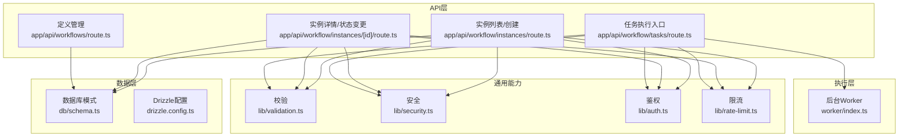
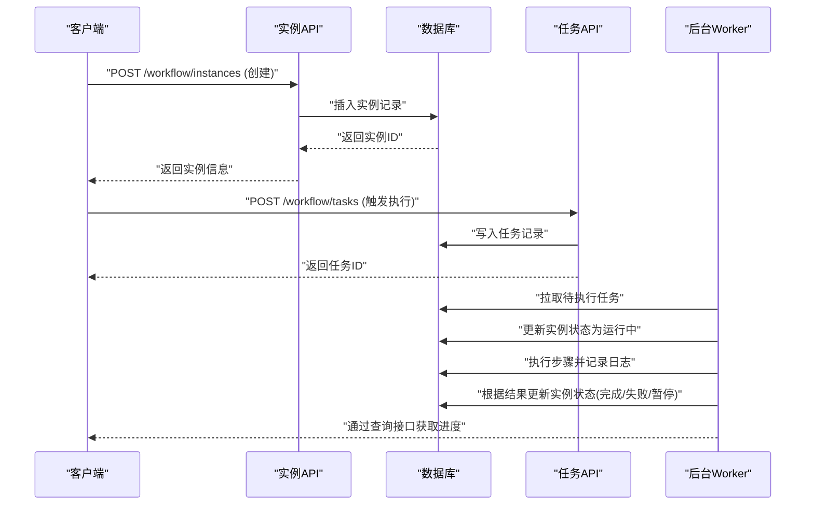
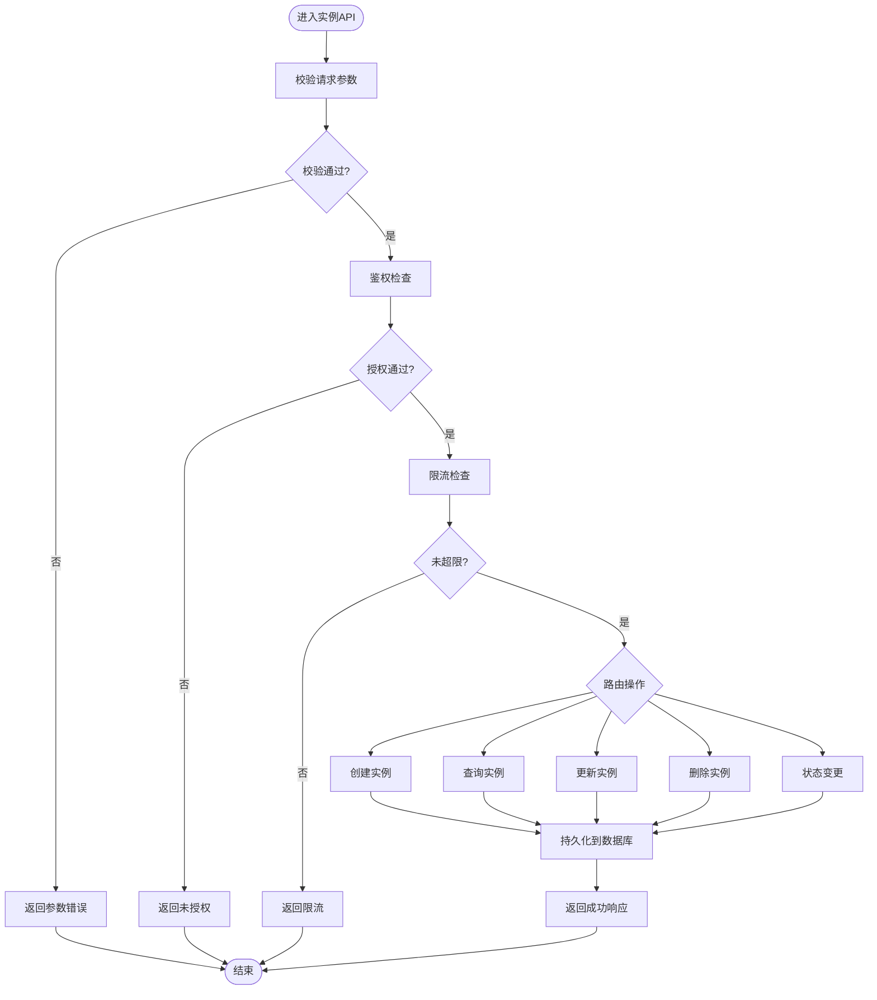
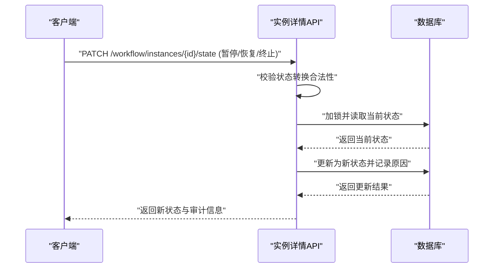
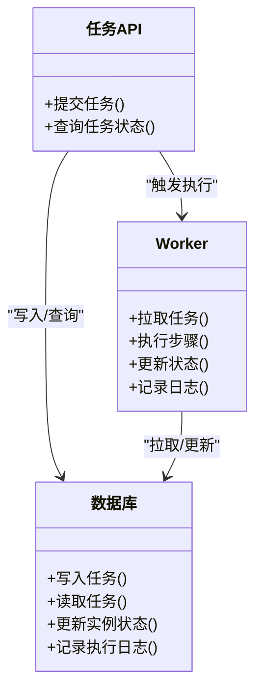
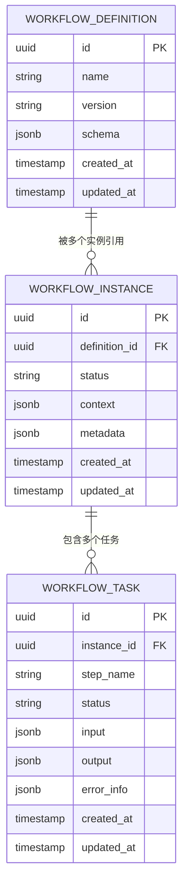
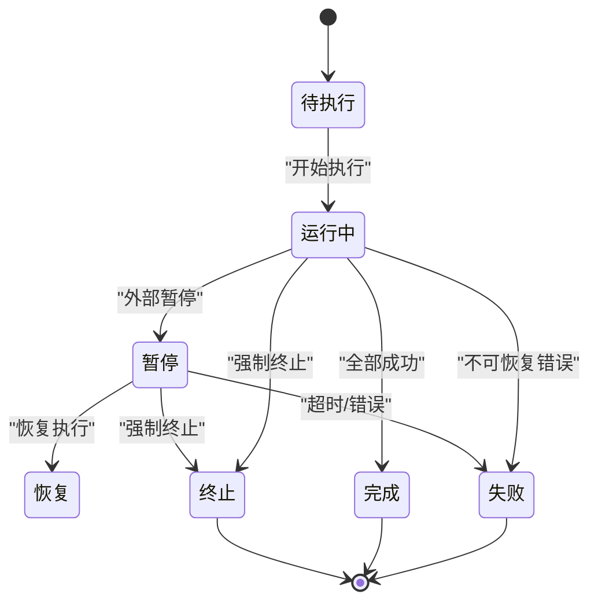
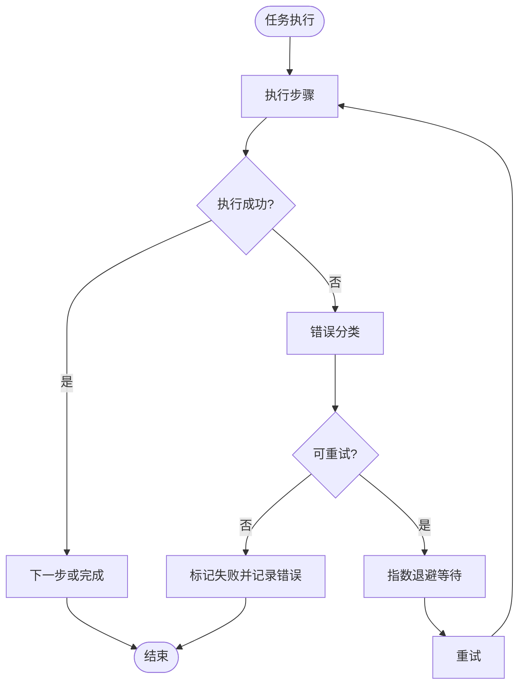
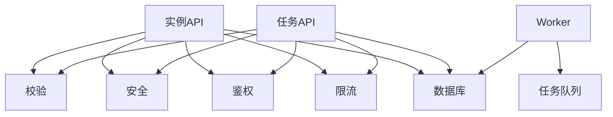

# 工作流实例管理

<cite>
**本文引用的文件**   
- [app/api/workflow/instances/route.ts](file://app/api/workflow/instances/route.ts)
- [app/api/workflow/instances/[id]/route.ts](file://app/api/workflow/instances/[id]/route.ts)
- [app/api/workflow/tasks/route.ts](file://app/api/workflow/tasks/route.ts)
- [app/api/workflows/route.ts](file://app/api/workflows/route.ts)
- [db/schema.ts](file://db/schema.ts)
- [worker/index.ts](file://worker/index.ts)
- [lib/validation.ts](file://lib/validation.ts)
- [lib/security.ts](file://lib/security.ts)
- [lib/auth.ts](file://lib/auth.ts)
- [lib/rate-limit.ts](file://lib/rate-limit.ts)
- [drizzle.config.ts](file://drizzle.config.ts)
</cite>

## 目录
1. [简介](#简介)
2. [项目结构](#项目结构)
3. [核心组件](#核心组件)
4. [架构总览](#架构总览)
5. [详细组件分析](#详细组件分析)
6. [依赖关系分析](#依赖关系分析)
7. [性能考量](#性能考量)
8. [故障排查指南](#故障排查指南)
9. [结论](#结论)
10. [附录](#附录)

## 简介
本文件面向工作流实例管理功能，系统性阐述实例的状态管理机制、生命周期操作（创建、查询、更新、删除）、与定义的关系映射、执行监控与追踪、错误处理与重试策略，以及API使用示例与常见场景。文档旨在帮助开发者快速理解并正确使用该模块，同时为运维和测试提供可操作的参考。

## 项目结构
工作流实例相关能力主要分布在以下位置：
- API路由层：实例的CRUD与状态变更接口位于 app/api/workflow/instances 及其子路径；任务调度入口在 app/api/workflow/tasks；定义管理在 app/api/workflows。
- 数据模型与迁移：数据库模式定义位于 db/schema.ts，Drizzle配置位于 drizzle.config.ts。
- 后台执行：异步任务执行由 worker/index.ts 承担。
- 通用能力：输入校验、安全控制、鉴权、限流等能力位于 lib 目录。

图表来源
- [app/api/workflow/instances/route.ts](file://app/api/workflow/instances/route.ts)
- [app/api/workflow/instances/[id]/route.ts](file://app/api/workflow/instances/[id]/route.ts)
- [app/api/workflow/tasks/route.ts](file://app/api/workflow/tasks/route.ts)
- [app/api/workflows/route.ts](file://app/api/workflows/route.ts)
- [db/schema.ts](file://db/schema.ts)
- [drizzle.config.ts](file://drizzle.config.ts)
- [worker/index.ts](file://worker/index.ts)
- [lib/validation.ts](file://lib/validation.ts)
- [lib/security.ts](file://lib/security.ts)
- [lib/auth.ts](file://lib/auth.ts)
- [lib/rate-limit.ts](file://lib/rate-limit.ts)

章节来源
- [app/api/workflow/instances/route.ts](file://app/api/workflow/instances/route.ts)
- [app/api/workflow/instances/[id]/route.ts](file://app/api/workflow/instances/[id]/route.ts)
- [app/api/workflow/tasks/route.ts](file://app/api/workflow/tasks/route.ts)
- [app/api/workflows/route.ts](file://app/api/workflows/route.ts)
- [db/schema.ts](file://db/schema.ts)
- [drizzle.config.ts](file://drizzle.config.ts)
- [worker/index.ts](file://worker/index.ts)
- [lib/validation.ts](file://lib/validation.ts)
- [lib/security.ts](file://lib/security.ts)
- [lib/auth.ts](file://lib/auth.ts)
- [lib/rate-limit.ts](file://lib/rate-limit.ts)

## 核心组件
- 实例API路由：负责实例的创建、查询、更新、删除及状态变更（暂停、恢复、终止等），并对请求进行校验、鉴权与限流。
- 任务API路由：作为任务执行的统一入口，触发后台Worker执行具体步骤。
- Worker：消费任务队列，执行业务逻辑，更新实例与任务状态，记录执行日志。
- 数据模型：定义实例、任务、定义等实体的字段与约束，确保数据一致性。
- 通用能力：输入校验、安全过滤、鉴权、限流等横切关注点。

章节来源
- [app/api/workflow/instances/route.ts](file://app/api/workflow/instances/route.ts)
- [app/api/workflow/instances/[id]/route.ts](file://app/api/workflow/instances/[id]/route.ts)
- [app/api/workflow/tasks/route.ts](file://app/api/workflow/tasks/route.ts)
- [worker/index.ts](file://worker/index.ts)
- [db/schema.ts](file://db/schema.ts)
- [lib/validation.ts](file://lib/validation.ts)
- [lib/security.ts](file://lib/security.ts)
- [lib/auth.ts](file://lib/auth.ts)
- [lib/rate-limit.ts](file://lib/rate-limit.ts)

## 架构总览
工作流实例的生命周期由API层驱动，持久化到数据库，并由Worker异步执行。关键流程如下：
- 创建实例：客户端调用实例创建接口，服务端校验并落库，返回实例ID。
- 启动执行：通过任务接口提交执行任务，Worker拉取并执行，逐步推进实例状态。
- 状态变更：在执行过程中，根据业务结果或外部事件更新实例状态（运行中、暂停、恢复、完成、失败）。
- 监控追踪：每个步骤的执行结果与日志写入数据库，便于查询与审计。

图表来源
- [app/api/workflow/instances/route.ts](file://app/api/workflow/instances/route.ts)
- [app/api/workflow/tasks/route.ts](file://app/api/workflow/tasks/route.ts)
- [worker/index.ts](file://worker/index.ts)
- [db/schema.ts](file://db/schema.ts)

## 详细组件分析

### 实例API路由（创建、查询、更新、删除）
- 职责：实现实例的CRUD与状态变更；对请求参数进行校验；鉴权与限流保护；与数据库交互持久化数据。
- 关键点：
  - 创建：接收定义ID与初始上下文，生成唯一实例ID，设置初始状态为“待执行”。
  - 查询：支持按ID、定义ID、状态、时间范围等条件筛选。
  - 更新：支持更新上下文、备注、优先级等元数据。
  - 删除：软删除或硬删除策略需结合业务约定。
  - 状态变更：仅允许从合法前驱状态转换到后继状态，避免非法跳转。

图表来源
- [app/api/workflow/instances/route.ts](file://app/api/workflow/instances/route.ts)
- [lib/validation.ts](file://lib/validation.ts)
- [lib/security.ts](file://lib/security.ts)
- [lib/auth.ts](file://lib/auth.ts)
- [lib/rate-limit.ts](file://lib/rate-limit.ts)

章节来源
- [app/api/workflow/instances/route.ts](file://app/api/workflow/instances/route.ts)
- [lib/validation.ts](file://lib/validation.ts)
- [lib/security.ts](file://lib/security.ts)
- [lib/auth.ts](file://lib/auth.ts)
- [lib/rate-limit.ts](file://lib/rate-limit.ts)

### 实例详情与状态变更（暂停、恢复、终止）
- 职责：针对单个实例进行状态切换，确保状态机合法性；记录状态变更原因与审计信息。
- 关键点：
  - 前置校验：确认当前状态允许目标转换（如运行中→暂停、暂停→恢复、运行中→终止）。
  - 并发控制：使用行级锁或版本号防止竞态条件导致的状态不一致。
  - 副作用：暂停时冻结任务执行；恢复时重新调度任务；终止时清理资源并记录终止原因。

图表来源
- [app/api/workflow/instances/[id]/route.ts](file://app/api/workflow/instances/[id]/route.ts)
- [db/schema.ts](file://db/schema.ts)

章节来源
- [app/api/workflow/instances/[id]/route.ts](file://app/api/workflow/instances/[id]/route.ts)
- [db/schema.ts](file://db/schema.ts)

### 任务执行与Worker
- 职责：统一任务入口与后台执行器，解耦HTTP请求与耗时操作；保证任务的可观测性与可靠性。
- 关键点：
  - 任务入队：任务API写入任务表，返回任务ID供客户端跟踪。
  - 任务消费：Worker轮询或订阅任务队列，拉取待执行任务。
  - 执行过程：按步骤顺序执行，记录每一步的输入输出与日志；遇到异常进行重试或降级。
  - 状态同步：根据执行结果更新实例状态与任务状态，确保最终一致性。

图表来源
- [app/api/workflow/tasks/route.ts](file://app/api/workflow/tasks/route.ts)
- [worker/index.ts](file://worker/index.ts)
- [db/schema.ts](file://db/schema.ts)

章节来源
- [app/api/workflow/tasks/route.ts](file://app/api/workflow/tasks/route.ts)
- [worker/index.ts](file://worker/index.ts)
- [db/schema.ts](file://db/schema.ts)

### 数据模型与关系映射（实例与定义）
- 实例与定义：一个定义可被多个实例复用；实例包含定义ID、版本、上下文、状态、审计信息等字段。
- 实例与任务：一个实例包含多个任务，任务按顺序或依赖关系执行；任务记录步骤、输入输出、状态与错误信息。
- 约束与索引：为常用查询字段建立索引（如定义ID、状态、创建时间），提升查询性能。

图表来源
- [db/schema.ts](file://db/schema.ts)

章节来源
- [db/schema.ts](file://db/schema.ts)

### 状态管理与生命周期
- 状态集合：待执行、运行中、暂停、恢复、完成、失败、终止。
- 转换规则：
  - 待执行 → 运行中：开始执行首个任务。
  - 运行中 → 暂停：外部干预或资源不足。
  - 暂停 → 恢复：资源就绪后继续执行。
  - 运行中 → 完成：所有任务成功。
  - 运行中/暂停 → 失败：不可恢复错误或达到最大重试次数。
  - 任意状态 → 终止：管理员强制停止。
- 一致性保障：状态变更需原子更新，记录审计日志；并发场景下使用乐观锁或事务。

图表来源
- [app/api/workflow/instances/route.ts](file://app/api/workflow/instances/route.ts)
- [app/api/workflow/instances/[id]/route.ts](file://app/api/workflow/instances/[id]/route.ts)
- [worker/index.ts](file://worker/index.ts)

章节来源
- [app/api/workflow/instances/route.ts](file://app/api/workflow/instances/route.ts)
- [app/api/workflow/instances/[id]/route.ts](file://app/api/workflow/instances/[id]/route.ts)
- [worker/index.ts](file://worker/index.ts)

### 错误处理与重试策略
- 错误分类：
  - 可重试错误：网络抖动、临时资源不可用。
  - 不可重试错误：参数错误、业务规则违反。
- 重试策略：
  - 指数退避：首次延迟短，后续逐步增加。
  - 最大重试次数：超过阈值标记为失败。
  - 幂等性：重试不产生副作用，基于任务ID去重。
- 失败处理：
  - 记录错误信息与堆栈，便于定位。
  - 支持人工介入与补偿操作。

图表来源
- [worker/index.ts](file://worker/index.ts)
- [lib/validation.ts](file://lib/validation.ts)

章节来源
- [worker/index.ts](file://worker/index.ts)
- [lib/validation.ts](file://lib/validation.ts)

### API接口使用示例与常见场景
- 创建实例：
  - 请求：POST /workflow/instances，携带定义ID与初始上下文。
  - 响应：返回实例ID与初始状态。
- 查询实例：
  - 请求：GET /workflow/instances?definitionId=&status=&createdAtRange=。
  - 响应：分页返回实例列表。
- 更新实例：
  - 请求：PATCH /workflow/instances/{id}，更新上下文或元数据。
  - 响应：返回更新后的实例。
- 删除实例：
  - 请求：DELETE /workflow/instances/{id}。
  - 响应：返回删除结果。
- 状态变更：
  - 请求：PATCH /workflow/instances/{id}/state，指定目标状态与原因。
  - 响应：返回新状态与审计信息。
- 触发执行：
  - 请求：POST /workflow/tasks，携带实例ID与任务参数。
  - 响应：返回任务ID。
- 监控追踪：
  - 请求：GET /workflow/tasks/{taskId} 或 GET /workflow/instances/{id}/tasks。
  - 响应：返回任务状态、步骤日志与错误信息。

章节来源
- [app/api/workflow/instances/route.ts](file://app/api/workflow/instances/route.ts)
- [app/api/workflow/instances/[id]/route.ts](file://app/api/workflow/instances/[id]/route.ts)
- [app/api/workflow/tasks/route.ts](file://app/api/workflow/tasks/route.ts)

## 依赖关系分析
- 组件耦合：
  - API路由依赖校验、安全、鉴权、限流等通用能力。
  - Worker依赖数据库与任务队列，负责状态同步与日志记录。
- 外部依赖：
  - 数据库：PostgreSQL（通过Drizzle ORM访问）。
  - 任务队列：可由消息队列或数据库表实现。
- 潜在循环依赖：API与Worker之间通过数据库解耦，无直接循环依赖。

图表来源
- [app/api/workflow/instances/route.ts](file://app/api/workflow/instances/route.ts)
- [app/api/workflow/tasks/route.ts](file://app/api/workflow/tasks/route.ts)
- [worker/index.ts](file://worker/index.ts)
- [lib/validation.ts](file://lib/validation.ts)
- [lib/security.ts](file://lib/security.ts)
- [lib/auth.ts](file://lib/auth.ts)
- [lib/rate-limit.ts](file://lib/rate-limit.ts)
- [db/schema.ts](file://db/schema.ts)

章节来源
- [app/api/workflow/instances/route.ts](file://app/api/workflow/instances/route.ts)
- [app/api/workflow/tasks/route.ts](file://app/api/workflow/tasks/route.ts)
- [worker/index.ts](file://worker/index.ts)
- [lib/validation.ts](file://lib/validation.ts)
- [lib/security.ts](file://lib/security.ts)
- [lib/auth.ts](file://lib/auth.ts)
- [lib/rate-limit.ts](file://lib/rate-limit.ts)
- [db/schema.ts](file://db/schema.ts)

## 性能考量
- 查询优化：为实例与任务的常用查询字段建立索引（定义ID、状态、创建时间）。
- 批量操作：支持批量创建与更新，减少往返开销。
- 异步执行：耗时操作放入Worker，避免阻塞HTTP请求。
- 缓存策略：对只读查询结果进行短期缓存，降低数据库压力。
- 连接池：合理配置数据库连接池大小，避免连接耗尽。

[本节为通用指导，无需特定文件来源]

## 故障排查指南
- 常见问题：
  - 状态转换失败：检查当前状态是否允许目标转换，查看审计日志。
  - 任务执行失败：查看任务错误信息与堆栈，判断是否可重试。
  - 限流触发：检查限流配置与客户端调用频率。
  - 鉴权失败：确认用户权限与令牌有效性。
- 诊断步骤：
  - 通过实例ID查询状态与任务列表，定位卡住步骤。
  - 查看Worker日志与数据库错误记录。
  - 复现问题并验证修复方案。

章节来源
- [app/api/workflow/instances/route.ts](file://app/api/workflow/instances/route.ts)
- [app/api/workflow/instances/[id]/route.ts](file://app/api/workflow/instances/[id]/route.ts)
- [app/api/workflow/tasks/route.ts](file://app/api/workflow/tasks/route.ts)
- [worker/index.ts](file://worker/index.ts)

## 结论
工作流实例管理通过清晰的API设计、健壮的状态机、可靠的Worker执行与完善的数据模型，实现了端到端的实例生命周期管理。建议在生产环境中加强监控告警、错误追踪与容量规划，确保高可用与可扩展性。

[本节为总结，无需特定文件来源]

## 附录
- Drizzle配置：用于数据库连接与迁移管理。
- 安全与鉴权：确保接口访问受控，防止未授权操作。
- 限流策略：保护系统免受突发流量冲击。

章节来源
- [drizzle.config.ts](file://drizzle.config.ts)
- [lib/security.ts](file://lib/security.ts)
- [lib/auth.ts](file://lib/auth.ts)
- [lib/rate-limit.ts](file://lib/rate-limit.ts)