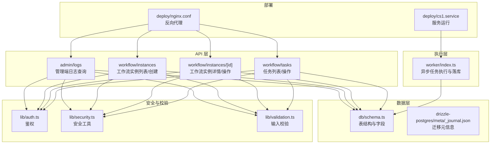
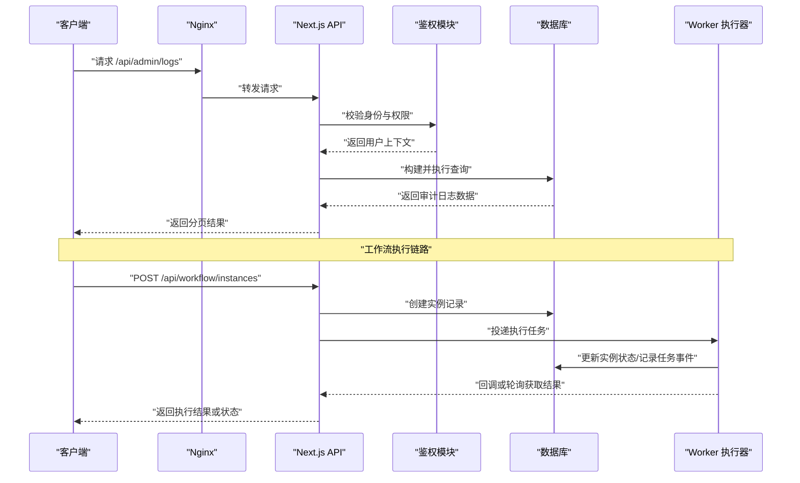
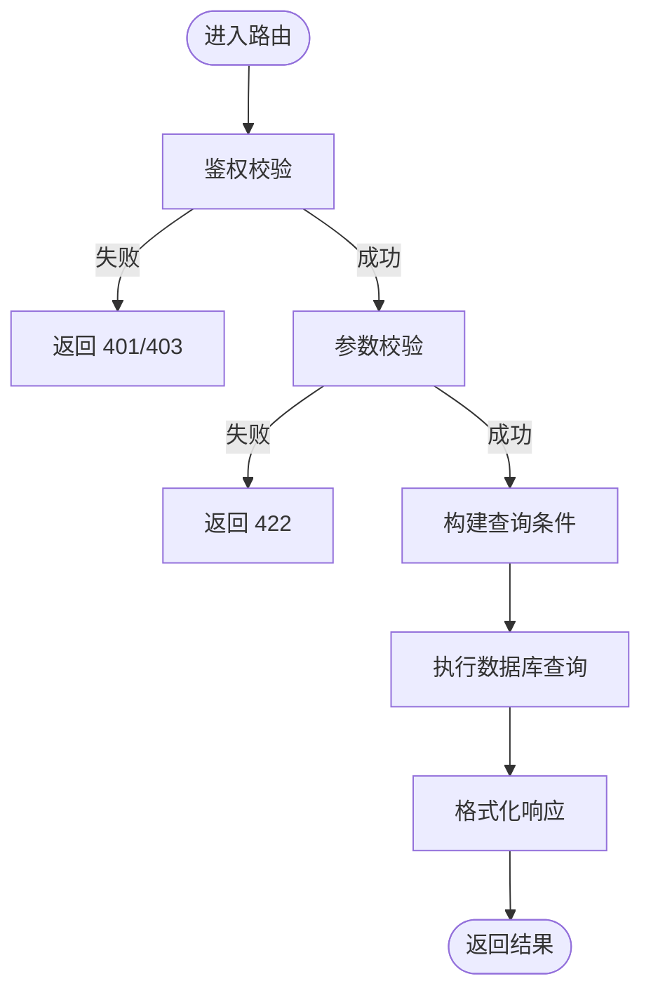
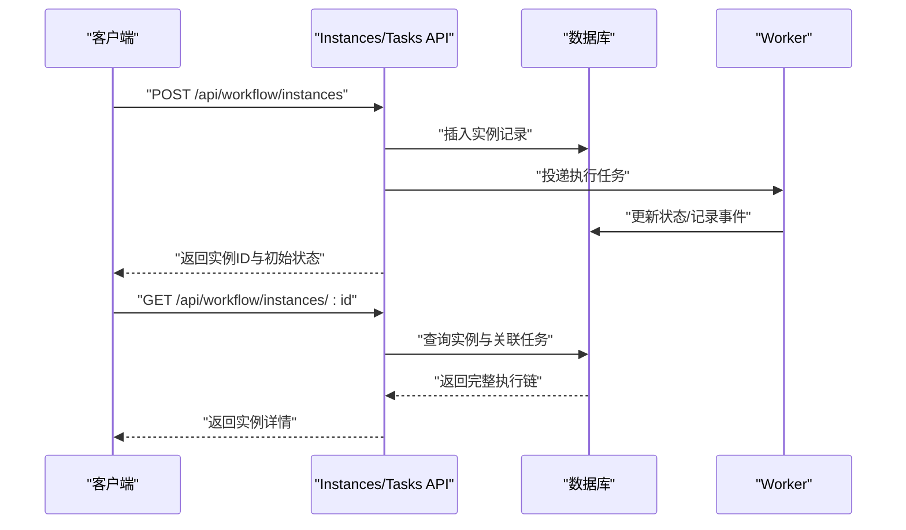
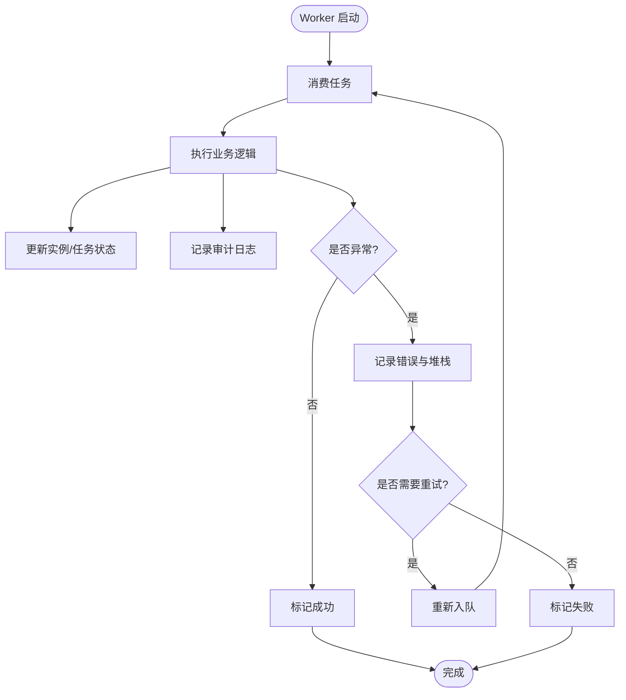
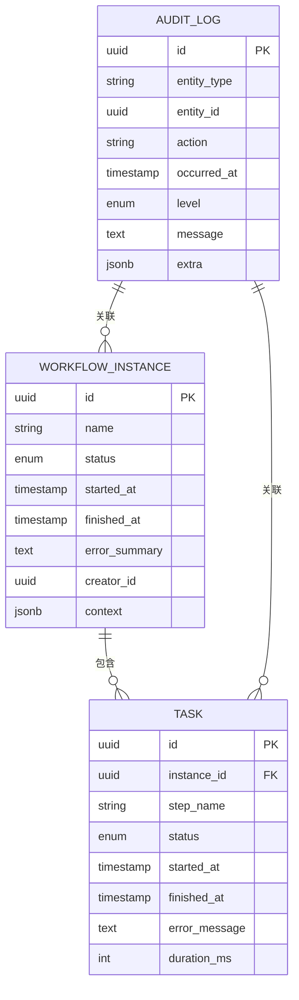
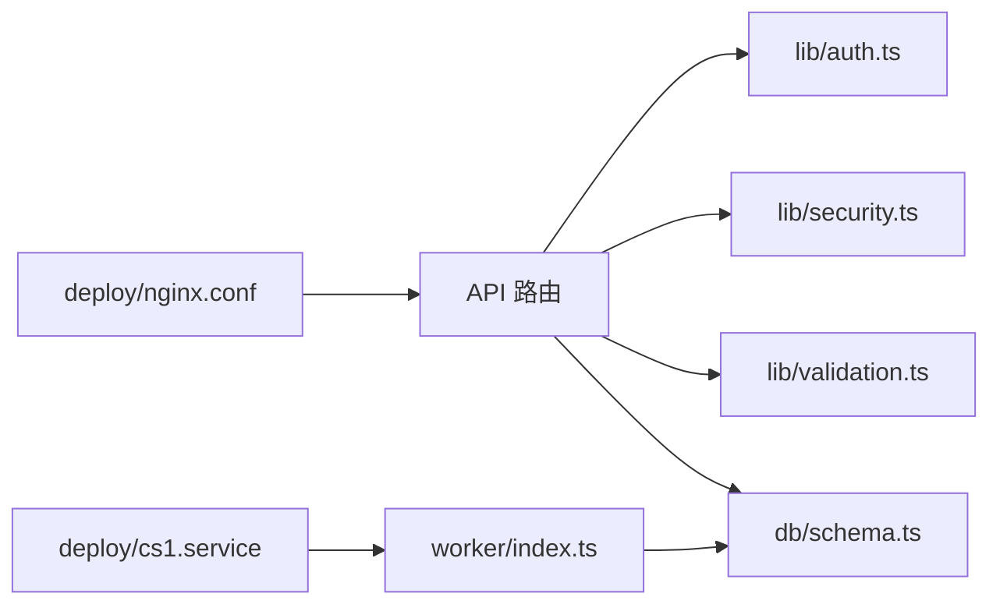

# 工作流执行审计

<cite>
**本文引用的文件**   
- [app/api/admin/logs/route.ts](file://app/api/admin/logs/route.ts)
- [app/api/workflow/instances/route.ts](file://app/api/workflow/instances/route.ts)
- [app/api/workflow/instances/[id]/route.ts](file://app/api/workflow/instances/[id]/route.ts)
- [app/api/workflow/tasks/route.ts](file://app/api/workflow/tasks/route.ts)
- [db/schema.ts](file://db/schema.ts)
- [drizzle-postgres/meta/_journal.json](file://drizzle-postgres/meta/_journal.json)
- [worker/index.ts](file://worker/index.ts)
- [lib/auth.ts](file://lib/auth.ts)
- [lib/security.ts](file://lib/security.ts)
- [lib/validation.ts](file://lib/validation.ts)
- [deploy/nginx.conf](file://deploy/nginx.conf)
- [deploy/cs1.service](file://deploy/cs1.service)
</cite>

## 目录
1. [简介](#简介)
2. [项目结构](#项目结构)
3. [核心组件](#核心组件)
4. [架构总览](#架构总览)
5. [详细组件分析](#详细组件分析)
6. [依赖分析](#依赖分析)
7. [性能考虑](#性能考虑)
8. [故障排查指南](#故障排查指南)
9. [结论](#结论)
10. [附录](#附录)

## 简介
本文件面向“工作流执行审计日志系统”，聚焦以下目标：
- 明确执行日志的记录规范（开始时间、结束时间、执行状态、错误信息等关键字段）
- 定义审计数据的存储结构与查询接口
- 说明日志的分级管理与保留策略
- 提供日志分析与问题排查方法
- 给出性能监控指标与告警机制建议
- 提供日志导出与报表生成的使用指南

本指南基于仓库中的 API 路由、数据库 Schema、Worker 与部署配置进行归纳，确保读者既能快速上手，也能深入理解实现细节。

## 项目结构
与审计日志相关的关键位置如下：
- API 层
  - 管理端日志查询入口：app/api/admin/logs/route.ts
  - 工作流实例与任务查询：app/api/workflow/instances/route.ts、app/api/workflow/instances/[id]/route.ts、app/api/workflow/tasks/route.ts
- 数据层
  - 数据库 Schema：db/schema.ts
  - Drizzle 迁移元信息：drizzle-postgres/meta/_journal.json
- 执行层
  - Worker 进程：worker/index.ts
- 安全与校验
  - 鉴权与权限控制：lib/auth.ts
  - 安全工具：lib/security.ts
  - 输入校验：lib/validation.ts
- 部署与网关
  - Nginx 配置：deploy/nginx.conf
  - 服务单元：deploy/cs1.service

图表来源
- [app/api/admin/logs/route.ts](file://app/api/admin/logs/route.ts)
- [app/api/workflow/instances/route.ts](file://app/api/workflow/instances/route.ts)
- [app/api/workflow/instances/[id]/route.ts](file://app/api/workflow/instances/[id]/route.ts)
- [app/api/workflow/tasks/route.ts](file://app/api/workflow/tasks/route.ts)
- [db/schema.ts](file://db/schema.ts)
- [drizzle-postgres/meta/_journal.json](file://drizzle-postgres/meta/_journal.json)
- [worker/index.ts](file://worker/index.ts)
- [lib/auth.ts](file://lib/auth.ts)
- [lib/security.ts](file://lib/security.ts)
- [lib/validation.ts](file://lib/validation.ts)
- [deploy/nginx.conf](file://deploy/nginx.conf)
- [deploy/cs1.service](file://deploy/cs1.service)

章节来源
- [app/api/admin/logs/route.ts](file://app/api/admin/logs/route.ts)
- [app/api/workflow/instances/route.ts](file://app/api/workflow/instances/route.ts)
- [app/api/workflow/instances/[id]/route.ts](file://app/api/workflow/instances/[id]/route.ts)
- [app/api/workflow/tasks/route.ts](file://app/api/workflow/tasks/route.ts)
- [db/schema.ts](file://db/schema.ts)
- [drizzle-postgres/meta/_journal.json](file://drizzle-postgres/meta/_journal.json)
- [worker/index.ts](file://worker/index.ts)
- [lib/auth.ts](file://lib/auth.ts)
- [lib/security.ts](file://lib/security.ts)
- [lib/validation.ts](file://lib/validation.ts)
- [deploy/nginx.conf](file://deploy/nginx.conf)
- [deploy/cs1.service](file://deploy/cs1.service)

## 核心组件
- 管理端日志查询 API
  - 功能：按条件分页查询工作流执行审计日志，支持过滤、排序、导出等能力
  - 关键职责：鉴权校验、参数校验、构建查询、返回结果
- 工作流实例与任务 API
  - 功能：创建工作流实例、查询实例列表与详情、查询任务列表与详情
  - 关键职责：业务编排、触发执行、记录执行生命周期事件
- Worker 执行器
  - 功能：异步执行工作流任务，更新执行状态、记录错误与耗时
  - 关键职责：幂等处理、重试策略、异常捕获、审计落库
- 数据模型与迁移
  - 功能：定义审计日志、实例、任务等表结构及索引
  - 关键职责：字段约束、默认值、索引设计、迁移版本管理

章节来源
- [app/api/admin/logs/route.ts](file://app/api/admin/logs/route.ts)
- [app/api/workflow/instances/route.ts](file://app/api/workflow/instances/route.ts)
- [app/api/workflow/instances/[id]/route.ts](file://app/api/workflow/instances/[id]/route.ts)
- [app/api/workflow/tasks/route.ts](file://app/api/workflow/tasks/route.ts)
- [worker/index.ts](file://worker/index.ts)
- [db/schema.ts](file://db/schema.ts)
- [drizzle-postgres/meta/_journal.json](file://drizzle-postgres/meta/_journal.json)

## 架构总览
整体流程：客户端通过 Nginx 访问 Next.js API；API 负责鉴权、校验与业务编排；工作流执行由 Worker 异步完成；所有执行事件写入数据库，供管理端查询与导出。

图表来源
- [deploy/nginx.conf](file://deploy/nginx.conf)
- [app/api/admin/logs/route.ts](file://app/api/admin/logs/route.ts)
- [app/api/workflow/instances/route.ts](file://app/api/workflow/instances/route.ts)
- [worker/index.ts](file://worker/index.ts)
- [db/schema.ts](file://db/schema.ts)

## 详细组件分析

### 管理端日志查询 API
- 功能要点
  - 鉴权：仅允许管理员角色访问
  - 参数校验：时间范围、实例ID、任务ID、状态、关键词等
  - 查询构建：支持分页、排序、多条件组合
  - 响应格式：统一的数据结构，包含分页信息与数据列表
- 关键路径
  - GET /api/admin/logs

图表来源
- [app/api/admin/logs/route.ts](file://app/api/admin/logs/route.ts)
- [lib/auth.ts](file://lib/auth.ts)
- [lib/validation.ts](file://lib/validation.ts)

章节来源
- [app/api/admin/logs/route.ts](file://app/api/admin/logs/route.ts)
- [lib/auth.ts](file://lib/auth.ts)
- [lib/validation.ts](file://lib/validation.ts)

### 工作流实例与任务 API
- 功能要点
  - 实例创建：接收表单/配置，生成实例记录，触发执行
  - 实例查询：列表与详情，包含状态、开始/结束时间、错误摘要
  - 任务查询：任务列表与详情，包含步骤、状态、耗时、错误信息
- 关键路径
  - POST /api/workflow/instances
  - GET /api/workflow/instances
  - GET /api/workflow/instances/:id
  - GET /api/workflow/tasks

图表来源
- [app/api/workflow/instances/route.ts](file://app/api/workflow/instances/route.ts)
- [app/api/workflow/instances/[id]/route.ts](file://app/api/workflow/instances/[id]/route.ts)
- [app/api/workflow/tasks/route.ts](file://app/api/workflow/tasks/route.ts)
- [worker/index.ts](file://worker/index.ts)
- [db/schema.ts](file://db/schema.ts)

章节来源
- [app/api/workflow/instances/route.ts](file://app/api/workflow/instances/route.ts)
- [app/api/workflow/instances/[id]/route.ts](file://app/api/workflow/instances/[id]/route.ts)
- [app/api/workflow/tasks/route.ts](file://app/api/workflow/tasks/route.ts)
- [worker/index.ts](file://worker/index.ts)
- [db/schema.ts](file://db/schema.ts)

### Worker 执行器
- 功能要点
  - 任务消费：从队列或调度器获取待执行任务
  - 执行编排：调用工作流引擎，逐步推进状态
  - 审计落库：记录开始时间、结束时间、状态、错误信息、耗时
  - 异常处理：捕获异常、记录堆栈、重试策略
- 关键行为
  - 幂等性：避免重复执行导致状态不一致
  - 超时控制：设置任务超时，防止长尾阻塞
  - 降级策略：部分失败时回滚或补偿

图表来源
- [worker/index.ts](file://worker/index.ts)
- [db/schema.ts](file://db/schema.ts)

章节来源
- [worker/index.ts](file://worker/index.ts)
- [db/schema.ts](file://db/schema.ts)

### 数据模型与迁移
- 核心表与字段（概念性描述）
  - 工作流实例表：实例ID、名称、状态、开始时间、结束时间、错误摘要、创建人、租户/环境标识等
  - 任务表：任务ID、实例ID、步骤名、状态、开始时间、结束时间、错误信息、耗时等
  - 审计日志表：日志ID、实体类型、实体ID、动作、时间戳、级别、消息、上下文 JSON 等
- 索引与约束
  - 常用查询字段建立索引（如实例ID、状态、时间范围）
  - 外键约束保证实例与任务的关联一致性
- 迁移管理
  - 使用 Drizzle 管理迁移版本，确保结构演进可追溯

图表来源
- [db/schema.ts](file://db/schema.ts)
- [drizzle-postgres/meta/_journal.json](file://drizzle-postgres/meta/_journal.json)

章节来源
- [db/schema.ts](file://db/schema.ts)
- [drizzle-postgres/meta/_journal.json](file://drizzle-postgres/meta/_journal.json)

## 依赖分析
- 组件耦合
  - API 层依赖鉴权与安全模块，确保请求合法性
  - API 与 Worker 通过数据库作为最终一致性媒介
  - 数据层依赖 Drizzle ORM 与 Postgres
- 外部依赖
  - Nginx 作为反向代理，提供负载均衡与缓存
  - 服务单元管理应用与 Worker 的生命周期

图表来源
- [app/api/admin/logs/route.ts](file://app/api/admin/logs/route.ts)
- [app/api/workflow/instances/route.ts](file://app/api/workflow/instances/route.ts)
- [app/api/workflow/instances/[id]/route.ts](file://app/api/workflow/instances/[id]/route.ts)
- [app/api/workflow/tasks/route.ts](file://app/api/workflow/tasks/route.ts)
- [lib/auth.ts](file://lib/auth.ts)
- [lib/security.ts](file://lib/security.ts)
- [lib/validation.ts](file://lib/validation.ts)
- [db/schema.ts](file://db/schema.ts)
- [worker/index.ts](file://worker/index.ts)
- [deploy/nginx.conf](file://deploy/nginx.conf)
- [deploy/cs1.service](file://deploy/cs1.service)

章节来源
- [lib/auth.ts](file://lib/auth.ts)
- [lib/security.ts](file://lib/security.ts)
- [lib/validation.ts](file://lib/validation.ts)
- [db/schema.ts](file://db/schema.ts)
- [worker/index.ts](file://worker/index.ts)
- [deploy/nginx.conf](file://deploy/nginx.conf)
- [deploy/cs1.service](file://deploy/cs1.service)

## 性能考虑
- 查询优化
  - 对高频过滤字段（实例ID、状态、时间范围）建立索引
  - 分页查询限制每页大小，避免大结果集传输
- 写入优化
  - Worker 批量写入审计日志，减少事务开销
  - 异步落库，避免阻塞主流程
- 资源隔离
  - API 与 Worker 分离部署，独立扩缩容
  - 数据库连接池配置合理上限，防止连接耗尽
- 监控指标
  - QPS、P95/P99 延迟、错误率、队列积压、Worker 并发度
  - 数据库慢查询与锁等待统计

[本节为通用性能建议，不直接分析具体文件]

## 故障排查指南
- 常见问题定位
  - 无权限访问：检查鉴权中间件与角色配置
  - 参数校验失败：核对请求体字段与校验规则
  - 执行失败：查看 Worker 日志与数据库错误字段
- 排查步骤
  - 通过管理端日志查询接口，按时间范围与实例ID筛选
  - 结合任务详情中的错误信息与耗时，定位瓶颈
  - 检查数据库索引与慢查询，必要时调整查询条件
- 恢复策略
  - 重试失败任务，清理僵尸实例
  - 回滚有问题的迁移，确保数据一致性

章节来源
- [app/api/admin/logs/route.ts](file://app/api/admin/logs/route.ts)
- [app/api/workflow/instances/[id]/route.ts](file://app/api/workflow/instances/[id]/route.ts)
- [app/api/workflow/tasks/route.ts](file://app/api/workflow/tasks/route.ts)
- [worker/index.ts](file://worker/index.ts)
- [db/schema.ts](file://db/schema.ts)

## 结论
本审计日志系统以清晰的 API 分层、可靠的 Worker 执行与完善的数据库模型为基础，提供了完整的执行生命周期记录与查询能力。通过合理的索引设计与监控告警，可有效支撑生产环境的稳定性与可观测性。建议在后续迭代中持续优化查询性能、完善告警阈值与自动化报表。

[本节为总结性内容，不直接分析具体文件]

## 附录

### 执行日志记录规范
- 关键字段
  - 开始时间：记录任务或实例的开始时刻
  - 结束时间：记录任务或实例的结束时刻
  - 执行状态：成功、失败、进行中、已取消等
  - 错误信息：错误码、错误消息、堆栈摘要
  - 耗时：毫秒级耗时统计
  - 上下文：扩展字段，用于记录业务上下文与追踪ID
- 记录时机
  - 实例创建时记录开始时间
  - 每个任务步骤完成后更新时间与状态
  - 实例结束时汇总错误摘要与总耗时

[本节为规范说明，不直接分析具体文件]

### 存储结构与查询接口
- 存储结构
  - 实例表、任务表、审计日志表三表关联，便于回溯执行链
- 查询接口
  - 管理端日志查询：支持多条件过滤与分页
  - 实例与任务查询：支持按 ID、状态、时间范围查询

章节来源
- [app/api/admin/logs/route.ts](file://app/api/admin/logs/route.ts)
- [app/api/workflow/instances/route.ts](file://app/api/workflow/instances/route.ts)
- [app/api/workflow/instances/[id]/route.ts](file://app/api/workflow/instances/[id]/route.ts)
- [app/api/workflow/tasks/route.ts](file://app/api/workflow/tasks/route.ts)
- [db/schema.ts](file://db/schema.ts)

### 日志分级与保留策略
- 分级
  - 信息、警告、错误、致命四级，便于过滤与告警
- 保留策略
  - 热数据（近 7 天）在线查询
  - 温数据（近 30 天）归档压缩
  - 冷数据（超过 30 天）对象存储长期保存

[本节为策略建议，不直接分析具体文件]

### 性能监控与告警机制
- 监控指标
  - API 延迟、错误率、QPS
  - Worker 并发、队列长度、重试次数
  - 数据库连接数、慢查询数量
- 告警规则
  - 错误率超过阈值触发告警
  - 队列积压超过阈值触发扩容
  - 慢查询超过阈值触发优化提醒

[本节为通用建议，不直接分析具体文件]

### 日志导出与报表生成
- 导出功能
  - 支持 CSV/JSON 格式导出
  - 支持按时间范围、实例ID、状态筛选后导出
- 报表生成
  - 成功率、平均耗时、失败原因分布
  - 趋势图与对比分析

章节来源
- [app/api/admin/logs/route.ts](file://app/api/admin/logs/route.ts)
- [app/components/shared/download-csv.tsx](file://app/components/shared/download-csv.tsx)