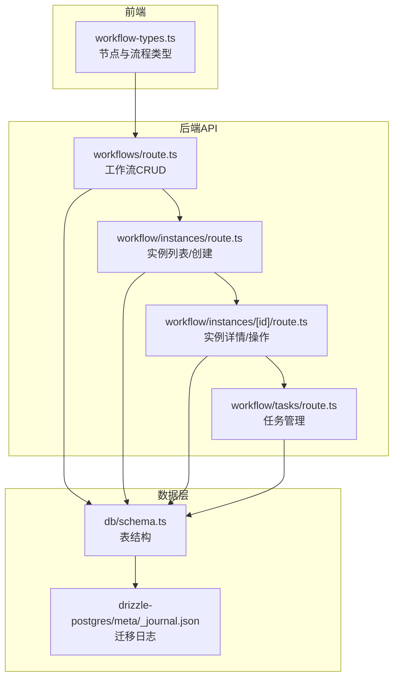
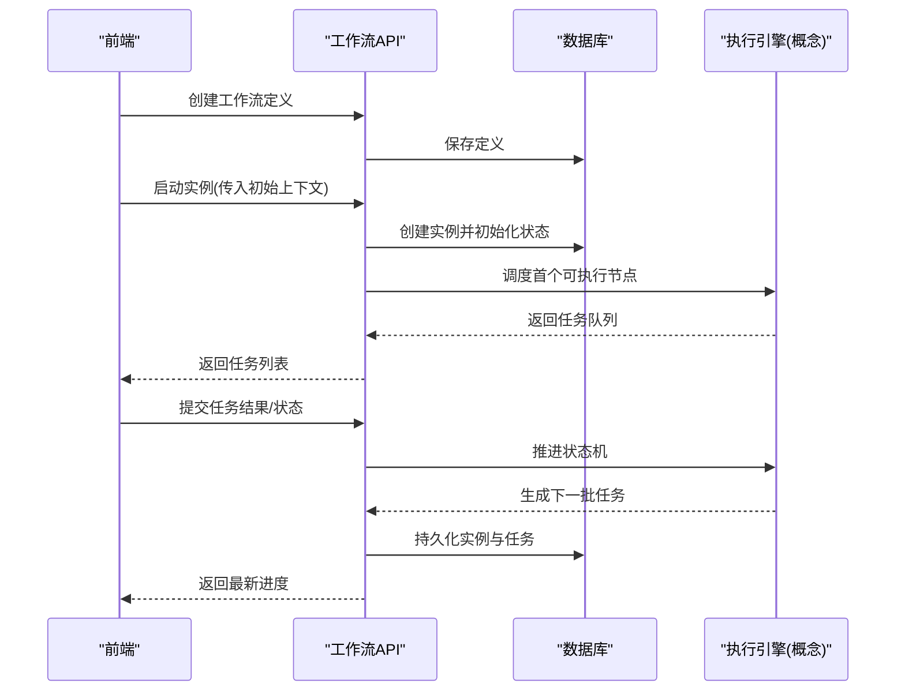
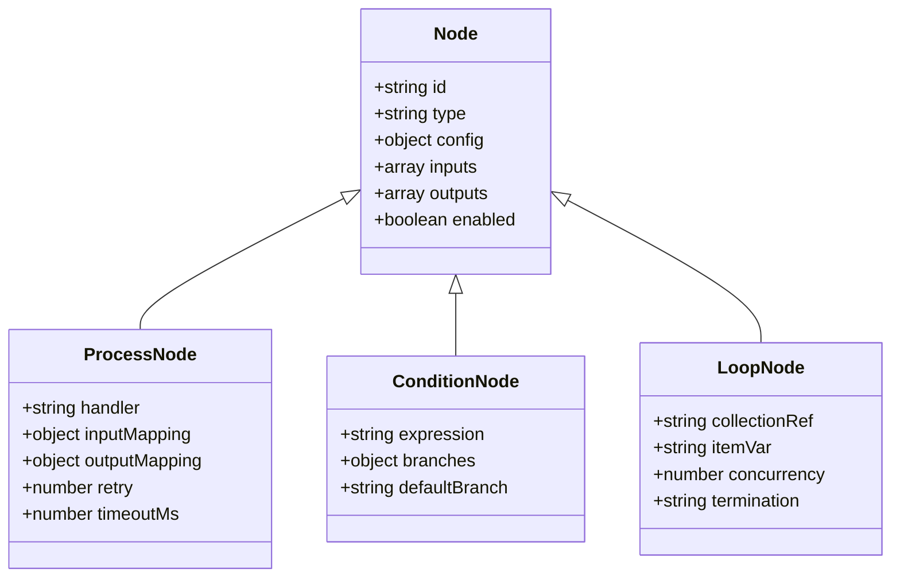
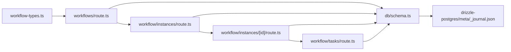

# 工作流节点配置

<cite>
**本文引用的文件**   
- [app/api/workflows/route.ts](file://app/api/workflows/route.ts)
- [app/api/workflow/instances/route.ts](file://app/api/workflow/instances/route.ts)
- [app/api/workflow/instances/[id]/route.ts](file://app/api/workflow/instances/[id]/route.ts)
- [app/api/workflow/tasks/route.ts](file://app/api/workflow/tasks/route.ts)
- [app/components/workflow/workflow-types.ts](file://app/components/workflow/workflow-types.ts)
- [lib/validation.ts](file://lib/validation.ts)
- [db/schema.ts](file://db/schema.ts)
- [drizzle-postgres/meta/_journal.json](file://drizzle-postgres/meta/_journal.json)
</cite>

## 目录
1. [简介](#简介)
2. [项目结构](#项目结构)
3. [核心组件](#核心组件)
4. [架构总览](#架构总览)
5. [详细组件分析](#详细组件分析)
6. [依赖关系分析](#依赖关系分析)
7. [性能考虑](#性能考虑)
8. [故障排查指南](#故障排查指南)
9. [结论](#结论)
10. [附录](#附录)

## 简介
本文件面向“工作流节点配置系统”，系统化说明节点类型（处理节点、条件节点、循环节点等）的配置结构、输入输出参数定义与数据传递机制，解释节点间依赖关系与执行顺序控制，给出配置验证规则与错误处理策略，并提供最佳实践、性能优化建议、实际配置示例与常见问题解决方案。文档基于仓库中工作流相关的前端类型定义、API路由与数据库模式进行归纳与提炼，确保读者既能快速上手，也能深入理解实现细节。

## 项目结构
工作流功能主要分布在以下模块：
- API层：工作流定义、实例与任务接口
- 前端类型：工作流节点与流程的TS类型定义
- 校验库：通用校验工具
- 数据库模式：持久化结构与迁移记录

图表来源
- [app/components/workflow/workflow-types.ts](file://app/components/workflow/workflow-types.ts)
- [app/api/workflows/route.ts](file://app/api/workflows/route.ts)
- [app/api/workflow/instances/route.ts](file://app/api/workflow/instances/route.ts)
- [app/api/workflow/instances/[id]/route.ts](file://app/api/workflow/instances/[id]/route.ts)
- [app/api/workflow/tasks/route.ts](file://app/api/workflow/tasks/route.ts)
- [db/schema.ts](file://db/schema.ts)
- [drizzle-postgres/meta/_journal.json](file://drizzle-postgres/meta/_journal.json)

章节来源
- [app/components/workflow/workflow-types.ts](file://app/components/workflow/workflow-types.ts)
- [app/api/workflows/route.ts](file://app/api/workflows/route.ts)
- [app/api/workflow/instances/route.ts](file://app/api/workflow/instances/route.ts)
- [app/api/workflow/instances/[id]/route.ts](file://app/api/workflow/instances/[id]/route.ts)
- [app/api/workflow/tasks/route.ts](file://app/api/workflow/tasks/route.ts)
- [db/schema.ts](file://db/schema.ts)
- [drizzle-postgres/meta/_journal.json](file://drizzle-postgres/meta/_journal.json)

## 核心组件
- 工作流定义（Workflow Definition）
  - 描述节点集合、边（依赖）、初始上下文与全局变量
  - 用于版本化管理与部署
- 工作流实例（Workflow Instance）
  - 一次运行生命周期，包含状态机（新建、运行中、成功、失败、取消）
  - 承载运行时上下文与快照
- 任务（Task）
  - 节点级别的执行单元，包含输入、输出、重试、超时、错误信息
- 节点类型（Node Types）
  - 处理节点：执行具体业务逻辑或调用外部服务
  - 条件节点：根据表达式分支选择后续路径
  - 循环节点：对集合进行迭代执行
  - 其他扩展节点：如并行、聚合、等待、通知等

章节来源
- [app/components/workflow/workflow-types.ts](file://app/components/workflow/workflow-types.ts)
- [app/api/workflows/route.ts](file://app/api/workflows/route.ts)
- [app/api/workflow/instances/route.ts](file://app/api/workflow/instances/route.ts)
- [app/api/workflow/instances/[id]/route.ts](file://app/api/workflow/instances/[id]/route.ts)
- [app/api/workflow/tasks/route.ts](file://app/api/workflow/tasks/route.ts)
- [db/schema.ts](file://db/schema.ts)

## 架构总览
工作流引擎采用“定义-实例-任务”三层模型，前后端通过REST API交互，数据持久化至PostgreSQL。

图表来源
- [app/api/workflows/route.ts](file://app/api/workflows/route.ts)
- [app/api/workflow/instances/route.ts](file://app/api/workflow/instances/route.ts)
- [app/api/workflow/instances/[id]/route.ts](file://app/api/workflow/instances/[id]/route.ts)
- [app/api/workflow/tasks/route.ts](file://app/api/workflow/tasks/route.ts)
- [db/schema.ts](file://db/schema.ts)

## 详细组件分析

### 节点类型与配置结构
- 处理节点（Process Node）
  - 用途：执行业务逻辑、调用API、数据处理
  - 关键配置项：处理器标识、输入映射、输出字段、重试策略、超时时间、环境变量
  - 输入输出：以键值形式绑定到上下文；支持对象嵌套与数组
- 条件节点（Condition Node）
  - 用途：基于表达式决定分支走向
  - 关键配置项：表达式、分支命名、默认分支
  - 输入输出：读取上下文中的变量，不产生新输出
- 循环节点（Loop Node）
  - 用途：对集合逐项执行子任务
  - 关键配置项：集合来源、迭代变量名、并发度、终止条件
  - 输入输出：将集合元素映射为迭代上下文，合并子任务输出为数组

图表来源
- [app/components/workflow/workflow-types.ts](file://app/components/workflow/workflow-types.ts)

章节来源
- [app/components/workflow/workflow-types.ts](file://app/components/workflow/workflow-types.ts)

### 输入输出参数与数据传递机制
- 上下文（Context）
  - 全局变量：由实例启动时注入，供所有节点读取
  - 节点局部变量：节点输出写入上下文，供下游节点使用
- 输入映射（Input Mapping）
  - 支持从上下文按路径取值，允许默认值与转换函数
- 输出映射（Output Mapping）
  - 将节点返回值写入上下文指定路径，支持对象展开与数组追加
- 数据传递原则
  - 单向流动：上游输出作为下游输入
  - 幂等性：同一输入应得到一致输出
  - 隔离性：节点间避免共享可变状态

章节来源
- [app/components/workflow/workflow-types.ts](file://app/components/workflow/workflow-types.ts)

### 依赖关系与执行顺序控制
- 依赖建模
  - 边（Edge）表示节点间的先后关系
  - 入度为零的节点为首批可执行节点
- 执行顺序
  - 拓扑排序确定执行批次
  - 条件节点动态裁剪后续路径
  - 循环节点按集合规模生成子任务
- 并发控制
  - 节点级并发限制
  - 全局并发上限与资源配额

章节来源
- [app/components/workflow/workflow-types.ts](file://app/components/workflow/workflow-types.ts)

### 配置验证规则
- 必填字段校验
  - 节点ID唯一、类型合法、依赖存在
  - 输入输出路径有效且无循环引用
- 表达式校验
  - 条件表达式语法正确、变量可解析
- 约束校验
  - 超时、重试次数、并发度在合理范围
- 集成校验
  - 处理器标识可用、外部依赖可达

章节来源
- [lib/validation.ts](file://lib/validation.ts)

### 错误处理与恢复
- 节点级错误
  - 捕获异常、记录错误信息、标记失败
  - 支持重试与退避策略
- 实例级错误
  - 失败回滚或补偿动作
  - 人工干预入口（重试、跳过、终止）
- 任务级错误
  - 超时、网络错误、权限不足等分类处理

章节来源
- [app/api/workflow/tasks/route.ts](file://app/api/workflow/tasks/route.ts)
- [app/api/workflow/instances/[id]/route.ts](file://app/api/workflow/instances/[id]/route.ts)

### 最佳实践与性能优化
- 设计层面
  - 保持节点职责单一，避免长链路
  - 合理使用条件与循环，减少无效分支
- 数据层面
  - 精简上下文体积，按需传递必要字段
  - 使用增量更新与分页拉取
- 执行层面
  - 设置合理的超时与重试上限
  - 控制并发度，避免资源争用
- 监控与可观测性
  - 记录关键指标与错误堆栈
  - 提供审计日志与追踪ID

[本节为通用指导，不直接分析具体文件]

### 实际配置示例（概念性）
- 处理节点示例
  - 输入：用户ID、订单号
  - 输出：订单详情、支付状态
  - 重试：3次，指数退避
  - 超时：10秒
- 条件节点示例
  - 表达式：支付状态 == “已支付”
  - 分支：继续处理 / 拒绝订单
- 循环节点示例
  - 集合：订单明细数组
  - 迭代变量：item
  - 并发：3
  - 终止：全部完成或任一失败

[本节为概念性示例，不直接分析具体文件]

## 依赖关系分析
工作流各模块之间的依赖如下：

图表来源
- [app/components/workflow/workflow-types.ts](file://app/components/workflow/workflow-types.ts)
- [app/api/workflows/route.ts](file://app/api/workflows/route.ts)
- [app/api/workflow/instances/route.ts](file://app/api/workflow/instances/route.ts)
- [app/api/workflow/instances/[id]/route.ts](file://app/api/workflow/instances/[id]/route.ts)
- [app/api/workflow/tasks/route.ts](file://app/api/workflow/tasks/route.ts)
- [db/schema.ts](file://db/schema.ts)
- [drizzle-postgres/meta/_journal.json](file://drizzle-postgres/meta/_journal.json)

章节来源
- [app/components/workflow/workflow-types.ts](file://app/components/workflow/workflow-types.ts)
- [app/api/workflows/route.ts](file://app/api/workflows/route.ts)
- [app/api/workflow/instances/route.ts](file://app/api/workflow/instances/route.ts)
- [app/api/workflow/instances/[id]/route.ts](file://app/api/workflow/instances/[id]/route.ts)
- [app/api/workflow/tasks/route.ts](file://app/api/workflow/tasks/route.ts)
- [db/schema.ts](file://db/schema.ts)
- [drizzle-postgres/meta/_journal.json](file://drizzle-postgres/meta/_journal.json)

## 性能考虑
- 减少上下文大小：仅传递必要字段，避免大对象广播
- 控制并发：按节点能力与资源上限设置并发度
- 缓存热点数据：对外部依赖结果做短期缓存
- 批量操作：合并小任务为批量，降低IO开销
- 异步执行：非阻塞任务放入队列，提升吞吐

[本节为通用指导，不直接分析具体文件]

## 故障排查指南
- 常见错误
  - 节点依赖缺失：检查边定义与节点ID
  - 表达式解析失败：确认变量存在与语法正确
  - 超时与重试耗尽：调整超时阈值与重试策略
  - 上下文冲突：避免同名变量覆盖
- 定位方法
  - 查看任务日志与错误堆栈
  - 检查实例状态机与最近变更
  - 使用追踪ID串联请求链路
- 恢复步骤
  - 修正配置后重新运行
  - 选择性重试失败任务
  - 必要时回滚到上一稳定版本

章节来源
- [app/api/workflow/tasks/route.ts](file://app/api/workflow/tasks/route.ts)
- [app/api/workflow/instances/[id]/route.ts](file://app/api/workflow/instances/[id]/route.ts)
- [lib/validation.ts](file://lib/validation.ts)

## 结论
工作流节点配置系统围绕“定义-实例-任务”的核心模型，提供了灵活的节点类型、清晰的输入输出映射、可靠的依赖与执行控制，以及完善的验证与错误处理机制。遵循本文的最佳实践与性能建议，可在保证稳定性的同时获得良好的可扩展性与可维护性。

[本节为总结性内容，不直接分析具体文件]

## 附录
- 术语表
  - 工作流定义：节点与边的静态描述
  - 工作流实例：一次运行的动态状态
  - 任务：节点级别的可执行单元
  - 上下文：运行时变量空间
- 参考文件
  - 类型定义：[app/components/workflow/workflow-types.ts](file://app/components/workflow/workflow-types.ts)
  - API路由：[app/api/workflows/route.ts](file://app/api/workflows/route.ts)、[app/api/workflow/instances/route.ts](file://app/api/workflow/instances/route.ts)、[app/api/workflow/instances/[id]/route.ts](file://app/api/workflow/instances/[id]/route.ts)、[app/api/workflow/tasks/route.ts](file://app/api/workflow/tasks/route.ts)
  - 校验工具：[lib/validation.ts](file://lib/validation.ts)
  - 数据库模式：[db/schema.ts](file://db/schema.ts)
  - 迁移记录：[drizzle-postgres/meta/_journal.json](file://drizzle-postgres/meta/_journal.json)