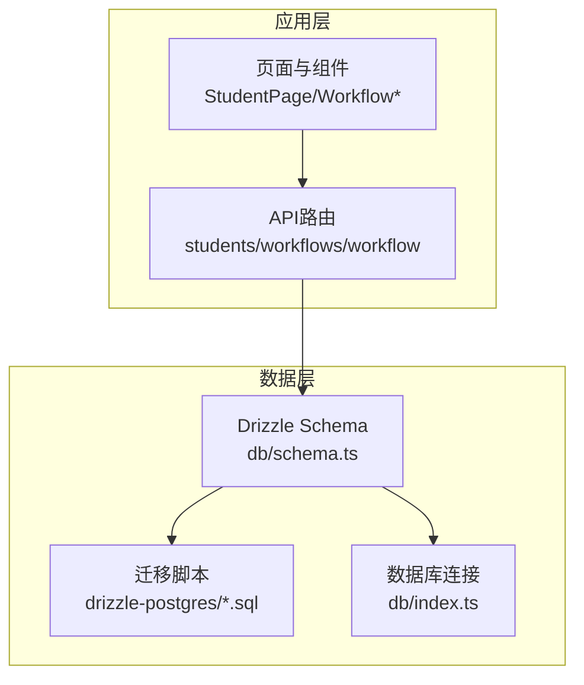
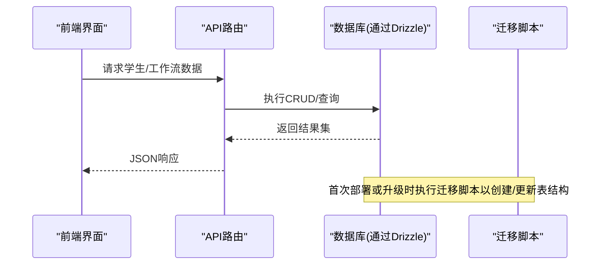
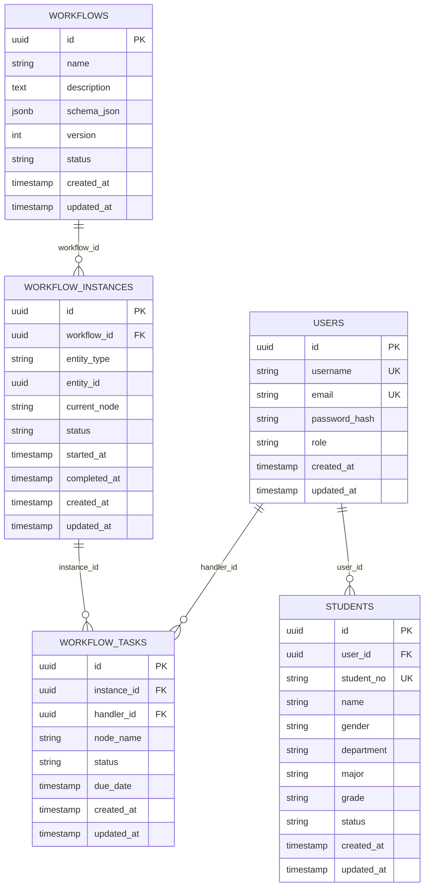
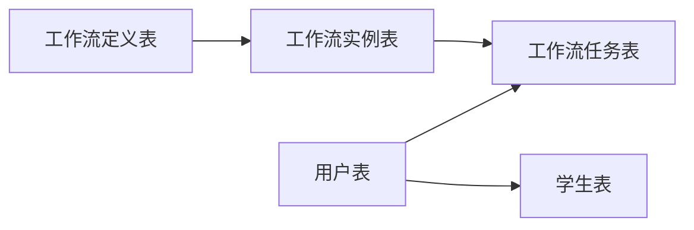

# 核心数据实体

<cite>
**本文引用的文件**   
- [db/schema.ts](file://db/schema.ts)
- [db/index.ts](file://db/index.ts)
- [drizzle-postgres/meta/0000_snapshot.json](file://drizzle-postgres/meta/0000_snapshot.json)
- [drizzle-postgres/meta/0001_snapshot.json](file://drizzle-postgres/meta/0001_snapshot.json)
- [drizzle-postgres/meta/0002_snapshot.json](file://drizzle-postgres/meta/0002_snapshot.json)
- [drizzle-postgres/meta/0003_snapshot.json](file://drizzle-postgres/meta/0003_snapshot.json)
- [drizzle-postgres/0000_fine_psylocke.sql](file://drizzle-postgres/0000_fine_psylocke.sql)
- [drizzle-postgres/0001_thin_queen_noir.sql](file://drizzle-postgres/0001_thin_queen_noir.sql)
- [drizzle-postgres/0002_crazy_ravenous.sql](file://drizzle-postgres/0002_crazy_ravenous.sql)
- [drizzle-postgres/0003_fine_quentin_quire.sql](file://drizzle-postgres/0003_fine_quentin_quire.sql)
- [lib/validation.ts](file://lib/validation.ts)
- [app/api/students/route.ts](file://app/api/students/route.ts)
- [app/api/workflows/route.ts](file://app/api/workflows/route.ts)
- [app/api/workflow/instances/route.ts](file://app/api/workflow/instances/route.ts)
- [app/api/workflow/tasks/route.ts](file://app/api/workflow/tasks/route.ts)
</cite>

## 目录
1. [简介](#简介)
2. [项目结构](#项目结构)
3. [核心组件](#核心组件)
4. [架构总览](#架构总览)
5. [详细组件分析](#详细组件分析)
6. [依赖关系分析](#依赖关系分析)
7. [性能考虑](#性能考虑)
8. [故障排查指南](#故障排查指南)
9. [结论](#结论)
10. [附录](#附录)

## 简介
本文件面向CS1学生事务管理系统的核心数据实体，聚焦用户表、学生表与工作流相关表（工作流定义、实例、任务等）的字段定义、数据类型与约束条件。文档涵盖主键设计、外键关系、索引策略、字段业务含义、验证规则与数据格式要求，并提供实体关系图、示例数据、完整性约束与业务逻辑约束说明，以及数据访问模式与查询优化建议，帮助开发者快速理解并正确使用系统的数据模型。

## 项目结构
与数据模型相关的代码主要位于以下位置：
- 数据库Schema定义与迁移脚本：db/schema.ts、drizzle-postgres/*
- API路由中对实体的读写与校验：app/api/students/*、app/api/workflows/*、app/api/workflow/*
- 通用校验工具：lib/validation.ts

图表来源
- [db/schema.ts](file://db/schema.ts)
- [db/index.ts](file://db/index.ts)
- [drizzle-postgres/0000_fine_psylocke.sql](file://drizzle-postgres/0000_fine_psylocke.sql)
- [drizzle-postgres/0001_thin_queen_noir.sql](file://drizzle-postgres/0001_thin_queen_noir.sql)
- [drizzle-postgres/0002_crazy_ravenous.sql](file://drizzle-postgres/0002_crazy_ravenous.sql)
- [drizzle-postgres/0003_fine_quentin_quire.sql](file://drizzle-postgres/0003_fine_quentin_quire.sql)

章节来源
- [db/schema.ts](file://db/schema.ts)
- [db/index.ts](file://db/index.ts)

## 核心组件
本节概述系统中最关键的数据实体及其职责：
- 用户表：承载系统登录认证与权限主体信息，作为所有操作的责任主体。
- 学生表：承载学生基本信息及与用户的关联关系，支持导入、批量操作与记录归档。
- 工作流定义表：描述可复用的流程模板（表单、节点、流转规则等）。
- 工作流实例表：一次具体业务流程的生命周期载体，绑定到特定学生或业务对象。
- 工作流任务表：流程执行过程中的具体待办事项，包含处理人、状态、时间戳等。

章节来源
- [app/api/students/route.ts](file://app/api/students/route.ts)
- [app/api/workflows/route.ts](file://app/api/workflows/route.ts)
- [app/api/workflow/instances/route.ts](file://app/api/workflow/instances/route.ts)
- [app/api/workflow/tasks/route.ts](file://app/api/workflow/tasks/route.ts)

## 架构总览
下图展示从前端到后端API再到数据库层的调用路径，以及各实体之间的关联关系。

图表来源
- [app/api/students/route.ts](file://app/api/students/route.ts)
- [app/api/workflows/route.ts](file://app/api/workflows/route.ts)
- [app/api/workflow/instances/route.ts](file://app/api/workflow/instances/route.ts)
- [app/api/workflow/tasks/route.ts](file://app/api/workflow/tasks/route.ts)
- [db/index.ts](file://db/index.ts)
- [drizzle-postgres/0000_fine_psylocke.sql](file://drizzle-postgres/0000_fine_psylocke.sql)

## 详细组件分析

### 用户表（users）
- 字段与类型（基于Schema与迁移推断）
  - id：主键，唯一标识用户
  - username：用户名，用于登录与显示
  - email：邮箱，唯一性约束
  - password_hash：密码哈希值
  - role：角色（如管理员、辅导员等）
  - created_at/updated_at：审计时间戳
- 主键与索引
  - 主键：id
  - 唯一索引：username、email
  - 常用查询索引：role（按角色筛选）
- 业务含义与约束
  - 每个用户必须拥有唯一用户名与邮箱
  - 密码需满足安全策略（长度、复杂度），存储为哈希
  - 角色决定权限范围，影响可访问模块与操作
- 验证规则与数据格式
  - 用户名：字母数字组合，长度限制
  - 邮箱：标准邮箱格式
  - 密码：最小长度与复杂度校验
- 示例数据
  - 用户A：管理员，拥有全部权限
  - 用户B：辅导员，负责学生管理与审批

章节来源
- [db/schema.ts](file://db/schema.ts)
- [drizzle-postgres/0000_fine_psylocke.sql](file://drizzle-postgres/0000_fine_psylocke.sql)
- [lib/validation.ts](file://lib/validation.ts)

### 学生表（students）
- 字段与类型（基于Schema与迁移推断）
  - id：主键，唯一标识学生
  - user_id：关联用户表的外键（可选，表示已绑定的系统用户）
  - student_no：学号，唯一性约束
  - name：姓名
  - gender：性别
  - department：院系
  - major：专业
  - grade：年级
  - status：状态（在读、休学、毕业等）
  - created_at/updated_at：审计时间戳
- 主键与索引
  - 主键：id
  - 唯一索引：student_no
  - 常用查询索引：department、major、grade、status
- 业务含义与约束
  - 学号唯一且不可重复
  - 状态变更需遵循业务规则（如毕业不可回退）
  - 与用户表的关联用于登录与授权
- 验证规则与数据格式
  - 学号：固定长度与字符集规范
  - 姓名：非空，长度限制
  - 性别：枚举值
  - 院系/专业/年级：字典值校验
- 示例数据
  - 学生A：计算机学院，软件工程，2021级，在读

章节来源
- [db/schema.ts](file://db/schema.ts)
- [drizzle-postgres/0001_thin_queen_noir.sql](file://drizzle-postgres/0001_thin_queen_noir.sql)
- [app/api/students/route.ts](file://app/api/students/route.ts)
- [lib/validation.ts](file://lib/validation.ts)

### 工作流定义表（workflows）
- 字段与类型（基于Schema与迁移推断）
  - id：主键
  - name：名称
  - description：描述
  - schema_json：表单/节点配置JSON
  - version：版本号
  - status：状态（草稿、发布、下线）
  - created_at/updated_at：审计时间戳
- 主键与索引
  - 主键：id
  - 常用查询索引：name、status
- 业务含义与约束
  - 版本控制确保流程演进可追溯
  - 状态机约束发布流程
- 验证规则与数据格式
  - schema_json：符合预定义JSON Schema
  - 版本：递增整数
- 示例数据
  - 请假流程V1：包含申请、审批、归档节点

章节来源
- [db/schema.ts](file://db/schema.ts)
- [drizzle-postgres/0002_crazy_ravenous.sql](file://drizzle-postgres/0002_crazy_ravenous.sql)
- [app/api/workflows/route.ts](file://app/api/workflows/route.ts)

### 工作流实例表（workflow_instances）
- 字段与类型（基于Schema与迁移推断）
  - id：主键
  - workflow_id：关联工作流定义的外键
  - entity_type：实体类型（如学生、申请单）
  - entity_id：实体ID
  - current_node：当前节点
  - status：状态（进行中、已完成、已取消）
  - started_at/completed_at：开始与结束时间
  - created_at/updated_at：审计时间戳
- 主键与索引
  - 主键：id
  - 常用查询索引：workflow_id、entity_type+entity_id、status
- 业务含义与约束
  - 实例生命周期受状态机约束
  - 与实体强关联，保证业务上下文
- 验证规则与数据格式
  - 状态转换合法（如进行中→已完成）
- 示例数据
  - 实例A：请假流程，学生A，当前节点“辅导员审批”

章节来源
- [db/schema.ts](file://db/schema.ts)
- [drizzle-postgres/0003_fine_quentin_quire.sql](file://drizzle-postgres/0003_fine_quentin_quire.sql)
- [app/api/workflow/instances/route.ts](file://app/api/workflow/instances/route.ts)

### 工作流任务表（workflow_tasks）
- 字段与类型（基于Schema与迁移推断）
  - id：主键
  - instance_id：关联工作流实例的外键
  - handler_id：处理人ID（用户表）
  - node_name：节点名称
  - status：状态（待处理、处理中、已完成、已拒绝）
  - due_date：截止时间
  - created_at/updated_at：审计时间戳
- 主键与索引
  - 主键：id
  - 常用查询索引：instance_id、handler_id、status、due_date
- 业务含义与约束
  - 任务驱动流程推进，处理人明确
  - 超时提醒与逾期统计
- 验证规则与数据格式
  - 处理人必须存在且具备相应权限
  - 截止时间晚于创建时间
- 示例数据
  - 任务A：辅导员审批，处理人B，截止时间为明天

章节来源
- [db/schema.ts](file://db/schema.ts)
- [app/api/workflow/tasks/route.ts](file://app/api/workflow/tasks/route.ts)

### 实体关系图（ERD）

图表来源
- [db/schema.ts](file://db/schema.ts)
- [drizzle-postgres/0000_fine_psylocke.sql](file://drizzle-postgres/0000_fine_psylocke.sql)
- [drizzle-postgres/0001_thin_queen_noir.sql](file://drizzle-postgres/0001_thin_queen_noir.sql)
- [drizzle-postgres/0002_crazy_ravenous.sql](file://drizzle-postgres/0002_crazy_ravenous.sql)
- [drizzle-postgres/0003_fine_quentin_quire.sql](file://drizzle-postgres/0003_fine_quentin_quire.sql)

### 数据完整性与业务逻辑约束
- 完整性约束
  - 主键唯一性：所有表的主键严格唯一
  - 外键约束：学生.user_id、实例.workflow_id、任务.instance_id/handler_id均受外键约束
  - 唯一性约束：用户.username/email、学生.student_no
- 业务逻辑约束
  - 状态机：工作流实例与任务的状态转换必须符合预设规则
  - 权限控制：仅具备相应角色的用户可执行敏感操作（如发布流程、删除学生）
  - 数据一致性：批量导入时需保证学号不重复、必填字段完整

章节来源
- [lib/validation.ts](file://lib/validation.ts)
- [app/api/students/route.ts](file://app/api/students/route.ts)
- [app/api/workflows/route.ts](file://app/api/workflows/route.ts)
- [app/api/workflow/instances/route.ts](file://app/api/workflow/instances/route.ts)
- [app/api/workflow/tasks/route.ts](file://app/api/workflow/tasks/route.ts)

### 数据访问模式与查询优化建议
- 常见访问模式
  - 按学号查询学生详情
  - 按用户角色过滤用户列表
  - 按工作流定义获取实例列表
  - 按处理人与状态查询任务
- 索引策略
  - 为高频查询列建立索引：student_no、role、workflow_id、instance_id、handler_id、status、due_date
  - 复合索引：entity_type+entity_id（实例定位）、handler_id+status（任务筛选）
- 查询优化
  - 使用分页避免全表扫描
  - 避免SELECT *，按需选择字段
  - 对大表JOIN时使用合适索引与条件过滤
  - 对JSON字段进行部分提取与索引（如schema_json.key）

章节来源
- [db/schema.ts](file://db/schema.ts)
- [app/api/students/route.ts](file://app/api/students/route.ts)
- [app/api/workflows/route.ts](file://app/api/workflows/route.ts)
- [app/api/workflow/instances/route.ts](file://app/api/workflow/instances/route.ts)
- [app/api/workflow/tasks/route.ts](file://app/api/workflow/tasks/route.ts)

## 依赖关系分析
- 组件耦合
  - 学生表依赖用户表（user_id外键）
  - 工作流实例依赖工作流定义（workflow_id外键）
  - 工作流任务依赖实例（instance_id外键）与用户（handler_id外键）
- 外部依赖
  - Drizzle ORM用于Schema定义与查询构建
  - PostgreSQL作为持久化存储
- 潜在循环依赖
  - 无直接循环外键；通过中间表与状态机解耦

图表来源
- [db/schema.ts](file://db/schema.ts)
- [drizzle-postgres/0000_fine_psylocke.sql](file://drizzle-postgres/0000_fine_psylocke.sql)
- [drizzle-postgres/0001_thin_queen_noir.sql](file://drizzle-postgres/0001_thin_queen_noir.sql)
- [drizzle-postgres/0002_crazy_ravenous.sql](file://drizzle-postgres/0002_crazy_ravenous.sql)
- [drizzle-postgres/0003_fine_quentin_quire.sql](file://drizzle-postgres/0003_fine_quentin_quire.sql)

章节来源
- [db/schema.ts](file://db/schema.ts)

## 性能考虑
- 索引设计：为高频查询与过滤条件建立合适索引，避免过度索引导致写入性能下降
- 查询计划：使用EXPLAIN分析慢查询，调整WHERE条件与JOIN顺序
- 缓存策略：对热点数据（如字典值、流程定义）引入缓存层
- 批处理：批量导入与更新采用事务与分批提交，减少锁竞争

[本节为通用指导，无需特定文件引用]

## 故障排查指南
- 常见问题
  - 外键约束冲突：检查关联ID是否存在
  - 唯一性约束失败：确认学号/用户名/邮箱是否重复
  - 状态转换错误：核对状态机规则与输入参数
- 调试步骤
  - 查看API日志与错误堆栈
  - 检查数据库迁移是否成功执行
  - 使用测试数据生成器复现问题

章节来源
- [lib/validation.ts](file://lib/validation.ts)
- [app/api/students/route.ts](file://app/api/students/route.ts)
- [app/api/workflows/route.ts](file://app/api/workflows/route.ts)
- [app/api/workflow/instances/route.ts](file://app/api/workflow/instances/route.ts)
- [app/api/workflow/tasks/route.ts](file://app/api/workflow/tasks/route.ts)

## 结论
通过对用户表、学生表与工作流相关实体的深入分析，明确了字段定义、约束与索引策略，提供了实体关系图与示例数据，并给出数据访问模式与优化建议。遵循完整性与业务逻辑约束，结合合理的索引与查询策略，可有效提升系统稳定性与性能。

[本节为总结性内容，无需特定文件引用]

## 附录
- 术语表
  - 工作流定义：流程模板，描述节点与流转规则
  - 工作流实例：一次具体的流程执行
  - 工作流任务：流程中的待办事项
- 参考文件
  - Schema定义：db/schema.ts
  - 迁移脚本：drizzle-postgres/*.sql
  - API路由：app/api/students/*、app/api/workflows/*、app/api/workflow/*
  - 校验工具：lib/validation.ts

[本节为补充信息，无需特定文件引用]